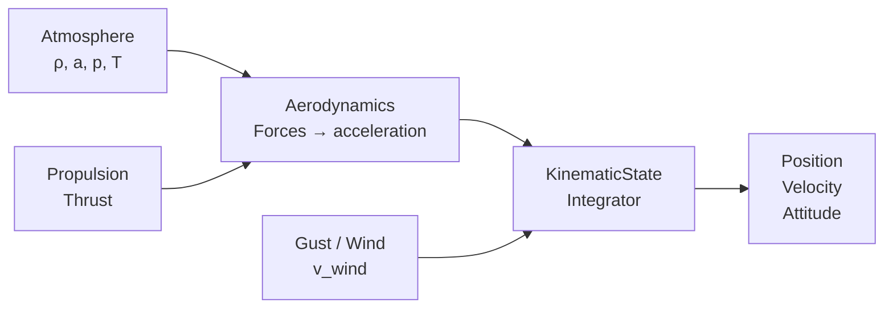
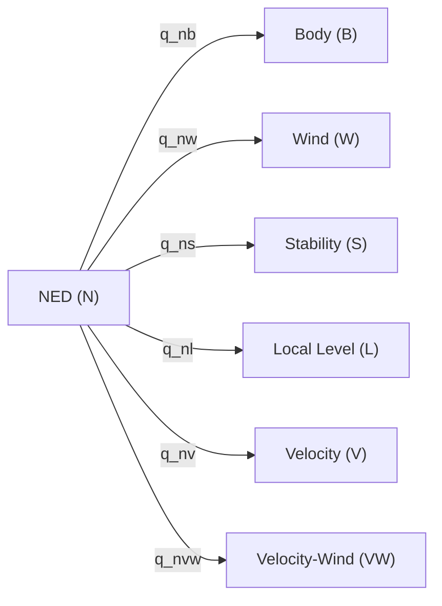
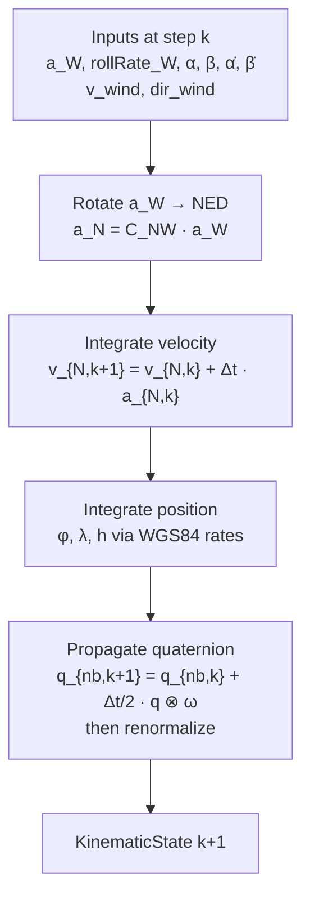

# Equations of Motion

## Overview

LiteAeroSim uses a **point-mass kinematic model** driven by externally computed accelerations. The aerodynamics, propulsion, and atmosphere subsystems compute the net acceleration in the Wind frame; the kinematic integrator propagates position, velocity, and attitude. This separation keeps each subsystem testable in isolation.

---

## Reference Frames

### Frame Definitions

| Frame | Symbol | Origin / Orientation |
|---|---|---|
| NED | $N$ | North-East-Down, fixed to Earth surface at datum point |
| Body | $B$ | Origin at aircraft CG; $x$ forward, $y$ right, $z$ down |
| Wind | $W$ | $x$ along airmass-relative velocity, $z$ in body symmetry plane pointing down |
| Stability | $S$ | $x$ in symmetry plane along velocity vector projection, $z$ down |
| Local Level | $L$ | Horizontal plane tangent to Earth at current position |
| Velocity | $V$ | $x$ along ground-relative velocity; $y$ horizontal, perpendicular to velocity; $z$ in vertical velocity plane, positive downward |
| Velocity-Wind | $VW$ | Same as $V$ using airmass-relative velocity $\mathbf{v}_{air} = \mathbf{v}_N - \mathbf{v}_{wind}$ |
| Plane of Motion | $P$ | Frenet frame of the airmass velocity path: $x$ along velocity, $y$ toward center of curvature ($\hat{y}_P \cdot \mathbf{a} > 0$), $z$ binormal ($\hat{z}_P = \hat{x}_P \times \hat{y}_P$, direction of $\mathbf{v} \times \mathbf{a}$) |

### Frame Relationships

All rotations are quaternions $q_{XY}$ mapping vectors from frame $Y$ to frame $X$:

$$\mathbf{v}_X = q_{XY} \otimes \mathbf{v}_Y \otimes q_{XY}^*$$

Where matrix arithmetic is more convenient, $C_{XY}$ denotes the **Direction Cosine Matrix** (DCM) — the coordinate transformation matrix — corresponding to the same rotation:

$$\mathbf{v}_X = C_{XY}\,\mathbf{v}_Y$$

The DCM and the quaternion are two algebraic realizations of the same underlying geometric rotation. The choice between them is one of computational convenience; neither is "the rotation" itself.

---

## Velocity and Velocity-Wind Frames

### Velocity Frame (V)

The Velocity frame $V$ has its $x$-axis along the ground-relative velocity vector $\mathbf{v}_N$ and its $y$-axis confined to the local horizontal plane. Starting from NED, it is reached by yawing to the track angle $\chi$ then pitching by $-\gamma$:

$$
C_{VN} = C_y(-\gamma)\,C_z(\chi)
$$

| Axis | Direction |
|---|---|
| $\hat{x}_V$ | Unit ground-relative velocity vector |
| $\hat{y}_V$ | Horizontal, perpendicular to velocity, positive to the right of the velocity heading |
| $\hat{z}_V$ | In the vertical plane containing $\hat{x}_V$; perpendicular to $\hat{x}_V$; positive downward |

where $\chi = \arctan(v_E / v_N)$ is the track angle and $\gamma = -\arcsin(v_D / V_G)$ is the flight path angle ($V_G = \|\mathbf{v}_N\|$).

### Velocity-Wind Frame (VW)

The Velocity-Wind frame $VW$ has identical axis geometry to $V$ but is constructed from the airmass-relative velocity:

$$
\mathbf{v}_{air} = \mathbf{v}_N - \mathbf{v}_{wind}
$$

where $\mathbf{v}_{wind}$ is the wind transport velocity expressed in NED. The DCM from NED to $VW$ is:

$$
C_{VW,N} = C_y(-\gamma_a)\,C_z(\chi_a)
$$

with $\chi_a$, $\gamma_a$ the track and flight path angles of $\mathbf{v}_{air}$. When wind is zero, $V = VW$.

### Relationship to Wind Frame W

The Wind frame $W$ and $VW$ share the same $x$-axis (airmass-relative velocity vector). They differ by a roll about that axis by the **wind-axis bank angle** $\mu$:

$$
C_{VW,W} = C_x(\mu)
$$

For coordinated, wings-level flight $\mu = 0$ and the frames coincide.

---

## Aerodynamic Angles

### Angle of Attack $\alpha$

The angle of attack is measured in the body symmetry plane between the velocity vector projection and the body $x$-axis:

$$
\alpha = \arctan\!\left(\frac{v_{B,z}}{v_{B,x}}\right)
$$

### Sideslip Angle $\beta$

The sideslip is the angle between the velocity vector and the body symmetry plane:

$$
\beta = \arcsin\!\left(\frac{v_{B,y}}{\|\mathbf{v}_B\|}\right)
$$

### Wind-to-Body Rotation

The rotation from Wind frame to Body frame is defined by $\alpha$ and $\beta$. Its DCM is the product of two elementary rotation matrices:

$$
C_{BW} = C_y(\alpha)\, C_z(-\beta)
$$

The Wind-to-NED quaternion follows from the Body-to-NED quaternion and the Wind-to-Body relationship:

$$
q_{nw} = q_{nb} \otimes q_{bw}
$$

---

## Attitude Kinematics — Quaternion ODE

Attitude is represented as the unit quaternion $q_{nb}$ (Body-to-NED). The quaternion evolves according to:

$$
\dot{q}_{nb} = \frac{1}{2}\, q_{nb} \otimes \boldsymbol{\omega}_{B/N,\times}^B
$$

where $\boldsymbol{\omega}_{B/N}^B = [p,\ q,\ r]^T$ is the angular velocity of the Body frame relative to NED, expressed in Body frame coordinates (rad/s), and $\boldsymbol{\omega}_{B/N,\times}^B$ denotes the pure quaternion $[0,\ p,\ q,\ r]^T$.

Discretized with forward Euler at timestep $\Delta t$:

$$
q_{nb,k+1} = q_{nb,k} + \frac{\Delta t}{2}\, q_{nb,k} \otimes [0,\ p_k,\ q_k,\ r_k]^T
$$

The result is renormalized to unit length after each step to prevent drift:

$$
q_{nb,k+1} \leftarrow \frac{q_{nb,k+1}}{\|q_{nb,k+1}\|}
$$

---

## Velocity Kinematics — Wind Frame Input

The kinematic model accepts net acceleration expressed in the Wind frame $\mathbf{a}_W$ (output of the aerodynamics and propulsion subsystems). It is rotated to NED before integration. Using the DCM $C_{NW}$ or equivalently the quaternion $q_{nw}$:

$$
\mathbf{a}_N = C_{NW}\, \mathbf{a}_W = q_{nw} \otimes \mathbf{a}_W \otimes q_{nw}^*
$$

Velocity in NED is integrated with forward Euler:

$$
\mathbf{v}_{N,k+1} = \mathbf{v}_{N,k} + \Delta t\, \mathbf{a}_{N,k}
$$

---

## Position Kinematics — WGS84 Integration

Position is stored as a WGS84 geodetic datum $(\varphi, \lambda, h)$ (latitude, longitude, altitude). The NED velocity is converted to geodetic rates using the Earth radii of curvature.

### Radii of Curvature

The WGS84 ellipsoid has semi-major axis $a = 6{,}378{,}137.0\,\text{m}$ and flattening $f = 1/298.257223563$. The first eccentricity squared is $e^2 = 2f - f^2$.

The **meridional radius** (north–south):

$$
M(\varphi) = \frac{a(1 - e^2)}{\left(1 - e^2 \sin^2\varphi\right)^{3/2}}
$$

The **normal radius** (east–west):

$$
N(\varphi) = \frac{a}{\sqrt{1 - e^2 \sin^2\varphi}}
$$

### Geodetic Rate Equations

$$
\dot{\varphi} = \frac{v_N}{M(\varphi) + h}, \qquad
\dot{\lambda} = \frac{v_E}{\bigl(N(\varphi) + h\bigr)\cos\varphi}, \qquad
\dot{h} = -v_D
$$

where $v_N$, $v_E$, $v_D$ are the NED velocity components.

Integrated with forward Euler:

$$
\varphi_{k+1} = \varphi_k + \Delta t\, \dot{\varphi}_k, \quad
\lambda_{k+1} = \lambda_k + \Delta t\, \dot{\lambda}_k, \quad
h_{k+1}       = h_k       + \Delta t\, \dot{h}_k
$$

---

## Euler Angles (3-2-1 Convention)

Euler angles $(\phi,\, \theta,\, \psi)$ — roll, pitch, heading — parameterize the 3-2-1 (ZYX) rotation sequence from Body to NED. The DCM of this rotation factors as:

$$
C_{NB} = C_z(\psi)\, C_y(\theta)\, C_x(\phi)
$$

From the quaternion $q = [w,\ x,\ y,\ z]^T$:

$$
\phi   = \arctan\!\left(\frac{2(wx + yz)}{1 - 2(x^2 + y^2)}\right)
$$

$$
\theta = \arcsin\!\bigl(2(wy - zx)\bigr)
$$

$$
\psi   = \arctan\!\left(\frac{2(wz + xy)}{1 - 2(y^2 + z^2)}\right)
$$

---

## Body Rate–Euler Rate Kinematics

The relationship between body angular rates $[p,\, q,\, r]^T$ and Euler angle rates $[\dot\phi,\, \dot\theta,\, \dot\psi]^T$ is:

$$
\begin{bmatrix} p \\ q \\ r \end{bmatrix}
=
\begin{bmatrix}
1 & 0 & -\sin\theta \\
0 & \cos\phi & \sin\phi\cos\theta \\
0 & -\sin\phi & \cos\phi\cos\theta
\end{bmatrix}
\begin{bmatrix} \dot\phi \\ \dot\theta \\ \dot\psi \end{bmatrix}
$$

Inverted (for extracting Euler rates from body rates):

$$
\begin{bmatrix} \dot\phi \\ \dot\theta \\ \dot\psi \end{bmatrix}
=
\begin{bmatrix}
1 & \sin\phi\tan\theta & \cos\phi\tan\theta \\
0 & \cos\phi           & -\sin\phi \\
0 & \sin\phi/\cos\theta & \cos\phi/\cos\theta
\end{bmatrix}
\begin{bmatrix} p \\ q \\ r \end{bmatrix}
$$

This expression is singular at $\theta = \pm 90°$ (gimbal lock). The quaternion ODE is used for attitude propagation; Euler angles are extracted for output and control only.

---

## Body Rates from Wind Frame Rates

The Body frame attitude is determined by applying $\alpha$ and $\beta$ to the Wind frame — the Wind frame orientation is established first (from the velocity vector and wind), and the Body frame follows from the aerodynamic angles. Body angular rates $[p,\,q,\,r]^T$ are therefore derived from the Wind frame angular velocity $[p_W,\,q_W,\,r_W]^T$ and the rates of the aerodynamic angles.

### Direction Cosine Matrix: Wind to Body

The rotation from Wind frame to Body frame is composed of two elementary rotations: a yaw by $-\beta$ about $\hat{z}_W$, followed by a pitch by $\alpha$ about the intermediate $y$-axis. Its DCM — which transforms component vectors from Wind to Body coordinates — is:

$$
C_{BW} = C_y(\alpha)\,C_z(-\beta)
$$

where $C_y(\cdot)$ and $C_z(\cdot)$ denote the DCMs of elementary rotations about the respective axes. Expanding the product:

$$
C_{BW} =
\begin{bmatrix}
\cos\alpha\cos\beta & -\cos\alpha\sin\beta & -\sin\alpha \\
\sin\beta           &  \cos\beta           &  0          \\
\sin\alpha\cos\beta & -\sin\alpha\sin\beta &  \cos\alpha
\end{bmatrix}
$$

Verification: the velocity vector $\mathbf{v}_W = V[1,0,0]^T$ maps to $C_{BW}\,\mathbf{v}_W = V[\cos\alpha\cos\beta,\ \sin\beta,\ \sin\alpha\cos\beta]^T$, recovering the standard definitions of $\alpha$ and $\beta$.

### Angular Velocity Decomposition

The angular velocity of the Body frame relative to NED equals the angular velocity of the Wind frame relative to NED plus the angular velocity of Body relative to Wind, with all terms expressed in Body frame coordinates:

$$
\boldsymbol{\omega}_{B/N}^B = C_{BW}\,\boldsymbol{\omega}_{W/N}^W + \boldsymbol{\omega}_{B/W}^B
$$

where $\boldsymbol{\omega}_{W/N}^W = [p_W,\,q_W,\,r_W]^T$ is the Wind frame angular velocity relative to NED, expressed in Wind frame coordinates.

### Contribution from Aerodynamic Angle Rates

Because the rotation from Wind to Body is parameterized by $\alpha$ and $\beta$, its DCM $C_{BW}$ changes whenever $\alpha$ or $\beta$ change, contributing angular velocity:

- $C_z(-\beta)$: intermediate frame S rotates relative to Wind about $\hat{z}_W$ at rate $-\dot\beta$. Expressed in Body frame: $C_y(\alpha)\,[0,\,0,\,-\dot\beta]^T$.
- $C_y(\alpha)$: Body rotates relative to S about $\hat{y}_B$ at rate $+\dot\alpha$. Expressed in Body frame: $[0,\,\dot\alpha,\,0]^T$.

$$
\boldsymbol{\omega}_{B/W}^B
= C_y(\alpha)\begin{bmatrix}0\\0\\-\dot\beta\end{bmatrix} + \begin{bmatrix}0\\\dot\alpha\\0\end{bmatrix}
= \begin{bmatrix}\dot\beta\sin\alpha\\\dot\alpha\\-\dot\beta\cos\alpha\end{bmatrix}
$$

### Body Rate Equations

Combining the Wind frame contribution and the aerodynamic angle rate contribution:

$$
\boxed{
\begin{bmatrix}p\\q\\r\end{bmatrix}
=
\begin{bmatrix}
\cos\alpha\cos\beta & -\cos\alpha\sin\beta & -\sin\alpha \\
\sin\beta           &  \cos\beta           &  0 \\
\sin\alpha\cos\beta & -\sin\alpha\sin\beta &  \cos\alpha
\end{bmatrix}
\begin{bmatrix}p_W\\q_W\\r_W\end{bmatrix}
+
\begin{bmatrix}\dot\beta\sin\alpha\\\dot\alpha\\-\dot\beta\cos\alpha\end{bmatrix}
}
$$

Expanded:

$$
p = p_W\cos\alpha\cos\beta - q_W\cos\alpha\sin\beta - r_W\sin\alpha + \dot\beta\sin\alpha
$$

$$
q = p_W\sin\beta + q_W\cos\beta + \dot\alpha
$$

$$
r = p_W\sin\alpha\cos\beta - q_W\sin\alpha\sin\beta + r_W\cos\alpha - \dot\beta\cos\alpha
$$

### Wind Frame Angular Velocity Components

| Component | Description | Source |
|---|---|---|
| $p_W$ | Roll rate about the velocity vector | Input to `KinematicState::step()` |
| $q_W$ | Pitch rate of the velocity vector (rate of change of flight path angle $\gamma_a$) | Derived from the Plane of Motion frame — see below |
| $r_W$ | Yaw rate of the velocity vector (horizontal curvature of the airmass-relative path) | Derived from the Plane of Motion frame — see below |

$p_W$ is a direct control input. $q_W$ and $r_W$ are computed from the centripetal acceleration decomposed in the VW frame; the derivation is given in [Plane of Motion Frame](#plane-of-motion-frame) below.

---

## Plane of Motion Frame

The Plane of Motion (POM) frame $P$ is the Frenet frame of the airmass-relative velocity path. It is an ephemeral, non-stored frame computed at each step from the instantaneous airmass velocity $\mathbf{v}$ (speed $V = |\mathbf{v}|$) and net acceleration $\mathbf{a}$.

### Frame Definition

1. **Tangent** (first axis, along velocity):
$$
\hat{x}_P = \frac{\mathbf{v}}{V}
$$

2. **Centripetal acceleration** (component of $\mathbf{a}$ perpendicular to velocity):
$$
\mathbf{a}_\perp = \mathbf{a} - (\mathbf{a} \cdot \hat{x}_P)\,\hat{x}_P
$$

3. **Normal** (second axis, toward center of curvature):
$$
\hat{y}_P = \frac{\mathbf{a}_\perp}{|\mathbf{a}_\perp|}
$$

4. **Binormal** (third axis, in direction of $\mathbf{v} \times \mathbf{a}$):
$$
\hat{z}_P = \hat{x}_P \times \hat{y}_P
$$

The velocity vector rotates entirely within the $\hat{x}_P$–$\hat{y}_P$ (tangent–normal) plane; $\hat{z}_P$ is perpendicular to the plane of motion.

### Wind Frame Turning Rates

The velocity direction changes at the curvature rate $|\mathbf{a}_\perp| / V$ (rotation about the binormal $\hat{z}_P$). To obtain $q_W$ and $r_W$, express $\mathbf{a}_\perp$ in the VW frame. Since $\mathbf{a}_\perp \perp \hat{x}_{VW}$ by construction, only the $y$- and $z$-components are nonzero:

$$
\mathbf{a}_\perp^{VW} = \begin{bmatrix} 0 \\ a_{\perp,y} \\ a_{\perp,z} \end{bmatrix}
$$

where $a_{\perp,y}$ is the horizontal component (positive rightward) and $a_{\perp,z}$ is the in-plane vertical component (positive downward in the velocity plane). The turning rates follow from $\boldsymbol{\omega}_{W/N}^{VW} \times \hat{x}_{VW} = \mathbf{a}_\perp^{VW}/V$:

$$
q_W = -\frac{a_{\perp,z}}{V}, \qquad r_W = \frac{a_{\perp,y}}{V}
$$

**Sign convention**: $q_W > 0$ when the velocity vector pitches upward (flight path angle $\gamma_a$ increases); $r_W > 0$ when the velocity vector yaws rightward.

### POM from Aerodynamic Forces

Given lift $\mathbf{L}$ (perpendicular to $\mathbf{v}$), drag $\mathbf{D}$ (opposing $\mathbf{v}$), thrust $\mathbf{T}$, and gravity $m\mathbf{g}$ (in NED):

$$
\mathbf{a} = \frac{\mathbf{L} + \mathbf{D} + \mathbf{T}}{m} + \mathbf{g}
$$

The tangential acceleration (changes speed, does not curve the path):

$$
a_\parallel = \mathbf{a} \cdot \hat{x}_P = \frac{T - D}{m} - g\sin\gamma_a
$$

The centripetal acceleration (defines the POM orientation):

$$
\mathbf{a}_\perp = \mathbf{a} - a_\parallel\,\hat{x}_P = \frac{\mathbf{L}}{m} + \mathbf{g}_\perp
$$

where $\mathbf{g}_\perp = \mathbf{g} - (\mathbf{g} \cdot \hat{x}_P)\hat{x}_P$ is the component of gravity perpendicular to the velocity vector. The total acceleration $\mathbf{a}$ lies in the POM by construction — the POM is defined as the plane spanned by $\hat{x}_P$ and $\hat{a}$. Individual force components (lift, thrust, gravity) need not each lie in the POM; it is their vector sum that determines the normal direction $\hat{y}_P$ and therefore the binormal $\hat{z}_P$.

---

## Aerodynamic Angle Rates

The angles $\alpha$ and $\beta$, together with their rates $\dot\alpha$ and $\dot\beta$, are computed by the Aerodynamics subsystem and passed as inputs to `KinematicState::step()`. They are derived from aerodynamic forces using first-order (linear) aerodynamic models.

### Angle of Attack Rate $\dot\alpha$

In the linear aerodynamic model, lift is proportional to $\alpha$:

$$
L = q_\infty S C_{L_\alpha}\,\alpha, \qquad q_\infty = \tfrac{1}{2}\rho V^2
$$

where $S$ is the reference area and $C_{L_\alpha}$ is the lift-curve slope. The instantaneous angle of attack:

$$
\alpha = \frac{L}{q_\infty S C_{L_\alpha}}
$$

Differentiating and applying the quasi-steady approximation ($\dot{q}_\infty \ll q_\infty / \Delta t$ over one timestep):

$$
\dot\alpha \approx \frac{\dot L}{q_\infty S C_{L_\alpha}}
$$

### Sideslip Rate $\dot\beta$

By the same argument applied to the lateral aerodynamic force (side force) $Y$:

$$
Y = q_\infty S C_{Y_\beta}\,\beta
$$

$$
\beta = \frac{Y}{q_\infty S C_{Y_\beta}}, \qquad \dot\beta \approx \frac{\dot Y}{q_\infty S C_{Y_\beta}}
$$

where $C_{Y_\beta}$ is the side-force derivative (typically negative for a statically stable aircraft, with the convention that positive $Y$ acts in the $+\hat{y}_B$ direction).

### Geometric Interpretation

$\dot\alpha$ is the angular rate at which the body $x$-axis rotates relative to the velocity vector within the body symmetry plane. $\dot\beta$ is the rate of lateral drift of the velocity vector out of the symmetry plane. Both terms appear directly in the $\boldsymbol{\omega}_{B/W}^B$ contribution to the body rate equations.

---

## Derived Quantities

| Quantity | Expression | Unit |
|---|---|---|
| Airspeed | $V = \|\mathbf{v}_W\|$ | m/s |
| Ground speed | $V_G = \|\mathbf{v}_N\|$ | m/s |
| Flight path angle | $\gamma = -\arcsin(v_D / V_G)$ | rad |
| Track angle | $\chi = \arctan(v_E / v_N)$ | rad |
| Crab angle | $\xi = \chi - \psi$ | rad |
| Load factor | $n = \|\mathbf{a}_W\| / g$ | — |

---

## Integration Scheme Summary

All integration uses **forward Euler** at a fixed timestep $\Delta t$ set in `KinematicState::step()`. Higher-order integration (RK4) is a future option for improved long-horizon accuracy.

---

## Implementation Notes

- Attitude: `KinematicState::_q_nb` (Body-to-NED quaternion, `Eigen::Quaternionf`)
- Body rates: `KinematicState::_rates_Body_rps` (p, q, r in rad/s)
- NED velocity: `KinematicState::_velocity_NED_mps`
- NED acceleration: `KinematicState::_acceleration_NED_mps`
- Position: `KinematicState::_positionDatum` (WGS84 lat/lon/alt)
- Aerodynamic angles α, β are inputs to `step()` — computed by aerodynamics subsystem, not integrated here
- All stored values are SI: radians, meters, seconds
