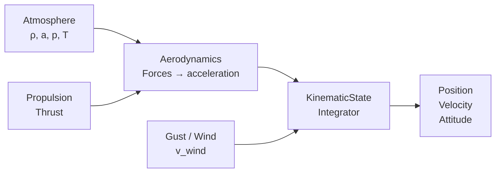
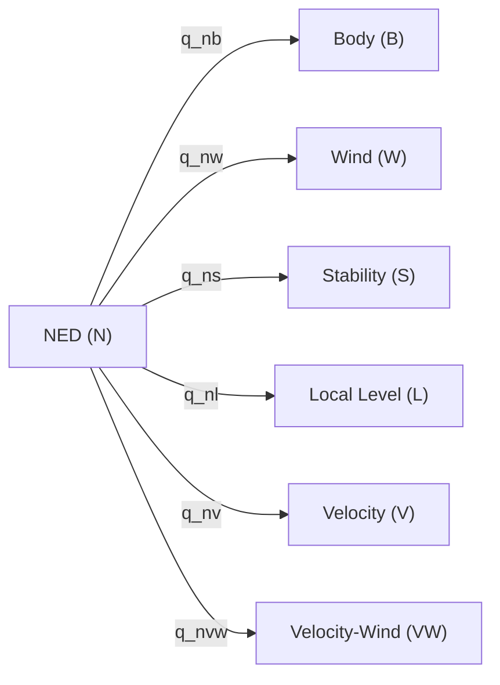
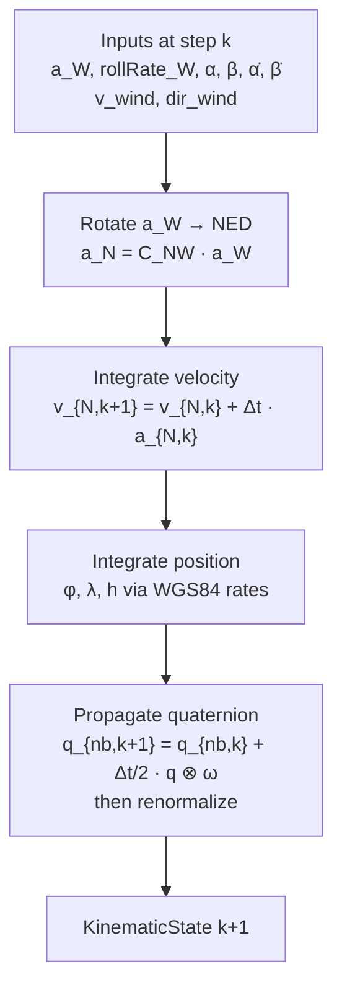

# Equations of Motion

## Overview

LiteAeroSim uses a **point-mass kinematic model** driven by externally computed accelerations. The aerodynamics, propulsion, and atmosphere subsystems compute the net acceleration in the Wind frame; the kinematic integrator propagates position, velocity, and attitude. This separation keeps each subsystem testable in isolation.

---

## Reference Frames

### Frame Definitions

| Frame | Symbol | Origin / Orientation |
|---|---|---|
| NED | $N$ | North-East-Down, fixed to Earth surface at datum point |
| Body | $B$ | Origin at aircraft CG; $x$ forward, $y$ right, $z$ down |
| Wind | $W$ | $x$ along airmass-relative velocity, $z$ in body symmetry plane pointing down |
| Stability | $S$ | $x$ in symmetry plane along velocity vector projection, $z$ down |
| Local Level | $L$ | Horizontal plane tangent to Earth at current position |
| Velocity | $V$ | $x$ along ground-relative velocity; $y$ horizontal, perpendicular to velocity; $z$ in vertical velocity plane, positive downward |
| Velocity-Wind | $VW$ | Same as $V$ using airmass-relative velocity $\mathbf{v}_{air} = \mathbf{v}_N - \mathbf{v}_{wind}$ |
| Plane of Motion | $P$ | Frenet frame of the airmass velocity path: $x$ along velocity, $y$ toward center of curvature ($\hat{y}_P \cdot \mathbf{a} > 0$), $z$ binormal ($\hat{z}_P = \hat{x}_P \times \hat{y}_P$, direction of $\mathbf{v} \times \mathbf{a}$) |

### Frame Relationships

All rotations are quaternions $q_{XY}$ mapping vectors from frame $Y$ to frame $X$:

$$\mathbf{v}_X = q_{XY} \otimes \mathbf{v}_Y \otimes q_{XY}^*$$

Where matrix arithmetic is more convenient, $C_{XY}$ denotes the **Direction Cosine Matrix** (DCM) — the coordinate transformation matrix — corresponding to the same rotation:

$$\mathbf{v}_X = C_{XY}\,\mathbf{v}_Y$$

The DCM and the quaternion are two algebraic realizations of the same underlying geometric rotation. The choice between them is one of computational convenience; neither is "the rotation" itself.

---

## Velocity and Velocity-Wind Frames

### Velocity Frame (V)

The Velocity frame $V$ has its $x$-axis along the ground-relative velocity vector $\mathbf{v}_N$ and its $y$-axis confined to the local horizontal plane. Starting from NED, it is reached by yawing to the track angle $\chi$ then pitching by $-\gamma$:

$$
C_{VN} = C_y(-\gamma)\,C_z(\chi)
$$

| Axis | Direction |
|---|---|
| $\hat{x}_V$ | Unit ground-relative velocity vector |
| $\hat{y}_V$ | Horizontal, perpendicular to velocity, positive to the right of the velocity heading |
| $\hat{z}_V$ | In the vertical plane containing $\hat{x}_V$; perpendicular to $\hat{x}_V$; positive downward |

where $\chi = \arctan(v_E / v_N)$ is the track angle and $\gamma = -\arcsin(v_D / V_G)$ is the flight path angle ($V_G = \|\mathbf{v}_N\|$).

### Velocity-Wind Frame (VW)

The Velocity-Wind frame $VW$ has identical axis geometry to $V$ but is constructed from the airmass-relative velocity:

$$
\mathbf{v}_{air} = \mathbf{v}_N - \mathbf{v}_{wind}
$$

where $\mathbf{v}_{wind}$ is the wind transport velocity expressed in NED. The DCM from NED to $VW$ is:

$$
C_{VW,N} = C_y(-\gamma_a)\,C_z(\chi_a)
$$

with $\chi_a$, $\gamma_a$ the track and flight path angles of $\mathbf{v}_{air}$. When wind is zero, $V = VW$.

### Relationship to Wind Frame W

The Wind frame $W$ and $VW$ share the same $x$-axis (airmass-relative velocity vector). They differ by a roll about that axis by the **wind-axis bank angle** $\mu$:

$$
C_{VW,W} = C_x(\mu)
$$

For coordinated, wings-level flight $\mu = 0$ and the frames coincide.

---

## Aerodynamic Angles

### Angle of Attack $\alpha$

The angle of attack is measured in the body symmetry plane between the velocity vector projection and the body $x$-axis:

$$
\alpha = \arctan\!\left(\frac{v_{B,z}}{v_{B,x}}\right)
$$

### Sideslip Angle $\beta$

The sideslip is the angle between the velocity vector and the body symmetry plane:

$$
\beta = \arcsin\!\left(\frac{v_{B,y}}{\|\mathbf{v}_B\|}\right)
$$

### Wind-to-Body Rotation

The rotation from Wind frame to Body frame is defined by $\alpha$ and $\beta$. Its DCM is the product of two elementary rotation matrices:

$$
C_{BW} = C_y(\alpha)\, C_z(-\beta)
$$

The Wind-to-NED quaternion follows from the Body-to-NED quaternion and the Wind-to-Body relationship:

$$
q_{nw} = q_{nb} \otimes q_{bw}
$$

---

## Attitude Kinematics — Quaternion ODE

Attitude is represented as the unit quaternion $q_{nb}$ (Body-to-NED). The quaternion evolves according to:

$$
\dot{q}_{nb} = \frac{1}{2}\, q_{nb} \otimes \boldsymbol{\omega}_{B/N,\times}^B
$$

where $\boldsymbol{\omega}_{B/N}^B = [p,\ q,\ r]^T$ is the angular velocity of the Body frame relative to NED, expressed in Body frame coordinates (rad/s), and $\boldsymbol{\omega}_{B/N,\times}^B$ denotes the pure quaternion $[0,\ p,\ q,\ r]^T$.

Discretized with forward Euler at timestep $\Delta t$:

$$
q_{nb,k+1} = q_{nb,k} + \frac{\Delta t}{2}\, q_{nb,k} \otimes [0,\ p_k,\ q_k,\ r_k]^T
$$

The result is renormalized to unit length after each step to prevent drift:

$$
q_{nb,k+1} \leftarrow \frac{q_{nb,k+1}}{\|q_{nb,k+1}\|}
$$

---

## Velocity Kinematics — Wind Frame Input

The kinematic model accepts net acceleration expressed in the Wind frame $\mathbf{a}_W$ (output of the aerodynamics and propulsion subsystems). It is rotated to NED before integration. Using the DCM $C_{NW}$ or equivalently the quaternion $q_{nw}$:

$$
\mathbf{a}_N = C_{NW}\, \mathbf{a}_W = q_{nw} \otimes \mathbf{a}_W \otimes q_{nw}^*
$$

Velocity in NED is integrated with forward Euler:

$$
\mathbf{v}_{N,k+1} = \mathbf{v}_{N,k} + \Delta t\, \mathbf{a}_{N,k}
$$

---

## Position Kinematics — WGS84 Integration

Position is stored as a WGS84 geodetic datum $(\varphi, \lambda, h)$ (latitude, longitude, altitude). The NED velocity is converted to geodetic rates using the Earth radii of curvature.

### Radii of Curvature

The WGS84 ellipsoid has semi-major axis $a = 6{,}378{,}137.0\,\text{m}$ and flattening $f = 1/298.257223563$. The first eccentricity squared is $e^2 = 2f - f^2$.

The **meridional radius** (north–south):

$$
M(\varphi) = \frac{a(1 - e^2)}{\left(1 - e^2 \sin^2\varphi\right)^{3/2}}
$$

The **normal radius** (east–west):

$$
N(\varphi) = \frac{a}{\sqrt{1 - e^2 \sin^2\varphi}}
$$

### Geodetic Rate Equations

$$
\dot{\varphi} = \frac{v_N}{M(\varphi) + h}, \qquad
\dot{\lambda} = \frac{v_E}{\bigl(N(\varphi) + h\bigr)\cos\varphi}, \qquad
\dot{h} = -v_D
$$

where $v_N$, $v_E$, $v_D$ are the NED velocity components.

Integrated with forward Euler:

$$
\varphi_{k+1} = \varphi_k + \Delta t\, \dot{\varphi}_k, \quad
\lambda_{k+1} = \lambda_k + \Delta t\, \dot{\lambda}_k, \quad
h_{k+1}       = h_k       + \Delta t\, \dot{h}_k
$$

---

## Euler Angles (3-2-1 Convention)

Euler angles $(\phi,\, \theta,\, \psi)$ — roll, pitch, heading — parameterize the 3-2-1 (ZYX) rotation sequence from Body to NED. The DCM of this rotation factors as:

$$
C_{NB} = C_z(\psi)\, C_y(\theta)\, C_x(\phi)
$$

From the quaternion $q = [w,\ x,\ y,\ z]^T$:

$$
\phi   = \arctan\!\left(\frac{2(wx + yz)}{1 - 2(x^2 + y^2)}\right)
$$

$$
\theta = \arcsin\!\bigl(2(wy - zx)\bigr)
$$

$$
\psi   = \arctan\!\left(\frac{2(wz + xy)}{1 - 2(y^2 + z^2)}\right)
$$

---

## Body Rate–Euler Rate Kinematics

The relationship between body angular rates $[p,\, q,\, r]^T$ and Euler angle rates $[\dot\phi,\, \dot\theta,\, \dot\psi]^T$ is:

$$
\begin{bmatrix} p \\ q \\ r \end{bmatrix}
=
\begin{bmatrix}
1 & 0 & -\sin\theta \\
0 & \cos\phi & \sin\phi\cos\theta \\
0 & -\sin\phi & \cos\phi\cos\theta
\end{bmatrix}
\begin{bmatrix} \dot\phi \\ \dot\theta \\ \dot\psi \end{bmatrix}
$$

Inverted (for extracting Euler rates from body rates):

$$
\begin{bmatrix} \dot\phi \\ \dot\theta \\ \dot\psi \end{bmatrix}
=
\begin{bmatrix}
1 & \sin\phi\tan\theta & \cos\phi\tan\theta \\
0 & \cos\phi           & -\sin\phi \\
0 & \sin\phi/\cos\theta & \cos\phi/\cos\theta
\end{bmatrix}
\begin{bmatrix} p \\ q \\ r \end{bmatrix}
$$

This expression is singular at $\theta = \pm 90°$ (gimbal lock). The quaternion ODE is used for attitude propagation; Euler angles are extracted for output and control only.

---

## Body Rates from Wind Frame Rates

The Body frame attitude is determined by applying $\alpha$ and $\beta$ to the Wind frame — the Wind frame orientation is established first (from the velocity vector and wind), and the Body frame follows from the aerodynamic angles. Body angular rates $[p,\,q,\,r]^T$ are therefore derived from the Wind frame angular velocity $[p_W,\,q_W,\,r_W]^T$ and the rates of the aerodynamic angles.

### Direction Cosine Matrix: Wind to Body

The rotation from Wind frame to Body frame is composed of two elementary rotations: a yaw by $-\beta$ about $\hat{z}_W$, followed by a pitch by $\alpha$ about the intermediate $y$-axis. Its DCM — which transforms component vectors from Wind to Body coordinates — is:

$$
C_{BW} = C_y(\alpha)\,C_z(-\beta)
$$

where $C_y(\cdot)$ and $C_z(\cdot)$ denote the DCMs of elementary rotations about the respective axes. Expanding the product:

$$
C_{BW} =
\begin{bmatrix}
\cos\alpha\cos\beta & -\cos\alpha\sin\beta & -\sin\alpha \\
\sin\beta           &  \cos\beta           &  0          \\
\sin\alpha\cos\beta & -\sin\alpha\sin\beta &  \cos\alpha
\end{bmatrix}
$$

Verification: the velocity vector $\mathbf{v}_W = V[1,0,0]^T$ maps to $C_{BW}\,\mathbf{v}_W = V[\cos\alpha\cos\beta,\ \sin\beta,\ \sin\alpha\cos\beta]^T$, recovering the standard definitions of $\alpha$ and $\beta$.

### Angular Velocity Decomposition

The angular velocity of the Body frame relative to NED equals the angular velocity of the Wind frame relative to NED plus the angular velocity of Body relative to Wind, with all terms expressed in Body frame coordinates:

$$
\boldsymbol{\omega}_{B/N}^B = C_{BW}\,\boldsymbol{\omega}_{W/N}^W + \boldsymbol{\omega}_{B/W}^B
$$

where $\boldsymbol{\omega}_{W/N}^W = [p_W,\,q_W,\,r_W]^T$ is the Wind frame angular velocity relative to NED, expressed in Wind frame coordinates.

### Contribution from Aerodynamic Angle Rates

Because the rotation from Wind to Body is parameterized by $\alpha$ and $\beta$, its DCM $C_{BW}$ changes whenever $\alpha$ or $\beta$ change, contributing angular velocity:

- $C_z(-\beta)$: intermediate frame S rotates relative to Wind about $\hat{z}_W$ at rate $-\dot\beta$. Expressed in Body frame: $C_y(\alpha)\,[0,\,0,\,-\dot\beta]^T$.
- $C_y(\alpha)$: Body rotates relative to S about $\hat{y}_B$ at rate $+\dot\alpha$. Expressed in Body frame: $[0,\,\dot\alpha,\,0]^T$.

$$
\boldsymbol{\omega}_{B/W}^B
= C_y(\alpha)\begin{bmatrix}0\\0\\-\dot\beta\end{bmatrix} + \begin{bmatrix}0\\\dot\alpha\\0\end{bmatrix}
= \begin{bmatrix}\dot\beta\sin\alpha\\\dot\alpha\\-\dot\beta\cos\alpha\end{bmatrix}
$$

### Body Rate Equations

Combining the Wind frame contribution and the aerodynamic angle rate contribution:

$$
\boxed{
\begin{bmatrix}p\\q\\r\end{bmatrix}
=
\begin{bmatrix}
\cos\alpha\cos\beta & -\cos\alpha\sin\beta & -\sin\alpha \\
\sin\beta           &  \cos\beta           &  0 \\
\sin\alpha\cos\beta & -\sin\alpha\sin\beta &  \cos\alpha
\end{bmatrix}
\begin{bmatrix}p_W\\q_W\\r_W\end{bmatrix}
+
\begin{bmatrix}\dot\beta\sin\alpha\\\dot\alpha\\-\dot\beta\cos\alpha\end{bmatrix}
}
$$

Expanded:

$$
p = p_W\cos\alpha\cos\beta - q_W\cos\alpha\sin\beta - r_W\sin\alpha + \dot\beta\sin\alpha
$$

$$
q = p_W\sin\beta + q_W\cos\beta + \dot\alpha
$$

$$
r = p_W\sin\alpha\cos\beta - q_W\sin\alpha\sin\beta + r_W\cos\alpha - \dot\beta\cos\alpha
$$

### Wind Frame Angular Velocity Components

| Component | Description | Source |
|---|---|---|
| $p_W$ | Roll rate about the velocity vector | Input to `KinematicState::step()` |
| $q_W$ | Pitch rate of the velocity vector (rate of change of flight path angle $\gamma_a$) | Derived from the Plane of Motion frame — see below |
| $r_W$ | Yaw rate of the velocity vector (horizontal curvature of the airmass-relative path) | Derived from the Plane of Motion frame — see below |

$p_W$ is a direct control input. $q_W$ and $r_W$ are computed from the centripetal acceleration decomposed in the VW frame; the derivation is given in [Plane of Motion Frame](#plane-of-motion-frame) below.

### Path Angle Rates

The VW frame angular velocity $\boldsymbol{\omega}_{VW/N}^{VW}$ can be related to the time derivatives of the aerodynamic path angles by decomposing the DCM sequence $C_{VW,N} = C_y(-\gamma_a)\,C_z(\chi_a)$:

$$
\boldsymbol{\omega}_{VW/N}^{VW}
= \begin{bmatrix}p_W \\ q_W \\ r_W\end{bmatrix}
= \begin{bmatrix}-\dot\chi_a\sin\gamma_a + \dot\mu \\ \dot\gamma_a \\ \dot\chi_a\cos\gamma_a\end{bmatrix}
$$

Inverted:

$$
\dot\gamma_a = q_W, \qquad
\dot\chi_a  = \frac{r_W}{\cos\gamma_a}, \qquad
\dot\mu     = p_W + r_W\tan\gamma_a
$$

For coordinated wings-level flight ($\mu = 0$, $\dot\mu = 0$): $q_W$ drives flight path angle change, $r_W$ drives track angle change, and $p_W = -r_W\tan\gamma_a$ (a precession term that is nonzero during climbing turns as the velocity roll axis sweeps in azimuth).

---

## Plane of Motion Frame

The Plane of Motion (POM) frame $P$ is the Frenet frame of the airmass-relative velocity path. It is an ephemeral, non-stored frame computed at each step from the instantaneous airmass velocity $\mathbf{v}$ (speed $V = |\mathbf{v}|$) and net acceleration $\mathbf{a}$.

### Frame Definition

1. **Tangent** (first axis, along velocity):
$$
\hat{x}_P = \frac{\mathbf{v}}{V}
$$

2. **Centripetal acceleration** (component of $\mathbf{a}$ perpendicular to velocity):
$$
\mathbf{a}_\perp = \mathbf{a} - (\mathbf{a} \cdot \hat{x}_P)\,\hat{x}_P
$$

3. **Normal** (second axis, toward center of curvature):
$$
\hat{y}_P = \frac{\mathbf{a}_\perp}{|\mathbf{a}_\perp|}
$$

4. **Binormal** (third axis, in direction of $\mathbf{v} \times \mathbf{a}$):
$$
\hat{z}_P = \hat{x}_P \times \hat{y}_P
$$

The velocity vector rotates entirely within the $\hat{x}_P$–$\hat{y}_P$ (tangent–normal) plane; $\hat{z}_P$ is perpendicular to the plane of motion.

### Wind Frame Turning Rates

The velocity direction changes at the curvature rate $|\mathbf{a}_\perp| / V$ (rotation about the binormal $\hat{z}_P$). To obtain $q_W$ and $r_W$, express $\mathbf{a}_\perp$ in the VW frame. Since $\mathbf{a}_\perp \perp \hat{x}_{VW}$ by construction, only the $y$- and $z$-components are nonzero:

$$
\mathbf{a}_\perp^{VW} = \begin{bmatrix} 0 \\ a_{\perp,y} \\ a_{\perp,z} \end{bmatrix}
$$

where $a_{\perp,y}$ is the horizontal component (positive rightward) and $a_{\perp,z}$ is the in-plane vertical component (positive downward in the velocity plane). The turning rates follow from $\boldsymbol{\omega}_{W/N}^{VW} \times \hat{x}_{VW} = \mathbf{a}_\perp^{VW}/V$:

$$
q_W = -\frac{a_{\perp,z}}{V}, \qquad r_W = \frac{a_{\perp,y}}{V}
$$

**Sign convention**: $q_W > 0$ when the velocity vector pitches upward (flight path angle $\gamma_a$ increases); $r_W > 0$ when the velocity vector yaws rightward.

### POM from Aerodynamic Forces

Given lift $\mathbf{L}$ (perpendicular to $\mathbf{v}$), drag $\mathbf{D}$ (opposing $\mathbf{v}$), thrust $\mathbf{T}$, and gravity $m\mathbf{g}$ (in NED):

$$
\mathbf{a} = \frac{\mathbf{L} + \mathbf{D} + \mathbf{T}}{m} + \mathbf{g}
$$

The tangential acceleration (changes speed, does not curve the path):

$$
a_\parallel = \mathbf{a} \cdot \hat{x}_P = \frac{T - D}{m} - g\sin\gamma_a
$$

The centripetal acceleration (defines the POM orientation):

$$
\mathbf{a}_\perp = \mathbf{a} - a_\parallel\,\hat{x}_P = \frac{\mathbf{L}}{m} + \mathbf{g}_\perp
$$

where $\mathbf{g}_\perp = \mathbf{g} - (\mathbf{g} \cdot \hat{x}_P)\hat{x}_P$ is the component of gravity perpendicular to the velocity vector. The total acceleration $\mathbf{a}$ lies in the POM by construction — the POM is defined as the plane spanned by $\hat{x}_P$ and $\hat{a}$. Individual force components (lift, thrust, gravity) need not each lie in the POM; it is their vector sum that determines the normal direction $\hat{y}_P$ and therefore the binormal $\hat{z}_P$.

---

## Aerodynamic Angle Rates

The angles $\alpha$ and $\beta$, together with their rates $\dot\alpha$ and $\dot\beta$, are computed by the Aerodynamics subsystem and passed as inputs to `KinematicState::step()`. They are derived from aerodynamic forces using first-order (linear) aerodynamic models.

### Angle of Attack Rate $\dot\alpha$

In the linear aerodynamic model, lift is proportional to $\alpha$:

$$
L = q_\infty S C_{L_\alpha}\,\alpha, \qquad q_\infty = \tfrac{1}{2}\rho V^2
$$

where $S$ is the reference area and $C_{L_\alpha}$ is the lift-curve slope. The instantaneous angle of attack:

$$
\alpha = \frac{L}{q_\infty S C_{L_\alpha}}
$$

Differentiating and applying the quasi-steady approximation ($\dot{q}_\infty \ll q_\infty / \Delta t$ over one timestep):

$$
\dot\alpha \approx \frac{\dot L}{q_\infty S C_{L_\alpha}}
$$

### Sideslip Rate $\dot\beta$

By the same argument applied to the lateral aerodynamic force (side force) $Y$:

$$
Y = q_\infty S C_{Y_\beta}\,\beta
$$

$$
\beta = \frac{Y}{q_\infty S C_{Y_\beta}}, \qquad \dot\beta \approx \frac{\dot Y}{q_\infty S C_{Y_\beta}}
$$

where $C_{Y_\beta}$ is the side-force derivative (typically negative for a statically stable aircraft, with the convention that positive $Y$ acts in the $+\hat{y}_B$ direction).

### Geometric Interpretation

$\dot\alpha$ is the angular rate at which the body $x$-axis rotates relative to the velocity vector within the body symmetry plane. $\dot\beta$ is the rate of lateral drift of the velocity vector out of the symmetry plane. Both terms appear directly in the $\boldsymbol{\omega}_{B/W}^B$ contribution to the body rate equations.

---

## Aerodynamic Force Vectors

Lift $L$, drag $D$, and side force $Y$ are defined as the projections of the total aerodynamic force onto the Wind frame axes:

| Force | Wind frame vector | Sign convention |
|---|---|---|
| Drag | $\mathbf{D}^W = [-D,\ 0,\ 0]^T$ | $D \geq 0$; opposes the velocity vector |
| Side force | $\mathbf{Y}^W = [0,\ Y,\ 0]^T$ | Positive in $+\hat{y}_W$ (to the right of the velocity vector) |
| Lift | $\mathbf{L}^W = [0,\ 0,\ -L]^T$ | $L \geq 0$; in $-\hat{z}_W$ (upward within the body symmetry plane) |

The total aerodynamic force in the Wind frame:

$$
\mathbf{F}_{aero}^W = \begin{bmatrix}-D \\ Y \\ -L\end{bmatrix}
$$

### In NED Frame

Apply the Wind-to-NED DCM:

$$
\mathbf{F}_{aero}^N = C_{NW}\,\mathbf{F}_{aero}^W, \qquad C_{NW} = C_{NB}\,C_{BW}
$$

where $C_{NB}$ is the rotation matrix corresponding to the body quaternion $q_{nb}$ and $C_{BW} = C_y(\alpha)\,C_z(-\beta)$. Equivalently, in quaternion form:

$$
\mathbf{F}_{aero}^N = q_{nw} \otimes \mathbf{F}_{aero}^W \otimes q_{nw}^*, \qquad q_{nw} = q_{nb} \otimes q_{bw}
$$

### In Body Frame

Expanding $\mathbf{F}_{aero}^B = C_{BW}\,\mathbf{F}_{aero}^W$:

$$
\mathbf{F}_{aero}^B
= \begin{bmatrix}
-D\cos\alpha\cos\beta - Y\cos\alpha\sin\beta + L\sin\alpha \\
-D\sin\beta + Y\cos\beta \\
-D\sin\alpha\cos\beta - Y\sin\alpha\sin\beta - L\cos\alpha
\end{bmatrix}
$$

For small angles ($\alpha,\beta \ll 1$) this reduces to approximately $[-D + L\alpha,\ Y,\ -L]^T$, recovering the familiar body-axis load directions: drag opposes $+\hat{x}_B$, side force acts along $\hat{y}_B$, and lift acts in $-\hat{z}_B$.

---

## Lift Curve Model

The linear model $C_L(\alpha) = C_{L_\alpha}\,\alpha$ is valid only below stall. The following three-region piecewise model extends it through the stall break and into fully separated flow.

### Piecewise Definition

Let $\alpha_*$ be the **stall onset angle** (where the lift curve first departs from linearity), $\alpha_{sep}$ the angle at which flow is **fully separated**, and $C_{L,sep}$ the constant separated-flow lift coefficient ($C_{L,sep} < C_{L_\alpha}\,\alpha_{sep}$ for a physical stall break). The model is:

$$
C_L(\alpha) =
\begin{cases}
C_{L_\alpha}\,\alpha & \alpha \leq \alpha_* \\[4pt]
a_2\alpha^2 + a_1\alpha + a_0 & \alpha_* < \alpha \leq \alpha_{sep} \\[4pt]
C_{L,sep} & \alpha > \alpha_{sep}
\end{cases}
$$

The transition segment is determined by three conditions: (i) value and (ii) slope continuity at $\alpha_*$ ($C^1$ join — no kink at stall onset), and (iii) value match at $\alpha_{sep}$ ($C^0$ join — a slope discontinuity at full separation is accepted as physically representative of an abrupt flow reattachment boundary).

### Quadratic Coefficients

Define $\Delta\alpha = \alpha_{sep} - \alpha_*$ and $\Delta C_L = C_{L,sep} - C_{L_\alpha}\,\alpha_{sep}$. For a stall break $\Delta C_L < 0$. The three constraints determine the coefficients uniquely:

$$
a_2 = \frac{\Delta C_L}{\Delta\alpha^2}, \qquad
a_1 = C_{L_\alpha} - 2a_2\,\alpha_*, \qquad
a_0 = a_2\,\alpha_*^2
$$

**Verification.** At $\alpha_*$: $a_2\alpha_*^2 + a_1\alpha_* + a_0 = a_2(\alpha_*^2 - 2\alpha_*^2 + \alpha_*^2) + C_{L_\alpha}\alpha_* = C_{L_\alpha}\alpha_*\,\checkmark$; slope $2a_2\alpha_* + a_1 = C_{L_\alpha}\,\checkmark$. At $\alpha_{sep}$: $a_2(\alpha_{sep}-\alpha_*)^2 + C_{L_\alpha}\alpha_{sep} = a_2\Delta\alpha^2 + C_{L_\alpha}\alpha_{sep} = \Delta C_L + C_{L_\alpha}\alpha_{sep} = C_{L,sep}\,\checkmark$.

The lift slope (needed for Newton iteration — see [Implicit Equation for $\alpha$](#implicit-equation-for-alpha)):

$$
C_L'(\alpha) =
\begin{cases}
C_{L_\alpha} & \alpha \leq \alpha_* \\[4pt]
2a_2\alpha + a_1 & \alpha_* < \alpha \leq \alpha_{sep} \\[4pt]
0 & \alpha > \alpha_{sep}
\end{cases}
$$

### Pre-stall Peak

Because $a_2 < 0$, the transition parabola opens downward and has an interior maximum at:

$$
\alpha_{peak} = -\frac{a_1}{2a_2} = \alpha_* + \frac{C_{L_\alpha}\,\Delta\alpha^2}{-2\,\Delta C_L}
$$

This peak lies strictly inside $(\alpha_*, \alpha_{sep})$ when $|\Delta C_L| > \tfrac{1}{2}C_{L_\alpha}\,\Delta\alpha$, i.e., when the stall drop is large enough that the separated-flow $C_L$ falls below the value the linear slope would reach at the midpoint of the transition interval. When this condition holds, $C_L$ rises to $C_{L,max} = C_L(\alpha_{peak}) > C_{L_\alpha}\,\alpha_*$ before decreasing — the model captures the rounded top of a realistic stall curve.

The slope discontinuity at $\alpha_{sep}$, from $C_L'(\alpha_{sep}^-) = 2a_2\alpha_{sep} + a_1 = 2\Delta C_L / \Delta\alpha + C_{L_\alpha}$ (negative for a sufficiently large stall break) to zero (flat region), represents the abrupt boundary between partially and fully separated flow.

---

## Thrust Decomposition and Load Factor Allocation

When the thrust vector is aligned with the body $x$-axis it rotates with the aerodynamic angles. Its Wind frame representation follows from the first column of $C_{WB} = C_{BW}^T$:

$$
\mathbf{T}^W = T\,C_{BW}^T\begin{bmatrix}1\\0\\0\end{bmatrix}
= T\begin{bmatrix}\cos\alpha\cos\beta \\ -\cos\alpha\sin\beta \\ -\sin\alpha\end{bmatrix}
$$

The three Wind frame components have distinct kinematic roles:

| Component | Expression | Effect |
|---|---|---|
| Tangential ($x_W$) | $T\cos\alpha\cos\beta$ | Accelerates/decelerates along the velocity vector |
| Lateral ($y_W$) | $-T\cos\alpha\sin\beta$ | Sideward force; must be balanced by $Y$ for coordinated flight |
| Normal ($-z_W$, upward) | $T\sin\alpha$ | Acts in the lift direction; contributes to load factor |

The **normal component $T\sin\alpha$ is independent of $\beta$** — it depends only on angle of attack.

### Implicit Equation for $\alpha$

The normal load factor $n$ (positive upward, perpendicular to velocity) is the total upward normal force divided by weight:

$$
n = \frac{L + T\sin\alpha}{mg}
\quad\Longrightarrow\quad
L + T\sin\alpha = n\,mg
$$

Substituting $L = q_\infty S C_L(\alpha)$ from the [Lift Curve Model](#lift-curve-model):

$$
\boxed{q_\infty S\,C_L(\alpha) + T\sin\alpha = n\,mg}
$$

This is an implicit equation for $\alpha$ given commanded load factor $n$, thrust $T$, dynamic pressure $q_\infty = \tfrac{1}{2}\rho V^2$, and mass $m$. The residual and its derivative for Newton's method are:

$$
f(\alpha) = q_\infty S\,C_L(\alpha) + T\sin\alpha - n\,mg, \qquad
f'(\alpha) = q_\infty S\,C_L'(\alpha) + T\cos\alpha
$$

$$
\alpha_{k+1} = \alpha_k - \frac{f(\alpha_k)}{f'(\alpha_k)}
$$

In the linear regime ($\alpha \leq \alpha_*$), $f'(\alpha) = q_\infty S C_{L_\alpha} + T\cos\alpha > 0$: the equation is strictly monotone and Newton converges in 2–3 iterations. In the stall transition and fully-separated regimes the behavior is more complex — see Issues 3 and 4 below.

### Branch Continuation and Root Tracking

To resolve root ambiguity across timesteps, the solver carries the previously accepted angle of attack $\alpha_{prev}$ as persistent state, initialized to zero.

**Predictor.** Let $\delta n = n_k - n_{k-1}$ be the step change in commanded load factor. Differentiating $f(\alpha) = 0$ with respect to $n$ gives $\partial\alpha/\partial n = mg / f'(\alpha)$. The first-order predictor for the new initial guess is therefore:

$$
\alpha_0 = \alpha_{prev} + \frac{\delta n \cdot mg}{f'(\alpha_{prev})}
$$

Newton's method is then run from $\alpha_0$ rather than from a fixed starting point. For small $\delta n$, $\alpha_0$ lands on the same branch as $\alpha_{prev}$ and convergence to the correct root is assured.

**Branch identification.** The sign of $f'(\alpha_{prev})$ identifies which branch is active:

| $f'(\alpha_{prev})$ | Branch | Interpretation |
|---|---|---|
| $> 0$ | Pre-stall | $\alpha$ on the ascending or linear limb of $f$ |
| $< 0$ | Post-stall | $\alpha$ on the descending limb in the transition region |
| $= 0$ | Fold point | Aircraft is at the stall limit; predictor is ill-conditioned |

**Fold point and stall limit.** $f'(\alpha_{prev}) \to 0$ signals that the aircraft is at the load factor ceiling. Two outcomes:

1. If the commanded $n_k\,mg > \max_\alpha f(\alpha) + n_{k-1}\,mg$, no root exists — the load factor demand exceeds what lift and thrust can provide. Saturate $\alpha$ at $\alpha_{prev}$ (the fold point), set a stall-limit flag, and clamp $n$ to the achievable maximum.
2. If $n_k\,mg$ has decreased (load factor released), the fold is exiting and a root on the pre-stall side can be found by bracketed search in $(\alpha_*, \alpha_{prev})$.

**Initialization and regime switching.** On the first call (or after a large discontinuous $\delta n$), the predictor may land far from the correct root. In this case, evaluate $f$ at $\alpha_*$, $\alpha_{peak}$, and $\alpha_{sep}$ to identify which intervals contain sign changes, then pick the initial guess from the interval consistent with the current branch state.

### Implicit Equation for $\beta$

The lateral load factor $n_y$ (positive in $+\hat{y}_W$, to the right of the velocity vector) is the commanded lateral force per unit weight. It is provided jointly by the aerodynamic side force $Y$ and the lateral component of thrust $-T\cos\alpha\sin\beta$:

$$
n_y = \frac{Y - T\cos\alpha\sin\beta}{mg}
\quad\Longrightarrow\quad
Y - T\cos\alpha\sin\beta = n_y\,mg
$$

Substituting the linear side force model $Y = q_\infty S C_{Y_\beta}\,\beta$:

$$
\boxed{q_\infty S C_{Y_\beta}\,\beta - T\cos\alpha\sin\beta = n_y\,mg}
$$

**Sequential solve.** The $\alpha$ equation involves $T\sin\alpha$ (which has no $\beta$ dependence); the $\beta$ equation involves $T\cos\alpha$, which is now fixed from the preceding $\alpha$ solution. Solve for $\alpha$ first; use it as a constant in the $\beta$ equation.

The residual and its derivative:

$$
g(\beta) = q_\infty S C_{Y_\beta}\,\beta - T\cos\alpha\sin\beta - n_y\,mg, \qquad
g'(\beta) = q_\infty S C_{Y_\beta} - T\cos\alpha\cos\beta
$$

$$
\beta_{k+1} = \beta_k - \frac{g(\beta_k)}{g'(\beta_k)}
$$

Since $C_{Y_\beta} < 0$ (side-force stability derivative) and $T\cos\alpha\cos\beta > 0$, both terms of $g'(\beta)$ are negative: $g'(\beta) < 0$ everywhere. The equation is **strictly monotone decreasing** and Newton converges to a unique root from any initial guess. No branch ambiguity, fold point, or stall-limit analog exists for the lateral equation.

**Predictor.** Carrying $\beta_{prev}$ as persistent state (initialized to zero), the first-order predictor is:

$$
\beta_0 = \beta_{prev} + \frac{\delta n_y \cdot mg}{g'(\beta_{prev})}, \qquad \delta n_y = n_{y,k} - n_{y,k-1}
$$

Because $g' < 0$, the predictor correctly directs $\beta$ opposite to $n_y$: a rightward demand ($\delta n_y > 0$) predicts a more negative $\beta$ (the body yaws left relative to the velocity, generating a rightward side force and rightward thrust component).

### Tangential Force Balance

Along the velocity vector, the net tangential acceleration drives airspeed change. With $\alpha$ and $\beta$ both resolved:

$$
a_\parallel = \frac{T\cos\alpha\cos\beta - D}{m} - g\sin\gamma_a
$$

The factor $\cos\alpha\cos\beta$ accounts for the full projection of the thrust vector onto the velocity direction.

### Issues and Limitations

**1. Thrust misalignment.** If the engine has a fixed incidence offset $\delta_T$ relative to $\hat{x}_B$, replace $\alpha$ with $\alpha + \delta_T$ in the thrust decomposition. The implicit equation becomes $q_\infty S\,C_L(\alpha) + T\sin(\alpha + \delta_T) = nmg$; the Newton derivative changes to $f'(\alpha) = q_\infty S\,C_L'(\alpha) + T\cos(\alpha + \delta_T)$.

**2. Zero-$\alpha$ lift.** A cambered airfoil generates lift at $\alpha = 0$: $L = q_\infty S(C_{L_0} + C_{L_\alpha}\,\alpha)$. The implicit equation becomes $q_\infty S(C_{L_0} + C_{L_\alpha}\,\alpha) + T\sin\alpha = nmg$. The Newton step is unchanged; the residual constant shifts by $q_\infty S C_{L_0}$.

**3. Multiple roots in the stall transition.** In the transition region $(\alpha_*, \alpha_{sep})$, $f'(\alpha) = q_\infty S C_L'(\alpha) + T\cos\alpha$ can change sign. $C_L'(\alpha)$ decreases linearly from $C_{L_\alpha}$ at $\alpha_*$ to $2\Delta C_L/\Delta\alpha + C_{L_\alpha}$ at $\alpha_{sep}$ (negative for a significant stall break). When $q_\infty S |C_L'(\alpha)| > T\cos\alpha$, $f'$ turns negative, $f$ develops a local maximum, and the equation $f(\alpha) = 0$ can have two roots in the transition interval — one on the ascending limb ($\alpha < \alpha_{peak}$) and one on the descending limb. The physically relevant root is the lower $\alpha$ (pre-stall side). Newton's method starting from the linear-regime solution converges to the correct root; starting above $\alpha_{peak}$ risks converging to the post-stall root or diverging if $f' \approx 0$. Safe practice: bracket $f$ at $\alpha_*$, $\alpha_{peak}$, and $\alpha_{sep}$ before iterating.

**4. Explicit solution in the fully-separated regime.** For $\alpha > \alpha_{sep}$, $C_L(\alpha) = C_{L,sep}$ is constant, and the equation reduces to:
$$
q_\infty S\,C_{L,sep} + T\sin\alpha = n\,mg
\quad\Longrightarrow\quad
\alpha = \arcsin\!\left(\frac{n\,mg - q_\infty S\,C_{L,sep}}{T}\right)
$$
No iteration is required. A solution in this region exists only when $T > 0$ and $0 \leq n\,mg - q_\infty S\,C_{L,sep} \leq T$. If $T = 0$ (glide), $f$ is constant in this region and either always zero or never zero; there is no $\alpha$ to solve for. If the commanded $n\,mg$ exceeds $q_\infty S\,C_{L,sep} + T$ (the ceiling of achievable normal force), no solution exists anywhere and the load factor demand is infeasible.

**5. Lateral coupling.** For $\beta \neq 0$ the lateral thrust component $-T\cos\alpha\sin\beta$ must be balanced by the aerodynamic side force $Y = q_\infty S C_{Y_\beta}\,\beta$. For large thrust this couples the $\alpha$ and $\beta$ equations. In practice, coordinated flight ($\beta \approx 0$) is maintained by the yaw channel, decoupling them.

**6. Quasi-static assumption.** The equation $L + T\sin\alpha = nmg$ is an instantaneous force balance. It gives the $\alpha$ required for a steady load factor but does not capture pitch dynamics or $q$-dependent lift ($C_{L_q}$ terms). In a rapidly pitching maneuver the actual $\alpha$ will lag the quasi-static solution.

---

## Derived Quantities

| Quantity | Expression | Unit |
|---|---|---|
| Airspeed | $V = \|\mathbf{v}_W\|$ | m/s |
| Ground speed | $V_G = \|\mathbf{v}_N\|$ | m/s |
| Flight path angle | $\gamma = -\arcsin(v_D / V_G)$ | rad |
| Track angle | $\chi = \arctan(v_E / v_N)$ | rad |
| Crab angle | $\xi = \chi - \psi$ | rad |
| Load factor | $n = \|\mathbf{a}_W\| / g$ | — |

---

## Integration Scheme Summary

All integration uses **forward Euler** at a fixed timestep $\Delta t$ set in `KinematicState::step()`. Higher-order integration (RK4) is a future option for improved long-horizon accuracy.

---

## Implementation Notes

- Attitude: `KinematicState::_q_nb` (Body-to-NED quaternion, `Eigen::Quaternionf`)
- Body rates: `KinematicState::_rates_Body_rps` (p, q, r in rad/s)
- NED velocity: `KinematicState::_velocity_NED_mps`
- NED acceleration: `KinematicState::_acceleration_NED_mps`
- Position: `KinematicState::_positionDatum` (WGS84 lat/lon/alt)
- Aerodynamic angles α, β are inputs to `step()` — computed by aerodynamics subsystem, not integrated here
- All stored values are SI: radians, meters, seconds
