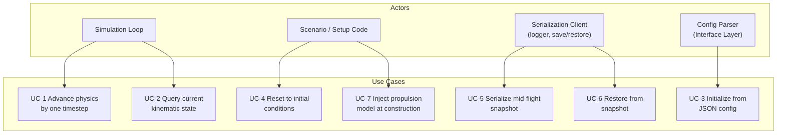
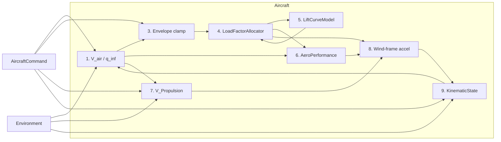
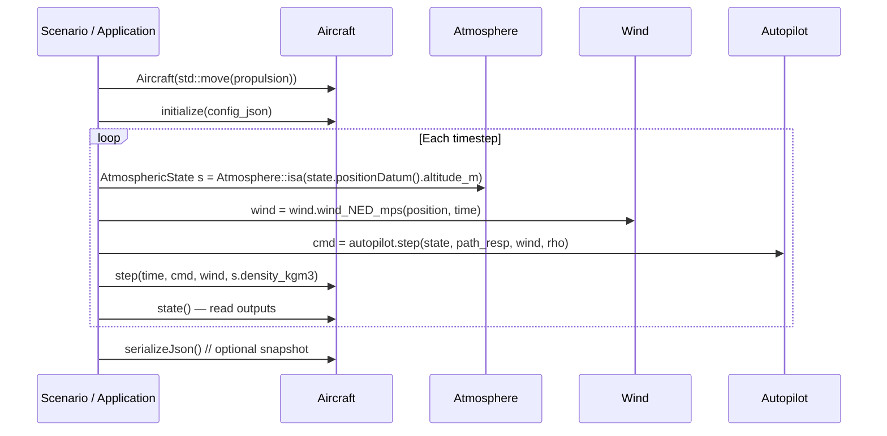

# Aircraft Class — Architecture and Interface Design

This document is the design authority for the `Aircraft` class. It covers the ownership
model, the physics update loop, serialization, JSON initialization, and the integration
contracts with every owned subsystem.

---

## Use Case Decomposition



| ID | Use Case | Primary Actor | Mechanism |
|----|----------|---------------|-----------|
| UC-1 | Advance physics by one timestep | Simulation loop | `Aircraft::step()` |
| UC-2 | Query current kinematic state | Simulation loop, guidance | `Aircraft::state()` |
| UC-3 | Initialize from JSON config | Config parser / scenario | `Aircraft::initialize(config)` |
| UC-4 | Reset to initial conditions | Scenario, test harness | `Aircraft::reset()` |
| UC-5 | Serialize mid-flight snapshot | Logger, pause/resume | `serializeJson()` / `serializeProto()` |
| UC-6 | Restore from snapshot | Pause/resume, replay | `deserializeJson()` / `deserializeProto()` |
| UC-7 | Inject propulsion model | Scenario, test | `Aircraft(std::move(propulsion))` constructor |

---

## Use Case Narratives

### UC-1 — Advance Physics by One Timestep

**Trigger:** The simulation loop calls `Aircraft::step()` once per timestep.

**Preconditions:** `initialize()` has been called. All inputs are in SI units. Air density
and wind vector have been computed from `Atmosphere` and `Wind` for the current position
before this call.

**Main flow:**

1. Compute true airspeed from `KinematicState::velocity_NED_mps()` and the supplied
   `wind_NED_mps`. Dynamic pressure follows from `rho_kgm3` and airspeed.
2. Solve for angle of attack (`α`) and sideslip (`β`) using `LoadFactorAllocator::solve()`,
   which inverts the aerodynamic load equations for the commanded normal and lateral load
   factors.
3. Evaluate `CL = LiftCurveModel::evaluate(α)`.
4. Compute aerodynamic forces in the Wind frame via `AeroPerformance::compute()`.
5. Advance propulsion: `thrust_n = V_Propulsion::step(throttle, V_air, rho)`.
6. Decompose thrust into Wind-frame acceleration components; combine with aerodynamic
   forces. Gravity is **not** added separately — it is already embedded in the load factor
   constraint solved in step 2.
7. Advance `KinematicState::step()` with the computed Wind-frame acceleration and angular
   rate inputs.

**Postconditions:** `state()` reflects the aircraft position, velocity, and attitude at
`time_sec + dt_s`. `V_Propulsion::thrust_n()` reflects the engine thrust at this step.

**Alternate flow — stall:** If `LoadFactorAllocator` cannot satisfy the commanded `n` at
the current airspeed and density (e.g., `q` is too low for the required `CL`), `α` will be
clamped at the stall boundary. The flight path will deviate from the commanded trajectory;
no exception is thrown.

---

### UC-3 — Initialize from JSON Config

**Trigger:** Application or test code calls `Aircraft::initialize(config)` after constructing
the `Aircraft` with a propulsion model.

**Preconditions:** The JSON has been validated by `validate_aircraft_config.py`. The
`Aircraft` has been constructed with a non-null propulsion model.

**Main flow:**

1. Read `inertia.*` and construct `Inertia`; read `airframe.*` and construct
   `AirframePerformance`.
2. Read `aircraft.S_ref_m2`, `aircraft.cl_y_beta`.
3. Construct `LiftCurveModel` from `lift_curve.*` parameters.
4. Construct `LoadFactorAllocator` from the lift curve, `S_ref_m2`, and `cl_y_beta`.
5. Construct `AeroPerformance` from `S_ref_m2`, `cl_y_beta`, and drag parameters
   (aspect ratio, Oswald efficiency, `cd0`). These fields are not yet in
   `aircraft_config_v1` — they must be added when `Aircraft::initialize()` is implemented.
6. Construct the initial `KinematicState` from `initial_state.*`.
7. Store `_dt_s`.

**Postconditions:** `state()` returns the initial kinematic state. The allocator and lift
curve are ready for `step()`.

**Error flow:** If any required field is missing or out of range, `initialize()` throws
`std::invalid_argument`.

---

### UC-5 — Serialize Mid-Flight Snapshot

**Trigger:** Logger or pause/resume manager calls `serializeJson()` or `serializeProto()`.

**Main flow:** Serialize each stateful subcomponent in turn:

| Component | Method called | What is captured |
|---|---|---|
| `KinematicState` | `serializeJson()` | Full state — position, velocity, attitude |
| `LoadFactorAllocator` | `serializeJson()` | Config + warm-start α, β |
| `V_Propulsion` | `serializeJson()` | Config + filter state, thrust |
| `LiftCurveModel` | `serializeJson()` | Config params (stateless — no warm-start) |
| `AeroPerformance` | `serializeJson()` | Config params (stateless) |
| `AirframePerformance` | `serializeJson()` | Config params (stateless) |
| `Inertia` | `serializeJson()` | Config params (stateless) |
| `_dt_s` | inline in `"params"` | Config scalar |

**Postconditions:** The returned JSON or byte vector is sufficient to restore the
aircraft to the exact mid-flight state via `deserializeJson()` / `deserializeProto()`.

---

## Class Hierarchy

```mermaid
classDiagram
    class Aircraft {
        -_state : KinematicState
        -_liftCurve : LiftCurveModel
        -_allocator : LoadFactorAllocator
        -_aeroPerf : AeroPerformance
        -_airframe : AirframePerformance
        -_inertia : Inertia
        -_propulsion : unique_ptr~V_Propulsion~
        -_dt_s : float
        +Aircraft(propulsion)
        +initialize(config) void
        +reset() void
        +step(time_sec, cmd, wind_NED_mps, rho_kgm3) void
        +state() const KinematicState&
        +serializeJson() json
        +deserializeJson(j) void
        +serializeProto() bytes
        +deserializeProto(bytes) void
    }

    class KinematicState {
        +step(time_sec, accel_Wind, rollRate, alpha, beta, alphaDot, betaDot, wind_NED) void
        +velocity_NED_mps() Vector3f
        +serializeJson() json
        +deserializeJson(j) void
        +serializeProto() bytes
        +deserializeProto(bytes) void
    }

    class LiftCurveModel {
        +evaluate(alpha_rad) float
        +derivative(alpha_rad) float
    }

    class LoadFactorAllocator {
        +solve(in) LoadFactorOutputs
        +reset(alpha0, beta0) void
        +serializeJson() json
        +deserializeJson(j) void
        +serializeProto() bytes
        +deserializeProto(bytes) void
    }

    class AeroPerformance {
        +compute(alpha, beta, q_inf, cl) AeroForces
    }

    class V_Propulsion {
        <<abstract>>
        +step(throttle_nd, tas_mps, rho_kgm3) float
        +thrust_n() float
        +reset() void
        +serializeJson() json
        +deserializeJson(j) void
        +serializeProto() bytes
        +deserializeProto(bytes) void
    }

    class AirframePerformance {
        +g_max_nd : float
        +g_min_nd : float
        +tas_max_mps : float
        +mach_max_nd : float
        +serializeJson() json
        +deserializeJson(j) void
        +serializeProto() bytes
        +deserializeProto(bytes) void
    }

    class Inertia {
        +mass_kg : float
        +Ixx_kgm2 : float
        +Iyy_kgm2 : float
        +Izz_kgm2 : float
        +serializeJson() json
        +deserializeJson(j) void
        +serializeProto() bytes
        +deserializeProto(bytes) void
    }

    class AircraftCommand {
        +n : float
        +n_y : float
        +n_dot : float
        +n_y_dot : float
        +rollRate_Wind_rps : float
        +throttle_nd : float
    }

    Aircraft *-- KinematicState : owns (value)
    Aircraft *-- LiftCurveModel : owns (value)
    Aircraft *-- LoadFactorAllocator : owns (value)
    Aircraft *-- AeroPerformance : owns (value)
    Aircraft *-- AirframePerformance : owns (value)
    Aircraft *-- Inertia : owns (value)
    Aircraft o-- V_Propulsion : owns (unique_ptr)
    Aircraft ..> AircraftCommand : uses
```



---

## Interface

### Constructor

```cpp
namespace liteaerosim {

explicit Aircraft(std::unique_ptr<propulsion::V_Propulsion> propulsion);
```

Propulsion is injected at construction time so that the concrete engine type
(`PropulsionJet`, `PropulsionEDF`, `PropulsionProp`) can be varied without touching
`Aircraft`. The object is **not yet usable** after construction; either `initialize()` (first-time
setup from a config JSON) or `deserializeJson()` / `deserializeProto()` (reconstitution
from a snapshot) must be called before `step()`.

---

### Lifecycle Methods

```cpp
void initialize(const nlohmann::json& config);
```

Reads `aircraft_config_v1` JSON, constructs all value-member subsystems, and sets `_dt_s`
from the config's `"dt_s"` field (or a caller-supplied default). Throws
`std::invalid_argument` if any required field is missing or invalid.

```cpp
void reset();
```

Resets `KinematicState` to the initial conditions recorded at `initialize()` time, calls
`LoadFactorAllocator::reset()`, and calls `V_Propulsion::reset()`. After `reset()`,
the aircraft is in the same state as immediately after `initialize()`.

---

### Inputs to `step()`

```cpp
struct AircraftCommand {
    float n;                  // commanded normal load factor (g)
    float n_y;                // commanded lateral load factor (g)
    float n_dot;              // time derivative of n (g/s) — drives alphaDot
    float n_y_dot;            // time derivative of n_y (g/s) — drives betaDot
    float rollRate_Wind_rps;  // wind-frame roll rate command (rad/s)
    float throttle_nd;        // normalized throttle [0, 1]
};
```

| Field | SI unit | Valid range | Description |
|---|---|---|---|
| `n` | g | (−∞, +∞) | Normal load factor; 1.0 = level flight at 1 g |
| `n_y` | g | (−∞, +∞) | Lateral load factor; 0 = coordinated flight |
| `n_dot` | g/s | — | Rate of change of `n`; used to compute `alphaDot` |
| `n_y_dot` | g/s | — | Rate of change of `n_y`; used to compute `betaDot` |
| `rollRate_Wind_rps` | rad/s | — | Wind-frame roll rate; passed directly to `KinematicState::step()` |
| `throttle_nd` | — | [0, 1] | Normalized throttle demand |

---

### `step()` Signature

```cpp
void step(double time_sec,
          const AircraftCommand& cmd,
          const Eigen::Vector3f& wind_NED_mps,
          float rho_kgm3);
```

| Parameter | SI unit | Description |
|---|---|---|
| `time_sec` | s | Absolute simulation time at this step |
| `cmd` | mixed | Commanded inputs (see `AircraftCommand` table above) |
| `wind_NED_mps` | m/s | Ambient wind vector in NED frame — supplied by `Wind` model |
| `rho_kgm3` | kg/m³ | Local air density — supplied by `Atmosphere::isa()` |

`step()` has no return value. All outputs are read through `state()` and
`V_Propulsion::thrust_n()` after the call.

---

### `state()` and Output Query

```cpp
const KinematicState& state() const;
```

Returns a const reference to the internal `KinematicState`. Callers should not hold this
reference across a `step()` call if they need a snapshot; copy the object instead.

Derived quantities available from `KinematicState` after `step()`:

| Quantity | Method | Unit |
|---|---|---|
| Position (WGS84) | `state().positionDatum()` | rad / m |
| Velocity (NED) | `state().velocity_NED_mps()` | m/s |
| Euler angles | `state().eulers()` | rad |
| Angle of attack | `state().alpha()` | rad |
| Sideslip | `state().beta()` | rad |
| Body angular rates | `state().rates_Body_rps()` | rad/s |
| Wind-frame roll rate | `state().rollRate_Wind_rps()` | rad/s |

---

### Serialization

```cpp
[[nodiscard]] nlohmann::json       serializeJson()                              const;
void                               deserializeJson(const nlohmann::json&        j);
[[nodiscard]] std::vector<uint8_t> serializeProto()                            const;
void                               deserializeProto(const std::vector<uint8_t>& bytes);
```

#### JSON Snapshot Schema

The snapshot is **self-contained** — `deserializeJson()` fully reconstitutes a working
`Aircraft` without requiring a prior `initialize()` call. Every owned component serializes
its full configuration and internal state.

```json
{
    "schema_version": 1,
    "type": "Aircraft",
    "params":           { "dt_s": 0.01 },
    "kinematic_state":  { ... },
    "allocator":        { ... },
    "lift_curve":       { ... },
    "aero_performance": { ... },
    "airframe":         { ... },
    "inertia":          { ... },
    "propulsion":       { ... }
}
```

| Field | Source | Notes |
|---|---|---|
| `"schema_version"` | constant 1 | Verified on deserialize; mismatch throws |
| `"type"` | constant `"Aircraft"` | Verified on deserialize; mismatch throws |
| `"params"` | `_dt_s` | Timestep config scalar |
| `"kinematic_state"` | `_state.serializeJson()` | Full kinematic state |
| `"allocator"` | `_allocator.serializeJson()` | Config + warm-start α, β |
| `"lift_curve"` | `_liftCurve.serializeJson()` | Lift curve config params |
| `"aero_performance"` | `_aeroPerf.serializeJson()` | Aero config params |
| `"airframe"` | `_airframe.serializeJson()` | Structural envelope limits |
| `"inertia"` | `_inertia.serializeJson()` | Mass properties |
| `"propulsion"` | `_propulsion->serializeJson()` | Engine type, config, and filter state |

#### Deserialize Contract

- If `"schema_version"` ≠ 1 or `"type"` ≠ `"Aircraft"`, throws `std::runtime_error`.
- `"propulsion"."type"` must match the concrete `V_Propulsion` subclass injected at
  construction; the propulsion subclass's own `deserializeJson()` enforces this.
- `deserializeJson()` does **not** require a prior `initialize()` call — the snapshot
  contains all data needed for full reconstitution.
- After `deserializeJson()`, the next `step()` call must produce the same output as if the
  simulation had never been interrupted.

---

## Physics Integration Loop

### Step Execution Order

```
1. V_air  = (state().velocity_NED_mps() - wind_NED_mps).norm()
   q_inf  = 0.5 * rho_kgm3 * V_air²

2. T_prev = _propulsion->thrust_n()        // from previous step (or 0 at t=0)

3. Clamp commanded load factors to airframe structural limits:
       n_cmd   = clamp(cmd.n,   _airframe.g_min_nd, _airframe.g_max_nd)
       n_y_cmd = clamp(cmd.n_y, _airframe.g_min_nd, _airframe.g_max_nd)

4. LoadFactorInputs lf_in {
       .n        = n_cmd,
       .n_y      = n_y_cmd,
       .q_inf    = q_inf,
       .thrust_n = T_prev,
       .mass_kg  = _inertia.mass_kg,
       .n_dot    = cmd.n_dot,
       .n_y_dot  = cmd.n_y_dot
   }
   LoadFactorOutputs lf = _allocator.solve(lf_in)

5. float CL = _liftCurve.evaluate(lf.alpha_rad)

6. AeroForces F = _aeroPerf.compute(lf.alpha_rad, lf.beta_rad, q_inf, CL)
   // F.x_n < 0 (drag),  F.y_n (side force),  F.z_n < 0 (lift upward)

7. float T  = _propulsion->step(cmd.throttle_nd, V_air, rho_kgm3)

8. float cα = cosf(lf.alpha_rad),  sα = sinf(lf.alpha_rad)
   float cβ = cosf(lf.beta_rad),   sβ = sinf(lf.beta_rad)
   Eigen::Vector3f a_Wind {
       (T * cα * cβ  + F.x_n) / _inertia.mass_kg,
       (-T * cα * sβ + F.y_n) / _inertia.mass_kg,
       (-T * sα      + F.z_n) / _inertia.mass_kg
   }

9. _state.step(time_sec, a_Wind,
               cmd.rollRate_Wind_rps,
               lf.alpha_rad,  lf.beta_rad,
               lf.alphaDot_rps, lf.betaDot_rps,
               wind_NED_mps)
```

### Wind-Frame Force Decomposition

Thrust acts along the body x-axis (positive forward). Decomposed into Wind-frame
components:

$$
\begin{aligned}
a_x^W &= \frac{T \cos\alpha \cos\beta + F_x}{m} \\
a_y^W &= \frac{-T \cos\alpha \sin\beta + F_y}{m} \\
a_z^W &= \frac{-T \sin\alpha + F_z}{m}
\end{aligned}
$$

where $F_x < 0$ (drag), $F_z < 0$ (lift directed negative-down, i.e., upward).

**Gravity accounting:** The `LoadFactorAllocator` solves the constraint

$$
q\,S\,C_L + T\sin\alpha = n\,m\,g
$$

The gravitational term $n\,m\,g$ is entirely consumed within that constraint. The
Wind-frame acceleration computed in step 7 is the **kinematic** (non-gravitational)
acceleration; `KinematicState::step()` integrates it directly without adding $g$ again.

### Data Flow Diagram



---

## Ownership and Memory Model

| Member | Type | Lifetime | Notes |
|---|---|---|---|
| `_state` | `KinematicState` | Value member — lives with `Aircraft` | Fully owned; no sharing |
| `_liftCurve` | `LiftCurveModel` | Value member | Stateless after construction |
| `_allocator` | `LoadFactorAllocator` | Value member | Holds `const&` to `_liftCurve` — must outlive allocator |
| `_aeroPerf` | `AeroPerformance` | Value member | Stateless after construction |
| `_airframe` | `AirframePerformance` | Value member | Envelope limits — clamped before `LoadFactorAllocator`; stateless |
| `_inertia` | `Inertia` | Value member | Mass and inertia — `mass_kg` replaces bare scalar; `Ixx/Iyy/Izz` reserved for future 6-DOF moment equations |
| `_propulsion` | `std::unique_ptr<V_Propulsion>` | Heap-allocated, owned | Injected at construction; non-null invariant |

**Invariant:** `_propulsion` must never be null after construction. If the caller passes
`nullptr`, the constructor throws `std::invalid_argument`.

**Copy and move:** `Aircraft` is **move-only**. Copy is deleted because `_allocator` holds
a `const&` to `_liftCurve` that would become a dangling reference after a value copy.

---

## Initialization — JSON Config Mapping

The `aircraft_config_v1` schema maps to `Aircraft` members as follows:

| JSON path | C++ type | Aircraft member / usage |
|---|---|---|
| `inertia.mass_kg` | `float` | `_inertia.mass_kg` |
| `inertia.Ixx_kgm2` | `float` | `_inertia.Ixx_kgm2` (reserved for 6-DOF) |
| `inertia.Iyy_kgm2` | `float` | `_inertia.Iyy_kgm2` (reserved for 6-DOF) |
| `inertia.Izz_kgm2` | `float` | `_inertia.Izz_kgm2` (reserved for 6-DOF) |
| `airframe.g_max_nd` | `float` | `_airframe.g_max_nd` |
| `airframe.g_min_nd` | `float` | `_airframe.g_min_nd` |
| `airframe.tas_max_mps` | `float` | `_airframe.tas_max_mps` |
| `airframe.mach_max_nd` | `float` | `_airframe.mach_max_nd` |
| `aircraft.S_ref_m2` | `float` | `AeroPerformance`, `LoadFactorAllocator` constructor args |
| `aircraft.cl_y_beta` | `float` | `AeroPerformance`, `LoadFactorAllocator` constructor args |
| `aircraft.ar` | `float` | `AeroPerformance` constructor arg — wing aspect ratio |
| `aircraft.e` | `float` | `AeroPerformance` constructor arg — Oswald efficiency |
| `aircraft.cd0` | `float` | `AeroPerformance` constructor arg — zero-lift drag coefficient |
| `lift_curve.cl_alpha` | `float` | `LiftCurveParams::cl_alpha` → `LiftCurveModel` |
| `lift_curve.cl_max` | `float` | `LiftCurveParams::cl_max` |
| `lift_curve.cl_min` | `float` | `LiftCurveParams::cl_min` |
| `lift_curve.delta_alpha_stall` | `float` | `LiftCurveParams::delta_alpha_stall` |
| `lift_curve.delta_alpha_stall_neg` | `float` | `LiftCurveParams::delta_alpha_stall_neg` |
| `lift_curve.cl_sep` | `float` | `LiftCurveParams::cl_sep` |
| `lift_curve.cl_sep_neg` | `float` | `LiftCurveParams::cl_sep_neg` |
| `initial_state.latitude_rad` | `double` | `WGS84_Datum` → `KinematicState` |
| `initial_state.longitude_rad` | `double` | `WGS84_Datum` → `KinematicState` |
| `initial_state.altitude_m` | `float` | `WGS84_Datum` → `KinematicState` |
| `initial_state.velocity_north_mps` | `float` | `velocity_NED_mps(0)` → `KinematicState` |
| `initial_state.velocity_east_mps` | `float` | `velocity_NED_mps(1)` → `KinematicState` |
| `initial_state.velocity_down_mps` | `float` | `velocity_NED_mps(2)` → `KinematicState` |
| `initial_state.wind_north_mps` | `float` | `wind_NED_mps(0)` → `KinematicState` |
| `initial_state.wind_east_mps` | `float` | `wind_NED_mps(1)` → `KinematicState` |
| `initial_state.wind_down_mps` | `float` | `wind_NED_mps(2)` → `KinematicState` |

---

## Serialization Design

### Scope

Every simulation element serializes its **full configuration and internal state** sufficient
for exact reconstitution from a frozen snapshot. `Aircraft::deserializeJson()` is
self-contained — a caller must not need to call `initialize()` before or after
`deserializeJson()` to obtain a fully operational `Aircraft`.

### Component Serialization

| Component | Internal state | What is serialized |
|---|---|---|
| `KinematicState` | Yes | Full state — position, velocity, attitude |
| `LoadFactorAllocator` | Yes — `_alpha_prev`, `_beta_prev` | Config + warm-start α, β |
| `V_Propulsion` | Yes — filter state, `_thrust_n` | Config + engine-specific state |
| `LiftCurveModel` | No | Config params only |
| `AeroPerformance` | No | Config params only |
| `AirframePerformance` | No | Config params only |
| `Inertia` | No | Config params only |

### Protobuf Message (to be added to `proto/liteaerosim.proto` when `Aircraft` is implemented)

```proto
message AircraftParams {
    float dt_s = 1;
}

message AircraftState {
    int32                    schema_version  = 1;
    AircraftParams           params          = 2;
    KinematicState           kinematic_state = 3;
    LoadFactorAllocatorState allocator        = 4;
    LiftCurveModelParams     lift_curve       = 5;
    AeroPerformanceParams    aero_performance = 6;
    AirframePerformanceParams airframe        = 7;
    InertiaParams            inertia          = 8;

    oneof propulsion {
        PropulsionJetState  jet  = 9;
        PropulsionEdfState  edf  = 10;
        PropulsionPropState prop = 11;
    }
}
```

The `oneof` discriminates the propulsion type at the proto level, mirroring the `"type"`
string in the JSON schema. Each config struct (`LiftCurveModelParams`,
`AeroPerformanceParams`, `AirframePerformanceParams`, `InertiaParams`) is a flat message
of scalar fields with no nested state.

---

## Interface Contracts

| Precondition | Method | Postcondition |
|---|---|---|
| `propulsion != nullptr` | constructor | Object constructed; `_propulsion` is non-null |
| `propulsion == nullptr` | constructor | throws `std::invalid_argument` |
| `initialize()` not yet called | `step()` | undefined behavior (asserts in debug) |
| Valid `aircraft_config_v1` JSON | `initialize()` | All subsystems constructed; `state()` = initial state |
| Any malformed field | `initialize()` | throws `std::invalid_argument` |
| Any command, any airspeed | `step()` | No throw; allocator clamps to envelope |
| After `reset()` | `state()` | Returns initial `KinematicState` from `initialize()` |
| Valid self-contained snapshot | `deserializeJson()` | Fully reconstituted; `step()` may be called without `initialize()` |
| Snapshot `"type"` = `"Aircraft"` | `deserializeJson()` | State restored; next `step()` output is identical |
| Snapshot `"type"` ≠ `"Aircraft"` | `deserializeJson()` | throws `std::runtime_error` |
| Schema version ≠ 1 | `deserializeJson()` | throws `std::runtime_error` |

---

## Why `Aircraft` Is Not a `DynamicBlock`

`DynamicBlock` models **scalar SISO** elements: one float input, one float output, per
the NVI pattern in [`dynamic_block.md`](dynamic_block.md).

`Aircraft::step()` takes six heterogeneous inputs (`AircraftCommand` + wind + density) and
produces no scalar output — its output is a rich `KinematicState` struct. Forcing this into
a SISO interface would require artificial input multiplexing and would hide the semantically
meaningful parameter names.

`Aircraft` instead follows the same **lifecycle convention** (`initialize` → `reset` →
`step` → `serialize/deserialize`) without inheriting from `DynamicBlock`. This pattern is
consistent with `V_Propulsion`, which also has a multi-input `step()`.

---

## Integration with the Simulation Loop

### Typical Scenario Sequence



### Dependency on External Inputs

`Aircraft::step()` does **not** own or call `Atmosphere` or `Wind` — those are the
caller's responsibility. This keeps the Domain Layer's boundary clean: `Aircraft` is a
pure physics integrator; environment state is injected per step.

---

## File Map

| File | Contents |
|---|---|
| `include/Aircraft.hpp` | Class declaration, `AircraftCommand` struct |
| `src/Aircraft.cpp` | Implementation of `initialize`, `reset`, `step`, serialization |
| `test/Aircraft_test.cpp` | Unit tests — construction, step physics, serialization round-trips |
| `docs/schemas/aircraft_config_v1.md` | JSON config schema (inputs to `initialize()`) |
| `docs/architecture/propulsion.md` | Design authority for `V_Propulsion` and all engine types |
| `include/KinematicState.hpp` | Kinematic state owned by `Aircraft` |
| `include/aerodynamics/LiftCurveModel.hpp` | Lift curve owned by `Aircraft` |
| `include/aerodynamics/LoadFactorAllocator.hpp` | Load factor solver owned by `Aircraft` |
| `include/aerodynamics/AeroPerformance.hpp` | Aerodynamic force model owned by `Aircraft` |
| `include/airframe/AirframePerformance.hpp` | Structural/operational envelope limits owned by `Aircraft` |
| `include/airframe/Inertia.hpp` | Mass and inertia properties owned by `Aircraft` |
