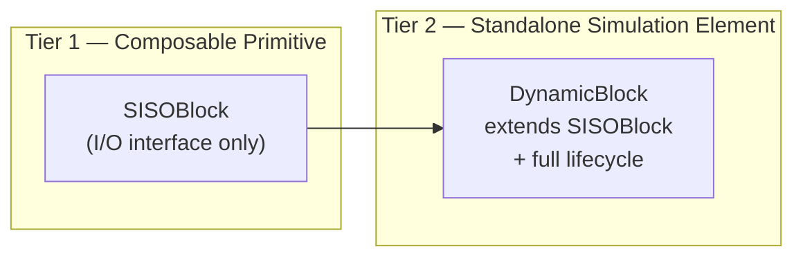
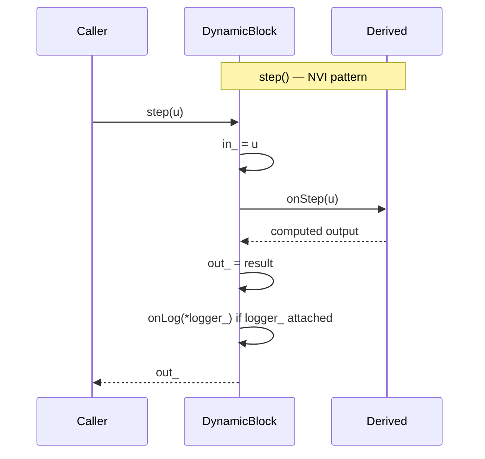
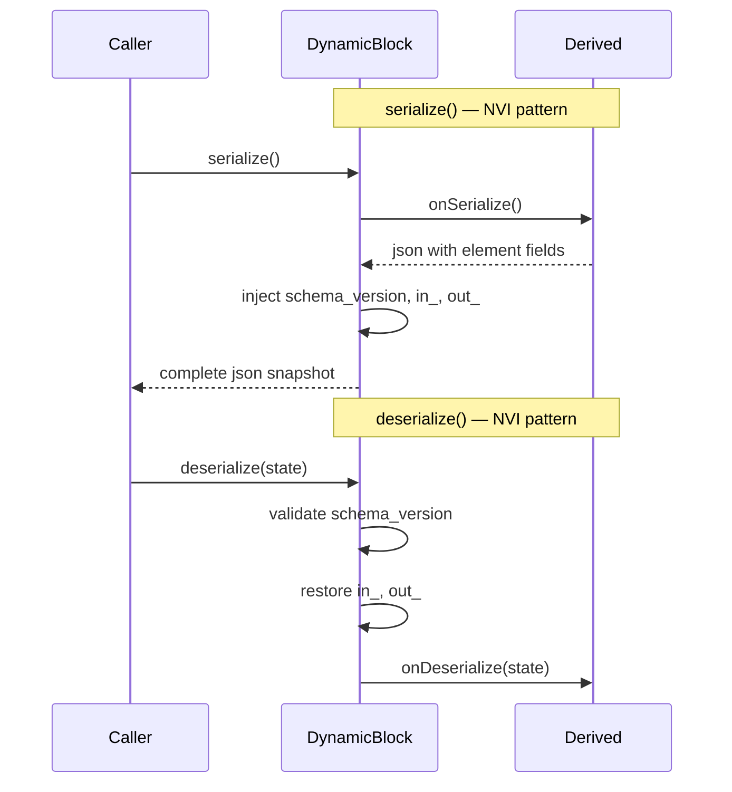
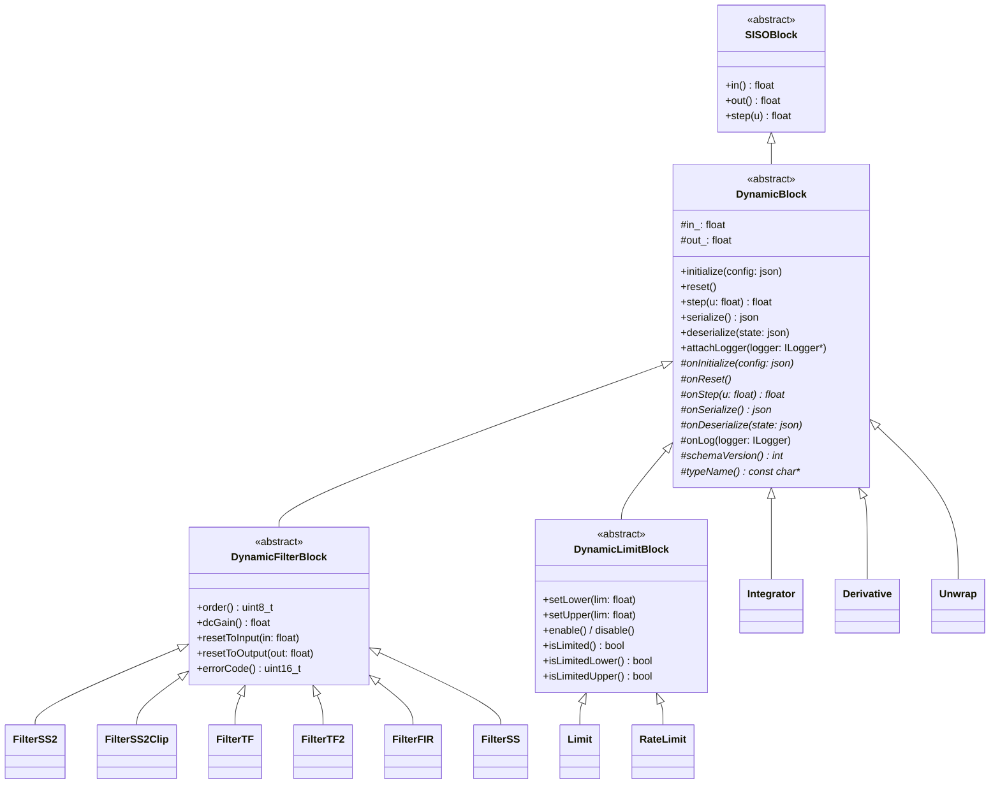
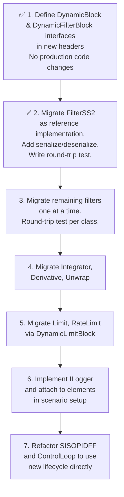

# Dynamic Block Design

## Overview

This document specifies the architecture for all single-input, single-output (SISO) dynamic simulation elements in LiteAeroSim. It covers the problem statement, the two-tier design, the Non-Virtual Interface (NVI) pattern, serialization, logging, and the incremental migration strategy.

---

## Design Rationale

### Two-Tier Hierarchy

Not every `SISOBlock` needs standalone lifecycle management. A `Limit` embedded inside a `SISOPIDFF` is an implementation detail — it is serialized as part of its parent, not independently. Imposing a full lifecycle on every composable primitive would add unnecessary coupling.

The design separates two concerns:



| Tier | Purpose | Examples |
|---|---|---|
| `SISOBlock` | Composable building block embedded in a larger element | `Limit`, `RateLimit`, `Unwrap` embedded in `SISOPIDFF` |
| `DynamicBlock` | Standalone simulation element with its own lifecycle | `FilterSS2`, `Integrator`, `ControlRoll` |

### Non-Virtual Interface (NVI) Pattern

The `DynamicBlock` public API is **non-virtual**. Subclasses implement **protected virtual hooks**. This enforces cross-cutting concerns — schema validation, logging, input/output recording — once in the base class, without requiring every subclass to call `super()` or duplicate logic.





---

## Namespaces

The project uses a single top-level namespace `liteaerosim` with subsystem sub-namespaces.

```
liteaerosim                  ← cross-subsystem types (DynamicBlock, SISOBlock, ILogger)
                               math aliases (Vec3, Mat22, FiltVectorXf, …) in numerics.hpp
liteaerosim::control         ← filters, integrators, limiters, PID, autopilot
liteaerosim::physics         ← KinematicState, Atmosphere, Aerodynamics
liteaerosim::propulsion      ← engine / motor models
liteaerosim::sensor          ← SensorINS, SensorAirData, SensorRadAlt
liteaerosim::guidance        ← PathGuidance, VerticalGuidance
liteaerosim::path            ← Path, PathSegmentHelix, PathSegmentTrochoid
liteaerosim::logger          ← CsvLogger and other ILogger implementations
```

The old `namespace Control` (Pascal-case) is replaced by `namespace liteaerosim::control`. Math type aliases and bounded-vector utilities are defined in `include/numerics.hpp` under `namespace liteaerosim` — they are not control-specific and must not live under a subsystem namespace.

---

## Header Locations

`DynamicBlock`, `SISOBlock`, and `ILogger` are cross-subsystem types. `SISOBlock` is the signal-topology base for any single-input single-output element, including propulsion and sensor elements — it is not exclusively a control concept.

| Header | Location | Namespace |
|---|---|---|
| `numerics.hpp` | `include/numerics.hpp` | `liteaerosim` |
| `SISOBlock.hpp` | `include/SISOBlock.hpp` | `liteaerosim` |
| `DynamicBlock.hpp` | `include/DynamicBlock.hpp` | `liteaerosim` |
| `ILogger.hpp` | `include/ILogger.hpp` | `liteaerosim` |
| `DynamicFilterBlock.hpp` | `include/control/DynamicFilterBlock.hpp` | `liteaerosim::control` |
| `DynamicLimitBlock.hpp` | `include/control/DynamicLimitBlock.hpp` | `liteaerosim::control` |
| All other control headers | `include/control/` | `liteaerosim::control` |

---

## Interface

### `SISOBlock` — unchanged

```cpp
namespace liteaerosim {

/// Minimal composable SISO building block.
/// Use as an embedded primitive inside a larger DynamicBlock.
/// Does not require standalone lifecycle management.
class SISOBlock {
public:
    virtual ~SISOBlock() = default;

    [[nodiscard]] virtual float in()  const = 0;
    [[nodiscard]] virtual float out() const = 0;
    virtual operator float()    const = 0;

    virtual float step(float u) = 0;
};

} // namespace liteaerosim
```

### `DynamicBlock` — new

```cpp
namespace liteaerosim {

/// Abstract base for all standalone SISO simulation elements.
///
/// Lifecycle:
///   initialize(config) → reset() → step(u) ↔ serialize()/deserialize()
///
/// The timestep dt_s is a configuration parameter parsed in onInitialize().
/// It is fixed for the lifetime of the element. Elements that need it store
/// it as a private member and use it in onStep().
///
/// Subclasses implement the protected on*() hooks only.
/// The public non-virtual methods enforce cross-cutting concerns.
class DynamicBlock : public SISOBlock {
public:
    // -----------------------------------------------------------------------
    // Lifecycle — non-virtual public API (NVI)
    // -----------------------------------------------------------------------

    /// Parse parameters and configure internal structure from JSON config.
    /// Must be called once before reset() or step().
    void initialize(const nlohmann::json& config);

    /// Restore element to initial post-initialize conditions.
    void reset();

    /// Advance internal state by one timestep. Returns the scalar output.
    /// The timestep is fixed at initialize() time.
    /// @param u  Input signal (SI units)
    float step(float u) override;

    /// Return a complete JSON snapshot of internal state. All values in SI units.
    /// Snapshot includes schema_version, in_, out_, and all subclass state.
    [[nodiscard]] nlohmann::json serialize() const;

    /// Restore internal state from a snapshot produced by serialize().
    /// Throws std::runtime_error if schema_version is not supported.
    void deserialize(const nlohmann::json& state);

    /// Attach a logger. Pass nullptr to detach.
    /// The logger is called at the end of every step() if attached.
    void attachLogger(ILogger* logger) noexcept;

    // -----------------------------------------------------------------------
    // I/O accessors — satisfy SISOBlock; non-virtual for performance
    // -----------------------------------------------------------------------
    [[nodiscard]] float in()  const noexcept override { return in_; }
    [[nodiscard]] float out() const noexcept override { return out_; }
    operator float()          const noexcept override { return out_; }

protected:
    float in_  = 0.0f;
    float out_ = 0.0f;

    // -----------------------------------------------------------------------
    // Customization hooks — implement in derived classes
    // -----------------------------------------------------------------------
    virtual void           onInitialize(const nlohmann::json& config) = 0;
    virtual void           onReset() = 0;
    virtual float          onStep(float u) = 0;
    virtual nlohmann::json onSerialize() const = 0;
    virtual void           onDeserialize(const nlohmann::json& state) = 0;

    /// Called at end of step() when a logger is attached. Default: no-op.
    virtual void onLog(ILogger& logger) const {}

    /// Schema version for this subclass. Increment when serialized fields change.
    virtual int schemaVersion() const = 0;

    /// Human-readable type name injected into every serialized snapshot.
    /// Used for diagnostics and future polymorphic factory support.
    /// Example: return "FilterSS2";
    virtual const char* typeName() const = 0;

private:
    ILogger* logger_ = nullptr;

    void validateSchema(const nlohmann::json& state) const;
};

} // namespace liteaerosim
```

---

## Target Class Hierarchy



> **Note:** `SISOPIDFF`, `Gain`, and `ControlLoop` are **not** `DynamicBlock` subclasses. They aggregate `DynamicBlock`-derived elements via composition and implement lifecycle methods (`initialize`, `reset`, `serialize`, `deserialize`) by convention, without a shared enforcing base.
>
> `Limit` and `RateLimit` derive from `DynamicLimitBlock` because they are used both as standalone simulation elements and embedded inside larger controllers. When embedded inside `SISOPIDFF`, they are serialized as part of their parent's `onSerialize()` — not independently.

---

## Serialization Contract

Every `DynamicBlock` subclass serializes a complete, self-describing JSON snapshot.

### Schema

```json
{
    "schema_version": 1,
    "type": "FilterSS2",
    "in": 0.0,
    "out": 0.0,
    "state": {
        "x0": 0.0,
        "x1": 0.0
    },
    "params": {
        "design":    "low_pass_second",
        "dt_s":      0.01,
        "wn_rad_s":  6.2832,
        "zeta":      0.7071,
        "tau_zero_s": 0.0
    }
}
```

### Rules

| Rule | Detail |
|---|---|
| All values in SI units | `"wn_rad_s"` not `"wn_hz"`; `"dt_s"` not `"dt_ms"` |
| Field names encode units | `"altitude_m"`, `"roll_rate_rad_s"`, `"thrust_n"` |
| `schema_version` always present | Integer; base class injects it; `onSerialize()` must not duplicate it |
| `type` always present | String from `typeName()`; base class injects it; `onSerialize()` must not duplicate it |
| Round-trip lossless | `deserialize(serialize())` must yield identical state |
| Schema version checked on load | Base class validates; throws `std::runtime_error` on mismatch |

### Base class serialization skeleton

The base `DynamicBlock::serialize()` wraps the subclass output:

```cpp
nlohmann::json DynamicBlock::serialize() const {
    nlohmann::json j = onSerialize();          // subclass provides element fields
    j["schema_version"] = schemaVersion();     // base injects version
    j["type"]           = typeName();          // base injects type name
    j["in"]             = in_;
    j["out"]            = out_;
    return j;
}

void DynamicBlock::deserialize(const nlohmann::json& state) {
    validateSchema(state);                     // base validates version
    in_  = state.at("in").get<float>();
    out_ = state.at("out").get<float>();
    onDeserialize(state);                      // subclass restores its fields
}
```

---

## Logging Interface

Logging is injected via a pointer to `ILogger`. The base class calls `onLog()` at the end of every `step()` when a logger is attached. Elements are not required to implement `onLog()` — the default is a no-op.

```cpp
namespace liteaerosim {

class ILogger {
public:
    virtual ~ILogger() = default;
    virtual void log(std::string_view channel, float value_si) = 0;
    virtual void log(std::string_view channel, const nlohmann::json& snapshot) = 0;
};

} // namespace liteaerosim
```

Each element names its own logging channels:

```cpp
// Example: liteaerosim::control::FilterSS2::onLog()
void FilterSS2::onLog(liteaerosim::ILogger& logger) const {
    logger.log("FilterSS2.in",  in_);
    logger.log("FilterSS2.out", out_);
    logger.log("FilterSS2.x0",  x_(0));
    logger.log("FilterSS2.x1",  x_(1));
}
```

Loggers are attached at scenario setup time, not in constructors:

```cpp
// Application layer — scenario setup
filterSS2.attachLogger(&csvLogger);  // csvLogger is a liteaerosim::logger::CsvLogger
```

---

## Timestep Convention

The timestep `dt_s` is a **configuration parameter**, not a runtime argument. It is parsed in `onInitialize(config)` and stored as a private member of the derived class. `step(float u)` takes only the input signal.

$$
y_k = f(u_k), \quad \Delta t\ \text{fixed at initialize()}
$$

**Rationale:** All elements in this simulation run at a fixed rate. Passing `dt_s` at every step call would be redundant, error-prone, and inconsistent with how discrete filter coefficients are precomputed (the coefficients are functions of `dt_s` and cannot change mid-run without reinitializing). Storing it once is simpler and safer.

Elements that need `dt_s` declare it as a private member and serialize it:

```cpp
void onInitialize(const nlohmann::json& config) override {
    dt_s_ = config.at("dt_s").get<float>();
    // precompute discrete coefficients here using dt_s_
}

private:
    float dt_s_ = 0.01f;
```

This also eliminates the `setDt()` anti-pattern present in the current codebase, where it was possible to forget to call `setDt()` before `step()`.

---

## Filter Transfer Functions

Discrete filters are designed by applying the **Tustin (bilinear) transform with frequency prewarping** to a continuous-time prototype.

The Tustin substitution maps $s \to z$ as:

$$
s = \frac{\omega_c}{\tan\!\left(\dfrac{\omega_c \Delta t}{2}\right)} \cdot \frac{z - 1}{z + 1}
$$

where $\omega_c$ is the prewarping frequency in rad/s (typically the filter's cutoff or design frequency). This ensures the discrete filter's frequency response exactly matches the continuous prototype at $\omega_c$.

A first-order continuous low-pass prototype:

$$
H(s) = \frac{\omega_n}{s + \omega_n}
$$

discretizes to:

$$
H(z) = \frac{b_0 + b_1 z^{-1}}{1 + a_1 z^{-1}}
$$

where, with $K = \omega_c / \tan\!\left(\omega_c \Delta t / 2\right)$:

$$
b_0 = \frac{\omega_n}{K + \omega_n}, \qquad
b_1 = \frac{\omega_n}{K + \omega_n}, \qquad
a_1 = \frac{\omega_n - K}{K + \omega_n}
$$

Second-order state-space discretization uses the Tustin mapping applied to the continuous matrices $(A, B, C, D)$:

$$
\Phi = (w_0 I + A)(w_0 I - A)^{-1}, \qquad
\Gamma = 2(w_0 I - A)^{-1} B
$$
$$
H = w_0 C (w_0 I - A)^{-1}, \qquad
J = D + C(w_0 I - A)^{-1} B
$$

where $w_0 = \omega_c / \tan(\omega_c \Delta t / 2)$.

---

## Migration Strategy

The existing codebase has passing tests. Migration proceeds one class at a time, each step leaving the build green.



**Per-class migration checklist:**

- [ ] Class derives from `DynamicBlock` or appropriate intermediate abstract
- [ ] `onInitialize(config)` replaces constructor parameter setting
- [ ] `onReset()` replaces ad-hoc reset methods
- [ ] `onStep(u)` replaces `step(float u)` — dt is fixed at initialize() time
- [ ] `onSerialize()` / `onDeserialize()` implemented
- [ ] `schemaVersion()` returns `1`
- [ ] `onLog()` implemented (logs all internal signals)
- [ ] Round-trip serialization test added
- [ ] Schema version rejection test added
- [ ] All existing tests still pass

**Completed migrations:**

| Class | Step | Notes |
|---|---|---|
| `FilterSS2` | ✅ Step 2 | Reference implementation; full round-trip test in `test/FilterSS2_test.cpp` |

---

## Design Decisions Log

| Decision | Alternative Considered | Rationale |
|---|---|---|
| NVI for public API | Pure virtual public methods | Base class can enforce logging, schema checks, in_/out_ recording without subclass cooperation |
| `dt_s` in `initialize()` config, not `step()` | Pass `dt_s` per call | Fixed-rate simulation; filter coefficients precomputed at init; `step(u)` aligns cleanly with `SISOBlock::step(u)`; eliminates `setDt()` anti-pattern |
| JSON serialization | Binary / protobuf | Human-readable; schema-versioned; works across C++ and Python analysis tools |
| Two-tier (`SISOBlock` + `DynamicBlock`) | Single base with full lifecycle | Composable primitives embedded in a parent (e.g. `Limit` inside `SISOPIDFF`) don't need standalone lifecycle; avoids bloated interface |
| `Limit`/`RateLimit` as `DynamicLimitBlock` | Tier 1 primitive only | Used both standalone (with full lifecycle) and embedded inside controllers |
| `SISOPIDFF`/`ControlLoop` lifecycle by convention | Shared `ILifecycle` base | Multi-input controllers can't satisfy `SISOBlock`; too few classes to justify a shared enforcing base |
| `typeName()` pure virtual in `DynamicBlock` | No type field | Snapshots are self-describing; enables diagnostics and future polymorphic factory |
| `DynamicBlock.hpp`, `ILogger.hpp` at `include/` root | Under `include/control/` | Cross-subsystem types must not depend on a subsystem-specific directory |
| Namespace `liteaerosim` with subsystem sub-namespaces | Single `namespace Control` (Pascal) | Full project name avoids collisions; subsystem sub-namespaces (`control`, `physics`, `sensor`, …) follow C++ lowercase convention and express ownership |
| Injected logger | Global logger / spdlog | No global state; testable; zero overhead when not attached |
| `ILogger` interface | Concrete logger type | Decouples domain from I/O; multiple logger implementations (CSV, binary, in-memory) |
