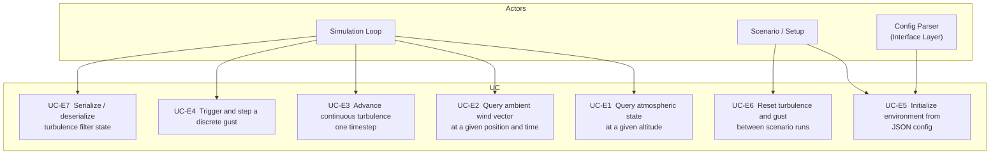

# Environment — Architecture and Interface Design

This document is the design authority for the `Atmosphere`, `Wind`, `Turbulence`, and
`Gust` classes. Together these classes model the physical environment that the aircraft
flies through. They live in the Domain Layer and have no I/O.

---

## Scope

| Class | Responsibility |
| ------- | ---------------- |
| `Atmosphere` | ISA pressure, temperature, density, speed of sound, humidity, and density altitude given geometric altitude and non-standard day conditions |
| `Wind` | Steady ambient wind vector in NED frame; supports constant and altitude-varying profiles |
| `Turbulence` | Continuous random velocity and angular rate disturbances (Dryden model) |
| `Gust` | Discrete transient velocity disturbance (1-cosine gust per MIL-SPEC-8785C) |

`Atmosphere` is a stateless value type — its outputs depend only on altitude and
configuration, never on simulation history. `Wind` is also stateless. `Turbulence` and
`Gust` are stateful and follow the `DynamicBlock` lifecycle.

---

## Use Case Decomposition



| ID | Use Case | Mechanism |
| ---- | ---------- | ----------- |
| UC-E1 | Query atmospheric state at altitude | `Atmosphere::state(h_m)` |
| UC-E2 | Query ambient wind vector | `Wind::wind_NED_mps(pos, time)` |
| UC-E3 | Advance continuous turbulence | `Turbulence::step(altitude_m, airspeed_mps)` |
| UC-E4 | Trigger and step a discrete gust | `Gust::trigger(…)`, `Gust::step(time_s, airspeed_mps)` |
| UC-E5 | Initialize environment from config | `Atmosphere(config)`, `Wind(config)`, `Turbulence::initialize(config)` |
| UC-E6 | Reset turbulence and gust | `Turbulence::reset()`, `Gust::reset()` |
| UC-E7 | Serialize turbulence filter state | `Turbulence::serializeJson()` / `deserializeJson()` |

---

## Data Structures

### `AtmosphericState`

The complete thermodynamic state of the air at a given altitude and non-standard day
condition. All fields are in SI units.

```cpp
// include/environment/AtmosphericState.hpp
namespace liteaerosim::environment {

struct AtmosphericState {
    float temperature_k;          // static (ambient) temperature (K)
    float pressure_pa;            // static pressure (Pa)
    float density_kgm3;           // air density, moist (kg/m³)
    float speed_of_sound_mps;     // (m/s)
    float relative_humidity_nd;   // 0–1, non-dimensional
    float density_altitude_m;     // altitude in ISA where ρ_ISA = ρ_actual (m)
};

} // namespace liteaerosim::environment
```

### `TurbulenceVelocity`

Body-frame disturbance from `Turbulence::step()`. Added to the aircraft's airspeed
components inside `Aircraft::step()`.

```cpp
struct TurbulenceVelocity {
    Eigen::Vector3f velocity_body_mps;    // (u_wg, v_wg, w_wg) in body frame (m/s)
    Eigen::Vector3f angular_rate_rad_s;  // (p_wg, q_wg, r_wg) in body frame (rad/s)
};
```

### `EnvironmentState`

Compound struct passed into `Aircraft::step()`. Aggregates all environment outputs so
that the aircraft's physics loop has a single environment dependency.

```cpp
// include/environment/EnvironmentState.hpp
struct EnvironmentState {
    AtmosphericState  atmosphere;
    Eigen::Vector3f   wind_NED_mps;       // steady ambient wind, NED frame (m/s)
    TurbulenceVelocity turbulence;        // continuous turbulence, body frame
    Eigen::Vector3f   gust_body_mps;      // discrete gust velocity, body frame (m/s)
};
```

The effective disturbance airspeed seen by the aircraft is therefore:

$$
\mathbf{v}_{a/w}^B = R_{B}^{N\,T}\bigl(\mathbf{v}_\text{aircraft}^N - \mathbf{v}_\text{wind}^N\bigr)
                   - \mathbf{v}_\text{turb}^B - \mathbf{v}_\text{gust}^B
$$

---

## `Atmosphere`

### Configuration

```cpp
// include/environment/AtmosphereConfig.hpp
struct AtmosphereConfig {
    float delta_temperature_k     = 0.f;   // ISA temperature deviation ∆T (K); positive = warm day
    float surface_pressure_pa     = 101325.f; // actual sea-level pressure (Pa); ISA standard = 101 325 Pa.
                                              // Set to QNH × 100 when QNH is given in hPa.
    float relative_humidity_nd    = 0.f;   // 0 = dry air, 1 = fully saturated
    int   schema_version          = 1;
};
```

`delta_temperature_k` shifts the static temperature at every altitude by a fixed amount.
`surface_pressure_pa` is the actual sea-level pressure; it scales the pressure at every
altitude multiplicatively (see Non-Standard Day Pressure below). The two offsets are
independent: a warm, high-pressure day has both $\Delta T > 0$ and $P_{sfc} > P_0$.

### Pre-computation Strategy

`Atmosphere` separates two categories of work:

| Category | When computed | What |
| ---------- | -------------- | ------ |
| **Configuration constants** | Once, at construction | ISA layer boundary pressures, humidity coefficient $\varepsilon$, relative humidity $\phi$ from config |
| **Altitude-dependent** | Every `state()` call | Geometric → geopotential conversion, layer selection, $T_\text{ISA}$, $P$, $T_v$, $\rho$, $c$, $h_d$ |

The ISA layer boundary pressures ($P_{11\,000}$, $P_{20\,000}$) are well-known constants
($22\,632.1\,\text{Pa}$ and $5\,474.9\,\text{Pa}$ respectively) and are hardcoded as
`static constexpr` values — no runtime integration is required. The only work performed
at construction is reading the config fields into the cached struct.

`state()` must not perform any work that depends solely on the configuration. Any
computation that would produce the same result regardless of the altitude argument
must be lifted into the constructor or cached on first access.

### Algorithm

#### Layer Model

The International Standard Atmosphere is defined in ICAO Doc 7488/3 and ISO 2533:1975.
LiteAeroSim models three layers up to 32 000 m. Higher altitudes are clamped to the
upper boundary values.

Inputs use **geometric altitude** $h_\text{geom}$ (m). The ISA is defined in
**geopotential altitude** $h_\text{gp}$; the conversion uses the WGS-84 mean Earth radius
$R_E = 6\,356\,766\,\text{m}$:

$$
h_\text{gp} = \frac{R_E \cdot h_\text{geom}}{R_E + h_\text{geom}}
$$

| Layer | $h_\text{gp}$ range (m) | $T_b$ (K) | Lapse rate $L$ (K/m) |
| ------- | ------------------------ | ----------- | ---------------------- |
| Troposphere | 0 – 11 000 | 288.15 | −0.006 5 |
| Tropopause | 11 000 – 20 000 | 216.65 | 0 (isothermal) |
| Lower stratosphere | 20 000 – 32 000 | 216.65 | +0.001 0 |

#### ISA Temperature

$$
T_\text{ISA}(h) = T_b + L \cdot (h - h_b)
\qquad \text{(gradient layer)}
\qquad T_\text{ISA}(h) = T_b
\qquad \text{(isothermal layer)}
$$

#### Non-Standard Day Temperature

$$
T(h) = T_\text{ISA}(h) + \Delta T
$$

#### Field Temperature Factory

`configFromFieldTemperature()` converts a real-world surface temperature observation (e.g.,
from a METAR) into the `delta_temperature_k` needed to reproduce that temperature at the
observation site.

Given a field temperature $T_{field}$ measured at terrain elevation $h_{terrain}$ at position
$(\varphi, \lambda)$:

$$
\Delta T = T_{field} - T_{ISA}(h_{terrain})
$$

where $T_{ISA}(h_{terrain})$ is the standard ISA temperature at the geopotential altitude
corresponding to $h_{terrain}$ (the same `isa_temperature_k(to_geopotential_m(h))` used
everywhere else in `Atmosphere`). The terrain elevation is obtained from the supplied
`V_Terrain` reference via `terrain.elevation_m(latitude_rad, longitude_rad)`.

With the resulting $\Delta T$ stored as `delta_temperature_k`, a subsequent call to
`Atmosphere::state(h)` will reproduce $T_{field}$ exactly when queried at $h_{terrain}$.
At all other altitudes the temperature offset is applied uniformly per the non-standard day
temperature model.

#### Non-Standard Day Pressure

The `surface_pressure_pa` config field sets $P_{sfc}$ directly (absolute value, Pa). The
pressure column scales multiplicatively: the ratio between pressures at any two altitudes
depends only on the lapse-rate structure, not on the absolute boundary pressure. Substituting
$P_{sfc}$ for $P_0$ as the tropospheric boundary condition:

$$
P(h) = P_{sfc} \cdot \frac{P_{ISA}(h)}{P_0}
$$

This relation holds for all three ISA layers because each layer's formula takes the form
$P(h) = P_b \cdot f(h)$; scaling $P_b$ at each layer boundary by $P_{sfc}/P_0$ propagates
identically to all higher layers.

$\Delta T$ has no effect on pressure — this preserves the physical meaning of pressure
altitude (barometric altitude assumes ISA temperature). The non-standard surface pressure
affects the actual pressure seen by a static port, and therefore shifts the barometric
altitude reading unless the altimeter Kollsman setting is updated to match (see
`docs/algorithms/air_data.md §Barometric Altitude`).

#### Pressure

Pressure uses the **ISA temperature profile** (ignoring the $\Delta T$ offset) scaled by
the surface pressure ratio:

Gradient layer:

$$
P(h) = P_b \left(\frac{T_\text{ISA}(h)}{T_b}\right)^{g_0 / (R_d \cdot L)} \cdot \frac{P_{sfc}}{P_0}
$$

Isothermal layer:

$$
P(h) = P_b \exp\!\left(\frac{-g_0 \cdot (h - h_b)}{R_d \cdot T_b}\right) \cdot \frac{P_{sfc}}{P_0}
$$

The $P_{sfc}/P_0$ factor is common to all layers (applied once to the final result; the
intra-layer boundary pressures $P_b$ use standard ISA values). Constants: $g_0 = 9.806\,65\,\text{m/s}^2$,
$R_d = 287.058\,\text{J\,kg}^{-1}\text{K}^{-1}$.

Sea-level standards: $T_0 = 288.15\,\text{K}$, $P_0 = 101\,325\,\text{Pa}$,
$\rho_0 = 1.225\,\text{kg/m}^3$.

#### Humidity and Moist-Air Density

Water vapor partially replaces denser dry-air molecules, reducing total density.

Saturation vapor pressure from the Buck (1981) equation:

$$
e_s(T) = 611.21\,\exp\!\left[\frac{(18.678 - T_c/234.5)\,T_c}{257.14 + T_c}\right]\;\text{Pa},
\qquad T_c = T - 273.15
$$

Partial pressure of water vapor:

$$
e = \phi \cdot e_s(T), \qquad \phi = \text{relative humidity} \in [0,1]
$$

Specific humidity (mass fraction of water vapor):

$$
q = \frac{\varepsilon \cdot e}{P - (1-\varepsilon)\,e}, \qquad \varepsilon = \frac{R_d}{R_v} = \frac{287.058}{461.495} \approx 0.6219
$$

Virtual temperature (effective temperature for density of the moist air mixture):

$$
T_v = T \cdot (1 + q/\varepsilon) \;/\; (1 + q) \approx T\,(1 + 0.608\,q)
$$

Density of moist air:

$$
\rho = \frac{P}{R_d\,T_v}
$$

For dry air ($\phi = 0$), this reduces to the standard ideal-gas form $\rho = P/(R_d T)$.

#### Speed of Sound

$$
c = \sqrt{\gamma \cdot R_d \cdot T_v}, \qquad \gamma = 1.4
$$

Humidity raises $T_v$ slightly above $T$, so moist air has marginally higher speed of
sound. At sea level, ISA, dry: $c = 340.29\,\text{m/s}$.

#### Density Altitude

Density altitude $h_d$ is the geopotential altitude in the **dry ISA** at which
$\rho_\text{ISA}(h_d) = \rho_\text{actual}$. In the troposphere:

$$
h_d = \frac{T_0}{L}\left[1 - \left(\frac{\rho}{\rho_0}\right)^{1/(g_0/(R_d L)-1)}\right]
    = \frac{T_0}{L}\left[1 - \left(\frac{\rho}{\rho_0}\right)^{1/4.256}\right]
$$

where $L = 0.006\,5\,\text{K/m}$, $g_0/(R_d L) - 1 \approx 4.256$.

Above the tropopause ($h > 11\,000\,\text{m}$), density altitude is found by numerical
bisection on the isothermal-layer density formula.

### C++ Interface — Atmosphere

```cpp
// include/environment/Atmosphere.hpp
#pragma once
#include "environment/AtmosphericState.hpp"
#include "environment/AtmosphereConfig.hpp"
#include "environment/Terrain.hpp"

namespace liteaerosim::environment {

class Atmosphere {
public:
    explicit Atmosphere(const AtmosphereConfig& config = {});

    // Returns the full atmospheric state at the given geometric altitude (m).
    AtmosphericState state(float altitude_m) const;

    // Convenience accessors.
    float density_kgm3(float altitude_m) const;
    float density_altitude_m(float altitude_m) const;

    // Returns the density ratio sigma = rho(h) / rho(0).
    float density_ratio(float altitude_m) const;

    const AtmosphereConfig& config() const;

    // Serialization.
    nlohmann::json serializeJson() const;
    void deserializeJson(const nlohmann::json& j);

    // Factory: builds an AtmosphereConfig from a field temperature observation.
    // Queries terrain elevation at (latitude_rad, longitude_rad) and derives
    // delta_temperature_k = field_temperature_k - T_ISA(terrain_elevation).
    // Optional surface_pressure_pa and relative_humidity_nd are passed through unchanged.
    static AtmosphereConfig configFromFieldTemperature(
        float         field_temperature_k,
        double        latitude_rad,
        double        longitude_rad,
        const V_Terrain& terrain,
        float         surface_pressure_pa  = 101325.f,
        float         relative_humidity_nd = 0.f);

private:
    AtmosphereConfig config_;

    // Pre-computed at construction from config_; never re-computed inside state().
    struct CachedConstants {
        float phi;        // relative humidity (copy of config_.relative_humidity_nd)
        float delta_t_k;  // ISA temperature offset (copy of config_.delta_temperature_k)
    };
    CachedConstants cached_{};

    // ISA layer boundary pressures — compile-time constants, no runtime integration.
    static constexpr float kP_11000m = 22632.1f;   // Pa at 11 000 m geopotential
    static constexpr float kP_20000m =  5474.9f;   // Pa at 20 000 m geopotential

    // Per-query helpers (altitude-dependent only; use cached_ for config values).
    static float isa_pressure_pa(float h_gp_m);
    static float isa_temperature_k(float h_gp_m);
    static float to_geopotential_m(float h_geom_m);
    static float density_altitude_from_density(float density_kgm3);
};

} // namespace liteaerosim::environment
```

---

## `Wind`

### Model Variants

| Variant | Description | Intended use |
| --------- | ------------- | -------------- |
| `ConstantWind` | Uniform wind vector at all altitudes and positions | Simple scenario scripting |
| `PowerLawWind` | Wind magnitude follows $V(h) = V_\text{ref}\,(h/h_\text{ref})^\alpha$ | Atmospheric boundary layer (low altitude) |
| `LogarithmicWind` | $V(h) = V_\text{ref}\,\ln(h/z_0)/\ln(h_\text{ref}/z_0)$ | Neutral stability ABL with roughness length |

All variants expose the same `wind_NED_mps()` query. The wind direction is held constant
with altitude in all variants; only the magnitude varies. Rotation of the wind vector with
altitude (wind shear turning) is a future extension.

The Hellmann exponent $\alpha$ is a configuration parameter. Typical values:

| Terrain | $\alpha$ |
| --------- | --------- |
| Open water | 0.11 |
| Open flat terrain (grassland) | 0.14 |
| Low crops, scattered obstacles | 0.16 |
| Forest, suburb | 0.28 |

The logarithmic profile roughness length $z_0$ has analogous terrain-dependent values
(0.0002 m for sea, 0.03 m for open land, 0.5 m for forest).

### C++ Interface — Wind

```cpp
// include/environment/Wind.hpp
#pragma once
#include <Eigen/Dense>

namespace liteaerosim::environment {

struct WindConfig {
    Eigen::Vector3f direction_NED_unit = {1.f, 0.f, 0.f};  // unit vector in NED
    float           speed_mps          = 0.f;               // reference magnitude (m/s)
    float           reference_altitude_m = 10.f;            // altitude of speed_mps (m)
    enum class Profile { Constant, PowerLaw, Logarithmic } profile = Profile::Constant;
    float           hellmann_alpha_nd  = 0.14f;             // power-law exponent
    float           roughness_length_m = 0.03f;             // log-law z₀ (m)
    int             schema_version     = 1;
};

class Wind {
public:
    Wind() = default;
    explicit Wind(const WindConfig& config);

    // Returns the ambient wind vector in NED frame at the given geometric altitude (m).
    // position_NED_m is provided for future spatially-varying extensions.
    Eigen::Vector3f wind_NED_mps(float altitude_m,
                                 const Eigen::Vector3f& position_NED_m = {}) const;

    const WindConfig& config() const;

    nlohmann::json serializeJson() const;
    void deserializeJson(const nlohmann::json& j);

private:
    WindConfig config_;
    float magnitude_at(float altitude_m) const;
};

} // namespace liteaerosim::environment
```

---

## `Turbulence`

### Model — Turbulence

Continuous turbulence uses the **Dryden power spectral density model** per
MIL-HDBK-1797, Appendix C (supersedes MIL-SPEC-8785C §3.7). The Dryden model produces
velocity disturbances whose PSD matches empirical measurements of atmospheric turbulence.
Each velocity component is the output of a separate shaping filter driven by white noise.

The disturbances are expressed in the body frame as three translational components
$(u_{wg}, v_{wg}, w_{wg})$ and three angular rate components $(p_{wg}, q_{wg}, r_{wg})$.

#### Intensity Levels

| Level | Approximate $W_{20}$ (m/s) | Typical scenario |
| ------- | -------------------------- | ----------------- |
| `Light` | 3.1 | Normal cruise, low convective activity |
| `Moderate` | 6.2 | Active weather, mountainous terrain |
| `Severe` | 12.4 | Thunderstorm proximity, severe convection |

$W_{20}$ is the reference wind speed at 20 ft (6.1 m) altitude.

#### Scale Lengths and Intensities (Low Altitude, $h < 305\,\text{m}$)

Scale lengths depend on altitude:

$$
L_w = h, \qquad
L_u = L_v = \frac{h}{(0.177 + 0.000823\,h)^{1.2}}
$$

Intensities scale with $W_{20}$:

$$
\sigma_w = 0.1\,W_{20}, \qquad
\sigma_u = \sigma_v = \frac{\sigma_w}{(0.177 + 0.000823\,h)^{0.4}}
$$

#### Scale Lengths and Intensities (Medium/High Altitude, $h \geq 305\,\text{m}$)

$$
L_u = L_v = L_w = 533\,\text{m} \qquad (\approx 1750\,\text{ft})
$$

Intensities are set directly from the `TurbulenceIntensity` level, using values tabulated
in MIL-HDBK-1797 Table C-I.

#### Translational Shaping Filters

The three translational components are generated by driving unit-variance white noise
$\eta(t)$ through the following continuous transfer functions (Laplace domain, $\Omega =
\omega / V_a$ where $\omega$ is the temporal frequency):

$$
H_u(s) = \sigma_u\sqrt{\frac{2\,L_u}{\pi\,V_a}}\;\frac{1}{1 + (L_u/V_a)\,s}
$$

$$
H_v(s) = \sigma_v\sqrt{\frac{L_v}{\pi\,V_a}}\;\frac{1 + \sqrt{3}\,(L_v/V_a)\,s}{\bigl(1 + (L_v/V_a)\,s\bigr)^2}
$$

$$
H_w(s) = \sigma_w\sqrt{\frac{L_w}{\pi\,V_a}}\;\frac{1 + \sqrt{3}\,(L_w/V_a)\,s}{\bigl(1 + (L_w/V_a)\,s\bigr)^2}
$$

$H_u$ is first-order; $H_v$ and $H_w$ are second-order (two cascaded first-order sections
plus a derivative-type numerator). All filters are discretized using the Tustin method at
the simulation timestep.

#### Angular Rate Components

Body-frame angular rate turbulence is derived from the spatial derivatives of the velocity
turbulence:

$$
p_{wg} = \frac{w_{wg,\,\text{port}} - w_{wg,\,\text{starboard}}}{b_w}
\;\approx\; H_p(s)\,\eta
$$

$$
H_p(s) = \frac{\sigma_w}{V_a\sqrt{b_w}}\;
          \frac{\bigl(\pi\,b_w/(4\,L_w)\bigr)^{1/6}}{1 + (4\,b_w/\pi\,L_w)\,s}
$$

The pitch and yaw rate turbulence components use the vertical and lateral velocity
turbulence through analogous first-order approximations. The full expression follows
MIL-HDBK-1797 Appendix C, equations (C-23)–(C-25). Wingspan $b_w$ is a configuration
parameter of the `Turbulence` object.

#### White Noise Generation

White noise samples are drawn from a zero-mean unit-variance Gaussian using
`std::normal_distribution<float>` seeded from a user-supplied or randomly generated
seed. The discrete-time white noise variance is scaled by $1/\sqrt{dt}$ to preserve
power spectral density.

### C++ Interface — Turbulence

```cpp
// include/environment/Turbulence.hpp
#pragma once
#include "environment/TurbulenceVelocity.hpp"
#include <Eigen/Dense>
#include <cstdint>

namespace liteaerosim::environment {

enum class TurbulenceIntensity { None, Light, Moderate, Severe };

struct TurbulenceConfig {
    TurbulenceIntensity intensity    = TurbulenceIntensity::None;
    float               wingspan_m   = 3.0f;    // aircraft wingspan (m); used for angular turbulence
    float               dt_s         = 0.01f;   // simulation timestep (s)
    uint32_t            seed         = 0;        // 0 = random seed from system entropy
    int                 schema_version = 1;
};

class Turbulence {
public:
    Turbulence() = default;

    void initialize(const TurbulenceConfig& config);
    void reset();

    // Advances turbulence one timestep.
    // altitude_m: geometric altitude (m); airspeed_mps: true airspeed (m/s).
    TurbulenceVelocity step(float altitude_m, float airspeed_mps);

    const TurbulenceConfig& config() const;

    nlohmann::json serializeJson() const;
    void deserializeJson(const nlohmann::json& j);

private:
    TurbulenceConfig config_;

    // Six second-order filter states (u, v, w translational; p, q, r angular).
    // Each second-order section stored as [x1, x2].
    std::array<float, 2> state_u_{};
    std::array<float, 2> state_v_{};
    std::array<float, 2> state_w_{};
    std::array<float, 2> state_p_{};
    std::array<float, 2> state_q_{};
    std::array<float, 2> state_r_{};

    // Cached parameters (recomputed when altitude or airspeed changes significantly).
    float last_altitude_m_   = -1.f;
    float last_airspeed_mps_ = -1.f;

    // Tustin-discretized filter coefficients for the current (altitude, airspeed) pair.
    struct FilterCoeffs { float b0, b1, a1, a2; };
    FilterCoeffs lateral_coeffs_{};
    FilterCoeffs vertical_coeffs_{};

    // Random number generation.
    // std::mt19937 and std::normal_distribution are stored by value; seeded in initialize().
    struct RngState;
    std::unique_ptr<RngState> rng_;

    void recompute_coefficients(float altitude_m, float airspeed_mps);
    float scale_lengths_and_intensities(float altitude_m, float airspeed_mps,
                                        float& L_u, float& L_v, float& L_w,
                                        float& sigma_u, float& sigma_v, float& sigma_w) const;
    float white_noise();
};

} // namespace liteaerosim::environment
```

---

## `Gust`

### Model — Gust

The discrete gust follows the **1-cosine profile** from MIL-SPEC-8785C §3.9.1 and
FAR/CS 25.341. The gust velocity rises from zero to a peak and returns to zero over a
total distance of $2H$ (the gradient distance).

$$
v_{gust}(t) =
\begin{cases}
\dfrac{V_g}{2}\!\left(1 - \cos\dfrac{\pi\,V_a\,(t - t_0)}{H}\right) & t_0 \le t \le t_0 + 2H/V_a \\[6pt]
0 & \text{otherwise}
\end{cases}
$$

Where:

- $V_g$: signed gust velocity amplitude (m/s)
- $H$: gust gradient distance (m); total gust length is $2H$
- $V_a$: aircraft true airspeed at trigger time (m/s)
- $t_0$: trigger time (s)

The gust direction is specified in the body frame. Positive $w_{gust}$ is downward (body
$z$-axis), consistent with a positive downward load factor increase.

Independent vertical ($w$), lateral ($v$), and longitudinal ($u$) gusts can be
triggered simultaneously or in sequence.

### C++ Interface — Gust

```cpp
// include/environment/Gust.hpp
#pragma once
#include <Eigen/Dense>

namespace liteaerosim::environment {

struct GustConfig {
    float           amplitude_mps    = 0.f;    // peak gust velocity (m/s)
    float           gradient_dist_m  = 50.f;   // half-gust gradient distance H (m)
    Eigen::Vector3f direction_body   = {0.f, 0.f, 1.f};  // unit vector in body frame; default: vertical
    int             schema_version   = 1;
};

class Gust {
public:
    Gust() = default;

    // Arms the gust. It fires on the first step() call at or after trigger_time_s.
    void trigger(const GustConfig& config, double trigger_time_s);

    // Returns the gust velocity vector in body frame (m/s) for the given simulation time
    // and aircraft true airspeed. Returns {0,0,0} when no gust is active.
    Eigen::Vector3f step(double time_s, float airspeed_mps);

    // True while the gust is active (between trigger and end of gust profile).
    bool is_active() const;

    // Disarms any pending or in-progress gust.
    void reset();

private:
    GustConfig config_;
    double trigger_time_s_  = 0.0;
    double end_time_s_      = 0.0;
    bool   armed_           = false;
    bool   active_          = false;
};

} // namespace liteaerosim::environment
```

---

## Integration Contracts

### `Aircraft::step()` Signature (proposed update)

```cpp
// The EnvironmentState is computed by the scenario loop before calling step().
AircraftOutput Aircraft::step(const AircraftCommand& cmd,
                              const EnvironmentState& env);
```

The scenario loop is responsible for calling `Atmosphere::state()`, `Wind::wind_NED_mps()`,
`Turbulence::step()`, and `Gust::step()` each timestep, assembling the results into an
`EnvironmentState`, then passing it to `Aircraft::step()`.

Separation of concerns:

- `Aircraft` does not hold references to `Atmosphere`, `Wind`, `Turbulence`, or `Gust`.
- Environment evaluation frequency matches the simulation timestep.
- All environment outputs are in SI units before `Aircraft::step()` receives them.

### Rotational Turbulence Application to the Trim Aero Model

The `Aircraft` model is a **trim aero / point-mass** model: load factors $n_z$ and $n_y$
are commanded directly; `LoadFactorAllocator` solves for the corresponding $\alpha$ and
$\beta$; `KinematicState` advances position, velocity, and attitude. There is no explicit
moment equation — angular rates are either derived from geometry (e.g., turn rate) or
driven externally.

Rotational turbulence $(p_{wg}, q_{wg}, r_{wg})$ enters the model at two distinct points:

#### 1. Attitude Kinematics (primary — always applied)

The Euler angle kinematics in `KinematicState::step()` accept a body-frame angular
velocity input. The effective angular rate is the vector sum of the trim-path rate and
the turbulence rate:

$$
\boldsymbol{\omega}_{eff}^B =
\begin{pmatrix} p \\ q \\ r \end{pmatrix}_\text{trim}
+
\begin{pmatrix} p_{wg} \\ q_{wg} \\ r_{wg} \end{pmatrix}
$$

The trim rates $(p, q, r)_\text{trim}$ are those already supplied to `KinematicState`
by the flight-path geometry (e.g., $r_\text{trim} = \dot{\psi}\cos\theta$ for a
coordinated level turn). `Aircraft::step()` adds the turbulence angular rates from
`env.turbulence.angular_rate_rad_s` before passing the combined vector to
`KinematicState::step()`. This is the dominant coupling path.

#### 2. Effective Angle-of-Attack Increment from Pitch Rate (secondary — requires $C_{L_q}$)

Pitch-rate turbulence $q_{wg}$ creates a distributed velocity increment across the
lifting surfaces, producing an effective change in local angle of attack. In the
quasi-steady approximation for a wing of mean aerodynamic chord $\bar{c}$:

$$
\Delta\alpha_q = \frac{q_{wg}\,\bar{c}}{2\,V_a}
$$

This increments the $\alpha$ solved by `LoadFactorAllocator` and modifies the resultant
$C_L$ and, in turn, the normal load factor. The full correction is:

$$
\Delta n_z = \frac{\rho\,V_a^2\,S}{2\,m\,g}\,C_{L_q}\,\frac{q_{wg}\,\bar{c}}{2\,V_a}
$$

where $C_{L_q}$ is the pitch-rate lift derivative (non-dimensional). **This correction
requires $C_{L_q}$ and $\bar{c}$ to be present in `AeroPerformance` config.** When
those fields are absent, `Aircraft::step()` omits this term; the kinematic coupling in
point 1 still applies.

#### 3. Effective Sideslip Increment from Yaw Rate (secondary — requires $C_{Y_r}$)

Yaw-rate turbulence $r_{wg}$ produces an effective sideslip at the fin:

$$
\Delta\beta_r = -\frac{r_{wg}\,l_\text{fin}}{V_a}
$$

where $l_\text{fin}$ is the moment arm from the CG to the fin aerodynamic center. For
the trim model without explicit lateral force coefficients, this term is neglected
(conservative: lateral disturbance response is under-predicted). The kinematic coupling
in point 1 still advances the yaw attitude.

#### Summary

| Component | Coupling point | Model requirement | Default when absent |
| ----------- | --------------- | ------------------- | --------------------- |
| $p_{wg}$ | `KinematicState` angular rate | None | Applied unconditionally |
| $q_{wg}$ | `KinematicState` angular rate | None | Applied unconditionally |
| $q_{wg}$ | $\Delta\alpha_q$ → $\Delta n_z$ via $C_{L_q}$ | `AeroPerformance`: `cl_q_nd`, `mac_m` | Omitted |
| $r_{wg}$ | `KinematicState` angular rate | None | Applied unconditionally |
| $r_{wg}$ | $\Delta\beta_r$ via $C_{Y_r}$, $l_\text{fin}$ | `AeroPerformance`: `cy_r_nd`, `fin_arm_m` | Omitted |

The three unconditional couplings correctly represent the dominant effect of rotational
turbulence on a rigid trim-aero vehicle: attitude excursion. The aerodynamic corrections
are refinements that become significant at high pitch rates or for vehicles with long
tail arms; they can be enabled incrementally as `AeroPerformance` gains the required
fields.

### Serialization Contract

`Atmosphere` and `Wind` serialize only their configuration (no dynamic state). Both
implement `serializeJson()` / `deserializeJson()`. `Turbulence` serializes both
configuration and the six filter state vectors (round-trip test required). `Gust` does
not implement serialization — it is re-configured by the scenario on restore.

---

## Numerical Accuracy and Validation

| Check | Tolerance | Reference |
| ------- | ----------- | ----------- |
| Sea-level ISA: $T_0 = 288.15\,\text{K}$ | ±0.01% | ICAO Doc 7488 |
| Sea-level ISA: $P_0 = 101\,325\,\text{Pa}$ | ±0.01% | ICAO Doc 7488 |
| Sea-level ISA: $\rho_0 = 1.225\,\text{kg/m}^3$ | ±0.01% | ICAO Doc 7488 |
| Tropopause ($h = 11\,000\,\text{m}$): $T = 216.65\,\text{K}$ | ±0.1% | ICAO Doc 7488 |
| Speed of sound at SL ISA dry: $340.29\,\text{m/s}$ | ±0.1% | ICAO Doc 7488 |
| Density altitude (SL, dry): $0\,\text{m}$ | exact | — |
| Turbulence PSD: $\sigma_u$ from 1000-sample mean of `step()` | ±10% of $\sigma_u$ | MIL-HDBK-1797 |
| Gust peak at $t_0 + H/V_a$: equals $V_g$ | ±0.1% | MIL-SPEC-8785C |
| Gust impulse $\int v_{gust}\,dt = V_g \cdot H / V_a$ | ±0.1% | MIL-SPEC-8785C |

---

## Test Requirements

### `Atmosphere_test.cpp`

- At ISA SL: $T = 288.15\,\text{K}$, $P = 101\,325\,\text{Pa}$, $\rho = 1.225\,\text{kg/m}^3$, $c = 340.29\,\text{m/s}$, $h_d = 0\,\text{m}$ — all within 0.01%.
- At tropopause ($h = 11\,000\,\text{m}$): $T = 216.65\,\text{K}$ within 0.1%.
- `density_ratio(0)` = 1.0 exactly.
- `density_ratio(5000)` matches ICAO table value within 0.1%.
- Density is strictly monotonically decreasing from 0 to 20 000 m (ISA).
- ISA+20 at SL: temperature is 308.15 K; pressure equals ISA SL value; density is lower.
- ISA+20 density altitude at SL is greater than 0 m.
- Non-standard pressure at SL: `surface_pressure_pa = 101825 Pa`, ISA temperature: pressure = 101 825 Pa within 0.01%; temperature unchanged; density higher than ISA SL; density altitude below 0 m.
- Non-standard pressure at 3000 m: pressure = ISA(3000) × 101825/101325 within 0.01%.
- `surface_pressure_pa = 101325 Pa`: produces identical output to the ISA standard.
- At 50% RH, SL, ISA: density is less than dry ISA density; speed of sound is greater than dry value.
- At 100% RH, density is strictly less than 50% RH density.
- `density_altitude_m` is monotonically increasing with `delta_temperature_k` at fixed altitude.
- JSON round-trip: `deserializeJson(serializeJson())` recovers identical `AtmosphericState` at 3000 m.
- Schema version mismatch throws `std::runtime_error`.
- `configFromFieldTemperature`: given a `FlatTerrain` at elevation 500 m and a field temperature of 295 K, the resulting `Atmosphere::state(500)` returns temperature = 295 K within 0.01 K.
- `configFromFieldTemperature` with sea-level `FlatTerrain` (0 m) and field temperature 288.15 K produces `delta_temperature_k = 0` exactly.

### `Wind_test.cpp`

- Default-constructed `Wind`: returns `{0, 0, 0}` at all altitudes.
- `ConstantWind({5, 0, 0})`: returns `{5, 0, 0}` at 0 m, 500 m, 5000 m.
- `PowerLawWind` at reference altitude returns the reference speed exactly.
- `PowerLawWind` at 2× reference altitude returns a strictly higher magnitude than at reference.
- `PowerLawWind` at altitude ≤ 0 m clamps to a safe minimum (no division by zero).
- JSON round-trip recovers identical output from `wind_NED_mps()` at multiple altitudes.

### `Turbulence_test.cpp`

- `TurbulenceIntensity::None`: `step()` always returns `{0,0,0}` for velocity and angular rate.
- After 5000 steps at Light intensity, sample RMS of $u_{wg}$ is within ±20% of expected $\sigma_u$ (statistical).
- `reset()` zeroes all filter states; first output after reset equals zero.
- JSON round-trip preserves filter state to within `float` precision.
- Identical seeds produce identical output sequences.

### `Gust_test.cpp`

- Before trigger time, `step()` returns `{0, 0, 0}`.
- At $t_0 + H/V_a$ (half-gust), output magnitude equals $V_g$ within 0.1%.
- After $t_0 + 2H/V_a$ (end of gust), `step()` returns `{0, 0, 0}`.
- `is_active()` is false before trigger and after gust end; true during gust.
- Numerical integral of gust profile equals $V_g \cdot H / V_a$ within 0.1%.
- `reset()` immediately returns `is_active() == false`; subsequent `step()` returns zero.

---

## Files

| File | Action |
| ------ | -------- |
| `include/environment/AtmosphericState.hpp` | Create |
| `include/environment/AtmosphereConfig.hpp` | Create |
| `include/environment/Atmosphere.hpp` | Create |
| `include/environment/EnvironmentState.hpp` | Create |
| `include/environment/TurbulenceVelocity.hpp` | Create |
| `include/environment/Wind.hpp` | Create |
| `include/environment/Turbulence.hpp` | Create |
| `include/environment/Gust.hpp` | Create |
| `src/environment/Atmosphere.cpp` | Create |
| `src/environment/Wind.cpp` | Create |
| `src/environment/Turbulence.cpp` | Create |
| `src/environment/Gust.cpp` | Create |
| `test/Atmosphere_test.cpp` | Create |
| `test/Wind_test.cpp` | Create |
| `test/Turbulence_test.cpp` | Create |
| `test/Gust_test.cpp` | Create |
| `docs/architecture/environment.md` | This document |
