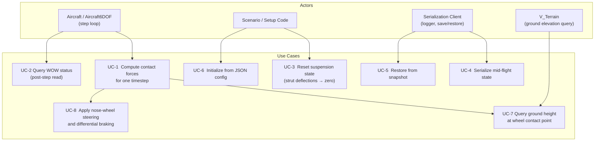
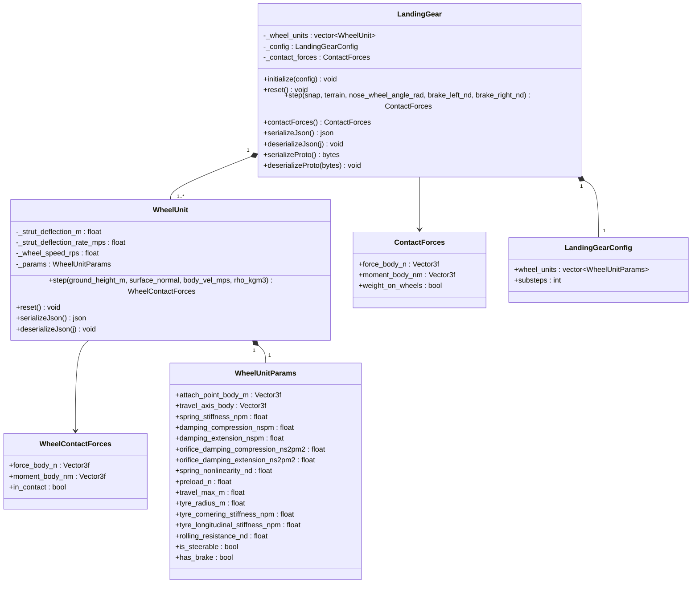
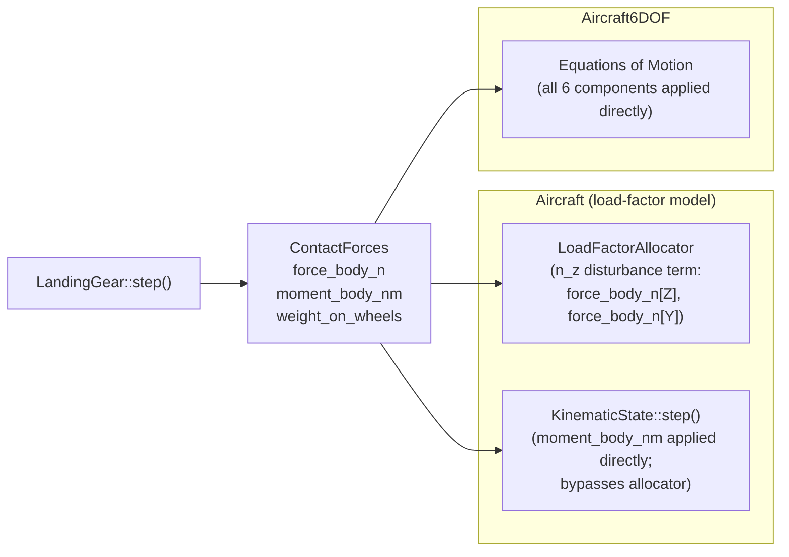

# Landing Gear — Architecture and Interface Design

This document is the design authority for the `LandingGear` subsystem. It covers the
physical models (suspension, tyre contact, wheel friction), the integration contracts with
`Aircraft` and `Aircraft6DOF`, the ground-plane interface, serialization, computational
resource requirements, and the test strategy.

**Design target use case:** developmental verification of autotakeoff and autolanding
functions — ground contact, bounce, WOW establishment, rollout heading control, taxi.

**Validity bound for `Aircraft` (load-factor model):** gear-induced pitch and roll moment
authority exceedance is not modeled. High-speed ground dynamics scenarios that depend on
FBW authority limits require `Aircraft6DOF`.

---

## Use Case Decomposition



| ID | Use Case | Primary Actor | Mechanism |
| --- | --- | --- | --- |
| UC-1 | Compute contact forces for one timestep | `Aircraft::step()` / `Aircraft6DOF::step()` | `LandingGear::step()` |
| UC-2 | Query WOW status after step | Aircraft, guidance, logging | `ContactForces::weight_on_wheels` |
| UC-3 | Reset suspension state | `Aircraft::reset()` | `LandingGear::reset()` |
| UC-4 | Serialize mid-flight snapshot | Logger, pause/resume | `serializeJson()` / `serializeProto()` |
| UC-5 | Restore from snapshot | Pause/resume | `deserializeJson()` / `deserializeProto()` |
| UC-6 | Initialize from JSON config | Scenario, test | `LandingGear::initialize(config)` |
| UC-7 | Query ground height at wheel contact point | Internal to `step()` | `V_Terrain::heightAtPosition_m()` |
| UC-8 | Apply nose-wheel steering and differential braking | Simulation loop | `step()` inputs `nose_wheel_angle_rad`, `brake_left_nd`, `brake_right_nd` |

---

## Class Hierarchy



---

## Integration with Aircraft Models



`LandingGear` is owned by both `Aircraft` and `Aircraft6DOF` as a non-optional member,
initialized from the `"landing_gear"` section of the aircraft JSON config.

### Integration Contract — `Aircraft`

`Aircraft::step()` calls `LandingGear::step()` before the `LoadFactorAllocator` solve.
The contact forces are applied as follows:

- `force_body_n[Z]` and `force_body_n[Y]` are passed to `LoadFactorAllocator` as additive
  disturbance terms alongside aerodynamic and propulsion forces.
- `moment_body_nm` is applied directly to the kinematic update, bypassing the allocator,
  because ground steering and differential braking are separate actuator systems outside
  FBW authority.

### Integration Contract — `Aircraft6DOF`

`Aircraft6DOF::step()` applies all six components of `ContactForces` directly to the
equations of motion with no special-casing.

---

## Physical Models

### 1. Wheel Geometry

Each wheel unit is defined by two body-frame vectors:

- **Attachment point** $\mathbf{p}_i^B$ — strut root in body coordinates (m).
- **Travel axis** $\hat{\mathbf{t}}_i^B$ — unit vector along strut compression direction
  in body coordinates (positive toward the ground in nominal attitude).

The contact point position in body frame is:

$$\mathbf{c}_i^B = \mathbf{p}_i^B + \delta_i\,\hat{\mathbf{t}}_i^B - r_w\,\hat{\mathbf{n}}^B$$

where $\delta_i$ is strut deflection (m, positive = compressed), $r_w$ is tyre radius (m),
and $\hat{\mathbf{n}}^B$ is the terrain surface normal expressed in body frame.

Strut deflection is constrained:

$$\delta_{i,\min} \leq \delta_i \leq \delta_{i,\max}$$

where $\delta_{i,\min} = 0$ (fully extended, no negative deflection — the strut cannot
pull the aircraft toward the ground) and $\delta_{i,\max}$ is the mechanical travel limit.

Ground penetration depth at step $k$ is:

$$h_i = z_{\text{ground}} - z_{c_i}$$

where $z_{\text{ground}}$ is the terrain height at the projected wheel contact point (m,
positive upward), $z_{c_i}$ is the $z$-coordinate of the contact point in the inertial
frame, and $h_i > 0$ indicates contact.

---

### 2. Suspension Dynamics — Oleo-Pneumatic Strut Model

Each strut is modeled as a nonlinear spring with asymmetric orifice damping, matching the
physical behavior of an oleo-pneumatic shock absorber.

#### 2a. Nonlinear Spring

Real pneumatic gas columns stiffen nonlinearly as they approach full compression. The spring
force is:

$$F_{\text{spring},i} = k_i \cdot \delta_i \cdot \left(1 + n_i \left(\frac{\delta_i}{\delta_{i,\max}}\right)^2\right) + F_{\text{preload},i}$$

where:

- $k_i$ — linear spring stiffness (N/m)
- $n_i$ — dimensionless nonlinearity factor (`spring_nonlinearity_nd`); at $n_i = 0$ the
  spring is linear; at $n_i = 2$ the effective stiffness triples at full compression
- $\delta_{i,\max}$ — mechanical travel limit (m)
- $F_{\text{preload},i}$ — static preload force (N)

#### 2b. Asymmetric Orifice Damping

Real oleo-pneumatic struts have a metering pin that partially closes the oil orifice on
compression and opens it on extension. This produces:

- High damping on compression (stroke energy absorbed at touchdown)
- Low damping on extension (quick strut recovery without bouncing the airframe back up)

The damping force combines a viscous (linear) term and an orifice (quadratic) term. The
quadratic term dominates at high closure speeds and is the physically correct model for
hydraulic orifice flow ($\Delta P \propto V^2$):

$$F_{\text{damp},i}(\dot{\delta}_i) = b(\dot{\delta}_i)\,\dot{\delta}_i + c(\dot{\delta}_i)\,|\dot{\delta}_i|\,\dot{\delta}_i$$

where the damping coefficients are selected by sign of $\dot{\delta}_i$:

$$b(\dot{\delta}) = \begin{cases} b_{c,i} & \dot{\delta} \geq 0\;\text{(compression)} \\ b_{e,i} & \dot{\delta} < 0\;\text{(extension)} \end{cases}, \qquad c(\dot{\delta}) = \begin{cases} c_{c,i} & \dot{\delta} \geq 0 \\ c_{e,i} & \dot{\delta} < 0 \end{cases}$$

| Parameter | Config key | Units | Typical ratio $c/e$ |
| --- | --- | --- | --- |
| $b_{c,i}$ | `damping_compression_nspm` | N·s/m | 5:1 |
| $b_{e,i}$ | `damping_extension_nspm` | N·s/m | — |
| $c_{c,i}$ | `orifice_damping_compression_ns2pm2` | N·s²/m² | 5:1 |
| $c_{e,i}$ | `orifice_damping_extension_ns2pm2` | N·s²/m² | — |

#### 2c. Total Strut Force

The total strut force (lower-bounded at zero — the strut cannot pull) is:

$$F_{s_i} = \max\!\bigl(0,\; F_{\text{spring},i} + F_{\text{damp},i}\bigr)$$

The force floor prevents suction when the strut extends rapidly past its natural length.

**Quasi-static strut deflection.** The current implementation uses a quasi-static
(unsprung-mass = 0) approximation: strut deflection $\delta_i$ is set directly to the
terrain penetration depth (clamped to travel limits), and $\dot{\delta}_i$ is estimated
from the finite difference with the previous substep:

$$\delta_i = \operatorname{clamp}(h_i,\ 0,\ \delta_{i,\max})$$

$$\dot{\delta}_i = \frac{\delta_i^k - \delta_i^{k-1}}{\Delta t_{\text{inner}}}$$

This avoids integrating a second-order ODE and eliminates the Euler stability constraint
$\Delta t < 2\sqrt{m/k}$. The `substeps` parameter subdivides the outer timestep to
improve the accuracy of $\dot{\delta}$ estimation at high closure speeds. The default is
`substeps = 4`.

**Note:** unsprung mass and tyre spring compliance are second-order effects relevant only
to a full 6DOF equations-of-motion model (`Aircraft6DOF`). The quasi-static strut is
appropriate for the load-factor (`Aircraft`) model and is not an open question for it.

---

### 3. Tyre Contact Forces — Pacejka Magic Formula

Tyre longitudinal force $F_x$ and lateral force $F_y$ are computed using the Pacejka
"magic formula":

$$F(s) = D \sin\!\bigl(C \arctan(B s - E(B s - \arctan(B s)))\bigr)$$

where $s$ is the relevant slip quantity (slip ratio $\kappa$ for longitudinal, slip angle
$\alpha_t$ for lateral), and $B$, $C$, $D$, $E$ are shape parameters.

#### 3a. Vertical Force

The tyre vertical force is the strut reaction force transmitted through the contact patch:

$$F_{z_i} = F_{s_i}$$

Contact is active only when $h_i > 0$; otherwise $F_{z_i} = 0$.

#### 3b. Longitudinal Slip Ratio

Slip ratio $\kappa$ is defined as:

$$V_\text{ref} = \max\!\bigl(|V_{cx}|,\;|\omega_w\,r_w|\bigr) + \epsilon$$

$$\kappa = \frac{\omega_w\,r_w - V_{cx}}{V_\text{ref}}$$

where:

- $\omega_w$ — wheel angular velocity (rad/s)
- $r_w$ — tyre rolling radius (m)
- $V_{cx}$ — contact-patch longitudinal velocity in the wheel plane (m/s)
- $\epsilon = 0.01$ m/s — regularization to avoid division by zero at standstill

The combined reference speed $V_\text{ref}$ bounds $\kappa$ to $[-1, 1]$ throughout the
contact phase. The naive denominator $|V_{cx}| + \epsilon$ causes $\kappa \to \omega_w r_w / \epsilon$
(thousands) when $V_{cx} \to 0$ while $\omega_w$ is nonzero (e.g., the instant of first
ground contact when the wheel begins spinning up from rest). That large slip ratio
produces a full-friction traction spike that injects energy into the wheel and, through
the aircraft equations of motion, permanently accelerates the aircraft — a non-physical
runaway.

For a locked wheel (braking), $\omega_w = 0$ and $V_\text{ref} = |V_{cx}| + \epsilon$,
so $\kappa = -V_{cx} / (|V_{cx}| + \epsilon) \to -1$ at speed — the expected braking
limit.

#### 3c. Slip Angle

Slip angle $\alpha_t$ is the angle between the wheel heading and the contact-patch velocity
vector projected onto the ground plane:

$$\alpha_t = -\arctan\!\left(\frac{V_{cy}}{|V_{cx}| + \epsilon}\right)$$

where $V_{cy}$ is the lateral component of the contact-patch velocity.

#### 3d. Pacejka Coefficients

The default parameter set is derived from generic bias-ply tyre data (Bakker, Nyborg, Pacejka 1987):

| Parameter | Longitudinal | Lateral | Description |
| --- | --- | --- | --- |
| $B$ | 10.0 | 8.0 | Stiffness factor |
| $C$ | 1.9 | 1.3 | Shape factor |
| $D$ | $\mu F_z$ | $\mu F_z$ | Peak value (friction-limited) |
| $E$ | 0.97 | −1.0 | Curvature factor |

where $\mu$ is the surface friction coefficient (see §5). These coefficients are fixed;
a future design study (OQ-LG-1) may introduce a parameter estimation pipeline from flight
test data.

#### 3e. Combined-Slip Saturation

When both longitudinal and lateral slip are nonzero, the total friction force is limited
by the tyre friction circle:

$$F_{t,i} = \sqrt{F_{x_i}^2 + F_{y_i}^2} \leq \mu F_{z_i}$$

If $F_{t,i} > \mu F_{z_i}$, both components are scaled down proportionally:

$$F_{x_i}' = F_{x_i}\,\frac{\mu F_{z_i}}{F_{t,i}}, \quad F_{y_i}' = F_{y_i}\,\frac{\mu F_{z_i}}{F_{t,i}}$$

---

### 4. Wheel Rotational Dynamics

Wheel angular velocity $\omega_w$ is integrated from the applied brake torque and tyre
longitudinal traction reaction:

$$I_w\,\dot{\omega}_w = -r_w\,F_{x_i} - \tau_{\text{brake},i} - \tau_{\text{roll},i}$$

where:

- $I_w$ — wheel polar moment of inertia (kg·m²). For this model, $I_w$ is approximated
  as $m_w r_w^2 / 2$ using a nominal wheel mass $m_w$ derived from the tyre radius via
  an empirical scaling $m_w \approx 0.3\,r_w$ (kg, with $r_w$ in m).
- $\tau_{\text{brake},i} = C_{\text{brake}}\,b_i\,\omega_w$ — brake torque, where
  $b_i \in [0, 1]$ is the normalized brake demand and $C_{\text{brake}}$ is the maximum
  brake torque (N·m), a config parameter.
- $\tau_{\text{roll},i} = \mu_r\,r_w\,F_{z_i}\,\operatorname{sign}(\omega_w)$ — rolling
  resistance torque, where $\mu_r$ is the rolling resistance coefficient (dimensionless).

The wheel decelerates to a stop in finite time because rolling resistance grows with $F_z$
and does not vanish as $\omega_w \to 0$ (the $\operatorname{sign}$ function is regularized
with a deadband below $|\omega_w| < 0.01$ rad/s to avoid chatter).

#### 4a. Integration Method and Stability

The wheel ODE is integrated by explicit Euler:

$$\omega_w^{k+1} = \omega_w^k + \dot{\omega}_w^k\,\Delta t_\text{inner}$$

The Pacejka longitudinal stiffness ($B = 10$, $C = 1.9$) makes explicit Euler conditionally
stable. The stability criterion for the linearized tyre torque feedback is approximately:

$$\Delta t < \frac{2\,I_w}{r_w^2 \cdot B C D / V_\text{ref}}$$

At $V_\text{ref} \sim 20$ m/s and typical small-UAS parameters ($r_w = 0.08$ m,
$\mu F_z \sim 40$ N), this bound evaluates to $\sim 1.5$ ms. The inner substep at the
default $N_\text{sub} = 4$ and outer $\Delta t = 0.02$ s is $\Delta t_\text{inner} = 5$ ms
— roughly 3× above the stability limit. Increasing $N_\text{sub}$ to satisfy the criterion
would require $N_\text{sub} \geq 14$, which is impractical for the targeted computational
budget.

The chosen fix is the **rolling-condition clamp** described in §4b. Implicit Euler
(which would be unconditionally stable) is a future improvement (OQ-LG-5) but is not
required once the clamp is in place.

The `substeps` parameter was selected to improve $\dot{\delta}$ estimation accuracy in the
spring-damper (§2c), not for wheel-spin stability. The two requirements are
decoupled: the spring-damper benefits from 4 substeps; the wheel spin stability is
guaranteed by the clamp independently of the substep count.

#### 4b. Rolling-Condition Clamp (Event Detection)

When the explicit Euler step would carry $\omega_w$ across the free-rolling condition
$\omega_\text{roll} = V_{cx} / r_w$ in a single substep, the update is replaced by a
snap-to-rolling:

$$\text{if}\quad (\omega_w^k - \omega_\text{roll})\,(\omega_w^{k+1} - \omega_\text{roll}) < 0 \quad \Rightarrow \quad \omega_w^{k+1} \leftarrow \omega_\text{roll}$$

This is the discrete equivalent of zero-crossing event detection for the slip-reversal
event. It eliminates the limit cycle that arises when the Euler step hunts across
$\kappa = 0$ every substep: at each substep the traction force reverses, driving $\omega_w$
to the opposite side of $\omega_\text{roll}$, which reverses again next substep — a
persistent oscillation that injects fictitious energy into the aircraft through a systematic
non-zero mean traction force.

The clamp is physically motivated: once the net torque would cross the free-rolling
condition in one step, it means the wheel is transitioning between driven and braked
regimes, and the physically correct state is free rolling (zero slip force) at that instant.

The four canonical tyre events handled this way are:

| Event | Condition | Action |
| --- | --- | --- |
| First contact | $h_i$ transitions $\leq 0 \to > 0$ | $\omega_w \leftarrow V_{cx}/r_w$ (spin-up to rolling) |
| Liftoff | $h_i$ transitions $> 0 \to \leq 0$ | $\omega_w$ state retained; strut forces zero |
| Rolling-condition crossing | $(\omega_w - \omega_\text{roll})$ sign change mid-step | $\omega_w \leftarrow \omega_\text{roll}$ (clamp) |
| Lockup | $\omega_w \to 0$ under full braking | Regularized by rolling-resistance deadband |

First-contact spin-up is not currently implemented as an explicit event (the wheel starts
from its last known $\omega_w$, which may be zero for a fresh contact); this is captured
as OQ-LG-6.

---

### 5. Surface Friction Parameterization

The surface friction coefficient $\mu$ is queried from the terrain at the wheel contact
point. `V_Terrain` is extended with a `frictionAt(lat_rad, lon_rad)` method that returns
a `SurfaceType` enum:

| `SurfaceType` | $\mu$ (dry) | $\mu$ (wet, multiplier) | Description |
| --- | --- | --- | --- |
| `Pavement` | 0.80 | 0.50 | Paved runway or taxiway |
| `Grass` | 0.40 | 0.30 | Mown grass airfield |
| `Dirt` | 0.50 | 0.25 | Unprepared dirt surface |
| `Gravel` | 0.60 | 0.35 | Gravel or packed aggregate |

Wet multipliers are applied when `AtmosphericState::precipitation > 0`. The friction
coefficient seen by the Pacejka formula is $\mu = \mu_{\text{dry}} \times f_{\text{wet}}$
when precipitation is active, and $\mu = \mu_{\text{dry}}$ otherwise.

**Open question OQ-LG-2:** A richer friction model (e.g., a continuous function of
precipitation intensity or surface contamination depth) has been deferred pending a use case
that requires it. The `SurfaceType` table is sufficient for the autotakeoff/autoland use case.

---

### 6. Ground Plane Interface

`LandingGear::step()` accepts a `const V_Terrain&` reference and calls
`terrain.heightAtPosition_m(lat_rad, lon_rad)` for each wheel contact point to obtain the
ground elevation. The surface normal is approximated by finite differences over a
configurable radius (default 0.5 m):

$$\hat{\mathbf{n}} = \frac{\nabla h \times \mathbf{e}_x}{\|\nabla h \times \mathbf{e}_x\|}$$

where $h$ is the terrain height function and $\mathbf{e}_x$ is the north unit vector.

**Runway geometry extension (proposed — not yet designed):** For runway operations a planar
runway patch inset into `TerrainMesh` is the preferred approach. An analytical runway
definition (with longitudinal slope and crowned lateral profile) is an alternative if a
dedicated runway primitive is added to `V_Terrain`. This choice is deferred to OQ-LG-3.

The `SensorAirData` AGL altitude calculation must use the same terrain height source as the
contact model to avoid discontinuities at touchdown.

---

## Force Assembly

The per-wheel contact forces are rotated from the wheel frame into the body frame and
summed. For each wheel unit $i$ with contact force $\mathbf{f}_i^B$ (already in body frame
after applying the wheel-heading rotation), the total body-frame force and moment are:

$$\mathbf{F}_{\text{gear}}^B = \sum_i \mathbf{f}_i^B$$

$$\mathbf{M}_{\text{gear}}^B = \sum_i \mathbf{c}_i^B \times \mathbf{f}_i^B$$

where $\mathbf{c}_i^B$ is the contact point position in body frame (§1).

The assembled result is returned as `ContactForces`:

```cpp
struct ContactForces {
    Eigen::Vector3f force_body_n   = Eigen::Vector3f::Zero();   // body-frame force (N)
    Eigen::Vector3f moment_body_nm = Eigen::Vector3f::Zero();   // body-frame moment (N·m)
    bool            weight_on_wheels = false;
};
```

`weight_on_wheels` is `true` when any wheel unit reports `in_contact = true`.

---

## Step Interface

```cpp
// include/landing_gear/LandingGear.hpp
namespace liteaero::simulation {

class LandingGear {
public:
    void initialize(const nlohmann::json& config);
    void reset();

    ContactForces step(const KinematicStateSnapshot& snap,
                       const V_Terrain&              terrain,
                       float                         nose_wheel_angle_rad,
                       float                         brake_left_nd,
                       float                         brake_right_nd);

    const ContactForces& contactForces() const;

    [[nodiscard]] nlohmann::json       serializeJson()                           const;
    void                               deserializeJson(const nlohmann::json&        j);
    [[nodiscard]] std::vector<uint8_t> serializeProto()                          const;
    void                               deserializeProto(const std::vector<uint8_t>& bytes);

private:
    LandingGearConfig        _config;
    std::vector<WheelUnit>   _wheel_units;
    ContactForces            _contact_forces;
};

} // namespace liteaero::simulation
```

`KinematicStateSnapshot` supplies position, velocity (NED), and attitude (rotation matrix
$C_{B}^{N}$) needed to project wheel attachment points into the inertial frame and to
compute contact-patch velocities.

---

## Serialization

### Serialized State

Serialized state covers all quantities that change between `reset()` and any mid-flight
`step()` call. Configuration parameters (spring stiffness, geometry, etc.) are not
serialized — they are reloaded from the JSON config on `initialize()`.

Per wheel unit:

| Field | Type | Unit | Description |
| --- | --- | --- | --- |
| `strut_deflection_m` | float | m | Strut compression |
| `strut_deflection_rate_mps` | float | m/s | Strut compression rate |
| `wheel_speed_rps` | float | rad/s | Wheel angular velocity |

Top-level:

| Field | Type | Description |
| --- | --- | --- |
| `schema_version` | int | Always `1` |
| `wheel_units` | array | Per-wheel state objects (ordered to match config) |

### Proto Message

```proto
message WheelUnitState {
    float strut_deflection_m        = 1;
    float strut_deflection_rate_mps = 2;
    float wheel_speed_rps           = 3;
}

message LandingGearState {
    int32                   schema_version = 1;
    repeated WheelUnitState wheel_units    = 2;
}
```

---

## Computational Resource Estimate

The landing gear model executes once per outer simulation step. The dominant cost is the
inner substep loop and the terrain height queries.

### Operation Counts (per outer step, tricycle gear — 3 wheel units)

| Operation | Count per substep | Substeps | Total per outer step |
| --- | --- | --- | --- |
| `V_Terrain::heightAtPosition_m()` | 3 | 1 (outer only) | **3** |
| Spring-damper force eval | 3 | $N_{\text{sub}}$ | $3 N_{\text{sub}}$ |
| Pacejka longitudinal formula | 3 | $N_{\text{sub}}$ | $3 N_{\text{sub}}$ |
| Pacejka lateral formula | 3 | $N_{\text{sub}}$ | $3 N_{\text{sub}}$ |
| Friction-circle saturation | 3 | $N_{\text{sub}}$ | $3 N_{\text{sub}}$ |
| Wheel speed integration (Euler) | 3 | $N_{\text{sub}}$ | $3 N_{\text{sub}}$ |
| Body-frame rotation + moment arm cross product | 3 | 1 (outer only) | **6** |

With the default $N_{\text{sub}} = 4$: **60 floating-point operations per outer step** at
model complexity, plus 3 terrain queries. All arithmetic is single-precision `float`.

### Memory Footprint (tricycle gear)

| Structure | Fields | Size |
| --- | --- | --- |
| `WheelUnit` state (×3) | 3 floats each | 36 bytes |
| `WheelUnitParams` (×3) | ~16 floats + 2 bools each | ~204 bytes |
| `LandingGearConfig` | substeps (int) | 4 bytes |
| `ContactForces` | 6 floats + 1 bool | 28 bytes |
| **Total** | | **~224 bytes** |

### Timing

At a 50 Hz outer rate (0.02 s step) and $N_{\text{sub}} = 4$, the landing gear inner loop
runs at 200 Hz. The terrain queries dominate wall time on `TerrainMesh` (bilinear
interpolation over a tile), typically < 1 µs each on a modern desktop CPU. The total
landing gear contribution to a 50 Hz simulation loop is estimated at **< 20 µs** per step —
negligible relative to the allocator Newton solve (which dominates).

The model does **not** require the outer timestep to be reduced below the standard
simulation rate.

---

## Open Questions

| ID | Status | Blocking |
| --- | --- | --- |
| OQ-LG-1 | Pacejka coefficient sourcing | Not blocking |
| OQ-LG-2 | Richer surface friction model | Not blocking |
| OQ-LG-3 | Runway geometry extension | Blocking for runway operations |
| OQ-LG-4 | Unsprung mass and tyre spring compliance | Not blocking for `Aircraft`; deferred to `Aircraft6DOF` |
| OQ-LG-5 | ~~Integration method for wheel spin ODE~~ **Resolved: Tustin; substep count by 3× Nyquist rule** | — |
| OQ-LG-6 | ~~Airborne wheel spin-down model~~ **Resolved: linear + quadratic bearing drag; spindown-time parametrization** | — |
| OQ-LG-7 | ~~First-contact wheel speed initial condition~~ **Resolved: no special action; Tustin integrator handles spin-up** | — |

---

### OQ-LG-1 — Pacejka Coefficient Sourcing

**Question:** Should the Pacejka coefficients ($B$, $C$, $D$, $E$) for longitudinal and
lateral force be fixed at generic bias-ply values (Bakker et al. 1987), or should a
parameter estimation pipeline from flight test data be introduced?

**Current state:** The model uses fixed coefficients from Table 3d (§3d). These are
representative for generic small-aircraft bias-ply tyres but have not been validated
against any specific tyre used on a liteaero aircraft. $D = \mu F_z$ preserves the
friction-circle invariant regardless of $\mu$, so the dominant uncertainty is in the
shape parameters $B$, $C$, $E$ — which control the slope and sharpness of the
force-vs-slip curve.

**Why it matters:** The shape parameters govern the deceleration distance during rollout
and the lateral force build-up during a crab landing. An incorrect $B$ makes the tyre
appear too stiff or too progressive. For autolanding validation the error is partially
masked by the friction-circle saturation, but a wrong rollout distance or heading excursion
budget could produce a misleading pass/fail verdict.

**Options considered:**

1. **Fixed generic set (current).** Simple, no flight test data required. Acceptable for
   development verification where absolute deceleration distance tolerances are wide.
2. **Lookup table per aircraft type.** Coefficients stored in the aircraft JSON config
   alongside spring stiffness and geometry. No pipeline needed; updated manually from
   test data or manufacturer specs.
3. **Automated identification from logged rollout data.** A Python-side optimizer fits
   $B$, $C$, $E$ to measured wheel speed and deceleration from a set of rollout runs.
   Requires instrumented rollout data (wheel speed sensor, inertial deceleration) — not
   yet available.

**Resolution criteria:** Option 2 (per-type config lookup) is the minimum acceptable for
production use. Option 3 is reserved until instrumented flight test data exist. Until
then the fixed set is used and any deceleration distance figures in scenario test pass
criteria are treated as order-of-magnitude estimates only.

---

### OQ-LG-2 — Richer Surface Friction Model

**Question:** Should surface friction $\mu$ be a continuous function of precipitation
intensity (and possibly surface contamination depth), or is the current binary wet/dry
multiplier sufficient?

**Current state:** `V_Terrain::frictionAt()` returns one of four `SurfaceType` values
(§5). The wet multiplier is applied when `precipitation > 0` — a binary step. There is no
model for water depth, rubber contamination, or the transition from dry to fully wet.

**Why it matters:** The friction coefficient on a contaminated runway can vary from 0.80
(dry pavement) to 0.05 (standing water, aquaplaning). The landing distance and crosswind
limit are both sensitive to $\mu$. The binary model produces a discontinuous step in
contact force when precipitation transitions on/off during a simulation run, which is
unphysical and can excite the strut spring.

**Options considered:**

1. **Binary wet/dry (current).** Sufficient for the autotakeoff/autoland development use
   case where the scenario either rains or it does not.
2. **Linear interpolation by precipitation intensity.** `precipitation_mm_hr` drives a
   blending factor between $\mu_\text{dry}$ and $\mu_\text{wet}$. Avoids the binary
   step; requires `Atmosphere` to expose precipitation rate.
3. **Aquaplaning threshold.** Below the aquaplaning speed ($V_{aq} \approx 9\sqrt{p_t}$
   where $p_t$ is tyre pressure in psi) full $\mu_\text{wet}$ applies; above it $\mu$
   drops sharply. Requires tyre pressure as a config parameter.

**Resolution criteria:** Option 1 remains in place until a scenario requires differentiated
friction during a precipitation transition. The `SurfaceType` table in §5 covers the
current use cases. OQ-LG-2 becomes blocking if an aquaplaning or wet-runway crosswind
limit scenario is added to the test matrix.

---

### OQ-LG-3 — Runway Geometry Extension

**Question:** How should a paved runway be represented in `V_Terrain` to support precise
runway operations — as a planar patch inset into `TerrainMesh`, or as a new analytical
runway primitive added to the `V_Terrain` interface?

**Current state:** `TerrainMesh` represents terrain as a triangulated mesh loaded from
a `.las` point cloud (§6). A runway can be approximated by the mesh, but the mesh
resolution and triangulation quality are determined by the LiDAR survey density, not by
the runway geometry. Mesh-based runways exhibit residual height noise ($\sim 0.02$ m RMS
from LiDAR ground-return scatter) that produces spurious contact transitions during
high-speed ground roll.

**Why it matters:** Autolanding requires a clean, noise-free terrain surface in the
flare and rollout zone. Residual height noise at touchdown produces spurious WOW
oscillations and corrupts the AGL estimate used by the flare guidance. An analytical
runway eliminates both problems.

**Options considered:**

1. **Planar inset patch.** A rectangular flat patch at a defined altitude is spliced into
   `TerrainMesh` during tile generation, overriding the LiDAR-derived triangles inside
   the runway boundary. The `V_Terrain` interface is unchanged. Requires a runway boundary
   definition in the tile preprocessing pipeline.
2. **Analytical runway primitive in `V_Terrain`.** `V_Terrain` gains a `RunwayPrimitive`
   that overrides `heightAtPosition_m()` and `frictionAt()` inside the runway footprint.
   The footprint is defined by threshold coordinates, heading, width, and length. Supports
   longitudinal slope and lateral crown without mesh refinement.
3. **Combined: analytical primitive + mesh blend.** The runway primitive provides height
   and friction; the mesh provides everything else. A transition zone smoothly blends the
   two in the overrun area. Most physically accurate but most complex.

**Resolution criteria:** OQ-LG-3 is **blocking for runway operations**. Option 2
(analytical primitive) is the preferred approach because it decouples runway geometry
from mesh quality and enables precise threshold and centerline coordinates from published
aeronautical data. Design must be resolved before implementing any autolanding scenario
that uses a real or representative runway.

---

### OQ-LG-4 — Unsprung Mass and Tyre Spring Compliance

**Question:** Should the wheel and tyre unsprung mass, and the tyre radial spring
compliance, be modeled as separate degrees of freedom?

**Current state:** The quasi-static strut approximation (§2c) sets strut deflection
directly to terrain penetration depth, implicitly assuming zero unsprung mass and an
infinitely stiff tyre. The strut force is transmitted instantaneously to the airframe.

**Why it matters for `Aircraft6DOF`:** In a full 6DOF equations-of-motion model the
airframe accelerations are computed from the net force, so the spring-mass system
formed by the strut + airframe mass is the primary frequency of interest. The unsprung
mass and tyre compliance introduce a second, higher-frequency mode. At small tyre radii
(0.08 m, typical small UAS) the tyre spring stiffness is very high ($k_t \sim 50{,}000$
N/m) and the unsprung mass is small ($m_u \sim 0.1$ kg), giving a natural frequency
$\omega_n = \sqrt{k_t/m_u} \approx 700$ rad/s — well above the 50 Hz outer rate.
The quasi-static approximation remains valid for `Aircraft6DOF` in this frequency range.

**Why it does not matter for `Aircraft`:** The `Aircraft` load-factor model sets attitude
and alpha from commanded load factors via the allocator. The strut force enters as a
disturbance to the allocator, not as a direct force in Newton's second law. The
structural dynamics of the strut are not observable in the outputs of the load-factor
model.

**Resolution:** Deferred indefinitely for `Aircraft`. For `Aircraft6DOF`, deferred until
a scenario requires it — most likely a hard landing structural load assessment where peak
strut force is a design driver. The quasi-static strut is correct for all autolanding
verification use cases at the current fidelity target.

---

### OQ-LG-5 — Integration Method for Wheel Spin ODE *(Resolved)*

**Resolution:** Use Tustin (bilinear) discretization for the wheel angular velocity ODE.
Set the substep count so that the Nyquist frequency of the inner timestep exceeds the
linearized tyre-dynamics pole frequency by at least 3×.

**Chosen alternative:** Tustin discretization (alternative 3 from the open question).
The trapezoidal update

$$\omega_w^{k+1} = \omega_w^k + \frac{\Delta t}{2}\bigl(\dot{\omega}_w^k + \dot{\omega}_w(\omega_w^{k+1})\bigr)$$

is equivalent to applying the Tustin transform $s \leftarrow \frac{2}{\Delta t}\frac{z-1}{z+1}$
to the linearized ODE. It is unconditionally stable for linear stiffness and second-order
accurate in time, and uses the discretization pattern already established for filter design
in this project ([`docs/algorithms/filters.md`](../algorithms/filters.md)).

**Substep count rule:**

The linearized tyre-dynamics pole frequency (rad/s) near the free-rolling condition is:

$$\omega_\text{pole} = \frac{r_w^2\,k_\kappa}{I_w\,V_\text{ref}}, \quad k_\kappa = B C D = B C \mu F_z$$

where $r_w$ is the tyre radius (m), $B$ and $C$ are the Pacejka shape factors (10.0 and
1.9 for the longitudinal direction), $\mu$ is the surface friction coefficient, $F_z$ is
the strut normal force (N), $I_w = 0.15\,r_w^3$ (kg·m²) is the wheel moment of inertia,
and $V_\text{ref} = \max(|V_{cx}|, |\omega_w r_w|) + \epsilon$ (m/s) is the slip
reference speed.

The Nyquist frequency of the inner substep is $f_N = 1/(2\,\Delta t_\text{inner})$ (Hz).
The 3× margin requirement is:

$$f_N \geq 3\,\frac{\omega_\text{pole}}{2\pi}
\quad\Longrightarrow\quad
\Delta t_\text{inner} \leq \frac{\pi\,I_w\,V_\text{ref}}{3\,r_w^2\,k_\kappa}$$

Substituting $I_w = 0.15\,r_w^3$ and $k_\kappa = B C \mu F_z$:

$$N_\text{sub} \geq \frac{3\,\Delta t_\text{outer}\,B C \mu F_z}{\pi \times 0.15\,r_w\,V_\text{ref}}
= \frac{20\,B C \mu F_z\,\Delta t_\text{outer}}{\pi\,r_w\,V_\text{ref}}$$

The pole frequency is worst (largest, most demanding) at maximum $\mu F_z$ and minimum
$V_\text{ref}$. The design operating point for $N_\text{sub}$ selection is **maximum
expected gear load at approach speed**, which is when tyre dynamics are most active.
Below taxi speed the tyre has already reached the free-rolling condition and residual
dynamics are negligible; imposing the criterion at near-zero speed would require
impractical substep counts because $V_\text{ref}$ decreases toward $\epsilon$.

For the reference small-UAS configuration ($r_w = 0.08$ m, $\mu = 0.8$,
$F_z = mg = 49$ N peak at 1g, $V_\text{ref} = 20$ m/s approach, $\Delta t_\text{outer}
= 0.02$ s):

$$N_\text{sub} \geq \frac{20 \times 10 \times 1.9 \times 0.8 \times 49 \times 0.02}{\pi \times 0.08 \times 20} \approx 59 \quad\Rightarrow\quad N_\text{sub} = 60$$

The configured `substeps` value in the aircraft JSON must satisfy this bound for the
specific aircraft's tyre radius, maximum gear load, and approach speed. It is not a
single universal constant.

**Effect on rolling-condition clamp:** The Tustin integrator is unconditionally stable
and does not produce the limit cycle that the rolling-condition clamp (§4b) was designed
to suppress. Once the Tustin integrator is implemented, the rolling-condition clamp is
removed. Until implementation is complete, the clamp remains in place as the current
workaround and §4a and §4b continue to describe the existing explicit-Euler + clamp
behavior.

*Implementation pending explicit instruction.*

---

### OQ-LG-6 — Airborne Wheel Spin-Down Model *(Resolved)*

**Resolution:** Apply a combined linear + quadratic bearing drag torque during the
airborne phase. Both coefficients are derived from a single user-specified spindown time
parameter that defines how long the wheel takes to reach the rolling-resistance deadband
speed starting from the free-rolling rate at minimum flight speed. No aerodynamic area or
drag coefficient parameters are used.

**Drag model:**

During each substep in which `penetration_m` $\leq 0$ (wheel airborne), the wheel ODE is:

$$I_w\,\dot{\omega}_w = -(c_1\,\omega_w + c_2\,|\omega_w|\,\omega_w)$$

where $c_1$ (N·m·s/rad) is the linear (viscous) coefficient and $c_2$ (N·m·s²/rad²) is
the quadratic coefficient. Both terms always oppose rotation. The linear term dominates at
low spin rates (bearing viscous drag); the quadratic term dominates at high spin rates
(hydrodynamic lubrication losses in the bearing). Neither term requires aerodynamic
parameters or tyre frontal area.

**Parametrization — single spindown time:**

Both coefficients are derived from two config fields on `WheelUnitParams`:

- `spindown_time_s` ($T_\text{sd}$, s) — the time for the wheel to spin down from the
  reference angular velocity $\omega_\text{ref}$ to the rolling-resistance deadband speed
  $\omega_\text{db} = 0.01$ rad/s (the same deadband already used in the on-ground rolling
  resistance model).
- `spindown_reference_speed_mps` ($V_\text{ref}$, m/s) — the minimum credible flight
  speed of the aircraft (approximately stall speed). The reference angular velocity is
  $\omega_\text{ref} = V_\text{ref} / r_w$.

The coefficients are set so that at $\omega_\text{ref}$ both terms contribute equally
($c_1\,\omega_\text{ref} = c_2\,\omega_\text{ref}^2$, i.e. $c_2 = c_1/\omega_\text{ref}$).
This gives a single-parameter family in $c_1$, and the spindown time constraint determines
$c_1$ uniquely. With $c_2 = c_1/\omega_\text{ref}$ the ODE factors as:

$$I_w\,\dot{\omega}_w = -\frac{c_1}{\omega_\text{ref}}\,\omega_w(\omega_\text{ref} + \omega_w)$$

This Bernoulli ODE has the closed-form solution (for $\omega_w \geq 0$):

$$\omega_w(t) = \frac{\omega_\text{ref}\,e^{-K\,\omega_\text{ref}\,t}}{2 - e^{-K\,\omega_\text{ref}\,t}}, \quad K = \frac{c_1}{I_w\,\omega_\text{ref}}$$

Applying the boundary condition $\omega_w(T_\text{sd}) = \omega_\text{db}$ and solving
for $K$:

$$K = \frac{1}{\omega_\text{ref}\,T_\text{sd}}\ln\!\frac{\omega_\text{ref} + \omega_\text{db}}{2\,\omega_\text{db}}$$

Since $\omega_\text{ref} \gg \omega_\text{db}$ this simplifies to approximately:

$$K \approx \frac{\ln(\omega_\text{ref} / 2\,\omega_\text{db})}{\omega_\text{ref}\,T_\text{sd}}$$

The two model coefficients computed once at `initialize()` are:

$$c_1 = K\,I_w\,\omega_\text{ref}, \qquad c_2 = K\,I_w$$

**Example:** For the reference small-UAS configuration ($r_w = 0.08$ m, $I_w \approx
7.7 \times 10^{-5}$ kg·m², $V_\text{ref} = 20$ m/s → $\omega_\text{ref} = 250$ rad/s,
$T_\text{sd} = 5$ s):

$$K \approx \frac{\ln(250/0.02)}{250 \times 5} = \frac{9.43}{1250} \approx 7.5 \times 10^{-3} \text{ rad}^{-1}\text{s}^{-1}$$

$$c_1 \approx 7.5\times10^{-3} \times 7.7\times10^{-5} \times 250 \approx 1.45 \times 10^{-4} \text{ N·m·s/rad}$$

$$c_2 \approx 7.5\times10^{-3} \times 7.7\times10^{-5} \approx 5.8 \times 10^{-7} \text{ N·m·s}^2/\text{rad}^2$$

At these values the wheel starting from 250 rad/s reaches the 0.01 rad/s deadband in
5 s; a bounce with 0.1 s airborne time retains $\approx 96\%$ of its liftoff speed.

**Integration:** The bearing drag ODE is non-stiff ($\tau_\text{eff} \approx T_\text{sd}/
\ln(\omega_\text{ref}/\omega_\text{db}) \sim 0.5$ s $\gg \Delta t_\text{inner}$), so the
Tustin integrator from OQ-LG-5 applies with no substep count constraint. Once
$|\omega_w| < \omega_\text{db}$, $\omega_w$ is snapped to zero by the existing deadband
logic, satisfying the finite-time-to-zero requirement.

**New config parameters on `WheelUnitParams`:**

| Field | Type | Units | Description |
| --- | --- | --- | --- |
| `spindown_time_s` | float | s | Time to decay from $V_\text{ref}/r_w$ to deadband |
| `spindown_reference_speed_mps` | float | m/s | Minimum flight speed reference ($V_\text{ref}$) |

*Implementation pending explicit instruction.*

---

### OQ-LG-7 — First-Contact Wheel Speed Initial Condition *(Resolved)*

**Resolution:** No special action at first contact. The Tustin integrator running at the
3× Nyquist substep count (OQ-LG-5) integrates $\omega_w$ from the value produced by the
airborne bearing drag model (OQ-LG-6) toward free-rolling naturally, driven by the tyre
Pacejka force. No contact-transition detection, snap logic, or per-wheel event state is
added.

**Rationale:** After a long airborne phase, OQ-LG-6 ensures $\omega_w \approx 0$ at
touchdown. The wheel therefore starts the first contact substep at maximum braking slip
($\kappa_0 \approx -1$) and the Pacejka formula applies full braking traction
$F_x \approx -\mu F_z$. This is physically correct: a non-spinning wheel scrubbing onto
a moving surface genuinely generates maximum braking friction during the spin-up transient.
The Tustin integrator at the substep size set by the 3× Nyquist rule resolves the
spin-up time constant $\tau \approx 0.3$–$0.4$ ms accurately, so the simulated braking
impulse is a faithful representation of the physical event rather than a numerical
artifact.

No code change is required beyond the OQ-LG-5 and OQ-LG-6 implementations. The
first-contact case is handled identically to every other contact substep.

*Implementation: no action required beyond OQ-LG-5 and OQ-LG-6.*

---

## Test Strategy

All tests follow TDD: a failing test is written before the corresponding production code.
Tests are organized into four categories: unit (isolated model math), integration
(multi-component with `Aircraft`), scenario (physics scenario pass/fail criteria), and
serialization (JSON + proto round-trip).

---

### Unit Tests — `LandingGear_test.cpp`

#### Suspension

| Test | Input | Pass criterion |
| --- | --- | --- |
| `StrutForce_UnderPreload_Positive` | Deflection = 0, preload = 500 N | $F_s = 500$ N |
| `StrutForce_Compressed_Linear` | $\delta = 0.05$ m, $k = 10{,}000$ N/m, preload = 0 | $F_s = 500$ N |
| `StrutForce_FloorAtZero` | $\delta < 0$ (strut extended past limit) | $F_s = 0$ |
| `StrutDeflection_ClampedAtTravelMax` | Drive $\delta$ past `travel_max_m` | $\delta = \delta_{\max}$, rate ← 0 |

#### Pacejka Tyre Formula

| Test | Input | Pass criterion |
| --- | --- | --- |
| `Pacejka_ZeroSlip_ZeroForce` | $\kappa = 0$, $\alpha_t = 0$ | $F_x = F_y = 0$ |
| `Pacejka_LongitudinalPeak_AtHighSlip` | $\kappa = 1$, $F_z = 1{,}000$ N | $F_x \approx \mu F_z$ (within 5%) |
| `Pacejka_LateralPeak_AtHighSlipAngle` | $\alpha_t = 15°$, $F_z = 1{,}000$ N | $F_y \approx \mu F_z$ (within 5%) |
| `FrictionCircle_Combined_Saturates` | $\lvert\kappa\rvert = 1$, $\lvert\alpha_t\rvert = 20°$ | $\sqrt{F_x^2 + F_y^2} \leq \mu F_z$ |

#### Slip Computations

| Test | Input | Pass criterion |
| --- | --- | --- |
| `SlipRatio_LockedWheel` | $\omega_w = 0$, $V_{cx} = 20$ m/s | $\kappa = -1.0$ |
| `SlipRatio_FreeRolling` | $\omega_w = V_{cx}/r_w$ | $\lvert\kappa\rvert < 0.01$ |
| `SlipAngle_PureSlide` | $V_{cy} = 5$ m/s, $V_{cx} = 0$ | $\lvert\alpha_t\rvert = 90° \pm 1°$ |

#### Wheel Speed Integration

| Test | Input | Pass criterion |
| --- | --- | --- |
| `WheelSpeed_DecaysToZero_RollingResistance` | Release free-rolling wheel, no traction input | $\omega_w \to 0$ in finite steps |
| `WheelSpeed_Brake_FullLock` | $b = 1.0$, high $C_{\text{brake}}$ | $\omega_w = 0$ within 1 s simulated time |

#### Unit Tests — Force Assembly

| Test | Input | Pass criterion |
| --- | --- | --- |
| `ContactForces_StaticSingleWheel_VerticalOnly` | Level surface, zero velocity, one wheel | $F_z = F_s$; $F_x = F_y = 0$; moment = $\mathbf{c} \times \mathbf{f}$ |
| `ContactForces_WOW_FalseWhenAirborne` | All wheels above ground | `weight_on_wheels = false` |
| `ContactForces_WOW_TrueOnAnyContact` | One wheel contacts, two do not | `weight_on_wheels = true` |

---

### Integration Tests — `LandingGear_Aircraft_test.cpp`

These tests drive `Aircraft` through a pre-computed trajectory and verify that `LandingGear`
produces physically consistent outputs when integrated via the `Aircraft::step()` disturbance
path.

| Test | Scenario | Pass criterion |
| --- | --- | --- |
| `Aircraft_LandingContact_WOW_Established` | Descending at 3 m/s vertical, gear-down state; FlatTerrain at $z = 0$ | `weight_on_wheels` transitions false → true within the first 3 steps after $z_{\text{aircraft}} < r_w$ |
| `Aircraft_StaticOnGround_NoSink` | Aircraft placed at gear contact height, zero velocity, no thrust | After 100 steps, $\lvert z_{\text{drift}}\rvert < 0.01$ m — suspension holds the aircraft up |
| `Aircraft_LandingGear_Disturbance_AppliedToAllocator` | Single main gear contacts; nose gear airborne | Vertical force component nonzero in allocator input; roll moment nonzero in kinematic update |

---

### Scenario Tests

#### Landing Roll-Out — Deceleration

**Test:** `Scenario_LandingRollout_StopsInFiniteDistance`

Setup: Aircraft placed on FlatTerrain at zero altitude, initial $V_x = 50$ m/s, zero thrust,
full brakes ($b = 1.0$), no wind. Integrate for 60 s simulated time.

Pass criteria:

- Ground speed reaches $< 0.5$ m/s within 2,000 m ground roll.
- No wheel unit reports negative strut deflection at any step.
- `weight_on_wheels` remains `true` for the entire run.

**Test:** `Scenario_LandingRollout_StopsInFiniteDistance_NoBrakes`

Same as above with $b = 0$. Pass criterion: ground speed reaches $< 0.5$ m/s within 5,000 m
(rolling resistance only).

---

#### Landing with a Crab

A crab landing occurs when the aircraft crosses the runway threshold with a nonzero sideslip
angle $\beta$ (the crab angle) to maintain track against crosswind, then straightens on
contact. The tyre lateral forces at touchdown must develop fast enough to align the wheel
heading with the runway center line without exceeding the friction limit.

**Test:** `Scenario_CrabLanding_NoSkid`

Setup:

- `FlatTerrain` at $z = 0$.
- Initial state: $V_x = 50$ m/s (runway axis), $V_y = 8$ m/s (crosswind — 9° crab), $V_z = -1.5$ m/s (descent).
- Crab angle at touchdown: $\beta_0 = \arctan(8/50) \approx 9.1°$.
- No nose-wheel steering input; $b = 0.4$ (light braking, symmetric).
- Constant wind: 8 m/s from 090°, runway heading 360°.

Pass criteria:

- WOW establishes within the first 5 steps.
- Lateral ground speed $\lvert V_y \rvert$ reduces from 8 m/s to $< 1$ m/s within 500 m ground roll.
- Peak combined tyre force $\leq 1.05\,\mu F_z$ (friction circle not exceeded by more than 5%).
- Aircraft heading excursion $< 15°$ from runway center line throughout rollout.

**Test:** `Scenario_CrabLanding_HighCrosswind_FrictionLimited`

Same geometry but $V_y = 15$ m/s (17° crab, beyond typical crosswind limit). Verifies
that the friction circle saturation clamps lateral forces and the aircraft departs the
runway edge rather than exhibiting unphysical heading recovery.

---

#### Takeoff Roll

**Test:** `Scenario_TakeoffRoll_LiftoffOccurs`

Setup:

- `FlatTerrain`, zero wind.
- Initial state: all wheels on ground, $V_x = 0$, full forward thrust.
- Takeoff sequence: hold heading via nose-wheel steering until rotation speed, then
  pull to rotation pitch attitude; no guidance law — open-loop pitch command.

Pass criteria:

- Ground roll distance to rotation $V_R = 40$ m/s $< 800$ m.
- WOW transitions true → false (liftoff) within 20 s simulated time.
- No negative strut deflection at any step during the ground roll.
- Heading deviation from runway axis $< 5°$ throughout ground roll (nose-wheel authority).

**Test:** `Scenario_TakeoffRoll_NoseWheelSteering_HeadingControl`

Setup: ground roll with a small initial heading offset of 2°; nose-wheel steering applies
a restoring angle of 3° for 5 s then releases.

Pass criterion: heading offset corrects to $< 0.5°$ within 200 m.

---

#### Bounce and Rebound

**Test:** `Scenario_HardLanding_BounceAndSettle`

Setup: descent rate at touchdown $V_z = -4$ m/s (hard landing). Monitor strut deflection,
aircraft altitude, and WOW over 5 s.

Pass criteria:

- WOW transitions false → true → false → true (one bounce).
- Peak strut deflection $< \delta_{\max}$ (no bottoming out).
- Aircraft altitude oscillation damps to $< 0.05$ m amplitude within 3 s.

---

#### Uneven Terrain

**Test:** `Scenario_TaxiOverBump_NoLiftoff`

Setup: `TerrainMesh` with a Gaussian bump of height 0.15 m and radius 2 m placed on the
taxi path. Aircraft taxiing at 5 m/s ground speed.

Pass criteria:

- Strut deflection on the bump-traversing wheel increases by $\geq 0.05$ m as it rolls over.
- WOW remains `true` throughout.
- No implausible discontinuity in `ContactForces` between steps (i.e., $\lvert\Delta F_z\rvert < 5 k V_z \Delta t$).

---

### Serialization Tests

| Test | Method | Pass criterion |
| --- | --- | --- |
| `SerializeJson_RoundTrip_MatchesState` | Serialize after 50 steps; deserialize to new instance; run 10 more steps | Output forces identical to reference stream |
| `SerializeProto_RoundTrip_MatchesState` | Same as above, proto path | Output forces identical |
| `DeserializeJson_SchemaVersionMismatch_Throws` | Version field ≠ 1 | `std::invalid_argument` |
| `DeserializeJson_WheelCountMismatch_Throws` | Serialized 3 wheels, config has 2 | `std::invalid_argument` |

---

## Visualization Notebooks

All notebooks live under `python/notebooks/landing_gear/` and use the
`python/tools/log_reader.py` interface to load `.csv` logger output from batch simulation
runs. Matplotlib is used for 2D plots; Matplotlib with 3D axes or a lightweight glTF
viewer is used for terrain animations.

---

### `landing_gear_contact_forces.ipynb`

**Purpose:** Time-series analysis of landing contact, bounce, and rollout dynamics.

**Scenario:** Hard landing at $V_z = -3$ m/s onto flat terrain, followed by rollout to stop.

**Plots:**

1. **Strut deflection vs. time** — one subplot per wheel unit; overlay $\delta_{\max}$ as
   a red dashed line.
2. **Contact force components vs. time** — $F_z$, $F_x$, $F_y$ per wheel; stacked
   subplots.
3. **Friction utilization vs. time** — $\sqrt{F_x^2 + F_y^2}\,/\,(\mu F_z)$ per wheel;
   horizontal red line at 1.0 (friction limit).
4. **Wheel speed vs. time** — $\omega_w$ per wheel; overlay $V_{cx}/r_w$ (free-rolling
   reference) as dashed line.
5. **Aircraft altitude and WOW flag vs. time** — dual-axis: altitude (m) left, WOW (0/1)
   right. Annotate the touchdown and bounce events.

---

### `crab_landing_dynamics.ipynb`

**Purpose:** Visualize crosswind crab-landing dynamics — lateral velocity decay, heading
excursion, friction circle loading.

**Scenario:** 9° crab ($V_y = 8$ m/s), runway heading 000°, 8 m/s crosswind.

**Plots:**

1. **Ground track** — top-down view: aircraft X-Y trajectory over the runway centerline
   (drawn as a dashed line). Color the track by friction utilization.
2. **Heading and crab angle vs. ground distance** — aircraft heading minus runway heading;
   annotate WOW event.
3. **Lateral velocity vs. ground distance** — $V_y$ from touchdown to stop.
4. **Per-wheel friction utilization vs. ground distance** — one line per wheel; annotate
   when the friction circle saturates.
5. **Combined tyre force vector animation** — 2D top-down arrow animation at 10× slow-mo
   showing the tyre force vector at each main gear as the crab angle unwinds. Exported as
   a `.gif` for documentation embedding.

---

### `takeoff_roll.ipynb`

**Purpose:** Validate autotakeoff roll — ground distance, rotation, liftoff.

**Scenario:** Full-thrust takeoff, open-loop rotation at $V_R$.

**Plots:**

1. **Ground speed and airspeed vs. time** — annotate $V_R$ and liftoff.
2. **Nose-wheel normal force vs. time** — goes to zero at rotation; annotate rotation event.
3. **Heading deviation vs. ground distance** — verify runway tracking.
4. **Strut deflection — all wheels vs. time** — nose strut deflects during nose-up rotation.
5. **WOW flag timeline** — bar chart showing which wheels are in contact at each time step,
   from brakes-release to climb-out.

---

### `touchdown_animation.py` — Standalone Touchdown Animation

**Location:** [`python/scripts/touchdown_animation.py`](../../python/scripts/touchdown_animation.py)

**Dependencies.** The script calls the C++ `LandingGear` class through Python bindings
(pybind11). Gear contact forces are computed by `LandingGear::step()` — the physics are
not reimplemented in Python. A lightweight Python-side aerodynamics model provides lift,
drag, and pitch moment until a C++ aerodynamics class with bindings exists.

---

#### Simulation Model

The script drives a 3-DOF planar scenario (surge $x$, heave $z$, pitch $\theta$) using
explicit Euler at $\Delta t = 0.002$ s. The full trajectory is pre-computed before the
animation loop starts; the animation only reads pre-computed arrays.

**Equations of motion** (integrated by the script):

$$m\ddot{x} = F_{x,\text{aero}} + F_{x,\text{gear}}$$

$$m\ddot{z} = F_{z,\text{aero}} + F_{z,\text{gear}} - mg$$

$$I_{yy}\ddot{\theta} = M_{\text{aero}} + M_{\text{gear}}$$

**Gear forces.** At each step the script constructs a `KinematicStateSnapshot` from the
current $(x, z, \theta, \dot{x}, \dot{z}, q)$ and passes it to `LandingGear::step()`.
The C++ class returns per-unit contact forces and moments; the script sums them into
$F_{x,\text{gear}}$, $F_{z,\text{gear}}$, and $M_{\text{gear}}$. See
§[Physical Models](#physical-models) for the contact model equations that the C++ class
implements.

**Aerodynamics** (Python-side, to be replaced when a C++ aerodynamics class with bindings
exists). Linear lift curve, parabolic drag polar, quasi-static pitch moment with pitch-rate
damping:

$$C_L = C_{L_\alpha}\alpha, \quad C_D = C_{D_0} + \frac{C_L^2}{\pi e AR}, \quad
C_m = C_{m_0} + C_{m_\alpha}\alpha + \hat{C}_{m_q}\frac{q\bar{c}}{2V}$$

Coefficients are not hardcoded. The script reads an `AeroPerformance` JSON file produced
by `AeroCoeffEstimator` for the aircraft geometry under test, extracting $C_{L_\alpha}$,
$C_{D_0}$, Oswald $e$, $AR$, $C_{m_0}$, $C_{m_\alpha}$, $\hat{C}_{m_q}$, $\bar{c}$, and
$S_\text{ref}$.

**Scenario parameters:**

| Parameter | Value |
| --- | --- |
| Mass | 2 000 kg |
| $I_{yy}$ | 6 000 kg·m² |
| $S_{\text{ref}}$ | 20 m² |
| Approach speed | 55 m/s |
| Glide slope | 3° |
| Trim pitch $\theta_0$ | 9.1° nose-up |
| Initial CG height | 10 m |
| Main gear touchdown | $t \approx 2.8$ s, peak $F_z \approx 30$ kN |
| Animation duration | 14 s |

---

#### Layout

```
┌─────────────────────────────────────────────────────┐
│  Main side-view panel  (70 % of figure height)      │
│  Fixed camera window: x ∈ [−10, 120] m              │
│                        z ∈ [−1.5, 12] m             │
└─────────────────────────────────────────────────────┘
┌──────────────────────┐  ┌──────────────────────────┐
│  Contact forces (N)  │  │  Strut compression (m)   │
│  vs. time  (22 %)    │  │  vs. time  (22 %)        │
└──────────────────────┘  └──────────────────────────┘
```

The camera is fixed; the aircraft enters from the left and moves right. Runway centre-line
markings and the 3° glide-slope indicator line are static scene elements.

---

#### Visual Encoding

| Physical quantity | Visual element | Encoding |
| --- | --- | --- |
| Aircraft position + pitch | Four `Polygon` patches (fuselage, wing, HT, VT) | Rotated and translated from body frame each frame |
| CG location | Yellow dot `Line2D` | World-frame position |
| Strut extension $L_0 - h_i$ | `Line2D` from attachment to wheel centre | Length encodes remaining extension |
| Wheel position | `Circle` patch | Centre tracks compressed wheel centre |
| Contact point (active) | Coloured dot at $z = 0$ | Appears only when $h > 0$ |
| Normal contact force $F_{z,i}$ | `FancyArrowPatch` at contact point, pointing up | Arrow length $= F_{z,i} / 55\,000$ m/N; hidden when $F_{z,i} < 200$ N |
| Lift $L$ | `FancyArrowPatch` at CG, perpendicular to velocity | Arrow length $= L / 60\,000$ m/N |
| Weight $W = mg$ | `FancyArrowPatch` at CG, pointing down | Arrow length $= W / 60\,000$ m/N |
| Contact force vs. time | `Line2D` traces on lower-left subplot | Main gear orange, nose gear blue; ghost trace shows full future trajectory |
| Strut compression vs. time | `Line2D` traces on lower-right subplot | Same color convention |
| Current time | Vertical cursor `axvline` on both subplots | Moves with animation frame |

Arrow scale factors (55 000 N/m for contact, 60 000 N/m for lift/weight) are chosen so
that the peak contact force at touchdown ($\approx 30$ kN) produces an arrow $\approx 0.55$ m
tall — readable at the scene scale without obscuring the aircraft body.

---

#### Coordinate Mapping

Aircraft body-frame points are transformed to world frame each animation step:

$$\mathbf{p}^W = \mathbf{p}^W_{\text{CG}} + R(\theta)\,\mathbf{p}^B$$

where $R(\theta) = \begin{bmatrix}\cos\theta & -\sin\theta \\ \sin\theta & \cos\theta\end{bmatrix}$
and $\mathbf{p}^B$ is the point in body frame (x forward, z up). Matplotlib data coordinates
equal world frame coordinates (1 data unit = 1 m); no further projection is applied.

---

#### Data Flow

```
Pre-computation (runs once at import time)
  ↓
  for i in 0..N:
      state[i] → build KinematicStateSnapshot
                              ↓
                         LandingGear::step()  (C++ via pybind11)
                              ↓
                         gear_states[i]   (per-wheel: attach_w, wheel_c, h, Fz)
                         scalar arrays    (_Fz_m, _Fz_n, _h_m, _h_n)
                         aero_info[i]     (L, D, alpha, lift_dir — Python-side)
                              ↓
                         _integrate() → state[i+1]

Animation loop (FuncAnimation, 30 fps)
  ↓
  _update(frame):
      i = _FRAMES[frame]           ← stride index into pre-computed arrays
      read state scalars[i]
      read gear_states[i]          → update Polygon, Line2D, Circle, FancyArrowPatch
      read aero_info[i]            → update lift / weight arrows
      read scalar arrays[:i+1]    → update live time-series traces
```

The animation update function is a pure reader of pre-computed data — no physics is
evaluated per frame. `blit=False` is used because the time-series cursor (`axvline`)
requires a full axes redraw when its x-position changes.

---

### `terrain_contact_animation.ipynb`

**Purpose:** Animate landing gear contact over uneven terrain in 3D to verify that wheel
contact points track the surface correctly.

**Scenario:** Aircraft taxiing at 5 m/s over a `TerrainMesh` patch with procedurally
generated Gaussian bumps (3 bumps, heights 0.1–0.2 m, radii 1–3 m).

**Approach:**

The notebook loads the `TerrainMesh` glTF export and the logged `KinematicStateSnapshot`
and per-wheel `ContactForces` time series. It computes wheel contact point positions at
each step from the kinematic state and the wheel geometry, then renders them as animated
spheres over the terrain surface using `matplotlib` 3D axes with `FuncAnimation`.

**Panels:**

1. **3D animation panel** — terrain mesh rendered as a shaded triangulated surface;
   aircraft body frame axes overlaid; three wheel contact-point spheres colored by
   `in_contact` (green = contact, red = airborne). Animation plays at 5× real time.
   Camera follows the aircraft.
2. **Side panel — strut deflection vs. time** — live-updating trace alongside the
   animation; vertical line at current animation frame.
3. **Side panel — terrain height under each wheel vs. X position** — shows the terrain
   profile each wheel traverses.

**Export:** `terrain_contact_animation.gif` (or `.mp4` if `ffmpeg` is available) written
to `python/notebooks/landing_gear/output/`.

---

## References

| Reference | Relevance |
| --- | --- |
| Bakker, E., Nyborg, L., Pacejka, H.B. (1987). *Tyre Modelling for Use in Vehicle Dynamics Studies*. SAE Technical Paper 870421. | Pacejka magic formula coefficients and derivation |
| Pacejka, H.B. (2012). *Tyre and Vehicle Dynamics*, 3rd ed. Butterworth-Heinemann. | Combined slip, friction ellipse, tyre modelling |
| Roskam, J. (1995). *Airplane Flight Dynamics and Automatic Flight Controls*, Part I. DARcorporation. | Ground roll equations, WOW modeling conventions |
| MIL-HDBK-1797A (1997). *Flying Qualities of Piloted Vehicles*. | Ground handling requirements, maximum crosswind, rollout |
| [`docs/architecture/aircraft.md`](aircraft.md) | `Aircraft` step loop, `LoadFactorAllocator` disturbance interface |
| [`docs/architecture/terrain.md`](terrain.md) | `V_Terrain` interface, `TerrainMesh`, height query API |
| [`docs/architecture/system/future/decisions.md`](system/future/decisions.md) | §LandingGear integration model and fidelity target |
| [`docs/architecture/system/future/element_registry.md`](system/future/element_registry.md) | `LandingGear` and `ContactForces` element entries |
| [`docs/roadmap/aircraft.md`](../roadmap/aircraft.md) | Items 1 (design) and 8 (implementation) |
