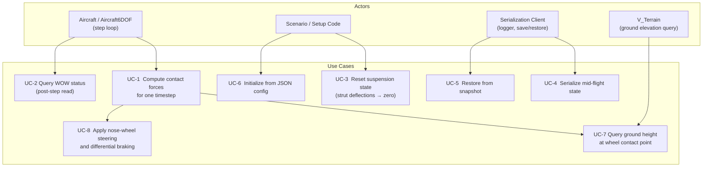
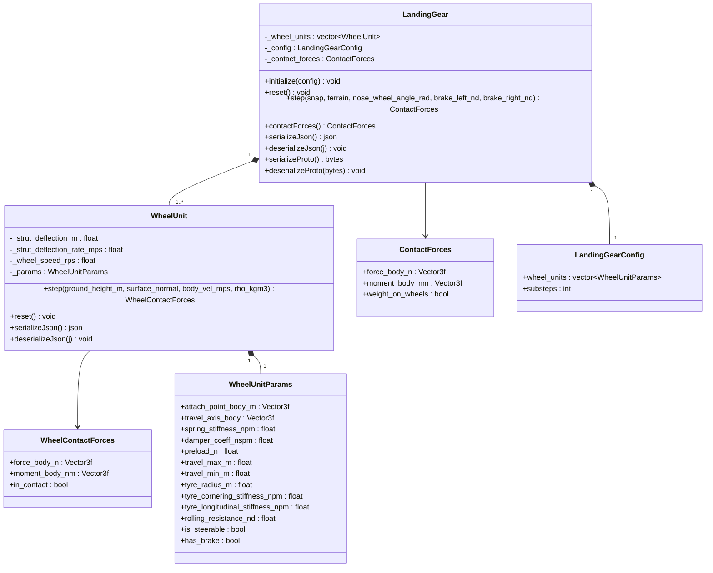
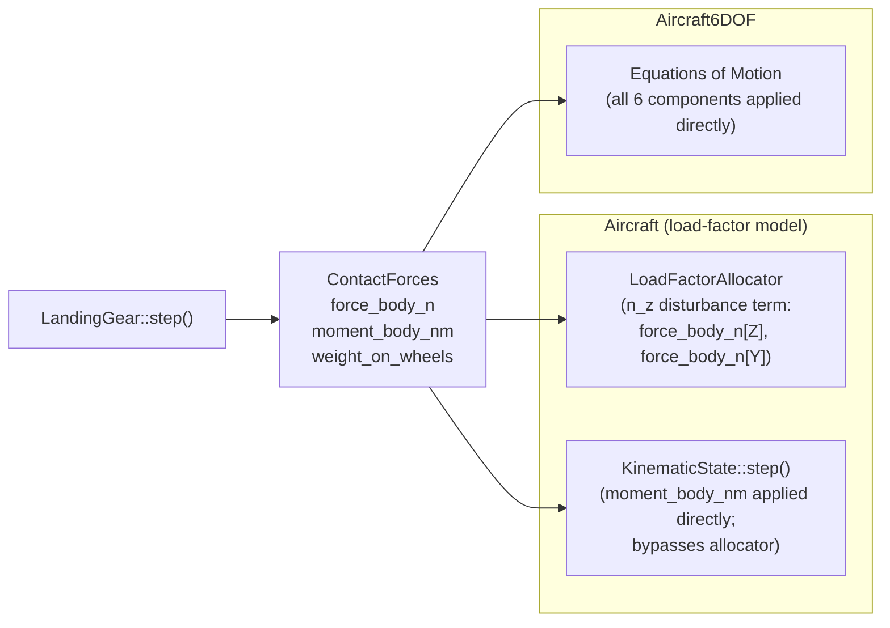

# Landing Gear — Architecture and Interface Design

This document is the design authority for the `LandingGear` subsystem. It covers the
physical models (suspension, tyre contact, wheel friction), the integration contracts with
`Aircraft` and `Aircraft6DOF`, the ground-plane interface, serialization, computational
resource requirements, and the test strategy.

**Design target use case:** developmental verification of autotakeoff and autolanding
functions — ground contact, bounce, WOW establishment, rollout heading control, taxi.

**Validity bound for `Aircraft` (load-factor model):** gear-induced pitch and roll moment
authority exceedance is not modeled. High-speed ground dynamics scenarios that depend on
FBW authority limits require `Aircraft6DOF`.

---

## Use Case Decomposition



| ID | Use Case | Primary Actor | Mechanism |
| --- | --- | --- | --- |
| UC-1 | Compute contact forces for one timestep | `Aircraft::step()` / `Aircraft6DOF::step()` | `LandingGear::step()` |
| UC-2 | Query WOW status after step | Aircraft, guidance, logging | `ContactForces::weight_on_wheels` |
| UC-3 | Reset suspension state | `Aircraft::reset()` | `LandingGear::reset()` |
| UC-4 | Serialize mid-flight snapshot | Logger, pause/resume | `serializeJson()` / `serializeProto()` |
| UC-5 | Restore from snapshot | Pause/resume | `deserializeJson()` / `deserializeProto()` |
| UC-6 | Initialize from JSON config | Scenario, test | `LandingGear::initialize(config)` |
| UC-7 | Query ground height at wheel contact point | Internal to `step()` | `V_Terrain::heightAtPosition_m()` |
| UC-8 | Apply nose-wheel steering and differential braking | Simulation loop | `step()` inputs `nose_wheel_angle_rad`, `brake_left_nd`, `brake_right_nd` |

---

## Class Hierarchy



---

## Integration with Aircraft Models



`LandingGear` is owned by both `Aircraft` and `Aircraft6DOF` as a non-optional member,
initialized from the `"landing_gear"` section of the aircraft JSON config.

### Integration Contract — `Aircraft`

`Aircraft::step()` calls `LandingGear::step()` before the `LoadFactorAllocator` solve.
The contact forces are applied as follows:

- `force_body_n[Z]` and `force_body_n[Y]` are passed to `LoadFactorAllocator` as additive
  disturbance terms alongside aerodynamic and propulsion forces.
- `moment_body_nm` is applied directly to the kinematic update, bypassing the allocator,
  because ground steering and differential braking are separate actuator systems outside
  FBW authority.

### Integration Contract — `Aircraft6DOF`

`Aircraft6DOF::step()` applies all six components of `ContactForces` directly to the
equations of motion with no special-casing.

---

## Physical Models

### 1. Wheel Geometry

Each wheel unit is defined by two body-frame vectors:

- **Attachment point** $\mathbf{p}_i^B$ — strut root in body coordinates (m).
- **Travel axis** $\hat{\mathbf{t}}_i^B$ — unit vector along strut compression direction
  in body coordinates (positive toward the ground in nominal attitude).

The contact point position in body frame is:

$$\mathbf{c}_i^B = \mathbf{p}_i^B + \delta_i\,\hat{\mathbf{t}}_i^B - r_w\,\hat{\mathbf{n}}^B$$

where $\delta_i$ is strut deflection (m, positive = compressed), $r_w$ is tyre radius (m),
and $\hat{\mathbf{n}}^B$ is the terrain surface normal expressed in body frame.

Strut deflection is constrained:

$$\delta_{i,\min} \leq \delta_i \leq \delta_{i,\max}$$

where $\delta_{i,\min} = 0$ (fully extended, no negative deflection — the strut cannot
pull the aircraft toward the ground) and $\delta_{i,\max}$ is the mechanical travel limit.

Ground penetration depth at step $k$ is:

$$h_i = z_{\text{ground}} - z_{c_i}$$

where $z_{\text{ground}}$ is the terrain height at the projected wheel contact point (m,
positive upward), $z_{c_i}$ is the $z$-coordinate of the contact point in the inertial
frame, and $h_i > 0$ indicates contact.

---

### 2. Suspension Dynamics — Second-Order Spring-Damper

Each strut is modeled as a linear spring-damper. The strut force (positive = compressive,
opposing penetration) is:

$$F_{s_i} = k_i\,(\delta_i + \delta_{0_i}) + b_i\,\dot{\delta}_i$$

where:
- $k_i$ — spring stiffness (N/m)
- $b_i$ — damper coefficient (N·s/m)
- $\delta_{0_i}$ — preload deflection (m) such that $k_i\,\delta_{0_i} = F_{\text{preload},i}$
- $\dot{\delta}_i$ — strut deflection rate (m/s)

The strut force is lower-bounded at zero: $F_{s_i} \geq 0$ (the strut can only push, not pull).

Strut deflection $\delta_i$ and its rate $\dot{\delta}_i$ are integrated forward in the
inner substep loop using Euler integration at timestep $\Delta t_{\text{inner}}$:

$$\dot{\delta}_i^{k+1} = \dot{\delta}_i^k + \frac{F_{s_i} - F_{\text{tyre},z_i}}{m_{\text{unsprung}}} \,\Delta t_{\text{inner}}$$

$$\delta_i^{k+1} = \delta_i^k + \dot{\delta}_i^{k+1}\,\Delta t_{\text{inner}}$$

where $F_{\text{tyre},z_i}$ is the vertical tyre contact force (see §3) and
$m_{\text{unsprung}}$ is approximated as zero in the first-order model (quasi-static
suspension — strut force equals tyre contact force at equilibrium). Strut deflection and
rate are clamped to their travel limits after each substep.

**Inner substep loop.** Suspension stiffness can impose a stability constraint
$\Delta t < 2\sqrt{m/k}$ on the explicit Euler integrator. For a typical spring constant
of $k = 50{,}000$ N/m and a nominal aircraft mass of $m = 5{,}000$ kg, the stability
limit is $\Delta t < 2\sqrt{5000/50000} = 0.63$ s, well above any practical outer
timestep. For a light UAS with $m = 10$ kg and $k = 5{,}000$ N/m the limit falls to
$2\sqrt{10/5000} = 0.089$ s — still above a 0.02 s outer timestep but closer. The
`substeps` parameter in `LandingGearConfig` subdivides each outer step into
$N_{\text{sub}}$ inner steps to guarantee stability across the full configuration range
without reducing the outer timestep rate. The default is `substeps = 4`.

---

### 3. Tyre Contact Forces — Pacejka Magic Formula

Tyre longitudinal force $F_x$ and lateral force $F_y$ are computed using the Pacejka
"magic formula":

$$F(s) = D \sin\!\bigl(C \arctan(B s - E(B s - \arctan(B s)))\bigr)$$

where $s$ is the relevant slip quantity (slip ratio $\kappa$ for longitudinal, slip angle
$\alpha_t$ for lateral), and $B$, $C$, $D$, $E$ are shape parameters.

#### 3a. Vertical Force

The tyre vertical force is the strut reaction force transmitted through the contact patch:

$$F_{z_i} = F_{s_i}$$

Contact is active only when $h_i > 0$; otherwise $F_{z_i} = 0$.

#### 3b. Longitudinal Slip Ratio

Slip ratio $\kappa$ is defined as:

$$\kappa = \frac{\omega_w\,r_w - V_{cx}}{V_{cx} + \epsilon}$$

where:
- $\omega_w$ — wheel angular velocity (rad/s)
- $r_w$ — tyre rolling radius (m)
- $V_{cx}$ — contact-patch longitudinal velocity in the wheel plane (m/s)
- $\epsilon = 0.01$ m/s — regularization to avoid division by zero at standstill

For a locked wheel (braking), $\omega_w = 0$ and $\kappa = -1$.

#### 3c. Slip Angle

Slip angle $\alpha_t$ is the angle between the wheel heading and the contact-patch velocity
vector projected onto the ground plane:

$$\alpha_t = -\arctan\!\left(\frac{V_{cy}}{|V_{cx}| + \epsilon}\right)$$

where $V_{cy}$ is the lateral component of the contact-patch velocity.

#### 3d. Pacejka Coefficients

The default parameter set is derived from generic bias-ply tyre data (Bakker, Nyborg, Pacejka 1987):

| Parameter | Longitudinal | Lateral | Description |
| --- | --- | --- | --- |
| $B$ | 10.0 | 8.0 | Stiffness factor |
| $C$ | 1.9 | 1.3 | Shape factor |
| $D$ | $\mu F_z$ | $\mu F_z$ | Peak value (friction-limited) |
| $E$ | 0.97 | −1.0 | Curvature factor |

where $\mu$ is the surface friction coefficient (see §5). These coefficients are fixed;
a future design study (OQ-LG-1) may introduce a parameter estimation pipeline from flight
test data.

#### 3e. Combined-Slip Saturation

When both longitudinal and lateral slip are nonzero, the total friction force is limited
by the tyre friction circle:

$$F_{t,i} = \sqrt{F_{x_i}^2 + F_{y_i}^2} \leq \mu F_{z_i}$$

If $F_{t,i} > \mu F_{z_i}$, both components are scaled down proportionally:

$$F_{x_i}' = F_{x_i}\,\frac{\mu F_{z_i}}{F_{t,i}}, \quad F_{y_i}' = F_{y_i}\,\frac{\mu F_{z_i}}{F_{t,i}}$$

---

### 4. Wheel Rotational Dynamics

Wheel angular velocity $\omega_w$ is integrated from the applied brake torque and tyre
longitudinal traction reaction:

$$I_w\,\dot{\omega}_w = r_w\,F_{x_i} - \tau_{\text{brake},i} - \tau_{\text{roll},i}$$

where:
- $I_w$ — wheel polar moment of inertia (kg·m²). For this model, $I_w$ is approximated
  as $m_w r_w^2 / 2$ using a nominal wheel mass $m_w$ derived from the tyre radius via
  an empirical scaling $m_w \approx 0.3\,r_w$ (kg, with $r_w$ in m).
- $\tau_{\text{brake},i} = C_{\text{brake}}\,b_i\,\omega_w$ — brake torque, where
  $b_i \in [0, 1]$ is the normalized brake demand and $C_{\text{brake}}$ is the maximum
  brake torque (N·m), a config parameter.
- $\tau_{\text{roll},i} = \mu_r\,r_w\,F_{z_i}\,\operatorname{sign}(\omega_w)$ — rolling
  resistance torque, where $\mu_r$ is the rolling resistance coefficient (dimensionless).

The wheel decelerates to a stop in finite time because rolling resistance grows with $F_z$
and does not vanish as $\omega_w \to 0$ (the $\operatorname{sign}$ function is regularized
with a deadband below $|\omega_w| < 0.01$ rad/s to avoid chatter).

---

### 5. Surface Friction Parameterization

The surface friction coefficient $\mu$ is queried from the terrain at the wheel contact
point. `V_Terrain` is extended with a `frictionAt(lat_rad, lon_rad)` method that returns
a `SurfaceType` enum:

| `SurfaceType` | $\mu$ (dry) | $\mu$ (wet, multiplier) | Description |
| --- | --- | --- | --- |
| `Pavement` | 0.80 | 0.50 | Paved runway or taxiway |
| `Grass` | 0.40 | 0.30 | Mown grass airfield |
| `Dirt` | 0.50 | 0.25 | Unprepared dirt surface |
| `Gravel` | 0.60 | 0.35 | Gravel or packed aggregate |

Wet multipliers are applied when `AtmosphericState::precipitation > 0`. The friction
coefficient seen by the Pacejka formula is $\mu = \mu_{\text{dry}} \times f_{\text{wet}}$
when precipitation is active, and $\mu = \mu_{\text{dry}}$ otherwise.

**Open question OQ-LG-2:** A richer friction model (e.g., a continuous function of
precipitation intensity or surface contamination depth) has been deferred pending a use case
that requires it. The `SurfaceType` table is sufficient for the autotakeoff/autoland use case.

---

### 6. Ground Plane Interface

`LandingGear::step()` accepts a `const V_Terrain&` reference and calls
`terrain.heightAtPosition_m(lat_rad, lon_rad)` for each wheel contact point to obtain the
ground elevation. The surface normal is approximated by finite differences over a
configurable radius (default 0.5 m):

$$\hat{\mathbf{n}} = \frac{\nabla h \times \mathbf{e}_x}{\|\nabla h \times \mathbf{e}_x\|}$$

where $h$ is the terrain height function and $\mathbf{e}_x$ is the north unit vector.

**Runway geometry extension (proposed — not yet designed):** For runway operations a planar
runway patch inset into `TerrainMesh` is the preferred approach. An analytical runway
definition (with longitudinal slope and crowned lateral profile) is an alternative if a
dedicated runway primitive is added to `V_Terrain`. This choice is deferred to OQ-LG-3.

The `SensorAirData` AGL altitude calculation must use the same terrain height source as the
contact model to avoid discontinuities at touchdown.

---

## Force Assembly

The per-wheel contact forces are rotated from the wheel frame into the body frame and
summed. For each wheel unit $i$ with contact force $\mathbf{f}_i^B$ (already in body frame
after applying the wheel-heading rotation), the total body-frame force and moment are:

$$\mathbf{F}_{\text{gear}}^B = \sum_i \mathbf{f}_i^B$$

$$\mathbf{M}_{\text{gear}}^B = \sum_i \mathbf{c}_i^B \times \mathbf{f}_i^B$$

where $\mathbf{c}_i^B$ is the contact point position in body frame (§1).

The assembled result is returned as `ContactForces`:

```cpp
struct ContactForces {
    Eigen::Vector3f force_body_n   = Eigen::Vector3f::Zero();   // body-frame force (N)
    Eigen::Vector3f moment_body_nm = Eigen::Vector3f::Zero();   // body-frame moment (N·m)
    bool            weight_on_wheels = false;
};
```

`weight_on_wheels` is `true` when any wheel unit reports `in_contact = true`.

---

## Step Interface

```cpp
// include/landing_gear/LandingGear.hpp
namespace liteaero::simulation {

class LandingGear {
public:
    void initialize(const nlohmann::json& config);
    void reset();

    ContactForces step(const KinematicStateSnapshot& snap,
                       const V_Terrain&              terrain,
                       float                         nose_wheel_angle_rad,
                       float                         brake_left_nd,
                       float                         brake_right_nd);

    const ContactForces& contactForces() const;

    [[nodiscard]] nlohmann::json       serializeJson()                           const;
    void                               deserializeJson(const nlohmann::json&        j);
    [[nodiscard]] std::vector<uint8_t> serializeProto()                          const;
    void                               deserializeProto(const std::vector<uint8_t>& bytes);

private:
    LandingGearConfig        _config;
    std::vector<WheelUnit>   _wheel_units;
    ContactForces            _contact_forces;
};

} // namespace liteaero::simulation
```

`KinematicStateSnapshot` supplies position, velocity (NED), and attitude (rotation matrix
$C_{B}^{N}$) needed to project wheel attachment points into the inertial frame and to
compute contact-patch velocities.

---

## Serialization

### Serialized State

Serialized state covers all quantities that change between `reset()` and any mid-flight
`step()` call. Configuration parameters (spring stiffness, geometry, etc.) are not
serialized — they are reloaded from the JSON config on `initialize()`.

Per wheel unit:

| Field | Type | Unit | Description |
| --- | --- | --- | --- |
| `strut_deflection_m` | float | m | Strut compression |
| `strut_deflection_rate_mps` | float | m/s | Strut compression rate |
| `wheel_speed_rps` | float | rad/s | Wheel angular velocity |

Top-level:

| Field | Type | Description |
| --- | --- | --- |
| `schema_version` | int | Always `1` |
| `wheel_units` | array | Per-wheel state objects (ordered to match config) |

### Proto Message

```proto
message WheelUnitState {
    float strut_deflection_m        = 1;
    float strut_deflection_rate_mps = 2;
    float wheel_speed_rps           = 3;
}

message LandingGearState {
    int32                   schema_version = 1;
    repeated WheelUnitState wheel_units    = 2;
}
```

---

## Computational Resource Estimate

The landing gear model executes once per outer simulation step. The dominant cost is the
inner substep loop and the terrain height queries.

### Operation Counts (per outer step, tricycle gear — 3 wheel units)

| Operation | Count per substep | Substeps | Total per outer step |
| --- | --- | --- | --- |
| `V_Terrain::heightAtPosition_m()` | 3 | 1 (outer only) | **3** |
| Spring-damper force eval | 3 | $N_{\text{sub}}$ | $3 N_{\text{sub}}$ |
| Pacejka longitudinal formula | 3 | $N_{\text{sub}}$ | $3 N_{\text{sub}}$ |
| Pacejka lateral formula | 3 | $N_{\text{sub}}$ | $3 N_{\text{sub}}$ |
| Friction-circle saturation | 3 | $N_{\text{sub}}$ | $3 N_{\text{sub}}$ |
| Wheel speed integration (Euler) | 3 | $N_{\text{sub}}$ | $3 N_{\text{sub}}$ |
| Body-frame rotation + moment arm cross product | 3 | 1 (outer only) | **6** |

With the default $N_{\text{sub}} = 4$: **60 floating-point operations per outer step** at
model complexity, plus 3 terrain queries. All arithmetic is single-precision `float`.

### Memory Footprint (tricycle gear)

| Structure | Fields | Size |
| --- | --- | --- |
| `WheelUnit` state (×3) | 3 floats each | 36 bytes |
| `WheelUnitParams` (×3) | ~12 floats + 2 bools each | ~156 bytes |
| `LandingGearConfig` | substeps (int) | 4 bytes |
| `ContactForces` | 6 floats + 1 bool | 28 bytes |
| **Total** | | **~224 bytes** |

### Timing

At a 50 Hz outer rate (0.02 s step) and $N_{\text{sub}} = 4$, the landing gear inner loop
runs at 200 Hz. The terrain queries dominate wall time on `TerrainMesh` (bilinear
interpolation over a tile), typically < 1 µs each on a modern desktop CPU. The total
landing gear contribution to a 50 Hz simulation loop is estimated at **< 20 µs** per step —
negligible relative to the allocator Newton solve (which dominates).

The model does **not** require the outer timestep to be reduced below the standard
simulation rate.

---

## Open Questions

| ID | Question | Blocking |
| --- | --- | --- |
| OQ-LG-1 | Pacejka coefficient sourcing — use a fixed generic set or introduce a parameter estimation pipeline from flight test data? | Not blocking initial implementation |
| OQ-LG-2 | Richer friction model — continuous function of precipitation intensity vs. binary wet/dry multiplier? | Not blocking |
| OQ-LG-3 | Runway geometry extension — planar inset patch vs. analytical runway primitive in `V_Terrain`? | Blocking for runway operations |
| OQ-LG-4 | Unsprung mass — include finite wheel+tyre mass for improved bounce fidelity, or retain quasi-static assumption? | Not blocking |

---

## Test Strategy

All tests follow TDD: a failing test is written before the corresponding production code.
Tests are organized into four categories: unit (isolated model math), integration
(multi-component with `Aircraft`), scenario (physics scenario pass/fail criteria), and
serialization (JSON + proto round-trip).

---

### Unit Tests — `LandingGear_test.cpp`

#### Suspension

| Test | Input | Pass criterion |
| --- | --- | --- |
| `StrutForce_UnderPreload_Positive` | Deflection = 0, preload = 500 N | $F_s = 500$ N |
| `StrutForce_Compressed_Linear` | $\delta = 0.05$ m, $k = 10{,}000$ N/m, preload = 0 | $F_s = 500$ N |
| `StrutForce_FloorAtZero` | $\delta < 0$ (strut extended past limit) | $F_s = 0$ |
| `StrutDeflection_ClampedAtTravelMax` | Drive $\delta$ past `travel_max_m` | $\delta = \delta_{\max}$, rate ← 0 |

#### Pacejka Tyre Formula

| Test | Input | Pass criterion |
| --- | --- | --- |
| `Pacejka_ZeroSlip_ZeroForce` | $\kappa = 0$, $\alpha_t = 0$ | $F_x = F_y = 0$ |
| `Pacejka_LongitudinalPeak_AtHighSlip` | $\kappa = 1$, $F_z = 1{,}000$ N | $F_x \approx \mu F_z$ (within 5%) |
| `Pacejka_LateralPeak_AtHighSlipAngle` | $\alpha_t = 15°$, $F_z = 1{,}000$ N | $F_y \approx \mu F_z$ (within 5%) |
| `FrictionCircle_Combined_Saturates` | $\lvert\kappa\rvert = 1$, $\lvert\alpha_t\rvert = 20°$ | $\sqrt{F_x^2 + F_y^2} \leq \mu F_z$ |

#### Slip Computations

| Test | Input | Pass criterion |
| --- | --- | --- |
| `SlipRatio_LockedWheel` | $\omega_w = 0$, $V_{cx} = 20$ m/s | $\kappa = -1.0$ |
| `SlipRatio_FreeRolling` | $\omega_w = V_{cx}/r_w$ | $\lvert\kappa\rvert < 0.01$ |
| `SlipAngle_PureSlide` | $V_{cy} = 5$ m/s, $V_{cx} = 0$ | $\lvert\alpha_t\rvert = 90° \pm 1°$ |

#### Wheel Speed Integration

| Test | Input | Pass criterion |
| --- | --- | --- |
| `WheelSpeed_DecaysToZero_RollingResistance` | Release free-rolling wheel, no traction input | $\omega_w \to 0$ in finite steps |
| `WheelSpeed_Brake_FullLock` | $b = 1.0$, high $C_{\text{brake}}$ | $\omega_w = 0$ within 1 s simulated time |

#### Unit Tests — Force Assembly

| Test | Input | Pass criterion |
| --- | --- | --- |
| `ContactForces_StaticSingleWheel_VerticalOnly` | Level surface, zero velocity, one wheel | $F_z = F_s$; $F_x = F_y = 0$; moment = $\mathbf{c} \times \mathbf{f}$ |
| `ContactForces_WOW_FalseWhenAirborne` | All wheels above ground | `weight_on_wheels = false` |
| `ContactForces_WOW_TrueOnAnyContact` | One wheel contacts, two do not | `weight_on_wheels = true` |

---

### Integration Tests — `LandingGear_Aircraft_test.cpp`

These tests drive `Aircraft` through a pre-computed trajectory and verify that `LandingGear`
produces physically consistent outputs when integrated via the `Aircraft::step()` disturbance
path.

| Test | Scenario | Pass criterion |
| --- | --- | --- |
| `Aircraft_LandingContact_WOW_Established` | Descending at 3 m/s vertical, gear-down state; FlatTerrain at $z = 0$ | `weight_on_wheels` transitions false → true within the first 3 steps after $z_{\text{aircraft}} < r_w$ |
| `Aircraft_StaticOnGround_NoSink` | Aircraft placed at gear contact height, zero velocity, no thrust | After 100 steps, $\lvert z_{\text{drift}}\rvert < 0.01$ m — suspension holds the aircraft up |
| `Aircraft_LandingGear_Disturbance_AppliedToAllocator` | Single main gear contacts; nose gear airborne | Vertical force component nonzero in allocator input; roll moment nonzero in kinematic update |

---

### Scenario Tests

#### Landing Roll-Out — Deceleration

**Test:** `Scenario_LandingRollout_StopsInFiniteDistance`

Setup: Aircraft placed on FlatTerrain at zero altitude, initial $V_x = 50$ m/s, zero thrust,
full brakes ($b = 1.0$), no wind. Integrate for 60 s simulated time.

Pass criteria:

- Ground speed reaches $< 0.5$ m/s within 2,000 m ground roll.
- No wheel unit reports negative strut deflection at any step.
- `weight_on_wheels` remains `true` for the entire run.

**Test:** `Scenario_LandingRollout_StopsInFiniteDistance_NoBrakes`

Same as above with $b = 0$. Pass criterion: ground speed reaches $< 0.5$ m/s within 5,000 m
(rolling resistance only).

---

#### Landing with a Crab

A crab landing occurs when the aircraft crosses the runway threshold with a nonzero sideslip
angle $\beta$ (the crab angle) to maintain track against crosswind, then straightens on
contact. The tyre lateral forces at touchdown must develop fast enough to align the wheel
heading with the runway center line without exceeding the friction limit.

**Test:** `Scenario_CrabLanding_NoSkid`

Setup:

- `FlatTerrain` at $z = 0$.
- Initial state: $V_x = 50$ m/s (runway axis), $V_y = 8$ m/s (crosswind — 9° crab), $V_z = -1.5$ m/s (descent).
- Crab angle at touchdown: $\beta_0 = \arctan(8/50) \approx 9.1°$.
- No nose-wheel steering input; $b = 0.4$ (light braking, symmetric).
- Constant wind: 8 m/s from 090°, runway heading 360°.

Pass criteria:

- WOW establishes within the first 5 steps.
- Lateral ground speed $\lvert V_y \rvert$ reduces from 8 m/s to $< 1$ m/s within 500 m ground roll.
- Peak combined tyre force $\leq 1.05\,\mu F_z$ (friction circle not exceeded by more than 5%).
- Aircraft heading excursion $< 15°$ from runway center line throughout rollout.

**Test:** `Scenario_CrabLanding_HighCrosswind_FrictionLimited`

Same geometry but $V_y = 15$ m/s (17° crab, beyond typical crosswind limit). Verifies
that the friction circle saturation clamps lateral forces and the aircraft departs the
runway edge rather than exhibiting unphysical heading recovery.

---

#### Takeoff Roll

**Test:** `Scenario_TakeoffRoll_LiftoffOccurs`

Setup:

- `FlatTerrain`, zero wind.
- Initial state: all wheels on ground, $V_x = 0$, full forward thrust.
- Takeoff sequence: hold heading via nose-wheel steering until rotation speed, then
  pull to rotation pitch attitude; no guidance law — open-loop pitch command.

Pass criteria:

- Ground roll distance to rotation $V_R = 40$ m/s $< 800$ m.
- WOW transitions true → false (liftoff) within 20 s simulated time.
- No negative strut deflection at any step during the ground roll.
- Heading deviation from runway axis $< 5°$ throughout ground roll (nose-wheel authority).

**Test:** `Scenario_TakeoffRoll_NoseWheelSteering_HeadingControl`

Setup: ground roll with a small initial heading offset of 2°; nose-wheel steering applies
a restoring angle of 3° for 5 s then releases.

Pass criterion: heading offset corrects to $< 0.5°$ within 200 m.

---

#### Bounce and Rebound

**Test:** `Scenario_HardLanding_BounceAndSettle`

Setup: descent rate at touchdown $V_z = -4$ m/s (hard landing). Monitor strut deflection,
aircraft altitude, and WOW over 5 s.

Pass criteria:

- WOW transitions false → true → false → true (one bounce).
- Peak strut deflection $< \delta_{\max}$ (no bottoming out).
- Aircraft altitude oscillation damps to $< 0.05$ m amplitude within 3 s.

---

#### Uneven Terrain

**Test:** `Scenario_TaxiOverBump_NoLiftoff`

Setup: `TerrainMesh` with a Gaussian bump of height 0.15 m and radius 2 m placed on the
taxi path. Aircraft taxiing at 5 m/s ground speed.

Pass criteria:

- Strut deflection on the bump-traversing wheel increases by $\geq 0.05$ m as it rolls over.
- WOW remains `true` throughout.
- No implausible discontinuity in `ContactForces` between steps (i.e., $\lvert\Delta F_z\rvert < 5 k V_z \Delta t$).

---

### Serialization Tests

| Test | Method | Pass criterion |
| --- | --- | --- |
| `SerializeJson_RoundTrip_MatchesState` | Serialize after 50 steps; deserialize to new instance; run 10 more steps | Output forces identical to reference stream |
| `SerializeProto_RoundTrip_MatchesState` | Same as above, proto path | Output forces identical |
| `DeserializeJson_SchemaVersionMismatch_Throws` | Version field ≠ 1 | `std::invalid_argument` |
| `DeserializeJson_WheelCountMismatch_Throws` | Serialized 3 wheels, config has 2 | `std::invalid_argument` |

---

## Visualization Notebooks

All notebooks live under `python/notebooks/landing_gear/` and use the
`python/tools/log_reader.py` interface to load `.csv` logger output from batch simulation
runs. Matplotlib is used for 2D plots; Matplotlib with 3D axes or a lightweight glTF
viewer is used for terrain animations.

---

### `landing_gear_contact_forces.ipynb`

**Purpose:** Time-series analysis of landing contact, bounce, and rollout dynamics.

**Scenario:** Hard landing at $V_z = -3$ m/s onto flat terrain, followed by rollout to stop.

**Plots:**

1. **Strut deflection vs. time** — one subplot per wheel unit; overlay $\delta_{\max}$ as
   a red dashed line.
2. **Contact force components vs. time** — $F_z$, $F_x$, $F_y$ per wheel; stacked
   subplots.
3. **Friction utilization vs. time** — $\sqrt{F_x^2 + F_y^2}\,/\,(\mu F_z)$ per wheel;
   horizontal red line at 1.0 (friction limit).
4. **Wheel speed vs. time** — $\omega_w$ per wheel; overlay $V_{cx}/r_w$ (free-rolling
   reference) as dashed line.
5. **Aircraft altitude and WOW flag vs. time** — dual-axis: altitude (m) left, WOW (0/1)
   right. Annotate the touchdown and bounce events.

---

### `crab_landing_dynamics.ipynb`

**Purpose:** Visualize crosswind crab-landing dynamics — lateral velocity decay, heading
excursion, friction circle loading.

**Scenario:** 9° crab ($V_y = 8$ m/s), runway heading 000°, 8 m/s crosswind.

**Plots:**

1. **Ground track** — top-down view: aircraft X-Y trajectory over the runway centerline
   (drawn as a dashed line). Color the track by friction utilization.
2. **Heading and crab angle vs. ground distance** — aircraft heading minus runway heading;
   annotate WOW event.
3. **Lateral velocity vs. ground distance** — $V_y$ from touchdown to stop.
4. **Per-wheel friction utilization vs. ground distance** — one line per wheel; annotate
   when the friction circle saturates.
5. **Combined tyre force vector animation** — 2D top-down arrow animation at 10× slow-mo
   showing the tyre force vector at each main gear as the crab angle unwinds. Exported as
   a `.gif` for documentation embedding.

---

### `takeoff_roll.ipynb`

**Purpose:** Validate autotakeoff roll — ground distance, rotation, liftoff.

**Scenario:** Full-thrust takeoff, open-loop rotation at $V_R$.

**Plots:**

1. **Ground speed and airspeed vs. time** — annotate $V_R$ and liftoff.
2. **Nose-wheel normal force vs. time** — goes to zero at rotation; annotate rotation event.
3. **Heading deviation vs. ground distance** — verify runway tracking.
4. **Strut deflection — all wheels vs. time** — nose strut deflects during nose-up rotation.
5. **WOW flag timeline** — bar chart showing which wheels are in contact at each time step,
   from brakes-release to climb-out.

---

### `touchdown_animation.py` — Standalone Touchdown Animation

**Location:** [`python/scripts/touchdown_animation.py`](../../python/scripts/touchdown_animation.py)

**Purpose:** Self-contained 2-D landing gear contact simulation and animation. Requires only
`numpy` and `matplotlib`; no C++ build needed.

**Model:** 3-DOF planar (surge, heave, pitch). Quasi-static spring-damper contact at each
wheel unit. Linear lift curve, parabolic drag polar, quasi-static pitch moment with damping.
No tyre lateral forces.

**Run:**

```bash
python/.venv/Scripts/python.exe python/scripts/touchdown_animation.py
```

**What is shown:**

- Side-view aircraft silhouette (fuselage, wing, horizontal and vertical tail) that rotates
  with pitch angle throughout the approach, contact, and rollout phases.
- Landing gear struts drawn as lines from the body attachment point to the wheel center;
  strut length shortens visually as the tyre compresses into the ground.
- Upward contact-force arrows at each wheel contact point, proportional to the normal force:
  orange for main gear, blue for nose gear. Arrow length = F / 55 000 N/m.
- Green lift arrow and yellow weight arrow at the CG, proportional to force magnitude.
- Live time-series subplots below the main view: contact forces (N) and strut compression (m)
  for both wheels, with a moving cursor tracking the current animation frame.
- Status bar: simulation time, airspeed, pitch angle, angle of attack, per-wheel contact
  force, and L/W ratio.

**Scenario:** 2 000 kg aircraft, 55 m/s approach, 3° glide slope, 9.1° nose-up trim pitch.
Main gear contacts at approximately t = 2.8 s with a peak normal force of ~30 kN (dominated
by the damping term at 2.88 m/s sink rate). Nose gear contacts as pitch relaxes toward level.
Total animation duration: 14 s.

---

### `terrain_contact_animation.ipynb`

**Purpose:** Animate landing gear contact over uneven terrain in 3D to verify that wheel
contact points track the surface correctly.

**Scenario:** Aircraft taxiing at 5 m/s over a `TerrainMesh` patch with procedurally
generated Gaussian bumps (3 bumps, heights 0.1–0.2 m, radii 1–3 m).

**Approach:**

The notebook loads the `TerrainMesh` glTF export and the logged `KinematicStateSnapshot`
and per-wheel `ContactForces` time series. It computes wheel contact point positions at
each step from the kinematic state and the wheel geometry, then renders them as animated
spheres over the terrain surface using `matplotlib` 3D axes with `FuncAnimation`.

**Panels:**

1. **3D animation panel** — terrain mesh rendered as a shaded triangulated surface;
   aircraft body frame axes overlaid; three wheel contact-point spheres colored by
   `in_contact` (green = contact, red = airborne). Animation plays at 5× real time.
   Camera follows the aircraft.
2. **Side panel — strut deflection vs. time** — live-updating trace alongside the
   animation; vertical line at current animation frame.
3. **Side panel — terrain height under each wheel vs. X position** — shows the terrain
   profile each wheel traverses.

**Export:** `terrain_contact_animation.gif` (or `.mp4` if `ffmpeg` is available) written
to `python/notebooks/landing_gear/output/`.

---

## References

| Reference | Relevance |
| --- | --- |
| Bakker, E., Nyborg, L., Pacejka, H.B. (1987). *Tyre Modelling for Use in Vehicle Dynamics Studies*. SAE Technical Paper 870421. | Pacejka magic formula coefficients and derivation |
| Pacejka, H.B. (2012). *Tyre and Vehicle Dynamics*, 3rd ed. Butterworth-Heinemann. | Combined slip, friction ellipse, tyre modelling |
| Roskam, J. (1995). *Airplane Flight Dynamics and Automatic Flight Controls*, Part I. DARcorporation. | Ground roll equations, WOW modeling conventions |
| MIL-HDBK-1797A (1997). *Flying Qualities of Piloted Vehicles*. | Ground handling requirements, maximum crosswind, rollout |
| [`docs/architecture/aircraft.md`](aircraft.md) | `Aircraft` step loop, `LoadFactorAllocator` disturbance interface |
| [`docs/architecture/terrain.md`](terrain.md) | `V_Terrain` interface, `TerrainMesh`, height query API |
| [`docs/architecture/system/future/decisions.md`](system/future/decisions.md) | §LandingGear integration model and fidelity target |
| [`docs/architecture/system/future/element_registry.md`](system/future/element_registry.md) | `LandingGear` and `ContactForces` element entries |
| [`docs/roadmap/aircraft.md`](../roadmap/aircraft.md) | Items 1 (design) and 8 (implementation) |
