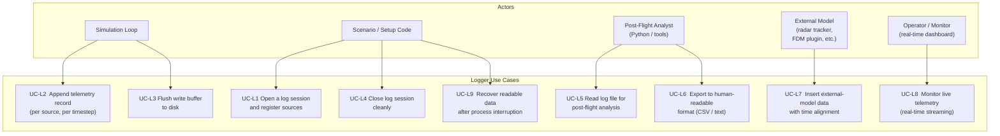
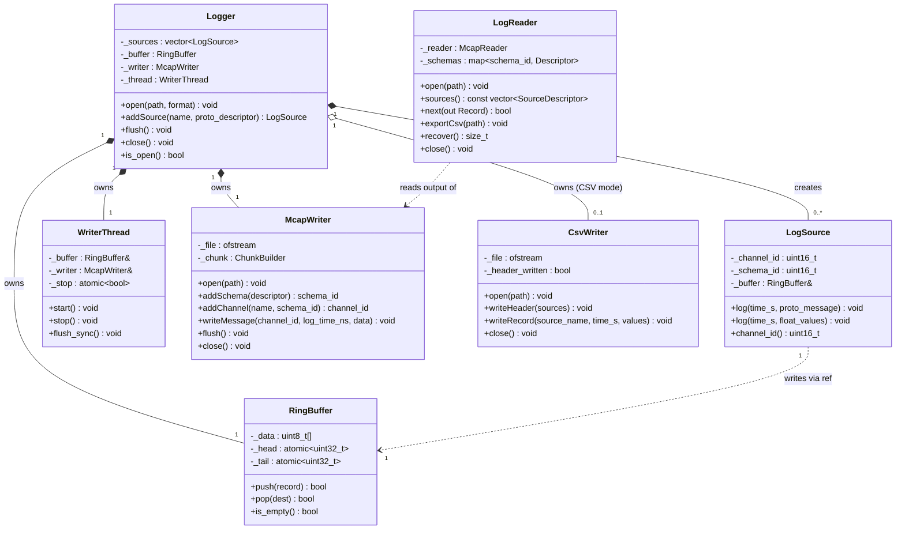
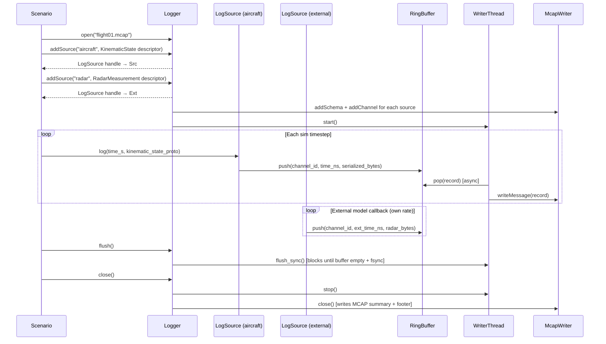
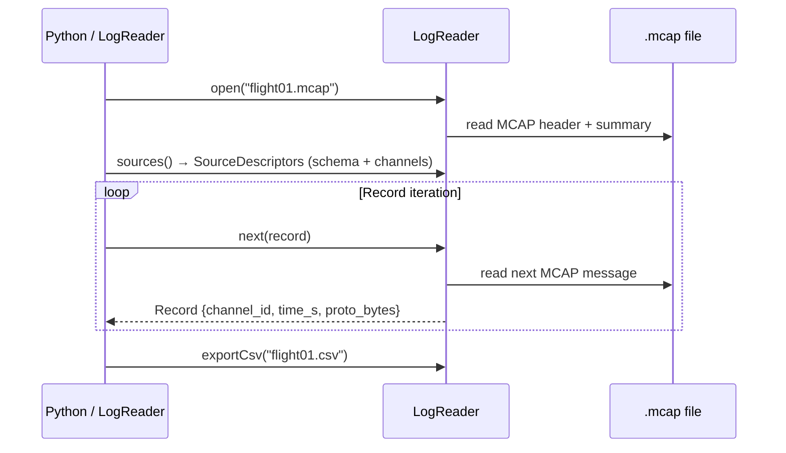

# Logger — Architecture and Interface Design

This document is the design authority for the `Logger` subsystem. It covers the use case
decomposition, requirements derived from simulation needs, format selection rationale, class
architecture, data model, multi-source integration, real-time operation, and resilience to
process interruption.

---

## Use Case Decomposition

### Simulation Context

The Logger is an Infrastructure layer component. It sits beside the simulation loop, not
inside it: the loop advances physics, queries outputs, and hands records to the logger; the
logger handles all I/O without ever blocking the simulation thread.



### Use Case Tracing

| ID | Use Case | Driving Simulation Need | Mechanism |
|----|----------|------------------------|-----------|
| UC-L1 | Open log session, register sources | Scenario must declare what is logged before sim starts | `Logger::open()`, `Logger::addSource()` |
| UC-L2 | Append telemetry record | Sim loop captures full aircraft state after each `Aircraft::step()` | `LogSource::log()` → ring buffer |
| UC-L3 | Flush buffer to disk | Prevent data loss during long runs | `Logger::flush()`, background writer thread |
| UC-L4 | Close log session | End of scenario — finalize file | `Logger::close()` |
| UC-L5 | Read for post-flight analysis | Reconstruct flight path, aerodynamic variables, guidance errors | `LogReader::open()`, record iteration |
| UC-L6 | Export to human-readable format | Quick inspection, spreadsheet import, CI diff | `LogReader::exportCsv()` |
| UC-L7 | Insert external-model data | Time-aligned sensor model, hardware-in-the-loop, Monte Carlo annotation | `LogSource::log()` with external timestamp |
| UC-L8 | Monitor live telemetry | Real-time operator display during hardware-in-the-loop test | `LogReader` live-tail mode; PlotJuggler via MCAP plugin |
| UC-L9 | Recover after interruption | Hardware reset, power failure, process kill during long test | MCAP chunk CRC + summary-less recovery |

---

## Requirements

### Functional

| ID | Requirement |
|----|-------------|
| LR-1 | Multiple named sources may register independent channel sets before logging begins. |
| LR-2 | Each source logs at its own rate; records are time-stamped with a `double time_s` (seconds). |
| LR-3 | All channel values are 32-bit IEEE 754 floats in SI units. |
| LR-4 | The log file is self-describing: a reader requires only the file to reconstruct all channel names, units, and source identities. |
| LR-5 | Two output formats are supported: **binary** (MCAP) for compactness, resilience, and tooling; **CSV** for human readability and spreadsheet/pandas compatibility. |
| LR-6 | The binary format must remain valid and partially readable after unexpected process termination. |
| LR-7 | `LogSource::log()` must not block the calling thread. |
| LR-8 | `Logger::flush()` is synchronous: returns only after all buffered records are written and `fsync`-ed. |
| LR-9 | A reader must be able to open and iterate a log file while it is still being written. |
| LR-10 | The format must accommodate external sources whose timestamps may interleave with aircraft-state timestamps. |

### Non-Functional

| ID | Requirement |
|----|-------------|
| LR-N1 | `LogSource::log()` completes in ≤ 5 µs on the simulation thread (ring-buffer write, no system calls). |
| LR-N2 | Binary format achieves ≥ 5× better size than equivalent CSV at 1 kHz, 32 channels. |
| LR-N3 | `LogReader` loads a 10-minute, 32-channel, 1 kHz binary log in ≤ 500 ms. |

---

## Format Selection

### Survey of Open Formats Used in Related Projects

| Format | Used by | Binary | Self-describing | Crash-resilient | Real-time vis. | Protobuf | Notes |
|--------|---------|--------|-----------------|-----------------|----------------|----------|-------|
| **MCAP** | ROS 2, PX4 | ✅ | ✅ | ✅ (chunk CRC) | ✅ PlotJuggler plugin | ✅ native | MIT; C++ + Python libs |
| **ULog** | PX4 ArduPilot | ✅ | ✅ | ✅ | ✅ FlightPlot, QGC | ❌ | Flight-specific; `pyulog` |
| **ROS bag (.bag)** | ROS 1 | ✅ | ✅ | partial | ✅ rviz | via msg | Superseded by MCAP in ROS 2 |
| **HDF5** | OpenFAST, X-Plane | ✅ | ✅ | ❌ (write txn) | ❌ | ❌ | Heavy dep; random access; no streaming |
| **CSV** | Universal | ❌ | partial | ✅ (line-atomic) | via tail/curl | ❌ | Human-readable; no binary efficiency |
| **NDJSON** | Universal | ❌ | ✅ | ✅ (line-atomic) | via WebSocket | ❌ | Streaming-friendly; verbose |

### Recommendation: MCAP (binary) + CSV (text)

**MCAP** is selected as the primary binary format for the following reasons:

1. **Open standard** — MCAP ([mcap.dev](https://mcap.dev)) is a community-maintained open
   format with published specification, MIT-licensed C++ and Python libraries, and adoption
   in ROS 2, PX4, and automotive simulation.

2. **Protobuf integration** — LiteAeroSim already uses protobuf v3. MCAP natively embeds
   protobuf schemas alongside messages, so existing `KinematicState`, `AircraftState`, and
   propulsion proto messages can be logged without any translation layer.

3. **Tooling ecosystem** — PlotJuggler (LGPL-3, MCAP plugin MIT) reads `.mcap` files for
   interactive post-flight review. The `mcap` Python SDK loads recordings directly into
   pandas DataFrames. No proprietary viewer is required.

4. **Crash resilience** — MCAP organizes messages into independently-checksummed chunks.
   The summary section at the end of the file is optional; a reader can recover all intact
   chunks even without it.

5. **Multi-source / multi-schema** — MCAP supports arbitrary channels with independent
   schemas in a single file, which maps directly to the multi-source requirement.

**CSV** is retained as the text export format (UC-L6) for human inspection, spreadsheet
import, and CI artifact diffing.

---

## Architecture

### Class Design



### Session Lifecycle Sequence



### Post-Flight Read Sequence



---

## Data Model

### MCAP File Layout

MCAP files are organized in independently-checksummed chunks. The structure allows readers
to recover all intact chunks after a crash, without the file-end summary section.

```
┌─────────────────────────────────────────────────────────┐
│  MCAP Header (magic + Header record)                    │
├─────────────────────────────────────────────────────────┤
│  Schema records (one per registered proto message type) │
├─────────────────────────────────────────────────────────┤
│  Channel records (one per LogSource)                    │
├─────────────────────────────────────────────────────────┤
│  Chunk 0                                                │
│  ├── Compressed messages (LZ4 or uncompressed)          │
│  └── ChunkIndex + CRC                                   │
├─────────────────────────────────────────────────────────┤
│  Chunk 1, 2, ...                                        │
├─────────────────────────────────────────────────────────┤
│  Statistics record  (message counts, time range)        │
│  SummaryOffset records                                  │
│  Footer (summary CRC; present only on clean close)      │
└─────────────────────────────────────────────────────────┘
```

### Message Schema

Each `LogSource` registers a schema with the MCAP writer. Two schema types are used:

**Protobuf schema** — for sources whose data already maps to an existing proto message
(e.g., `KinematicState`, `AircraftState`, propulsion states). The `.proto` file descriptor
is embedded in the MCAP schema record. The `mcap` Python library and PlotJuggler decode
these automatically.

**Float-array schema** — a lightweight schema for sources that log a fixed vector of float
values without a dedicated proto message. Defined once as a `FloatArray` proto message:

```proto
// Embedded in proto/liteaerosim.proto
message FloatArray {
    repeated float values = 1;
}
```

This covers ad-hoc external sources that don't have a proto message, while keeping all
data in the same file and readable by the same tooling.

### Channel Metadata

Each MCAP channel carries a metadata map with the following keys:

| Key | Example | Purpose |
|-----|---------|---------|
| `"source"` | `"aircraft"` | Human name of the source |
| `"channel_names"` | `"vel_north_mps,vel_east_mps,alpha_rad"` | Comma-separated channel list (for `FloatArray` channels) |
| `"channel_units"` | `"m/s,m/s,rad"` | Corresponding SI unit strings |
| `"schema_type"` | `"protobuf"` or `"float_array"` | Determines decoder |

### Time Representation

MCAP timestamps are `uint64_t` nanoseconds since Unix epoch. LiteAeroSim's `double time_s`
(simulation seconds from t=0) is stored in the MCAP `log_time` field, offset to a fixed
epoch (e.g., session start wall-clock time). The simulation time is also stored in the
proto message's own `time_sec` field for unambiguous reconstruction.

### CSV Export Format

```
time_s,source,channel_0,channel_1,...
0.000000,aircraft,55.0000,0.0000,0.0523
0.100000,aircraft,54.9800,0.0001,0.0521
0.050000,radar,250.0,1.047
```

- Column header row lists all channels for the source named in each row.
- Rows from different sources are interleaved in timestamp order.
- Each row contains only the channels for its source (no cross-source NaN filling in the
  raw export; aligned views are produced by the Python `LogReader.aligned_view()` method).

---

## Multi-Source Data Model

### Source Registration Pattern

```cpp
// Scenario setup:
auto ac_src = logger.addSource("aircraft",
    KinematicState::descriptor(),     // protobuf schema
    {{"source", "aircraft"}, {"schema_type", "protobuf"}});

auto ext_src = logger.addSource("radar",
    {"range_m", "bearing_rad"},       // float_array schema
    {"m", "rad"});

// In sim loop:
ac_src.log(sim_time_s, kinematic_state_proto_message);

// In external model callback (own thread, own rate):
ext_src.log(ext_time_s, {range, bearing});
```

### External Source Thread Safety

`LogSource::log()` is thread-safe. It serializes the message to bytes and pushes a fixed
header (channel_id + log_time_ns + byte_count) followed by the payload into the lock-free
ring buffer. The background `WriterThread` drains all sources from the single shared
buffer; records appear in the MCAP file in drain order. Time alignment across sources is
performed in the reader using each record's `time_s` field.

### Time Alignment in the Reader (Python)

```python
reader = LogReader("flight01.mcap")
# Produce a DataFrame aligned to 0.01 s grid, NaN where source didn't log:
df = reader.aligned_view(dt_s=0.01)
# Columns: aircraft.vel_north_mps, aircraft.alpha_rad, ..., radar.range_m, ...
```

---

## Real-Time Operation

### Write Path

```
LogSource::log()          [sim thread; ≤ 5 µs]
    │
    ▼
RingBuffer::push()        [lock-free SPMC ring buffer]
    │
WriterThread              [background; wakes on condition or timeout]
    │
    ▼
McapWriter::writeMessage()
    │
    ▼
ChunkBuilder              [accumulates messages; flushes on size or time threshold]
    │
    ▼
OS page cache             [fsync on flush() or periodic interval]
```

### Flush Policy

| Event | Action |
|-------|--------|
| `Logger::flush()` | `WriterThread::flush_sync()` — drain buffer, close current chunk, `fsync()` |
| `Logger::close()` | Full flush, write MCAP statistics + footer, close file |
| Chunk size threshold (configurable, default 4 MB) | Background chunk rotation |
| Time threshold (configurable, default 1 s) | Background chunk rotation + `fsync` |

### Live Visualization

PlotJuggler (LGPL-3, MCAP plugin MIT) can open a `.mcap` file in live-tail mode while the
simulation is running. `LogReader` exposes a live-read mode that polls for new complete
chunks; a thin relay process (or direct PlotJuggler file watch) forwards records as they
are written. This requires no changes to `Logger`.

---

## Resilience to Process Interruption

### MCAP Guarantees

| Scenario | Outcome |
|----------|---------|
| Normal `close()` | Summary + footer written; `mcap` tools and PlotJuggler open normally |
| `flush()` then crash | All flushed chunks are valid; unflushed ring-buffer records are lost |
| Crash during chunk write | Partial chunk has bad or missing CRC; preceding complete chunks are intact |
| OS write-back failure (full disk) | `writeMessage()` throws; logger sets error flag; `is_open()` returns false |

### Recovery Without Summary

MCAP readers that encounter a missing or corrupt footer section fall back to scanning the
file forward from the header for valid chunks. The `mcap` C++ and Python libraries perform
this automatically — no custom recovery code is needed in `LogReader`.

`LogReader::recover()` is a convenience wrapper that counts intact messages and, optionally,
re-writes a valid footer, making the file fully compliant again.

---

## Interface Reference

### `Logger`

```cpp
// include/logger/Logger.hpp
namespace liteaerosim::logger {

enum class LogFormat { Mcap, Csv };

class Logger {
public:
    Logger();
    ~Logger();   // calls close() if open

    // Open a new log session.  Must be called before addSource().
    // Throws std::runtime_error on I/O failure.
    void open(const std::filesystem::path& path, LogFormat format = LogFormat::Mcap);

    // Register a proto-schema source.  Returns a handle for logging.
    // Must be called before the first log() call.
    LogSource addSource(std::string name,
                        const google::protobuf::Descriptor* schema,
                        std::map<std::string, std::string> metadata = {});

    // Register a float-array source (no proto message required).
    LogSource addSource(std::string name,
                        std::vector<std::string> channel_names,
                        std::vector<std::string> channel_units = {},
                        std::map<std::string, std::string> metadata = {});

    void flush();
    void close();
    bool is_open() const;
};

} // namespace liteaerosim::logger
```

### `LogSource`

```cpp
// include/logger/LogSource.hpp
namespace liteaerosim::logger {

class LogSource {
public:
    // Log a protobuf message.  Thread-safe; non-blocking.
    void log(double time_s, const google::protobuf::Message& msg);

    // Log a float vector (float-array schema).  Thread-safe; non-blocking.
    // values.size() must equal the channel count declared at addSource() time.
    void log(double time_s, const std::vector<float>& values);

    uint16_t           channel_id() const;
    const std::string& name()       const;
};

} // namespace liteaerosim::logger
```

### `LogReader`

```cpp
// include/logger/LogReader.hpp
namespace liteaerosim::logger {

class LogReader {
public:
    void open(const std::filesystem::path& path);

    struct SourceDescriptor {
        uint16_t    channel_id;
        std::string name;
        std::string schema_type;   // "protobuf" or "float_array"
        std::vector<std::string> channel_names;
        std::vector<std::string> channel_units;
    };
    const std::vector<SourceDescriptor>& sources() const;

    struct Record {
        uint16_t           channel_id;
        double             time_s;
        std::vector<uint8_t> data;   // serialized proto or FloatArray bytes
    };
    bool next(Record& out);

    void exportCsv(const std::filesystem::path& path) const;
    size_t recover();
    void close();
};

} // namespace liteaerosim::logger
```

---

## Dependency

| Library | Version | License | Integration |
|---------|---------|---------|-------------|
| `mcap` (C++) | latest | MIT | FetchContent |
| `mcap` (Python) | latest | MIT | `uv` / `pyproject.toml` |

The MCAP C++ library (`foxglove/mcap`) is header-only with no required dependencies beyond
the C++17 standard library. It is integrated via `FetchContent` following the same pattern
as the existing `nlohmann_json` dependency.

---

## File Map

| File | Contents |
|------|----------|
| `include/logger/Logger.hpp` | `Logger` class declaration |
| `include/logger/LogSource.hpp` | `LogSource` handle (returned by `Logger::addSource()`) |
| `include/logger/LogReader.hpp` | `LogReader` class declaration |
| `include/logger/ChannelInfo.hpp` | `ChannelInfo`, `SourceDescriptor` value types |
| `src/logger/Logger.cpp` | `Logger`, `WriterThread`, `RingBuffer` implementation |
| `src/logger/McapLogWriter.cpp` | MCAP format writer (wraps `mcap` C++ library) |
| `src/logger/CsvLogWriter.cpp` | CSV text writer |
| `src/logger/LogReader.cpp` | Reader, recovery, CSV export |
| `test/Logger_test.cpp` | Unit tests |
| `python/src/las/log_reader.py` | Python `LogReader` (wraps `mcap` Python library) |
| `python/tools/plot_flight.py` | CLI plotting tool (uses `log_reader.py`) |
