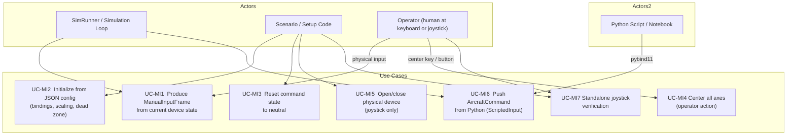

# Manual Input — Architecture and Interface Design

This document is the design authority for the manual input subsystem. It covers the
`ManualInput` abstract interface, the `KeyboardInput` and `JoystickInput` concrete
adapters, the configuration schemas, the integration contract with `SimRunner`, and the
test strategy.

**Layer placement:** Interface Layer. These classes translate raw OS/device input into
`AircraftCommand` values expressed in SI units. They contain no physics, no unit
conversions in the domain sense, and no simulation state. They are the only place in the
system where human control input enters.

**Supported device classes.** `JoystickInput` targets three categories of USB control
device, all of which SDL2 presents through a uniform joystick axis/button interface:

| Device class | Examples | Notes |
| --- | --- | --- |
| USB joystick / HOTAS | Logitech Extreme 3D Pro, Thrustmaster T.16000M | Axis indices and ranges vary by model; configure via JSON |
| Game controller / gamepad | Xbox controller, PS5 DualSense, 8BitDo | SDL2 `SDL_Joystick` API; axis layout differs from `SDL_GameController` standard mapping — use raw axis indices |
| R/C transmitter (USB / trainer port) | FrSky Taranis (USB HID mode), Spektrum DX6e (USB), Radiomaster TX16S | Transmitters often output a sub-range of the full SDL ±32767 span and may require per-axis calibration limits |

Because device axis assignments and raw output ranges differ across all three classes,
`JoystickInput` is fully configurable: every axis assignment, direction, calibrated
raw limit, and command scale is specified in the JSON config. No default axis layout is
assumed to be correct without device-specific configuration.

---

## Use Case Decomposition



| ID | Use Case | Primary Actor | Mechanism |
| --- | --- | --- | --- |
| UC-MI1 | Produce `ManualInputFrame` from current device state | Simulation loop | `ManualInput::read()` — non-blocking, returns `ManualInputFrame` |
| UC-MI2 | Initialize from JSON config | Scenario / setup | `initialize(config)` on the concrete subclass |
| UC-MI3 | Reset command state to neutral | Scenario, test | `reset()` |
| UC-MI4 | Center all axes | Operator (keyboard key or joystick button) | Handled internally by `read()` when the center binding is active |
| UC-MI5 | Open / close physical joystick device | Scenario, RAII | `JoystickInput` constructor / destructor |
| UC-MI6 | Push `AircraftCommand` from Python | Python script / test | `ScriptedInput::push()` via pybind11 binding |
| UC-MI7 | Standalone joystick verification | Operator, scenario setup | `joystick_verify` C++ executable |

---

## Layer Placement and Namespace

```text
Interface Layer
    liteaero::simulation::ManualInput       (abstract)
    liteaero::simulation::KeyboardInput     (concrete)
    liteaero::simulation::JoystickInput     (concrete)
    liteaero::simulation::ScriptedInput     (concrete)
```

All four classes live in the `liteaero::simulation` namespace, under
`include/input/` and `src/input/`. They depend on `AircraftCommand` from the
Domain Layer (via `include/Aircraft.hpp`). `KeyboardInput` and `JoystickInput`
depend on SDL2 for device access. `ScriptedInput` has no device dependency.
None of the four depend on any other Domain Layer class.

---

## Input Frame and Named Actions

Each call to `read()` returns a `ManualInputFrame` containing both the current
`AircraftCommand` and a bitmask of `InputAction` flags that fired on that tick.
Action bits are **edge-triggered**: a bit is set to 1 only on the tick the
button or key transitions from not-pressed to pressed. This means the caller does
not need to debounce or latch — each action fires exactly once per press event.

```cpp
// include/input/ManualInput.hpp  (excerpt)

// Named actions that ManualInput can report, independent of which physical
// control triggered them.  ManualInput has no knowledge of simulation state or
// control-law configuration — it reports that an action was requested; the
// application layer decides what to do.
enum class InputAction : uint32_t {
    Center      = 1u << 0,  // snap all command axes to neutral immediately
    CaptureTrim = 1u << 1,  // set current raw axis positions as the trim reference
    ResetTrim   = 1u << 2,  // restore trim to the configured initial values
    SimReset    = 1u << 3,  // signal: application should reset the simulation
    SimStart    = 1u << 4,  // signal: application should start or unpause the run
};

struct ManualInputFrame {
    AircraftCommand command;
    uint32_t        actions = 0u;   // bitmask of InputAction flags active this tick
};

inline bool hasAction(const ManualInputFrame& frame, InputAction action) {
    return (frame.actions & static_cast<uint32_t>(action)) != 0u;
}
```

The `InputAction` enumeration covers input-device-level operations and simulation
lifecycle signals. Application-specific mode changes (e.g. toggling FBW vs autopilot,
cycling autopilot modes) are handled by the application layer after inspecting the
action flags and correlating them with application state. Additional `InputAction`
values are added to the enum as those features are designed — they are not
anticipated here.

## `ManualInput` Abstract Interface

```cpp
// include/input/ManualInput.hpp
#pragma once

#include "Aircraft.hpp"   // AircraftCommand
#include <nlohmann/json.hpp>
#include <cstdint>

namespace liteaero::simulation {

// Abstract base for all manual control adapters.
//
// Concrete subclasses translate OS/device input (keyboard state, joystick
// axes) into AircraftCommand values.  read() must be non-blocking.
//
// Lifecycle:  subclass(...) → initialize(config) → reset() → read() [×N]
class ManualInput {
public:
    // Initialize from a JSON config object specific to the concrete subclass.
    // Throws std::invalid_argument on missing or out-of-range fields.
    virtual void initialize(const nlohmann::json& config) = 0;

    // Reset command state and trim to configured initial values.
    virtual void reset() = 0;

    // Return the AircraftCommand and any fired InputActions for this tick.
    // Non-blocking.  Must be called from the simulation thread.
    virtual ManualInputFrame read() = 0;

    virtual ~ManualInput() = default;
};

} // namespace liteaero::simulation
```

---

## `KeyboardInput`

### Command Integration Model

`KeyboardInput` is **integrating**: holding a key causes the associated command axis
to ramp at a configured rate (units per second). Releasing the key leaves the command
at its current value. This gives the pilot tactile control authority comparable to a
stick held in deflection.

A dedicated **center key** immediately snaps all axes back to the neutral command:
`n_z = 1.0 g`, `n_y = 0.0 g`, `rollRate_Wind_rps = 0.0 rad/s`, `throttle_nd =
idle_throttle_nd`.

The `dt_s` parameter passed to `read(dt_s)` is the simulation timestep. The command
increment per call is `rate * dt_s` for each active key.

```cpp
// include/input/KeyboardInput.hpp
#pragma once

#include "ManualInput.hpp"
#include <SDL2/SDL.h>
#include <cstdint>

namespace liteaero::simulation {

struct KeyboardInputConfig {
    // SDL scancodes for each command axis.  See SDL_scancode.h.
    SDL_Scancode key_pitch_up        = SDL_SCANCODE_UP;
    SDL_Scancode key_pitch_down      = SDL_SCANCODE_DOWN;
    SDL_Scancode key_roll_right      = SDL_SCANCODE_RIGHT;
    SDL_Scancode key_roll_left       = SDL_SCANCODE_LEFT;
    SDL_Scancode key_yaw_right       = SDL_SCANCODE_E;
    SDL_Scancode key_yaw_left        = SDL_SCANCODE_Q;
    SDL_Scancode key_throttle_up     = SDL_SCANCODE_W;
    SDL_Scancode key_throttle_down   = SDL_SCANCODE_S;
    SDL_Scancode key_center          = SDL_SCANCODE_SPACE;

    // Keys that fire InputAction events (edge-triggered on key-down).
    // Set to SDL_SCANCODE_UNKNOWN to disable.
    SDL_Scancode key_sim_reset       = SDL_SCANCODE_UNKNOWN;
    SDL_Scancode key_sim_start       = SDL_SCANCODE_UNKNOWN;

    // Rates (per second) at which each command axis ramps while the key is held.
    float nz_rate_g_s            = 2.0f;    // load factor rate (g/s)
    float ny_rate_g_s            = 1.0f;    // lateral load factor rate (g/s)
    float roll_rate_rate_rad_s2  = 1.0f;    // roll rate command ramp (rad/s²)
    float throttle_rate_nd_s     = 0.5f;    // throttle ramp (fraction/s)

    // Command limits — output is clamped to these ranges.
    float min_nz_g               = -2.0f;
    float max_nz_g               =  4.0f;
    float max_ny_g               =  2.0f;   // symmetric: clamped to [-max, +max]
    float max_roll_rate_rad_s    =  1.57f;  // π/2 rad/s ≈ 90 °/s
    float idle_throttle_nd       =  0.05f;  // throttle value at center/reset

    // Neutral n_z (straight-and-level = 1 g).
    float neutral_nz_g           =  1.0f;
};

class KeyboardInput final : public ManualInput {
public:
    using KeyStateProvider = std::function<const Uint8*()>;

    // Constructs with the default production key-state provider
    // (SDL_GetKeyboardState).  Pass a custom provider for unit testing.
    explicit KeyboardInput(KeyStateProvider provider = defaultKeyStateProvider());

    void         initialize(const nlohmann::json& config) override;
    void         reset() override;

    // Read current keyboard state and advance the integrated command.
    // dt_s — simulation timestep in seconds; used to scale increment rates.
    // In production: caller must have called SDL_PumpEvents() before read().
    ManualInputFrame read() override;
    ManualInputFrame read(float dt_s);

    // Replace the key-state provider (e.g., swap in a mock after construction).
    void setKeyStateProvider(KeyStateProvider provider);

    static KeyStateProvider defaultKeyStateProvider();

private:
    KeyboardInputConfig config_;
    AircraftCommand     command_;       // current integrated command
    KeyStateProvider    key_provider_;

    void applyKeys(const Uint8* keys, float dt_s);
    void clampCommand();
};

} // namespace liteaero::simulation
```

### SDL2 Keyboard Polling

`KeyboardInput` accepts an injected key-state provider so that unit tests can supply
mock key state without SDL. In production, the provider calls
`SDL_GetKeyboardState(nullptr)` after the caller has pumped SDL events. In tests, the
provider returns a pre-built array.

The provider is a `std::function<const Uint8*(void)>` set at construction time or via
`setKeyStateProvider()`. The default production provider is:

```cpp
[]() -> const Uint8* { return SDL_GetKeyboardState(nullptr); }
```

The caller is still responsible for invoking `SDL_PumpEvents()` before `read()` in
production code. `SDL_PumpEvents()` must be called from the same thread that created
the SDL window (or from the main thread if no SDL window exists).

### `KeyboardInputConfig` — JSON Schema

```json
{
  "key_pitch_up":       82,
  "key_pitch_down":     81,
  "key_roll_right":     79,
  "key_roll_left":      80,
  "key_yaw_right":      26,
  "key_yaw_left":       20,
  "key_throttle_up":    26,
  "key_throttle_down":  22,
  "key_center":          44,
  "nz_rate_g_s":         2.0,
  "ny_rate_g_s":         1.0,
  "roll_rate_rate_rad_s2": 1.0,
  "throttle_rate_nd_s":  0.5,
  "min_nz_g":           -2.0,
  "max_nz_g":            4.0,
  "max_ny_g":            2.0,
  "max_roll_rate_rad_s": 1.5708,
  "idle_throttle_nd":    0.05,
  "neutral_nz_g":        1.0
}
```

Integer values are SDL scancodes (from `SDL_scancode.h`). The JSON schema uses raw
integer scancodes rather than string names to avoid a string-to-scancode lookup table.

---

## `JoystickInput`

### SDL2 Device Lifecycle

`JoystickInput` opens and closes the SDL2 joystick device in its constructor and
destructor. The caller is responsible for having called `SDL_Init(SDL_INIT_JOYSTICK)`
before constructing a `JoystickInput`.

If the device is not present at construction, the constructor throws
`std::runtime_error`. Mid-run disconnect handling is described under
[Joystick Disconnect Handling](#joystick-disconnect-handling).

### Device Selection

SDL2 identifies joystick devices by a runtime device index (0, 1, 2, …) that is
assigned by the OS at enumeration time. This index is not stable: it changes as devices
are plugged or unplugged and may differ between reboots. Addressing a specific device
by index alone is only reliable when exactly one joystick is connected.

**Name-based selection.** `JoystickInputConfig` includes a `device_name_contains`
string field. When non-empty, `JoystickInput` scans all enumerated devices at
construction time and opens the first one whose SDL name contains the configured
substring (case-insensitive). If no match is found, construction throws
`std::runtime_error` listing the available device names.

When `device_name_contains` is empty, the `device_index` field is used directly
(default 0). This keeps single-joystick setups simple.

```json
// Select by name (preferred when multiple devices may be present):
"device_name_contains": "Taranis"

// Select by index (simple, single-device setups):
"device_name_contains": "",
"device_index": 0
```

`JoystickInput` exposes a static method for enumerating available devices, which is
used internally and can be called by scenario setup code or by the notebook run cell
to display available options before construction:

```cpp
// Returns one entry per enumerated SDL joystick: {device_index, name, num_axes}.
static std::vector<JoystickDeviceInfo> enumerateDevices();
```

where `JoystickDeviceInfo` is:

```cpp
struct JoystickDeviceInfo {
    int         device_index;
    std::string name;
    int         num_axes;
};
```

**In the verification notebook.** The `joystick_verify` executable prints a device
enumeration table to stdout before the polling loop begins. The notebook setup cell
reads and displays this table so the user can confirm the correct device or set a
`device_name_contains` filter before the display window opens.

```cpp
// include/input/JoystickInput.hpp
#pragma once

#include "ManualInput.hpp"
#include <SDL2/SDL.h>

namespace liteaero::simulation {

struct AxisMapping {
    int     sdl_axis_index = 0;       // SDL2 axis index (0-based)
    float   center_output  = 0.0f;    // command value at axis center (normalized = 0)
    float   scale          = 1.0f;    // command units per unit of normalized axis output
    bool    inverted       = false;   // if true, negate the normalized axis before scaling
    int16_t raw_min        = -32768;  // calibrated raw minimum (device full-back/left)
    int16_t raw_max        =  32767;  // calibrated raw maximum (device full-forward/right)
    int16_t raw_trim       = 0;       // trim reference: raw value that maps to zero deflection
    // raw_min / raw_max allow R/C transmitters and devices that do not use the full
    // SDL ±32767 range to be calibrated correctly.  Values outside [raw_min, raw_max]
    // are clamped before normalization.
    //
    // raw_trim is initialized to (raw_min + raw_max) / 2 if not specified in the JSON
    // config.  At runtime, captureTrim() updates raw_trim to the current axis reading
    // so that the current stick position is treated as zero deflection.  ResetTrim
    // restores raw_trim to the configured initial value.
};

struct JoystickInputConfig {
    float dead_zone_nd        = 0.05f;  // fraction of full travel; [0, 1)

    // Axis-to-command mappings.  Defaults assume no specific device — all
    // axis indices and raw limits must be set per device in the JSON config.
    //
    // For a one-sided throttle lever (full back = min output, full forward = max):
    //   center_output = (max_throttle_nd + min_throttle_nd) / 2
    //   scale         = (max_throttle_nd - min_throttle_nd) / 2
    // so that the full lever travel spans [min_throttle_nd, 1.0].
    AxisMapping nz_axis       = {1, 1.0f,   3.0f,   true,  -32768, 32767, 0};
        // pitch axis, center = 1 g, scale = 3 g per unit, inverted
        // (pull back → positive normalized → +Nz; push forward → −Nz)
    AxisMapping ny_axis       = {3, 0.0f,   1.0f,   false, -32768, 32767, 0};
        // yaw/rudder axis, center = 0 g, scale = 1 g per unit
    AxisMapping roll_axis     = {0, 0.0f,   1.5708f,false, -32768, 32767, 0};
        // aileron axis, center = 0 rad/s, scale = π/2 rad/s per unit
    AxisMapping throttle_axis = {2, 0.5f,   0.5f,   true,  -32768, 32767, 0};
        // throttle axis, inverted one-sided lever: full back → 0.0, full forward → 1.0
        // center_output = 0.5, scale = 0.5 → output range = [0.0, 1.0]
        // R/C transmitters: set raw_min/raw_max to the calibrated travel extents

    // Throttle command limits.
    // Set min_throttle_nd to a negative value to enable reverse thrust command output.
    // When reverse thrust is used, update throttle_axis.center_output and
    // throttle_axis.scale so that full-back lever travel reaches min_throttle_nd:
    //   center_output = (1.0 + min_throttle_nd) / 2
    //   scale         = (1.0 - min_throttle_nd) / 2
    float min_throttle_nd     =  0.0f;   // 0.0 = no reverse; negative enables reverse thrust

    // Throttle value used for the neutral/disconnect command fallback and for the
    // idle position displayed in the verification notebook.
    float idle_throttle_nd    =  0.05f;

    // Command limits for non-throttle axes (applied after axis mapping and dead zone).
    float min_nz_g            = -2.0f;
    float max_nz_g            =  4.0f;
    float max_ny_g            =  2.0f;
    float max_roll_rate_rad_s =  1.5708f;  // π/2 rad/s ≈ 90 °/s

    // Button indices for named InputActions; set to -1 to disable each binding.
    int   btn_center          =  0;   // InputAction::Center
    int   btn_capture_trim    = -1;   // InputAction::CaptureTrim
    int   btn_reset_trim      = -1;   // InputAction::ResetTrim
    int   btn_sim_reset       = -1;   // InputAction::SimReset
    int   btn_sim_start       = -1;   // InputAction::SimStart
};
```

> **Note on throttle axis:** A typical single-lever throttle is one-sided: full back is
> minimum thrust and full forward is maximum. SDL reports full forward as −32768 and
> full back as +32767. Set `inverted = true` so that full forward maps to normalized +1.
> With `center_output = 0.5` and `scale = 0.5`, the normalized range [−1, +1] maps to
> throttle command [0.0, 1.0]. The mechanical center of the lever maps to
> `idle_throttle_nd`, not to `center_output`; `center_output` is an axis-math parameter,
> not a throttle setting.
>
> **Reverse thrust.** Set `min_throttle_nd` to a negative value (e.g. −0.3 for 30%
> reverse). Update `center_output` and `scale` so the full lever travel spans
> `[min_throttle_nd, 1.0]`:
>
> $$\text{center\_output} = \frac{1 + \text{min\_throttle\_nd}}{2}, \qquad \text{scale} = \frac{1 - \text{min\_throttle\_nd}}{2}$$
>
> For example, with `min_throttle_nd = −0.3`: `center_output = 0.35`, `scale = 0.65`.
> Full-back lever → normalized −1 → throttle $= 0.35 - 0.65 = -0.30$. Full-forward →
> normalized +1 → throttle $= 0.35 + 0.65 = 1.00$.
>
> For R/C transmitters whose throttle channel spans only part of the SDL range (e.g.,
> [−16000, +16000] from a Taranis in USB HID mode), set `raw_min = −16000` and
> `raw_max = 16000`. The normalization step then maps the full transmitter travel to
> [−1, +1] regardless of the SDL scale, before `center_output` and `scale` are applied.

```cpp
class JoystickInput final : public ManualInput {
public:
    // Provider type for injecting raw axis values — enables unit testing without
    // a physical device.  Returns Sint16 for the given SDL axis index.
    using AxisProvider = std::function<Sint16(int axis_index)>;

    // Production constructor: opens the SDL2 joystick at device_index.
    // Throws std::runtime_error if the device cannot be opened.
    // SDL_Init(SDL_INIT_JOYSTICK) must have been called before construction.
    explicit JoystickInput(int device_index = 0);

    // Test constructor: accepts an injected axis provider; no SDL device is opened.
    explicit JoystickInput(AxisProvider provider);

    // Closes the SDL2 joystick handle (if opened).
    ~JoystickInput() override;

    JoystickInput(const JoystickInput&)            = delete;
    JoystickInput& operator=(const JoystickInput&) = delete;
    JoystickInput(JoystickInput&&)                 = delete;
    JoystickInput& operator=(JoystickInput&&)      = delete;

    void             initialize(const nlohmann::json& config) override;
    void             reset() override;
    ManualInputFrame read() override;

    // Sets raw_trim on all four axis mappings to the current raw axis readings.
    // This defines the current stick/lever positions as the zero-deflection point.
    // Called internally when InputAction::CaptureTrim fires; may also be called
    // directly by scenario setup code before starting a run.
    void             captureTrim();

    // False after an SDL_JOYDEVICEREMOVED event is detected; true until then.
    // Always true when constructed with an injected AxisProvider.
    bool             isConnected() const;

private:
    SDL_Joystick*       joystick_        = nullptr;
    AxisProvider        axis_provider_;
    JoystickInputConfig config_;
    JoystickInputConfig trim_reset_;    // copy of config_ at initialize() time; used by ResetTrim
    bool                connected_       = true;

    float applyAxisPipeline(Sint16 raw, const AxisMapping& mapping, float dead_zone) const;
    void  checkDisconnectEvents();
};
```

### Dead Zone and Axis Scaling

SDL2 axis values are `Sint16` in the range [−32768, +32767]. The normalization and dead
zone application steps are:

1. **Calibrate, trim, and normalize** to $[-1, +1]$:

$$r = \frac{\text{raw} - \text{raw\_trim}}{\Delta / 2}, \quad \Delta = \text{raw\_max} - \text{raw\_min}$$

Clamp $r$ to $[-1, +1]$ before proceeding. `raw_trim` defines the raw reading that
maps to zero deflection. It is initialized to the midpoint
$(\text{raw\_min} + \text{raw\_max}) / 2$ at `initialize()` time if not overridden in
the JSON config, and is updated by `captureTrim()` at runtime. When `raw_trim` equals
the midpoint, the formula reduces to the standard centred normalization. For a standard
USB joystick with default limits, this is $r = \text{raw} / 32767.5$, clamped to
$[-1, +1]$.

2. **Apply inversion** if `mapping.inverted`:

$$r \leftarrow -r$$

3. **Apply dead zone** with continuity. For dead zone threshold $d \in [0, 1)$:

$$r' = \begin{cases}
    0 & |r| < d \\[4pt]
    \operatorname{sign}(r)\,\dfrac{|r| - d}{1 - d} & |r| \geq d
\end{cases}$$

This rescaling ensures the output reaches $\pm 1$ at full deflection ($|r| = 1$) for
any dead zone value, while producing zero output at the dead zone boundary. The
transition is continuous (no jump at the boundary, since $|r| = d$ yields $r' = 0$).

4. **Map to command units**:

$$c = \text{center\_output} + r' \times \text{scale}$$

5. **Clamp** to the configured command limit range.

### Axis-to-`AircraftCommand` Mapping

The four `AircraftCommand` fields are each driven by a fully configurable axis:

| `AircraftCommand` field | Default axis index | Typical physical control | Neutral output |
| --- | --- | --- | --- |
| `n_z` | 1 | Pitch (elevator) | 1.0 g |
| `n_y` | 3 | Yaw (rudder pedals) | 0.0 g |
| `rollRate_Wind_rps` | 0 | Roll (aileron) | 0.0 rad/s |
| `throttle_nd` | 2 | Throttle lever | `idle_throttle_nd` (default 0.05) |

The `center_output` for `n_z` is 1.0 g because the `Aircraft` model requires
`n_z = 1.0 g` to maintain level flight — a stick centered at 0.0 g would cause the
aircraft to pitch over.

Default axis indices are illustrative only. Because axis numbering varies across USB
joysticks, game controllers, and R/C transmitters, the axis index for every channel
must be confirmed against the specific device using a joystick diagnostics tool (e.g.,
`SDL2_joystick_test`, `jstest-gtk`, or the Windows Game Controllers control panel)
and then set explicitly in the JSON config. The `sdl_axis_index`, `inverted`,
`raw_min`, and `raw_max` fields together provide complete control over the mapping
for any device.

### `JoystickInputConfig` — JSON Schema

```json
{
  "dead_zone_nd":       0.05,
  "idle_throttle_nd":   0.05,
  "min_throttle_nd":    0.0,
  "nz_axis":       { "sdl_axis_index": 1, "center_output": 1.0,  "scale": 3.0,    "inverted": true,  "raw_min": -32768, "raw_max": 32767, "raw_trim": 0 },
  "ny_axis":       { "sdl_axis_index": 3, "center_output": 0.0,  "scale": 1.0,    "inverted": false, "raw_min": -32768, "raw_max": 32767, "raw_trim": 0 },
  "roll_axis":     { "sdl_axis_index": 0, "center_output": 0.0,  "scale": 1.5708, "inverted": false, "raw_min": -32768, "raw_max": 32767, "raw_trim": 0 },
  "throttle_axis": { "sdl_axis_index": 2, "center_output": 0.5,  "scale": 0.5,    "inverted": true,  "raw_min": -32768, "raw_max": 32767, "raw_trim": 0 },
  "min_nz_g":          -2.0,
  "max_nz_g":           4.0,
  "max_ny_g":           2.0,
  "max_roll_rate_rad_s": 1.5708,
  "btn_center":          0,
  "btn_capture_trim":   -1,
  "btn_reset_trim":     -1,
  "btn_sim_reset":      -1,
  "btn_sim_start":      -1
}
```

`raw_trim` defaults to 0 in the JSON, which causes `initialize()` to compute and apply
the midpoint $(\text{raw\_min} + \text{raw\_max}) / 2$ as the initial trim. To
persist a captured trim value across sessions, write the current `raw_trim` values back
to the config file after running `captureTrim()`.

For an R/C transmitter outputting throttle on axis 5 with calibrated range [−20000,
+20000] and no reverse thrust:

```json
"throttle_axis": { "sdl_axis_index": 5, "center_output": 0.5, "scale": 0.5, "inverted": true, "raw_min": -20000, "raw_max": 20000, "raw_trim": 0 }
```

For the same transmitter with 30% reverse thrust (`min_throttle_nd = −0.3`):

```json
"min_throttle_nd":    -0.3,
"throttle_axis": { "sdl_axis_index": 5, "center_output": 0.35, "scale": 0.65, "inverted": true, "raw_min": -20000, "raw_max": 20000, "raw_trim": 0 }
```

---

## Integration with `SimRunner`

The simulation loop in `SimRunner` holds a pointer to `ManualInput` (injected by the
scenario). Each iteration, after `SDL_PumpEvents()`, the loop calls
`ManualInput::read()` to obtain the current `AircraftCommand`, then passes it to
`Aircraft::step()`.

```
SimRunner::runLoop():
    SDL_PumpEvents()
    cmd = manual_input->read(dt_s)     // for KeyboardInput
    aircraft->step(time_s, cmd, wind, rho)
    logger->step(...)
```

`SimRunner` does not own the `ManualInput` pointer. The scenario code constructs and
configures the input adapter, then passes a non-owning pointer to `SimRunner` via a
`setManualInput()` method:

```cpp
void SimRunner::setManualInput(ManualInput* input);
```

If `setManualInput()` has not been called (or is called with `nullptr`), the runner
uses a default `AircraftCommand` (1 g, zero lateral, zero roll rate, idle throttle)
for every step.

The setter form was chosen over adding `ManualInput*` to `initialize()` for two
reasons: the `initialize()` signature is unchanged so all existing batch-mode scenarios
compile without modification, and the input adapter can be swapped between runs without
resetting timing state. This is the same pattern as `Aircraft::setTerrain()`.
[`sim_runner.md`](sim_runner.md) must document `setManualInput()` before `SimRunner`
implementation begins.

**Sim output echo.** `SimRunner` must include the full `ManualInputFrame` returned by
`read()` in every output tick. This is a hard requirement: Python HUD display tools,
live visualization overlays, and post-processed replay all access manual input data
through the sim's output stream or log — not through the input layer directly. The
echo ensures the display reflects what the sim actually ingested, including any
fallback-to-neutral behavior from a disconnected device. The specifics of the output
mechanism are a `SimRunner` design responsibility; the requirement is that the full
`ManualInputFrame` (both `command` and `actions`) is present in every tick's output.

---

## Python Integration Architecture

Manual input functionality is exposed to Python through three patterns. No manual
input logic is reimplemented in Python — the C++ classes are the single implementation.

### Pattern 1: ScriptedInput — Python as Command Source

`ScriptedInput` is a `ManualInput` subclass for use cases where Python generates
`AircraftCommand` values directly: scripted test scenarios, automated maneuvers, and
replay. The sim loop calls `read()` on it in the normal way; Python pushes commands
via a pybind11-exposed method. `SimRunner` requires no special case — `ScriptedInput`
is just another `ManualInput`.

```cpp
// include/input/ScriptedInput.hpp
namespace liteaero::simulation {

class ScriptedInput final : public ManualInput {
public:
    void             initialize(const nlohmann::json& config) override;  // minimal
    void             reset() override;
    ManualInputFrame read() override;  // returns the last pushed command

    // Called from Python (via pybind11) to set the next command.
    // Thread-safe: mutex-protected slot; push() locks and writes,
    // read() locks and copies.  Safe to call from the Python thread
    // while read() is called from the simulation thread.
    void push(const AircraftCommand& command);

private:
    std::mutex       mutex_;
    ManualInputFrame frame_;
};

} // namespace liteaero::simulation
```

Python usage:

```python
scripted = ScriptedInput()
runner.setManualInput(scripted)

# push commands at any point during the run
scripted.push(AircraftCommand(n_z=2.0, throttle_nd=0.8, ...))
```

### Pattern 2: Sim Output Echo for Display

When a physical device drives the sim, Python display tools access commands through
the sim's output, not through the input layer. See
[Integration with SimRunner](#integration-with-simrunner) for the echo requirement.
This ensures the display reflects what the sim actually ingested.

### Pattern 3: Standalone Verification Executable

A dedicated C++ executable (`joystick_verify`) constructs `JoystickInput`, runs a
polling loop, and streams `ManualInputFrame` values to stdout. It requires no aircraft
model or simulation components. The verification notebook launches it as a subprocess
and reads the stream for display:

```
joystick_verify → stdout → Python subprocess.Popen → notebook display
```

SDL lifecycle, device opening, and event pumping are managed entirely within
`joystick_verify`. The notebook has no SDL dependency.

**Output formats.** `joystick_verify` supports two output formats, selected by a
command-line flag:

- **JSON lines** (default) — one JSON object per line; human-readable, easy to parse
  with `json.loads()`, and the natural format for the notebook display use case.
- **Protobuf** — length-prefixed binary frames; compact and schema-enforced, suitable
  for integration with log infrastructure.

Both formats serialize the same `ManualInputFrame` fields using the project's standard
`serializeJson()` / `serializeProto()` methods.

**Scope.** The initial implementation covers joystick input only. A future app-mode
tool (separate executable with its own window and keyboard focus) will extend
verification to `KeyboardInput`.

### Device Enumeration from Python

`JoystickInput::enumerateDevices()` is exposed via the pybind11 binding module,
allowing Python scenario setup code and notebook configuration cells to list
available devices before constructing a `JoystickInput` or launching `joystick_verify`.

### No Python Reimplementation

Axis mapping, dead zone, calibration, trim, and command limiting logic live once in
C++. Python display code receives processed `ManualInputFrame` values and renders
them. The `AxisMapping` pipeline is never reimplemented in Python.

---

## SDL2 Initialization Contract

Both `KeyboardInput` and `JoystickInput` use SDL2. The calling code is responsible for
SDL2 lifecycle. The recommended pattern for a scenario that uses both keyboard and
joystick:

```cpp
// Scenario setup:
SDL_Init(SDL_INIT_JOYSTICK | SDL_INIT_EVENTS);

JoystickInput joystick(0);
joystick.initialize(joystick_config_json);

KeyboardInput keyboard;
keyboard.initialize(keyboard_config_json);

// Sim loop:
SDL_PumpEvents();
AircraftCommand cmd = joystick.read();
// OR: cmd = keyboard.read(runner_dt_s);
aircraft.step(t, cmd, wind, rho);

// Teardown:
SDL_Quit();
```

SDL2 is initialized once per process. Multiple `ManualInput` instances do not each
call `SDL_Init`.

---

## Joystick Disconnect Handling

When the joystick is disconnected mid-simulation, `read()` returns the neutral command
(`n_z = 1.0 g`, `n_y = 0`, `rollRate = 0`, `throttle = idle_throttle_nd`). This allows keyboard
input to take over control immediately — the keyboard adapter is unaffected by a
joystick disconnect and can be polled in parallel by the scenario.

**Detection mechanism.** SDL2 posts an `SDL_JOYDEVICEREMOVED` event on the next
`SDL_PumpEvents()` call after a physical disconnect. `read()` checks for this event
and sets an internal `connected_` flag to `false`. While disconnected, `read()`
returns the neutral command without querying the device.

`JoystickInput` exposes an `isConnected()` accessor so that the scenario or HUD can
display a warning:

```cpp
bool isConnected() const;   // false after SDL_JOYDEVICEREMOVED; true until then
```

Reconnection during a run is not handled — `isConnected()` stays `false` until the
`JoystickInput` is destroyed and reconstructed with the new device index. Silent
reconnection to a potentially different physical device mid-flight would be unsafe.

---

## Platform and Dependency Notes

`JoystickInput` and `KeyboardInput` depend on SDL2. SDL2 is added as a
platform-conditional Conan dependency:

```ini
# conanfile.txt addition:
sdl/2.28.5
```

SDL2 is available in ConanCenter. It is a Conan-managed dependency using the standard
pattern. On Linux this provides `libSDL2-dev`-equivalent headers and libraries. On
Windows it provides SDL2.dll and import libs.

**pybind11.** pybind11 is a project-wide dependency used for all Python bindings
across the codebase, not specific to manual input. It must be declared in
`conanfile.txt` and the dependency registry ([docs/dependencies/README.md](../dependencies/README.md))
at the project level before any binding module is built. The manual input binding
module exposes `ScriptedInput::push()`, `AircraftCommand`, and
`JoystickInput::enumerateDevices()`.

The CMake integration adds `src/input/KeyboardInput.cpp` and
`src/input/JoystickInput.cpp` to the `liteaero-sim` library target:

```cmake
# CMakeLists.txt addition:
find_package(SDL2 REQUIRED)
target_sources(liteaero-sim PRIVATE
    src/input/KeyboardInput.cpp
    src/input/JoystickInput.cpp
)
target_link_libraries(liteaero-sim PRIVATE SDL2::SDL2)
```

---

## Test Strategy

### Unit Tests — `KeyboardInput`

Tests pass a mock `KeyStateProvider` lambda to the `KeyboardInput` constructor — no SDL
initialization is required. Test file: `test/KeyboardInput_test.cpp`.

| # | Test | What it verifies |
| --- | --- | --- |
| 1 | No keys pressed → neutral command | `n_z = neutral_nz_g`, `n_y = 0`, `rollRate = 0`, `throttle = idle_throttle_nd` |
| 2 | Pitch-up key held for N steps → n_z increases | `n_z = neutral + nz_rate * N * dt_s` (before clamping) |
| 3 | n_z clamps at max_nz_g | Holding pitch-up past limit does not exceed `max_nz_g` |
| 4 | n_z clamps at min_nz_g | Holding pitch-down past limit does not go below `min_nz_g` |
| 5 | Throttle ramps up, clamps at 1.0 | `throttle_nd` ramps correctly; clamped at 1.0 |
| 6 | Throttle ramps down, clamps at 0.0 | `throttle_nd` clamps at 0.0 |
| 7 | Center key → instant neutral | After centering: all fields equal neutral values |
| 8 | `reset()` → neutral command | Same as center; confirms reset() and center are equivalent |
| 9 | `initialize()` applies config | Non-default rates and limits are respected |
| 10 | `initialize()` rejects invalid config | Missing required field → `std::invalid_argument` |

### Unit Tests — `JoystickInput` (axis math, no hardware)

Tests use the `JoystickInput(AxisProvider)` test constructor, passing a lambda that
returns configured raw values per axis index. No SDL initialization or physical device
is required. Test file: `test/JoystickInput_test.cpp`.

| # | Test | What it verifies |
| --- | --- | --- |
| 1 | Axis at center (0) → output = center_output | Dead zone and scale applied correctly at neutral |
| 2 | Axis at dead zone boundary → output = center_output | $\|r\| = d$ maps to $r' = 0$ |
| 3 | Axis just beyond dead zone → output non-zero | Continuity: small increment past $d$ produces small output |
| 4 | Axis at full deflection (+32767) → output = center + scale | Full deflection maps to `center_output + scale` |
| 5 | Axis at full negative deflection (−32768) → correct output | SDL asymmetric minimum is handled (clamped to −1.0) |
| 6 | Inverted axis: positive raw → negative output | `inverted = true` negates normalized value |
| 7 | n_z clamped at max_nz_g | Beyond full pitch deflection, `n_z` saturates at limit |
| 8 | n_z neutral at stick center | `n_z = 1.0 g` at axis 0 (before dead zone) |
| 9 | `reset()` returns neutral command | Confirms reset does not depend on axis state |
| 10 | `initialize()` applies non-default dead zone | Dead zone threshold respected |
| 11 | `initialize()` rejects out-of-range dead zone (≥ 1.0) | `std::invalid_argument` |
| 12 | Calibrated `raw_min`/`raw_max` sub-range: raw at `raw_max` → normalized +1 | Normalization uses configured limits, not ±32767 |
| 13 | Calibrated sub-range: raw outside `[raw_min, raw_max]` is clamped | No output beyond ±1 for out-of-range raw values |
| 14 | `isConnected()` is `true` for injected-provider instance | Provider path never triggers disconnect |
| 15 | After simulated disconnect event, `read()` returns neutral command | Disconnect handling returns safe fallback |

### Integration Tests (hardware-excluded from CI)

Joystick integration tests require a physical device and are excluded from automated
CI. They verify device enumeration, live axis read, and that the full pipeline from
raw SDL axis to `AircraftCommand` has correct sign and scale for the reference device.

---

## Verification Notebook — `manual_input_demo.ipynb`

The verification notebook provides a live GUI display of the current `AircraftCommand`
values without involving any aircraft simulation. It serves as a stand-alone tool for
verifying axis assignments, dead zones, calibration limits, and keyboard bindings.

### Purpose and Scope

- Enumerate attached joystick devices and their axis counts.
- Display the four command channels (`n_z`, `n_y`, `rollRate`, `throttle`) in real time.
- Accept input from the keyboard (via Qt events) and from the first attached joystick
  (via pygame / SDL2). Keyboard input takes over automatically if the joystick is
  disconnected.
- No `Aircraft` object, no simulation loop, no domain physics. Input only.

### Python Dependencies

| Library | Role |
| --- | --- |
| `PySide6` | Qt window, event loop, `QTimer`, keyboard capture |
| `matplotlib` (with `FigureCanvasQTAgg`) | All plot rendering, embedded in the Qt window |
| `subprocess` (stdlib) | Launch `joystick_verify` and read its stdout stream |

### Window Layout

The window contains two rows of matplotlib axes:

```
┌──────────────────────────────────────────────────────────────┐
│  [Left 2D box]             │  [Right 2D box]                 │  row 1
│  X = n_y  (positive right) │  X = roll_rate (positive right) │
│  Y = throttle (positive up)│  Y = n_z  (positive DOWN)       │
│  Crosshairs at neutral      │  Crosshairs at neutral          │
│  Bug dot = current command  │  Bug dot = current command      │
├──────────────────────────────────────────────────────────────┤
│  [n_z gauge]  [n_y gauge]  [roll gauge]  [throttle gauge]    │  row 2
│  ◄────────────── 4 horizontal bar gauges ──────────────►     │
└──────────────────────────────────────────────────────────────┘
```

Row 1 uses two equal-width subplot axes (`subplot(2, 2, 1)` and `subplot(2, 2, 2)`).
Row 2 uses four equal-width subplot axes arranged side by side (`subplot(2, 4, 5–8)`,
or equivalently a `GridSpec` with two rows of different column counts). The aspect
ratio of the row-2 gauges is unconstrained (wide, short).

### Left 2D Box — Throttle / n_y

| Property | Value |
| --- | --- |
| Title | "Throttle / n_y" |
| X axis | n_y (lateral load factor), range [−2, +2] g, positive **right** |
| Y axis | Throttle, range [0, 1], positive **up** (standard matplotlib direction) |
| X crosshair | Vertical line at x = 0 (n_y neutral) |
| Y crosshair | Horizontal line at y = `idle_throttle_nd` (throttle neutral, default 0.05) |
| Bug | Single scatter dot at `(n_y_current, throttle_current)` |
| Bug at neutral | Dot plots near bottom-center: (0, ~0.05) |

The throttle axis uses the standard matplotlib Y direction (increasing upward) because
throttle increases are conventionally displayed as moving the lever forward/up.

### Right 2D Box — n_z / Roll Rate

| Property | Value |
| --- | --- |
| Title | "n_z / Roll Rate" |
| X axis | Roll rate, range [−90, +90] °/s, positive **right** |
| Y axis | n_z (normal load factor), range [−2, +4] g, positive **down** |
| X crosshair | Vertical line at x = 0 (roll rate neutral) |
| Y crosshair | Horizontal line at y = 1.0 g (n_z neutral, straight-and-level) |
| Bug | Single scatter dot at `(roll_rate_current_deg_s, nz_current)` |
| Bug at neutral | Dot plots at center: (0, 1 g) |

"Positive down" means the matplotlib Y axis is **inverted** (`ax.invert_yaxis()`).
With inversion, increasing n_z moves the bug downward on screen, which matches the
pilot's intuitive feel: pulling back (increasing load factor) moves the feel-point
downward. The Y limits are set as `ax.set_ylim(-2, 4)` **before** inversion so that
−2 g appears at the bottom and 4 g at the top of the inverted axis.

The crosshair at y = 1 g falls at the vertical midpoint when the configured
`max_nz_g = 4` and `min_nz_g = −2` (range of 6 g, neutral at 1 g ≈ midpoint at
(1 − (−2)) / (4 − (−2)) = 0.5).

### Horizontal Bar Gauges (Row 2)

Four gauges, one per command channel. Each gauge is a horizontal bar chart on its own
subplot axis:

| Gauge | Range | Neutral mark | Units displayed |
| --- | --- | --- | --- |
| n_z | [−2, +4] g | 1.0 g | g |
| n_y | [−2, +2] g | 0.0 g | g |
| Roll rate | [−90, +90] °/s | 0.0 °/s | °/s |
| Throttle | [0, 100] % | 5 % (idle) | % |

The bar is drawn from the neutral mark to the current value. Bar color transitions from
blue (near neutral) to orange (moderate deflection) to red (near limit), using the
fractional deflection `|value − neutral| / (limit − neutral)`.

### Input Handling

**Command stream.** The notebook launches `joystick_verify` as a subprocess.
`joystick_verify` handles SDL initialization, device opening, `JoystickInput::read()`,
and `KeyboardInput::read()` internally and streams `ManualInputFrame` values to stdout
as JSON lines. Each timer tick reads the latest available line from the subprocess
stdout and updates the display.

**Device selection.** `joystick_verify` prints a device enumeration table to stdout
before the polling loop begins. The notebook setup cell reads and displays this table,
allowing the user to confirm the correct device or set a `device_name_contains` filter
before the display window opens.

**Source priority and disconnect handling.** Source priority and disconnect fallback
are handled inside `joystick_verify` using the same C++ logic as the production path.
The notebook renders whatever frame the executable streams — it does not implement
any input logic.

**Status bar.** The status bar at the bottom of the window shows the active source
and joystick connection state as reported in the `joystick_verify` output stream.

### Update Loop

A `QTimer` fires at 20 Hz (50 ms period). Each tick:

1. Read all available JSON lines from the `joystick_verify` subprocess stdout
   (non-blocking). Take the most recent complete frame; discard older frames if
   multiple arrived since the last tick.
2. Redraw both 2D box bugs (update scatter data) and all 4 bar gauges.
3. `canvas.draw_idle()` — trigger a single matplotlib redraw.

The timer is started after `joystick_verify` has printed the device enumeration table
and the display window is shown. The subprocess is terminated when the window is closed.

---

## File Map

| File | Purpose |
| --- | --- |
| `include/input/ManualInput.hpp` | Abstract interface, `ManualInputFrame`, `InputAction` |
| `include/input/KeyboardInput.hpp` | `KeyboardInput` class and `KeyboardInputConfig` struct |
| `include/input/JoystickInput.hpp` | `JoystickInput` class, `JoystickInputConfig` struct, `AxisMapping` struct |
| `include/input/ScriptedInput.hpp` | `ScriptedInput` class — Python-pushable `ManualInput` subclass |
| `src/input/KeyboardInput.cpp` | Implementation |
| `src/input/JoystickInput.cpp` | Implementation |
| `src/input/ScriptedInput.cpp` | Implementation |
| `src/tools/joystick_verify.cpp` | Standalone verification executable — SDL polling loop, JSON lines to stdout |
| `test/KeyboardInput_test.cpp` | Unit tests (10 tests) |
| `test/JoystickInput_test.cpp` | Unit tests (15 tests) |
| `test/ScriptedInput_test.cpp` | Unit tests |
| `python/manual_input_demo.ipynb` | Verification notebook — launches `joystick_verify`, displays command channels |

