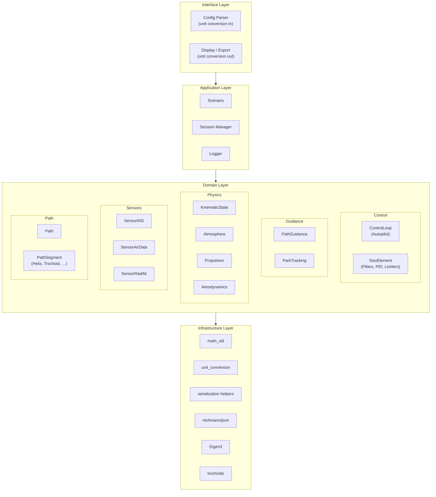
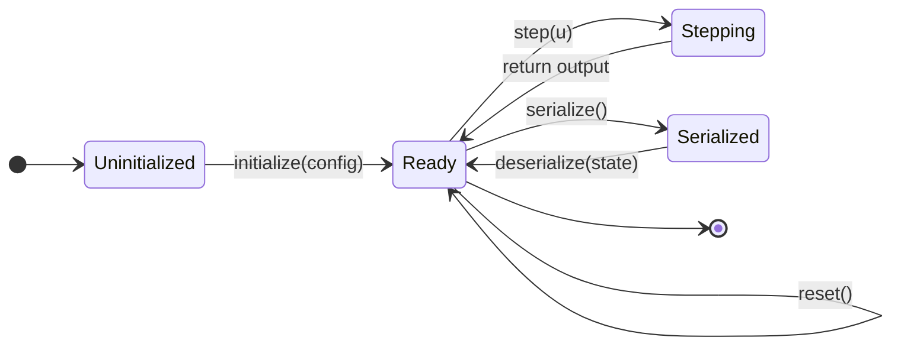
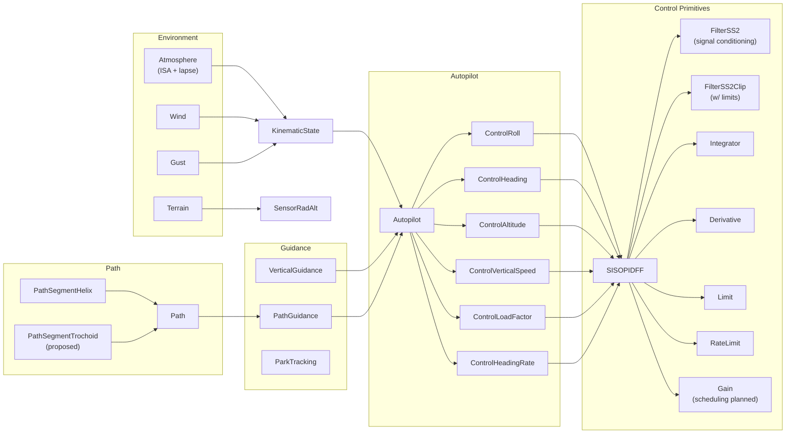
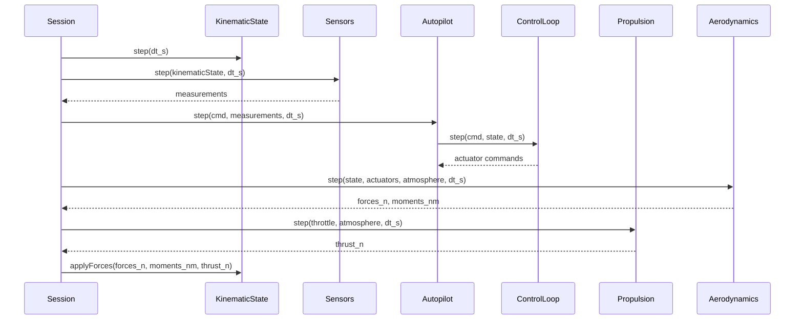

# System Architecture Overview

## Layer Model

The simulation is structured in four strict layers. Dependencies flow downward only — upper layers may use lower layers, never the reverse.

**Rules:**

- All values crossing layer boundaries are in SI units (m, rad, s, kg, N).
- Unit conversion happens exclusively in the Interface Layer.
- The Domain Layer has no I/O, no file access, no display logic.

---

## Component Lifecycle

Every dynamic simulation element follows this lifecycle. The interface is defined by `DynamicElement` — see [DynamicElement Design](dynamic_element.md) for the full specification.

| Method | Responsibility |
| --- | --- |
| `initialize(config)` | Parse parameters, allocate resources, configure internal structure |
| `reset()` | Return to initial post-initialize conditions; called between simulation runs |
| `step(u)` | Advance one timestep (fixed at initialize time); return scalar output |
| `serialize()` | Return a complete SI-unit JSON snapshot of internal state |
| `deserialize(state)` | Restore internal state from a snapshot |

---

## Subsystem Map

---

## Coordinate Frames and Sign Conventions

| Frame | Description | Usage |
| --- | --- | --- |
| NED | North–East–Down, Earth-fixed | Navigation, waypoints, wind |
| Body | $x$ forward, $y$ right, $z$ down | Aerodynamic forces, angular rates |
| Wind | $x$ along velocity vector | Aerodynamic angles ($\alpha$, $\beta$) |

Euler angles follow the **3-2-1** (yaw–pitch–roll) sequence:

$$
\mathbf{R}_{B}^{N} = R_1(\phi)\, R_2(\theta)\, R_3(\psi)
$$

Angular rates in the body frame relate to Euler rates by:

$$
\begin{bmatrix} p \\ q \\ r \end{bmatrix}
=
\begin{bmatrix}
1 & 0 & -\sin\theta \\
0 & \cos\phi & \sin\phi\cos\theta \\
0 & -\sin\phi & \cos\phi\cos\theta
\end{bmatrix}
\begin{bmatrix} \dot{\phi} \\ \dot{\theta} \\ \dot{\psi} \end{bmatrix}
$$

---

## Data Flow — Closed-Loop Step

The following sequence shows one simulation step through the full stack.

---

## Key Architectural Decisions

| Decision | Choice | Rationale |
| --- | --- | --- |
| Lifecycle interface | Non-Virtual Interface (NVI) | Base enforces cross-cutting concerns (logging, schema validation) once |
| State snapshot format | JSON (nlohmann/json) | Human-readable, schema-versioned, language-agnostic |
| SI unit enforcement | All internal values in SI | Eliminates unit-conversion bugs in computation code |
| Filter discretization | Tustin (bilinear) with prewarping | Preserves frequency-domain behavior at design frequency |
| Path transitions | Dubins / Trochoid | Time-optimal under curvature constraint and wind |
| Linear algebra | Eigen3 | De-facto standard; zero-cost abstractions; fixed-size matrices |
| Build system | CMake FetchContent | Reproducible, no separate package manager required |
