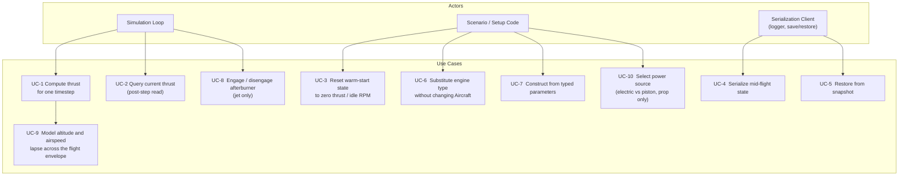
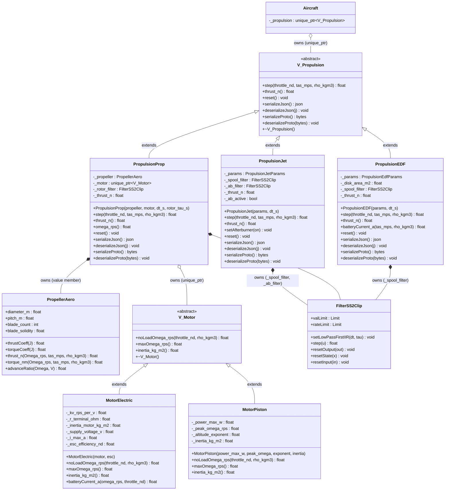
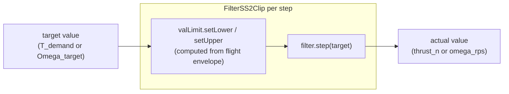
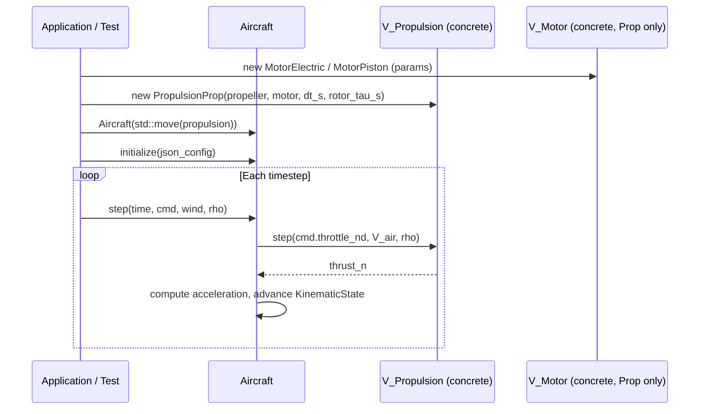

# Propulsion Subsystem — Architecture and Interface Design

This document is the design authority for the propulsion subsystem. It covers the
polymorphic virtual interface, the physics-based models, `FilterSS2Clip` usage, and the
integration contract with `Aircraft`.

---

## Use Case Decomposition



| ID | Use Case | Primary Actor | Mechanism |
|----|----------|---------------|-----------|
| UC-1 | Compute thrust for one timestep | `Aircraft::step()` | `V_Propulsion::step()` |
| UC-2 | Query current thrust after step | `Aircraft::step()` | `V_Propulsion::thrust_n()` |
| UC-3 | Reset warm-start state | `Aircraft::reset()` | `V_Propulsion::reset()` |
| UC-4 | Serialize mid-flight snapshot | Logger, pause/resume | `serializeJson()` / `serializeProto()` |
| UC-5 | Restore from snapshot | Pause/resume | `deserializeJson()` / `deserializeProto()` |
| UC-6 | Substitute engine type | Scenario code | Inject concrete subclass via `Aircraft` constructor |
| UC-7 | Construct from typed parameters | Scenario, test | Concrete class constructor or factory |
| UC-8 | Engage / disengage afterburner | Simulation loop | `PropulsionJet::setAfterburner(bool)` |
| UC-9 | Model thrust lapse with altitude and speed | Internal to `step()` | Thrust envelope function; limits fed to `FilterSS2Clip::valLimit` |
| UC-10 | Select power source for propeller | Scenario code | Inject `V_Motor` subclass via `PropulsionProp` constructor |

---

## Class Hierarchy



---

## `V_Propulsion` — Abstract Interface

**File:** `include/propulsion/V_Propulsion.hpp`
**Namespace:** `liteaerosim::propulsion`

```cpp
namespace liteaerosim::propulsion {

class V_Propulsion {
public:
    virtual ~V_Propulsion() = default;

    // Advance propulsion state by one timestep and return thrust magnitude (N).
    //   throttle_nd — normalized throttle demand [0, 1]
    //   tas_mps     — true airspeed (m/s)
    //   rho_kgm3    — ambient air density (kg/m³)
    [[nodiscard]] virtual float step(float throttle_nd,
                                     float tas_mps,
                                     float rho_kgm3) = 0;

    // Thrust output from the most recent step() call (N). Zero before the first step.
    [[nodiscard]] virtual float thrust_n() const = 0;

    // Reset warm-start state. thrust_n() returns 0 after reset().
    virtual void reset() = 0;

    // Serialize warm-start state only (not configuration parameters).
    // Snapshot includes "schema_version" (int) and "type" (string discriminator).
    [[nodiscard]] virtual nlohmann::json       serializeJson()                              const = 0;
    virtual void                               deserializeJson(const nlohmann::json&        j)    = 0;
    [[nodiscard]] virtual std::vector<uint8_t> serializeProto()                            const = 0;
    virtual void                               deserializeProto(const std::vector<uint8_t>& b)    = 0;
};

} // namespace liteaerosim::propulsion
```

### Interface Contracts

| Precondition | Method | Postcondition |
|---|---|---|
| `throttle_nd` ∈ [0, 1] | `step()` | `thrust_n() ≥ 0` |
| — | `reset()` | `thrust_n() == 0` |
| — | `serializeJson()` | snapshot has `"schema_version"` and `"type"` |
| snapshot `"type"` matches concrete class | `deserializeJson()` | warm-start state restored |
| snapshot `"type"` does not match concrete class | `deserializeJson()` | throws `std::runtime_error` |

### Why Not `DynamicBlock`

`DynamicBlock` models scalar SISO elements. `V_Propulsion::step()` takes three inputs
(`throttle_nd`, `tas_mps`, `rho_kgm3`) and is therefore not topologically SISO.
`V_Propulsion` is a standalone polymorphic base, like `AeroPerformance`.

---

## `PropulsionJet` — Physics-Based Jet Engine Model

**File:** `include/propulsion/PropulsionJet.hpp`, `src/propulsion/PropulsionJet.cpp`

### Physical Model

A first-principles net thrust model covering the subsonic flight envelope:

#### Altitude Lapse

The gross thrust available at full throttle decreases with density:

$$
T_{gross}(\rho) = T_{SL} \left(\frac{\rho}{\rho_{SL}}\right)^{n}
$$

The density exponent depends on engine bypass ratio (BPR):

$$
n = \frac{1}{\sqrt{1 + \text{BPR}}}
$$

| Engine type | Typical BPR | $n$ |
|---|---|---|
| Turbojet | 0 | 1.00 |
| Low-bypass turbofan | 0.5–1 | 0.71–0.82 |
| High-bypass turbofan | 5–10 | 0.38–0.41 |

#### Ram Drag

At speed the engine ingests and accelerates air. The net thrust is reduced by the
momentum of air drawn in at freestream speed (ram drag):

$$
F_{ram} = \rho \cdot V_{TAS}^2 \cdot A_{inlet}
$$

where $A_{inlet}$ is the effective inlet capture area (m²). Combined:

$$
T_{avail}(\rho, V) = \max\!\bigl(T_{idle},\; T_{gross}(\rho) - F_{ram}\bigr)
$$

$$
T_{idle}(\rho) = f_{idle} \cdot T_{SL} \left(\frac{\rho}{\rho_{SL}}\right)^{n}
$$

#### Spool Dynamics — `FilterSS2Clip`

The engine's thermal-mechanical lag between commanded and actual thrust is modeled by a
first-order discrete IIR filter. `FilterSS2Clip` provides both the dynamics and
anti-windup clamping in a single element.

**Configuration (at construction):**

```cpp
_spool_filter.setLowPassFirstIIR(dt_s, spool_tau_s);
```

**Each step, before calling `_spool_filter.step()`:**

```cpp
const float T_gross  = _params.thrust_sl_n
                     * std::pow(rho_kgm3 / kRhoSL_kgm3, _params.density_exponent);
const float F_ram    = rho_kgm3 * tas_mps * tas_mps * _params.inlet_area_m2;
const float T_avail  = std::max(thrustIdle(rho_kgm3), T_gross - F_ram);
const float T_demand = throttle_nd * T_avail;

_spool_filter.valLimit.setLower(thrustIdle(rho_kgm3));
_spool_filter.valLimit.setUpper(T_avail);
_thrust_n = _spool_filter.step(T_demand);
```

The `valLimit` prevents state wind-up when the filter input exceeds the envelope boundary.
`setLower` and `setUpper` are called every step so the limits track the instantaneous
flight envelope.

#### Afterburner

A separate `_ab_filter` (also `FilterSS2Clip`, first-order IIR) models the thrust augmentation
from the afterburner (reheat). Afterburner thrust is additive to dry thrust:

$$
T_{total} = T_{dry} + T_{AB}
$$

$$
T_{AB,avail}(\rho) = T_{AB,SL} \left(\frac{\rho}{\rho_{SL}}\right)^{n}
$$

**Configuration:**

```cpp
_ab_filter.setLowPassFirstIIR(dt_s, ab_spool_tau_s);
_ab_filter.valLimit.setLower(0.f);
```

**Each step:**

```cpp
const float T_ab_demand = _ab_active ? T_ab_avail : 0.f;
_ab_filter.valLimit.setUpper(_ab_active ? T_ab_avail : 0.f);
const float T_ab = _ab_filter.step(T_ab_demand);
_thrust_n = _spool_filter.step(T_demand) + T_ab;
```

`setAfterburner(true/false)` sets `_ab_active`. Setting `_ab_active = false` causes the
AB filter to drain naturally at its own time constant — representing light-off / blow-out
dynamics.

### Parameters

```cpp
struct PropulsionJetParams {
    float thrust_sl_n;          // Max dry thrust at sea level, full throttle (N)
    float bypass_ratio;         // BPR; 0 = turbojet; drives density exponent
    float inlet_area_m2;        // Inlet capture area for ram drag (m²)
    float idle_fraction;        // Idle thrust as fraction of T_sl at sea level (—)
    float spool_tau_s;          // First-order time constant for throttle response (s)
    float ab_thrust_sl_n;       // Afterburner thrust increment at SL (N); 0 = no AB
    float ab_spool_tau_s;       // AB light-off / blow-out time constant (s)
};
```

| Parameter | Typical range | Physical significance |
|---|---|---|
| `thrust_sl_n` | 5 kN – 200 kN | Installed sea-level static thrust |
| `bypass_ratio` | 0 – 12 | Engine cycle type |
| `inlet_area_m2` | 0.05 – 0.8 m² | Inlet frontal area |
| `idle_fraction` | 0.04 – 0.10 | Idle / windmill stop |
| `spool_tau_s` | 1 – 6 s | Thermal spool lag |
| `ab_thrust_sl_n` | 0 (dry), 20–100% of T_sl | AB augmentation |
| `ab_spool_tau_s` | 0.5 – 2 s | AB light-off |

### Warm-Start State

| Member | Serialized as | Description |
|--------|---------------|-------------|
| `_spool_filter.x()` | `spool_state[0..1]` | Dry-spool filter internal state vector `[x[0], x[1]]`; restored via `resetState()` |
| `_ab_filter.x()` | `ab_state[0..1]` | AB filter internal state vector `[x[0], x[1]]`; restored via `resetState()` |
| `_ab_active` | `ab_active` | Current afterburner engagement |
| `_thrust_n` | `thrust_n` | Last step total thrust (N); restored directly |

### JSON State Schema

```json
{
    "schema_version": 1,
    "type": "PropulsionJet",
    "thrust_n": 62400.0,
    "ab_active": false,
    "spool_state": [1234.56, 0.0],
    "ab_state":    [0.0,     0.0]
}
```

---

## `PropulsionEDF` — Electric Ducted Fan

**File:** `include/propulsion/PropulsionEDF.hpp`, `src/propulsion/PropulsionEDF.cpp`

### Design Rationale

An electric ducted fan (EDF) sits between a jet engine and an open propeller in its
aerodynamic character. The duct prevents tip recirculation and augments static thrust by
roughly 15–30% over the same bare fan; at cruise the net thrust lapse with airspeed is
flatter than an open propeller's. The drive is electric, so there is no thermal spool lag.

`PropulsionEDF` is designed as a structural parallel to `PropulsionJet`, borrowing its
thrust-envelope framing (density lapse + ram drag + `FilterSS2Clip` anti-windup), with
the thermal dynamics replaced by a shorter electric rotor time constant and the afterburner
removed. It does not reuse `PropulsionProp` / `PropellerAero` because the duct renders the
advance-ratio aerodynamic model inapplicable.

`PropulsionEDF` adds a `batteryCurrent_a()` diagnostic, borrowing the ESC efficiency
pattern from `MotorElectric`.

---

### Physical Model

#### Thrust Envelope

Full-throttle gross thrust lapse with density (electric motor shaft power is nearly
density-independent; disk momentum scales linearly with density):

$$
T_{gross}(\delta_T, \rho) = \delta_T \cdot T_{SL} \cdot \frac{\rho}{\rho_{SL}}
$$

Ram drag from the duct inlet ingesting freestream momentum (same as `PropulsionJet`):

$$
F_{ram} = \rho \cdot V_{TAS}^2 \cdot A_{inlet}
$$

Available net thrust (floored at idle to prevent windmilling below idle RPM):

$$
T_{avail}(\delta_T, \rho, V) = \max\!\bigl(T_{idle}(\rho),\; T_{gross} - F_{ram}\bigr)
$$

$$
T_{idle}(\rho) = f_{idle} \cdot T_{SL} \cdot \frac{\rho}{\rho_{SL}}
$$

#### Spool Dynamics — `FilterSS2Clip`

The electric rotor responds faster than a gas turbine but is still limited by fan+motor
inertia. The dynamics are modeled by a first-order IIR filter, using `FilterSS2Clip` for
anti-windup clamping. The per-step pattern is identical to `PropulsionJet`:

```cpp
const float T_gross  = throttle_nd * _params.thrust_sl_n * (rho_kgm3 / kRhoSL_kgm3);
const float F_ram    = rho_kgm3 * tas_mps * tas_mps * _params.inlet_area_m2;
const float T_avail  = std::max(thrustIdle(rho_kgm3), T_gross - F_ram);
const float T_demand = throttle_nd * T_avail;

_spool_filter.valLimit.setLower(thrustIdle(rho_kgm3));
_spool_filter.valLimit.setUpper(T_avail);
_thrust_n = _spool_filter.step(T_demand);
```

**Configuration at construction:**

```cpp
_spool_filter.setLowPassFirstIIR(dt_s, _params.rotor_tau_s);
```

#### Battery Current

Power delivered to the fan disk is estimated from actuator disk momentum theory. For a
disk of area $A_{disk} = \pi (D_{fan}/2)^2$ producing thrust $T$ at freestream speed $V$,
the induced velocity $v_i$ satisfies:

$$
v_i = -\frac{V}{2} + \sqrt{\left(\frac{V}{2}\right)^2 + \frac{T}{2\,\rho\,A_{disk}}}
$$

Fan shaft power (momentum flux through the disk):

$$
P_{fan} = T \cdot (V + v_i)
$$

Battery current (accounting for fan aerodynamic and ESC electrical efficiency):

$$
I_{battery} = \frac{P_{fan}}{\eta_{fan} \cdot \eta_{ESC} \cdot V_{supply}}
$$

`batteryCurrent_a()` is not called by `step()` — it is available for post-step energy
and endurance analysis.

---

### Parameters

```cpp
struct PropulsionEdfParams {
    float thrust_sl_n;          // Full-throttle static thrust at sea level (N)
    float fan_diameter_m;       // Fan disk diameter (m) — for actuator-disk power estimate
    float inlet_area_m2;        // Effective duct inlet capture area for ram drag (m²)
    float idle_fraction;        // Idle thrust as fraction of thrust_sl_n (—)
    float rotor_tau_s;          // First-order lag: throttle → thrust (s)
    float supply_voltage_v;     // DC battery bus voltage (V)
    float fan_efficiency_nd;    // Fan + duct aerodynamic efficiency (0.65–0.85)
    float esc_efficiency_nd;    // ESC DC-to-3-phase power conversion efficiency (0.90–0.98)
};
```

| Parameter | Typical range | Physical significance |
|---|---|---|
| `thrust_sl_n` | 5 N – 5 kN | Installed static thrust; read from spec sheet or bench test |
| `fan_diameter_m` | 0.04 – 0.25 m | Fan disk diameter; sets actuator disk area |
| `inlet_area_m2` | 0.001 – 0.05 m² | Duct inlet capture area; determines ram drag at speed |
| `idle_fraction` | 0.03 – 0.08 | Minimum thrust at idle RPM |
| `rotor_tau_s` | 0.05 – 0.5 s | Electric rotor lag; much shorter than gas turbine spool |
| `supply_voltage_v` | 11 – 52 V | LiPo cell voltage × series count |
| `fan_efficiency_nd` | 0.65 – 0.85 | Combined duct + blade aerodynamic figure of merit |
| `esc_efficiency_nd` | 0.90 – 0.98 | ESC switching and conduction losses |

**Comparison with `PropulsionJet`:**

| Property | `PropulsionJet` | `PropulsionEDF` |
|---|---|---|
| Density exponent | $1/\sqrt{1+\text{BPR}}$ | 1.0 (fixed — electric) |
| Spool / rotor τ | 1–6 s (thermal) | 0.05–0.5 s (electric) |
| Afterburner | Yes | No |
| Energy output | — | `batteryCurrent_a()` |
| Key new param | `bypass_ratio`, `spool_tau_s` | `fan_diameter_m`, `fan_efficiency_nd`, `esc_efficiency_nd` |

---

### Class Declaration

```cpp
namespace liteaerosim::propulsion {

class PropulsionEDF : public V_Propulsion {
public:
    PropulsionEDF(const PropulsionEdfParams& params, float dt_s);

    // V_Propulsion interface
    [[nodiscard]] float step(float throttle_nd, float tas_mps, float rho_kgm3) override;
    [[nodiscard]] float thrust_n() const override;
    void reset() override;

    [[nodiscard]] nlohmann::json       serializeJson()                              const override;
    void                               deserializeJson(const nlohmann::json&        j)    override;
    [[nodiscard]] std::vector<uint8_t> serializeProto()                            const override;
    void                               deserializeProto(const std::vector<uint8_t>& b)    override;

    // Battery current at the current thrust and flight condition (A).
    // For energy / endurance accounting only; not called by step().
    [[nodiscard]] float batteryCurrent_a(float tas_mps, float rho_kgm3) const;

private:
    PropulsionEdfParams _params;
    float               _disk_area_m2;   // precomputed: π * (fan_diameter_m / 2)²
    FilterSS2Clip       _spool_filter;
    float               _thrust_n;
};

} // namespace liteaerosim::propulsion
```

---

### Warm-Start State

| Member | Serialized as | Description |
|--------|---------------|-------------|
| `_spool_filter.x()` | `spool_state[0..1]` | Spool filter internal state vector `[x[0], x[1]]`; restored via `resetState()` |
| `_thrust_n` | `thrust_n` | Last step thrust (N); restored directly |

### JSON State Schema

```json
{
    "schema_version": 1,
    "type": "PropulsionEDF",
    "thrust_n": 87.5,
    "spool_state": [123.4, 0.0]
}
```

---

## `PropellerAero` — Propeller Aerodynamics Model

**File:** `include/propulsion/PropellerAero.hpp`

`PropellerAero` is a plain value type (no virtual methods, no state) that encapsulates
propeller geometry and computes non-dimensional thrust and torque coefficients.

### Parameters

| Parameter | Symbol | Unit | Description |
|---|---|---|---|
| `diameter_m` | $D$ | m | Propeller diameter |
| `pitch_m` | $p$ | m | Geometric pitch (advance per revolution at zero slip) |
| `blade_count` | $N_b$ | — | Number of blades |
| `blade_solidity` | $\sigma$ | — | $\sigma = N_b \bar{c} / (\pi R)$, where $\bar{c}$ is mean chord and $R = D/2$ |

### Derived Quantities (computed at construction, stored)

| Derived | Expression | Description |
|---|---|---|
| Disk area | $A = \pi (D/2)^2$ | Actuator disk area (m²) |
| Zero-thrust advance ratio | $J_0 = p/D$ | $J$ at which $C_T \to 0$ |
| 75% radius pitch angle | $\theta_{75} = \arctan(p\,/\,(0.75\,\pi\,D))$ | Blade angle at 75% radius |
| Static thrust coefficient | $C_{T0} = \tfrac{\sigma\,C_{L,blade}}{8}\,\theta_{75}$ | $C_T$ at $J=0$; $C_{L,blade} \approx 2\pi$ |
| Profile torque coefficient | $C_{Q0} = \tfrac{\sigma\,C_{D,blade}}{8}$ | Profile drag contribution |

### Thrust and Torque Coefficients

Advance ratio:

$$
J = \frac{V_{TAS}}{n \cdot D}, \quad n = \frac{\Omega}{2\pi} \text{ (rev/s)}
$$

Thrust coefficient (parabolic model, physically motivated by Goldstein tip-loss):

$$
C_T(J) = C_{T0}\,\left(1 - \frac{J}{J_0}\right)^2
$$

Torque coefficient:

$$
C_Q(J) = C_{Q0} + k_{CQ}\,J^2, \quad k_{CQ} = \frac{C_{T0}}{J_0^2}
$$

The $k_{CQ} J^2$ term captures the induced torque increase at high advance ratio (induced
drag dominates at high $J$).

Dimensional thrust and torque:

$$
T = C_T \cdot \rho\, n^2\, D^4, \qquad Q = C_Q \cdot \rho\, n^2\, D^5
$$

### Interface

```cpp
namespace liteaerosim::propulsion {

struct PropellerAero {
    float diameter_m;
    float pitch_m;
    int   blade_count;
    float blade_solidity;   // sigma = N_b * c_mean / (pi * R)

    // Computed at construction and stored:
    float disk_area_m2;
    float J_zero;           // zero-thrust advance ratio = pitch_m / diameter_m
    float CT0;              // static thrust coefficient
    float CQ0;              // profile torque coefficient

    // Compute advance ratio (clamped to [0, J_zero)).
    float advanceRatio(float Omega_rps, float tas_mps) const;

    // Non-dimensional coefficients.
    float thrustCoeff(float J) const;   // C_T(J)
    float torqueCoeff(float J) const;   // C_Q(J)

    // Dimensional thrust and torque.
    float thrust_n(float Omega_rps, float tas_mps, float rho_kgm3) const;
    float torque_nm(float Omega_rps, float tas_mps, float rho_kgm3) const;
};

} // namespace liteaerosim::propulsion
```

---

## `V_Motor` — Abstract Motor Interface

**File:** `include/propulsion/V_Motor.hpp`
**Namespace:** `liteaerosim::propulsion`

The motor abstraction decouples the power source from the propeller aerodynamics.
`PropulsionProp` holds a `V_Motor` and uses it to determine:

1. The **no-load shaft speed** for a given throttle and flight condition — this is the
   target input to the rotor speed `FilterSS2Clip`.
2. The **maximum shaft speed** — used as the `FilterSS2Clip` upper value limit.
3. The **rotor-system inertia** — used to derive the `FilterSS2Clip` time constant.

```cpp
namespace liteaerosim::propulsion {

class V_Motor {
public:
    virtual ~V_Motor() = default;

    // Free-running (no-load) shaft speed for the given throttle and air density.
    // PropulsionProp passes this as the target to the rotor FilterSS2Clip.
    //   throttle_nd — normalized throttle demand [0, 1]
    //   rho_kgm3    — ambient air density (for power-available correction)
    [[nodiscard]] virtual float noLoadOmega_rps(float throttle_nd,
                                                float rho_kgm3) const = 0;

    // Absolute maximum shaft speed (rad/s) — sets the FilterSS2Clip upper limit.
    [[nodiscard]] virtual float maxOmega_rps() const = 0;

    // Combined rotor + engine moment of inertia (kg·m²).
    // PropulsionProp uses this with the propeller torque gradient to derive tau_rotor.
    [[nodiscard]] virtual float inertia_kg_m2() const = 0;
};

} // namespace liteaerosim::propulsion
```

---

## `MotorElectric` — BLDC Motor and Controller

**File:** `include/propulsion/MotorElectric.hpp`

`MotorElectric` models two coupled components that together form the electric drive unit:

1. **The BLDC motor** — the physical electromagnetic machine that converts field current
   into shaft torque.
2. **The ESC (Electronic Speed Controller)** — the drive electronics that synthesize
   3-phase AC field currents from the DC battery bus in response to a normalized throttle
   command.

Neither component can operate independently: the ESC is meaningless without a motor to
drive, and the motor cannot be commanded without the current and voltage control the ESC
provides.

---

### Motor — BLDC Electromechanics

A brushless DC motor is characterized by its back-EMF constant $K_V$ (rad/s per Volt).
As the rotor turns, the stator sees a back-EMF proportional to shaft speed:

$$
V_{back} = \frac{\Omega}{K_V}
$$

The torque constant $K_T = 1/K_V$ (N·m/A in SI). When the ESC applies a phase voltage
$V_{phase}$ to the motor terminals, the net winding current is:

$$
I_{motor} = \frac{V_{phase} - \Omega / K_V}{R_{terminal}} - I_0
$$

where $I_0$ is the no-load current that accounts for bearing friction and iron losses.
Shaft torque output:

$$
Q_{motor} = K_T \cdot \min(I_{motor},\; I_{max})
$$

#### Motor Parameters

| Parameter | Symbol | Unit | Description |
|---|---|---|---|
| `kv_rps_per_v` | $K_V$ | rad/s/V | Back-EMF / velocity constant |
| `r_terminal_ohm` | $R$ | Ω | Phase winding resistance (1–100 mΩ typical); used only in `batteryCurrent_a()` |
| `inertia_motor_kg_m2` | $J$ | kg·m² | Rotor inertia (not including propeller) |

---

### ESC — Drive Electronics

The ESC takes DC battery power at `supply_voltage_v` and synthesizes 3-phase PWM field
currents. The throttle command $\delta_T \in [0, 1]$ is realized as a PWM duty cycle that
sets the effective RMS phase voltage delivered to the motor:

$$
V_{phase} = \delta_T \cdot V_{supply}
$$

The ESC introduces two constraints:

1. **Current limit** — the ESC's power stage has a peak continuous current rating `i_max_a`.
   This is the binding motor current constraint in practice, because brushless motors have
   extremely low winding resistances (1–100 mΩ), making the resistance-limited stall
   current $I_{stall} = V_{supply}/R$ often 500–5000 A — far above any real operating point.
   `i_max_a` (10–200 A typical for UAS-scale systems) is set by the ESC thermal and MOSFET
   ratings, independently of $R$ and $V_{supply}$.

2. **Conversion efficiency** — the ESC power stage is not lossless. The efficiency
   $\eta_{ESC}$ (typically 0.90–0.98) characterizes the fraction of DC battery power
   delivered as AC electrical power to the motor phases:

   $$
   P_{motor} = \eta_{ESC} \cdot P_{battery}
   $$

   Battery current drawn for a given motor current and speed:

   $$
   I_{battery} = \frac{V_{phase} \cdot I_{motor}}{V_{supply} \cdot \eta_{ESC}}
   $$

   $\eta_{ESC}$ does not appear in `noLoadOmega_rps` or thrust computation — it affects
   only the power drawn from the battery, which is relevant to endurance and thermal analysis.

#### ESC / Controller Parameters

| Parameter | Symbol | Unit | Description |
|---|---|---|---|
| `supply_voltage_v` | $V_{supply}$ | V | DC battery bus voltage |
| `i_max_a` | $I_{max}$ | A | ESC peak current rating (MOSFET / thermal limit) |
| `esc_efficiency_nd` | $\eta_{ESC}$ | — | DC-to-3-phase power conversion efficiency (0.90–0.98) |

---

### Combined Physical Model

**No-load shaft speed** (the target passed to `FilterSS2Clip` by `PropulsionProp`):

$$
\Omega_0 = K_V \cdot \delta_T \cdot V_{supply}
$$

`rho_kgm3` is accepted by `noLoadOmega_rps()` but unused — electric drive power is not
density-limited.

**Maximum shaft torque** (performance ceiling set by the ESC current limit):

$$
Q_{max} = K_T \cdot I_{max} = \frac{I_{max}}{K_V}
$$

This is the torque available at stall and during startup overloads. At cruise the motor
operates well below $Q_{max}$ in the linear back-EMF region.

**Rotor time constant** is supplied directly by the caller as `rotor_tau_s` (see
`PropulsionProp`). `MotorElectric` provides `inertia_kg_m2()` as an input to that
calculation if the caller chooses to derive it from physical parameters.

**Battery current** (for power/endurance analysis, not used by `PropulsionProp::step()`):

$$
I_{battery}(\Omega, \delta_T) = \frac{(\delta_T \cdot V_{supply} - \Omega/K_V) \cdot \min(I_{motor},\; I_{max})}{V_{supply} \cdot \eta_{ESC}}
$$

where $I_{motor} = (\delta_T \cdot V_{supply} - \Omega / K_V)\,/\,R_{terminal}$. The
winding resistance $R$ is used here only; it is not part of the thrust or rotor-speed
computation path.

---

### Class Declaration

```cpp
namespace liteaerosim::propulsion {

struct MotorElectricMotorParams {
    float kv_rps_per_v;         // Back-EMF / velocity constant (rad/s/V)
    float r_terminal_ohm;       // Phase winding resistance (Ω) — used only in batteryCurrent_a()
    float inertia_motor_kg_m2;  // Rotor moment of inertia, excluding propeller (kg·m²)
};

struct MotorElectricEscParams {
    float supply_voltage_v;     // DC battery bus voltage (V)
    float i_max_a;              // ESC peak current rating (A)
    float esc_efficiency_nd;    // DC-to-3-phase power conversion efficiency [0, 1]
};

class MotorElectric : public V_Motor {
public:
    MotorElectric(const MotorElectricMotorParams& motor,
                  const MotorElectricEscParams&   esc);

    // V_Motor interface
    [[nodiscard]] float noLoadOmega_rps(float throttle_nd, float rho_kgm3) const override;
    [[nodiscard]] float maxOmega_rps()  const override;
    [[nodiscard]] float inertia_kg_m2() const override;

    // Battery current drawn at the given operating point (A).
    // For energy / endurance accounting only; not called by PropulsionProp::step().
    [[nodiscard]] float batteryCurrent_a(float omega_rps, float throttle_nd) const;

private:
    // --- Motor electromechanics ---
    float _kv_rps_per_v;
    float _r_terminal_ohm;       // used only in batteryCurrent_a()
    float _inertia_motor_kg_m2;

    // --- ESC / drive electronics ---
    float _supply_voltage_v;
    float _i_max_a;
    float _esc_efficiency_nd;
};

} // namespace liteaerosim::propulsion
```

---

## `MotorPiston` — Normally Aspirated Piston Engine

**File:** `include/propulsion/MotorPiston.hpp`

### Physical Model

A piston engine delivers shaft power that lapses with air density (supercharger effects
are not modelled). Available power:

$$
P_{avail}(\delta_T, \rho) = P_{max} \cdot \delta_T \cdot \left(\frac{\rho}{\rho_{SL}}\right)^{n_{alt}}
$$

The power-vs-speed curve is parabolic (matching zero power at zero RPM and at the
over-rev limit $\Omega_{max} = 2\,\Omega_{peak}$):

$$
P(\Omega) = P_{avail} \cdot \frac{\Omega}{\Omega_{peak}} \cdot \left(2 - \frac{\Omega}{\Omega_{peak}}\right)
$$

At maximum throttle and sea level, peak power $P_{max}$ is delivered at $\Omega_{peak}$.

The free-running (no-load) speed — where net torque to the propeller is zero — is
approached as throttle and density set the peak of the power curve. For a simplified
linear model:

$$
\Omega_0(\delta_T, \rho) = 2\,\Omega_{peak} \cdot \delta_T \cdot \left(\frac{\rho}{\rho_{SL}}\right)^{n_{alt}/2}
$$

This is the target speed passed to the `FilterSS2Clip`. The filter's lag, together with
`rateLimit`, prevents the rotor from accelerating faster than the inertia allows.

### Parameters

| Parameter | Symbol | Unit | Description |
|---|---|---|---|
| `power_max_w` | $P_{max}$ | W | Maximum shaft power at sea level |
| `peak_omega_rps` | $\Omega_{peak}$ | rad/s | Speed at maximum power |
| `altitude_exponent` | $n_{alt}$ | — | Density exponent for power lapse (≈1.0 normally aspirated) |
| `inertia_kg_m2` | $J$ | kg·m² | Crankshaft + flywheel + propeller inertia |

---

## `PropulsionProp` — Propeller Propulsion Model

**File:** `include/propulsion/PropulsionProp.hpp`, `src/propulsion/PropulsionProp.cpp`

### Design Overview

`PropulsionProp` owns a `PropellerAero` (value member) and a `V_Motor` (polymorphic
pointer). The rotor speed dynamics are modelled entirely by a `FilterSS2Clip`.

The rotor speed `Omega` is the coupling variable between motor and propeller:
- Motor produces torque $Q_{motor}(\Omega, \delta_T, \rho)$
- Propeller requires torque $Q_{prop}(\Omega, V, \rho)$
- Rotor dynamics: $J\,\dot\Omega = Q_{motor} - Q_{prop}$

This is approximated as a first-order lag around the equilibrium speed, implemented by
the `FilterSS2Clip`:

```
Omega_target = motor.noLoadOmega_rps(throttle_nd, rho_kgm3)

_rotor_filter.valLimit.setUpper(motor.maxOmega_rps())
Omega_actual = _rotor_filter.step(Omega_target)

_thrust_n = propeller.thrust_n(Omega_actual, tas_mps, rho_kgm3)
```

### Rotor Time Constant

The rotor speed time constant is supplied directly as `rotor_tau_s` (a constructor
parameter). This represents the first-order lag from a throttle step to steady-state
rotor speed — typically 0.2–2 s for electric UAS drives and 0.5–3 s for piston
installations, depending on propeller disk loading and drive-train inertia.

Deriving `rotor_tau_s` from physical parameters: if the motor inertia $J$ (from
`V_Motor::inertia_kg_m2()`) and an estimate of the propeller torque gradient
$|\partial Q_{prop}/\partial\Omega|$ at cruise are available, then:

$$
\tau_{rotor} \approx \frac{J}{|\partial Q_{prop}/\partial\Omega|_{cruise}}
$$

This derivation is the caller's responsibility, not `PropulsionProp`'s, so that the
choice of nominal operating point is explicit.

**Filter configuration at construction:**

```cpp
_rotor_filter.setLowPassFirstIIR(dt_s, rotor_tau_s);
_rotor_filter.valLimit.setLower(0.f);
_rotor_filter.valLimit.setUpper(motor.maxOmega_rps());
```

### Parameters

| Source | Parameter | Unit | Description |
|---|---|---|---|
| `PropellerAero` | `diameter_m`, `pitch_m`, `blade_count`, `blade_solidity` | — | Propeller geometry |
| `V_Motor` | (varies by subclass) | — | Motor model parameters |
| `PropulsionProp` | `dt_s` | s | Fixed simulation timestep |
| `PropulsionProp` | `rotor_tau_s` | s | Rotor speed first-order lag (0.2–3 s); see Rotor Time Constant above |

### Warm-Start State

| Member | Serialized as | Description |
|--------|---------------|-------------|
| `_rotor_filter.x()` | `rotor_state[0..1]` | Rotor filter internal state vector `[x[0], x[1]]`; restored via `resetState()` |
| `_thrust_n` | `thrust_n` | Last computed thrust (N); restored directly |

`V_Motor` is stateless — no motor state is serialized.

### JSON State Schema

```json
{
    "schema_version": 1,
    "type": "PropulsionProp",
    "thrust_n": 312.5,
    "rotor_state": [210.3, 0.0]
}
```

---

## `FilterSS2Clip` Integration Summary

Both propulsion models delegate dynamics and limiting to `FilterSS2Clip`. The pattern
is identical in both cases:



| Model | Filter | Input | `valLimit` lower | `valLimit` upper | `tau` source |
|---|---|---|---|---|---|
| `PropulsionJet` (dry) | `_spool_filter` | `throttle * T_avail` | `T_idle(rho)` | `T_avail(rho, V)` | `spool_tau_s` (config) |
| `PropulsionJet` (AB) | `_ab_filter` | `T_ab_avail` or `0` | `0` | `T_ab_avail(rho)` or `0` | `ab_spool_tau_s` (config) |
| `PropulsionEDF` | `_spool_filter` | `throttle * T_avail` | `T_idle(rho)` | `T_avail(rho, V)` | `rotor_tau_s` (config) |
| `PropulsionProp` | `_rotor_filter` | `noLoadOmega` | `0` | `motor.maxOmega_rps()` | `rotor_tau_s` (config) |

`setLower` / `setUpper` are called every step to track the instantaneous flight envelope.
The anti-windup backsolve in `FilterSS2Clip` prevents state drift when limits are active.

---

## Serialization Design

### Scope

`serializeJson()` / `serializeProto()` capture **warm-start state only** — the values
needed to resume mid-flight without a discontinuity. Configuration parameters are not
serialized; they are reapplied by `Aircraft::initialize(config)` at construction.

### Type Discriminator

Each snapshot includes `"type"` as a string. `deserializeJson()` verifies the
discriminator matches the concrete class; mismatch throws `std::runtime_error`.

### Filter State vs. Filter Output

The `spool_state`, `ab_state`, and `rotor_state` fields store the **raw internal state
vector `x`** of the embedded `FilterSS2Clip`, not the filter's scalar output.

Storing `x` directly enables exact reconstruction at any point in a transient. The
alternative — storing `filter.out()` and restoring via `resetOutput()` — relies on a
steady-state back-solve (`x = (I−Φ)⁻¹ Γ (out/dc_gain)`) that is only exact when the
filter has converged. Storing `x` avoids this assumption.

Deserialization restores the filter state with `resetState(x)` rather than `resetOutput()`.
The `valLimit` upper bound is disabled before the restore and re-armed after, because the
default upper bound (0) would clip the state output before the first `step()` call sets the
correct per-flight-condition limit:

```cpp
filter.valLimit.disableUpper();
filter.resetState(x);           // sets _x directly, recomputes _out = H·x + J·0
filter.valLimit.enableUpper();  // upper will be set correctly on next step()
```

`thrust_n` is serialized as a direct read-back and is restored from the snapshot without
recomputation from the filter state.

### Protobuf Messages (defined in `proto/liteaerosim.proto`)

```proto
message PropulsionJetState {
    int32          schema_version = 1;
    float          thrust_n       = 2;
    bool           ab_active      = 3;
    repeated float spool_state    = 4;  // FilterSS2Clip state vector x: [x[0], x[1]]
    repeated float ab_state       = 5;  // FilterSS2Clip state vector x: [x[0], x[1]]
}

message PropulsionEdfState {
    int32          schema_version = 1;
    float          thrust_n       = 2;
    repeated float spool_state    = 3;  // FilterSS2Clip state vector x: [x[0], x[1]]
}

message PropulsionPropState {
    int32          schema_version = 1;
    float          thrust_n       = 2;
    repeated float rotor_state    = 3;  // FilterSS2Clip state vector x: [x[0], x[1]]
}
```

---

## Integration with `Aircraft`

### Construction and Data Flow



### `Aircraft::step()` call site

```cpp
// Step 6 — advance propulsion:
const float T = _propulsion->step(cmd.throttle_nd, V_air, rho_kgm3);
```

### Afterburner command (jet only)

The afterburner is a separate channel from the main throttle. The simulation loop
casts to the concrete type or uses a separate setter injected at construction:

```cpp
// At scenario level (cast pattern):
if (auto* jet = dynamic_cast<PropulsionJet*>(_propulsion.get()))
    jet->setAfterburner(cmd.afterburner_on);
```

### Propulsion Parameters in the JSON Config Schema

The current `aircraft_config_v1.md` schema does not yet include a `"propulsion"` section.
When `Aircraft::initialize(config)` is extended to construct the propulsion model from
config, a `"propulsion"` top-level block will be added. Until then, concrete propulsion
objects are constructed directly in application or test code.

---

## File Map

| File | Contents |
|------|----------|
| `include/propulsion/V_Propulsion.hpp` | Abstract base class |
| `include/propulsion/PropulsionJet.hpp` | Jet model declaration; `PropulsionJetParams` struct |
| `include/propulsion/PropulsionEDF.hpp` | EDF model declaration; `PropulsionEdfParams` struct |
| `include/propulsion/PropulsionProp.hpp` | Propeller model declaration |
| `include/propulsion/PropellerAero.hpp` | `PropellerAero` value type |
| `include/propulsion/V_Motor.hpp` | Abstract motor interface |
| `include/propulsion/MotorElectric.hpp` | BLDC motor declaration |
| `include/propulsion/MotorPiston.hpp` | Piston motor declaration |
| `src/propulsion/PropulsionJet.cpp` | Jet model implementation |
| `src/propulsion/PropulsionEDF.cpp` | EDF model implementation |
| `src/propulsion/PropulsionProp.cpp` | Propeller model implementation |
| `src/propulsion/PropellerAero.cpp` | Propeller coefficient computation |
| `src/propulsion/MotorElectric.cpp` | Electric motor implementation |
| `src/propulsion/MotorPiston.cpp` | Piston motor implementation |
| `test/PropulsionJet_test.cpp` | Unit tests for PropulsionJet |
| `test/PropulsionEDF_test.cpp` | Unit tests for PropulsionEDF |
| `test/PropulsionProp_test.cpp` | Unit tests for PropulsionProp (both motor types) |
| `test/PropellerAero_test.cpp` | Unit tests for PropellerAero coefficients |
| `test/Motor_test.cpp` | Unit tests for MotorElectric and MotorPiston |
