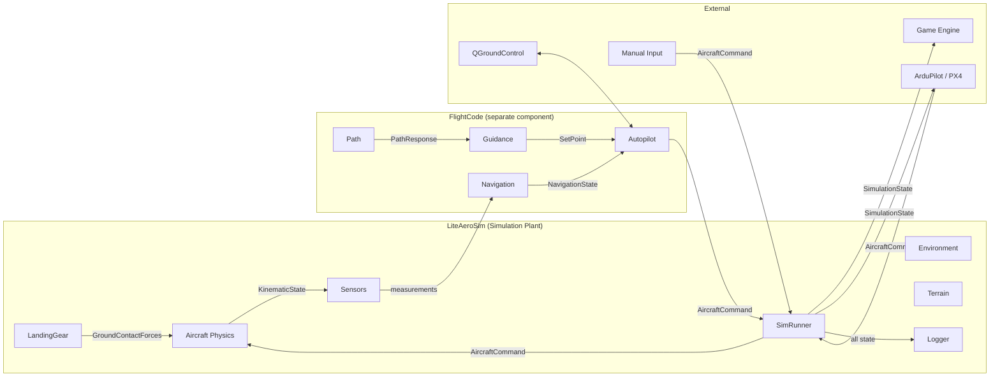
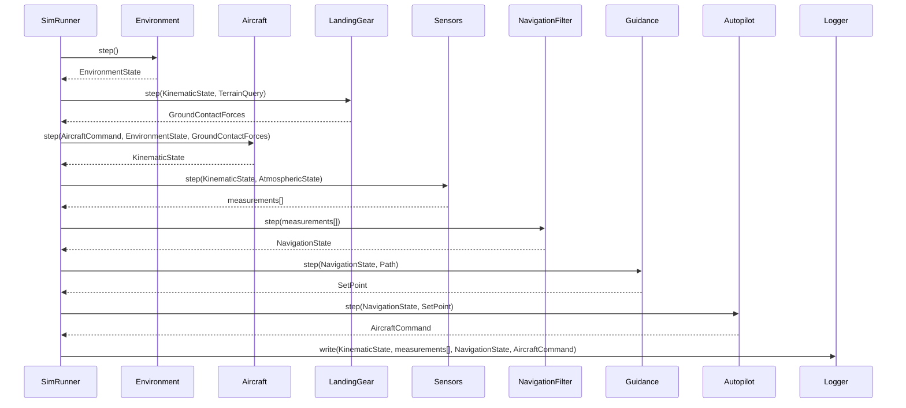
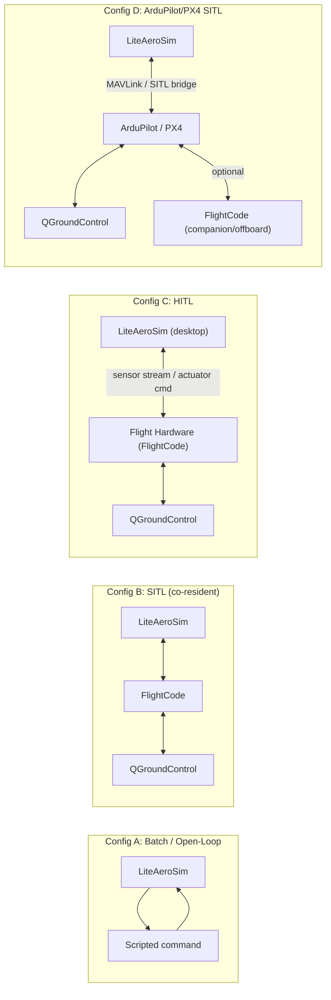
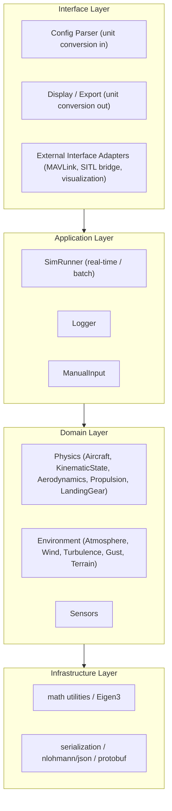

# System Diagrams — Future State

---

## System Context

---

## Closed-Loop Step Sequence (SITL)

---

## Deployment Configurations

---

## LiteAeroSim Internal Layer Architecture

**Note:** FlightCode (Autopilot, Guidance, Path, Navigation) is outside this layer diagram.
It communicates with LiteAeroSim only through the Interface Layer adapters (ICD-8, ICD-9).
