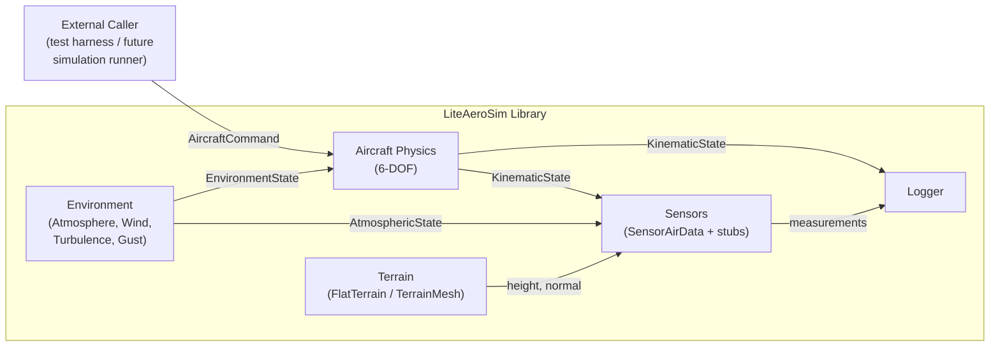
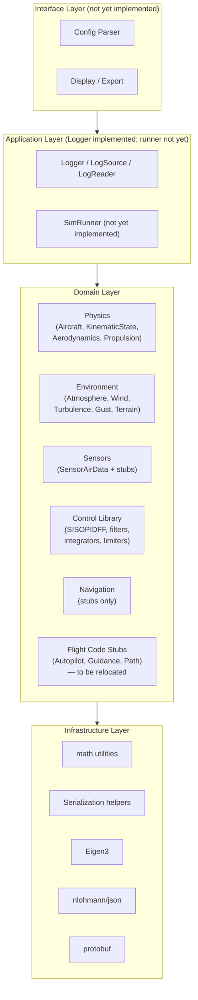
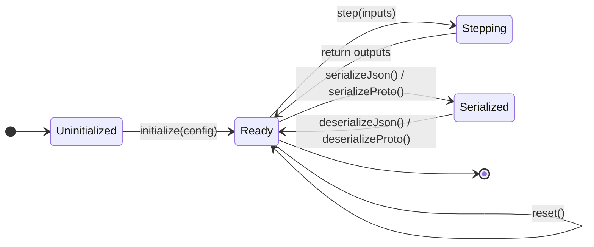

# System Diagrams — Present State

---

## System Context



---

## Per-Step Data Flow (Single Simulation Step)

```mermaid
sequenceDiagram
    participant Loop as Simulation Loop
    participant Atm as Atmosphere
    participant Wind as Wind/Turbulence/Gust
    participant AC as Aircraft
    participant SAD as SensorAirData
    participant Log as Logger

    Loop->>Atm: step(altitude_m)
    Atm-->>Loop: AtmosphericState

    Loop->>Wind: step(altitude_m, Va_mps)
    Wind-->>Loop: EnvironmentState (wind + turbulence + gust)

    Loop->>AC: step(AircraftCommand, EnvironmentState)
    AC-->>Loop: KinematicState

    Loop->>SAD: step(airspeed_body_mps, AtmosphericState)
    SAD-->>Loop: AirDataMeasurement

    Loop->>Log: write(KinematicState, AirDataMeasurement, ...)
```

---

## Layer Architecture



---

## Component Lifecycle State Machine


