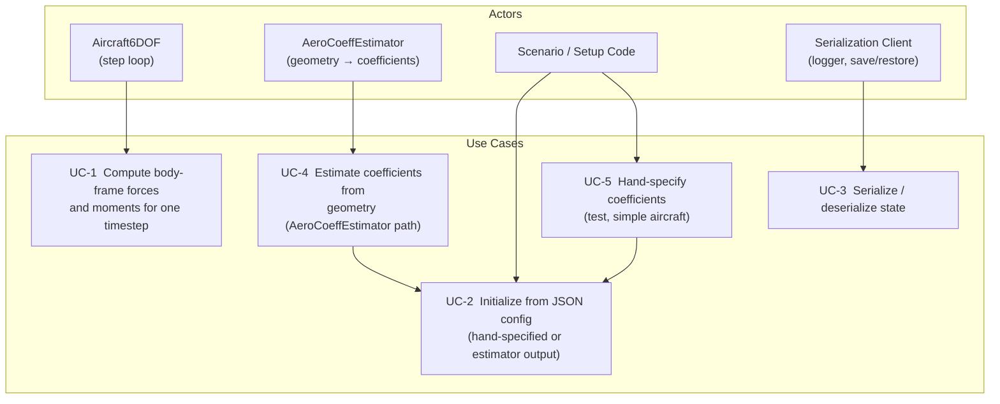

# Aerodynamic Coefficient Model — Design Study

This document is the design authority for the aerodynamic coefficient model format used
by `BodyAxisCoeffModel` and `Aircraft6DOF`. It defines what data sources are used to
obtain coefficients, what axes and sign conventions govern the model, how coefficients
are structured as functions of state and control, and which aircraft configurations are
used to validate the format before implementation begins.

This study resolves OQ-16(c) from
[`docs/architecture/system/future/decisions.md`](../architecture/system/future/decisions.md) and is a
prerequisite for [`Aircraft6DOF` design and implementation (roadmap item 7)](../../roadmap/aircraft.md).

**Scope:** fixed-wing aircraft, subsonic ($M < 0.3$), rigid airframe, no aeroelasticity,
no ground effect, propwash coupling not modeled (see [OQ-6](#open-questions)).

---

## Relationship to the Existing Trim Model

The current `Aircraft` model uses a load-factor controller backed by `AeroPerformance`,
`LiftCurveModel`, and `LoadFactorAllocator`. These components together implement a
drag-polar model:

$$C_L(\alpha),\quad C_D = C_{D_0} + k C_L^2,\quad C_Y = C_{Y_\beta}\beta$$

All three are wind-frame scalars. Pitch, roll, and yaw moments are not modeled — they
are implicit in the load-factor command abstraction.

`Aircraft6DOF` requires body-frame forces **and moments** as explicit functions of state
$(\alpha, \beta, p, q, r)$ and control $(\delta_e, \delta_a, \delta_r)$. `BodyAxisCoeffModel`
must provide these. The format defined here must be expressive enough to cover the range
of fixed-wing configurations expected in LiteAero missions while remaining tractable for
[`AeroCoeffEstimator`](aero_coeff_estimator.md) and hand-specified datasets.

---

## Use Case Decomposition



| ID | Use Case | Primary Actor | Mechanism |
| --- | --- | --- | --- |
| UC-1 | Compute body-frame forces and moments | `Aircraft6DOF::step()` | `BodyAxisCoeffModel::compute(alpha, beta, p_nd, q_nd, r_nd, q_inf_pa, controls)` |
| UC-2 | Initialize from JSON config | Scenario, test | `BodyAxisCoeffModel::initialize(config)` |
| UC-3 | Serialize / deserialize | Logger, save/restore | `serializeJson()` / `serializeProto()` |
| UC-4 | Estimate from geometry | `AeroCoeffEstimator` | `AircraftGeometry` → `AeroCoeffEstimator` → JSON |
| UC-5 | Hand-specify coefficients | Developer, test | Directly authored JSON config |

---

## Axes and Sign Conventions

Body frame: $x$ forward, $y$ right, $z$ down (NED-aligned at zero attitude). Positive
rotations by the right-hand rule: roll $p$ — right-wing down, pitch $q$ — nose up,
yaw $r$ — nose right.

| Symbol | Axis | Positive direction |
| --- | --- | --- |
| $C_X$ | Body $x$ (axial) | Forward (thrust / reduced drag) |
| $C_Y$ | Body $y$ (lateral) | Right |
| $C_Z$ | Body $z$ (normal) | Down (lift is negative $C_Z$) |
| $C_l$ | Roll moment about $x$ | Right-wing down |
| $C_m$ | Pitch moment about $y$ | Nose up |
| $C_n$ | Yaw moment about $z$ | Nose right |

Normalization: all force coefficients normalized by $q_\infty S_\text{ref}$; moment
coefficients by $q_\infty S_\text{ref} \bar{c}$ (pitch) or $q_\infty S_\text{ref} b$
(roll, yaw). Angular rate inputs are non-dimensionalized:
$\hat{p} = pb/(2V)$, $\hat{q} = q\bar{c}/(2V)$, $\hat{r} = rb/(2V)$.

Non-dimensionalization is performed by the caller (`Aircraft6DOF`) before passing rates
to `BodyAxisCoeffModel::compute()`. The model receives $\hat{p}$, $\hat{q}$, $\hat{r}$
directly; it does not hold airspeed state internally.

### Control Input Sign Conventions

| Symbol | Positive direction | Primary moment effect | Typical sign of effectiveness derivative |
| --- | --- | --- | --- |
| $\delta_e$ | Trailing edge down | Nose-down pitch | $C_{m_{\delta_e}} < 0$ |
| $\delta_a$ | Left aileron TE down, right aileron TE up | Right-wing-down roll | $C_{l_{\delta_a}} > 0$ |
| $\delta_r$ | Trailing edge to starboard | Nose-left yaw | $C_{n_{\delta_r}} < 0$ |

All control inputs are in radians. For flying-wing (elevon) configurations the scenario
layer maps physical elevon commands to effective $\delta_e$ and $\delta_a$ before calling
`compute()`:

$$\delta_e = \tfrac{1}{2}(\delta_{L} + \delta_{R}), \qquad \delta_a = \tfrac{1}{2}(\delta_{R} - \delta_{L})$$

where $\delta_L$ and $\delta_R$ are the left and right elevon trailing-edge-down
deflections. `BodyAxisCoeffModel` never receives raw elevon commands.

---

## Coefficient Model Format

### Linear Stability Derivative Model

The baseline format is a first-order Taylor expansion about a nominal trim point
($\alpha_0 = 0$, $\beta = 0$, zero rates, zero control deflections):

$$C_X = C_{X_0} + C_{X_\alpha}\alpha + C_{X_{\delta_e}}\delta_e$$

$$C_Z = C_{Z_0} + C_{Z_\alpha}\alpha + C_{Z_q}\hat{q} + C_{Z_{\delta_e}}\delta_e$$

$$C_m = C_{m_0} + C_{m_\alpha}\alpha + C_{m_q}\hat{q} + C_{m_{\delta_e}}\delta_e$$

$$C_Y = C_{Y_\beta}\beta + C_{Y_p}\hat{p} + C_{Y_r}\hat{r} + C_{Y_{\delta_r}}\delta_r$$

$$C_l = C_{l_\beta}\beta + C_{l_p}\hat{p} + C_{l_r}\hat{r} + C_{l_{\delta_a}}\delta_a + C_{l_{\delta_r}}\delta_r$$

$$C_n = C_{n_\beta}\beta + C_{n_p}\hat{p} + C_{n_r}\hat{r} + C_{n_{\delta_a}}\delta_a + C_{n_{\delta_r}}\delta_r$$

This is the minimum set sufficient for linear flight dynamics simulation and the autopilot
verification use cases that drive `Aircraft6DOF`.

### Required Coefficient Fields

| Symbol | Description | Typical range | Source |
| --- | --- | --- | --- |
| $C_{X_0}$ | Axial force at zero conditions | ≈ $-C_{D_0}$ | Drag polar |
| $C_{X_\alpha}$ | Axial force — $\alpha$ derivative | small positive | DATCOM / CFD |
| $C_{X_{\delta_e}}$ | Axial force — elevator derivative | small | DATCOM |
| $C_{Z_0}$ | Normal force at zero conditions | ≈ 0 | Lift curve |
| $C_{Z_\alpha}$ | Lift curve slope in body frame | ≈ $-C_{L_\alpha}$ (negative) | `AeroCoeffEstimator` |
| $C_{Z_q}$ | Normal force — pitch-rate damping | negative, $-2 C_{L_\alpha} l_{HT}/\bar{c}$ | `AeroCoeffEstimator` |
| $C_{Z_{\delta_e}}$ | Elevator lift effectiveness | negative | DATCOM / geometry |
| $C_{m_0}$ | Pitching moment at zero conditions | depends on CG | geometry |
| $C_{m_\alpha}$ | Pitch stiffness | negative (stable) | geometry + `AeroCoeffEstimator` |
| $C_{m_q}$ | Pitch damping | negative | `AeroCoeffEstimator` |
| $C_{m_{\delta_e}}$ | Elevator pitch effectiveness | negative | DATCOM / geometry |
| $C_{Y_\beta}$ | Lateral force — sideslip slope | negative | `AeroCoeffEstimator` |
| $C_{Y_p}$ | Lateral force — roll rate | small | `AeroCoeffEstimator` |
| $C_{Y_r}$ | Lateral force — yaw rate | positive | `AeroCoeffEstimator` |
| $C_{Y_{\delta_r}}$ | Rudder side force | positive | DATCOM / geometry |
| $C_{l_\beta}$ | Roll — dihedral effect | negative (stable) | geometry |
| $C_{l_p}$ | Roll damping | negative | geometry |
| $C_{l_r}$ | Roll due to yaw rate | positive | geometry |
| $C_{l_{\delta_a}}$ | Aileron roll effectiveness | positive | geometry |
| $C_{l_{\delta_r}}$ | Rudder roll coupling | small | geometry |
| $C_{n_\beta}$ | Yaw stiffness — weathercock | positive (stable) | `AeroCoeffEstimator` |
| $C_{n_p}$ | Yaw due to roll rate | small | geometry |
| $C_{n_r}$ | Yaw damping | negative | geometry |
| $C_{n_{\delta_a}}$ | Aileron yaw coupling | small (adverse) | geometry |
| $C_{n_{\delta_r}}$ | Rudder yaw effectiveness | negative | DATCOM / geometry |

All coefficients are dimensionless per the non-dimensionalization relationships below.
The sign convention follows Etkin & Reid *Dynamics of Flight* (3rd ed.) and the
body-frame definitions above.

### Non-Dimensionalization

#### Non-Dimensional Form (Stored in `BodyAxisCoeffModel`)

Force coefficients are non-dimensionalized by dynamic pressure and reference area:

$$C_F = \frac{F}{q_\infty S_\text{ref}}$$

Moment coefficients are further divided by a reference length — mean aerodynamic chord
$\bar{c}$ for pitch, wingspan $b$ for roll and yaw:

$$C_m = \frac{M_y}{q_\infty S_\text{ref} \bar{c}}, \qquad
  C_l = \frac{M_x}{q_\infty S_\text{ref} b}, \qquad
  C_n = \frac{M_z}{q_\infty S_\text{ref} b}$$

Angular rate derivatives carry the same length factor through the non-dimensional rate
definition ($\hat{p} = pb/(2V)$, $\hat{q} = q\bar{c}/(2V)$, $\hat{r} = rb/(2V)$) so
that, for example, $C_{Z_q}\hat{q}$ is dimensionless regardless of airspeed or geometry.

#### Dimensional Recovery (Performed by `Aircraft6DOF`)

`BodyAxisCoeffModel::compute()` returns non-dimensional force and moment coefficients.
`Aircraft6DOF` recovers the dimensional body-frame forces and moments:

$$\begin{pmatrix} F_x \\ F_y \\ F_z \end{pmatrix} = q_\infty S_\text{ref}
  \begin{pmatrix} C_X \\ C_Y \\ C_Z \end{pmatrix} \quad [\text{N}]$$

$$\begin{pmatrix} M_x \\ M_y \\ M_z \end{pmatrix} = q_\infty S_\text{ref}
  \begin{pmatrix} b\,C_l \\ \bar{c}\,C_m \\ b\,C_n \end{pmatrix} \quad [\text{N\,m}]$$

The reference quantities $S_\text{ref}$, $\bar{c}$, and $b$ are stored in
`BodyAxisCoeffModel` alongside the coefficients (see JSON schema above) and serialized as
part of the same config object.

#### Why Non-Dimensional Storage

- Coefficients are independent of flight condition: the same $C_{Z_\alpha}$ applies at
  any airspeed, altitude, or aircraft scale, which makes datasets reusable and
  comparable across configurations.
- `AeroCoeffEstimator` and DATCOM both produce non-dimensional outputs natively.
- Hand-specified datasets from published sources (e.g. Etkin & Reid appendix aircraft)
  are tabulated in non-dimensional form.

#### Relationship to `AeroPerformance`

The existing `AeroPerformance::compute()` returns forces directly in Newtons (wind frame).
`BodyAxisCoeffModel::compute()` returns dimensionless coefficients; the dimensional scaling
step is explicit in `Aircraft6DOF`. This separation keeps the coefficient model
independent of flight condition and simplifies unit testing.

### Serialization Requirements

`BodyAxisCoeffModel` must implement both `serializeJson()` / `deserializeJson()` and
`serializeProto()` / `deserializeProto()` (project standard, CLAUDE.md §5). Round-trip
tests are required for both formats, covering a hand-specified coefficient set and a
geometry-estimated set. The serialized form must include all 25 coefficient fields and a
`"schema_version": 1` field.

### JSON Configuration Schema (Sketch)

```json
{
  "schema_version": 1,
  "reference_area_m2":   0.6,
  "reference_chord_m":   0.22,
  "reference_span_m":    2.4,
  "cx0":  -0.028, "cx_alpha":  0.10,  "cx_de":    0.0,
  "cz0":   0.0,   "cz_alpha": -4.80,  "cz_q":   -12.0, "cz_de":  -0.45,
  "cm0":   0.02,  "cm_alpha": -0.55,  "cm_q":   -18.0, "cm_de":  -1.20,
  "cy_beta": -0.35, "cy_p":  -0.05, "cy_r":   0.25, "cy_dr":  0.18,
  "cl_beta": -0.09, "cl_p":  -0.45, "cl_r":   0.12,
  "cl_da":   0.22,  "cl_dr":  0.02,
  "cn_beta":  0.08, "cn_p":  -0.02, "cn_r":  -0.10,
  "cn_da":   -0.01, "cn_dr": -0.09
}
```

All values dimensionless (per-radian for angle-based derivatives). Reference geometry
fields (`reference_area_m2`, `reference_chord_m`, `reference_span_m`) are required; they
are used by `Aircraft6DOF` to scale force and moment outputs.

---

## Data Sources

### Geometry-Based Estimation (Primary)

`AeroCoeffEstimator` already derives the trim model coefficients from aircraft geometry.
This path is extended to produce the additional body-axis derivatives. Applicable to all
fixed-wing configurations for which wing, tail, and fuselage geometry is known. Accuracy:
±15–25% on most derivatives — sufficient for guidance and autopilot verification.

Derivatives derivable from existing `AeroCoeffEstimator` inputs:

| Derivative | Method | Reference |
| --- | --- | --- |
| $C_{Z_\alpha}$ | From $C_{L_\alpha}$ (rotation to body frame) | Already in `AeroCoeffEstimator` |
| $C_{Z_q}$, $C_{m_q}$ | Tail volume, $l_{HT}/\bar{c}$, downwash slope | DATCOM §4.1.3, §4.3.2 |
| $C_{m_\alpha}$ | Static margin: $(x_{NP} - x_{CG})/\bar{c} \cdot C_{L_\alpha}$ | Geometry |
| $C_{m_0}$ | CG offset from aerodynamic center | Geometry |
| $C_{Y_\beta}$, $C_{n_\beta}$ | Vertical tail lift slope and moment arm | Already in `AeroCoeffEstimator` |
| $C_{Y_r}$, $C_{n_r}$ | Vertical tail contribution | Already in `AeroCoeffEstimator` |
| $C_{l_\beta}$ | Wing dihedral and sweep | DATCOM §4.2.1 |
| $C_{l_p}$ | Wing rolling resistance | DATCOM §4.2.4 |
| $C_{l_r}$ | Wing lift and drag distribution | DATCOM §4.2.4 |
| $C_{n_p}$ | Wing lift and drag distribution | DATCOM §4.2.4 |

Control effectiveness derivatives ($C_{Z_{\delta_e}}$, $C_{m_{\delta_e}}$,
$C_{l_{\delta_a}}$, $C_{n_{\delta_r}}$, etc.) are estimated from control surface
geometry (span, chord ratio, hinge location) using DATCOM §6 lifting-surface methods.

### Hand-Specified (Test and Simple Cases)

For unit tests and simple study aircraft, all derivatives are set directly in JSON.
`BodyAxisCoeffModel` must accept a fully hand-specified config with no mandatory estimator
path. Reasonable defaults and ranges are documented in the coefficient table above.

### Reserved: Tabular / CFD Data

For future use — not in scope for item 7. `BodyAxisCoeffModel` design should not preclude
an extension to table lookup (e.g., CZ as a function of $\alpha$ at discrete points), but
the format must not require tables at launch. A field-level extension point (e.g., an
optional `alpha_breakpoints` array) may be noted as proposed but must not be implemented.

---

## Relationship to the Trim Model

`BodyAxisCoeffModel` replaces `AeroPerformance` + `LiftCurveModel` inside `Aircraft6DOF`.
It does **not** replace them in the existing `Aircraft` (load-factor) model — both models
coexist. The following correspondences govern the migration path for any aircraft
configuration that currently has an `AeroPerformance` config:

| Trim model field | Body-axis equivalent | Notes |
| --- | --- | --- |
| `cl_alpha` (lift curve slope) | $-C_{Z_\alpha}$ | Sign flip: body $-z$ = lift |
| `cd0` | $-C_{X_0}$ | Approximately; $C_{X_0}$ includes small $\alpha$-dependent terms |
| `e`, `ar` | Implicit in $C_{Z_\alpha}$, $C_{X_\alpha}$ | Drag polar not explicit in body-axis form |
| `cl_y_beta` | $C_{Y_\beta}$ | Same |
| `cl_q_nd` | $C_{Z_q}$ (wind-to-body rotation) | Nearly identical for small $\alpha$ |
| `mac_m` | $\bar{c}$ (normalization chord) | Same |
| `cy_r_nd` | $C_{Y_r}$ | Same |
| `fin_arm_m` | Captured in $C_{n_r}$, $C_{Y_r}$ | Encoded in derivatives, not exposed separately |

---

## Configuration Design Study Cases

The following three aircraft configurations span the expected range of LiteAero fixed-wing
missions. The design study runs the full coefficient estimation pipeline for each and
confirms that the format above captures all physically meaningful behavior without
degenerate cases.

| Case | Wing span | Wing area | Config | Purpose |
| --- | --- | --- | --- | --- |
| A — Small fixed-wing (VTOL transition) | 1.2 m | 0.25 m² | Flying wing, no tail | Elevon mixing handled upstream (see Control Input Sign Conventions); model receives $\delta_e$/$\delta_a$ directly. $C_{n_{\delta_r}} = C_{l_{\delta_r}} = C_{Y_{\delta_r}} = 0$ (no rudder). Verifies that zero-valued fields are accepted without error. |
| B — Conventional trainer | 2.4 m | 0.6 m² | Tractor, cruciform tail, ailerons + elevator + rudder | Baseline: all derivatives non-zero, symmetric |
| C — High-AR soarer | 4.0 m | 0.55 m² | Pusher, T-tail, large dihedral | Tests $C_{l_\beta}$ magnitude, $C_{m_q}$ at high AR, T-tail downwash correction |

For each case:
1. Define `AircraftGeometry` + `SurfaceGeometry` JSON.
2. Run `AeroCoeffEstimator` to produce the trim model and all additional body-axis derivatives.
3. Record all coefficient values and compare against handbook estimates or published data where available.
4. Confirm `BodyAxisCoeffModel` format is expressive (no coefficient must be approximated away) and non-redundant (no two fields encode the same physical effect).

---

## Integration with `Aircraft6DOF`

`BodyAxisCoeffModel` implements `AeroModel` (the abstract aerodynamic interface):

```
AeroModel::compute(alpha_rad, beta_rad, p_nd, q_nd, r_nd, q_inf_pa, controls)
    → BodyForces { fx_n, fy_n, fz_n, mx_nm, my_nm, mz_nm }
```

`Aircraft6DOF` calls this once per step and applies all six components to the rigid-body
equations of motion. No wind-frame intermediate is required — the body-axis convention
avoids the α/β rotation that `AeroPerformance` requires.

The `AeroModel` interface also enables future concrete implementations (table lookup,
neural-net surrogate, CFD co-simulation) without modifying `Aircraft6DOF`.

---

## Propulsion Integration

Propulsion forces and their aerodynamic coupling effects are modeled in parallel with
`BodyAxisCoeffModel`. The full design of propulsion parameter estimation is in
[`propulsion_coeff_estimator.md`](propulsion_coeff_estimator.md). This section defines
how propulsion and aerodynamics are combined inside `Aircraft6DOF`.

### Force and Moment Superposition

`Aircraft6DOF` computes total body-frame forces and moments each step as:

$$\mathbf{F}_\text{total} = \mathbf{F}_\text{aero} + \mathbf{F}_\text{thrust} + \mathbf{F}_\text{gravity}$$

$$\mathbf{M}_\text{total} = \mathbf{M}_\text{aero} + \mathbf{M}_\text{thrust\,offset} + \mathbf{M}_\text{gyro} + \mathbf{M}_\text{propwash\,correction}$$

where:

- $\mathbf{F}_\text{aero}$ and $\mathbf{M}_\text{aero}$ — from `BodyAxisCoeffModel::compute()`, scaled by $q_\infty S_\text{ref}$ and reference lengths.
- $\mathbf{F}_\text{thrust}$ — from `Propulsion::step()`, applied along the body $x$-axis (or along the configured thrust direction for non-axial installations).
- $\mathbf{M}_\text{thrust\,offset}$ — additive moment from thrust-line offset from CG (see below).
- $\mathbf{M}_\text{gyro}$ — gyroscopic moment from spinning propeller or fan (see below).
- $\mathbf{M}_\text{propwash\,correction}$ — throttle-dependent correction to aerodynamic moments.

### Thrust-Line Offset Moment

If the thrust line does not pass through the CG, it produces a direct pitching and yawing
moment each step:

$$M_{y,\text{offset}} = T \cdot z_T, \qquad M_{z,\text{offset}} = T \cdot y_T$$

where $z_T$ is the body-$z$ offset of the thrust point below the CG (positive = thrust
point below CG, body $z$ down → nose-up moment), and $y_T$ is the lateral offset. These
are **not** stability derivatives — they depend on instantaneous thrust, not aerodynamic
state.

### Propwash Correction to Aerodynamic Moments

At high throttle and low airspeed, the propeller slipstream increases dynamic pressure
over the horizontal tail, augmenting tail effectiveness:

$$C_{m_q,\text{eff}} = C_{m_q} + \Delta C_{m_q}(\delta_T), \qquad
  C_{Z_q,\text{eff}} = C_{Z_q} + \Delta C_{Z_q}(\delta_T)$$

The correction $\Delta C_{m_q}(\delta_T)$ is estimated by
`PropulsionCoeffEstimator::estimateCoupling()` from propeller and tail geometry. It is
supplied to `Aircraft6DOF` via a `PropulsionCouplingCoefficients` struct alongside the
main `BodyAxisCoeffModel` config.

### Gyroscopic Moment

A spinning propeller or fan with moment of inertia $I_{prop}$ and angular speed $\Omega$
creates cross-axis moments from aircraft rotation:

$$M_{y,\text{gyro}} = -I_{prop}\,\Omega\,r, \qquad M_{z,\text{gyro}} = I_{prop}\,\Omega\,q$$

$\Omega$ is read from the propulsion model each step via `PropulsionProp::omega_rps()`.
For `PropulsionJet` and `PropulsionEDF`, gyroscopic effects are zero (no exposed rotor
speed).

### P-Factor

Asymmetric propeller thrust at angle of attack adds a yawing moment proportional to
$\alpha$ and thrust loading:

$$\Delta C_n = C_{n_P} \cdot \frac{T}{q_\infty S b} \cdot \alpha$$

$C_{n_P}$ is estimated by `PropulsionCoeffEstimator::estimateCoupling()`. This term is
additive and computed inside `Aircraft6DOF` alongside the aerodynamic moments.

### What Enters `BodyAxisCoeffModel` vs. What Is Computed Separately

| Effect | In `BodyAxisCoeffModel`? | Computed separately in `Aircraft6DOF`? |
| --- | --- | --- |
| Aerodynamic forces/moments | Yes — all 25 derivatives | — |
| Thrust force (axial) | No | Yes — from `Propulsion::step()` |
| Thrust-line offset moment | No | Yes — $T \cdot [z_T, y_T]$ |
| Propwash augmentation | As $\delta_T$-dependent correction to $C_{m_q}$, $C_{Z_q}$ | Correction factor supplied via `PropulsionCouplingCoefficients` |
| P-factor yawing moment | No | Yes — additive $\Delta C_n$ term |
| Gyroscopic moment | No | Yes — $I_{prop}\Omega q$ / $I_{prop}\Omega r$ |
| Slipstream rolling moment | As $\delta_T$-dependent $\Delta C_l$ | Correction factor supplied via `PropulsionCouplingCoefficients` |

---

## Test Strategy

| Category | What is tested | How |
| --- | --- | --- |
| Unit — `compute()` | Forces and moments match hand-computed values for known inputs | Hand-specified JSON, single call, `EXPECT_NEAR` on all 6 outputs |
| Unit — zero inputs | At $\alpha=\beta=0$, zero rates, zero controls: $C_Y=C_l=C_n=0$; $C_X=C_{X_0}$, $C_Z=C_{Z_0}$, $C_m=C_{m_0}$ | Same fixture |
| Unit — linearity | Doubling $\alpha$ doubles $C_{Z_\alpha}\alpha$ contribution (all other inputs zero) | Two calls, compare ratio |
| Unit — $q_\infty$ scaling | Force outputs scale linearly with `q_inf_pa` | Two calls at different $q_\infty$, verify proportionality |
| Serialization — JSON | Round-trip `serializeJson()` / `deserializeJson()` preserves all 25 coefficients and reference geometry | `EXPECT_FLOAT_EQ` for every field |
| Serialization — protobuf | Round-trip `serializeProto()` / `deserializeProto()` preserves all fields | Same |
| Design study — Case B | Predicted static margin and control power match handbook estimate within ±20% | Run `AeroCoeffEstimator` on Case B geometry, compare derivatives to reference values from DATCOM §4 |
| Design study — Cases A, C | No degenerate outputs (NaN, inf, zero lift-curve slope) | Run `AeroCoeffEstimator` on each geometry; verify all expected-nonzero derivatives are nonzero |

---

## Open Questions

| ID | Summary | Blocking | Recommendation |
| --- | --- | --- | --- |
| OQ-1 | **Nonlinear $C_L(\alpha)$ in body-axis form.** The trim model uses `LiftCurveModel` for the full stall region. Should `BodyAxisCoeffModel` use a tabular $C_{Z}(\alpha)$ breakpoint array, a re-parameterized `LiftCurveModel`, or a linear model clipped at stall? | `Aircraft6DOF` | Run Case B through all three options; compare predicted stall entry with published data. Decision required before item 7 begins. |
| OQ-2 | **Drag polar vs. axial force derivative.** $C_{X_\alpha}$ from DATCOM is small and configuration-dependent. Is an explicit $C_X(\alpha)$ model worth the complexity, or is $C_X = -C_{D_0} - k C_Z^2$ (drag polar in body frame) sufficient for the target use cases? | `BodyAxisCoeffModel` format | Evaluate error in predicted drag for Cases A–C at high $\alpha$. |
| OQ-3 | **Control surface coupling in `AeroCoeffEstimator`.** Control effectiveness derivatives ($C_{Z_{\delta_e}}$, $C_{m_{\delta_e}}$, $C_{l_{\delta_a}}$, $C_{n_{\delta_r}}$) require surface geometry inputs not currently in `AircraftGeometry`. Define the required additions without breaking the existing `AeroCoeffEstimator` interface. | `AeroCoeffEstimator` extension | Extend `SurfaceGeometry` with optional control surface fields; verify all three study cases estimate reasonable control power. |
| OQ-4 | **`AeroModel` abstract interface naming.** The element registry proposes `V_AeroModel` but the project naming standard is `PascalCase` without `V_` prefix. Confirm the class is named `AeroModel` before the `Aircraft6DOF` design begins. | `Aircraft6DOF`, `BodyAxisCoeffModel` | Naming decision — no study work required. Decided here: the interface is `AeroModel`. Update element registry. |
| OQ-5 | **CG reference point.** $C_m$ and all moment derivatives depend on the CG location relative to the moment reference center. Should the config carry CG position explicitly, or should $C_{m_\alpha}$ (static margin) be specified directly? An explicit CG enables in-flight CG shift modeling (fuel burn); a direct static margin is simpler for test cases. | `BodyAxisCoeffModel` config schema | Evaluate whether any anticipated scenario requires in-flight CG shift. If not, direct static margin is preferred. |
| OQ-6 | **Propulsive moment coupling.** At high throttle and low speed, propwash increases tail effectiveness and slipstream creates a rolling moment on asymmetric throttle configurations. Is this within scope for `BodyAxisCoeffModel` or deferred to a separate `PropulsiveAeroModel`? | `BodyAxisCoeffModel` scope | Review mission profiles; if takeoff and landing are in scope for `Aircraft6DOF`, propwash coupling on the tail is likely needed. |
| OQ-7 | **Mach and Reynolds number corrections.** The existing `AeroCoeffEstimator` is strictly incompressible ($M < 0.3$). Do any planned configurations exceed this bound, and if so, should Prandtl-Glauert correction be applied at the `BodyAxisCoeffModel` level? | `BodyAxisCoeffModel` | Check max cruise speed of Cases A–C; apply correction if any configuration exceeds $M = 0.25$. |

---

## Deliverables

1. This document, updated after the design study cases are complete.
2. `AircraftGeometry` + `SurfaceGeometry` JSON files for Cases A, B, and C.
3. Coefficient tables for all three cases (produced by `AeroCoeffEstimator` extended with body-axis derivatives and control effectiveness).
4. Resolution of all open questions above, recorded in this document.
5. Updated element registry: `AeroModel` (not `V_AeroModel`); `BodyAxisCoeffModel` format defined.

All deliverables must be complete before [roadmap item 7 (Aircraft6DOF)](../../roadmap/aircraft.md) begins.
