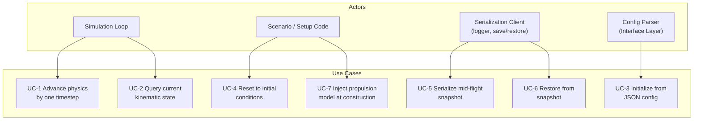
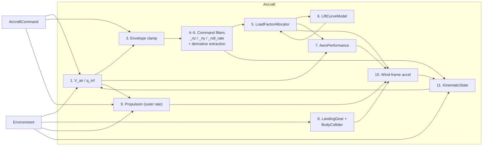
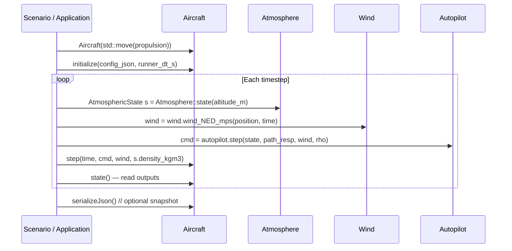

# Aircraft Class — Architecture and Interface Design

This document is the design authority for the `Aircraft` class. It covers the ownership
model, command processing architecture, the physics update loop, serialization, JSON
initialization, and the integration contracts with every owned subsystem.

---

## Use Case Decomposition



| ID | Use Case | Primary Actor | Mechanism |
| --- | --- | --- | --- |
| UC-1 | Advance physics by one timestep | Simulation loop | `Aircraft::step()` |
| UC-2 | Query current kinematic state | Simulation loop, guidance | `Aircraft::state()` |
| UC-3 | Initialize from JSON config | Config parser / scenario | `Aircraft::initialize(config, runner_dt_s)` |
| UC-4 | Reset to initial conditions | Scenario, test harness | `Aircraft::reset()` |
| UC-5 | Serialize mid-flight snapshot | Logger, pause/resume | `serializeJson()` / `serializeProto()` |
| UC-6 | Restore from snapshot | Pause/resume, replay | `deserializeJson()` / `deserializeProto()` |
| UC-7 | Inject propulsion model | Scenario, test | `Aircraft(std::move(propulsion))` constructor |

---

## Use Case Narratives

### UC-1 — Advance Physics by One Timestep

**Trigger:** The simulation loop calls `Aircraft::step()` once per runner output step
(`runner_dt_s`).

**Preconditions:** `initialize()` has been called. All inputs are in SI units. Air density
and wind vector have been computed from `Atmosphere` and `Wind` for the current position
before this call.

**Main flow:**

1. Compute true airspeed from `KinematicState::velocity_NED_mps()` and the supplied
   `wind_NED_mps`. Dynamic pressure follows from `rho_kgm3` and airspeed.
2. Read `T_prev` from the previous propulsion step (or 0 at `t=0`).
3. Clamp raw commanded load factors to airframe structural limits.
4. Run the command filter loop `cmd_filter_substeps` times, advancing `_nz_filter`,
   `_ny_filter`, and `_roll_rate_filter` at `cmd_filter_dt_s`. After the loop, read shaped
   commands and compute derivatives analytically from filter state.
5. Solve for angle of attack (`α`) and sideslip (`β`) using `LoadFactorAllocator::solve()`.
6. Evaluate `CL = LiftCurveModel::evaluate(α)`.
7. Compute aerodynamic forces in the Wind frame via `AeroPerformance::compute()`.
8. Step landing gear (`LandingGear::step()`) and body collider (`BodyCollider::step()`)
   against terrain, accumulating contact forces in the body frame.
9. Advance propulsion: `thrust_n = Propulsion::step(throttle, V_air, rho)`.
10. Assemble Wind-frame acceleration from thrust, aerodynamic forces, and contact forces
    (transformed body→wind). Gravity is implicit — the allocator generates lift equal to
    `n_z·m·g`, which at equilibrium exactly cancels gravity.
11. Advance position and velocity via `KinematicState::stepPV()` with the computed
    Wind-frame acceleration and aerodynamic angle inputs. This stores `v_prev` internally
    but does not yet update `q_nw` or body rates.
12. Apply terrain hard constraint via `BodyCollider::maxCornerPenetration_m()` and
    `KinematicState::applyTerrainHardConstraint()` if any body-collider corner penetrates
    terrain after integration. The constraint modifies velocity before attitude is committed.
13. Commit attitude via `KinematicState::commitAttitude()` with the shaped roll rate and
    the integration timestep. This updates `q_nw` using the truly final (post-constraint)
    velocity and derives body rates. See [defect_kinematic_attitude_model.md](defect_kinematic_attitude_model.md)
    (D-1) for the rationale.

**Postconditions:** `state()` reflects the aircraft position, velocity, and attitude at
`time_sec + runner_dt_s`. `Propulsion::thrust_n()` reflects the engine thrust at the last
substep. All quantities are sampled at the runner output rate; the intermediate substep
states are not accessible externally.

**Alternate flow — stall:** The allocator finds `α` such that
$q S C_L(\alpha) + T\sin\alpha = n_z\,m\,g$. The achievable load factor
$N_{z,\text{max}}(\alpha) = (q S C_L(\alpha) + T\sin\alpha)\,/\,(mg)$ has a peak at the `α`
where its derivative with respect to `α` crosses zero — post-stall $C_L$ falloff reduces the
aerodynamic contribution while $T\sin\alpha$ continues to rise, and beyond the peak the total
starts to decrease. Continuing past that point would produce a discontinuous jump in the
solution. The allocator therefore clamps `α` at the derivative zero-crossing rather than at
$\alpha_{C_{L,\text{max}}}$. For zero or negative thrust the zero-crossing coincides with
$\alpha_{C_{L,\text{max}}}$; for positive thrust it occurs at a higher `α`. No exception is
thrown.

---

### UC-3 — Initialize from JSON Config

**Trigger:** Application or test code calls `Aircraft::initialize(config, runner_dt_s)` after
constructing the `Aircraft` with a propulsion model.

**Preconditions:** The JSON has been validated against `aircraft_config_v1`. The
`Aircraft` has been constructed with a non-null propulsion model.

**Main flow:**

1. Store `runner_dt_s` (the SimRunner output step; Aircraft does not own the runner, only
   stores a copy to compute its own integration timestep).
2. Read `aircraft.max_integration_dt_s` (double, seconds). Compute the physics integration
   substep count: `integration_substeps = ceil(runner_dt_s / max_integration_dt_s)`.
   Compute `integration_dt_s = runner_dt_s / integration_substeps`. This value satisfies
   `integration_dt_s ≤ max_integration_dt_s` and `integration_substeps * integration_dt_s = runner_dt_s`
   exactly.
3. Read `inertia.*` and construct `Inertia`; read `airframe.*` and construct
   `AirframePerformance`.
4. Read `aircraft.S_ref_m2`, `aircraft.cl_y_beta`.
5. Construct `LiftCurveModel` from `lift_curve.*` parameters.
6. Construct `LoadFactorAllocator` from the lift curve, `S_ref_m2`, and `cl_y_beta`.
7. Construct `AeroPerformance` from `aircraft.S_ref_m2`, `aircraft.cl_y_beta`,
   `aircraft.ar`, `aircraft.e`, `aircraft.cd0`.
8. Construct the initial `KinematicState` from `initial_state.*`; save a copy as
   `_initial_state` for `reset()`.
9. Read `aircraft.max_cmd_filter_dt_s` (double, seconds). Compute
   `cmd_filter_substeps = ceil(integration_dt_s / max_cmd_filter_dt_s)`.
   Compute `cmd_filter_dt_s = integration_dt_s / cmd_filter_substeps`.
10. Validate filter natural frequencies against `cmd_filter_dt_s` (see §Command Processing
    Architecture). Throw `std::invalid_argument` on any violation.
11. Configure and warm-start `_nz_filter` (`setLowPassSecondIIR`), `_ny_filter`
    (`setLowPassSecondIIR`), and `_roll_rate_filter` (`setLowPassSecondIIR`).

**Postconditions:** `state()` returns the initial kinematic state. All filters are warm-started
at their steady-state values. The allocator and lift curve are ready for `step()`.

**Error flow:** If any required field is missing, out of range, or violates a Nyquist
constraint, `initialize()` throws `std::invalid_argument`.

---

### UC-5 — Serialize Mid-Flight Snapshot

**Trigger:** Logger or pause/resume manager calls `serializeJson()` or `serializeProto()`.

**Main flow:** Serialize each stateful subcomponent in turn:

| Component | Method called | What is captured |
| --- | --- | --- |
| `KinematicState` | `serializeJson()` | Full state — position, velocity, attitude |
| `LoadFactorAllocator` | `serializeJson()` | Config + warm-start α, β |
| `Propulsion` | `serializeJson()` | Config + filter state, thrust |
| `LiftCurveModel` | `serializeJson()` | Config params (stateless) |
| `AeroPerformance` | `serializeJson()` | Config params (stateless) |
| `AirframePerformance` | `serializeJson()` | Config params (stateless) |
| `Inertia` | `serializeJson()` | Config params (stateless) |
| `_initial_state` | `_initial_state.serializeJson()` | Initial conditions for `reset()` |
| `_nz_filter` | `_nz_filter.serializeJson()` | 2nd order LP state + config matrices |
| `_ny_filter` | `_ny_filter.serializeJson()` | 2nd order LP state + config matrices |
| `_roll_rate_filter` | `_roll_rate_filter.serializeJson()` | 2nd order LP state + config matrices |
| `_nz_moment_filt` | state vector x (two floats) | 2nd order HP filter state for pitch-moment → n_z perturbation |
| `_ay_moment_filt` | state vector x (two floats) | 2nd order HP filter state for yaw-moment → Δay perturbation |
| `_roll_rate_moment_filt` | state vector x (two floats) | 2nd order HP filter state for roll-moment → Δroll-rate perturbation |
| `_n_contact_z_filt` | scalar float | n_z suppression filter output (0–1); see `landing_gear.md` §Integration Contract §2 |
| `_wow0_elapsed_s` | scalar float | Elapsed seconds since WoW last went to zero; holds suppression during brief bounce episodes |
| `LandingGear` | `landing_gear.serializeJson()` | Per-wheel strut deflection + wheel speed (when landing gear is present) |

**Postconditions:** The returned JSON or byte vector is sufficient to restore the
aircraft to the exact mid-flight state via `deserializeJson()` / `deserializeProto()`.

---

## Command Processing Architecture

The three commanded axes — normal load factor (Nz), lateral load factor (Ny), and wind-frame
roll rate — are passed through `FilterSS2Clip` command response filters before reaching the
physics integrator. These filters model the finite closed-loop bandwidth of the aircraft's
FBW inner loops: a step command produces a shaped transient rather than an instantaneous jump.

### Filter Types

| Axis | Filter | Parameters |
| --- | --- | --- |
| Nz command response | `_nz_filter.setLowPassSecondIIR(cmd_filter_dt_s, nz_wn_rad_s, nz_zeta_nd, 0.f)` | natural frequency and damping ratio |
| Ny command response | `_ny_filter.setLowPassSecondIIR(cmd_filter_dt_s, ny_wn_rad_s, ny_zeta_nd, 0.f)` | natural frequency and damping ratio |
| Roll rate command response | `_roll_rate_filter.setLowPassSecondIIR(cmd_filter_dt_s, roll_rate_wn_rad_s, roll_rate_zeta_nd, 0.f)` | natural frequency and damping ratio |

The `tau_zero = 0` argument to `setLowPassSecondIIR` gives a pure 2nd order low-pass (no
numerator zero). All three filters share the same transfer function form:

$$
H_\text{nz}(s) = \frac{\omega_{n,\text{nz}}^2}{s^2 + 2\,\zeta_\text{nz}\,\omega_{n,\text{nz}}\,s + \omega_{n,\text{nz}}^2}
$$

and identically for Ny and roll rate with their own $\omega_n$ and $\zeta$ parameters.

### Timestep Hierarchy

There are three nested timestep levels, each derived by the same rule: choose the largest
sub-multiple of the enclosing step that does not exceed the configured maximum.

```text
runner_dt_s              — SimRunner output step (e.g. 0.02 s, 50 Hz)
                           Supplied by the caller to initialize(). Not in Aircraft JSON.

max_integration_dt_s     — aircraft config: maximum allowed physics integration timestep
integration_substeps     = ceil(runner_dt_s / max_integration_dt_s)   [integer ≥ 1]
integration_dt_s         = runner_dt_s / integration_substeps
                           Governs KinematicState trajectory integration accuracy.
                           Exact sub-fraction of runner_dt_s — no accumulation error.

max_cmd_filter_dt_s      — aircraft config: maximum allowed command filter timestep
cmd_filter_substeps      = ceil(integration_dt_s / max_cmd_filter_dt_s)   [integer ≥ 1]
cmd_filter_dt_s          = integration_dt_s / cmd_filter_substeps
                           Governs FBW command response filter Nyquist margin.
                           Exact sub-fraction of integration_dt_s.
```

Both `max_integration_dt_s` and `max_cmd_filter_dt_s` are configuration fields in the
`"aircraft"` JSON section. Using a maximum-timestep config parameter (rather than a fixed
integer substep count) ensures that:

- A long `integration_dt_s` automatically requests more command filter substeps to maintain
  Nyquist separation from filter dynamics.
- A short `integration_dt_s` does not wastefully over-step the command filters beyond what
  the dynamics require.
- The substep count is always a computed integer, so the update loop remains exact.

### Integration Substep Loop

Per `Aircraft::step()` call, the outer physics loop executes `integration_substeps`
iterations at `integration_dt_s`.

### Command Filter Substep Loop

The command response filters run at an integer multiple of the physics integration rate.
Per physics integration substep, the command filter loop executes `cmd_filter_substeps`
iterations:

```text
for i in [0, cmd_filter_substeps):
    n_z_shaped        = _nz_filter.step(n_z_cmd)
    n_y_shaped        = _ny_filter.step(n_y_cmd)
    roll_rate_shaped  = _roll_rate_filter.step(cmd.rollRate_Wind_rps)
```

The same clamped raw command values are fed on every inner substep. Propulsion runs once
at the outer rate, after the inner loop completes. KinematicState integration also runs
once at the outer rate.

### Derivative Sourcing

`LoadFactorAllocator::solve()` requires `n_z_dot` and `n_y_dot` — the time derivatives of
the shaped load factor commands — as feed-forward terms for computing `alphaDot` and
`betaDot`. These are extracted analytically from the `FilterSS2Clip` state vector after the
inner substep loop completes, without introducing a separate derivative filter or finite-
differencing delay.

`FilterSS2Clip::setLowPassSecondIIR` with `tau_zero = 0` uses the Tustin-discretized
controllable companion form. The `tf2ss` realization gives:

$$
\Phi = \begin{bmatrix} 0 & 1 \\ -a_2 & -a_1 \end{bmatrix}, \quad
\Gamma = \begin{bmatrix} 0 \\ 1 \end{bmatrix}, \quad
H = \begin{bmatrix} b_2 & b_1 \end{bmatrix}, \quad J = b_0
$$

where $a_i$, $b_i$ are the Tustin-prewarped discrete polynomial coefficients with $a_0 = 1$.
The filter output is $y[k] = H \cdot x[k] + J \cdot u[k]$, so the discrete approximation
of the output derivative is:

$$
\dot{y}[k] \approx \frac{H \cdot \bigl(\Phi\,x[k] + \Gamma\,u[k]\bigr) - y[k]}{dt_\text{inner}}
$$

This expression uses only quantities already available at the end of the substep loop (x, u,
and the current output) and adds no new filter lag.

### Nyquist Protection

`initialize()` enforces the following constraints and throws `std::invalid_argument` on any
violation:

| Constraint | Meaning |
| --- | --- |
| `max_integration_dt_s > 0` | Physics integration maximum timestep is positive |
| `max_cmd_filter_dt_s > 0` | Command filter maximum timestep is positive |
| `nz_wn_rad_s * cmd_filter_dt_s < π` | Nz natural frequency below command filter Nyquist |
| `ny_wn_rad_s * cmd_filter_dt_s < π` | Ny natural frequency below command filter Nyquist |
| `roll_rate_wn_rad_s * cmd_filter_dt_s < π` | Roll rate natural frequency below command filter Nyquist |

All Nyquist constraints bind on `cmd_filter_dt_s`, the finest timestep, which is derived
from `max_cmd_filter_dt_s`. Configuring `max_cmd_filter_dt_s` to be the reciprocal of a
target minimum sample frequency (e.g., `1 / (10 * wn_max)` for 10× Nyquist margin)
ensures the constraint is satisfied for any valid `integration_dt_s`.

The first two constraints (positive maximums) ensure `integration_substeps ≥ 1` and
`cmd_filter_substeps ≥ 1` by construction.

### Warm-Start and Reset

On `initialize()`, each filter is warm-started to its steady-state value for the given
initial command: `_nz_filter.resetToInput(1.f)` (level flight), `_ny_filter.resetToInput(0.f)`,
`_roll_rate_filter.resetToInput(0.f)`.

On `reset()`, all three filters are warm-started to the same steady-state values.

---

## Class Hierarchy

```mermaid
classDiagram
    class Aircraft {
        -_state : KinematicState
        -_initial_state : KinematicState
        -_liftCurve : optional~LiftCurveModel~
        -_allocator : optional~LoadFactorAllocator~
        -_aeroPerf : optional~AeroPerformance~
        -_airframe : AirframePerformance
        -_inertia : Inertia
        -_propulsion : unique_ptr~Propulsion~
        -_nz_filter : FilterSS2Clip
        -_ny_filter : FilterSS2Clip
        -_roll_rate_filter : FilterSS2Clip
        -_runner_dt_s : double
        -_integration_substeps : int
        -_integration_dt_s : double
        -_cmd_filter_substeps : int
        -_cmd_filter_dt_s : double
        +Aircraft(propulsion)
        +initialize(config, runner_dt_s) void
        +reset() void
        +step(time_sec, cmd, wind_NED_mps, rho_kgm3) void
        +state() const KinematicState&
        +serializeJson() json
        +deserializeJson(j) void
        +serializeProto() bytes
        +deserializeProto(bytes) void
    }

    class KinematicState {
        +step(time_sec, accel_Wind, rollRate, alpha, beta, alphaDot, betaDot, wind_NED) void
        +stepPV(time_sec, accel_Wind, alpha, beta, alphaDot, betaDot, wind_NED) void
        +commitAttitude(rollRate, dt_s) void
        +applyTerrainHardConstraint(penetration_m) void
        +velocity_NED_mps() Vector3f
        +serializeJson() json
        +deserializeJson(j) void
        +serializeProto() bytes
        +deserializeProto(bytes) void
    }

    class LiftCurveModel {
        +evaluate(alpha_rad) float
        +derivative(alpha_rad) float
        +alphaPeak() float
        +alphaTrough() float
        +alphaSep() float
        +alphaSepNeg() float
    }

    class LoadFactorAllocator {
        +solve(in) LoadFactorOutputs
        +reset(alpha0, beta0) void
        +serializeJson() json
        +deserializeJson(j) void
        +serializeProto() bytes
        +deserializeProto(bytes) void
    }

    class AeroPerformance {
        +compute(alpha, beta, q_inf, cl) AeroForces
    }

    class Propulsion {
        <<abstract>>
        +step(throttle_nd, tas_mps, rho_kgm3) float
        +thrust_n() float
        +reset() void
        +serializeJson() json
        +deserializeJson(j) void
        +serializeProto() bytes
        +deserializeProto(bytes) void
    }

    class AirframePerformance {
        +g_max_nd : float
        +g_min_nd : float
        +tas_max_mps : float
        +mach_max_nd : float
        +alpha_max_rad : float
        +alpha_min_rad : float
        +serializeJson() json
        +deserializeJson(j) void
        +serializeProto() bytes
        +deserializeProto(bytes) void
    }

    class Inertia {
        +mass_kg : float
        +Ixx_kgm2 : float
        +Iyy_kgm2 : float
        +Izz_kgm2 : float
        +serializeJson() json
        +deserializeJson(j) void
        +serializeProto() bytes
        +deserializeProto(bytes) void
    }

    class AircraftCommand {
        +n_z : float
        +n_y : float
        +rollRate_Wind_rps : float
        +throttle_nd : float
    }

    class FilterSS2Clip {
        +setLowPassSecondIIR(dt_s, wn, zeta, tau_zero) void
        +setLowPassFirstIIR(dt_s, tau) void
        +step(u) float
        +x() Mat21
        +phi() Mat22
        +gamma() Mat21
        +h() Mat12
        +j() Mat11
        +resetToInput(val) void
        +resetState(x) void
        +serializeJson() json
        +deserializeJson(j) void
    }

    Aircraft *-- KinematicState : owns (value)
    Aircraft *-- LiftCurveModel : owns (value)
    Aircraft *-- LoadFactorAllocator : owns (value)
    Aircraft *-- AeroPerformance : owns (value)
    Aircraft *-- AirframePerformance : owns (value)
    Aircraft *-- Inertia : owns (value)
    Aircraft o-- Propulsion : owns (unique_ptr)
    Aircraft *-- FilterSS2Clip : owns 3 (value)
    Aircraft ..> AircraftCommand : uses
```



---

## Interface

### Constructor

```cpp
namespace liteaerosim {

explicit Aircraft(std::unique_ptr<propulsion::Propulsion> propulsion);
```

Propulsion is injected at construction time so that the concrete engine type
(`PropulsionJet`, `PropulsionEDF`, `PropulsionProp`) can be varied without touching
`Aircraft`. The object is **not yet usable** after construction; either `initialize()`
(first-time setup from a config JSON) or `deserializeJson()` / `deserializeProto()`
(reconstitution from a snapshot) must be called before `step()`.

---

### Lifecycle Methods

```cpp
void initialize(const nlohmann::json& config, double runner_dt_s);
```

`runner_dt_s` is the SimRunner output step in seconds — the interval at which the runner
calls `Aircraft::step()`. `Aircraft` uses it to compute the physics integration substep count
N = ⌈runner_dt_s / max_integration_dt_s⌉ and the resulting `integration_dt_s = runner_dt_s / N`,
from which `cmd_filter_dt_s` is derived. `runner_dt_s` is not stored in the aircraft config
JSON; it is supplied by the runner at initialization time.

Reads `aircraft_config_v1` JSON and constructs all owned subsystems in dependency order:
inertia and airframe first, then lift curve, then aero performance and load factor allocator
(which reference the lift curve), then the initial `KinematicState`, then the command response
filters. Throws `std::invalid_argument` if any required field is missing, invalid, or violates
a Nyquist constraint.

```cpp
void reset();
```

Resets `KinematicState` to the initial conditions recorded at `initialize()` time, calls
`LoadFactorAllocator::reset()`, calls `Propulsion::reset()`, and warm-starts all three command
response filters to their steady-state values. After `reset()`, the aircraft is in the same
state as immediately after `initialize()`.

---

### Inputs to `step()`

```cpp
struct AircraftCommand {
    float n_z               = 1.f;  // commanded normal load factor (g)
    float n_y               = 0.f;  // commanded lateral load factor (g)
    float rollRate_Wind_rps = 0.f;  // commanded wind-frame roll rate (rad/s)
    float throttle_nd       = 0.f;  // normalized throttle [0, 1]
};
```

| Field | SI unit | Description |
| --- | --- | --- |
| `n_z` | g | Normal load factor command; 1.0 = level flight at 1 g |
| `n_y` | g | Lateral load factor command; 0 = coordinated flight |
| `rollRate_Wind_rps` | rad/s | Wind-frame roll rate command |
| `throttle_nd` | — | Normalized throttle demand [0, 1] |

`n_z` and `n_y` are the raw pilot or autopilot commands. They are clamped to structural limits
and then shaped by `_nz_filter` / `_ny_filter` before reaching the load factor allocator.
Shaped derivatives are not on the command interface — they are computed internally from filter
state (see §Command Processing Architecture).

---

### `step()` Signature

```cpp
void step(double time_sec,
          const AircraftCommand& cmd,
          const Eigen::Vector3f& wind_NED_mps,
          float rho_kgm3);
```

| Parameter | SI unit | Description |
| --- | --- | --- |
| `time_sec` | s | Absolute simulation time at this step |
| `cmd` | mixed | Commanded inputs (see `AircraftCommand` table above) |
| `wind_NED_mps` | m/s | Ambient wind vector in NED frame — supplied by `Wind` model |
| `rho_kgm3` | kg/m³ | Local air density — supplied by `Atmosphere::state()` |

`step()` has no return value. All outputs are read through `state()` and
`Propulsion::thrust_n()` after the call.

---

### `state()` and Output Query

```cpp
const KinematicState& state() const;
```

Returns a const reference to the internal `KinematicState`. Callers should not hold this
reference across a `step()` call if they need a snapshot; copy the object instead.

Derived quantities available from `KinematicState` after `step()`:

| Quantity | Method | Unit |
| --- | --- | --- |
| Position (WGS84) | `state().positionDatum()` | rad / m |
| Velocity (NED) | `state().velocity_NED_mps()` | m/s |
| Euler angles | `state().eulers()` | rad |
| Angle of attack | `state().alpha()` | rad |
| Sideslip | `state().beta()` | rad |
| Body angular rates | `state().rates_Body_rps()` | rad/s |
| Wind-frame roll rate | `state().rollRate_Wind_rps()` | rad/s |

---

### Serialization

```cpp
[[nodiscard]] nlohmann::json       serializeJson()                              const;
void                               deserializeJson(const nlohmann::json&        j);
[[nodiscard]] std::vector<uint8_t> serializeProto()                            const;
void                               deserializeProto(const std::vector<uint8_t>& bytes);
```

#### JSON Snapshot Schema

The snapshot is **self-contained** — `deserializeJson()` fully reconstitutes a working
`Aircraft` without requiring a prior `initialize()` call. Every owned component serializes
its full configuration and internal state.

```json
{
    "schema_version":      1,
    "type":                "Aircraft",
    "kinematic_state":     { ... },
    "initial_state":       { ... },
    "allocator":           { ... },
    "lift_curve":          { ... },
    "aero_performance":    { ... },
    "airframe":            { ... },
    "inertia":             { ... },
    "propulsion":          { ... },
    "cmd_filter_substeps": 1,
    "cmd_filter_dt_s":     0.02,
    "nz_wn_rad_s":         15.0,
    "nz_zeta_nd":          0.7,
    "ny_wn_rad_s":         12.0,
    "ny_zeta_nd":          0.7,
    "roll_rate_wn_rad_s":  10.0,
    "roll_rate_zeta_nd":   0.7,
    "nz_filter":           { ... },
    "ny_filter":           { ... },
    "roll_rate_filter":    { ... }
}
```

| Field | Source | Notes |
| --- | --- | --- |
| `"schema_version"` | constant 1 | Verified on deserialize; mismatch throws |
| `"type"` | constant `"Aircraft"` | Verified on deserialize; mismatch throws |
| `"kinematic_state"` | `_state.serializeJson()` | Full kinematic state at snapshot time |
| `"initial_state"` | `_initial_state.serializeJson()` | Initial conditions for `reset()` |
| `"allocator"` | `_allocator->serializeJson()` | Config + warm-start α, β |
| `"lift_curve"` | `_liftCurve->serializeJson()` | Lift curve config params |
| `"aero_performance"` | `_aeroPerf->serializeJson()` | Aero config params |
| `"airframe"` | `_airframe.serializeJson()` | Structural envelope limits |
| `"inertia"` | `_inertia.serializeJson()` | Mass properties |
| `"propulsion"` | `_propulsion->serializeJson()` | Engine type, config, and filter state |
| `"cmd_filter_substeps"` | `_cmd_filter_substeps` | Integer inner step count |
| `"cmd_filter_dt_s"` | `_cmd_filter_dt_s` | Inner timestep (s) |
| `"nz_wn_rad_s"` | config param | Nz natural frequency (rad/s) |
| `"nz_zeta_nd"` | config param | Nz damping ratio |
| `"ny_wn_rad_s"` | config param | Ny natural frequency (rad/s) |
| `"ny_zeta_nd"` | config param | Ny damping ratio |
| `"roll_rate_wn_rad_s"` | config param | Roll rate natural frequency (rad/s) |
| `"roll_rate_zeta_nd"` | config param | Roll rate damping ratio |
| `"nz_filter"` | `_nz_filter.serializeJson()` | Full state-space matrices + state vector |
| `"ny_filter"` | `_ny_filter.serializeJson()` | Full state-space matrices + state vector |
| `"roll_rate_filter"` | `_roll_rate_filter.serializeJson()` | Full state-space matrices + state vector |

#### Deserialize Contract

- If `"schema_version"` ≠ 1 or `"type"` ≠ `"Aircraft"`, throws `std::runtime_error`.
- `"propulsion"."type"` must match the concrete `Propulsion` subclass injected at
  construction.
- `deserializeJson()` does **not** require a prior `initialize()` call. However, the correct
  `Propulsion` concrete subclass **must** have been injected at construction before calling
  `deserializeJson()`.
- After `deserializeJson()`, the next `step()` call must produce the same output as if the
  simulation had never been interrupted.

---

## Physics Integration Loop

### Step Execution Order

```text
1. V_air  = (state().velocity_NED_mps() - wind_NED_mps).norm()
   q_inf  = 0.5 * rho_kgm3 * V_air²

2. T_prev = _propulsion->thrust_n()        // from previous step (or 0 at t=0)

3. Clamp commanded load factors to airframe structural limits:
       n_z_cmd = clamp(cmd.n_z, _airframe.g_min_nd, _airframe.g_max_nd)
       n_y_cmd = clamp(cmd.n_y, _airframe.g_min_nd, _airframe.g_max_nd)

4. Inner filter loop — runs cmd_filter_substeps times at cmd_filter_dt_s:
       for i in [0, cmd_filter_substeps):
           n_z_shaped        = _nz_filter.step(n_z_cmd)
           n_y_shaped        = _ny_filter.step(n_y_cmd)
           roll_rate_shaped  = _roll_rate_filter.step(cmd.rollRate_Wind_rps)

5. Compute shaped-command derivatives from filter state (see §Derivative Sourcing):
       n_z_dot = derived analytically from _nz_filter.x(), .phi(), .gamma(), .h(), .j()
       n_y_dot = derived analytically from _ny_filter.x(), .phi(), .gamma(), .h(), .j()

6. LoadFactorInputs lf_in {
       .n_z      = n_z_shaped,
       .n_y      = n_y_shaped,
       .q_inf    = q_inf,
       .thrust_n = T_prev,
       .mass_kg  = _inertia.mass_kg,
       .n_z_dot  = n_z_dot,
       .n_y_dot  = n_y_dot
   }
   // alpha_min_rad / alpha_max_rad enforced as box constraint inside solve():
   LoadFactorOutputs lf = _allocator->solve(lf_in)

7. float CL = lf.cl_eff   // effective CL from the allocator: nominal in attached flow,
   //                        rate-limited during stall recovery (see §Stall Recovery)

8. AeroForces F = _aeroPerf->compute(lf.alpha_rad, lf.beta_rad, q_inf, CL)
   // F.x_n < 0 (drag),  F.y_n (side force),  F.z_n < 0 (lift upward)

8b. ContactForces G = _landingGear->step(...)  // body frame; also _bodyCollider->step()

9. float T  = _propulsion->step(cmd.throttle_nd, V_air, rho_kgm3)   // outer rate

10. float cα = cosf(lf.alpha_rad),  sα = sinf(lf.alpha_rad)
    float cβ = cosf(lf.beta_rad),   sβ = sinf(lf.beta_rad)
    // Contact forces rotated from body frame to Wind frame via R_nw^T * R_nb
    Eigen::Vector3f a_Wind {
        (T * cα * cβ  + F.x_n + G_wind.x()) / _inertia.mass_kg,
        (-T * cα * sβ + F.y_n + G_wind.y()) / _inertia.mass_kg,
        (-T * sα      + F.z_n + G_wind.z()) / _inertia.mass_kg
    }

11. _state.stepPV(time_sec, a_Wind,
                  lf.alpha_rad, lf.beta_rad,
                  lf.alphaDot_rps, lf.betaDot_rps,
                  wind_NED_mps)
    // Integrates position and velocity via RK4; captures v_prev internally.
    // Does NOT update q_nw or body rates yet.

12. if (_bodyCollider->maxCornerPenetration_m() > 0)
        _state.applyTerrainHardConstraint(_bodyCollider->maxCornerPenetration_m())
    // Terrain constraint applied here — after position/velocity integration but
    // before attitude update — so q_nw always sees the truly final velocity.

13. _state.commitAttitude(roll_rate_shaped, dt_s)
    // Updates q_nw and derives body rates from the final (constrained) velocity.
```

> **Why the split?** Calling `stepQnw` (the q_nw update) on the pre-constraint velocity
> and then modifying velocity via `applyTerrainHardConstraint` breaks the invariant
> `q_nw.x = velocity_NED_mps.normalized()`. The split `stepPV` → terrain constraint →
> `commitAttitude` sequence ensures `q_nw` is always computed from the final velocity.
> See [defect_kinematic_attitude_model.md](defect_kinematic_attitude_model.md) (D-1) for
> the full defect analysis and [equations_of_motion.md](../algorithms/equations_of_motion.md)
> §Integration Scheme Summary — Trim Aero for the corrected algorithm.

### Stall Recovery (CL Rate Limiting)

`LoadFactorAllocator` distinguishes the *nominal* lift coefficient (the steady lift-curve value
at the solved α) from the *effective* CL it actually reports (`cl_eff`), to model separated-flow
hysteresis around stall:

- **Attached flow (normal flight).** `cl_eff = cl_nominal(α)` directly — **no rate limit**. The
  longitudinal response is shaped by the FBW `n_z` command filter (§Command Processing
  Architecture), not by the allocator. A trimmed vehicle initialized in attached flight therefore
  produces full lift on the very first step (no startup transient).
- **Stall.** While the stall hysteresis flag is set, `cl_eff` is held at the separated-flow
  plateau (`cl_sep` / `cl_sep_neg`).
- **Recovery.** When a stall clears, reattachment is not instantaneous: `cl_eff` is rate-limited
  upward toward nominal at `cl_α · alpha_dot_max` per second until it catches the nominal curve,
  then the recovery flag clears and attached-flow tracking resumes. Recovery is **armed by an
  actual stall** (captured at step entry, so the clearing step itself begins recovery) and applies
  **only** during recovery — never in attached flight. (An earlier implementation rate-limited the
  upward CL return in all non-stalled flight, which both manufactured a zero-lift cold-start
  transient and asymmetrically lagged CL under normal maneuvering — a defect, now corrected.)

`alpha_dot_max` is **non-dimensionalized**: the config supplies `alpha_dot_max_ratio` and the
realized rate is `alpha_dot_max_ratio · g/V_stall`, so the reattachment rate scales per airframe
(a light UAS reattaches faster than a heavy jet — see the
[schema](../schemas/aircraft_config_v1.md#load_factor_allocator-section)). The recovery flags
(`recovering`, `recovering_neg`) and effective-CL state (`cl_recovering`, `cl_recovering_neg`) are
warm-start state (serialized JSON + proto).

> **Note — step-order coverage.** The step list above predates the landing-gear force-&-moment
> integration (rotation-deviation Δθ, the n_z apportionment-relaxation and axial settle terms) and
> the OQ-LG-21 velocity-referenced attitude commit. Those are the authoritative subject of
> [landing_gear.md §Integration Contract](landing_gear.md) and are not yet reflected in this
> abbreviated order; steps 6–13 here show the no-gear flight path. Reconciling this step list with
> the gear-coupled `step()` is tracked design-documentation debt.

### Wind-Frame Force Decomposition

Thrust acts along the body x-axis (positive forward). Decomposed into Wind-frame
components:

$$
\begin{aligned}
a_x^W &= \frac{T \cos\alpha \cos\beta + F_x}{m} \\
a_y^W &= \frac{-T \cos\alpha \sin\beta + F_y}{m} \\
a_z^W &= \frac{-T \sin\alpha + F_z}{m}
\end{aligned}
$$

where $F_x < 0$ (drag), $F_z < 0$ (lift directed negative-down, i.e., upward).

**Gravity accounting:** The `LoadFactorAllocator` solves the constraint

$$
q\,S\,C_L + T\sin\alpha = n_z\,m\,g
$$

The gravitational term $n_z\,m\,g$ is entirely consumed within that constraint. The
Wind-frame acceleration computed in step 10 is the **kinematic** (non-gravitational)
acceleration; `KinematicState::step()` integrates it directly without adding $g$ again.

### Data Flow Diagram



---

## Ownership and Memory Model

| Member | Type | Lifetime | Notes |
| --- | --- | --- | --- |
| `_state` | `KinematicState` | Value member | Fully owned; no sharing |
| `_initial_state` | `KinematicState` | Value member | Saved by `initialize()` for `reset()` |
| `_liftCurve` | `std::optional<LiftCurveModel>` | Inline optional | Emplaced by `initialize()` / `deserializeJson()`; stateless after construction |
| `_allocator` | `std::optional<LoadFactorAllocator>` | Inline optional | Holds `const&` to `_liftCurve` — `Aircraft` is non-movable |
| `_aeroPerf` | `std::optional<AeroPerformance>` | Inline optional | Emplaced by `initialize()` / `deserializeJson()`; stateless |
| `_airframe` | `AirframePerformance` | Value member | Envelope limits |
| `_inertia` | `Inertia` | Value member | Mass properties |
| `_propulsion` | `std::unique_ptr<Propulsion>` | Heap-allocated, owned | Injected at construction; non-null invariant |
| `_nz_filter` | `control::FilterSS2Clip` | Value member | Nz command response (2nd order LP) |
| `_ny_filter` | `control::FilterSS2Clip` | Value member | Ny command response (2nd order LP) |
| `_roll_rate_filter` | `control::FilterSS2Clip` | Value member | Roll rate command response (2nd order LP) |
| `_nz_moment_filt` | `control::FilterSS2Clip` | Value member | Pitch-moment → n_z perturbation (2nd order HP); see IP-AGF-5 |
| `_ay_moment_filt` | `control::FilterSS2Clip` | Value member | Yaw-moment → Δay perturbation (2nd order HP); see IP-AGF-5 |
| `_roll_rate_moment_filt` | `control::FilterSS2Clip` | Value member | Roll-moment → Δroll-rate perturbation (2nd order HP); see IP-AGF-5 |
| `_landing_gear` | `LandingGear` | Value member | Present always; active only when `_has_landing_gear` |
| `_body_collider` | `BodyCollider` | Value member | Present always; active only when `_has_body_collider` |
| `_contact_forces` | `ContactForces` | Value member | Combined gear + collider forces from last step |
| `_terrain` | `const terrain::Terrain*` | Non-owning pointer | Set via `setTerrain()`; null = no ground contact |
| `_n_contact_z_filt` | `float` | Value member | n_z suppression filter output (0–1) |
| `_contact_nz_filter_tau_s` | `float` | Value member | Engage time constant τ_engage (s); from config `contact_nz_filter_tau_s` |
| `_wow0_elapsed_s` | `float` | Value member | Elapsed seconds since WoW last went to zero; implements hold-time suppression |
| `_body_in_hard_contact` | `bool` | Value member | Set true by step-12 hard constraint; drives LP path of the suppression filter |
| `_outer_dt_s` | `float` | Value member | Integration timestep from SimRunner (stored at initialize()) |
| `_cmd_filter_substeps` | `int` | Value member | Command filter substeps per outer step |
| `_cmd_filter_dt_s` | `float` | Value member | `_outer_dt_s / _cmd_filter_substeps` |
| `_nz_wn_rad_s` … `_roll_rate_zeta_nd` | `float` × 6 | Value members | Per-axis FBW filter natural frequencies and damping ratios |

**Invariant:** `_propulsion` must never be null after construction. If the caller passes
`nullptr`, the constructor throws `std::invalid_argument`.

**Copy and move:** `Aircraft` is **non-copyable and non-movable**. Both copy and move are
deleted because `_allocator` (inside its `std::optional`) holds a `const LiftCurveModel&`
pointing to `_liftCurve`'s inline storage. Moving `Aircraft` would relocate `_liftCurve`
and leave the reference dangling.

---

## Initialization — JSON Config Mapping

The `aircraft_config_v1` schema maps to `Aircraft` members as follows. The runner output
step (`runner_dt_s`) is **not** in the JSON — it is passed as a separate parameter to
`initialize()`.

| JSON path | C++ type | Aircraft member / usage |
| --- | --- | --- |
| `inertia.mass_kg` | `float` | `_inertia.mass_kg` |
| `inertia.Ixx_kgm2` | `float` | `_inertia.Ixx_kgm2` |
| `inertia.Iyy_kgm2` | `float` | `_inertia.Iyy_kgm2` |
| `inertia.Izz_kgm2` | `float` | `_inertia.Izz_kgm2` |
| `airframe.g_max_nd` | `float` | `_airframe.g_max_nd` |
| `airframe.g_min_nd` | `float` | `_airframe.g_min_nd` |
| `airframe.tas_max_mps` | `float` | `_airframe.tas_max_mps` |
| `airframe.mach_max_nd` | `float` | `_airframe.mach_max_nd` |
| `airframe.alpha_max_rad` | `float` | Hard upper alpha limit passed to `LoadFactorAllocator` |
| `airframe.alpha_min_rad` | `float` | Hard lower alpha limit passed to `LoadFactorAllocator` |
| `aircraft.S_ref_m2` | `float` | `AeroPerformance`, `LoadFactorAllocator` |
| `aircraft.cl_y_beta` | `float` | `AeroPerformance`, `LoadFactorAllocator` |
| `aircraft.ar` | `float` | `AeroPerformance` — wing aspect ratio |
| `aircraft.e` | `float` | `AeroPerformance` — Oswald efficiency |
| `aircraft.cd0` | `float` | `AeroPerformance` — zero-lift drag coefficient |
| `aircraft.max_integration_dt_s` | `double` | Maximum allowed physics integration timestep (s); must be > 0 |
| `aircraft.max_cmd_filter_dt_s` | `double` | Maximum allowed command filter timestep (s); must be > 0; set to `1 / (k * wn_max)` for k× Nyquist margin |
| `aircraft.nz_wn_rad_s` | `float` | Nz command response natural frequency (rad/s) |
| `aircraft.nz_zeta_nd` | `float` | Nz command response damping ratio |
| `aircraft.ny_wn_rad_s` | `float` | Ny command response natural frequency (rad/s) |
| `aircraft.ny_zeta_nd` | `float` | Ny command response damping ratio |
| `aircraft.roll_rate_wn_rad_s` | `float` | Roll rate command response natural frequency (rad/s) |
| `aircraft.roll_rate_zeta_nd` | `float` | Roll rate command response damping ratio |
| `lift_curve.cl_alpha` | `float` | `LiftCurveParams::cl_alpha` |
| `lift_curve.cl_max` | `float` | `LiftCurveParams::cl_max` |
| `lift_curve.cl_min` | `float` | `LiftCurveParams::cl_min` |
| `lift_curve.delta_alpha_stall` | `float` | `LiftCurveParams::delta_alpha_stall` |
| `lift_curve.delta_alpha_stall_neg` | `float` | `LiftCurveParams::delta_alpha_stall_neg` |
| `lift_curve.cl_sep` | `float` | `LiftCurveParams::cl_sep` |
| `lift_curve.cl_sep_neg` | `float` | `LiftCurveParams::cl_sep_neg` |
| `initial_state.latitude_rad` | `double` | `WGS84_Datum` → `KinematicState` |
| `initial_state.longitude_rad` | `double` | `WGS84_Datum` → `KinematicState` |
| `initial_state.altitude_m` | `float` | `WGS84_Datum` → `KinematicState` (**WGS84 ellipsoidal height**, m; NOT chart MSL — see live_sim_view.md OQ-LS-12) |
| `initial_state.velocity_north_mps` | `float` | `velocity_NED_mps(0)` |
| `initial_state.velocity_east_mps` | `float` | `velocity_NED_mps(1)` |
| `initial_state.velocity_down_mps` | `float` | `velocity_NED_mps(2)` |
| `initial_state.wind_north_mps` | `float` | `wind_NED_mps(0)` |
| `initial_state.wind_east_mps` | `float` | `wind_NED_mps(1)` |
| `initial_state.wind_down_mps` | `float` | `wind_NED_mps(2)` |

---

## Serialization Design

### Scope

Every simulation element serializes its **full configuration and internal state** sufficient
for exact reconstitution from a frozen snapshot. `Aircraft::deserializeJson()` is
self-contained — a caller must not need to call `initialize()` before or after
`deserializeJson()` to obtain a fully operational `Aircraft`.

### Component Serialization

| Component | Internal state | What is serialized |
| --- | --- | --- |
| `KinematicState` | Yes | Full state — position, velocity, attitude |
| `LoadFactorAllocator` | Yes — `_alpha_prev`, `_beta_prev` | Config + warm-start α, β |
| `Propulsion` | Yes — filter state, `_thrust_n` | Config + engine-specific state |
| `LiftCurveModel` | No | Config params only |
| `AeroPerformance` | No | Config params only |
| `AirframePerformance` | No | Config params only |
| `Inertia` | No | Config params only |
| `_nz_filter` | Yes — state vector x, matrices Φ/Γ/H/J | Full `FilterSS2Clip` snapshot via `serializeJson()` |
| `_ny_filter` | Yes | Full `FilterSS2Clip` snapshot via `serializeJson()` |
| `_roll_rate_filter` | Yes | Full `FilterSS2Clip` snapshot via `serializeJson()` |

### Protobuf Message

Defined in `proto/liteaerosim.proto`:

```proto
message AircraftState {
    int32                     schema_version      = 1;
    KinematicState            kinematic_state     = 2;
    KinematicState            initial_state       = 3;
    LoadFactorAllocatorState  allocator           = 4;
    LiftCurveParams           lift_curve          = 5;
    AeroPerformanceParams     aero_performance    = 6;
    AirframePerformanceParams airframe            = 7;
    InertiaParams             inertia             = 8;
    oneof propulsion {
        PropulsionJetState  jet  = 9;
        PropulsionEdfState  edf  = 10;
        PropulsionPropState prop = 11;
    }
    int32          cmd_filter_substeps  = 12;
    float          cmd_filter_dt_s      = 13;
    float          nz_wn_rad_s          = 14;
    float          nz_zeta_nd           = 15;
    repeated float nz_filter_x          = 16;
    float          ny_wn_rad_s          = 17;
    float          ny_zeta_nd           = 18;
    repeated float ny_filter_x          = 19;
    float          roll_rate_wn_rad_s   = 20;
    float          roll_rate_zeta_nd    = 22;
    repeated float roll_rate_filter_x   = 21;
}
```

Fields 12–21 capture the command processing configuration and filter state vectors.
`deserializeProto()` calls `set*IIR` with the stored parameters (to reconstruct the Φ, Γ,
H, J matrices) and then `resetState(x)` to restore the exact filter state without a
steady-state backsolve.

---

## Interface Contracts

| Precondition | Method | Postcondition |
| --- | --- | --- |
| `propulsion != nullptr` | constructor | Object constructed; `_propulsion` is non-null |
| `propulsion == nullptr` | constructor | throws `std::invalid_argument` |
| `initialize()` not yet called | `step()` | undefined behavior (asserts in debug) |
| Valid `aircraft_config_v1` JSON | `initialize(config, runner_dt_s)` | All subsystems constructed; `state()` = initial state |
| `cmd_filter_substeps < 1` | `initialize()` | throws `std::invalid_argument` |
| `nz_wn_rad_s * cmd_filter_dt_s >= π` | `initialize()` | throws `std::invalid_argument` (Nyquist violation) |
| `ny_wn_rad_s * cmd_filter_dt_s >= π` | `initialize()` | throws `std::invalid_argument` (Nyquist violation) |
| `roll_rate_wn_rad_s * cmd_filter_dt_s >= π` | `initialize()` | throws `std::invalid_argument` (Nyquist violation) |
| Any malformed field | `initialize()` | throws `std::invalid_argument` |
| Any command, any airspeed | `step()` | No throw; load factors clamped to g envelope; α box-constrained to `[alpha_min_rad, alpha_max_rad]` within the Newton solve |
| After `reset()` | `state()` | Returns initial `KinematicState` from `initialize()` |
| Valid self-contained snapshot | `deserializeJson()` / `deserializeProto()` | Fully reconstituted; `step()` may be called without `initialize()` |
| Snapshot `"type"` ≠ `"Aircraft"` | `deserializeJson()` | throws `std::runtime_error` |
| Schema version ≠ 1 | `deserializeJson()` / `deserializeProto()` | throws `std::runtime_error` |

---

## Why `Aircraft` Is Not a `DynamicElement`

`DynamicElement` models **scalar SISO** elements: one float input, one float output, per
the NVI pattern in [`dynamic_element.md`](dynamic_element.md).

`Aircraft::step()` takes four heterogeneous inputs (`AircraftCommand` + wind + density) and
produces no scalar output — its output is a rich `KinematicState` struct. Forcing this into
a SISO interface would require artificial input multiplexing and would hide the semantically
meaningful parameter names.

`Aircraft` instead follows the same **lifecycle convention** (`initialize` → `reset` →
`step` → `serialize/deserialize`) without inheriting from `DynamicElement`. This pattern is
consistent with `Propulsion`, which also has a multi-input `step()`.

---

## Integration with the Simulation Loop

### Typical Scenario Sequence



### Dependency on External Inputs

`Aircraft::step()` does **not** own or call `Atmosphere` or `Wind` — those are the
caller's responsibility. This keeps the Domain Layer's boundary clean: `Aircraft` is a
pure physics integrator; environment state is injected per step.

The outer integration timestep is owned by the **Simulation** (or scenario setup code) and
is passed to `Aircraft::initialize()`. `Aircraft` does not access any global clock.

---

## File Map

| File | Contents |
| --- | --- |
| `include/Aircraft.hpp` | Class declaration, `AircraftCommand` struct |
| `src/Aircraft.cpp` | Implementation of `initialize`, `reset`, `step`, serialization |
| `test/Aircraft_test.cpp` | Unit tests — construction, step physics, serialization round-trips |
| `docs/schemas/aircraft_config_v1.md` | JSON config schema (inputs to `initialize()`) |
| `docs/architecture/propulsion.md` | Design authority for `Propulsion` and all engine types |
| `include/KinematicState.hpp` | Kinematic state owned by `Aircraft` |
| `include/aerodynamics/LiftCurveModel.hpp` | Lift curve owned by `Aircraft` |
| `include/aerodynamics/LoadFactorAllocator.hpp` | Load factor solver owned by `Aircraft` |
| `include/aerodynamics/AeroPerformance.hpp` | Aerodynamic force model owned by `Aircraft` |
| `include/airframe/AirframePerformance.hpp` | Structural/operational envelope limits |
| `include/airframe/Inertia.hpp` | Mass and inertia properties |
| `include/control/FilterSS2Clip.hpp` | Command response filter (Tustin 2nd-order state-space with output clip) |
