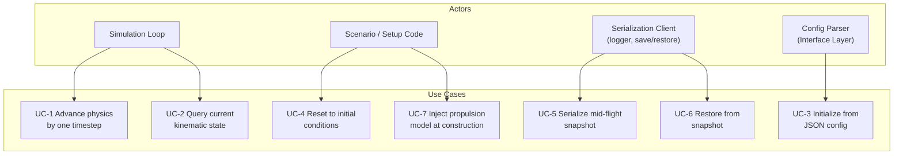
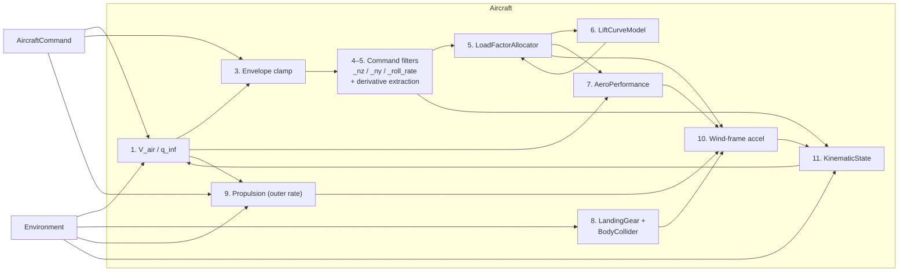
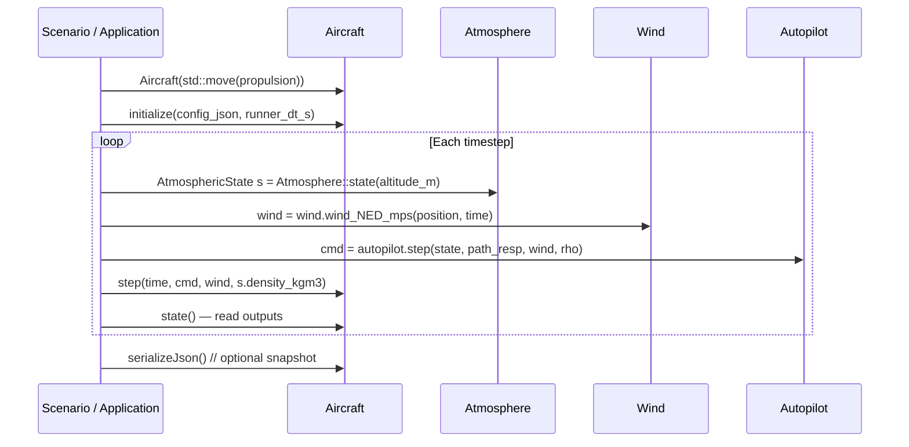

# Aircraft Class — Architecture and Interface Design

This document is the design authority for the `Aircraft` class. It covers the ownership
model, command processing architecture, the physics update loop, serialization, JSON
initialization, and the integration contracts with every owned subsystem.

---

## Use Case Decomposition



| ID | Use Case | Primary Actor | Mechanism |
| --- | --- | --- | --- |
| UC-1 | Advance physics by one timestep | Simulation loop | `Aircraft::step()` |
| UC-2 | Query current kinematic state | Simulation loop, guidance | `Aircraft::state()` |
| UC-3 | Initialize from JSON config | Config parser / scenario | `Aircraft::initialize(config, runner_dt_s)` |
| UC-4 | Reset to initial conditions | Scenario, test harness | `Aircraft::reset()` |
| UC-5 | Serialize mid-flight snapshot | Logger, pause/resume | `serializeJson()` / `serializeProto()` |
| UC-6 | Restore from snapshot | Pause/resume, replay | `deserializeJson()` / `deserializeProto()` |
| UC-7 | Inject propulsion model | Scenario, test | `Aircraft(std::move(propulsion))` constructor |

---

## Use Case Narratives

### UC-1 — Advance Physics by One Timestep

**Trigger:** The simulation loop calls `Aircraft::step()` once per runner output step
(`runner_dt_s`).

**Preconditions:** `initialize()` has been called. All inputs are in SI units. Air density
and wind vector have been computed from `Atmosphere` and `Wind` for the current position
before this call.

**Main flow:**

1. Compute true airspeed from `KinematicState::velocity_NED_mps()` and the supplied
   `wind_NED_mps`. Dynamic pressure follows from `rho_kgm3` and airspeed.
2. Read `T_prev` from the previous propulsion step (or 0 at `t=0`).
3. Clamp raw commanded load factors to airframe structural limits.
4. Run the command filter loop `cmd_filter_substeps` times, advancing `_nz_filter`,
   `_ny_filter`, and `_roll_rate_filter` at `cmd_filter_dt_s`. After the loop, read shaped
   commands and compute derivatives analytically from filter state.
5. Solve for angle of attack (`α`) and sideslip (`β`) using `LoadFactorAllocator::solve()`.
6. Evaluate `CL = LiftCurveModel::evaluate(α)`.
7. Compute aerodynamic forces in the Wind frame via `AeroPerformance::compute()`.
8. Step landing gear (`LandingGear::step()`) and body collider (`BodyCollider::step()`)
   against terrain, accumulating contact forces in the body frame.
9. Advance propulsion: `thrust_n = Propulsion::step(throttle, V_air, rho)`.
10. Assemble Wind-frame acceleration from thrust, aerodynamic forces, and contact forces
    (transformed body→wind). Gravity is implicit — the allocator generates lift equal to
    `n_z·m·g`, which at equilibrium exactly cancels gravity.
11. Advance position and velocity via `KinematicState::stepPV()` with the computed
    Wind-frame acceleration and aerodynamic angle inputs. This stores `v_prev` internally
    but does not yet update `q_nw` or body rates.
12. Apply terrain hard constraint via `BodyCollider::maxCornerPenetration_m()` and
    `KinematicState::applyTerrainHardConstraint()` if any body-collider corner penetrates
    terrain after integration. The constraint modifies velocity before attitude is committed.
13. Commit attitude via `KinematicState::commitAttitude()` with the shaped roll rate and
    the integration timestep. This updates `q_nw` using the truly final (post-constraint)
    velocity and derives body rates. See [defect_kinematic_attitude_model.md](defect_kinematic_attitude_model.md)
    (D-1) for the rationale.

**Postconditions:** `state()` reflects the aircraft position, velocity, and attitude at
`time_sec + runner_dt_s`. `Propulsion::thrust_n()` reflects the engine thrust at the last
substep. All quantities are sampled at the runner output rate; the intermediate substep
states are not accessible externally.

**Alternate flow — stall:** The allocator finds `α` such that
$q S C_L(\alpha) + T\sin\alpha = n_z\,m\,g$. The achievable load factor
$N_{z,\text{max}}(\alpha) = (q S C_L(\alpha) + T\sin\alpha)\,/\,(mg)$ has a peak at the `α`
where its derivative with respect to `α` crosses zero — post-stall $C_L$ falloff reduces the
aerodynamic contribution while $T\sin\alpha$ continues to rise, and beyond the peak the total
starts to decrease. Continuing past that point would produce a discontinuous jump in the
solution. The allocator therefore clamps `α` at the derivative zero-crossing rather than at
$\alpha_{C_{L,\text{max}}}$. For zero or negative thrust the zero-crossing coincides with
$\alpha_{C_{L,\text{max}}}$; for positive thrust it occurs at a higher `α`. No exception is
thrown.

The full inversion — the Newton solve and branch-continuation warm start for both axes, the
achievable-load-factor fold, the stall hysteresis and rate-limited lift recovery, the analytical
$\dot\alpha,\dot\beta$ derivatives, and the $\alpha \propto n_z/q$ low-speed conditioning — is
documented in [load_factor_allocation.md](../algorithms/load_factor_allocation.md).

---

### UC-3 — Initialize from JSON Config

**Trigger:** Application or test code calls `Aircraft::initialize(config, runner_dt_s)` after
constructing the `Aircraft` with a propulsion model.

**Preconditions:** The JSON has been validated against `aircraft_config_v1`. The
`Aircraft` has been constructed with a non-null propulsion model.

**Main flow:**

1. Store `runner_dt_s` (the SimRunner output step; Aircraft does not own the runner, only
   stores a copy to compute its own integration timestep).
2. Read `aircraft.max_integration_dt_s` (double, seconds). Compute the physics integration
   substep count: `integration_substeps = ceil(runner_dt_s / max_integration_dt_s)`.
   Compute `integration_dt_s = runner_dt_s / integration_substeps`. This value satisfies
   `integration_dt_s ≤ max_integration_dt_s` and `integration_substeps * integration_dt_s = runner_dt_s`
   exactly.
3. Read `inertia.*` and construct `Inertia`; read `airframe.*` and construct
   `AirframePerformance`.
4. Read `aircraft.S_ref_m2`, `aircraft.cl_y_beta`.
5. Construct `LiftCurveModel` from `lift_curve.*` parameters.
6. Construct `LoadFactorAllocator` from the lift curve, `S_ref_m2`, and `cl_y_beta`.
7. Construct `AeroPerformance` from `aircraft.S_ref_m2`, `aircraft.cl_y_beta`,
   `aircraft.ar`, `aircraft.e`, `aircraft.cd0`.
8. Construct the initial `KinematicState` from `initial_state.*`; save a copy as
   `_initial_state` for `reset()`.
9. Read `aircraft.max_cmd_filter_dt_s` (double, seconds). Compute
   `cmd_filter_substeps = ceil(integration_dt_s / max_cmd_filter_dt_s)`.
   Compute `cmd_filter_dt_s = integration_dt_s / cmd_filter_substeps`.
10. Validate filter natural frequencies against `cmd_filter_dt_s` (see §Command Processing
    Architecture). Throw `std::invalid_argument` on any violation.
11. Configure and warm-start `_nz_filter` (`setLowPassSecondIIR`), `_ny_filter`
    (`setLowPassSecondIIR`), and `_roll_rate_filter` (`setLowPassSecondIIR`).

**Postconditions:** `state()` returns the initial kinematic state. All filters are warm-started
at their steady-state values. The allocator and lift curve are ready for `step()`.

**Error flow:** If any required field is missing, out of range, or violates a Nyquist
constraint, `initialize()` throws `std::invalid_argument`.

---

### UC-5 — Serialize Mid-Flight Snapshot

**Trigger:** Logger or pause/resume manager calls `serializeJson()` or `serializeProto()`.

**Main flow:** Serialize each stateful subcomponent in turn:

| Component | Method called | What is captured |
| --- | --- | --- |
| `KinematicState` | `serializeJson()` | Full state — position, velocity, attitude |
| `LoadFactorAllocator` | `serializeJson()` | Config + warm-start α, β |
| `Propulsion` | `serializeJson()` | Config + filter state, thrust |
| `LiftCurveModel` | `serializeJson()` | Config params (stateless) |
| `AeroPerformance` | `serializeJson()` | Config params (stateless) |
| `AirframePerformance` | `serializeJson()` | Config params (stateless) |
| `Inertia` | `serializeJson()` | Config params (stateless) |
| `_initial_state` | `_initial_state.serializeJson()` | Initial conditions for `reset()` |
| `_nz_filter` | `_nz_filter.serializeJson()` | 2nd order LP state + config matrices |
| `_ny_filter` | `_ny_filter.serializeJson()` | 2nd order LP state + config matrices |
| `_roll_rate_filter` | `_roll_rate_filter.serializeJson()` | 2nd order LP state + config matrices |
| `_nz_moment_filt` | state vector x (two floats) | 2nd order HP filter state for pitch-moment → n_z perturbation |
| `_ay_moment_filt` | state vector x (two floats) | 2nd order HP filter state for yaw-moment → Δay perturbation |
| `_roll_rate_moment_filt` | state vector x (two floats) | 2nd order HP filter state for roll-moment → Δroll-rate perturbation |
| `_n_contact_z_filt` | scalar float | n_z suppression filter output (0–1); see `landing_gear.md` §Integration Contract §2 |
| `_wow0_elapsed_s` | scalar float | Elapsed seconds since WoW last went to zero; holds suppression during brief bounce episodes |
| `LandingGear` | `landing_gear.serializeJson()` | Per-wheel strut deflection + wheel speed (when landing gear is present) |

**Postconditions:** The returned JSON or byte vector is sufficient to restore the
aircraft to the exact mid-flight state via `deserializeJson()` / `deserializeProto()`.

---

## Command Processing Architecture

The three commanded axes — normal load factor (Nz), lateral load factor (Ny), and wind-frame
roll rate — are passed through `FilterSS2Clip` command response filters before reaching the
physics integrator. These filters model the finite closed-loop bandwidth of the aircraft's
FBW inner loops: a step command produces a shaped transient rather than an instantaneous jump.

### Filter Types

| Axis | Filter | Parameters |
| --- | --- | --- |
| Nz command response | `_nz_filter.setLowPassSecondIIR(cmd_filter_dt_s, nz_wn_rad_s, nz_zeta_nd, 0.f)` | natural frequency and damping ratio |
| Ny command response | `_ny_filter.setLowPassSecondIIR(cmd_filter_dt_s, ny_wn_rad_s, ny_zeta_nd, 0.f)` | natural frequency and damping ratio |
| Roll rate command response | `_roll_rate_filter.setLowPassSecondIIR(cmd_filter_dt_s, roll_rate_wn_rad_s, roll_rate_zeta_nd, 0.f)` | natural frequency and damping ratio |

The `tau_zero = 0` argument to `setLowPassSecondIIR` gives a pure 2nd order low-pass (no
numerator zero). All three filters share the same transfer function form:

$$
H_\text{nz}(s) = \frac{\omega_{n,\text{nz}}^2}{s^2 + 2\,\zeta_\text{nz}\,\omega_{n,\text{nz}}\,s + \omega_{n,\text{nz}}^2}
$$

and identically for Ny and roll rate with their own $\omega_n$ and $\zeta$ parameters.

### Timestep Hierarchy

There are three nested timestep levels, each derived by the same rule: choose the largest
sub-multiple of the enclosing step that does not exceed the configured maximum.

```text
runner_dt_s              — SimRunner output step (e.g. 0.02 s, 50 Hz)
                           Supplied by the caller to initialize(). Not in Aircraft JSON.

max_integration_dt_s     — aircraft config: maximum allowed physics integration timestep
integration_substeps     = ceil(runner_dt_s / max_integration_dt_s)   [integer ≥ 1]
integration_dt_s         = runner_dt_s / integration_substeps
                           Governs KinematicState trajectory integration accuracy.
                           Exact sub-fraction of runner_dt_s — no accumulation error.

max_cmd_filter_dt_s      — aircraft config: maximum allowed command filter timestep
cmd_filter_substeps      = ceil(integration_dt_s / max_cmd_filter_dt_s)   [integer ≥ 1]
cmd_filter_dt_s          = integration_dt_s / cmd_filter_substeps
                           Governs FBW command response filter Nyquist margin.
                           Exact sub-fraction of integration_dt_s.
```

Both `max_integration_dt_s` and `max_cmd_filter_dt_s` are configuration fields in the
`"aircraft"` JSON section. Using a maximum-timestep config parameter (rather than a fixed
integer substep count) ensures that:

- A long `integration_dt_s` automatically requests more command filter substeps to maintain
  Nyquist separation from filter dynamics.
- A short `integration_dt_s` does not wastefully over-step the command filters beyond what
  the dynamics require.
- The substep count is always a computed integer, so the update loop remains exact.

### Integration Substep Loop

Per `Aircraft::step()` call, the outer physics loop executes `integration_substeps`
iterations at `integration_dt_s`.

### Command Filter Substep Loop

The command response filters run at an integer multiple of the physics integration rate.
Per physics integration substep, the command filter loop executes `cmd_filter_substeps`
iterations:

```text
for i in [0, cmd_filter_substeps):
    n_z_shaped        = _nz_filter.step(n_z_cmd)
    n_y_shaped        = _ny_filter.step(n_y_cmd)
    roll_rate_shaped  = _roll_rate_filter.step(cmd.rollRate_Wind_rps)
```

The same clamped raw command values are fed on every inner substep. Propulsion runs once
at the outer rate, after the inner loop completes. KinematicState integration also runs
once at the outer rate.

### Derivative Sourcing

`LoadFactorAllocator::solve()` requires `n_z_dot` and `n_y_dot` — the time derivatives of
the shaped load factor commands — as feed-forward terms for computing `alphaDot` and
`betaDot`. These are extracted analytically from the `FilterSS2Clip` state vector after the
inner substep loop completes, without introducing a separate derivative filter or finite-
differencing delay.

`FilterSS2Clip::setLowPassSecondIIR` with `tau_zero = 0` uses the Tustin-discretized
controllable companion form. The `tf2ss` realization gives:

$$
\Phi = \begin{bmatrix} 0 & 1 \\ -a_2 & -a_1 \end{bmatrix}, \quad
\Gamma = \begin{bmatrix} 0 \\ 1 \end{bmatrix}, \quad
H = \begin{bmatrix} b_2 & b_1 \end{bmatrix}, \quad J = b_0
$$

where $a_i$, $b_i$ are the Tustin-prewarped discrete polynomial coefficients with $a_0 = 1$.
The filter output is $y[k] = H \cdot x[k] + J \cdot u[k]$, so the discrete approximation
of the output derivative is:

$$
\dot{y}[k] \approx \frac{H \cdot \bigl(\Phi\,x[k] + \Gamma\,u[k]\bigr) - y[k]}{dt_\text{inner}}
$$

This expression uses only quantities already available at the end of the substep loop (x, u,
and the current output) and adds no new filter lag.

### Nyquist Protection

`initialize()` enforces the following constraints and throws `std::invalid_argument` on any
violation:

| Constraint | Meaning |
| --- | --- |
| `max_integration_dt_s > 0` | Physics integration maximum timestep is positive |
| `max_cmd_filter_dt_s > 0` | Command filter maximum timestep is positive |
| `nz_wn_rad_s * cmd_filter_dt_s < π` | Nz natural frequency below command filter Nyquist |
| `ny_wn_rad_s * cmd_filter_dt_s < π` | Ny natural frequency below command filter Nyquist |
| `roll_rate_wn_rad_s * cmd_filter_dt_s < π` | Roll rate natural frequency below command filter Nyquist |

All Nyquist constraints bind on `cmd_filter_dt_s`, the finest timestep, which is derived
from `max_cmd_filter_dt_s`. Configuring `max_cmd_filter_dt_s` to be the reciprocal of a
target minimum sample frequency (e.g., `1 / (10 * wn_max)` for 10× Nyquist margin)
ensures the constraint is satisfied for any valid `integration_dt_s`.

The first two constraints (positive maximums) ensure `integration_substeps ≥ 1` and
`cmd_filter_substeps ≥ 1` by construction.

### Warm-Start and Reset

On `initialize()`, each filter is warm-started to its steady-state value for the given
initial command: `_nz_filter.resetToInput(1.f)` (level flight), `_ny_filter.resetToInput(0.f)`,
`_roll_rate_filter.resetToInput(0.f)`.

On `reset()`, all three filters are warm-started to the same steady-state values.

---

## Class Hierarchy

```mermaid
classDiagram
    class Aircraft {
        -_state : KinematicState
        -_initial_state : KinematicState
        -_liftCurve : optional~LiftCurveModel~
        -_allocator : optional~LoadFactorAllocator~
        -_aeroPerf : optional~AeroPerformance~
        -_airframe : AirframePerformance
        -_inertia : Inertia
        -_propulsion : unique_ptr~Propulsion~
        -_nz_filter : FilterSS2Clip
        -_ny_filter : FilterSS2Clip
        -_roll_rate_filter : FilterSS2Clip
        -_runner_dt_s : double
        -_integration_substeps : int
        -_integration_dt_s : double
        -_cmd_filter_substeps : int
        -_cmd_filter_dt_s : double
        +Aircraft(propulsion)
        +initialize(config, runner_dt_s) void
        +reset() void
        +step(time_sec, cmd, wind_NED_mps, rho_kgm3) void
        +state() const KinematicState&
        +serializeJson() json
        +deserializeJson(j) void
        +serializeProto() bytes
        +deserializeProto(bytes) void
    }

    class KinematicState {
        +step(time_sec, accel_Wind, rollRate, alpha, beta, alphaDot, betaDot, wind_NED) void
        +stepPV(time_sec, accel_Wind, alpha, beta, alphaDot, betaDot, wind_NED) void
        +commitAttitude(rollRate, dt_s) void
        +applyTerrainHardConstraint(penetration_m) void
        +velocity_NED_mps() Vector3f
        +serializeJson() json
        +deserializeJson(j) void
        +serializeProto() bytes
        +deserializeProto(bytes) void
    }

    class LiftCurveModel {
        +evaluate(alpha_rad) float
        +derivative(alpha_rad) float
        +alphaPeak() float
        +alphaTrough() float
        +alphaSep() float
        +alphaSepNeg() float
    }

    class LoadFactorAllocator {
        +solve(in) LoadFactorOutputs
        +reset(alpha0, beta0) void
        +serializeJson() json
        +deserializeJson(j) void
        +serializeProto() bytes
        +deserializeProto(bytes) void
    }

    class AeroPerformance {
        +compute(alpha, beta, q_inf, cl) AeroForces
    }

    class Propulsion {
        <<abstract>>
        +step(throttle_nd, tas_mps, rho_kgm3) float
        +thrust_n() float
        +reset() void
        +serializeJson() json
        +deserializeJson(j) void
        +serializeProto() bytes
        +deserializeProto(bytes) void
    }

    class AirframePerformance {
        +g_max_nd : float
        +g_min_nd : float
        +tas_max_mps : float
        +mach_max_nd : float
        +alpha_max_rad : float
        +alpha_min_rad : float
        +serializeJson() json
        +deserializeJson(j) void
        +serializeProto() bytes
        +deserializeProto(bytes) void
    }

    class Inertia {
        +mass_kg : float
        +Ixx_kgm2 : float
        +Iyy_kgm2 : float
        +Izz_kgm2 : float
        +serializeJson() json
        +deserializeJson(j) void
        +serializeProto() bytes
        +deserializeProto(bytes) void
    }

    class AircraftCommand {
        +n_z : float
        +n_y : float
        +rollRate_Wind_rps : float
        +throttle_nd : float
    }

    class FilterSS2Clip {
        +setLowPassSecondIIR(dt_s, wn, zeta, tau_zero) void
        +setLowPassFirstIIR(dt_s, tau) void
        +step(u) float
        +x() Mat21
        +phi() Mat22
        +gamma() Mat21
        +h() Mat12
        +j() Mat11
        +resetToInput(val) void
        +resetState(x) void
        +serializeJson() json
        +deserializeJson(j) void
    }

    Aircraft *-- KinematicState : owns (value)
    Aircraft *-- LiftCurveModel : owns (value)
    Aircraft *-- LoadFactorAllocator : owns (value)
    Aircraft *-- AeroPerformance : owns (value)
    Aircraft *-- AirframePerformance : owns (value)
    Aircraft *-- Inertia : owns (value)
    Aircraft o-- Propulsion : owns (unique_ptr)
    Aircraft *-- FilterSS2Clip : owns 3 (value)
    Aircraft ..> AircraftCommand : uses
```



---

## Interface

### Constructor

```cpp
namespace liteaerosim {

explicit Aircraft(std::unique_ptr<propulsion::Propulsion> propulsion);
```

Propulsion is injected at construction time so that the concrete engine type
(`PropulsionJet`, `PropulsionEDF`, `PropulsionProp`) can be varied without touching
`Aircraft`. The object is **not yet usable** after construction; either `initialize()`
(first-time setup from a config JSON) or `deserializeJson()` / `deserializeProto()`
(reconstitution from a snapshot) must be called before `step()`.

---

### Lifecycle Methods

```cpp
void initialize(const nlohmann::json& config, double runner_dt_s);
```

`runner_dt_s` is the SimRunner output step in seconds — the interval at which the runner
calls `Aircraft::step()`. `Aircraft` uses it to compute the physics integration substep count
N = ⌈runner_dt_s / max_integration_dt_s⌉ and the resulting `integration_dt_s = runner_dt_s / N`,
from which `cmd_filter_dt_s` is derived. `runner_dt_s` is not stored in the aircraft config
JSON; it is supplied by the runner at initialization time.

Reads `aircraft_config_v1` JSON and constructs all owned subsystems in dependency order:
inertia and airframe first, then lift curve, then aero performance and load factor allocator
(which reference the lift curve), then the initial `KinematicState`, then the command response
filters. Throws `std::invalid_argument` if any required field is missing, invalid, or violates
a Nyquist constraint.

```cpp
void reset();
```

Resets `KinematicState` to the initial conditions recorded at `initialize()` time, calls
`LoadFactorAllocator::reset()`, calls `Propulsion::reset()`, and warm-starts all three command
response filters to their steady-state values. After `reset()`, the aircraft is in the same
state as immediately after `initialize()`.

---

### Inputs to `step()`

```cpp
struct AircraftCommand {
    float n_z               = 1.f;  // commanded normal load factor (g)
    float n_y               = 0.f;  // commanded lateral load factor (g)
    float rollRate_Wind_rps = 0.f;  // commanded wind-frame roll rate (rad/s)
    float throttle_nd       = 0.f;  // normalized throttle [0, 1]
};
```

| Field | SI unit | Description |
| --- | --- | --- |
| `n_z` | g | Normal load factor command; 1.0 = level flight at 1 g |
| `n_y` | g | Lateral load factor command; 0 = coordinated flight |
| `rollRate_Wind_rps` | rad/s | Wind-frame roll rate command |
| `throttle_nd` | — | Normalized throttle demand [0, 1] |

`n_z` and `n_y` are the raw pilot or autopilot commands. They are clamped to structural limits
and then shaped by `_nz_filter` / `_ny_filter` before reaching the load factor allocator.
Shaped derivatives are not on the command interface — they are computed internally from filter
state (see §Command Processing Architecture).

---

### `step()` Signature

```cpp
void step(double time_sec,
          const AircraftCommand& cmd,
          const Eigen::Vector3f& wind_NED_mps,
          float rho_kgm3);
```

| Parameter | SI unit | Description |
| --- | --- | --- |
| `time_sec` | s | Absolute simulation time at this step |
| `cmd` | mixed | Commanded inputs (see `AircraftCommand` table above) |
| `wind_NED_mps` | m/s | Ambient wind vector in NED frame — supplied by `Wind` model |
| `rho_kgm3` | kg/m³ | Local air density — supplied by `Atmosphere::state()` |

`step()` has no return value. All outputs are read through `state()` and
`Propulsion::thrust_n()` after the call.

---

### `state()` and Output Query

```cpp
const KinematicState& state() const;
```

Returns a const reference to the internal `KinematicState`. Callers should not hold this
reference across a `step()` call if they need a snapshot; copy the object instead.

Derived quantities available from `KinematicState` after `step()`:

| Quantity | Method | Unit |
| --- | --- | --- |
| Position (WGS84) | `state().positionDatum()` | rad / m |
| Velocity (NED) | `state().velocity_NED_mps()` | m/s |
| Euler angles | `state().eulers()` | rad |
| Angle of attack | `state().alpha()` | rad |
| Sideslip | `state().beta()` | rad |
| Body angular rates | `state().rates_Body_rps()` | rad/s |
| Wind-frame roll rate | `state().rollRate_Wind_rps()` | rad/s |

---

### Diagnostics Accessors

Read-only instrumentation from the most recent `step()`, for model diagnosis and scenario notebooks.
None is serialized — each is recomputed every step from live intermediates.

```cpp
const ContactForces&    contactForces()      const;   // gear + collider force/moment, WoW
float                   clEff()              const;   // effective CL applied
bool                    isStalled()          const;
bool                    isClRecovering()     const;
float                   rollRateState_rps()  const;   // OQ-BC-12 persistent wind-axis roll rate
const StepDiag&         stepDiag()           const;   // Δθ / attitude decomposition (below)
float                   agl_m()              const;   // height above terrain (−1 if no terrain)
bool                    weightOnWheels()     const;
```

`StepDiag` exposes the velocity-slaved-attitude / gear-F&M `Δθ` machinery that is otherwise internal to
`step()`, which is what makes the OQ-AC-9 ground-start divergence observable:

| Field | Unit | Meaning |
| --- | --- | --- |
| `dtheta_pitch` | rad | Total pitch rotation deviation `Δθ_pitch` = force + moment channels |
| `dtheta_force` | rad | Force-channel `G(s)·u` (destanced gear+collider vertical load, faded by `Φ(V)`) |
| `dtheta_moment_pitch` | rad | Moment-channel `(1/ωₙ²)·H₂(M_pitch/I_yy)` (finite DC, no velocity fade) |
| `dtheta_yaw` | rad | Yaw rotation deviation `Δθ_yaw` |
| `alpha_cmd`, `alpha_body` | rad | LFA-commanded α, and `α_body = α_cmd + Δθ_pitch` (feeds the gear geometry) |
| `phi_authority` | — | `Φ(V)` dynamic-pressure authority fade (0 at rest → 1 at flight speed) |
| `gamma_fpa_rad` | rad | Inertial flight-path angle `γ` used in the force channel |
| `a_arrest_gear_mps2` | m/s² | Gear destanced vertical acceleration `(F_z − F_stance)/m` (force-channel input) |
| `fz_stance_gear_n` | N | Gear stance (destance reference) vertical load, NED |
| `gear_moment_pitch_nm`, `bc_moment_pitch_nm` | N·m | Gear and body-collider pitching moment about the CG (body Y) |
| `n_z_shaped` | g | FBW-shaped normal load-factor command feeding the LFA |
| `weight_on_wheels` | — | Any wheel or collider contact on this step |
| `v_final_elev_rad` | rad | Elevation of the true post-integration NED velocity (+ = up) |
| `att_base_elev_rad` | rad | Elevation of `v_att_base` (contact-excluded reference velocity) |
| `att_filt_elev_rad` | rad | Elevation of the low-pass attitude-reference velocity |
| `att_ref_elev_rad` | rad | Elevation of `v_att_ref` (Φ-blended reference `q_nw` slaves to) |
| `att_ref_speed_mps` | m/s | Magnitude of `v_att_ref` |
| `phi_att_nd` | — | `Φ(V)` authority weight in the attitude-reference blend |
| `qnw_pitch_rad` | rad | Committed `q_nw` Euler pitch (wind-frame flight-path) |
| `qnw_ref_desync_rad` | rad | Angle between the committed `q_nw` forward axis and the slew-saturated reference it slaves to — the velocity-slaving invariant error (OQ-AC-9); ~0 when consistent |

The `v_*_elev` / `qnw_pitch_rad` / `qnw_ref_desync_rad` group isolates whether `q_nw` is tracking its
reference (OQ-AC-9): `qnw_ref_desync_rad` is the direct invariant error (angle to the *saturated* reference,
excluding the intended OQ-AC-2 slew lag) — ~0 in every consistently-initialized regime, ~90° for a
rest-on-gear start. All are exposed to Python as
`AircraftStepDiag` via `PyAircraft.step_diag()`
([`src/python/bind_aircraft.cpp`](../../src/python/bind_aircraft.cpp)).

---

### Serialization

```cpp
[[nodiscard]] nlohmann::json       serializeJson()                              const;
void                               deserializeJson(const nlohmann::json&        j);
[[nodiscard]] std::vector<uint8_t> serializeProto()                            const;
void                               deserializeProto(const std::vector<uint8_t>& bytes);
```

#### JSON Snapshot Schema

The snapshot is **self-contained** — `deserializeJson()` fully reconstitutes a working
`Aircraft` without requiring a prior `initialize()` call. Every owned component serializes
its full configuration and internal state.

```json
{
    "schema_version":      1,
    "type":                "Aircraft",
    "kinematic_state":     { ... },
    "initial_state":       { ... },
    "allocator":           { ... },
    "lift_curve":          { ... },
    "aero_performance":    { ... },
    "airframe":            { ... },
    "inertia":             { ... },
    "propulsion":          { ... },
    "cmd_filter_substeps": 1,
    "cmd_filter_dt_s":     0.02,
    "nz_wn_rad_s":         15.0,
    "nz_zeta_nd":          0.7,
    "ny_wn_rad_s":         12.0,
    "ny_zeta_nd":          0.7,
    "roll_rate_wn_rad_s":  10.0,
    "roll_rate_zeta_nd":   0.7,
    "nz_filter":           { ... },
    "ny_filter":           { ... },
    "roll_rate_filter":    { ... }
}
```

| Field | Source | Notes |
| --- | --- | --- |
| `"schema_version"` | constant 1 | Verified on deserialize; mismatch throws |
| `"type"` | constant `"Aircraft"` | Verified on deserialize; mismatch throws |
| `"kinematic_state"` | `_state.serializeJson()` | Full kinematic state at snapshot time |
| `"initial_state"` | `_initial_state.serializeJson()` | Initial conditions for `reset()` |
| `"allocator"` | `_allocator->serializeJson()` | Config + warm-start α, β |
| `"lift_curve"` | `_liftCurve->serializeJson()` | Lift curve config params |
| `"aero_performance"` | `_aeroPerf->serializeJson()` | Aero config params |
| `"airframe"` | `_airframe.serializeJson()` | Structural envelope limits |
| `"inertia"` | `_inertia.serializeJson()` | Mass properties |
| `"propulsion"` | `_propulsion->serializeJson()` | Engine type, config, and filter state |
| `"cmd_filter_substeps"` | `_cmd_filter_substeps` | Integer inner step count |
| `"cmd_filter_dt_s"` | `_cmd_filter_dt_s` | Inner timestep (s) |
| `"nz_wn_rad_s"` | config param | Nz natural frequency (rad/s) |
| `"nz_zeta_nd"` | config param | Nz damping ratio |
| `"ny_wn_rad_s"` | config param | Ny natural frequency (rad/s) |
| `"ny_zeta_nd"` | config param | Ny damping ratio |
| `"roll_rate_wn_rad_s"` | config param | Roll rate natural frequency (rad/s) |
| `"roll_rate_zeta_nd"` | config param | Roll rate damping ratio |
| `"nz_filter"` | `_nz_filter.serializeJson()` | Full state-space matrices + state vector |
| `"ny_filter"` | `_ny_filter.serializeJson()` | Full state-space matrices + state vector |
| `"roll_rate_filter"` | `_roll_rate_filter.serializeJson()` | Full state-space matrices + state vector |

#### Deserialize Contract

- If `"schema_version"` ≠ 1 or `"type"` ≠ `"Aircraft"`, throws `std::runtime_error`.
- `"propulsion"."type"` must match the concrete `Propulsion` subclass injected at
  construction.
- `deserializeJson()` does **not** require a prior `initialize()` call. However, the correct
  `Propulsion` concrete subclass **must** have been injected at construction before calling
  `deserializeJson()`.
- After `deserializeJson()`, the next `step()` call must produce the same output as if the
  simulation had never been interrupted.

---

## Physics Integration Loop

### Step Execution Order

```text
1. V_air  = (state().velocity_NED_mps() - wind_NED_mps).norm()
   q_inf  = 0.5 * rho_kgm3 * V_air²

2. T_prev = _propulsion->thrust_n()        // from previous step (or 0 at t=0)

3. Clamp commanded load factors. Nz is clamped to the airframe structural g-envelope; Ny is
   additionally authority-limited to a maximum path curvature (OQ-AC-6, see §Lateral Authority Limit):
       n_z_cmd = clamp(cmd.n_z, _airframe.g_min_nd, _airframe.g_max_nd)
       n_y_max = ((1−w)·V_air²/R_flight + w·V_ground²/R_ground) / g        // curvature authority
       n_y_cmd = clamp(cmd.n_y, max(g_min_nd, −n_y_max), min(g_max_nd, n_y_max))

4. Inner filter loop — runs cmd_filter_substeps times at cmd_filter_dt_s:
       for i in [0, cmd_filter_substeps):
           n_z_shaped        = _nz_filter.step(n_z_cmd)
           n_y_shaped        = _ny_filter.step(n_y_cmd)
           roll_rate_shaped  = _roll_rate_filter.step(cmd.rollRate_Wind_rps)

5. Compute shaped-command derivatives from filter state (see §Derivative Sourcing):
       n_z_dot = derived analytically from _nz_filter.x(), .phi(), .gamma(), .h(), .j()
       n_y_dot = derived analytically from _ny_filter.x(), .phi(), .gamma(), .h(), .j()

   R_nb, R_nw = _state.q_nb(), q_nw() rotation matrices (reused in 5c and 10)

5a. Contact reaction + roll co-integration (OQ-AC-3 / IP-CRB-9). The body collider is stepped first
    (its moment feeds the roll integration). The gear uses `beginContact` to fix the terrain
    tangent-plane approximation ONCE (outer), then a substep loop at `inner_dt = dt/substeps`
    recomputes the strut/tire forces from the EVOLVING bank via `substepContact` and Tustin-integrates
    `roll_rate_state`, advancing the bank each substep so the strut damper reacts to the in-phase roll
    rate (physical energy extraction — no outer-rate lag). `commitAttitude` (step 13) receives the
    substep-swept bank; the aggregate (substep-MEAN) force/moment feeds §5b/§5c and the EOM.
       gear ← beginContact(...) + N× substepContact(evolving pose)   ;   ⊕ _bodyCollider->step(...)
    Roll stays velocity-slaved (no rigid-body EOM). `inner_dt` must resolve the gear righting mode for
    the roll to settle fully (small-UAS fixture: `substeps = 16` at dt = 0.01).

5b. Gear → n_z command handoff (landing_gear.md §2b). On weight-on-wheels, the shaped n_z is
    relaxed by the gear's share of the load and biased by the steady axial-force deficit so the
    aircraft settles onto the gear / rotates on takeoff:
       n_z_shaped = max(0,  n_z_shaped − H₁·n_z_gear + clip(k_s·(ā_x/g)·Φ_g, ±Δ_max))
    (H₁ = apportionment relaxation; the clip term = OQ-LG-23 axial-acceleration settle term.)

5c. Gear → rotation-deviation Δθ (landing_gear.md §2a). The gear vertical load (destanced, force
    channel G(s)) and gear moments (M/I, moment channel H₂), faded by the V² authority Φ(V),
    produce a body rotation deviation:
       Δθ_pitch → feeds α (step 10) and the gear geometry next step
       Δθ_roll, Δθ_yaw → body-rate increments delta_rr, delta_ay (steps 13 / 10)

6. LoadFactorInputs lf_in { n_z_shaped, n_y_shaped, q_inf, T_prev, _inertia.mass_kg,
                            n_z_dot, n_y_dot, dt }
   // alpha_min_rad / alpha_max_rad enforced as box constraint inside solve():
   LoadFactorOutputs lf = _allocator->solve(lf_in)   // → alpha_rad, beta_rad, cl_eff, αDot, βDot

7. float CL = lf.cl_eff   // effective CL from the allocator: nominal in attached flow,
   //                        rate-limited during stall recovery (see §Stall Recovery)

8. AeroForces F = _aeroPerf->compute(lf.alpha_rad, lf.beta_rad, q_inf, CL)
   // F.x_n < 0 (drag),  F.y_n (side force),  F.z_n < 0 (lift upward)
   _prev_aero_drag_n = max(0, -F.x_n)   // stored for next step's §5b settle deficit

9. float T = _propulsion->step(cmd.throttle_nd, V_air, rho_kgm3)   // outer rate

10. alpha_body = lf.alpha_rad + Δθ_pitch      // body attitude carries the gear rotation deviation
    cα,sα = cos/sin(alpha_body);  cβ,sβ = cos/sin(lf.beta_rad)
    // Lift clamp: the wing may not produce more upward lift than the LFA commanded; the gear
    // carries the rest. With n_z_shaped → 0 on the ground this is zero aero lift, not downforce.
    F_z_aero = max(F.z_n, -(n_z_shaped * m * g))
    // Contact forces G_wind = R_nw^T·R_nb·contact.force_body; g_wind = R_nw^T·g_NED
    a_Wind {
        ( T*cα*cβ + F.x_n   + G_wind.x()) / m + g_wind.x(),
        (-T*cα*sβ + F.y_n   + G_wind.y()) / m + g_wind.y() + delta_ay,
        (-T*sα    + F_z_aero + G_wind.z()) / m + g_wind.z()
    }

11. _state.stepPV(time_sec, a_Wind, alpha_body, lf.beta_rad, lf.alphaDot_rps, lf.betaDot_rps,
                  wind_NED_mps)
    // RK4 position/velocity; stores the recorded alpha as alpha_body. Does NOT update q_nw yet.

12. Post-integration terrain hard constraint: re-run the body collider on the integrated pose; if
    penetrating, _state.applyTerrainHardConstraint(pen) and set weight-on-wheels; clear the
    hard-contact latch on genuine separation (BodyCollider::minCornerClearance_m).

13. _state.commitAttitude(roll_rate_shaped + delta_rr, dt_s, v_att_ref)
    // OQ-LG-21: v_att_ref = Φ(V)·v_final + (1−Φ(V))·LP(v_final) — a dynamic-pressure blend of the
    // instantaneous and low-pass-filtered final velocity. At speed Φ→1 (raw velocity); toward stop
    // Φ→0 (filtered), rejecting per-step gear-bounce wobble. Updates q_nw and the body rate.
    // OQ-AC-2: commitAttitude saturates the per-step direction change of v_att_ref to θ_max=(V/R_min)·dt
    // and feeds the saturated reference forward; stepQnw then tracks it STRICTLY (q_nw.x = v̂ always).
    // This bounds the attitude rate as V→0 without decoupling the attitude from velocity (a direct
    // rotation cap would launch a crabbed touchdown). R_min = qnw_min_turn_radius_m (no default).
```

Steps 5a–5c and the Δθ / n_z-handoff terms are specific to the load-factor `Aircraft`; their
models, symbols, and parameterization are the authoritative subject of
[landing_gear.md §Integration Contract](landing_gear.md). `Aircraft6DOF` applies the assembled
gear force/moment directly to the 6-DOF EOM instead.

> **Why the split?** Calling `stepQnw` (the q_nw update) on the pre-constraint velocity
> and then modifying velocity via `applyTerrainHardConstraint` breaks the invariant
> `q_nw.x = velocity_NED_mps.normalized()`. The split `stepPV` → terrain constraint →
> `commitAttitude` sequence ensures `q_nw` is always computed from the final velocity.
> See [defect_kinematic_attitude_model.md](defect_kinematic_attitude_model.md) (D-1) for
> the full defect analysis and [equations_of_motion.md](../algorithms/equations_of_motion.md)
> §Integration Scheme Summary — Trim Aero for the corrected algorithm.

### Lateral Authority Limit

The lateral load-factor command `Ny` is authority-limited so a commanded lateral acceleration
cannot demand a **path curvature** tighter than the vehicle's minimum turn radius (OQ-AC-6). A
constant `Ny` authority at all speeds is unphysical: on the ground it would imply an
arbitrarily small turn radius as the vehicle slows, and in the air it would drive the emulated
sideslip β without bound as dynamic pressure vanishes. Since the achievable lateral acceleration
is `a_y = V²·κ` for path curvature `κ`, bounding `κ ≤ 1/R` yields `|Ny| ≤ V²/(g·R)`, which fades
to zero as speed drops.

The applicable minimum turn radius differs significantly between flight and ground steering, so
the limit blends two regimes:

$$n_{y,\max} = \frac{1}{g}\left[(1-w)\,\frac{V_\text{air}^2}{R_\text{flight}} + w\,\frac{V_\text{ground}^2}{R_\text{ground}}\right]$$

- **Flight term** uses **airspeed** `V_air` and the flight minimum radius `R_flight`
  (`qnw_min_turn_radius_m`, shared with the OQ-AC-2 azimuth-slew cap so the command stays
  consistent with the achievable slew). Using airspeed keeps full lateral authority in a strong
  headwind — a low ground speed at high airspeed must not shift the dynamics.
- **Ground term** uses **ground speed** `V_ground` and the tighter ground-steering minimum radius
  `R_ground` (`ground_steering_min_turn_radius_m`), the wheeled-turn curvature.
- **Blend weight** `w = f_\text{WoW} · (1 − \text{smoothstep}(V_\text{ground}; V_\text{lo}, V_\text{hi}))`.
  `f_WoW` is the weight-on-wheels vertical-load fraction (previous step's gear vertical load / weight,
  clamped to [0,1]); because the gate is gear load, a headwind cannot engage the ground regime while
  airborne. The speed factor is a C¹ smoothstep over a ground-speed band **right below stall**
  (`V_lo, V_hi = ground_steering_vblend_lower_ratio, _upper_ratio × V_stall`): the ground radius is
  approached only when the vehicle is both weighted and slowed toward taxi, so a fast touchdown eases
  into `R_ground` rather than stepping to it.

The result is intersected with the structural g-envelope `[g_min_nd, g_max_nd]`. This is a pure
command-authority limit on the existing `Ny` channel — it does not remap the channel, add a
curvature or β input, use the steerable gear, or introduce a control loop.

### On-Ground Gear-Aero Yaw Balance

On the runway the flight control law ties the heading to the ground track by **actively enforcing the
commanded lateral load factor `Ny`**. A crosswind then holds a **static sideslip** (the aircraft does not
free-weathervane into the wind), the commanded lateral input steers the ground track, and the aircraft
weathervanes only when the crosswind yaw moment exceeds the FBW's on-ground steering authority. The
behavior reduces exactly to the coordinated flight model as the contact force fades at lift-off. The full
derivation — frames, the authority balance, the reduction to the flight model, and the discretization — is
in [ground_directional_dynamics.md](../algorithms/ground_directional_dynamics.md); this section states the
model and its configuration.

**Why the heading is a balance, not a slave.** In free flight the attitude is velocity-slaved to the
**aerodynamic** velocity (§Aerodynamic Wind Frame and Crab): the heading `ψ` tracks the airspeed azimuth
`χ_a`, so the sideslip `β = χ_a − ψ = 0`. Left unchanged on the ground this makes the nose track the
airspeed — the aircraft free-weathervanes into the wind — and because in this model `β` is the allocator's
value for the commanded `Ny` (≈ 0 when `Ny = 0`), the weathervane is purely kinematic (the heading
following `χ_a`), with no aero side force to "react". The FBW must therefore condition **which velocity the
heading slaves to**.

**FBW steering authority.** When the FBW commands `Ny` (with `Ny = 0` the straight-rollout case) it applies
a **yaw control moment** to the airframe to null the lateral/yaw disturbance, up to an estimated steering
authority. This is a control moment — **not** a gear-friction force (not differential braking, not tyre
side forces) and **not** a modeled nose-wheel deflection. Its magnitude is estimated as a moment-arm
coefficient times the contact normal load:

$$N_\text{steer,max} = c_\text{steer}\,F_{z,\text{contact}},$$

with `c_steer` (`steering_authority_m`, m) the effective steering-authority arm and `F_z,contact` the total
weight on wheels. It scales with contact load, so `N_steer,max → 0` at lift-off.

**Hold fraction.** The aero weathervane moment that would fully turn the nose into the wind is `k_a·|c|`,
where `k_a = |Cy_β|·q·S·x_acy` is the aerodynamic weathervane stiffness (`Cy_β` = `cl_y_beta`; `x_acy` the
aerodynamic side-force lever aft of the CG, a new required config parameter; `q = ½ρV_a²`) and `c = χ_a −
χ_g` the crab. The FBW opposes it up to `N_steer,max`, so the fraction of the heading it can hold is

$$\psi = \chi_a - w_\text{hold}\,c,\qquad
  w_\text{hold} = \min\!\left(1,\ \frac{N_\text{steer,max}}{k_a\,|c|}\right)\in[0,1],$$

and the model sideslip is `β = w_hold·c` (`w_hold = 1` as `c → 0`). `w_hold = 1` (authority ≥ demand) is
the firm hold — heading held to the track, static `β = c` (the crab). `w_hold < 1` (strong wind / high
dynamic pressure, or light contact) is a partial hold — the heading weathervanes on the excess. `w_hold =
0` airborne (`N_steer,max = 0`) is the free-flight weathervane. There is **no passive-stiffness term**: the
hold is a saturating FBW authority limit, not a soft spring.

**Discrete realization (attitude reference).** The balance is applied through the attitude-reference
velocity that `commitAttitude` slaves `q_nw` to — the OQ-AC-4 aerodynamic-velocity reference with the wind
added back in proportion to the hold fraction:

$$\mathbf v_\text{att,ref} = \mathbf v_g - (1-w_\text{hold})\,\mathbf w
  \qquad(=\mathbf v_a \text{ at } w_\text{hold}=0;\ =\mathbf v_g \text{ at } w_\text{hold}=1),$$

whose azimuth interpolates `χ_a → χ_g` as `w_hold: 0 → 1`. This is the **sole** change from the OQ-AC-4
reference; `stepQnw` tracks it strictly under the OQ-AC-2 slew saturation, so `q_nw.x = v̂_ref` and the
low-speed rate bound are preserved. No rigid-body yaw DOF is introduced — the heading stays velocity-slaved,
only to an FBW-conditioned reference.

**Commanded directional input is separate.** A **nonzero** commanded `Ny` steers the **ground track** `χ_g`
through the wind-frame lateral force (`χ̇_g = a_y/V_g`), authority-limited by the ground minimum radius
`R_ground` (§Lateral Authority Limit, OQ-AC-6). A sustained `Ny` keeps curving the track (a commanded
ground loop), and the heading follows via `w_hold`. The commanded input therefore still steers the aircraft
on the runway; it is not gated by the weathervane hold.

**Reduction to the flight model.** At lift-off `F_z,contact → 0` so `N_steer,max → 0`, hence `w_hold → 0`,
`ψ → χ_a`, `β → 0` — coordinated flight — and the OQ-AC-6 blended radius returns to `R_flight`. Every gear
term is `∝ F_z` (continuous through touchdown), so there is no regime switch.

**Why not a simpler rule.** A **free weathervane** (`w_hold ≡ 0`) is trivial but non-physical on the ground
— the aircraft yaws into the wind even firmly on its wheels. A **hard heading-hold** (`w_hold ≡ 1` below a
ground-speed gate) is correct for light winds but **discontinuous** at the flight↔ground boundary and
cannot represent a wind that overpowers the control authority. The contact-scaled, authority-saturated
`w_hold` is the only option physically correct across the regime (light wind → held static `β`; strong wind
→ slips) and smooth via the `F_z`-scaled authority.

**Configuration and scope.** Two new required config parameters, validated at `initialize()` with no
default and added to the [config schema](../schemas/aircraft_config_v1.md): `x_acy_m` (aerodynamic
side-force lever, m) and `steering_authority_m` (FBW steering-authority arm, m). The balance is
**memoryless** (algebraic per step): no new serialized dynamic state; the contact scaling reads the
current-step gear normal load (via the weight-on-wheels load fraction). It stays inside the trimaero model
— no 6-DOF EOM, no explicit `Cn_β`, no gear-friction/nose-deflection steering model, no control loop beyond
the emulated authority limit. The design decisions are recorded in
[OQ-AC-5](#oq-ac-5--on-ground-yaw-and-weathervane-gear-aero-moment-balance-in-wind-resolved),
[OQ-AC-7](#oq-ac-7--emulating-the-on-ground-aero-weathervane-yaw-moment-no-cn_β-resolved), and
[OQ-AC-8](#oq-ac-8--estimating-the-gear-yaw-reaction-capability-nose-steering-no-modeled-deflection-resolved);
implemented as IP-CRB-11.


### Stall Recovery (CL Rate Limiting)

`LoadFactorAllocator` distinguishes the *nominal* lift coefficient (the steady lift-curve value
at the solved α) from the *effective* CL it actually reports (`cl_eff`), to model separated-flow
hysteresis around stall:

- **Attached flow (normal flight).** `cl_eff = cl_nominal(α)` directly — **no rate limit**. The
  longitudinal response is shaped by the FBW `n_z` command filter (§Command Processing
  Architecture), not by the allocator. A trimmed vehicle initialized in attached flight therefore
  produces full lift on the very first step (no startup transient).
- **Stall.** While the stall hysteresis flag is set, `cl_eff` is held at the separated-flow
  plateau (`cl_sep` / `cl_sep_neg`).
- **Recovery.** When a stall clears, reattachment is not instantaneous: `cl_eff` is rate-limited
  upward toward nominal at `cl_α · alpha_dot_max` per second until it catches the nominal curve,
  then the recovery flag clears and attached-flow tracking resumes. Recovery is **armed by an
  actual stall** (captured at step entry, so the clearing step itself begins recovery) and applies
  **only** during recovery — never in attached flight. (An earlier implementation rate-limited the
  upward CL return in all non-stalled flight, which both manufactured a zero-lift cold-start
  transient and asymmetrically lagged CL under normal maneuvering — a defect, now corrected.)

`alpha_dot_max` is **non-dimensionalized**: the config supplies `alpha_dot_max_ratio` and the
realized rate is `alpha_dot_max_ratio · g/V_stall`, so the reattachment rate scales per airframe
(a light UAS reattaches faster than a heavy jet — see the
[schema](../schemas/aircraft_config_v1.md#load_factor_allocator-section)). The recovery flags
(`recovering`, `recovering_neg`) and effective-CL state (`cl_recovering`, `cl_recovering_neg`) are
warm-start state (serialized JSON + proto).

### Wind-Frame Force Decomposition

Thrust acts along the body x-axis (positive forward). Decomposed into Wind-frame
components:

$$
\begin{aligned}
a_x^W &= \frac{T \cos\alpha \cos\beta + F_x}{m} \\
a_y^W &= \frac{-T \cos\alpha \sin\beta + F_y}{m} \\
a_z^W &= \frac{-T \sin\alpha + F_z}{m}
\end{aligned}
$$

where $F_x < 0$ (drag), $F_z < 0$ (lift directed negative-down, i.e., upward).

**Gravity accounting:** The `LoadFactorAllocator` solves the constraint

$$
q\,S\,C_L + T\sin\alpha = n_z\,m\,g
$$

The gravitational term $n_z\,m\,g$ is entirely consumed within that constraint. The
Wind-frame acceleration computed in step 10 is the **kinematic** (non-gravitational)
acceleration; `KinematicState::step()` integrates it directly without adding $g$ again.

### Velocity-Slaved Attitude and Low-Speed Slew Saturation

**Velocity slaving.** The attitude is *velocity-slaved*: `commitAttitude` keeps `q_nw` aligned with the
attitude-reference velocity vector by rotating it with `setFromTwoVectors(v_ref_prev, v_ref)` each step
([KinematicState.cpp](../../src/KinematicState.cpp)). The strict velocity↔attitude relationship
**`q_nw.x = v̂_ref`** is what the whole trimaero model depends on; it is enforced by anchoring the rotation
to `q_nw`'s own forward axis each step (see *Reference re-anchoring* below — the earlier form anchored it to
the stored previous reference, which did not self-correct a desync). That rotation is the *full angle*
between the two reference-velocity vectors with no magnitude weighting: the applied heading / flight-path
rate is `angle(v_ref_prev, v_ref)/dt`, irrespective of speed.

**Low-speed ill-conditioning.** As ground speed → 0 the velocity *direction* becomes numerically
ill-conditioned — a small lateral perturbation (a gear side force, an RK4 residual) swings the direction by
a large angle in a single step, so the slaved attitude whips. Measured on a banked touchdown rolled out to
a stop: past `V ≈ 0.4 m/s` the airframe rests level on its struts, yet the attitude grinds in a bounded
limit cycle that never settles. The original guard was a discontinuous `kMinSpeed = 0.1 m/s` cliff that
froze the curvature below the threshold — it does not bound the rate *approaching* the threshold (the whip
happens just above it), and its interaction with the low-speed rollout was the measured source of the
limit cycle.

**Design constraint.** Any conditioning must **bound the attitude rate as `V → 0` while preserving
`q_nw.x = v̂`**. Rate-limiting the *rotation itself* is not acceptable: when the velocity keeps turning (a
sustained-sideslip crab), a rotation-capped `q_nw` decouples from and lags the velocity, and the
accumulated mismatch **launches the aircraft** — empirically a crabbed touchdown lifts off, struts
unloaded, `F_z → 0`. Rate-limiting the rotation is the wrong lever.

**Low-speed slew saturation (the model).** The rate is bounded by saturating the **attitude-reference
velocity slew**, not the rotation. `commitAttitude` limits the per-step direction change of the reference
velocity `v_att_ref` to

$$\theta_{\max} = \frac{V}{R_{\min}}\,dt$$

by rotating the stored previous reference toward the new one by at most `θ_max`, stores the **saturated**
reference as the next step's previous, and passes it to `stepQnw`, which then tracks it **strictly**
(`setFromTwoVectors`, no rotation cap; a small epsilon guard only prevents normalizing an exact-zero
vector, replacing the `kMinSpeed` cliff). Because the saturated reference slews *toward* the true velocity
at a bounded rate — the excess is carried forward, not discarded — it **converges** whenever the velocity
direction is steady, so a sustained crab produces no permanent lag (no launch), while a fast low-speed
direction swing (noise) is smoothed. As `V → 0`, `θ_max → 0`, so direction noise can slew neither the
reference nor the attitude at rest. This bounds the attitude rate speed-proportionally without ever
breaking `q_nw.x = v̂`. It is the same `V`-proportional physics as the steering law
`ψ̇ = V·tan δ / L ∝ V`, uses a single parameter, and leaves the physical RK4 velocity and the EOM
untouched — only the attitude *reference* is conditioned. `R_min = qnw_min_turn_radius_m` is a required
config field (initialization fails if unset; nominal 10 m). Verified: the 12 m/s gear-only crabbed
touchdown settles rather than lifting off (`max_agl` 2.5 → 0.29 m).

**Related low-speed effects (not this mechanism).** (a) The banked-rollout **roll-channel limit cycle** is
a discrete gear-coupling artifact, not a velocity-slaving effect — it is the
[Roll–Strut Co-Integration](#rollstrut-co-integration-substep) subject. An interim helix-angle bound on the
contact-induced roll rate, `p_max(V) = kRollRateLimit_rps · V/V_stall` (the correct roll
nondimensionalization `p̂ = p·b/(2V)` anchored at stall so the span cancels — **not** the path-curvature
`V/R_min`), only capped that cycle's amplitude ∝ `V` without dissipating it, and is removed. (b) A
**gentle-approach (near-stall) crab launch** — at ~1.2× stall a sustained-`n_y` crabbed approach lifts off
even with a fixed `n_z` command — is a separate, still-open aero-lift / stall-shaping interaction of the
OQ-BC-11 family, independent of the attitude reference.

**Reference re-anchoring — enforcing `q_nw.x = v̂_ref` (OQ-AC-9 resolution; not yet implemented).** The
propagation must build the per-step path-curvature rotation from `q_nw`'s **own** current forward axis to
the slew-saturated reference — `diff_rot_n = setFromTwoVectors(q_nw.col(0), v_ref_sat)` — rather than from
the stored previous reference `att_ref_prev`. Anchoring to `att_ref_prev` keeps `q_nw.x` on the velocity
only while `q_nw.x` already equals `att_ref_prev`; it has no term that re-anchors `q_nw.x` to the reference,
so a `q_nw.x ↔ att_ref_prev` desync is preserved (merely rotated) each step and never corrected. An
inconsistent initial condition then diverges — a start **at rest on the gear** is initialized level while
the only velocity is the downward settling velocity, seeding a ~90° desync that accumulates the body pitch
to vertical (OQ-AC-9). Anchoring to `q_nw.col(0)` instead makes the propagation **self-correcting**: it
enforces `q_nw.x = v̂_ref` strictly every step and any desync decays in one step, from any source. The
OQ-AC-2 slew-rate bound is preserved because `v_ref_sat` remains the rate-limited target. This is a **measured
no-op above very low speed**: the invariant error (`stepDiag().qnw_ref_desync_rad`, the angle to the
saturated reference) is < 0.05° in every consistently-initialized regime — high-speed ground roll (20 m/s)
0.03°, in-flight cruise under an aggressive maneuver 0.04°, steady crosswind crab with a realistically ramped
wind 0.03° — and is ~90° only from an inconsistent at-rest IC. It must therefore be implemented under strict
TDD with **no regression** of the existing ground-roll and flight behavior above very low speeds: regression
against the resolved OQ-AC-2 (low-speed slew) and OQ-AC-4 (aero-velocity reference / crab) cases and the
gear-only crabbed-touchdown scenario, and confirmation that the wind-axis `roll_delta` composition still
yields the intended bank, are required. This fix pairs with the [Ground-Trim Attitude](#ground-trim-attitude)
reference, which removes the at-rest seed at its source; re-anchoring is the self-correcting net for any
residual inconsistency.

### Aerodynamic Wind Frame and Crab

The wind frame `q_nw` (NED→wind) is aligned with the **aerodynamic velocity** — the relative wind
`v_a = v_g − wind`, where `v_g` is the ground (inertial) velocity and `wind` the steady air-mass velocity,
both NED. This is what "wind frame" means, and it is the frame the aerodynamic forces are resolved in, so
the aerodynamic sideslip `β = 0` when the flight is coordinated.

**Motivation.** Slaving `q_nw` to the **ground** velocity instead and dropping the wind from the
kinematics — `stepPV` integrating `v_g` while *storing but never using* `wind_ned`
([KinematicState.cpp:198](../../src/KinematicState.cpp#L198)), `commitAttitude`/`stepQnw` slaving `q_nw` to
`v_g`, and only the aero force *magnitude* using the airspeed `V_air = |v_g − wind|`
([Aircraft.cpp:361](../../src/Aircraft.cpp#L361)) — makes the aero force **magnitude** airspeed-relative
while its **direction** is ground-relative. That inconsistency is invisible in still air (`v_a = v_g`) but
in wind drops the entire directional effect: a steady crosswind then produces **no crab and no side
force** (measured: `vE ≡ 0`, `β ≡ 0` on a crosswind approach). The correct behavior is `β = 0`
(coordinated) with a **nonzero, steady crab**.

**Attitude update.** `commitAttitude`/`stepQnw` drive the incremental `setFromTwoVectors` update from the
**aero**-velocity change (the "from"/"to" vectors are `v_a`), which preserves the D-1 anti-`(v×a)/|v|²`
low-speed conditioning and the [reference-slew saturation](#velocity-slaved-attitude-and-low-speed-slew-saturation).
Position integrates the ground velocity `v_g = v_a + wind`; only the attitude reference uses `v_a`. In
still air (`wind = 0`) `v_a ≡ v_g` and the construction is the identity. This incremental form is used
rather than an explicit `q_nw = R_z(χ_a)·R_y(γ_a)·`bank construction from the aero azimuth/flight-path
angle: the explicit construction is direct but reintroduces the azimuth/γ-rate singularity as `|v_a| → 0`
that the D-1 defect fix (the incremental `setFromTwoVectors`) was adopted to avoid.

**Derived azimuth frames and crab.** Two velocity-azimuth-local-level (VAL) frames are **derived from**
`q_nw` and `v_g` (accessors — not integrated in the update):

- **Aero VAL** — `q_nw`'s own azimuth-local-level; its azimuth `χ_a` is the airspeed azimuth (since `q_nw`
  tracks `v_a`).
- **Ground VAL** — `R_z(χ_g)` with `χ_g = atan2(v_gE, v_gN)`, the ground-track frame.

The **crab** is the derived wind-triangle azimuth offset `crab = χ_a − χ_g`. Accessors `crab_rad`,
`air_track_azimuth_rad` (`χ_a`), and `ground_track_azimuth_rad` (`χ_g`) expose these on `KinematicState`.

**Steady wind is an initial condition, not a generated state.** The incremental update rotates `q_nw` by
the *change* in the velocity direction, and for a steady wind `d(v_a)/dt = d(v_g)/dt` — so the constant
aero-versus-ground azimuth offset (the crab) is invisible to the increment and **cannot be created** from a
steady wind. This is physically correct: a steady crab is a steady state with no restoring mechanism. It is
therefore an **initialization** requirement — the initial `q_nw` is built from the aero velocity
`v_g,init − wind,init` (not the ground velocity, which would absorb a crabbed heading into `β` and drive it
to zero). The increment then maintains the crab and tracks wind *changes* (gusts). A crabbed-landing
scenario is thus set up purely by initial conditions (runway azimuth, crabbed heading, crosswind) with no
controller. The on-ground yaw behavior in wind — whether the gear holds heading or the aircraft
weathervanes — is the [On-Ground Gear-Aero Yaw Balance](#on-ground-gear-aero-yaw-balance).

### Ground-Trim Attitude

**Status: resolved design (OQ-AC-9, Alternative 1); not yet implemented.** This is the decided design for the
at-rest / low-speed attitude reference; it must be implemented under strict TDD with no regression of the
existing above-low-speed behavior (see [OQ-AC-9](#oq-ac-9--velocity-slaving-q_nw-desyncs-from-its-reference-at-a-ground-start-resolved)).
It pairs with the [reference re-anchoring](#velocity-slaved-attitude-and-low-speed-slew-saturation) fix
(OQ-AC-9 Alternative 2), which is the self-correcting net for any residual inconsistency.

**Motivation.** The velocity-slaved attitude has no meaningful reference at rest — there is no velocity to
slave to. Just as a steady crab is an *initialization* requirement built from the initial aero velocity
(see [§Aerodynamic Wind Frame and Crab](#aerodynamic-wind-frame-and-crab)), a start **at rest on the gear**
needs its attitude initialized from the gear, not from a (zero, or settling-dominated) velocity. The
physically-correct at-rest attitude is the **static gear-trim attitude**: the body orientation at which the
landing gear is in static equilibrium with the weight on the local ground plane.

**Static gear-trim problem.** On the local ground plane (surface normal from the terrain query the gear
already performs), solve for the body attitude — pitch `θ` and, for asymmetric gear or a sloped/​banked
surface, roll `φ` — together with the per-strut compressions `δ_i` such that:

- **Kinematic closure:** each wheel's ground contact fixes its strut compression as a function of the
  attitude and CG height, `δ_i = δ_i(θ, φ, h_cg)` (the geometry that already maps pose → compression in the
  gear model).
- **Vertical force balance:** `Σ_i N_i = m g`, with each static strut normal force `N_i = k_i · δ_i` (spring
  only; the damper term is zero at static equilibrium, `δ̇_i = 0`).
- **Moment balance about the CG:** `Σ_i r_i × N_i = 0` in pitch (and roll for the 2-D case), where `r_i` is
  the wheel-contact position relative to the CG.

For symmetric tricycle gear on flat ground this reduces to a 1-D solve in `θ` (roll `φ = 0`); the general
case is a small 2-D/3-unknown nonlinear solve. The static solution has, **by construction**, `α = 0` (no
airspeed), `β = 0`, and **zero net gear pitching moment → `Δθ = 0`** — so `q_nb = q_nw =` the trim attitude,
with no spurious tilt. (Contrast the present behavior: initialized off-trim, the residual gear moment is
converted by the `Δθ_moment` channel into a persistent `α_body ≈ −3.4°` — i.e. today's "rest" is not a true
trim.)

**Computational structure — correct for every ground orientation without a per-step nonlinear solve.** The
static trim attitude is genuinely a function of the ground orientation: on a slope the strut compressions
redistribute in the tilted gravity field, so the body's attitude relative to the ground plane is **not** a
fixed rake. Composing a flat-ground rake with an arbitrary ground plane
(`q_trim ≈ ground_plane ∘ rake_flat`) is only a first-order (small-slope) approximation and must **not** be
claimed as the trim for every orientation — it survives only as a warm-start guess. Being correct for an
arbitrary orientation requires an **actual solve of the equilibrium for that orientation** (numerical to
tolerance is sufficient; a closed form exists only for simple gear layouts). Two mechanisms provide that
without re-solving from scratch every step:

- **Initialization — one real solve for the actual initial ground.** Solve the force + moment balance
  (§above) for the initial ground orientation, once. This is a small nonlinear solve — 1–2 DOF for common
  gear; a few Newton iterations reusing the gear force model already evaluated each step (the flat-ground
  rake is a good warm start). It is exact for that orientation, not a flat-ground surrogate.
- **Convergence as `V → 0` — relaxation, exact-in-the-limit for any orientation.** A WoW/`Φ(V)`-gated slow
  integrator nudges the `q_nw` reference to null the gear moment `M_gear` the model *already computes each
  step* (`M_gear → 0` ⇒ Δθ = 0). Because it is driven by the *actual* moment on the *current* ground, it
  converges to the true trim for whatever surface the aircraft is on — no closed form required, no stale
  value retained. It is effectively the one-time solve spread across the rollout (the aircraft settles over
  many steps regardless), at one cheap update per step.

So the equilibrium solve is either amortized to a single, orientation-exact initialization or replaced
entirely by the per-step relaxation; neither claims a fixed rake valid for all orientations.

**Integration with the velocity slaving.**

- **Initialization:** for an at-rest ground start (weight-on-wheels, `V ≈ 0`), initialize `q_nw` and
  `att_ref_prev` from the gear-trim attitude, so the velocity-slaving invariant `q_nw.x = v̂_ref` starts
  satisfied (no OQ-AC-9 seed desync).
- **Convergence as `V → 0` (OQ-AC-10, resolved → relaxation):** the low-speed attitude reference converges
  to the gear-trim attitude by the **relaxation** — a weight-on-wheels/`Φ(V)`-gated slow integrator that
  nulls the per-step gear moment `M_gear` (orientation-exact by construction; see *Computational structure*
  above). The reference is realized as an **attitude** — a `slerp` from the velocity-slaved quaternion toward
  the gear-trim quaternion weighted by the `Φ(V)` dynamic-pressure factor (the OQ-LG-21/OQ-LG-19 factor) —
  not a filtered *velocity* (ill-defined as `V → 0`). The **relaxation time constant** and the **fade speed
  scale/threshold** are **configuration parameters, not hardcoded magic numbers**, following the existing
  config convention (e.g. a `ground_trim_relax_tau_s` field, and the `Φ(V)` speed scale via the existing
  `dtheta_vref_ratio` or a dedicated `ground_trim_fade_vref_ratio` field). Above the fade `Φ(V) → 1` the
  existing velocity-slaved attitude is recovered unchanged, so high-speed rolling and flight are untouched.
- **Takeoff release:** the hold must release *into* rotation, not fight it — co-designed with the OQ-LG-23
  settle/rotation term so rotation begins *from* the trim attitude as `Φ(V)` and the wing authority build.

The re-anchor of `stepQnw` (OQ-AC-9 Alternative 2) **is adopted alongside** this reference as the
self-correcting net — see [reference re-anchoring](#velocity-slaved-attitude-and-low-speed-slew-saturation).

The `V → 0` convergence mechanism and fade schedule are resolved (OQ-AC-10 → the **relaxation**, with the
relaxation time constant and the fade speed scale as **configuration parameters**). The equilibrium-solve
mathematics for the initialization (equations, solution method, existence/uniqueness on a slope, convergence)
will be formalized in a dedicated algorithm document when this item is scheduled.

### Roll–Strut Co-Integration (Substep)

The roll bank is co-integrated with the strut forces on the gear substep loop so the strut **damper**
extracts roll energy *in phase*. This is the §5a mechanism; the rationale and the failure mode it fixes
are here.

**Failure mode (why the outer-rate evaluation is wrong).** If the gear-contact reaction is evaluated once
per **outer** timestep on `_state.snapshot()` — whose body rate is the *previous* step's `commitAttitude`
output — and the gear's internal substep loop holds the aircraft pose and rates **frozen** (re-running only
the wheel spin, with the contact velocity `contact_vel = v_body + ω × r` and the per-strut penetration
computed **once, outside** the loop), then the strut damper (the physical roll energy-extraction path,
already present in `M_x`) always reacts to a one-step-stale roll rate. On a banked rollout, as ground speed
→ 0 — where the path-curvature coupling no longer masks it — this phase error makes the damper behave like
a *spring* rather than a dissipator: measured `corr(M_x_damp, roll_rate) ≈ −0.1`,
`corr(M_x_damp, roll_angle) ≈ +0.5`, effective `C_φ ≈ 0.6 N·m/(rad/s)` (~36% of the FBW-`τ` term, but
nearly all of it out of phase), so the roll DOF limit-cycles. The residual scales with the timestep
(≈6°/s at `dt = 0.01`, →1°/s at `dt = 0.0025`) — a discrete artifact, **not** missing damping.

**Model (substep co-integration).** The terrain **tangent-plane approximation** (terrain height + surface
normal) is fixed **once** on the outer loop; the **strut/tire force & moment** evaluation and the **roll
DOF** integration then run on the gear **substep** loop at `inner_dt = dt / substeps`. Each substep
recomputes the per-strut penetration and `contact_vel` from the *current* bank against the fixed tangent
plane, forms `M_x`, **Tustin**-integrates `roll_rate_state` at `inner_dt`, and advances the bank so the
next substep's geometry sees it. The strut damper then reacts to the in-phase roll rate at `1/substeps` the
lag; the FBW rate damping and the strut damping (both retained) co-integrate. The interim helix-angle
amplitude clamp on `roll_rate_state` is removed — it capped the cycle amplitude ∝ `V` but dissipated
nothing.

**Scope and interface.** Only the roll bank / `roll_rate_state` co-integrates on the substep — that is the
mis-phased, limit-cycling DOF. The pitch/yaw `Δθ` channels and the `n_z` apportionment continue to consume
the aggregate (substep-mean) force at the outer step; the CG translational state stays on the outer RK4.
`Aircraft` owns the substep loop; `LandingGear` splits into an outer `beginContact()` (tangent plane) and a
per-substep `substepContact(pose, rates, inner_dt)` evaluator against the stored plane. The roll state
stays in `Aircraft`/`KinematicState` — **no roll dynamics move into `LandingGear`**, and the roll axis
remains the FBW rate-command channel, **not** a free rigid-body DOF (no 6-DOF EOM). Rejected alternative:
an outer-rate predictor–corrector (step the gear twice per outer step) is correct but costs a second full
gear evaluation and still resolves the coupling only at the outer `dt`. Result: the 90°/s limit-cycle onset
is eliminated at every `dt` and the mode is stable/converging (it grew before); full settle to 0°/s at rest
needs `inner_dt` fine enough to resolve the gear righting mode — the small-UAS fixture uses `substeps = 16`
at `dt = 0.01`, while `substeps = 8` leaves a ~10°/s converging residual.

### Data Flow Diagram



---

## Ownership and Memory Model

| Member | Type | Lifetime | Notes |
| --- | --- | --- | --- |
| `_state` | `KinematicState` | Value member | Fully owned; no sharing |
| `_initial_state` | `KinematicState` | Value member | Saved by `initialize()` for `reset()` |
| `_liftCurve` | `std::optional<LiftCurveModel>` | Inline optional | Emplaced by `initialize()` / `deserializeJson()`; stateless after construction |
| `_allocator` | `std::optional<LoadFactorAllocator>` | Inline optional | Holds `const&` to `_liftCurve` — `Aircraft` is non-movable |
| `_aeroPerf` | `std::optional<AeroPerformance>` | Inline optional | Emplaced by `initialize()` / `deserializeJson()`; stateless |
| `_airframe` | `AirframePerformance` | Value member | Envelope limits |
| `_inertia` | `Inertia` | Value member | Mass properties |
| `_propulsion` | `std::unique_ptr<Propulsion>` | Heap-allocated, owned | Injected at construction; non-null invariant |
| `_nz_filter` | `control::FilterSS2Clip` | Value member | Nz command response (2nd order LP) |
| `_ny_filter` | `control::FilterSS2Clip` | Value member | Ny command response (2nd order LP) |
| `_roll_rate_filter` | `control::FilterSS2Clip` | Value member | Roll rate command response (2nd order LP) |
| `_nz_moment_filt` | `control::FilterSS2Clip` | Value member | Pitch-moment → n_z perturbation (2nd order HP); see IP-AGF-5 |
| `_ay_moment_filt` | `control::FilterSS2Clip` | Value member | Yaw-moment → Δay perturbation (2nd order HP); see IP-AGF-5 |
| `_roll_rate_moment_filt` | `control::FilterSS2Clip` | Value member | Roll-moment → Δroll-rate perturbation (2nd order HP); see IP-AGF-5 |
| `_landing_gear` | `LandingGear` | Value member | Present always; active only when `_has_landing_gear` |
| `_body_collider` | `BodyCollider` | Value member | Present always; active only when `_has_body_collider` |
| `_contact_forces` | `ContactForces` | Value member | Combined gear + collider forces from last step |
| `_terrain` | `const terrain::Terrain*` | Non-owning pointer | Set via `setTerrain()`; null = no ground contact |
| `_n_contact_z_filt` | `float` | Value member | n_z suppression filter output (0–1) |
| `_contact_nz_filter_tau_s` | `float` | Value member | Engage time constant τ_engage (s); from config `contact_nz_filter_tau_s` |
| `_wow0_elapsed_s` | `float` | Value member | Elapsed seconds since WoW last went to zero; implements hold-time suppression |
| `_body_in_hard_contact` | `bool` | Value member | Set true by step-12 hard constraint; drives LP path of the suppression filter |
| `_outer_dt_s` | `float` | Value member | Integration timestep from SimRunner (stored at initialize()) |
| `_cmd_filter_substeps` | `int` | Value member | Command filter substeps per outer step |
| `_cmd_filter_dt_s` | `float` | Value member | `_outer_dt_s / _cmd_filter_substeps` |
| `_nz_wn_rad_s` … `_roll_rate_zeta_nd` | `float` × 6 | Value members | Per-axis FBW filter natural frequencies and damping ratios |

**Invariant:** `_propulsion` must never be null after construction. If the caller passes
`nullptr`, the constructor throws `std::invalid_argument`.

**Copy and move:** `Aircraft` is **non-copyable and non-movable**. Both copy and move are
deleted because `_allocator` (inside its `std::optional`) holds a `const LiftCurveModel&`
pointing to `_liftCurve`'s inline storage. Moving `Aircraft` would relocate `_liftCurve`
and leave the reference dangling.

---

## Initialization — JSON Config Mapping

The `aircraft_config_v1` schema maps to `Aircraft` members as follows. The runner output
step (`runner_dt_s`) is **not** in the JSON — it is passed as a separate parameter to
`initialize()`.

| JSON path | C++ type | Aircraft member / usage |
| --- | --- | --- |
| `inertia.mass_kg` | `float` | `_inertia.mass_kg` |
| `inertia.Ixx_kgm2` | `float` | `_inertia.Ixx_kgm2` |
| `inertia.Iyy_kgm2` | `float` | `_inertia.Iyy_kgm2` |
| `inertia.Izz_kgm2` | `float` | `_inertia.Izz_kgm2` |
| `airframe.g_max_nd` | `float` | `_airframe.g_max_nd` |
| `airframe.g_min_nd` | `float` | `_airframe.g_min_nd` |
| `airframe.tas_max_mps` | `float` | `_airframe.tas_max_mps` |
| `airframe.mach_max_nd` | `float` | `_airframe.mach_max_nd` |
| `airframe.alpha_max_rad` | `float` | Hard upper alpha limit passed to `LoadFactorAllocator` |
| `airframe.alpha_min_rad` | `float` | Hard lower alpha limit passed to `LoadFactorAllocator` |
| `aircraft.S_ref_m2` | `float` | `AeroPerformance`, `LoadFactorAllocator` |
| `aircraft.cl_y_beta` | `float` | `AeroPerformance`, `LoadFactorAllocator` |
| `aircraft.ar` | `float` | `AeroPerformance` — wing aspect ratio |
| `aircraft.e` | `float` | `AeroPerformance` — Oswald efficiency |
| `aircraft.cd0` | `float` | `AeroPerformance` — zero-lift drag coefficient |
| `aircraft.max_integration_dt_s` | `double` | Maximum allowed physics integration timestep (s); must be > 0 |
| `aircraft.max_cmd_filter_dt_s` | `double` | Maximum allowed command filter timestep (s); must be > 0; set to `1 / (k * wn_max)` for k× Nyquist margin |
| `aircraft.nz_wn_rad_s` | `float` | Nz command response natural frequency (rad/s) |
| `aircraft.nz_zeta_nd` | `float` | Nz command response damping ratio |
| `aircraft.ny_wn_rad_s` | `float` | Ny command response natural frequency (rad/s) |
| `aircraft.ny_zeta_nd` | `float` | Ny command response damping ratio |
| `aircraft.roll_rate_wn_rad_s` | `float` | Roll rate command response natural frequency (rad/s) |
| `aircraft.roll_rate_zeta_nd` | `float` | Roll rate command response damping ratio |
| `lift_curve.cl_alpha` | `float` | `LiftCurveParams::cl_alpha` |
| `lift_curve.cl_max` | `float` | `LiftCurveParams::cl_max` |
| `lift_curve.cl_min` | `float` | `LiftCurveParams::cl_min` |
| `lift_curve.delta_alpha_stall` | `float` | `LiftCurveParams::delta_alpha_stall` |
| `lift_curve.delta_alpha_stall_neg` | `float` | `LiftCurveParams::delta_alpha_stall_neg` |
| `lift_curve.cl_sep` | `float` | `LiftCurveParams::cl_sep` |
| `lift_curve.cl_sep_neg` | `float` | `LiftCurveParams::cl_sep_neg` |
| `initial_state.latitude_rad` | `double` | `WGS84_Datum` → `KinematicState` |
| `initial_state.longitude_rad` | `double` | `WGS84_Datum` → `KinematicState` |
| `initial_state.altitude_m` | `float` | `WGS84_Datum` → `KinematicState` (**WGS84 ellipsoidal height**, m; NOT chart MSL — see live_sim_view.md OQ-LS-12) |
| `initial_state.velocity_north_mps` | `float` | `velocity_NED_mps(0)` |
| `initial_state.velocity_east_mps` | `float` | `velocity_NED_mps(1)` |
| `initial_state.velocity_down_mps` | `float` | `velocity_NED_mps(2)` |
| `initial_state.wind_north_mps` | `float` | `wind_NED_mps(0)` |
| `initial_state.wind_east_mps` | `float` | `wind_NED_mps(1)` |
| `initial_state.wind_down_mps` | `float` | `wind_NED_mps(2)` |

---

## Serialization Design

### Scope

Every simulation element serializes its **full configuration and internal state** sufficient
for exact reconstitution from a frozen snapshot. `Aircraft::deserializeJson()` is
self-contained — a caller must not need to call `initialize()` before or after
`deserializeJson()` to obtain a fully operational `Aircraft`.

### Component Serialization

| Component | Internal state | What is serialized |
| --- | --- | --- |
| `KinematicState` | Yes | Full state — position, velocity, attitude |
| `LoadFactorAllocator` | Yes — `_alpha_prev`, `_beta_prev`, stall + CL-recovery state (`stalled[_neg]`, `recovering[_neg]`, `cl_recovering[_neg]`) | Config + warm-start α, β, stall/recovery |
| `Propulsion` | Yes — filter state, `_thrust_n` | Config + engine-specific state |
| `LiftCurveModel` | No | Config params only |
| `AeroPerformance` | No | Config params only |
| `AirframePerformance` | No | Config params only |
| `Inertia` | No | Config params only |
| `_nz_filter` | Yes — state vector x, matrices Φ/Γ/H/J | Full `FilterSS2Clip` snapshot via `serializeJson()` |
| `_ny_filter` | Yes | Full `FilterSS2Clip` snapshot via `serializeJson()` |
| `_roll_rate_filter` | Yes | Full `FilterSS2Clip` snapshot via `serializeJson()` |

### Protobuf Message

Defined in `proto/liteaerosim.proto`:

```proto
message AircraftState {
    int32                     schema_version      = 1;
    KinematicState            kinematic_state     = 2;
    KinematicState            initial_state       = 3;
    LoadFactorAllocatorState  allocator           = 4;
    LiftCurveParams           lift_curve          = 5;
    AeroPerformanceParams     aero_performance    = 6;
    AirframePerformanceParams airframe            = 7;
    InertiaParams             inertia             = 8;
    oneof propulsion {
        PropulsionJetState  jet  = 9;
        PropulsionEdfState  edf  = 10;
        PropulsionPropState prop = 11;
    }
    int32          cmd_filter_substeps  = 12;
    float          cmd_filter_dt_s      = 13;
    float          nz_wn_rad_s          = 14;
    float          nz_zeta_nd           = 15;
    repeated float nz_filter_x          = 16;
    float          ny_wn_rad_s          = 17;
    float          ny_zeta_nd           = 18;
    repeated float ny_filter_x          = 19;
    float          roll_rate_wn_rad_s   = 20;
    float          roll_rate_zeta_nd    = 22;
    repeated float roll_rate_filter_x   = 21;
}
```

Fields 12–21 capture the command processing configuration and filter state vectors.
`deserializeProto()` calls `set*IIR` with the stored parameters (to reconstruct the Φ, Γ,
H, J matrices) and then `resetState(x)` to restore the exact filter state without a
steady-state backsolve.

---

## Interface Contracts

| Precondition | Method | Postcondition |
| --- | --- | --- |
| `propulsion != nullptr` | constructor | Object constructed; `_propulsion` is non-null |
| `propulsion == nullptr` | constructor | throws `std::invalid_argument` |
| `initialize()` not yet called | `step()` | undefined behavior (asserts in debug) |
| Valid `aircraft_config_v1` JSON | `initialize(config, runner_dt_s)` | All subsystems constructed; `state()` = initial state |
| `cmd_filter_substeps < 1` | `initialize()` | throws `std::invalid_argument` |
| `nz_wn_rad_s * cmd_filter_dt_s >= π` | `initialize()` | throws `std::invalid_argument` (Nyquist violation) |
| `ny_wn_rad_s * cmd_filter_dt_s >= π` | `initialize()` | throws `std::invalid_argument` (Nyquist violation) |
| `roll_rate_wn_rad_s * cmd_filter_dt_s >= π` | `initialize()` | throws `std::invalid_argument` (Nyquist violation) |
| Any malformed field | `initialize()` | throws `std::invalid_argument` |
| Any command, any airspeed | `step()` | No throw; load factors clamped to g envelope; α box-constrained to `[alpha_min_rad, alpha_max_rad]` within the Newton solve |
| After `reset()` | `state()` | Returns initial `KinematicState` from `initialize()` |
| Valid self-contained snapshot | `deserializeJson()` / `deserializeProto()` | Fully reconstituted; `step()` may be called without `initialize()` |
| Snapshot `"type"` ≠ `"Aircraft"` | `deserializeJson()` | throws `std::runtime_error` |
| Schema version ≠ 1 | `deserializeJson()` / `deserializeProto()` | throws `std::runtime_error` |

---

## Why `Aircraft` Is Not a `DynamicElement`

`DynamicElement` models **scalar SISO** elements: one float input, one float output, per
the NVI pattern in [`dynamic_element.md`](dynamic_element.md).

`Aircraft::step()` takes four heterogeneous inputs (`AircraftCommand` + wind + density) and
produces no scalar output — its output is a rich `KinematicState` struct. Forcing this into
a SISO interface would require artificial input multiplexing and would hide the semantically
meaningful parameter names.

`Aircraft` instead follows the same **lifecycle convention** (`initialize` → `reset` →
`step` → `serialize/deserialize`) without inheriting from `DynamicElement`. This pattern is
consistent with `Propulsion`, which also has a multi-input `step()`.

---

## Integration with the Simulation Loop

### Typical Scenario Sequence



### Dependency on External Inputs

`Aircraft::step()` does **not** own or call `Atmosphere` or `Wind` — those are the
caller's responsibility. This keeps the Domain Layer's boundary clean: `Aircraft` is a
pure physics integrator; environment state is injected per step.

The outer integration timestep is owned by the **Simulation** (or scenario setup code) and
is passed to `Aircraft::initialize()`. `Aircraft` does not access any global clock.

---

## Open Questions

| ID | Summary | Status |
| --- | --- | --- |
| OQ-AC-1 | Whether/how the load-factor `Aircraft` should depart into a post-stall regime from flight commands (the allocator currently caps at CL_max) | Blocking — blocks the stall-recovery scenario notebook and any flown-stall behavior |
| OQ-AC-2 | Velocity-slaved `q_nw` attitude is ill-conditioned as ground speed → 0; how to bound the attitude rate without breaking the strict `q_nw`↔velocity relationship (a direct rotation cap decouples the attitude and launches a crabbed touchdown) | Resolved — speed-proportional saturation of the attitude-reference velocity slew, $\theta_{\max}=(V/R_{\min})\,dt$ (2026-07-11) |
| OQ-AC-3 | Roll limit cycle on banked rollout: the gear strut damper is mis-phased because the gear runs at the outer rate on a one-step-stale body rate (its substep loop freezes the pose), so it acts as a spring not a dissipator | Resolved — co-integrate the roll DOF with the strut forces on the gear substep loop (Tustin, `inner_dt`); tangent plane stays outer (2026-07-12) |
| OQ-AC-4 | The "wind frame" `q_nw` is slaved to the GROUND velocity, but by definition it tracks the AERODYNAMIC velocity (relative wind); the steady-wind term is dropped from the kinematics, so a crosswind produces no crab | Resolved — `q_nw` tracks the aero velocity (incremental, Alt 2); the ground/aero velocity-azimuth-local-level frames are derived from `q_nw`/`v_g`; crab = χ_a − χ_g, β=0 (2026-07-12) |
| OQ-AC-5 | On-ground yaw in wind: whether the aircraft weathervanes depends on the gear reacting the crosswind aero moment. Trimaero has no explicit `Cy_β`/`Cn_β` (emulate via the FBW `A_y`-hold loop) and no modeled nose-wheel deflection (estimate its steering-moment capability); must transition smoothly flight↔ground | Resolved — gear-aero moment balance with FBW-emulated capability scaled by contact force (Alt 3, 2026-07-12); depends on OQ-AC-4 |
| OQ-AC-6 | Constant `Ny` command authority at all speeds is unphysical: on the ground it implies an arbitrarily tight turn radius as the vehicle slows, and airborne it drives the emulated β without bound as `q`→0. The flight vs ground-steering minimum radii differ significantly, and a purely speed-based transition would false-shift the dynamics in a strong headwind | Resolved — authority-limit `Ny` to a maximum path curvature (Ny magnitude bounded by V²/(g·R)), blending flight (airspeed, `R_flight`) and ground (ground speed, `R_ground`) regimes by a WoW-load-fraction × below-stall-smoothstep weight (2026-07-14) |
| OQ-AC-7 | On-ground weathervane needs an aero yaw moment for the gear to react (OQ-AC-5 Alt 3), but trimaero has no `Cn_β` — how is the aero weathervane yaw moment `N_aero` emulated from the quantities the model does carry (β, `Cy_β`, FBW `A_y`)? | Resolved — `N_aero = F_aero,y·x_acy` (side-force × aerodynamic lever, Alt 1, 2026-07-15) |
| OQ-AC-8 | The gear-aero balance (OQ-AC-5 Alt 3) holds heading while the aero weathervane moment is within the FBW's on-ground yaw authority — how is that authority estimated, given it is a closed-loop control moment (not a gear-friction force, not a modeled nose-wheel deflection)? | Resolved — estimated FBW steering-moment authority `N_steer,max = steering_authority_m · F_z,contact` (contact-scaled control moment, 2026-07-16) |
| OQ-AC-9 | Ground start from rest: the velocity-slaving propagation does not enforce `q_nw.x = v̂_ref`. `stepQnw` rotates `q_nw` by the stored reference's frame-to-frame rotation (`setFromTwoVectors(att_ref_prev, v_ref_sat)`), never re-anchoring to `q_nw`'s own forward axis, so a `q_nw.x`↔`att_ref_prev` desync is never self-corrected. A ground start seeds a ~90° desync (level initial attitude vs the downward gear-settling velocity), which accumulates into a ~90° nose-up pitch even though the true velocity and `v_att_ref` stay horizontal | Resolved — Alt 1 ([Ground-Trim Attitude](#ground-trim-attitude) reference: consistent at-rest init + `V→0` relaxation to `M_gear→0`, static `α = Δθ = 0`) **and** Alt 2 (re-anchor `stepQnw` to `q_nw`'s own forward axis); implementation pending under strict TDD / no regression above very low speed (2026-07-19) |
| OQ-AC-10 | Low-speed ground-trim attitude blend (OQ-AC-9 Alt 1 implementation detail): as `V → 0` the attitude reference converges to the gear-trim attitude — by which mechanism (relaxation nulling `M_gear`, or periodic re-solve of the equilibrium as the ground orientation changes, at what cadence) and on what `Φ(V)` fade schedule/threshold? | Resolved — Alternative 1 (relaxation nulling `M_gear`, orientation-exact by construction); the relaxation time constant and the `Φ(V)` fade speed scale are **configuration parameters** (no magic numbers) (2026-07-19) |

### OQ-AC-1 — Stall departure for the load-factor model

**Problem.** `LoadFactorAllocator` is a *steady* allocator: it solves for the α that delivers the
commanded `n_z` and, at the CL_max fold (`f'(α) ≈ 0`), caps α just below the stall peak and reports
the maximum achievable `n_z` (the "fold guard",
[LoadFactorAllocator.cpp:86-93](../../src/aerodynamics/LoadFactorAllocator.cpp#L86)). Verified
empirically (small_uas, dt = 0.01): a power-off deceleration with a pull, and a power-on sustained
2 g pull (α reaching the peak, the aircraft looping, speed swinging 1.1–4.8× stall) **never** trip
the stall hysteresis — α pins at ≈ the peak (≈ 20°) with `cl_eff = cl_max`. Raising the FBW α-limiter
`alpha_max` to 34° does not help: the box-to-`alpha_max` snap
([line 98](../../src/aerodynamics/LoadFactorAllocator.cpp#L98)) only fires when
`alpha_max < alphaSep`, and above that the fold guard stops α at the peak regardless. Consequently
the stall/recovery machinery (the CL rate-limit, `cl_recovering`, the `recovering` gating — see
§Stall Recovery) is **unreachable from flight commands**; it triggers only via direct state
injection (the `injectStalledState` unit-test path). This blocks a flown stall-recovery scenario.

The question: should the load-factor `Aircraft` be able to depart into the post-stall (separated)
regime from flight commands, and if so, by what mechanism?

**Alternatives.**

1. **`n_z` over-demand drives α past the peak (separated-branch departure).** When `n_z` demand
   exceeds the achievable maximum (over-demand at the fold), α advances past the peak — rate-limited
   by the existing `alpha_dot_max` bridge — toward the deep-stall α (the `alpha_max` box); `cl`
   follows the lift curve's separated branch **down** toward `cl_sep`, the wing loses lift, and the
   aircraft departs. The α-limiter (`alpha_max`) is the stall protection: departure requires
   `alpha_max` set above the stall peak. Recovery reuses the existing hysteresis + `cl_recovering`
   rate-limit.
   - *Benefits:* reuses the existing stall hysteresis, plateau, and (just-fixed) recovery machinery;
     the trigger is intrinsic to the load-factor command; envelope protection is the existing
     α-limiter (no new concept); minimal new state.
   - *Drawbacks:* the departure α target and rate need definition (proposed: ramp to `alpha_max` at
     `alpha_dot_max`), which conflates the α-limiter with the deep-stall depth; the over-demand → α
     mapping is a modeling abstraction, not a first-principles elevator/pitch command.
   - *Prerequisite:* solver change + a config with `alpha_max` above the peak.

2. **Explicit α / pitch-rate command channel.** Add a command path that drives α directly,
   independent of `n_z`, so a pull past the critical angle is a first-class input.
   - *Benefits:* physically faithful — stall entry is an α/elevator phenomenon, not an `n_z` one;
     decouples stall entry from the load-factor abstraction.
   - *Drawbacks:* a new command modality (today: `n_z`, `n_y`, roll-rate only); larger interface and
     scenario change; overlaps conceptually with the role of `Aircraft6DOF`.
   - *Prerequisite:* command-interface design for an α/pitch channel.

3. **Notebook injects the stall state (no model change).** Expose a binding to set the allocator's
   stalled state (like `injectStalledState`) and demonstrate recovery from an injected stall.
   - *Benefits:* smallest change; exercises the recovery dynamics; no flight-dynamics risk.
   - *Drawbacks:* not a *flown* stall — does not demonstrate departure; the unreachability-from-flight
     remains.
   - *Prerequisite:* a state-injection binding.

4. **Accept the CL_max cap as intended envelope protection (no flown stall).** Treat the load-factor
   model as inherently stall-protected; flown departures are out of scope and deferred to
   `Aircraft6DOF`.
   - *Benefits:* no change; the load-factor model stays a clean maneuver/envelope model.
   - *Drawbacks:* the stall/recovery machinery remains reachable only by tests; no stall-recovery
     scenario is possible.
   - *Prerequisite:* none.

**Recommendation.** Alternative 1. It reuses the recovery machinery just put in place, the trigger
(`n_z` over-demand) is intrinsic to the load-factor command model, and envelope protection is the
existing α-limiter rather than a new concept. Two sub-decisions to settle at implementation: (a) the
departure α target and rate — recommend ramping toward `alpha_max` at `alpha_dot_max`, so `alpha_max`
defines the deep-stall depth; and (b) whether to gate departure on a config flag or purely on
`alpha_max` being set above the peak. Alternative 2 is the most physically faithful but is a larger
command-interface change better suited to `Aircraft6DOF`.

**Status:** Open — awaiting decision.

---

### OQ-AC-2 — Velocity-slaved `q_nw` attitude ill-conditioned at V → 0 *(Resolved)*

**Resolved (2026-07-11) — Alternative 4: saturate the attitude-reference velocity slew.** Bound the
per-step direction change of `v_att_ref` to `θ_max = (V/R_min)·dt` and feed the saturated reference
forward; `stepQnw` tracks it strictly, preserving `q_nw.x = v̂` while bounding the attitude rate as
`V → 0`. `R_min = qnw_min_turn_radius_m` (required, no default). Full design:
[§Velocity-Slaved Attitude and Low-Speed Slew Saturation](#velocity-slaved-attitude-and-low-speed-slew-saturation).
Implemented as IP-CRB-8.

**Alternatives considered.** (1) Hard low-speed floor (the `kMinSpeed` cliff): trivial, avoids the
zero-norm singularity, but discontinuous and does not bound the rate *approaching* the threshold — the
whip happens just above it. (2) Direct speed-proportional cap on the `q_nw` **rotation**: one kinematic
law, smooth to zero, but **breaks `q_nw.x = v̂`** — a sustained-sideslip velocity outruns the capped
attitude, decouples, and launches a crabbed touchdown (`F_z → 0`). (3) Explicit low-speed attitude-hold
latch: freezes the attitude at rest but adds latch state + release hysteresis, stays threshold-based, and
does not generalize to the intermediate low-speed regime where a reduced-but-nonzero rate is correct.
(4, **chosen**) Saturate the attitude-reference velocity slew.

---

### OQ-AC-3 — Roll-strut coupling mis-phased by outer-rate gear integration *(Resolved)*

**Resolved (2026-07-12) — Alternative 3: substep co-integration.** The terrain tangent plane stays on the
outer loop; the strut/tire forces and the roll DOF integration move onto the gear substep loop
(`inner_dt = dt/substeps`, Tustin), the bank advanced each substep so the strut damper reacts to the
in-phase roll rate. The interim helix-angle roll clamp is removed. Full design:
[§Roll–Strut Co-Integration (Substep)](#rollstrut-co-integration-substep). Implemented as IP-CRB-9.

**Alternatives considered.** (1) Amplitude cap only (the interim helix bound): caps the cycle amplitude
∝ `V` but dissipates nothing — the cycle persists at smaller amplitude; interim band-aid only.
(2) Outer-rate predictor–corrector (step the gear twice per outer step, corrected rate on the second):
correct and breaks the lag, but costs a second full gear evaluation and still resolves the coupling only
at the outer `dt`. (3, **chosen**) Substep co-integration — physically-consistent, ~`substeps`× smaller
lag, no second evaluation, stays trimaero.

---

### OQ-AC-4 — Wind frame tracks ground velocity instead of aerodynamic velocity *(Resolved)*

**Resolved (2026-07-12) — Alternative 2: drive `q_nw` from the aerodynamic velocity.** The incremental
`setFromTwoVectors` update is driven by the aero-velocity change `v_a = v_g − wind` (preserving the D-1
low-speed conditioning and the OQ-AC-2 slew machinery); the ground/aero velocity-azimuth-local-level
frames and `crab = χ_a − χ_g` are derived from `q_nw`/`v_g`, and the crab is an initialization requirement
(a steady wind is invisible to the increment). Full design:
[§Aerodynamic Wind Frame and Crab](#aerodynamic-wind-frame-and-crab). Implemented as IP-CRB-10.

**Alternatives considered.** (1) Explicit two-frame construction `q_nw = R_z(χ_a)·R_y(γ_a)·`bank each step
from the aero azimuth/flight-path angle: direct and the standard construction, but reintroduces the
azimuth/γ-rate singularity as `|v_a| → 0` that the D-1 defect fix (the incremental `setFromTwoVectors`)
was adopted to avoid. (2, **chosen**) Incremental update driven from the aero-velocity change — preserves
the D-1 conditioning and the OQ-AC-2 slew machinery, with the two VAL frames derived from `q_nw`/`v_g`.
The on-ground yaw-in-wind behavior is OQ-AC-5.

---

### OQ-AC-5 — On-ground yaw and weathervane: gear-aero moment balance in wind *(Resolved)*

**Resolved (2026-07-12) — Alternative 3: gear-aero moment balance with FBW-emulated capability.** On the
ground the gear reacts the emulated aero weathervane moment (OQ-AC-7) with a contact-force-scaled yaw
capability (OQ-AC-8), holding heading within capability and weathervaning on the excess, so the
flight↔ground transition is smooth. Stays trimaero. Depends on OQ-AC-4. Full design:
[§On-Ground Gear-Aero Yaw Balance](#on-ground-gear-aero-yaw-balance). Implementation tracked as IP-CRB-11.

**Alternatives considered.** (1) Free weathervane (gate the azimuth rate on aero speed only): `q_nw` never
singular and trivial, but non-physical on the ground — ignores the gear that reacts the side load, so the
aircraft weathervanes even firmly on its wheels. (2) Hard heading-hold on the ground: simplest and correct
for light winds, but **discontinuous** at the flight↔ground boundary and cannot represent a wind that
overpowers the gear. (3, **chosen**) Gear-aero moment balance — physically correct across the regime and
smooth via the contact-force-scaled capability. The two emulation sub-items are resolved in OQ-AC-7 and
OQ-AC-8.

---

### OQ-AC-6 — `Ny` command authority is speed-independent (unphysical curvature) *(Resolved)*

**Problem.** The `Ny` command was clamped only to the structural g-envelope, so its lateral-acceleration
authority was constant at all speeds. Physically the achievable lateral acceleration is `a_y = V²·κ`, so
a fixed `Ny` implies a turn curvature `κ = Ny·g/V²` that grows without bound as speed drops — an
arbitrarily tight ground turn at taxi speed, and an unbounded emulated β airborne as `q`→0. The minimum
turn radius in flight (aero turn capability) and in ground steering (wheeled) differ significantly, and a
transition keyed on ground speed alone would false-shift the dynamics when flying into a strong headwind
(low ground speed, high airspeed).

**Resolution.** Authority-limit `Ny` to a maximum path curvature, `Ny` magnitude bounded by `V²/(g·R)`,
blending a flight regime (airspeed, `R_flight = qnw_min_turn_radius_m`) and a ground regime (ground speed,
`R_ground = ground_steering_min_turn_radius_m`) by a weight `w = f_WoW · (1 − smoothstep(V_ground; V_lo,
V_hi))`, where `f_WoW` is the weight-on-wheels vertical-load fraction and the smoothstep band sits right
below stall (`ground_steering_vblend_lower_ratio, _upper_ratio × V_stall`). Gating the ground regime on
gear load (not ground speed) keeps full flight authority in a headwind; the below-stall smoothstep eases a
fast touchdown into `R_ground` rather than stepping to it. The full model, symbols, and blend are in
[§Lateral Authority Limit](#lateral-authority-limit). This is a command-authority limit on the existing
`Ny` channel only — no channel remap, no curvature/β input, no steerable-gear use, no control loop.

### OQ-AC-7 — Emulating the on-ground aero weathervane yaw moment (no `Cn_β`) *(Resolved)*

**Resolved (2026-07-15) — Alternative 1: side-force × aerodynamic lever.** `N_aero = F_aero,y · x_acy`,
treating the modeled `Cy_β·β` side force as acting at a lever `x_acy` aft of the CG (a new required config
parameter; equivalently a `Cn_β` as a moment arm). Reuses the side force the model already carries and
fades with dynamic pressure. Full design: [§On-Ground Gear-Aero Yaw Balance](#on-ground-gear-aero-yaw-balance). Part of IP-CRB-11.

**Alternatives considered.** (1, **chosen**) Side-force × aerodynamic lever — minimal (one parameter
`x_acy`), physical, fades with `q`. (2) FBW `A_y`-hold residual — introduces no new aero parameter, but is
abstract and still needs an assumed lever to turn an `A_y`-hold effort into a moment, so it does not avoid
Alt 1's parameter and risks circularity with OQ-AC-6. (3) Explicit `Cn_β` term (`N_aero = Cn_β·β·q·S·b`):
standard and unambiguous, but departs from the trimaero premise (no moment derivatives) and adds an aero
build path and parameters nothing else uses.

---

### OQ-AC-8 — Estimating the gear yaw reaction capability (nose steering, no modeled deflection) *(Resolved)*

**Resolved (2026-07-16) — estimated FBW steering-moment authority, contact-scaled.** The on-ground
directional hold is the FBW **applying a yaw control moment** to enforce the commanded `Ny` — **not** a
gear-friction force (not differential braking, not tyre side forces) and **not** a modeled nose-wheel
deflection. Its authority is estimated as `N_steer,max = steering_authority_m · F_z,contact`, a
moment-arm coefficient (`steering_authority_m`, m) times the total contact normal load, so it scales with
weight-on-wheels and vanishes at lift-off. Full design:
[§On-Ground Gear-Aero Yaw Balance](#on-ground-gear-aero-yaw-balance). Part of IP-CRB-11.

**Alternatives considered.** (1) Gear-friction capability — main-tyre side-force moment + estimated
nose-steering term (`N_gear,max = Σ μ_y·F_z,i·|x_i|`): ties the authority to a specific friction mechanism,
but the on-ground directional control is a closed-loop steering effort, not a passive friction limit, and
the short longitudinal main-gear arm badly under-represents it. (2, **chosen**) Estimated FBW
steering-moment authority `c_steer·F_z,contact` — a control moment scaled by contact, decoupled from any
specific effector (differential braking, nose steering); the trimaero model emulates the closed-loop
capability, not the linkage. (3) Fixed authority independent of contact: discontinuous at the
flight↔ground boundary. The `c_steer·F_z` estimate is the contact-scaled emulation OQ-AC-5 called for.

### OQ-AC-9 — Velocity-slaving `q_nw` desyncs from its reference at a ground start *(Resolved)*

**Resolved (2026-07-19) — Alternative 1 (ground-trim attitude reference) with Alternative 2 (re-anchor the
`q_nw` propagation).** A start at rest on the gear seeds an inconsistent initial condition — the aircraft is
initialized level while its only velocity is the downward gear-settling velocity, so `q_nw.x` and the
attitude-reference direction begin ~90° apart. Because `stepQnw` propagated `q_nw` from the *stored* previous
reference and never re-anchored to `q_nw`'s own forward axis, that desync was preserved and accumulated the
body pitch to ~90° nose-up. Measurement (via the `stepDiag()` reference-chain accessors) confirmed the fault
is the `q_nw` propagation, not the reference: the true velocity and `v_att_ref` both stayed horizontal while
the committed `q_nw` pitch ran to 90°; the invariant error is < 0.05° in every consistently-initialized
regime (high-speed roll, in-flight maneuver, realistically-ramped crab) and ~90° only from an inconsistent
at-rest IC. (This supersedes the earlier, incorrect hypothesis that the IP-CRB-4 contact-exclusion residual
corrupted `v_att_ref`.)

The resolution has two parts, whose design now lives in the model sections:

- **Ground-trim attitude reference (Alternative 1, primary)** — the physically-correct at-rest reference:
  initialize `q_nw` to the static gear-trim attitude and make it the `V → 0` convergence target (static
  properties `α = 0`, `Δθ = 0`), removing the inconsistent-IC seed at its source. Full design:
  [§Ground-Trim Attitude](#ground-trim-attitude).
- **Reference re-anchoring (Alternative 2, self-correcting net)** — build the propagation rotation from
  `q_nw`'s own forward axis so `q_nw.x = v̂_ref` is enforced strictly every step and any residual desync
  decays in one step. Design:
  [§Velocity-Slaved Attitude and Low-Speed Slew Saturation](#velocity-slaved-attitude-and-low-speed-slew-saturation).

**Constraint on implementation (not yet done).** Both parts are confined below the `Φ(V)` fade and are a
measured no-op above very low speed, so they must be implemented under **strict TDD with no regression** of
the existing ground-roll and flight behavior above very low speeds — specifically regression against the
resolved OQ-AC-2 (low-speed slew), OQ-AC-4 (aero-velocity reference / crab), and the gear-only
crabbed-touchdown scenario, plus confirmation that the wind-axis `roll_delta` bank composition is unchanged.
Co-design with OQ-LG-23 (takeoff rotation must release *from* the trim attitude) and OQ-LG-21 (the low-speed
reference becomes the trim-attitude blend).

### OQ-AC-10 — Low-speed ground-trim attitude blend: convergence mechanism and fade schedule *(Resolved)*

**Resolved (2026-07-19) — Alternative 1 (relaxation).** The `V → 0` convergence to the gear-trim attitude
uses a weight-on-wheels/`Φ(V)`-gated slow integrator that nulls the per-step gear moment `M_gear` the model
already computes (`M_gear → 0` ⇒ Δθ = 0). It is orientation-exact by construction — driven by the actual
moment on the current ground, it needs no closed form and retains no stale value — and reuses existing
quantities. A periodic re-solve (Alternatives 2/3) is not adopted; it may be revisited only if a
runway-realistic ground-orientation rate is found to outrun the relaxation. The **relaxation time constant**
and the **`Φ(V)` fade speed scale/threshold** are **configuration parameters, not hardcoded magic numbers**
(following the existing config convention — e.g. a `ground_trim_relax_tau_s` field, and the fade speed scale
via the existing `dtheta_vref_ratio` or a dedicated `ground_trim_fade_vref_ratio` field); their values are
tuned empirically under the OQ-AC-9 no-regression tests. The design now lives in
[§Ground-Trim Attitude](#ground-trim-attitude); implementation is
[aircraft_ground_attitude.md](../implementation/aircraft_ground_attitude.md) IP-AGA-7 (config parameters:
IP-AGA-6).

---

## File Map

| File | Contents |
| --- | --- |
| `include/Aircraft.hpp` | Class declaration, `AircraftCommand` struct |
| `src/Aircraft.cpp` | Implementation of `initialize`, `reset`, `step`, serialization |
| `test/Aircraft_test.cpp` | Unit tests — construction, step physics, serialization round-trips |
| `docs/schemas/aircraft_config_v1.md` | JSON config schema (inputs to `initialize()`) |
| `docs/architecture/propulsion.md` | Design authority for `Propulsion` and all engine types |
| `include/KinematicState.hpp` | Kinematic state owned by `Aircraft` |
| `include/aerodynamics/LiftCurveModel.hpp` | Lift curve owned by `Aircraft` |
| `include/aerodynamics/LoadFactorAllocator.hpp` | Load factor solver owned by `Aircraft` |
| `include/aerodynamics/AeroPerformance.hpp` | Aerodynamic force model owned by `Aircraft` |
| `include/airframe/AirframePerformance.hpp` | Structural/operational envelope limits |
| `include/airframe/Inertia.hpp` | Mass and inertia properties |
| `include/control/FilterSS2Clip.hpp` | Command response filter (Tustin 2nd-order state-space with output clip) |
