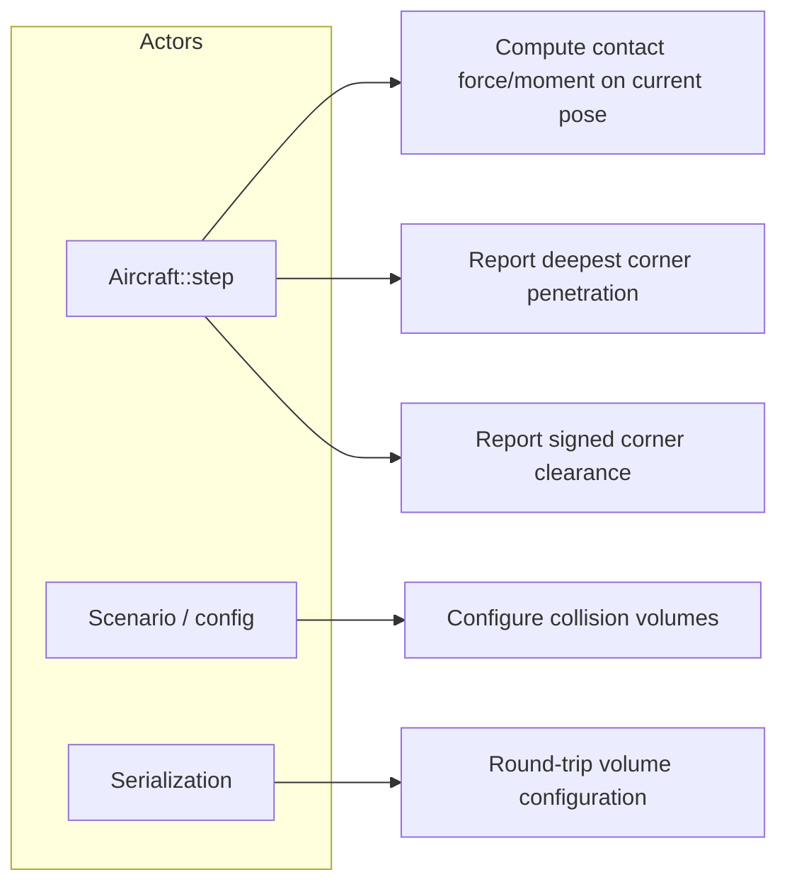
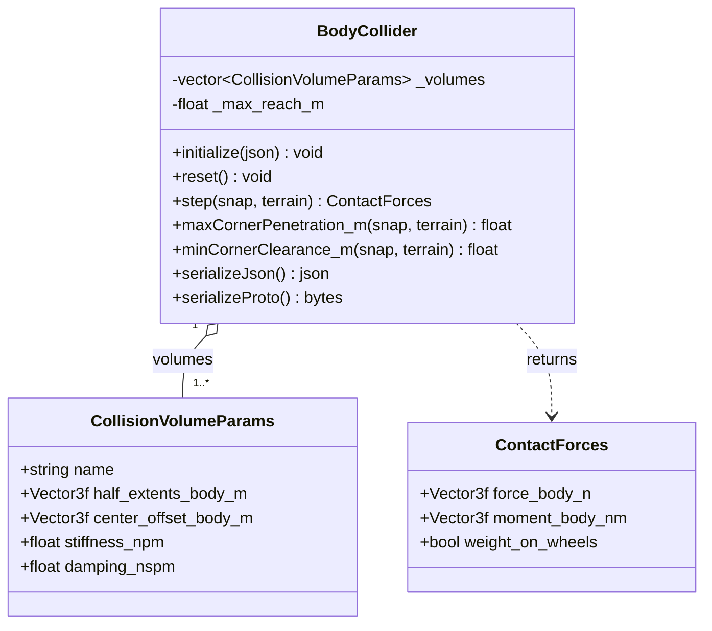
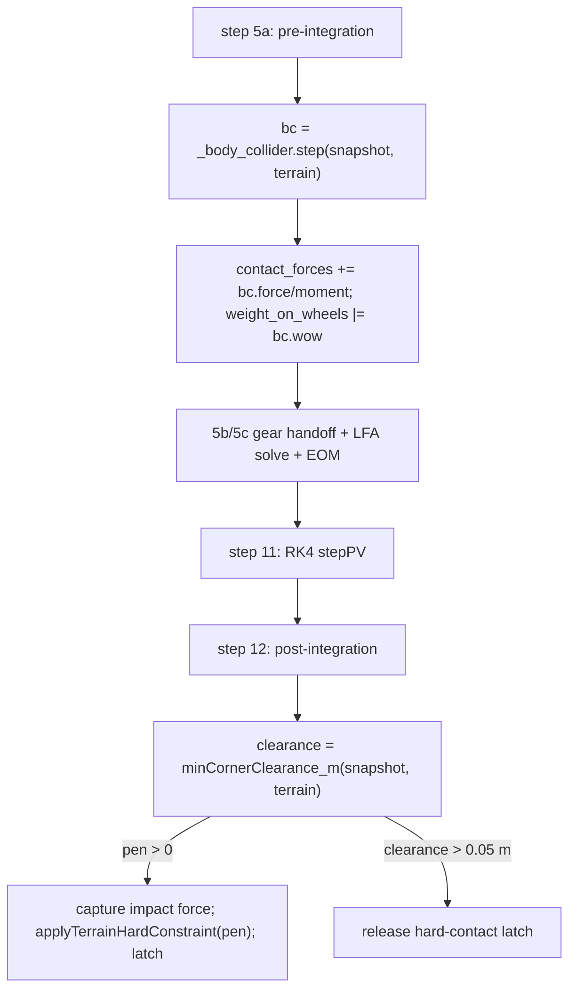

# Body Collider — Design

The body collider is a body-axis oriented-bounding-box (OBB) backstop that keeps the airframe
from penetrating terrain in attitudes and crash cases the landing gear does not cover (inverted,
deep nose-down, wing-low, gear-up). It is owned by `Aircraft` and called inside `Aircraft::step()`
both before integration (a one-step-lagged penalty force, summed with the gear reaction) and after
integration (a non-penetration hard constraint). Its design target is *protection against ground
penetration*, not a compliant suspension — the desired contact behavior is an inelastic arrest, not
an elastic rebound.

---

## Use Case Decomposition



| ID | Use Case | Primary Actor | Mechanism |
| --- | --- | --- | --- |
| UC-1 | Penalty contact force/moment on a pose | `Aircraft::step()` | `BodyCollider::step(snap, terrain)` |
| UC-2 | Deepest penetration for the hard constraint | `Aircraft::step()` | `maxCornerPenetration_m(snap, terrain)` |
| UC-3 | Signed clearance for latch release | `Aircraft::step()` | `minCornerClearance_m(snap, terrain)` |
| UC-4 | Define per-part collision boxes | Scenario / config | `initialize(config)` |
| UC-5 | Persist configuration | Serialization | `serializeJson` / `serializeProto` (+ deserialize) |

---

## Class Hierarchy



`BodyCollider` is presently **stateless** — `reset()` is a no-op and serialization round-trips
configuration only. (The decided §5c rotational-reaction design (OQ-BC-3, Alternative 1) adds a
serialized per-axis $\Delta\theta$ filter state and makes `reset()` clear it; not yet implemented.)

---

## Physical Models

The first three sections (§1–§3) describe the **as-built** model. §4 documents how the model is
coupled into `Aircraft`. §5 collects the **proposed improvements** that are not yet implemented and
points at the Open Questions that gate them.

### 1. Collision Geometry — OBB Corner Sampling

Each `CollisionVolumeParams` is a body-axis box with `half_extents_body_m` $\mathbf{h}$ and a
`center_offset_body_m` $\mathbf{c}$ from the CG. Multiple volumes per collider let the fuselage,
wings, and empennage each carry an appropriately sized box, so protection holds in any attitude.

Per step the collider tests the eight corners $\mathbf{p}_k = \mathbf{c} \pm \mathbf{h}$ of every
volume. A corner's geodetic altitude is $z_k = h_\text{ac} - (R_{NB}\,\mathbf{p}_k)_z$ (NED-z is
positive down, altitude positive up); its penetration is $\delta_k = h_\text{terrain} - z_k$, taken
to be in contact only when $\delta_k > 0$.

An **AGL early exit** skips the corner loops entirely when no volume can reach terrain:
$h_\text{ac} - h_\text{terrain} > r_\text{max}$, where $r_\text{max}=\max_v(\lVert\mathbf{c}_v\rVert +
\lVert\mathbf{h}_v\rVert)$ is the bounding-sphere reach of the worst volume over all orientations
(recomputed on `initialize`/`deserialize`).

### 2. Normal Penalty Contact (current Kelvin–Voigt model)

For each penetrating corner the model forms a linear spring–damper (Kelvin–Voigt) penalty force
along the upward terrain normal:

$$F_\text{pen} = \max\!\bigl(0,\; k\,\delta_\text{eff} + b\,\dot\delta\bigr),
\qquad \delta_\text{eff} = \min(\delta,\,2 h_z),
\qquad \dot\delta = \bigl(R_{NB}\,(\mathbf{v}_B + \boldsymbol\omega\times\mathbf{p}_k)\bigr)_z,$$

with stiffness $k=$ `stiffness_npm`, damping $b=$ `damping_nspm`, and $\dot\delta$ the corner's
sinking rate (positive down). The penetration is capped at twice the volume's vertical half-extent
to bound the spring force during deep embedding. The force is applied upward in NED, rotated to
body, and accumulated with its moment about the CG; any penetrating corner sets
`weight_on_wheels`:

$$\mathbf{F}_B = R_{BN}\,[0,0,-F_\text{pen}]^\top,\qquad
\mathbf{M}_B \mathrel{+}= \mathbf{p}_k\times\mathbf{F}_B.$$

The $\max(0,\cdot)$ floor rectifies the contact so it never pulls the airframe down (no adhesion),
and the damping term acts on both sink and rise while in contact.

**Diagnosis — why it bounces (the defect this design must fix).** A rectified linear
spring–damper is an *elastic* contact. Treating a penetrating corner as a 1-DOF impact against the
supported mass $m$, the contact damping ratio is $\zeta = b/\bigl(2\sqrt{k\,m}\bigr)$ and the
coefficient of restitution is $e = \exp\!\bigl(-\zeta\pi/\sqrt{1-\zeta^2}\bigr)$ (near-elastic for
$\zeta\ll1$, inelastic only as $\zeta\to1$). Because the configured damping $b=500\ \mathrm{N\,s/m}$
is a **fixed dimensional constant** independent of airframe mass, the realized restitution swings
wildly across the fleet for the *same* configuration:

| Fixture | $m$ (kg) | $\zeta = b/2\sqrt{km}$ | Restitution $e$ | Behavior |
| --- | --- | --- | --- | --- |
| `small_uas` | 5 | 1.12 | ≈ 0 | over-damped (inelastic) |
| `general_aviation` | 1045 | 0.077 | ≈ 0.78 | strongly elastic — rubber bounce |
| `jet_trainer` | 5500 | 0.034 | ≈ 0.90 | almost fully elastic |

This is the same failure class the landing-gear effort fixed by **non-dimensionalizing every knob**
against the airframe's own physical scale (the `dtheta_vref_mps = 24` global-default defect): a
dimensional default that is correct for one airframe is silently wrong by an order of magnitude on
another. The header comment calls this force "inelastic," but for any airframe heavier than a few
hundred kilograms it is not. Fixing it is the subject of §5a (resolved — OQ-BC-1 → velocity-arrest).

### 3. Terrain Hard-Constraint Coupling

The penalty force is a soft backstop; true non-penetration is enforced separately by the
post-integration **terrain hard constraint** (`Aircraft::step()` step 12). After RK4 integration the
collider reports `minCornerClearance_m` (signed: negative means the deepest corner is below
terrain). If any corner penetrates, `Aircraft` projects the pose up by that depth via
`KinematicState::applyTerrainHardConstraint(pen)` — which zeros the downward velocity component —
re-runs the collider on the penetrated pre-correction pose to capture the impact force/moment for
monitoring, and latches `_body_in_hard_contact`. The latch is released only on genuine separation
(`clearance > 0.05 m` hysteresis), so `weight_on_wheels` reporting stays accurate across the
penalty spring momentarily reading $\delta=0$ after a correction.

The collider therefore participates in two distinct mechanisms with different roles: a compliant
penalty force (§2) and a stiff geometric projection (this section). How these share the work is the
**resolved** design of §5b (OQ-BC-2, Alternative 2): the projection becomes the primary,
restitution-consistent mechanism (removing $(1+e)$ of the normal approach velocity, $e\approx0$,
rather than hard-zeroing it), while the penalty force is demoted to in-contact damping and the §5c
moment.

### 4. Integration with `Aircraft`

See the [Integration](#integration) section below for the call sites and data flow. The collider's
force and moment are summed into the same `ContactForces` accumulator as the landing gear
(`contact_forces.force_body_n += bc.force_body_n`, etc.), then carried into the wind-frame EOM by
the shared contact path described in [aircraft.md](aircraft.md) step 10.

### 5. Proposed Improvements (Not Yet Implemented)

> **Status: decided, not yet implemented.** Nothing in §5 is implemented, but the design of all four
> items is now **decided** — OQ-BC-1/2/3/4 are all resolved (see the resolution notes). These are the
> improvements requested for the body collider, informed by the landing-gear model: make the contact
> *inelastic* (its purpose is to arrest penetration like a crash, not to rebound like rubber), and — as
> a nice-to-have — give it gear-style rotational reactions. No open questions remain; implementation
> requires an `/impl` plan and explicit instruction.

**§5a — Inelastic normal contact: dissipation-dominated velocity-arrest (decided, OQ-BC-1 →
Alternative 3).** Replace the elastic Kelvin–Voigt penalty with a purely **dissipative** normal force
that opposes the corner sink rate, so penetration is decelerated and arrested with **no stored elastic
energy to return** — coefficient of restitution $e=0$ by construction. Per penetrating corner, with
$\delta\ge0$ the penetration and $\dot\delta$ the sink rate (positive = deeper), the force is
penetration-modulated so it rises continuously from zero at contact (the Hunt–Crossley *damping* term
without its spring), under the no-tension floor that forbids adhesion and does no work on rebound:

$$F = \max\!\bigl(0,\; c\,\delta\,\dot\delta\bigr),$$

with the simpler pure damper $F=\max(0,\,b\dot\delta)$ as the fallback if onset continuity proves
unnecessary. The single damping scale is **non-dimensional and airframe-independent**, set as an
arrest time $\tau = m_\text{eff}/b = N\,dt$ with $N\gtrsim2\text{–}3$ steps (the stability bound below)
rather than a fixed dimensional constant — the non-dimensionalization discipline applied to the gear
(§Parameterization in [landing_gear.md](landing_gear.md)). The contact provides **no static restoring
force**; static non-penetration is owned by the §5b hard constraint (OQ-BC-2 at $e=0$, itself an exact
inelastic velocity projection), and the arrest force only reduces the approach velocity so the
constraint's per-step correction stays small. *Why not a spring:* the design target $e\approx0$ makes an
energy-storing spring (Kelvin–Voigt or Hunt–Crossley) the wrong primitive — driving its restitution to
zero is the ill-conditioned regime (Hunt–Crossley's $a\!\leftrightarrow\!e$ map diverges as $e\to0$;
over-damped KV leaks a speed-dependent, only-approximate $e$ and keeps a contact-onset force step). A
dissipative arrest encodes $e=0$ directly.

**Stability of the velocity-arrest contact.** Verified across the four layers it must hold at: the
continuous dynamics, the explicit discrete scheme with the one-step lag, the composition with the
$e=0$ constraint, and the attitude loop. The model is the per-corner normal force $F=\max(0,\,b\dot\delta)$
(pure damper) or $F=\max(0,\,c\,\delta\dot\delta)$ (penetration-modulated), computed at the
pre-integration pose (one-step lag), advanced by RK4, then projected by the §5b constraint.

1. **Continuous-time dynamical stability — unconditional.** In contact under a net downward load
   $F_\text{ext}$, the 1-DOF normal model $m\ddot\delta = F_\text{ext}-b\dot\delta$ is **first order** in
   $v=\dot\delta$: $\dot v = F_\text{ext}/m - (b/m)v$, characteristic root $s=-b/m<0$, single and real.
   With no spring there is **no oscillatory mode**, so the contact is structurally incapable of bouncing
   or limit-cycling (contrast Kelvin–Voigt's complex pair $s=-\zeta\omega_n\pm j\omega_n\sqrt{1-\zeta^2}$,
   $\omega_n=\sqrt{k/m}$, which is what rings). It is strictly dissipative: contact power on the body is
   $-F v = -b v^2\le0$ while sinking, and the no-tension floor gives $F=0$ on rise, so the contact only
   ever removes normal kinetic energy — Lyapunov-stable with $\tfrac12 m v^2$ as the storage function.
   The penetration-modulated form has the same character with rate $-c\delta/m\le0$.

2. **Discrete numerical stability — one easily-met CFL-type bound.** The fast mode is $\lambda=-b/m$
   (or $-c\delta/m$); the lagged force evaluated at $v_n$ is the explicit (forward-Euler) evaluation, so
   the homogeneous update is $v_{n+1}=v_n\bigl(1-\tfrac{b}{m}dt\bigr)+\tfrac{F_\text{ext}}{m}dt$ with
   amplification $\bigl|1-\tfrac{b}{m}dt\bigr|$. Hence $b\,dt/m_\text{eff}<1$ gives monotone decay (the
   **design target**: no overshoot, no spurious one-step rebound); $1<b\,dt/m_\text{eff}<2$ is stable but
   sign-flipping (a numerical micro-bounce that would defeat $e\approx0$); $>2$ is unstable (RK4 extends
   the hard real-axis limit to $\approx2.785$). Parameterize the arrest as $\tau=m_\text{eff}/b=N\,dt$,
   $N\gtrsim2\text{–}3$. This is strictly easier than Kelvin–Voigt, which must satisfy **two** explicit
   limits ($dt<2/\omega_n$ for the spring and the damper bound) *and still bounces*. The one-step lag is
   benign here: lag erodes margin only by adding phase to a **resonant** loop (the gear/attitude limit
   cycle); a first-order non-oscillatory decay has no resonance to excite, and the lag is already counted
   in the forward-Euler bound. For the modulated form $c\delta/m$ is bounded because $\delta$ is capped
   ($2h_z$), so the same bound applies at the worst case $c(2h_z)\,dt/m_\text{eff}<1$.

3. **Composition with the $e=0$ constraint — non-expansive.** Each step the damper contracts the normal
   velocity by $(1-\tfrac{b}{m}dt)\in(0,1)$ (a contraction under the bound), and the projection sets
   $v_\text{normal}=0$ at $e=0$, which is **non-expansive** ($\lVert Pv\rVert\le\lVert v\rVert$) and
   **non-oscillatory** (it absorbs velocity; reflection would require $e>0$). A contraction composed with
   a non-expansive projection is non-expansive in normal kinetic energy — no growth, no launch. Both
   operators only remove normal velocity, so the airframe cannot be ejected; the worst case is "stuck to
   the surface" (the desired plastic behavior), and it still departs under aero/gear lift once clearance
   returns (the $0.05\text{ m}$ release hysteresis).

4. **Attitude-coupling stability — the gear failure mode does not recur.** That artifact was a loop
   (stiff spring $\to$ FPA swing $\to$ swept contact point $\to$ spring) closed by an **oscillatory**
   normal force against the zero-inertia attitude. This contact has no oscillatory normal mode to feed
   it; it routes the contact moment through the §5c (OQ-BC-3) bounded second-order low-pass with finite
   DC and no free integrator — the same $H_2$ the gear's describing-function analysis
   ([landing_gear.md §7](landing_gear.md)) established as stable — driven by a non-oscillatory moment
   (force $\propto$ a decaying velocity); and it breaks the contact-point sweep via the §5c $\Delta\theta$
   in $\theta_\text{geom}$. This layer is stable **conditional on** the §5c filter being parameterized as
   in the gear (OQ-BC-3 Alternative 1).

*Edge cases.* (a) The bound applies to the **aggregate** $N$-corner damping versus the total effective
mass/inertia, evaluated with a **conservative (small) effective mass** at the off-CG contact, so
$b_\text{total}\,dt/m_\text{min}<1$. (b) A deep single-step incursion (high sink rate $\times$ large $dt$)
penetrates a bounded $\approx v_\text{sink}\,dt$ before the lagged, capped force acts; the §5b constraint
guarantees non-penetration — transient penetration, not instability. (c) Both forms send $F\to0$
continuously as $\dot\delta\to0$ (and the modulated form as $\delta\to0$), so the no-tension switch is
$C^0$ with no force jump — this design **removes** a chatter source that Kelvin–Voigt's clipped finite
spring force introduces.

*Conclusion.* The velocity-arrest contact is dynamically stable **unconditionally** (real-negative
eigenvalue, no oscillatory mode, strictly dissipative) and numerically stable under the single bound
$b\,dt/m_\text{eff}\lesssim1$; it composes stably with the $e=0$ constraint and does not re-excite the
gear/attitude loop. It is strictly easier to keep stable than the current Kelvin–Voigt contact. The
verification holds subject to three conditions, each carried as a prerequisite or test: the aggregate
CFL bound with a conservative effective mass, the §5c moment-filter parameterization, and the §5b
constraint owning static position. When §5a is implemented, this analysis should be promoted to a
numerical-analysis document in [`docs/algorithms/`](../algorithms/) per the `/algo` convention.

**§5b — Penalty / hard-constraint role split (decided, OQ-BC-2 → Alternative 2).** The
post-integration hard constraint (§3) is the **primary** non-penetration mechanism and is made
*restitution-consistent*: instead of hard-zeroing the corner normal velocity it removes $(1+e)$ of
the normal approach component with a configured restitution $e\approx0$, bounding penetration every
step. The penalty force (§5a) is demoted to supplying in-contact damping and the contact moment for
§5c — it no longer has to be stiff enough to arrest the impact before penetration, so there is no
stiff-spring step-size penalty. The lesson from the gear is that a stiff backstop firing against the
load-factor model's near-zero-inertia, velocity-slaved attitude produces non-physical feedback and
limit cycles, and the constraint's velocity correction is a discrete analogue; the acceptance
requirement (Test Strategy `Aircraft_BodyCollider_NoRelaunch`) is that the restitution-consistent
projection does not excite the kinematic attitude.

**§5c — Gear-style rotational reaction $\Delta\theta$ (decided nice-to-have, OQ-BC-3 → Alternative
1).** A **dedicated** body-collider rotation-deviation state, driven by the collision **contact
moment** through the same bounded second-order pattern the gear uses ([landing_gear.md
§2a](landing_gear.md), properties P1–P4): a stable low-pass on $M^W/I$ that produces a body
pitch/bank deviation $\Delta\theta$ feeding the kinematic attitude, decays to zero when the contact
unloads (P1), holds a bounded steady deflection under sustained load (P2), adds no instantaneous body
angular-velocity step at contact (P3), and is driven only by contact-derived quantities (P4). It is
summed into the attitude **separately** from the gear's $\Delta\theta$ so the two contributions stay
independently inspectable. A wing-low or tail-first ground strike then pitches/rolls the airframe
*about* the contact realistically instead of the raw moment whipping the zero-inertia attitude. This
makes the collider **stateful** (currently stateless), adding a serialized per-axis filter state
(see Serialization). Depends on §5a/§5b being in place first; not yet implemented.

**§5d — Tangential scrape friction (decided, OQ-BC-4 → Alternative 1 + viscous term).** Penetrating
corners get a tangential force combining regularized Coulomb friction with a velocity-proportional
momentum-transfer (plowing) term:

$$\mathbf{F}_t = -\mu\,F_\text{pen}\,\hat{\mathbf{v}}_{t,\text{reg}} \;-\; c_t\,\mathbf{v}_t,$$

where $\mathbf{v}_t$ is the corner's tangential ground velocity, $\hat{\mathbf{v}}_{t,\text{reg}}$ is
its direction regularized near zero slip to avoid chatter, $\mu$ is the (non-dimensional) Coulomb
coefficient from the surface-friction parameterization shared with the gear, and $c_t$ is a
non-dimensional viscous coefficient (scaled to the airframe so it is mass-independent) emulating the
momentum the airframe loses plowing into terrain — the Coulomb cap alone under-represents that sink.
Both terms act only while a corner penetrates. The smooth-dynamics standard exempts contact/friction
physics from the $C^1$ requirement (see [general.md](../guidelines/general.md#smooth-dynamics)), so
the stick–slip discontinuity is acceptable here. Depends on §5a (a stable $F_\text{pen}$ to scale
the Coulomb term); not yet implemented.

---

## Integration

`Aircraft` owns a `BodyCollider _body_collider` value member, active only when the config contains a
`body_collider` section (`_has_body_collider`). It is called at two points in `Aircraft::step()`:



- **Step 5a (pre-integration, one-step lag).** `step(snapshot, *terrain)` is evaluated on the
  current pose and summed with the landing-gear reaction into `contact_forces`. Computed before the
  `LoadFactorAllocator` solve so the n_z handoff (§2b of the gear contract) sees this step's contact.
- **Step 12 (post-integration hard constraint).** Described in §3. Uses `minCornerClearance_m`
  (signed) for separation detection and `maxCornerPenetration_m` / `applyTerrainHardConstraint` for
  the projection.

The call signature consumed by `Aircraft` is
`ContactForces step(const KinematicStateSnapshot&, const Terrain&) const`. The terrain pointer must
be non-null (`_has_body_collider && _terrain != nullptr`) for either mechanism to run.

---

## Interface

```cpp
// include/collision/BodyCollider.hpp — namespace liteaero::simulation

struct CollisionVolumeParams {
    std::string     name;
    Eigen::Vector3f half_extents_body_m  = {0.5f, 0.3f, 0.2f};
    Eigen::Vector3f center_offset_body_m = Eigen::Vector3f::Zero();
    float           stiffness_npm        = 10000.f;
    float           damping_nspm         = 500.f;
};

class BodyCollider {
public:
    void initialize(const nlohmann::json& config);
    void reset() {}

    ContactForces step(const liteaero::nav::KinematicStateSnapshot& snap,
                       const liteaero::terrain::Terrain& terrain) const;
    ContactForces step(const liteaero::nav::KinematicStateSnapshot& snap) const;  // flat terrain at 0 m

    [[nodiscard]] float maxCornerPenetration_m(
        const liteaero::nav::KinematicStateSnapshot& snap,
        const liteaero::terrain::Terrain& terrain) const;          // clamped >= 0
    [[nodiscard]] float minCornerClearance_m(
        const liteaero::nav::KinematicStateSnapshot& snap,
        const liteaero::terrain::Terrain& terrain) const;          // signed

    [[nodiscard]] nlohmann::json       serializeJson() const;
    void                               deserializeJson(const nlohmann::json& j);
    [[nodiscard]] std::vector<uint8_t> serializeProto() const;
    void                               deserializeProto(const std::vector<uint8_t>& bytes);
};
```

---

## Serialization

### Serialized State

The collider is currently stateless: there is **no** mid-step state that changes between `reset()`
and a step. Serialization round-trips configuration only (the volume list). The decided §5c
rotational-reaction design (OQ-BC-3, Alternative 1) makes the collider stateful — a per-axis
$\Delta\theta$ second-order filter state will be added to the table below and to the proto message
when §5c is implemented. It is not yet implemented, so no state field exists today.

| Field | Type | Unit | Description |
| --- | --- | --- | --- |
| _(none)_ | — | — | Stateless; configuration-only serialization. |

Configuration (not serialized state) per volume: `name`, `half_extents_body_m`,
`center_offset_body_m`, `stiffness_npm`, `damping_nspm`. The volume count here is below the
ten-field threshold that would warrant a standalone schema document; it is specified inline.

### Proto Message

```proto
message CollisionVolumeParams {
    string   name                 = 1;
    Vector3f half_extents_body_m  = 2;
    Vector3f center_offset_body_m = 3;
    float    stiffness_npm        = 4;
    float    damping_nspm         = 5;
}

message BodyColliderParams {
    int32                          schema_version = 1;
    repeated CollisionVolumeParams volumes        = 2;
}
```

---

## Computational Resource Estimate

| Operation | Count per outer step |
| --- | --- |
| AGL early-exit test | 1 (skips everything below when clear) |
| Corner penetration tests | $8 \times N_\text{vol}$ rotations + compares |
| Penalty force/moment | $\le 8 \times N_\text{vol}$ (penetrating corners only) |
| `minCornerClearance_m` (step 12) | $8 \times N_\text{vol}$ |

For a typical 3-volume airframe (fuselage, wings, tail) that is $\le 24$ corner evaluations for the
penalty pass plus 24 for the clearance pass, each a $3\times3$ rotation and a scalar compare. Memory
footprint is the volume list (five scalars + a name per volume) and one cached `_max_reach_m`. At a
nominal outer step this is negligible relative to the LFA solve and aero model. The decided §5c
design adds a per-axis second-order filter step (a handful of multiply-adds); §5d adds a tangential
force per penetrating corner.

---

## Open Questions

_No open questions remain — OQ-BC-1…4 are all resolved; see the resolution notes below._

| ID | Summary | Blocking |
| --- | --- | --- |
| _(none open)_ | — | — |

### OQ-BC-1 — Inelastic Normal-Contact Formulation *(Resolved)*

**Resolution (Alternative 3 — dissipation-dominated velocity-arrest).** The normal contact is a purely
dissipative velocity-arrest force (no spring), giving $e=0$ by construction; the decided design, its
force forms, parameterization, and the full numerical/dynamical stability verification are in §5a.
**Rationale (user):** the design target is a coefficient of restitution of zero or near zero, and a
penalty spring is an energy-storage device whose restitution can only be driven to zero in an
ill-conditioned regime (Hunt–Crossley's $a\!\leftrightarrow\!e$ map diverges as $e\to0$; over-damped
Kelvin–Voigt leaves a speed-dependent, only-approximate $e$ with a contact-onset force step). A
dissipative arrest encodes $e=0$ directly and is consistent with the resolved OQ-BC-2, where restitution
is owned by the $e=0$ hard constraint. **Verification:** numerical and dynamical stability confirmed in
§5a — first-order non-oscillatory decay that is strictly dissipative (cannot bounce or limit-cycle); a
single explicit-scheme bound $b\,dt/m_\text{eff}\lesssim1$; non-expansive composition with the $e=0$
projection; no re-excitation of the gear/attitude loop. **Caveats / prerequisites carried into
implementation:** the stability bound applies to the aggregate corner damping with a conservative
effective mass; the §5c moment filter must be parameterized as in the gear; the §5b constraint must hold
static belly-rest position with no normal spring; and the §5a stability analysis should be promoted to a
`docs/algorithms/` numerical-analysis document when implemented. Not yet implemented.

### OQ-BC-2 — Penalty / Hard-Constraint Role Split *(Resolved)*

**Resolution (Alternative 2 — constraint-primary, restitution-consistent).** The post-integration
terrain hard constraint (§3) is the primary non-penetration mechanism and becomes
restitution-consistent: instead of hard-zeroing the corner normal velocity it removes $(1+e)$ of the
normal approach component with a configured restitution $e\approx0$, bounding penetration every step.
The penalty force (§2/§5a) is demoted to supplying in-contact damping and the contact moment that
drives the §5c rotation deviation; it no longer has to be stiff enough to arrest the impact before
penetration. **Rationale (user):** bound penetration every step without a stiff-spring step-size
penalty, and concentrate restitution in one explicit parameter. **Caveat:** the restitution-consistent
projection still acts on the kinematic, near-zero-inertia attitude, so it must be shown not to excite
it — the acceptance test `Aircraft_BodyCollider_NoRelaunch` in the Test Strategy. Implementation
requires extending `applyTerrainHardConstraint` to carry a restitution coefficient, remains gated on
§5a (the normal-force law that supplies the residual damping/moment), and is not yet begun.

### OQ-BC-3 — Gear-Style Rotational Reaction $\Delta\theta$ *(Resolved)*

**Resolution (Alternative 1 — dedicated body-collider $\Delta\theta$ channel).** The body collider
gains its own rotation-deviation state driven by the collision contact moment through the §2a
low-pass $H_2$ on $M^W/I$ (properties P1–P4), summed into the kinematic attitude **separately** from
the gear's $\Delta\theta$ so the gear and body-strike contributions stay independently inspectable.
**Rationale (user):** keep the collider a self-contained subsystem with attributable dynamics.
**Consequences:** the collider becomes **stateful** — it acquires a serialized per-axis filter state
(the Serialized State table and the proto message are to be extended when implemented), `reset()`
clears it, and the §2a filter parameterization (per-axis $\omega_n,\zeta$ from the inertia tensor) is
configured at `initialize`. This is the labeled nice-to-have; it depends on §5a/§5b (a
well-behaved contact force/moment to drive the channel) and is not yet begun.

### OQ-BC-4 — Tangential Scrape Friction *(Resolved)*

**Resolution (Alternative 1, extended with a velocity-proportional momentum-transfer term).**
Penetrating corners get a tangential force combining (a) regularized Coulomb friction
$-\mu\,F_\text{pen}\,\hat{\mathbf{v}}_{t,\text{reg}}$ opposing the corner's tangential ground velocity
$\mathbf{v}_t$ (regularized near zero slip to avoid chatter), **and** (b) a velocity-proportional
viscous term $-c_t\,\mathbf{v}_t$ that emulates the momentum the airframe transfers into the ground as
it plows/scrapes — total $\mathbf{F}_t = -\mu\,F_\text{pen}\,\hat{\mathbf{v}}_{t,\text{reg}} -
c_t\,\mathbf{v}_t$, active only while the corner penetrates. **Rationale (user):** a frictionless
slide is unphysical for an inelastic crash, and a pure Coulomb cap under-represents the momentum lost
plowing into terrain; the viscous term captures that sink, bleeding tangential momentum at a rate set
by $c_t$ rather than capping at the Coulomb friction alone. Both coefficients are non-dimensionalized
— $\mu$ from the surface-friction parameterization shared with the gear, $c_t$ scaled to the airframe
so it is mass-independent. The stick–slip and contact-onset discontinuities are acceptable under the
contact/friction exemption to the smooth-dynamics standard. Implementation depends on §5a
(a stable normal force $F_\text{pen}$ to scale the Coulomb term) and is not yet begun.

---

## Test Strategy

### Unit Tests

| Test | Input | Pass criterion |
| --- | --- | --- |
| `BodyCollider_NoPenetration_ZeroForce` | Pose above terrain by > $r_\text{max}$ | Zero force/moment; `weight_on_wheels == false`; early exit taken |
| `BodyCollider_SingleCornerPenetration_UpwardForce` | One corner below terrain, others above | Net body force has upward NED component; moment about CG nonzero |
| `BodyCollider_DeepEmbed_ForceCapped` | Penetration $\gg 2 h_z$ | Force uses $\delta_\text{eff}=2h_z$, not raw $\delta$ |
| `BodyCollider_RisingCorner_NoSuction` | Penetrating corner with upward velocity | $F_\text{pen} \ge 0$ (floor holds, no downward pull) |
| `BodyCollider_InvertedAttitude_Protected` | Inverted pose, top volume penetrating | Nonzero contact force in the correct direction |
| `BodyCollider_InelasticContact_RestitutionNearZero` *(§5a — decided, not yet implemented)* | Vertical drop of each fixture mass onto flat terrain | Rebound speed / impact speed $\le e_\text{config}$ for all fixtures (airframe-independent) |
| `BodyCollider_Scrape_DeceleratesSlide` *(§5d — decided, not yet implemented)* | Penetrating corner sliding tangentially | Tangential force opposes $\mathbf{v}_t$; slide decelerates (Coulomb + viscous $c_t$ terms both present) |

### Integration Tests

| Test | Input | Pass criterion |
| --- | --- | --- |
| `Aircraft_BodyCollider_HardConstraintReleasesLatch` | Penetrate then separate by > 0.05 m | `_body_in_hard_contact` clears on genuine separation |
| `Aircraft_BodyCollider_NoRelaunch` *(§5b — decided, not yet implemented)* | Gear-up touchdown on the collider | Restitution-consistent hard constraint arrests vertical velocity without rebound above $e_\text{config}$; kinematic attitude not excited |
| `Aircraft_BodyCollider_WingStrikeRotates` *(§5c — decided, not yet implemented)* | Wing-low contact | Body rolls toward level via the collider's dedicated $\Delta\theta$; deviation decays to zero after separation (P1) |

### Scenario Tests

| Test | Input | Pass criterion |
| --- | --- | --- |
| `test_body_collider_landing_no_bounce` (notebook/pytest) | Belly-landing descent profile | No rubber-bounce limit cycle; aircraft settles and stays settled |

### Serialization Tests

| Test | Input | Pass criterion |
| --- | --- | --- |
| `BodyCollider_JsonRoundTrip` | Multi-volume config | `deserializeJson(serializeJson())` reproduces all volumes |
| `BodyCollider_ProtoRoundTrip` | Multi-volume config | `deserializeProto(serializeProto())` reproduces all volumes |

---

## References

| Reference | Relevance |
| --- | --- |
| [landing_gear.md](landing_gear.md) | §2a rotation-deviation pattern (P1–P4) for §5c; non-dimensionalization discipline for §5a; §2b contact-force handoff |
| [aircraft.md](aircraft.md) | Owner; step 5a / step 12 call sites; wind-frame contact path |
| [terrain.md](terrain.md) | Terrain height query consumed by corner penetration tests |
| [general.md §Smooth Dynamics](../guidelines/general.md#smooth-dynamics) | Friction/contact exemption from the $C^1$ standard (§5d) |
| [aircraft_config_v1 schema](../schemas/aircraft_config_v1.md) | `body_collider` configuration block |
