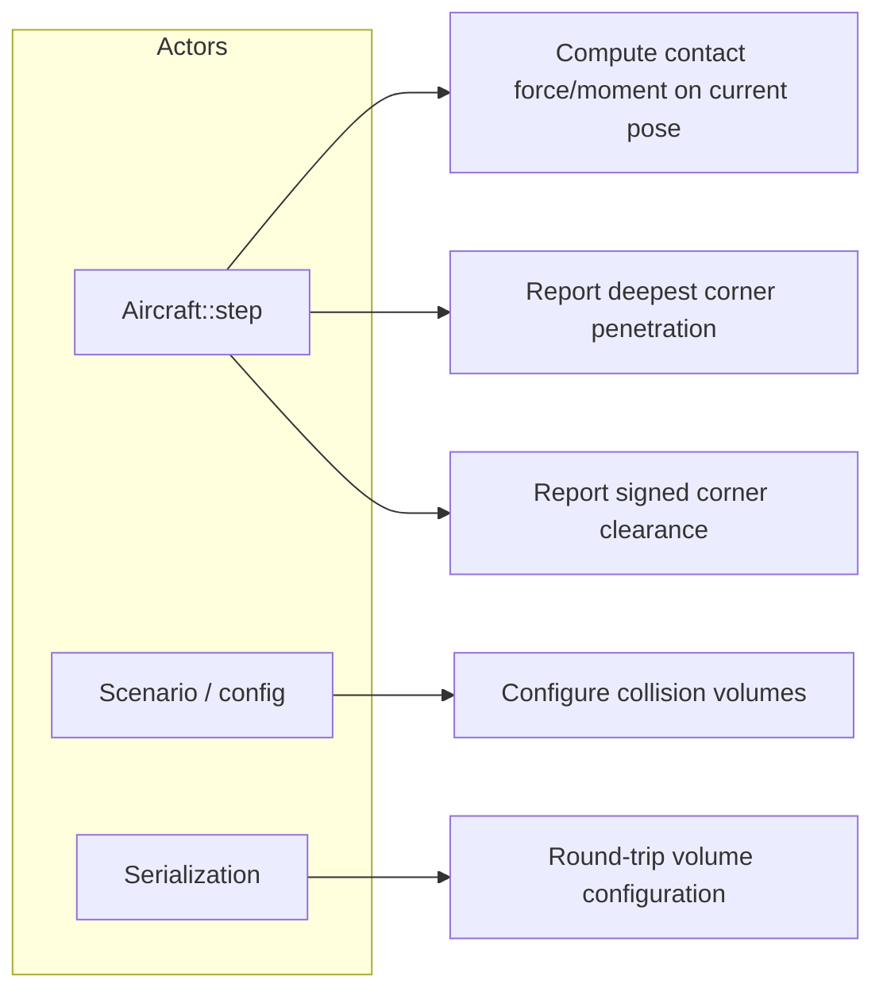
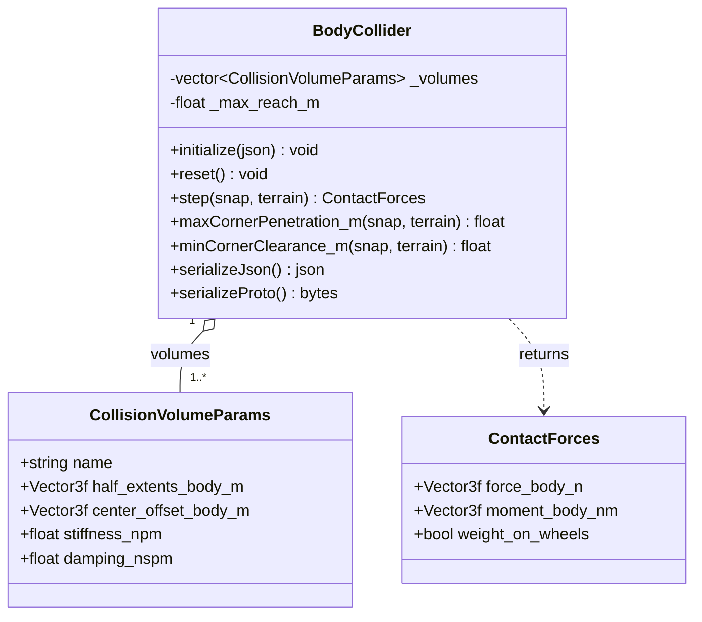
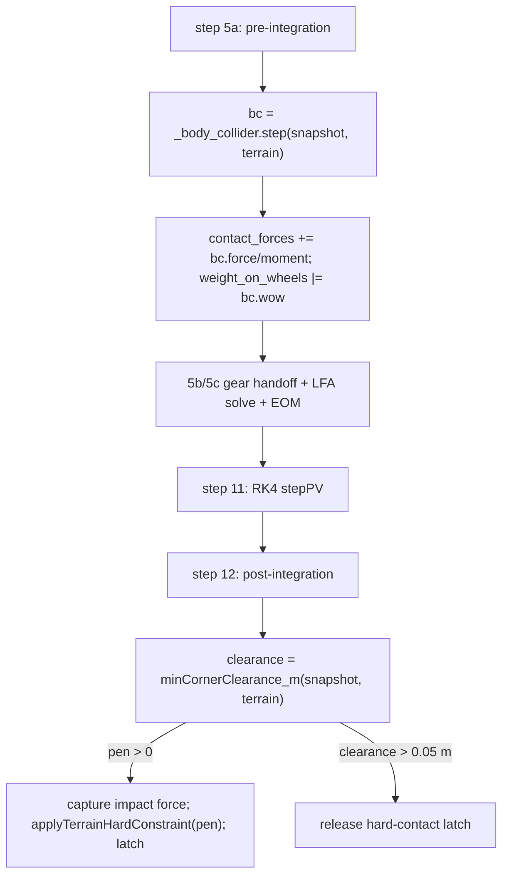

# Body Collider — Design

The body collider is a body-axis oriented-bounding-box (OBB) backstop that keeps the airframe
from penetrating terrain in attitudes and crash cases the landing gear does not cover (inverted,
deep nose-down, wing-low, gear-up). It is owned by `Aircraft` and called inside `Aircraft::step()`
both before integration (a one-step-lagged penalty force, summed with the gear reaction) and after
integration (a non-penetration hard constraint). Its design target is *protection against ground
penetration*, not a compliant suspension — the desired contact behavior is an inelastic arrest, not
an elastic rebound.

---

## Use Case Decomposition



| ID | Use Case | Primary Actor | Mechanism |
| --- | --- | --- | --- |
| UC-1 | Penalty contact force/moment on a pose | `Aircraft::step()` | `BodyCollider::step(snap, terrain)` |
| UC-2 | Deepest penetration for the hard constraint | `Aircraft::step()` | `maxCornerPenetration_m(snap, terrain)` |
| UC-3 | Signed clearance for latch release | `Aircraft::step()` | `minCornerClearance_m(snap, terrain)` |
| UC-4 | Define per-part collision boxes | Scenario / config | `initialize(config)` |
| UC-5 | Persist configuration | Serialization | `serializeJson` / `serializeProto` (+ deserialize) |

---

## Class Hierarchy



`BodyCollider` is presently **stateless** — `reset()` is a no-op and serialization round-trips
configuration only. (The §5c rotational-reaction proposal would add serialized state; see the
Open Questions.)

---

## Physical Models

The first three sections (§1–§3) describe the **as-built** model. §4 documents how the model is
coupled into `Aircraft`. §5 collects the **proposed improvements** that are not yet implemented and
points at the Open Questions that gate them.

### 1. Collision Geometry — OBB Corner Sampling

Each `CollisionVolumeParams` is a body-axis box with `half_extents_body_m` $\mathbf{h}$ and a
`center_offset_body_m` $\mathbf{c}$ from the CG. Multiple volumes per collider let the fuselage,
wings, and empennage each carry an appropriately sized box, so protection holds in any attitude.

Per step the collider tests the eight corners $\mathbf{p}_k = \mathbf{c} \pm \mathbf{h}$ of every
volume. A corner's geodetic altitude is $z_k = h_\text{ac} - (R_{NB}\,\mathbf{p}_k)_z$ (NED-z is
positive down, altitude positive up); its penetration is $\delta_k = h_\text{terrain} - z_k$, taken
to be in contact only when $\delta_k > 0$.

An **AGL early exit** skips the corner loops entirely when no volume can reach terrain:
$h_\text{ac} - h_\text{terrain} > r_\text{max}$, where $r_\text{max}=\max_v(\lVert\mathbf{c}_v\rVert +
\lVert\mathbf{h}_v\rVert)$ is the bounding-sphere reach of the worst volume over all orientations
(recomputed on `initialize`/`deserialize`).

### 2. Normal Penalty Contact (current Kelvin–Voigt model)

For each penetrating corner the model forms a linear spring–damper (Kelvin–Voigt) penalty force
along the upward terrain normal:

$$F_\text{pen} = \max\!\bigl(0,\; k\,\delta_\text{eff} + b\,\dot\delta\bigr),
\qquad \delta_\text{eff} = \min(\delta,\,2 h_z),
\qquad \dot\delta = \bigl(R_{NB}\,(\mathbf{v}_B + \boldsymbol\omega\times\mathbf{p}_k)\bigr)_z,$$

with stiffness $k=$ `stiffness_npm`, damping $b=$ `damping_nspm`, and $\dot\delta$ the corner's
sinking rate (positive down). The penetration is capped at twice the volume's vertical half-extent
to bound the spring force during deep embedding. The force is applied upward in NED, rotated to
body, and accumulated with its moment about the CG; any penetrating corner sets
`weight_on_wheels`:

$$\mathbf{F}_B = R_{BN}\,[0,0,-F_\text{pen}]^\top,\qquad
\mathbf{M}_B \mathrel{+}= \mathbf{p}_k\times\mathbf{F}_B.$$

The $\max(0,\cdot)$ floor rectifies the contact so it never pulls the airframe down (no adhesion),
and the damping term acts on both sink and rise while in contact.

**Diagnosis — why it bounces (the defect this design must fix).** A rectified linear
spring–damper is an *elastic* contact. Treating a penetrating corner as a 1-DOF impact against the
supported mass $m$, the contact damping ratio is $\zeta = b/\bigl(2\sqrt{k\,m}\bigr)$ and the
coefficient of restitution is $e = \exp\!\bigl(-\zeta\pi/\sqrt{1-\zeta^2}\bigr)$ (near-elastic for
$\zeta\ll1$, inelastic only as $\zeta\to1$). Because the configured damping $b=500\ \text{N·s/m}$
is a **fixed dimensional constant** independent of airframe mass, the realized restitution swings
wildly across the fleet for the *same* configuration:

| Fixture | $m$ (kg) | $\zeta = b/2\sqrt{km}$ | Restitution $e$ | Behavior |
| --- | --- | --- | --- | --- |
| `small_uas` | 5 | 1.12 | ≈ 0 | over-damped (inelastic) |
| `general_aviation` | 1045 | 0.077 | ≈ 0.78 | strongly elastic — rubber bounce |
| `jet_trainer` | 5500 | 0.034 | ≈ 0.90 | almost fully elastic |

This is the same failure class the landing-gear effort fixed by **non-dimensionalizing every knob**
against the airframe's own physical scale (the `dtheta_vref_mps = 24` global-default defect): a
dimensional default that is correct for one airframe is silently wrong by an order of magnitude on
another. The header comment calls this force "inelastic," but for any airframe heavier than a few
hundred kilograms it is not. Fixing it is the subject of §5a and **OQ-BC-1**.

### 3. Terrain Hard-Constraint Coupling

The penalty force is a soft backstop; true non-penetration is enforced separately by the
post-integration **terrain hard constraint** (`Aircraft::step()` step 12). After RK4 integration the
collider reports `minCornerClearance_m` (signed: negative means the deepest corner is below
terrain). If any corner penetrates, `Aircraft` projects the pose up by that depth via
`KinematicState::applyTerrainHardConstraint(pen)` — which zeros the downward velocity component —
re-runs the collider on the penetrated pre-correction pose to capture the impact force/moment for
monitoring, and latches `_body_in_hard_contact`. The latch is released only on genuine separation
(`clearance > 0.05 m` hysteresis), so `weight_on_wheels` reporting stays accurate across the
penalty spring momentarily reading $\delta=0$ after a correction.

The collider therefore participates in two distinct mechanisms with different roles: a compliant
penalty force (§2) and a stiff geometric projection (this section). A central design question
(**OQ-BC-2**) is how these two should share the work so the *constraint's* velocity-zeroing does not
itself reintroduce a discontinuous kick.

### 4. Integration with `Aircraft`

See the [Integration](#integration) section below for the call sites and data flow. The collider's
force and moment are summed into the same `ContactForces` accumulator as the landing gear
(`contact_forces.force_body_n += bc.force_body_n`, etc.), then carried into the wind-frame EOM by
the shared contact path described in [aircraft.md](aircraft.md) step 10.

### 5. Proposed Improvements (Not Yet Implemented)

> **Status: proposed.** Nothing in §5 is implemented. Each item is gated by an open question
> (OQ-BC-1…4) carrying the alternatives and a recommendation. These are the improvements requested
> for the body collider, informed by the landing-gear model: make the contact *inelastic* (its
> purpose is to arrest penetration like a crash, not to rebound like rubber), and — as a nice-to-have
> — give it gear-style rotational reactions.

**§5a — Near-zero-restitution normal contact (OQ-BC-1).** Replace the elastic Kelvin–Voigt penalty
with an inelastic contact whose **coefficient of restitution $e$ is the configured, non-dimensional
design parameter** (target $e\approx0$), with the dimensional damping *derived* from $e$, the
stiffness, and the supported mass so the behavior is airframe-independent — exactly the
non-dimensionalization discipline applied to the gear (§Parameterization in
[landing_gear.md](landing_gear.md)). Candidate formulations (over-damped linear Kelvin–Voigt vs.
Hunt–Crossley contact damping vs. an explicit normal-velocity-arrest law) are weighed in OQ-BC-1.

**§5b — Penalty / hard-constraint role split (OQ-BC-2).** Reframe the two mechanisms so the penalty
force is the primary *energy absorber* that inelastically bleeds the normal approach velocity, while
the hard constraint (§3) is a pure last-resort *non-penetration projection*. The lesson from the
gear is that a stiff backstop firing against the load-factor model's near-zero-inertia, velocity-
slaved attitude produces non-physical feedback and limit cycles; the constraint's instantaneous
velocity-zeroing is a discrete analogue of that. OQ-BC-2 decides how to make the projection
restitution-consistent (or redundant once §5a absorbs the impact) so it does not relaunch the
airframe.

**§5c — Gear-style rotational reaction $\Delta\theta$ (nice-to-have, OQ-BC-3).** Route the collision
**contact moment** through the same bounded second-order rotation-deviation pattern the gear uses
([landing_gear.md §2a](landing_gear.md), properties P1–P4): a stable low-pass on $M^W/I$ that
produces a body pitch/bank deviation $\Delta\theta$ feeding the kinematic attitude, decays to zero
when the contact unloads (P1), holds a bounded steady deflection under sustained load (P2), adds no
instantaneous body angular-velocity step at contact (P3), and is driven only by contact-derived
quantities (P4). A wing-low or tail-first ground strike would then pitch/roll the airframe *about*
the contact realistically instead of the raw moment whipping the zero-inertia attitude. This makes
the collider **stateful** (currently stateless) with a serialization impact; OQ-BC-3 also decides
whether to share the gear's existing $\Delta\theta$ machinery or keep a separate channel.

**§5d — Tangential scrape friction (optional companion, OQ-BC-4).** The model currently applies
**no** tangential force, so a belly or wingtip scrape slides frictionlessly — unphysical for an
inelastic crash, where surface friction decelerates the slide. OQ-BC-4 weighs adding a Coulomb /
regularized-Stribeck tangential force at penetrating corners against leaving longitudinal deceleration
to the gear/aero only. The smooth-dynamics standard exempts contact/friction physics from the $C^1$
requirement (see [general.md](../guidelines/general.md#smooth-dynamics)), so a friction
discontinuity at the stick–slip transition is acceptable here.

---

## Integration

`Aircraft` owns a `BodyCollider _body_collider` value member, active only when the config contains a
`body_collider` section (`_has_body_collider`). It is called at two points in `Aircraft::step()`:



- **Step 5a (pre-integration, one-step lag).** `step(snapshot, *terrain)` is evaluated on the
  current pose and summed with the landing-gear reaction into `contact_forces`. Computed before the
  `LoadFactorAllocator` solve so the n_z handoff (§2b of the gear contract) sees this step's contact.
- **Step 12 (post-integration hard constraint).** Described in §3. Uses `minCornerClearance_m`
  (signed) for separation detection and `maxCornerPenetration_m` / `applyTerrainHardConstraint` for
  the projection.

The call signature consumed by `Aircraft` is
`ContactForces step(const KinematicStateSnapshot&, const Terrain&) const`. The terrain pointer must
be non-null (`_has_body_collider && _terrain != nullptr`) for either mechanism to run.

---

## Interface

```cpp
// include/collision/BodyCollider.hpp — namespace liteaero::simulation

struct CollisionVolumeParams {
    std::string     name;
    Eigen::Vector3f half_extents_body_m  = {0.5f, 0.3f, 0.2f};
    Eigen::Vector3f center_offset_body_m = Eigen::Vector3f::Zero();
    float           stiffness_npm        = 10000.f;
    float           damping_nspm         = 500.f;
};

class BodyCollider {
public:
    void initialize(const nlohmann::json& config);
    void reset() {}

    ContactForces step(const liteaero::nav::KinematicStateSnapshot& snap,
                       const liteaero::terrain::Terrain& terrain) const;
    ContactForces step(const liteaero::nav::KinematicStateSnapshot& snap) const;  // flat terrain at 0 m

    [[nodiscard]] float maxCornerPenetration_m(
        const liteaero::nav::KinematicStateSnapshot& snap,
        const liteaero::terrain::Terrain& terrain) const;          // clamped >= 0
    [[nodiscard]] float minCornerClearance_m(
        const liteaero::nav::KinematicStateSnapshot& snap,
        const liteaero::terrain::Terrain& terrain) const;          // signed

    [[nodiscard]] nlohmann::json       serializeJson() const;
    void                               deserializeJson(const nlohmann::json& j);
    [[nodiscard]] std::vector<uint8_t> serializeProto() const;
    void                               deserializeProto(const std::vector<uint8_t>& bytes);
};
```

---

## Serialization

### Serialized State

The collider is currently stateless: there is **no** mid-step state that changes between `reset()`
and a step. Serialization round-trips configuration only (the volume list). The §5c rotational-
reaction proposal would add a serialized $\Delta\theta$ filter state; that field table will be added
here if and when OQ-BC-3 is resolved in favor of a stateful collider.

| Field | Type | Unit | Description |
| --- | --- | --- | --- |
| _(none)_ | — | — | Stateless; configuration-only serialization. |

Configuration (not serialized state) per volume: `name`, `half_extents_body_m`,
`center_offset_body_m`, `stiffness_npm`, `damping_nspm`. The volume count here is below the
ten-field threshold that would warrant a standalone schema document; it is specified inline.

### Proto Message

```proto
message CollisionVolumeParams {
    string   name                 = 1;
    Vector3f half_extents_body_m  = 2;
    Vector3f center_offset_body_m = 3;
    float    stiffness_npm        = 4;
    float    damping_nspm         = 5;
}

message BodyColliderParams {
    int32                          schema_version = 1;
    repeated CollisionVolumeParams volumes        = 2;
}
```

---

## Computational Resource Estimate

| Operation | Count per outer step |
| --- | --- |
| AGL early-exit test | 1 (skips everything below when clear) |
| Corner penetration tests | $8 \times N_\text{vol}$ rotations + compares |
| Penalty force/moment | $\le 8 \times N_\text{vol}$ (penetrating corners only) |
| `minCornerClearance_m` (step 12) | $8 \times N_\text{vol}$ |

For a typical 3-volume airframe (fuselage, wings, tail) that is $\le 24$ corner evaluations for the
penalty pass plus 24 for the clearance pass, each a $3\times3$ rotation and a scalar compare. Memory
footprint is the volume list (five scalars + a name per volume) and one cached `_max_reach_m`. At a
nominal outer step this is negligible relative to the LFA solve and aero model. The §5c proposal
would add a per-axis second-order filter step (a handful of multiply-adds).

---

## Open Questions

| ID | Summary | Blocking |
| --- | --- | --- |
| OQ-BC-1 | Inelastic (near-zero-restitution) normal-contact formulation | §5a implementation |
| OQ-BC-2 | Penalty / hard-constraint role split and avoiding the projection rebound | §5b implementation |
| OQ-BC-3 | Whether to add a gear-style rotational-reaction $\Delta\theta$ state | §5c implementation |
| OQ-BC-4 | Tangential scrape friction at penetrating corners | §5d implementation |

### OQ-BC-1 — Inelastic Normal-Contact Formulation

**Problem.** The body collider's purpose is to arrest ground penetration in crash and unusual-
attitude cases. The current rectified linear Kelvin–Voigt penalty (§2) is *elastic*: with a fixed
dimensional damping constant the realized coefficient of restitution ranges from ≈0 on a 5 kg UAS to
≈0.9 on a 5500 kg trainer (§2 diagnosis table), producing the rubber-bounce behavior the model is
meant to avoid. We need a normal-contact law that delivers a **configured, airframe-independent
restitution of approximately zero** — an inelastic crash, not a rebound — without reintroducing a
hardcoded dimensional constant.

**Alternatives:**

1. **Over-damped linear Kelvin–Voigt with derived damping.** Keep $F=\max(0,k\delta+b\dot\delta)$
   but configure a **non-dimensional restitution $e$** (or damping ratio $\zeta$) and derive
   $b = 2\zeta\sqrt{k\,m}$ from the supported mass at `initialize`, choosing $\zeta\ge1$ for
   $e\approx0$.
   - **Benefits:** Minimal change to the existing model; restitution becomes airframe-independent;
     reuses the exact non-dimensionalization pattern proven on the gear.
   - **Drawbacks:** Linear KV has a force discontinuity at first contact ($\dot\delta$ jumps the
     damper force from 0 to $b\dot\delta$) and the $\max(0,\cdot)$ release truncates the damper near
     separation, so $e$ is only approximate; "supported mass" is ambiguous for a multi-volume,
     off-CG contact.
   - **Prerequisites:** A defensible per-volume effective-mass estimate; a config field for $e$ or
     $\zeta$.

2. **Hunt–Crossley nonlinear contact damping.** Use $F=\max(0,\,k\delta^p(1+a\,\dot\delta))$ (commonly
   $p=1$), where the damping is modulated by penetration so the force rises continuously from zero at
   contact and returns continuously to zero at separation, with a clean closed-form map from $a$ to a
   target restitution.
   - **Benefits:** No force step at contact onset or separation; restitution is a well-defined,
     tunable function of $a$; the physically standard penalty-contact model for controlled
     restitution.
   - **Drawbacks:** More involved than KV; still a penalty spring (finite stiffness → finite
     penetration before the hard constraint engages); $a$↔$e$ map assumes the impact-speed regime.
   - **Prerequisites:** Selecting $p$ and the $a$↔$e$ calibration; a config field for the target $e$.

3. **Explicit normal-velocity-arrest law.** Drop the spring entirely on the normal axis and instead
   command a force that drives the corner's approach velocity $\dot\delta$ toward zero over a short
   arrest time (analogous to the gear force channel's "arresting the descent" framing,
   [landing_gear.md §2a](landing_gear.md)), letting the §3 hard constraint own non-penetration.
   - **Benefits:** Directly encodes "inelastic" ($e=0$ by construction); no stored elastic energy to
     return; conceptually unifies with the gear's arrest model and the hard constraint's role.
   - **Drawbacks:** Largest departure from the current model; needs an arrest-time scale (another
     parameter to non-dimensionalize); interaction with the one-step lag (§4) and the hard
     constraint must be worked out carefully.
   - **Prerequisites:** Resolution of OQ-BC-2 (role split); an arrest-time parameterization.

**Recommendation.** Pursue **Alternative 2 (Hunt–Crossley)** for the normal force: it gives a
well-defined, airframe-independent restitution targetable at ≈0 *and* removes the contact-onset force
discontinuity, while staying a drop-in penalty model that needs no effective-mass estimate. Configure
the target restitution as a non-dimensional field and calibrate $a$ at `initialize`. Fall back to
Alternative 1 if the $a$↔$e$ calibration proves fragile across the speed range. Decide jointly with
OQ-BC-2.

### OQ-BC-2 — Penalty / Hard-Constraint Role Split

**Problem.** Non-penetration is enforced twice: a compliant penalty force (§2) and a stiff geometric
projection that zeros the downward velocity (§3). If the penalty does not absorb the impact, the
projection arrests it discontinuously — a discrete kick against the load-factor model's near-zero-
inertia attitude, the same class of artifact the gear effort traced to a stiff backstop fighting the
velocity-slaved attitude. We must decide how the two share the work once §5a makes the penalty
inelastic.

**Alternatives:**

1. **Penalty-primary, constraint-as-rare-backstop.** Tune the inelastic penalty (OQ-BC-1) stiff/
   damped enough that it arrests normal velocity before the integrator penetrates far, so the hard
   constraint fires only on large single-step incursions (deep crash, tunneling). Keep the
   constraint's velocity-zeroing as-is.
   - **Benefits:** Smoothest normal behavior; the violent projection becomes a rare safety net.
   - **Drawbacks:** A stiff penalty shortens the stable explicit-integration step; "rare" is
     scenario-dependent.
   - **Prerequisites:** A stiffness/step-size stability check at the outer rate.

2. **Constraint-primary, penalty-as-damper.** Let the hard constraint own non-penetration every step
   but make its velocity correction **restitution-consistent** (remove only $(1+e)$ of the normal
   approach velocity with $e\approx0$ rather than hard-zeroing), with the penalty supplying only
   in-contact damping and the moment for §5c.
   - **Benefits:** Bounded penetration every step regardless of stiffness; one explicit restitution
     knob shared with OQ-BC-1; no stiff-spring step-size penalty.
   - **Drawbacks:** Moves restitution into the constraint, partially duplicating OQ-BC-1; the
     projection still acts on the kinematic attitude and must be shown not to whip it.
   - **Prerequisites:** Extending `applyTerrainHardConstraint` to a restitution coefficient.

3. **Single mechanism.** Collapse to one — either pure penalty (drop the projection, accept bounded
   penetration) or pure constraint (drop the penalty normal force, keep it only for the moment/WoW).
   - **Benefits:** No coordination problem; simplest to reason about.
   - **Drawbacks:** Pure penalty cannot guarantee non-penetration; pure constraint loses the
     compliant in-contact force that feeds the n_z handoff and §5c smoothly.
   - **Prerequisites:** None beyond choosing the survivor.

**Recommendation.** Adopt **Alternative 2 (constraint-primary, restitution-consistent)**: it bounds
penetration every step without a stiff-spring step-size penalty and exposes a *single* restitution
parameter shared with OQ-BC-1, keeping the penalty force's remaining job (in-contact damping plus the
contact moment for §5c) well-defined. This requires validating that the restitution-consistent
projection does not excite the kinematic attitude — the explicit acceptance test for this OQ.

### OQ-BC-3 — Gear-Style Rotational Reaction $\Delta\theta$

**Problem.** The collider returns a contact moment, but in the load-factor `Aircraft` that moment has
no inertial path: the attitude is kinematic (FPA + α), so a long-lever contact moment either does
nothing rotational or, fed naively, whips the zero-inertia attitude — the artifact the gear's §2a
rotation-deviation state was built to cure. Should the body collider gain an equivalent
$\Delta\theta$ so a wing/tail/belly strike produces a realistic rotational reaction, and if so how
should it relate to the gear's $\Delta\theta$?

**Alternatives:**

1. **Dedicated body-collider $\Delta\theta$ channel.** Add a separate rotation-deviation state driven
   by the collision moment through the §2a low-pass $H_2$ on $M^W/I$ (properties P1–P4), summed into
   the attitude alongside the gear's $\Delta\theta$.
   - **Benefits:** Realistic strike dynamics in any attitude; reuses a proven, property-checked
     pattern; keeps the gear and collider contributions independently inspectable.
   - **Drawbacks:** Makes the collider stateful (serialization + reset + proto changes); a second
     $\Delta\theta$ source needs a defined superposition with the gear's.
   - **Prerequisites:** OQ-BC-1/2 resolved (a well-behaved contact force/moment to drive it);
     per-axis filter parameterization from the inertia tensor as in the gear.

2. **Shared $\Delta\theta$, summed moment input.** Keep a single $\Delta\theta$ state in `Aircraft`
   and add the collision moment to the gear moment before the existing §2a filter.
   - **Benefits:** No new state class; one rotation-deviation path to reason about and serialize.
   - **Drawbacks:** Couples two subsystems' tuning; loses separability (cannot attribute a deviation
     to gear vs. body strike); the collider stops being self-contained.
   - **Prerequisites:** The §2a filter living in `Aircraft` (it does), with the collider moment
     available before that step.

3. **Do nothing (force/moment only).** Leave the collider stateless; accept that body strikes
   translate rather than rotate, with the hard constraint and gear handling attitude.
   - **Benefits:** Zero added complexity or state; preserves the stateless serialization contract.
   - **Drawbacks:** A wing-low or tail strike has no realistic rotational reaction — the explicit
     "nice-to-have" the user asked about is unmet.
   - **Prerequisites:** None.

**Recommendation.** Treat this as the labeled **nice-to-have**: defer until OQ-BC-1/2 land an
inelastic, well-behaved normal contact, then implement **Alternative 1 (dedicated channel)** so the
collider remains a self-contained subsystem with attributable dynamics. If serialization churn is a
concern, Alternative 2 is an acceptable interim. Alternative 3 remains valid if rotational realism is
judged out of scope for a backstop.

### OQ-BC-4 — Tangential Scrape Friction

**Problem.** The collider applies no tangential force, so a belly or wingtip scrape slides
frictionlessly — unphysical for the inelastic-crash behavior the subsystem targets, where ground
friction decelerates the slide. Should a tangential force be added at penetrating corners?

**Alternatives:**

1. **Regularized Coulomb friction at penetrating corners.** Apply $\mathbf{F}_t = -\mu\,F_\text{pen}\,
   \hat{\mathbf{v}}_{t,\text{reg}}$ opposing the corner's tangential ground velocity, regularized near
   zero slip to avoid chatter.
   - **Benefits:** Realistic scrape deceleration; ties naturally to the normal force already computed;
     a single non-dimensional $\mu$.
   - **Drawbacks:** Regularization scale is another parameter; stick–slip introduces a contact
     discontinuity (acceptable under the friction exemption to the smooth-dynamics standard).
   - **Prerequisites:** OQ-BC-1 (a stable normal force to scale against); a surface-$\mu$ source
     (possibly shared with the gear's friction parameterization).

2. **No tangential force (status quo).** Leave longitudinal deceleration to the gear and aero.
   - **Benefits:** Simplest; no new parameters.
   - **Drawbacks:** Gear-up / off-runway scrapes slide unrealistically far.
   - **Prerequisites:** None.

**Recommendation.** **Alternative 1**, but only after OQ-BC-1; it is the smaller companion to the
inelastic-normal work and reuses the gear's surface-friction parameterization. Until then the
status-quo frictionless slide is an accepted limitation.

---

## Test Strategy

### Unit Tests

| Test | Input | Pass criterion |
| --- | --- | --- |
| `BodyCollider_NoPenetration_ZeroForce` | Pose above terrain by > $r_\text{max}$ | Zero force/moment; `weight_on_wheels == false`; early exit taken |
| `BodyCollider_SingleCornerPenetration_UpwardForce` | One corner below terrain, others above | Net body force has upward NED component; moment about CG nonzero |
| `BodyCollider_DeepEmbed_ForceCapped` | Penetration $\gg 2 h_z$ | Force uses $\delta_\text{eff}=2h_z$, not raw $\delta$ |
| `BodyCollider_RisingCorner_NoSuction` | Penetrating corner with upward velocity | $F_\text{pen} \ge 0$ (floor holds, no downward pull) |
| `BodyCollider_InvertedAttitude_Protected` | Inverted pose, top volume penetrating | Nonzero contact force in the correct direction |
| `BodyCollider_InelasticContact_RestitutionNearZero` *(§5a — pending OQ-BC-1)* | Vertical drop of each fixture mass onto flat terrain | Rebound speed / impact speed $\le e_\text{config}$ for all fixtures (airframe-independent) |

### Integration Tests

| Test | Input | Pass criterion |
| --- | --- | --- |
| `Aircraft_BodyCollider_HardConstraintReleasesLatch` | Penetrate then separate by > 0.05 m | `_body_in_hard_contact` clears on genuine separation |
| `Aircraft_BodyCollider_NoRelaunch` *(§5b — pending OQ-BC-2)* | Gear-up touchdown on the collider | Vertical velocity arrests without elastic rebound above $e_\text{config}$ |
| `Aircraft_BodyCollider_WingStrikeRotates` *(§5c — pending OQ-BC-3)* | Wing-low contact | Body rolls toward level via $\Delta\theta$; deviation decays to zero after separation (P1) |

### Scenario Tests

| Test | Input | Pass criterion |
| --- | --- | --- |
| `test_body_collider_landing_no_bounce` (notebook/pytest) | Belly-landing descent profile | No rubber-bounce limit cycle; aircraft settles and stays settled |

### Serialization Tests

| Test | Input | Pass criterion |
| --- | --- | --- |
| `BodyCollider_JsonRoundTrip` | Multi-volume config | `deserializeJson(serializeJson())` reproduces all volumes |
| `BodyCollider_ProtoRoundTrip` | Multi-volume config | `deserializeProto(serializeProto())` reproduces all volumes |

---

## References

| Reference | Relevance |
| --- | --- |
| [landing_gear.md](landing_gear.md) | §2a rotation-deviation pattern (P1–P4) for §5c; non-dimensionalization discipline for §5a; §2b contact-force handoff |
| [aircraft.md](aircraft.md) | Owner; step 5a / step 12 call sites; wind-frame contact path |
| [terrain.md](terrain.md) | Terrain height query consumed by corner penetration tests |
| [general.md §Smooth Dynamics](../guidelines/general.md#smooth-dynamics) | Friction/contact exemption from the $C^1$ standard (§5d) |
| [aircraft_config_v1 schema](../schemas/aircraft_config_v1.md) | `body_collider` configuration block |
