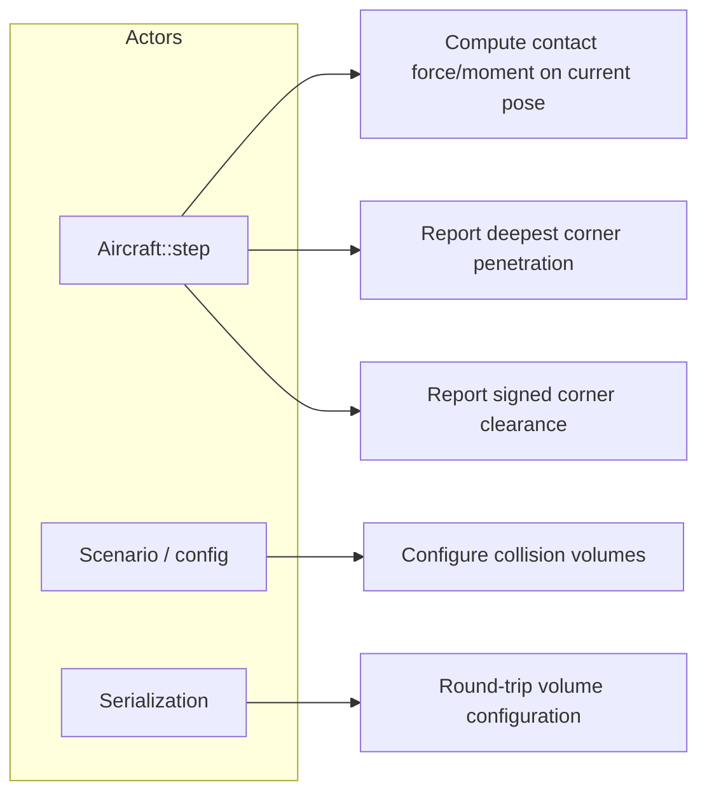
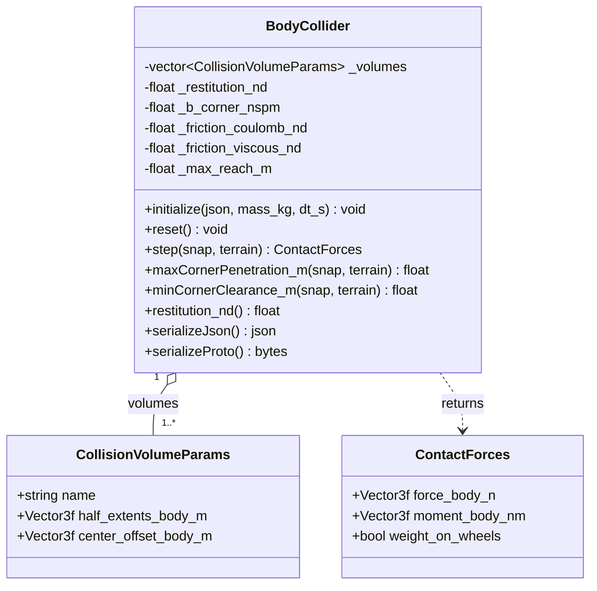
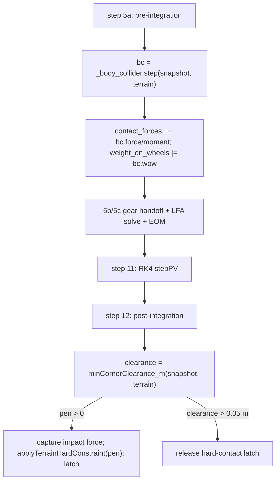

# Body Collider — Design

The body collider is a body-axis oriented-bounding-box (OBB) backstop that keeps the airframe
from penetrating terrain in attitudes and crash cases the landing gear does not cover (inverted,
deep nose-down, wing-low, gear-up). It is owned by `Aircraft` and called inside `Aircraft::step()`
both before integration (a one-step-lagged, dissipative velocity-arrest contact force, summed with the
gear reaction) and after integration (a restitution-consistent non-penetration hard constraint). Its
design target is *protection against ground penetration*, not a compliant suspension — the contact is
an inelastic arrest, not an elastic rebound.

---

## Use Case Decomposition



| ID | Use Case | Primary Actor | Mechanism |
| --- | --- | --- | --- |
| UC-1 | Penalty contact force/moment on a pose | `Aircraft::step()` | `BodyCollider::step(snap, terrain)` |
| UC-2 | Deepest penetration for the hard constraint | `Aircraft::step()` | `maxCornerPenetration_m(snap, terrain)` |
| UC-3 | Signed clearance for latch release | `Aircraft::step()` | `minCornerClearance_m(snap, terrain)` |
| UC-4 | Define per-part collision boxes | Scenario / config | `initialize(config)` |
| UC-5 | Persist configuration | Serialization | `serializeJson` / `serializeProto` (+ deserialize) |

---

## Class Hierarchy



`CollisionVolumeParams` is **geometry only** (the §5a velocity-arrest damping is a single
collider-level quantity derived from airframe mass and step, not a per-volume parameter — OQ-BC-5).
`BodyCollider` holds collider-level scalars (`restitution_nd`, the derived arrest damping, and the
§5d friction coefficients) but no mid-step force/moment state — `reset()` is a no-op and `step()` is
`const`. The §5c rotational-reaction state lives in `Aircraft` (OQ-BC-6 → Alt 2), not in
`BodyCollider`.

---

## Physical Models

§1 describes the collision geometry, §2 the normal contact, §3 the terrain hard-constraint coupling,
and §4 the `Aircraft` integration. §5 details the contact dynamics — the inelastic velocity-arrest
normal force (§5a), the restitution-consistent constraint (§5b), the dedicated rotational reaction
(§5c), and the scrape friction (§5d) — all **implemented**; §2/§3 give the overview and §5 the full
models and stability analysis.

### 1. Collision Geometry — OBB Corner Sampling

Each `CollisionVolumeParams` is a body-axis box with `half_extents_body_m` $\mathbf{h}$ and a
`center_offset_body_m` $\mathbf{c}$ from the CG. Multiple volumes per collider let the fuselage,
wings, and empennage each carry an appropriately sized box, so protection holds in any attitude.

Per step the collider tests the eight corners $\mathbf{p}_k = \mathbf{c} \pm \mathbf{h}$ of every
volume. A corner's geodetic altitude is $z_k = h_\text{ac} - (R_{NB}\,\mathbf{p}_k)_z$ (NED-z is
positive down, altitude positive up); its penetration is $\delta_k = h_\text{terrain} - z_k$, taken
to be in contact only when $\delta_k > 0$.

An **AGL early exit** skips the corner loops entirely when no volume can reach terrain:
$h_\text{ac} - h_\text{terrain} > r_\text{max}$, where $r_\text{max}=\max_v(\lVert\mathbf{c}_v\rVert +
\lVert\mathbf{h}_v\rVert)$ is the bounding-sphere reach of the worst volume over all orientations
(recomputed on `initialize`/`deserialize`).

### 2. Normal Contact — Dissipation-Dominated Velocity-Arrest

For each penetrating corner the collider applies a purely **dissipative** velocity-arrest force along
the upward terrain normal — no spring, hence no static restoring force and no elastic rebound (an
inelastic backstop, not a rubber bounce):

$$F_\text{pen} = \max\!\bigl(0,\; c\,\delta_\text{eff}\,\dot\delta\bigr),
\qquad c = b_\text{corner}/h_z,
\qquad \delta_\text{eff} = \min(\delta,\,2 h_z),
\qquad \dot\delta = \bigl(R_{NB}\,(\mathbf{v}_B + \boldsymbol\omega\times\mathbf{p}_k)\bigr)_z,$$

where $\dot\delta$ is the corner's sink rate (positive down) and $b_\text{corner}$ is the per-corner
arrest damping **derived in `initialize`** from the airframe mass and step (§5a, OQ-BC-5):
$b_\text{corner}=m/(n_\text{corners}\,N_\text{arr}\,dt)$ with a fixed $N_\text{arr}=3$, so the worst-case
aggregate over all corners sits at $1/N_\text{arr}<1$ on every airframe. The penetration is capped at
twice the volume half-depth. The $\max(0,\cdot)$ floor forbids adhesion and does no work on rebound —
the force is produced only while a corner is sinking. The force is rotated to body and accumulated with
its moment about the CG (any penetrating corner sets `weight_on_wheels`):

$$\mathbf{F}_B = R_{BN}\,[0,0,-F_\text{pen}]^\top + \mathbf{F}_t,\qquad
\mathbf{M}_B \mathrel{+}= \mathbf{p}_k\times\mathbf{F}_B,$$

where $\mathbf{F}_t$ is the §5d scrape friction (Coulomb + viscous) at the corner. The full model, the
parameter derivation, and the stability analysis (stable for all reasonable restitution $e\in[0,1)$)
are in §5a; the §5b hard constraint owns static non-penetration and restitution. This replaced an
elastic Kelvin–Voigt penalty spring whose fixed dimensional damping gave airframe-dependent restitution
(0 on a 5 kg UAS to ≈0.9 on a 5500 kg trainer) — the rubber-bounce defect; see §5a "why not a spring".

### 3. Terrain Hard-Constraint Coupling

The velocity-arrest force is a soft backstop; true non-penetration is enforced separately by the
post-integration **terrain hard constraint** (`Aircraft::step()` step 12), which is the **primary**
inelastic mechanism (§5b). After RK4 integration the collider reports `minCornerClearance_m` (signed:
negative means the deepest corner is below terrain). If any corner penetrates, `Aircraft` projects the
pose up by that depth via `KinematicState::applyTerrainHardConstraint(pen, restitution_nd)` — which
applies the restitution-consistent velocity correction $v_\text{normal}\mapsto -e\,v_\text{normal}$
(removing $(1+e)\,v_\text{normal}$; $e=$ `restitution_nd`, default 0 → fully inelastic) — re-runs the
collider on the penetrated pre-correction pose to capture the impact force/moment for monitoring, and
latches `_body_in_hard_contact`. The latch is released only on genuine separation (`clearance > 0.05 m`
hysteresis), so `weight_on_wheels` reporting stays accurate across the velocity-arrest force
momentarily reading zero after a correction.

The collider therefore participates in two mechanisms (§5b, OQ-BC-2): the geometric projection above is
the primary, restitution-consistent inelastic backstop (the single user knob `restitution_nd`, §5a),
and the §2 velocity-arrest force supplies in-contact damping and the contact moment that drives the §5c
rotational reaction.

### 4. Integration with `Aircraft`

See the [Integration](#integration) section below for the call sites and data flow. The collider's
force and moment are summed into the same `ContactForces` accumulator as the landing gear
(`contact_forces.force_body_n += bc.force_body_n`, etc.), then carried into the wind-frame EOM by
the shared contact path described in [aircraft.md](aircraft.md) step 10.

### 5. Contact Dynamics

> **Status: implemented and tested** (base model); **the OQ-BC-12 Alt B contact-reaction correction is
> decided and pending implementation.** All four base items are implemented (OQ-BC-1…7 resolved): §5a
> velocity-arrest normal contact, §5b restitution-consistent hard constraint, §5c dedicated
> rotational-reaction $\Delta\theta$ channel (parallel filters in `Aircraft`, behavior-preserving by the
> $H_2$/`LP`/$G(s)$ linearity invariant), and §5d Coulomb + viscous scrape friction. The base implementation
> plan and its tests are in [body_collider_dynamics.md](../implementation/body_collider_dynamics.md).
> **OQ-BC-12 (resolved → Alternative B) supersedes** the §5a collider normal force (→ momentum impulse), the
> attitude reference (→ contact-excluded), and the §5c **roll** currency (→ persistent wind-axis roll rate);
> see the OQ-BC-12 Decided-design subsection and [contact_reaction_alt_b.md](../implementation/contact_reaction_alt_b.md).

**§5a — Inelastic normal contact: dissipation-dominated velocity-arrest (implemented, OQ-BC-1 →
Alternative 3).** A purely **dissipative** normal force
that opposes the corner sink rate, so penetration is decelerated and arrested with **no stored elastic
energy to return** — coefficient of restitution $e=0$ by construction. Per penetrating corner, with
$\delta\ge0$ the penetration and $\dot\delta$ the sink rate (positive = deeper), the force is
penetration-modulated so it rises continuously from zero at contact (the Hunt–Crossley *damping* term
without its spring), under the no-tension floor that forbids adhesion and does no work on rebound:

$$F = \max\!\bigl(0,\; c\,\delta\,\dot\delta\bigr),$$

with the simpler pure damper $F=\max(0,\,b\dot\delta)$ as the fallback if onset continuity proves
unnecessary. The contact provides **no static restoring force**; static non-penetration is owned by the
§5b hard constraint (OQ-BC-2; an inelastic velocity projection), and the arrest force only reduces the
approach velocity so the constraint's per-step correction stays small. *Why not a spring:* the design
target $e\approx0$ makes an energy-storing spring (Kelvin–Voigt or Hunt–Crossley) the wrong primitive —
driving its restitution to zero is the ill-conditioned regime (Hunt–Crossley's $a\!\leftrightarrow\!e$
map diverges as $e\to0$; over-damped KV leaks a speed-dependent, only-approximate $e$ and keeps a
contact-onset force step). A dissipative arrest encodes $e=0$ directly.

**Parameterization and derivation (decided, OQ-BC-5).** The body collider exposes **exactly one
user-facing contact parameter — a non-dimensional coefficient of restitution $e$** (`restitution_nd`,
default $0$, clamped to $[0,1)$), consumed by the §5b hard constraint. There is **no per-volume and no
per-corner user parameter**: `CollisionVolumeParams` is reduced to geometry (`name`,
`half_extents_body_m`, `center_offset_body_m`). `Aircraft` supplies the airframe mass $m$, the outer
step $dt$, and the inertia tensor to `BodyCollider::initialize` (the architectural correction; the
inertia also serves §5c). The §5a velocity-arrest **damping is derived internally and is independent of
$e$**: with a fixed internal arrest factor $N_\text{arr}\approx3$ (arrest over $\sim N_\text{arr}$
steps), the aggregate damping is $b_\text{total}=m/(N_\text{arr}\,dt)$, which satisfies the discrete
stability bound $b_\text{total}\,dt/m = 1/N_\text{arr} < 1$ **by construction on every airframe and at
every step rate**. The per-corner coefficient distributes $b_\text{total}$ across the corners
penetrating this step (normalizing by the live active-corner count), so the aggregate is
pose-independent — an internal convention, not a knob. The result is tuning-free: the author sets only
$e$ (and may leave it at $0$), and because the derived damping scales with $m$ and $dt$ the dimensional
behavior is identical across airframes.

**Stability of the velocity-arrest contact.** Verified across the four layers it must hold at: the
continuous dynamics, the explicit discrete scheme with the one-step lag, the composition with the
$e=0$ constraint, and the attitude loop. The model is the per-corner normal force $F=\max(0,\,b\dot\delta)$
(pure damper) or $F=\max(0,\,c\,\delta\dot\delta)$ (penetration-modulated), computed at the
pre-integration pose (one-step lag), advanced by RK4, then projected by the §5b constraint.

1. **Continuous-time dynamical stability — unconditional.** In contact under a net downward load
   $F_\text{ext}$, the 1-DOF normal model $m\ddot\delta = F_\text{ext}-b\dot\delta$ is **first order** in
   $v=\dot\delta$: $\dot v = F_\text{ext}/m - (b/m)v$, characteristic root $s=-b/m<0$, single and real.
   With no spring there is **no oscillatory mode**, so the contact is structurally incapable of bouncing
   or limit-cycling (contrast Kelvin–Voigt's complex pair $s=-\zeta\omega_n\pm j\omega_n\sqrt{1-\zeta^2}$,
   $\omega_n=\sqrt{k/m}$, which is what rings). It is strictly dissipative: contact power on the body is
   $-F v = -b v^2\le0$ while sinking, and the no-tension floor gives $F=0$ on rise, so the contact only
   ever removes normal kinetic energy — Lyapunov-stable with $\tfrac12 m v^2$ as the storage function.
   The penetration-modulated form has the same character with rate $-c\delta/m\le0$.

2. **Discrete numerical stability — one easily-met CFL-type bound.** The fast mode is $\lambda=-b/m$
   (or $-c\delta/m$); the lagged force evaluated at $v_n$ is the explicit (forward-Euler) evaluation, so
   the homogeneous update is $v_{n+1}=v_n\bigl(1-\tfrac{b}{m}dt\bigr)+\tfrac{F_\text{ext}}{m}dt$ with
   amplification $\bigl|1-\tfrac{b}{m}dt\bigr|$. Hence $b\,dt/m_\text{eff}<1$ gives monotone decay (the
   **design target**: no overshoot, no spurious one-step rebound); $1<b\,dt/m_\text{eff}<2$ is stable but
   sign-flipping (a numerical micro-bounce that would defeat $e\approx0$); $>2$ is unstable (RK4 extends
   the hard real-axis limit to $\approx2.785$). Parameterize the arrest as $\tau=m_\text{eff}/b=N\,dt$,
   $N\gtrsim2\text{–}3$. This is strictly easier than Kelvin–Voigt, which must satisfy **two** explicit
   limits ($dt<2/\omega_n$ for the spring and the damper bound) *and still bounces*. The one-step lag is
   benign here: lag erodes margin only by adding phase to a **resonant** loop (the gear/attitude limit
   cycle); a first-order non-oscillatory decay has no resonance to excite, and the lag is already counted
   in the forward-Euler bound. The decided derivation sets $b_\text{total}=m/(N_\text{arr}\,dt)$ with
   fixed $N_\text{arr}\approx3$, so $b_\text{total}\,dt/m=1/N_\text{arr}$ sits safely inside this bound
   on every airframe and at every step rate. For the modulated form $c\delta/m$ is bounded because
   $\delta$ is capped ($2h_z$), so the same bound applies at the worst case $c(2h_z)\,dt/m<1$.

3. **Composition with the restitution constraint — contraction for $e\in[0,1)$.** Each step the damper
   contracts the normal velocity by $(1-\tfrac{b}{m}dt)\in(0,1)$ (a contraction under the bound), and the
   §5b projection maps the normal approach velocity $v_\text{normal}\mapsto -e\,v_\text{normal}$ (it
   removes $(1+e)\,v_\text{normal}$). For $e\in[0,1)$ that projection is a **contraction** with factor
   $e$ ($\lVert Pv\rVert = e\lVert v\rVert \le \lVert v\rVert$): at $e=0$ it zeros the velocity (fully
   plastic), and as $e\to1$ it approaches energy-preserving reflection. A contraction composed with a
   contraction is a contraction in normal kinetic energy — **no growth, no launch** for any $e<1$. Both
   the damper (purely dissipative) and the projection (energy $\times e^2$ per contact) only remove
   normal energy, so the airframe cannot be ejected; the worst case at $e=0$ is "stuck to the surface"
   (the desired plastic behavior), and it still departs under aero/gear lift once clearance returns (the
   $0.05\text{ m}$ release hysteresis).

4. **Attitude-coupling stability — the gear failure mode does not recur.** That artifact was a loop
   (stiff spring $\to$ FPA swing $\to$ swept contact point $\to$ spring) closed by an **oscillatory**
   normal force against the zero-inertia attitude. This contact has no oscillatory normal mode to feed
   it; it routes the contact moment through the §5c (OQ-BC-3) bounded second-order low-pass with finite
   DC and no free integrator — the same $H_2$ the gear's describing-function analysis
   ([landing_gear.md §7](landing_gear.md)) established as stable — driven by a non-oscillatory moment
   (force $\propto$ a decaying velocity); and it breaks the contact-point sweep via the §5c $\Delta\theta$
   in $\theta_\text{geom}$. This layer is stable **conditional on** the §5c filter being parameterized as
   in the gear (OQ-BC-3 Alternative 1).

*Edge cases.* (a) The decided derivation makes the **aggregate** damping
$b_\text{total}=m/(N_\text{arr}\,dt)$ pose-independent (live per-corner normalization), so the bound
$b_\text{total}\,dt/m=1/N_\text{arr}<1$ holds at every pose and airframe by construction — no
effective-mass estimate to tune. (b) A deep single-step incursion (high sink rate $\times$ large $dt$)
penetrates a bounded $\approx v_\text{sink}\,dt$ before the lagged, capped force acts; the §5b constraint
guarantees non-penetration — transient penetration, not instability. (c) Both forms send $F\to0$
continuously as $\dot\delta\to0$ (and the modulated form as $\delta\to0$), so the no-tension switch is
$C^0$ with no force jump — this design **removes** a chatter source that Kelvin–Voigt's clipped finite
spring force introduces.

*Robustness across the restitution range $e$.* $e$ is the only authored contact parameter, so the
verification must hold for every reasonable value — and it does, **for all $e\in[0,1)$**. (i)
*Computational.* $e$ enters **only** the §5b algebraic projection $v\mapsto -e\,v$ — no integration, no
$e$-dependent stiffness, hence no CFL condition on $e$; it is numerically stable for any $e\in[0,1]$.
The §5a damper is derived from the fixed $N_\text{arr}$ and is **independent of $e$**, so its bound
$1/N_\text{arr}<1$ is untouched by the restitution choice. (ii) *Dynamical.* The per-contact normal-energy
map has factor $e^2<1$ for $e<1$, so energy is monotonically removed and the response grades smoothly
with $e$ — plastic at $e=0$, progressively springier toward $e\to1$, bounded throughout — with no value
in the range producing growth, chatter, or a step-size penalty. The elastic limit $e=1$
(energy-preserving perfect bounce, marginally stable) lies outside the inelastic-backstop intent and is
excluded by clamping $e$ to $[0,1)$. (iii) *Physical consistency.* $e$ is dimensionless and
frame-independent, so the same $e$ yields the same restitution on every airframe, while the derived
damping scales with $m,dt$ to keep the arrest timescale ($N_\text{arr}$ steps) identical across the
fleet. The whole range $e\in[0,1)$ — design intent near $0$ — therefore gives reasonable,
physically-consistent dynamic and computational behavior, with no tuning required.

*Conclusion.* The velocity-arrest contact is dynamically stable **unconditionally** (real-negative
eigenvalue, no oscillatory mode, strictly dissipative) and numerically stable under the single bound
$b\,dt/m\lesssim1$ — met by construction since $b_\text{total}\,dt/m=1/N_\text{arr}$ — and it composes
stably with the restitution constraint **for all $e\in[0,1)$**, without re-exciting the gear/attitude
loop. It is strictly easier to keep stable than the current Kelvin–Voigt contact. The verification holds
subject to two remaining conditions, each carried as a prerequisite or test: the §5c moment-filter
parameterization, and the §5b constraint owning static position. When §5a is implemented, this analysis
should be promoted to a numerical-analysis document in [`docs/algorithms/`](../algorithms/) per the
`/algo` convention.

**§5b — Penalty / hard-constraint role split (implemented, OQ-BC-2 → Alternative 2).** The
post-integration hard constraint (§3) is the **primary** non-penetration mechanism and is made
*restitution-consistent*: instead of hard-zeroing the corner normal velocity it removes $(1+e)$ of
the normal approach component (i.e. $v_\text{normal}\mapsto -e\,v_\text{normal}$) with the **single
collider-level coefficient of restitution $e$** (`restitution_nd`, default $0$, the only user-facing
contact knob — see the §5a parameterization and OQ-BC-5), bounding penetration every step. The penalty force (§5a) is demoted to supplying in-contact damping and the contact moment for
§5c — it no longer has to be stiff enough to arrest the impact before penetration, so there is no
stiff-spring step-size penalty. The lesson from the gear is that a stiff backstop firing against the
load-factor model's near-zero-inertia, velocity-slaved attitude produces non-physical feedback and
limit cycles, and the constraint's velocity correction is a discrete analogue; the acceptance
requirement (Test Strategy `Aircraft_BodyCollider_NoRelaunch`) is that the restitution-consistent
projection does not excite the kinematic attitude.

**§5c — Gear-style rotational reaction $\Delta\theta$ (implemented, OQ-BC-3/6/7 resolved; the **roll**
channel superseded by OQ-BC-12 → Alt B, pending implementation).** The goal
is a rotational reaction to a body strike (a wing-low
or tail-first contact pitches/rolls the airframe *about* the contact, via the §2a low-pass on $M/I$
with properties P1–P4), with the gear and body-collider contributions **independently attributable**. The
pitch and yaw channels described here are retained; **OQ-BC-12 Alt B replaces the roll channel** — the
returning $\delta_{rr}=d(\Delta\theta_\text{roll})/dt$ becomes a *persistent* filtered wind-axis roll rate
on $q_{nw}$ (FBW is roll-rate command, no bank hold), and the collider's share is driven by the momentum
impulse rather than the compliant deviation (see the OQ-BC-12 Decided-design subsection).

> **Defect & resolution (OQ-BC-10 → Alt 1).** Routing the **body-collider** moment through this
> *compliant* channel injects rotational energy — a wide-wing-box strike catapults the airframe in roll
> instead of arresting it. Resolved by replacing the collider's share of this channel with an
> **inelastic rotational velocity-arrest** (dissipative; the rotational analog of §5a), separate from the
> gear's compliant channel, which is unchanged. Implemented as IP-BC-13.

*As-built today (the starting point).* The `Aircraft::step` rotation-deviation block
([landing_gear.md §2a](landing_gear.md)) is **ungated** and driven by the **combined** contact force
and moment (`contact_forces.force_body_n` / `.moment_body_nm`), which already include the body
collider's contributions (summed at step 5a). So a gear-up belly or wing strike **already produces a
rotational reaction** — the collider's moment flows through the same $H_2$ filters as the gear's and
decays to zero when unloaded (P1). Functionally this is the *shared* channel (OQ-BC-3 Alternative 2);
what is missing is **attribution** — the two sources are summed before the filter and cannot be
inspected separately.

*Design (Alternative 1 — separated moment **and** force channels).* Keep the gear and collider
contact reactions **separate** for the rotation-deviation channels while still summing them for the EOM.
Both the **moment channels** (the $H_2$ low-pass on $M/I$ per axis) and the pitch **force channel** (the
$G(s)$ on the destanced vertical load) are duplicated per source — gear-driven and collider-driven — and
summed into the attitude exactly as the single combined channels are today. Each pair shares its
parameters: the airframe rotational-mode $\omega_n,\zeta$ for the moment filters, and the same stance
$\tau$ and $G(s)$ coefficients for the force channel.

*Why this is safe (the key invariant).* Every operator in both channels is **linear** in the contact
load — the $H_2$ moment filters, and for the force channel the stance low-pass, the $a_\text{arrest}$
difference, the $\cos\gamma/V$ and $\Phi(V)$ scalings (common aircraft-state factors, not per-source),
and the $G(s)$ realization. Linear operators superpose, so with matched parameters
$$L(\text{gear}) + L(\text{bc}) = L(\text{gear}+\text{bc})$$
for **both** channels — e.g. $H_2(M_\text{gear}/I)+H_2(M_\text{bc}/I)=H_2\!\big((M_\text{gear}+M_\text{bc})/I\big)$
for the moment, and $\operatorname{LP}(f_\text{gear})+\operatorname{LP}(f_\text{bc})=\operatorname{LP}(f_\text{gear}+f_\text{bc})$
for the stance destancing. The sum of the two separated channels is therefore **mathematically
identical** to today's single combined channel — exact modulo float rounding and any filter **clip
saturation** (the filters are `FilterSS2Clip`; if a clip engages, the split can differ, which the
equivalence test below detects directly). The separation only re-buckets the same total into two
inspectable parts.

*$\omega_n,\zeta$ source.* The rotation filter's natural frequency and damping are a property of the
**airframe rotational mode**, not of which force produced the moment, so the collider channel reuses
the gear's parameters: $\omega_n=$ `dtheta_wn_{axis}_ratio`$\times(g/V_\text{stall})$, $\zeta=$
`dtheta_zeta_nd` (config ratios scaled by the flight-path frequency, in `Aircraft::initialize`). The
inertia tensor enters only as the $M/I$ forcing. *(The earlier "$\omega_n,\zeta$ from the inertia
tensor" phrasing was imprecise — inertia alone cannot set a frequency.)* Reusing the gear's parameters
adds **no body-collider config** (consistent with OQ-BC-5) and is exactly what makes the linearity
equivalence hold.

*Decided mechanics (OQ-BC-6/7 → Alternative 2 + Alternative 2).* The collider's rotation filters live
as a **parallel set in `Aircraft`** — `_bc_dtheta_{pitch,roll,yaw}_filter` plus a collider
force-channel $G(s)$/stance state, mirroring the gear's — keeping the attitude machinery in one place
and reusing the proven filter/serialization patterns (OQ-BC-6 → Alt 2). **Both** channels are
attributed: the collider gets its own force channel as well as its own moment channels (OQ-BC-7 →
Alt 2). *(Correction: an earlier draft claimed the force channel "does not separate by linearity"
because of the stance destancing — that was wrong. The stance low-pass is linear and superposes, so the
force-channel separation is behavior-preserving exactly like the moment channels, per the invariant
above.)*

*Regression protection.* (1) **Characterize first** — the existing gear $\Delta\theta$ tests
(`LandingGear_DthetaState_NonzeroAfterContact`, `LandingGear_ForceChannel_DecaysAfterTransient`,
`LandingGear_GearContact_DoesNotAccelerate`, …) capture current behavior and must stay green.
(2) **Equivalence test** — assert the separated-channel sum (moment **and** force) equals the
pre-refactor combined $\Delta\theta$ to float tolerance on a belly-strike snapshot; by the linearity
invariant this holds exactly except where a `FilterSS2Clip` saturates, which this test flags directly.
(3) **Golden trajectory** — a body-collider belly-landing scenario run before and after the refactor,
with attitude and trajectory unchanged within tolerance. Because **both** channels separate linearly,
the entire §5c refactor is **provably non-breaking** in the unclipped regime, and the equivalence test
is the explicit guard for the clip regime. **Implemented** as a parallel `_bc_dtheta_*` filter set in
`Aircraft` (the gear filters now read gear-only force/moment); the existing gear-only and bc-only tests
pass unchanged, confirming the linearity equivalence.

**§5d — Tangential scrape friction (implemented, OQ-BC-4 → Alternative 1 + viscous term).** Penetrating
corners get a tangential force combining regularized Coulomb friction with a velocity-proportional
momentum-transfer (plowing) term:

$$\mathbf{F}_t = -\mu\,F_\text{pen}\,\hat{\mathbf{v}}_{t,\text{reg}} \;-\; c_t\,\mathbf{v}_t,$$

where $\mathbf{v}_t$ is the corner's tangential ground velocity, $\hat{\mathbf{v}}_{t,\text{reg}}$ is
its direction regularized near zero slip to avoid chatter, $\mu$ is the (non-dimensional) Coulomb
coefficient from the surface-friction parameterization shared with the gear, and $c_t$ is a
non-dimensional viscous coefficient (scaled to the airframe so it is mass-independent) emulating the
momentum the airframe loses plowing into terrain — the Coulomb cap alone under-represents that sink.
Both terms act only while a corner penetrates. The smooth-dynamics standard exempts contact/friction
physics from the $C^1$ requirement (see [general.md](../guidelines/general.md#smooth-dynamics)), so
the stick–slip discontinuity is acceptable here. The viscous coefficient is derived as
$k_\text{visc}\cdot b_\text{corner}$ (mass-scaled, so it is tuning-free like the normal arrest), and
both knobs default to 0 (frictionless until configured).

---

## Integration

`Aircraft` owns a `BodyCollider _body_collider` value member, active only when the config contains a
`body_collider` section (`_has_body_collider`). It is called at two points in `Aircraft::step()`:



- **Step 5a (pre-integration, one-step lag).** `step(snapshot, *terrain)` is evaluated on the
  current pose and summed with the landing-gear reaction into `contact_forces`. Computed before the
  `LoadFactorAllocator` solve so the n_z handoff (§2b of the gear contract) sees this step's contact.
- **Step 12 (post-integration hard constraint).** Described in §3. Uses `minCornerClearance_m`
  (signed) for separation detection and `maxCornerPenetration_m` / `applyTerrainHardConstraint` for
  the projection.

The call signature consumed by `Aircraft` is
`ContactForces step(const KinematicStateSnapshot&, const Terrain&) const`. The terrain pointer must
be non-null (`_has_body_collider && _terrain != nullptr`) for either mechanism to run.

---

## Interface

```cpp
// include/collision/BodyCollider.hpp — namespace liteaero::simulation

struct CollisionVolumeParams {        // geometry only (OQ-BC-5)
    std::string     name;
    Eigen::Vector3f half_extents_body_m  = {0.5f, 0.3f, 0.2f};
    Eigen::Vector3f center_offset_body_m = Eigen::Vector3f::Zero();
};

class BodyCollider {
public:
    // mass_kg and dt_s derive the §5a velocity-arrest damping; defaults are a test
    // convenience — Aircraft passes the real airframe mass and outer step.
    void initialize(const nlohmann::json& config, float mass_kg = 1.0f, float dt_s = 0.01f);
    void reset() {}

    ContactForces step(const liteaero::nav::KinematicStateSnapshot& snap,
                       const liteaero::terrain::Terrain& terrain) const;
    ContactForces step(const liteaero::nav::KinematicStateSnapshot& snap) const;  // flat terrain at 0 m

    [[nodiscard]] float maxCornerPenetration_m(
        const liteaero::nav::KinematicStateSnapshot& snap,
        const liteaero::terrain::Terrain& terrain) const;          // clamped >= 0
    [[nodiscard]] float minCornerClearance_m(
        const liteaero::nav::KinematicStateSnapshot& snap,
        const liteaero::terrain::Terrain& terrain) const;          // signed

    [[nodiscard]] float restitution_nd() const;                    // §5b coefficient (consumed by Aircraft)

    [[nodiscard]] nlohmann::json       serializeJson() const;
    void                               deserializeJson(const nlohmann::json& j);
    [[nodiscard]] std::vector<uint8_t> serializeProto() const;
    void                               deserializeProto(const std::vector<uint8_t>& bytes);
};
```

---

## Serialization

### Serialized State

The collider has **no mid-step force/moment state** (`step()` is `const`); the §5c rotation-deviation
filters live in `Aircraft` (OQ-BC-6 → Alt 2), not here. `BodyCollider` serialization round-trips the
volume geometry plus the collider-level contact scalars below — the single user knob `restitution_nd`,
the §5d friction coefficients, and the **derived** arrest damping (serialized so a restore reproduces
behavior without re-supplying mass/`dt`).

| Field | Type | Unit | Description |
| --- | --- | --- | --- |
| `restitution_nd` | float | — | §5b coefficient of restitution, $[0,1)$, default 0 (the only user-facing contact knob) |
| `arrest_damping_corner_nspm` | float | N·s/m | §5a per-corner velocity-arrest damping, derived in `initialize` from mass/`dt` |
| `friction_coulomb_nd` | float | — | §5d Coulomb coefficient $\mu$, default 0 |
| `friction_viscous_nd` | float | — | §5d viscous (plowing) factor on `b_corner`, default 0 |

Per-volume configuration is geometry only: `name`, `half_extents_body_m`, `center_offset_body_m`. The
field count is below the ten-field threshold for a standalone schema document; it is specified inline.

> **Aircraft serialization gaps (found during the §5c round-trip test — fixed, IP-BC-10).** A
> deserialize-then-continue-step test (`Aircraft_BodyCollider_RoundTrip_PreservesSubsystem`) exposed a
> *cluster* of pre-existing `Aircraft` serialization gaps, none body-collider-specific:
> - **`_wa_q_lo_pa`/`_wa_q_hi_pa`** (the OQ-LG-24/26 w_a authority band edges) were not serialized and
>   default to `0`. A degenerate `(0,0)` band makes `w_a = 1` at any `q > 0`, so a restored aircraft
>   applies full load-factor authority at low `q` and α saturates to the box limit — **the actual cause
>   of the continued-step divergence** (not the reporting-only `_body_in_hard_contact`, which was a red
>   herring). Fixed: serialize both edges (JSON + proto).
> - **`_has_landing_gear`/`_has_body_collider`** were read to gate restoring each subsystem block but
>   never set (set only in `initialize`), so a fresh-constructed aircraft **silently dropped both its
>   gear and collider** on deserialize. Fixed: set from block presence (JSON) / `has_*()` (proto).
> - **Proto omitted the subsystems entirely** — `AircraftState` had no `landing_gear`/`body_collider`
>   field (violating the JSON/proto symmetry rule). Fixed: added fields 71/72 and serialize/deserialize.
> - **`_outer_dt_s`** was not serialized (defaulted to `0.02`, coincidentally matching; latent). Fixed:
>   reconstructed as `_cmd_filter_dt_s · _cmd_filter_substeps`.
> - **`_body_in_hard_contact`** now serialized too (correct round-trip of the reported WoW); interim
>   pending the OQ-BC-8 latch-vs-stateless decision.

### Proto Message

```proto
message CollisionVolumeParams {        // geometry only (§5a / OQ-BC-5)
    string   name                 = 1;
    Vector3f half_extents_body_m  = 2;
    Vector3f center_offset_body_m = 3;
}

message BodyColliderParams {
    int32                          schema_version             = 1;
    repeated CollisionVolumeParams volumes                    = 2;
    float                          restitution_nd             = 3;  // §5b
    float                          arrest_damping_corner_nspm = 4;  // §5a derived
    float                          friction_coulomb_nd        = 5;  // §5d mu
    float                          friction_viscous_nd        = 6;  // §5d k_visc
}
```

---

## Computational Resource Estimate

| Operation | Count per outer step |
| --- | --- |
| AGL early-exit test | 1 (skips everything below when clear) |
| Corner penetration tests | $8 \times N_\text{vol}$ rotations + compares |
| Penalty force/moment | $\le 8 \times N_\text{vol}$ (penetrating corners only) |
| `minCornerClearance_m` (step 12) | $8 \times N_\text{vol}$ |

For a typical 3-volume airframe (fuselage, wings, tail) that is $\le 24$ corner evaluations for the
arrest pass (each adds the §5d tangential force) plus 24 for the clearance pass, each a $3\times3$
rotation and a scalar compare. Memory footprint is the volume geometry list, the four collider-level
scalars, and one cached `_max_reach_m`. The §5c rotation-deviation filters (a parallel per-axis
second-order set plus a force-channel 2-state) live in `Aircraft`, costing a handful of multiply-adds
per step. At a nominal outer step all of this is negligible relative to the LFA solve and aero model.

---

## Open Questions

Open questions (ascending by ID). **All OQ-BC questions (OQ-BC-1 through OQ-BC-12) are resolved**; their
resolution notes are retained in numerical order in the subsections below. There are no open questions.

| ID | Summary | Blocking |
| --- | --- | --- |
| — | *(none open — OQ-BC-12 resolved to Alternative B on 2026-07-10; see its resolution note and the [contact_reaction_alt_b.md](../implementation/contact_reaction_alt_b.md) plan)* | — |

### OQ-BC-1 — Inelastic Normal-Contact Formulation *(Resolved)*

**Resolution (Alternative 3 — dissipation-dominated velocity-arrest).** The normal contact is a purely
dissipative velocity-arrest force (no spring), giving $e=0$ by construction; the decided design, its
force forms, parameterization, and the full numerical/dynamical stability verification are in §5a.
**Rationale (user):** the design target is a coefficient of restitution of zero or near zero, and a
penalty spring is an energy-storage device whose restitution can only be driven to zero in an
ill-conditioned regime (Hunt–Crossley's $a\!\leftrightarrow\!e$ map diverges as $e\to0$; over-damped
Kelvin–Voigt leaves a speed-dependent, only-approximate $e$ with a contact-onset force step). A
dissipative arrest encodes $e=0$ directly and is consistent with the resolved OQ-BC-2, where restitution
is owned by the $e=0$ hard constraint. **Verification:** numerical and dynamical stability confirmed in
§5a — first-order non-oscillatory decay that is strictly dissipative (cannot bounce or limit-cycle); a
single explicit-scheme bound $b\,dt/m_\text{eff}\lesssim1$; non-expansive composition with the $e=0$
projection; no re-excitation of the gear/attitude loop. **Caveats / prerequisites carried into
implementation:** the stability bound applies to the aggregate corner damping with a conservative
effective mass; the §5c moment filter must be parameterized as in the gear; the §5b constraint must hold
static belly-rest position with no normal spring; and the §5a stability analysis should be promoted to a
`docs/algorithms/` numerical-analysis document. Implemented.

### OQ-BC-2 — Penalty / Hard-Constraint Role Split *(Resolved)*

**Resolution (Alternative 2 — constraint-primary, restitution-consistent).** The post-integration
terrain hard constraint (§3) is the primary non-penetration mechanism and becomes
restitution-consistent: instead of hard-zeroing the corner normal velocity it removes $(1+e)$ of the
normal approach component with a configured restitution $e\approx0$, bounding penetration every step.
The penalty force (§2/§5a) is demoted to supplying in-contact damping and the contact moment that
drives the §5c rotation deviation; it no longer has to be stiff enough to arrest the impact before
penetration. **Rationale (user):** bound penetration every step without a stiff-spring step-size
penalty, and concentrate restitution in one explicit parameter. **Caveat:** the restitution-consistent
projection still acts on the kinematic, near-zero-inertia attitude, so it must be shown not to excite
it — the acceptance test `Aircraft_BodyCollider_NoRelaunch` in the Test Strategy. Implementation
requires extending `applyTerrainHardConstraint` to carry a restitution coefficient, remains gated on
§5a (the normal-force law that supplies the residual damping/moment). Implemented.

### OQ-BC-3 — Gear-Style Rotational Reaction $\Delta\theta$ *(Resolved)*

**Resolution (Alternative 1 — dedicated, *attributed* body-collider $\Delta\theta$ channel).** The
gear and body-collider rotational contributions are separated so each is independently inspectable,
driven by their own contact moment through the §2a low-pass $H_2$ on $M/I$ (properties P1–P4) and
summed into the kinematic attitude. **Rationale (user):** establish the formality of a self-contained,
attributable rotational source rather than the shared sum. **Design status (refined after
implementation review):** the body-collider force/moment **already** flow through the *shared*,
ungated gear $\Delta\theta$ block today, so the rotational reaction already functions (the OQ-BC-3
Alternative 2 form) — Alternative 1 separates **both** the moment **and** force channels for
attribution, which is behavior-preserving by the **linearity** of the $H_2$ moment filters, the stance
low-pass, and the $G(s)$ force channel (all share the same airframe rotational-mode $\omega_n,\zeta$ —
config ratios `dtheta_*_ratio`$\times(g/V_\text{stall})$ and `dtheta_zeta_nd`; the inertia tensor
enters only as the $M/I$ forcing — the earlier "$\omega_n,\zeta$ from the inertia tensor" phrasing was
imprecise). The supporting mechanics are resolved: filters live as a **parallel set in `Aircraft`**
(**OQ-BC-6** → Alt 2) and **both** channels are attributed (**OQ-BC-7** → Alt 2; the earlier claim that
the force channel "does not separate by linearity" was wrong — the stance low-pass superposes). The
full design and the regression-protection strategy are in §5c. This is the labeled nice-to-have; it
depends on §5a/§5b (in place). Implemented.

### OQ-BC-4 — Tangential Scrape Friction *(Resolved)*

**Resolution (Alternative 1, extended with a velocity-proportional momentum-transfer term).**
Penetrating corners get a tangential force combining (a) regularized Coulomb friction
$-\mu\,F_\text{pen}\,\hat{\mathbf{v}}_{t,\text{reg}}$ opposing the corner's tangential ground velocity
$\mathbf{v}_t$ (regularized near zero slip to avoid chatter), **and** (b) a velocity-proportional
viscous term $-c_t\,\mathbf{v}_t$ that emulates the momentum the airframe transfers into the ground as
it plows/scrapes — total $\mathbf{F}_t = -\mu\,F_\text{pen}\,\hat{\mathbf{v}}_{t,\text{reg}} -
c_t\,\mathbf{v}_t$, active only while the corner penetrates. **Rationale (user):** a frictionless
slide is unphysical for an inelastic crash, and a pure Coulomb cap under-represents the momentum lost
plowing into terrain; the viscous term captures that sink, bleeding tangential momentum at a rate set
by $c_t$ rather than capping at the Coulomb friction alone. Both coefficients are non-dimensionalized
— $\mu$ from the surface-friction parameterization shared with the gear, $c_t$ scaled to the airframe
so it is mass-independent. The stick–slip and contact-onset discontinuities are acceptable under the
contact/friction exemption to the smooth-dynamics standard. Implementation depends on §5a
(a stable normal force $F_\text{pen}$ to scale the Coulomb term). Implemented.

### OQ-BC-5 — §5a Velocity-Arrest Coefficient Parameterization *(Resolved)*

**Resolution (single non-dimensional user knob — coefficient of restitution $e$ alone).** The body
collider exposes **exactly one user-facing contact parameter, a non-dimensional coefficient of
restitution $e$** (`restitution_nd`, default $0$, clamped to $[0,1)$), consumed by the §5b hard
constraint. There is **no per-volume and no per-corner user parameter**; `CollisionVolumeParams` is
reduced to geometry. `Aircraft` supplies the airframe mass, outer step $dt$, and inertia tensor to
`BodyCollider::initialize` (the architectural correction — the inertia also serves §5c), and the §5a
velocity-arrest damping is **derived internally and independently of $e$** from a fixed arrest factor
$N_\text{arr}\approx3$: $b_\text{total}=m/(N_\text{arr}\,dt)$, distributed across the live penetrating
corners. The full design and the parameter derivation are documented in §5a. **Rationale (user):** the
collider is a non-penetration backstop, not a tuned suspension; its one parameter must be
non-dimensional and tuning-free with a wide robust range, and the config-only architecture (no airframe
properties) is an architectural error to fix, not a constraint to design around. **Verification:** the
§5a stability analysis is extended to prove that **all reasonable $e$** give reasonable behavior — for
every $e\in[0,1)$ the contact is dynamically stable (per-contact normal energy $\times e^2$, monotone
decay) and computationally stable ($e$ enters only an algebraic projection, no CFL; the derived damper
is $e$-independent and stable by construction), graded smoothly from plastic ($e=0$) toward the
excluded elastic limit ($e\to1$). **Not yet implemented** (tracked in
[body_collider_dynamics.md](../implementation/body_collider_dynamics.md)).

### OQ-BC-6 — §5c Δθ Filter State Location *(Resolved)*

**Resolution (Alternative 2 — parallel filter set in `Aircraft`).** The body-collider rotation filters
live in `Aircraft` as a parallel set mirroring the gear's — `_bc_dtheta_{pitch,roll,yaw}_filter`
(`FilterSS2Clip` per axis) plus a collider force-channel $G(s)$/stance state — reusing the gear's
$\omega_n,\zeta$ (config ratios $\times g/V_\text{stall}$, `dtheta_zeta_nd`) and serialization patterns,
and driven by the **body-collider** contact moment/force separated from the gear's at step 5a.
**Rationale (user):** keep the delicate attitude integration in one place and reuse the validated gear
machinery; the collider's contribution is still a separate, attributable term. **Consequence:** the
body collider itself stays stateless (its rotational state lives in `Aircraft`), a deliberate departure
from the OQ-BC-3 "self-contained" wording, accepted for the lower refactor risk. Implemented.

### OQ-BC-7 — §5c Force / Descent-Arrest Channel Attribution *(Resolved)*

**Resolution (Alternative 2 — the collider gets its own force channel; behavior-preserving).** Both
rotation channels are attributed per source: the collider gets its own force channel (a second
$G(s)$ + stance filter on the **collider** vertical load) alongside its own moment channels, and the
gear channels are driven by the **gear** load/moment only. **Correction:** the OQ-BC-7 problem statement
originally asserted the force channel "does not separate by linearity" because the stance destancing
couples the sources — **that was wrong.** The stance low-pass is linear and superposes
($\operatorname{LP}(f_\text{gear})+\operatorname{LP}(f_\text{bc})=\operatorname{LP}(f_\text{gear}+f_\text{bc})$),
and the remaining force-channel operators ($a_\text{arrest}$, the $\cos\gamma/V$ and $\Phi(V)$
aircraft-state scalings, and $G(s)$) are linear or common-factor, so the separated force channels sum
**exactly** to the combined one — behavior-preserving like the moment channels, modulo float rounding
and `FilterSS2Clip` saturation (which the §5c equivalence test guards). **Rationale (user):** full
attribution of both channels, now established to carry no behavior penalty. Implemented.

### OQ-BC-8 — Weight-on-Wheels Detection (Reporting) *(Resolved — Alternative 1)*

**Resolution (Alternative 1 — hysteretic geometric WoW with a derived band).** The reported
`weight_on_wheels` is a hysteresis latch on the geometric corner clearance `minCornerClearance_m`:
**engage** (`true`) the step the deepest corner reaches terrain (clearance $\le \delta_\text{on}$, with
$\delta_\text{on}=0$ — exactly on contact), and **release** (`false`) only after the airframe has climbed
clear (clearance $> \delta_\text{off}$). The band is **derived, not magic**:
$\delta_\text{off}=V_\text{stall}\,\Delta t$ — the per-step travel at the airframe's stall speed (see
*Threshold derivation* below); it replaces the old magic $0.05$ m release margin. After OQ-BC-9's
decoupling the latch is **reporting-only** (it no longer feeds any control gate), so it persists as the one
serialized bool `_body_in_hard_contact` (already serialized, IP-BC-10) with no control-path cost.

*Provisional reference speed.* $V_\text{stall}$ is adopted **for now**; the physically correct
characteristic speed is the airframe's **post-impact** speed, not its pre-impact / stall speed, so the
$V_\text{stall}$ choice is to be re-evaluated against the envelope test results and revised if needed. The
engage edge $\delta_\text{on}=0$ is fixed. Implemented as IP-BC-11.

<details><summary>Problem, alternatives, and rationale (retained)</summary>

**Problem.** The §5a velocity-arrest normal force is **zero at static rest** (it opposes only an active
sink rate), so a belly-resting aircraft produces no contact force, and weight-on-wheels (WoW) detected
from the instantaneous force/penetration reads *false* for a settled belly even though the aircraft is
on the ground. To patch this, `Aircraft` carries a latched flag `_body_in_hard_contact` (set when the
post-integration hard constraint fires, released on `> 0.05 m` separation) that forces the reported
`weight_on_wheels` true. Investigation found: **(a)** the latch is **reporting-only** — it modifies the
stored `_contact_forces.weight_on_wheels` (read externally via `contactForces()`), but the control loop
(the §5b apportionment gate and the settle fade) reads the *local* per-step geometric WoW, **not** the
latch. So it is **not** the OQ-LG-22 failure (a latch that fed a synthetic full-weight force into the
apportionment loop and capped go-arounds — that misuse of this same flag was already removed for the
gear). **(b)** It is, however, the same *hidden-latched-state* smell: it adds a hysteresis state with no
functional use beyond reporting, and serialized state that is easy to forget (the gear's OQ-LG-22
lesson: prefer stateless detection over remembered state).

**Update — the control-loop flicker is an active defect, not a cosmetic follow-on.** A post-contact
time-history regression (`BodyColliderOnly_Landing_DoesNotOscillateAfterContact`, a belly landing at
55 m/s) exposed a non-physical **integration-frequency limit cycle**: after first contact the pitch
attitude reverses direction almost every step (**581 reversals over 584 post-contact steps**, 5.8°
peak-to-peak even in the settled window). Bisection by selectively disabling each contribution
localized the driver unambiguously:

- It is **not** the §5c Δθ rotational channel (zeroing the body-collider Δθ contribution changed
  nothing) and **not** a velocity-direction effect (the flight-path angle is steady at ≈ −0.0036 rad).
- The pitch equals $\alpha_\text{body}$, and $\alpha$ tracks `n_z_shaped`, which **slams between 1.0 and
  0.0 every step**. The term forcing it to zero is the OQ-LG-23 axial-acceleration **settle term**,
  whose gate is $\varphi_g = \text{WoW}\cdot s_\text{unload}$. The *control-loop* WoW (the local
  per-step penetration flag, **not** the reporting latch) **chatters every step**: the §5b hard
  constraint projects the penetrating pose back to the surface, so the next step's pre-integration pose
  is clear (WoW false) before gravity re-penetrates it (WoW true). Because the belly landing is
  decelerating hard, the settle increment is clipped to ≈ −1.0 whenever WoW is true, so the gate
  toggling on/off drives commanded lift — and hence $\alpha$ and pitch — fully on/off at the
  integration rate.
- Replacing the control-loop WoW with the **stateless geometric clearance-margin** test
  (`minCornerClearance_m < margin`, Alternative 1) makes **this shallow regression** pass: a belly
  resting within the margin reports WoW *continuously* true, so the settle gate stops toggling.

The mechanism is the body-collider analog of the gear settle/WoW coupling: the gear strut is a stateful
spring-damper that stays loaded continuously on the ground, so its WoW does not chatter; the body
collider has no persistent contact state and the hard constraint removes the penetration each step, so
a **per-step** WoW necessarily flickers.

**Scope correction (see OQ-BC-9).** The stateless geometric WoW fixes **only the shallow belly case**.
Across the wider impact envelope (steep dive, inverted) it is **insufficient**: the per-step vertical
bounce exceeds the clearance margin so even the geometric WoW chatters, and a deeper coupling (the FBW
lift-shaping loop fed by body-collider contact) drives the oscillation regardless of how WoW is detected.
That envelope-wide defect is **OQ-BC-9**, resolved by **decoupling** body-collider contact from the
lift-shaping loop entirely. With OQ-BC-9 resolved, the body-collider WoW no longer feeds the control loop
at all, so **OQ-BC-8 reduces to its original scope: WoW for *reporting* only** — there is no control-loop
behavior at stake, only how cleanly the reported flag tracks genuine contact.

Because the flag is now reporting-only, the OQ-LG-22 "no hidden latched state" objection — which was about
a latch *driving control* — **no longer applies**. That removes the main argument against hysteresis. And a
stateless single-threshold test (`clearance < margin`) **flickers by construction**: when the clearance
hovers near the threshold it toggles every step. A **hysteretic** (engage/release-band) latch is exactly
what debounces that, so for clean reporting the hysteresis is a *feature*, not a smell — provided the band
edges are **derived**, not magic.

**Alternatives:**

1. **Hysteretic geometric WoW with a derived band (recommended).** A latch on the geometric corner
   clearance: engage `weight_on_wheels = true` when the deepest corner reaches terrain
   (`minCornerClearance_m ≤ δ_on`) and release it only after the airframe has clearly climbed away
   (`minCornerClearance_m > δ_off`), with `δ_off > δ_on` (the hysteresis band). The band edges are derived
   (see "Threshold derivation" below), not constants. The one latched bool is serialized (already done in
   IP-BC-10).
   - **Benefits:** correct at static rest (a settled belly reads true continuously); debounced — no
     boundary flicker; the latched bool is reporting-only (no control coupling after OQ-BC-9); the band is
     airframe-/timestep-consistent rather than a magic margin.
   - **Drawbacks:** retains one bit of serialized state (acceptable — it is now reporting-only and small).
   - **Prerequisites:** the derived band edges; the latch evaluated on the post-integration pose.

2. **Stateless single-threshold geometric WoW.** `weight_on_wheels = (minCornerClearance_m < margin)`
   every step, no latch.
   - **Benefits:** no stored state.
   - **Drawbacks:** **flickers** when the clearance sits near `margin` (no debounce) — the very reporting
     uncleanliness this OQ is about; still needs a non-magic `margin`. Removing the latch saves only one
     reporting-only bit.
   - **Prerequisites:** a derived `margin`.

3. **Force-only WoW (no geometry).** Report WoW purely from the instantaneous contact force.
   - **Benefits:** simplest; no state.
   - **Drawbacks:** a settled belly reads WoW *false* (the §5a force is zero at static rest) — wrong;
     regresses reporting.
   - **Prerequisites:** none.

</details>

**Threshold derivation (no magic value).** The band must be *consistent with aircraft size, speed, and the
integration timestep* — the natural length scale is the **distance the airframe travels in one integration
step**, $V\,\Delta t$. Using the airframe's **stall speed** $V_\text{stall}$ as the characteristic speed
(it is already derived from wing loading $W/S$, so it carries the size dependence, and it is a fixed, finite
reference — unlike the instantaneous speed, which would collapse the band to zero at rest and re-introduce
flicker), the release edge is

$$\delta_\text{off} = V_\text{stall}\,\Delta t,\qquad \delta_\text{on} = 0\ (\text{corner at/through terrain}),$$

with $V_\text{stall}=\sqrt{2 W /(\rho S\,C_{L_\text{max}})}$ and $\Delta t$ the outer step
(`_outer_dt_s`). Both `_stall_speed_mps` and `_outer_dt_s` are already members of `Aircraft`. For the GA
fixture ($V_\text{stall}\approx 24$ m/s, $\Delta t=0.02$ s) this gives $\delta_\text{off}\approx 0.48$ m —
WoW releases once the lowest corner has climbed about half a metre, well clear of the per-step bounce; for a
small fast-stepping UAS it scales down proportionally. (The discarded $0.05$ m was both magic *and* ~10×
too small, which is why the single-threshold test still flickered in the steep/inverted envelope.) The
engage edge is fixed at $\delta_\text{on}=0$: WoW engages exactly the step a corner reaches terrain.

**Note (separate bug).** The WoW work is **separate** from the
`_has_landing_gear`/`_has_body_collider` deserialize defect (a plain bug, see the Serialization note), which
must be fixed regardless.

### OQ-BC-9 — Envelope-Wide Post-Impact Limit Cycle: FBW Lift-Shaping ↔ Body-Collider Coupling *(Resolved — Alternative 1)*

**Resolution (Alternative 1 — decouple body-collider contact from the FBW lift-shaping loop).** The body
collider is made a pure *mechanical* backstop: velocity-arrest normal force (§5a) + restitution-consistent
hard constraint (§5b) + the dedicated $\Delta\theta$ rotational reaction (§5c). Its contact reaction and
weight-on-wheels **no longer feed the FBW load-factor lift-shaping loop** — neither the n_z apportionment
(`nz_relax`), the OQ-LG-23 settle term, nor the WoW gate that drives them. Only the **landing gear** drives
the rollout lift-shaping (those terms exist for an upright airframe decelerating on its wheels — gear-rollout
shaping is a category error for a crash attitude). The implementation must therefore split the **gear-only**
contact reaction from the combined reaction and gate the step-5b apportionment / settle terms on the
**gear** WoW alone; the body collider's own WoW (stateless geometric, OQ-BC-8) survives for **reporting**
only. This removes the oscillator at its source: with the lift-shaping loop no longer fed by body-collider
contact, the commanded load factor `n_z_shaped` stops slamming between full and zero lift every step.

**Acceptance guard.** The four-case impact-envelope suite — `BodyColliderOnly_Landing_DoesNotOscillate`
(shallow), `_SteepDiveImpact` (−53°), `_VerticalMaxSpeedImpact` (Vne), `_InvertedImpact` — plus the existing
landing-gear regressions must all pass. Tracked as IP-BC-12 (now unblocked).

**Inverted case — note for implementation.** Alternative 1 removes the per-step *toggling* of commanded
lift (the oscillation source) by making `n_z_shaped` steady ($w_a\,n_{z_\text{cmd}}$). For the inverted
case, a *steady* $n_z = +1$ command still directs the wing's lift toward the ground, which the §5b constraint
then absorbs as a steady (non-oscillatory) reaction — acceptable for a crash backstop. The inverted
regression is the gate: **if** Alt 1 alone leaves a residual oscillation there (not merely a steady
lift-into-ground), the scoped lift-suppression (former Alternative 3 — clamp aero lift toward zero while
body-collider contact is the active contact) is the documented follow-up. It is **not** pre-adopted here;
the user selected Alternative 1, and whether the scoped clamp is additionally required is decided
empirically against the inverted regression during IP-BC-12. (Alternative 4, full 6DOF rigid-body contact,
remains the physically ideal end-state but is a separate architecture decision, out of scope here.)

<details><summary>Problem analysis and the rejected alternatives (retained as rationale)</summary>

A body collider is a *crash backstop* — its reason to exist is the steep, vertical, and
inverted attitudes the landing gear does not cover. Adding impact tests across that envelope (a flat-terrain
gear-less fixture, mass 1045 kg, fuselage box half-extents $[1.0, 0.5, 0.3]$ m, $dt=0.02$ s) shows the
post-contact behavior is **non-physical in most of the envelope**:

| Impact case | Entry | Result |
| --- | --- | --- |
| Shallow belly | 55 m/s, −2° FPA | **581 pitch reversals / 584 steps**, 5.8° p2p (per-step limit cycle) |
| Steep dive | 50 m/s, −53° FPA | **56 reversals**, 44° p2p |
| Vertical (Vne) | 82 m/s, −88.6° FPA | clean — arrests, no oscillation |
| Inverted | rolled ~168°, skidding | **480 reversals**, 41° p2p |

Bisection (selectively disabling each term) localized the driver to the **FBW load-factor lift-shaping
control loop** — specifically the OQ-LG-23 axial-acceleration *settle term* and, secondarily, the n_z
*apportionment* (`nz_relax`) — which the body-collider contact drives through `weight_on_wheels` and the
contact reaction. The settle term is clipped to $\pm 1$ g and gated by WoW; when body-collider contact
toggles WoW (or the contact force pulses), the gate toggles the commanded load factor between full lift
and zero lift **every step**, swinging $\alpha$ (hence pitch) at the integration rate.

The pure-vertical case is clean for a specific reason — and it is the **post-impact** airspeed that
matters, not the entry airspeed. The Vne-vertical descent enters at high speed (82 m/s, $q\approx 4100$
Pa), but that velocity is almost entirely **normal** to the terrain, so the inelastic hard constraint (§5b)
arrests it to $\approx 0$ in a single step. What survives is only the small **tangential** (horizontal)
component (here $\approx 5.5$ m/s, $q\approx 19$ Pa), which sits **below** the aero-authority band, so
$w_a(q)\to 0$ and the lift-shaping loop is dormant — the airframe simply rests, nose-down, without
oscillating. The shallow, steep, and inverted cases instead retain large **tangential** speed after the
normal arrest (≈55, ≈30, ≈20 m/s), so post-impact $q$ stays high, $w_a(q)\approx 1$, and the lift-shaping
loop stays active and oscillates. This confirms the loop — driven by surviving tangential airspeed — is the
oscillator, not the contact mechanics.

Crucially, **no single localized fix resolves the envelope.** Empirically: the stateless geometric WoW
(OQ-BC-8) fixes the shallow case but leaves steep (still 41+ reversals) and inverted (602 reversals)
oscillating; zeroing the settle term reduces amplitude (inverted 41°→7° p2p) but not the per-step
reversals; doing both still leaves steep and inverted oscillating. The inverted case has an additional
root: commanding $n_z=+1$ while inverted directs the wing's lift **toward the ground**, so the FBW
actively flies the airframe into the terrain while the backstop holds it out — a per-step force-fight the
contact model cannot win. The settle/apportionment logic is **gear-rollout shaping** (it assumes an
upright airframe decelerating on its wheels); driving it from body-collider contact in a crash attitude is
a category error.

**Alternatives:**

1. **Decouple body-collider contact from the FBW lift-shaping loop (recommended primary).** The body
   collider becomes a pure *mechanical* backstop (velocity-arrest force §5a + hard constraint §5b + §5c
   $\Delta\theta$); it no longer feeds the n_z apportionment (`nz_relax`), the settle term, or the WoW
   gate that drives them. Only the **landing gear** drives the rollout lift-shaping. (Geometric WoW from
   OQ-BC-8 remains for *reporting*.)
   - **Benefits:** removes the coupling at its source; matches the OQ-LG-22 spirit (contact must not
     over-drive the FBW); a belly/crash contact is not a gear rollout and should not invoke rollout
     shaping; leaves all gear-equipped behavior unchanged (the gear still feeds the loop).
   - **Drawbacks:** does **not** by itself resolve the inverted "lift commanded into the ground" fight —
     likely needs pairing with a lift suppression while body-collider contact is the active contact (a
     lighter, scoped form of Alt 3). Must verify the full envelope plus the existing gear regressions.
   - **Prerequisites:** separate the gear-only contact reaction from the combined reaction in the step-5b
     apportionment and step-5c gates; full-envelope + gear regression suite as the guard.

2. **Stronger non-chattering WoW (hysteretic latch, wide margin) and keep feeding the loop.** Hold WoW
   true through the per-step bounce so the gate stops toggling.
   - **Benefits:** minimal change to the loop.
   - **Drawbacks:** empirically insufficient — a stable WoW does not fix steep or inverted (the lift fight
     persists); margin tuning is fragile; retains the category error of rollout shaping in a crash.
   - **Prerequisites:** a hysteresis state (the very latched state OQ-BC-8 seeks to remove).

3. **Suppress aerodynamic lift while the body collider is the active contact (crash mode).** Clamp the
   commanded/produced lift toward zero when body-collider contact (not gear) is active, so the wing stops
   fighting the backstop.
   - **Benefits:** directly ends the lift-vs-backstop force-fight, including the inverted case.
   - **Drawbacks:** a mode switch needing a clean "crash contact" definition; must not regress go-around
     or gear behavior; overlaps the existing `F_z_aero` lift clamp (which is driven by the oscillating
     `n_z_shaped`, so it must key off contact state, not the shaped command).
   - **Prerequisites:** define the crash-contact predicate; envelope + gear regressions.

4. **Full 6DOF rigid-body contact.** Replace the kinematic, velocity-slaved attitude + lift-shaping model
   with rigid-body dynamics for contact, so an inelastic impact at a moment arm splits into translational
   and rotational momentum naturally and the attitude is not control-loop-slaved.
   - **Benefits:** physically correct across the entire envelope; no lift-loop coupling because attitude
     is dynamic; matches the intuitive "moment-arm-mediated momentum split."
   - **Drawbacks:** a major architectural change — the entire `Aircraft` model is load-factor/kinematic;
     scope far exceeds a crash backstop.
   - **Prerequisites:** a separate rigid-body dynamics design effort.

*(Original recommendation: Alternative 1 paired with a scoped Alternative 3. The user selected Alternative
1; the scoped Alternative 3 is retained only as a conditional follow-up gated on the inverted regression —
see the resolution note above.)*

</details>

### OQ-BC-10 — Body-Collider Rotational Reaction Adds Energy; Make It Inelastic *(Resolved — Alternative 1)*

**Resolution (Alternative 1 — inelastic rotational velocity-arrest).** The body collider gets its own
**dissipative** rotational reaction — the rotational analog of the §5a translational velocity-arrest —
replacing its share of the compliant §5c $\Delta\theta$ path. The contact opposes only the body
angular-rate component that drives penetrating corners *into* the terrain, with a `max(0, ...)` floor so
it does no work on rebound (no energy storage or return), yielding a roll/pitch/yaw **rate reduction
toward zero** at contact rather than a compliant deflection. The **gear keeps its compliant §5c channel
unchanged** (the OQ-BC-6/7 per-source split already separates the two). The arrest coefficient is
**derived** (non-magic), with its own CFL bound analogous to §5a's $1/N_\text{arr}$. Acceptance guard:
a wingtip-strike roll-energy regression (a level wingtip strike must *lose* roll energy, not gain it)
plus the impact-envelope and landing-gear regressions. Tracked as IP-BC-13. *(Superseded by OQ-BC-12,
resolved to Alternative B: IP-BC-13 was prototyped and shown ineffective — the reported gear-landing
catapult is driven by the §5a CM force and the velocity-slaving path-curvature, not this §5c moment
channel. The inelastic collider rotation is delivered instead by the Alt B momentum impulse feeding the
persistent wind-axis roll rate (see OQ-BC-12 Decided design). Problem analysis retained below.)*

**Problem.** The §5c rotational-reaction channel routes the body-collider contact moment through the
**same second-order path as the landing gear** — $\Delta\theta = (1/\omega_n^2)\,H_2(M/I)$,
with the per-step change applied to the attitude as a rate (roll via `commitAttitude`, yaw as lateral
specific force). **This channel models the closed-loop FBW attitude response** (a second-order mode
whose $\omega_n,\zeta$ are set by the FBW-governed airframe rotational dynamics), **not** the strut's
structural spring-damper — the strut compliance is modeled explicitly in `WheelUnit`
(`spring_stiffness_npm`, `damping_compression_nspm`), a separate mechanism. Its P1 property
($\Delta\theta\to0$ when the moment is removed) is the FBW flying the attitude back toward its reference,
not a mechanical spring returning stored energy.

*Correction (superseded framing).* An earlier version of this note called the channel "a compliant
spring-damper that stores and returns elastic energy," implying it modeled the strut — that was wrong,
per the paragraph above. The OQ-BC-12 diagnostic further showed this **§5c moment channel is not the
catapult driver**: routing the collider moment through a dissipative rate-arrest instead of the filter
changed the roll catapult only marginally (179° → 177°). The measured driver is the **§5a CM-arresting
force**, addressed in OQ-BC-12.

Observed in the live viewer (small-UAS config with a wide `wing` collision volume, half-extent
$y = 1.38$ m): when a wingtip box corner touches terrain at a few degrees of roll, the airframe **rolls
violently away from the contact and keeps rolling after the wingtip has cleared** — energy is added, not
dissipated. Mechanism:

- The wing box's $1.38$ m lever arm makes the roll moment $M_x = (\mathbf{r}\times\mathbf{F})_x$ large for
  even a small §5a arrest force.
- The §5a velocity-arrest force is **half-wave** (`max(0, ...)`, active only while a corner sinks), so
  contact delivers a one-sided roll **impulse**, not a symmetric arrest.
- The compliant §5c channel turns that impulse into a $\Delta\theta_\text{roll}$ deflection whose rate is
  applied to the inertia-free, undamped kinematic attitude. With no rotational inertia or damping to
  absorb it, the induced roll rate **persists** — the airframe is catapulted in roll.

A true inelastic contact should **arrest** the contact point's rotational velocity (remove the roll
energy driving the corner into the ground), leaving the airframe at most resting against the surface —
never accelerating away.

**Alternatives:**

1. **Inelastic rotational velocity-arrest for the collider channel (recommended).** Give the body
   collider its own **dissipative** rotational reaction — the rotational analog of the §5a translational
   velocity-arrest — replacing its share of the compliant §5c $\Delta\theta$ path. The contact opposes
   only the body angular-rate component that drives penetrating corners *into* the terrain, with a
   `max(0, ...)` floor so it does no work on rebound (no energy storage or return). The result is a roll
   / pitch / yaw **rate reduction toward zero** at contact, not a compliant deflection. The gear keeps
   its compliant §5c channel unchanged (the OQ-BC-6/7 per-source split already separates the two).
   - **Benefits:** physically inelastic (cannot add rotational energy); matches the §5a/§5b inelastic
     character; bounded by construction (the arrest cannot exceed the offending rate); leaves gear
     behavior untouched; reuses the per-source channel split already in place.
   - **Drawbacks:** introduces a second rotational mechanism (dissipative) distinct from the gear's
     compliant one — the §5c shared-linearity invariant no longer covers the collider; needs its own
     stability/CFL bound (analogous to §5a's $1/N_\text{arr}$).
   - **Prerequisites:** define the arrest discretization and its **derived** (non-magic) coefficient; a
     wingtip-strike roll-arrest regression (a level wingtip strike must *lose* roll energy, not gain it)
     plus the impact-envelope and landing-gear regressions as guards.

2. **Keep the compliant channel but damp/clip the collider rotational contribution.** Add roll-rate
   damping or a clip so the induced rate decays.
   - **Benefits:** small change to the existing channel.
   - **Drawbacks:** still elastic in character (stores then bleeds energy); tuning-dependent; the
     wide-lever-arm impulse can still overshoot within a step; does not express the intended inelasticity.
   - **Prerequisites:** a damping/clip coefficient (risks being a magic value).

3. **Suppress the collider rotational channel entirely (translation-only backstop).** Drop the §5c
   collider moment contribution; the collider arrests translation only (§5a/§5b).
   - **Benefits:** simplest; cannot add rotational energy.
   - **Drawbacks:** loses the legitimate attitude response to an off-center strike (a wingtip strike
     *should* produce some arrest-consistent roll, just not an energy-adding one).
   - **Prerequisites:** none.

**Recommendation.** Alternative 1 — an inelastic rotational velocity-arrest for the body collider,
mirroring §5a for rotation and kept separate from the gear's compliant §5c channel. It is the only option
that makes the contact genuinely inelastic (the stated requirement: "inelastic or nearly so"), with the
wingtip-strike roll-energy test plus the impact-envelope and gear regressions as the acceptance guard.
Alternative 3 is the conservative fallback if a stable inelastic rotational arrest proves hard to
parameterize.

### OQ-BC-11 — Scoped Aero-Lift Suppression for the Lift-Into-Ground Fight *(Resolved — subsumed by OQ-BC-12 → Alt B)*

*(Subsumed by OQ-BC-12, resolved to Alternative B. The steep/inverted lift-into-ground fight is addressed by
the Alt B contact-excluded attitude reference and the momentum-partitioned translational reaction rather than
a scoped aero-lift clamp. Problem analysis retained below for the lift-fight record.)*

**Problem.**
After IP-BC-12 decoupled body-collider contact from the FBW lift-shaping loop (OQ-BC-9 Alt 1), the
shallow belly case settles, but the **steep** (−53°) and **inverted** impacts still limit-cycle in
**pitch**: measured `BodyColliderOnly_SteepDiveImpact` = 41 pitch reversals / 10.5° settled p2p,
`BodyColliderOnly_InvertedImpact` = 616 reversals / 6.9° p2p (thresholds 30 / 2°). OQ-BC-9's
resolution anticipated this exactly (§ "Inverted case — note for implementation"): a *steady*
$n_z=+1$ command still directs the wing's lift toward the ground when the airframe is pitched/rolled
into terrain, and the §5b constraint fights it every step — a lift-vs-backstop force-fight the
kinematic, velocity-slaved model cannot win. The scoped aero-lift suppression (OQ-BC-9's Alternative
3 — clamp aero lift toward zero while body-collider contact, not gear, is the active contact) was
left as a **conditional follow-up** to be "decided empirically." The regressions are that empirical
test, and they still fail, so the decision is now forced. Verified that this residual is **not** the
OQ-BC-10 rotational-energy path: routing the collider moment through a dissipative rate-arrest
instead of the compliant §5c filter shifted only the reversal count, not the pitch p2p — the
oscillator is the lift path, not the moment channel. UC affected: steep and inverted crash impacts
(the body collider's reason to exist); the shallow, upright, and Vne-vertical cases are unaffected.

**Alternatives.**

1. **Adopt the scoped aero-lift suppression (OQ-BC-9 Alt 3).** Clamp the commanded/produced aero lift
   toward zero while body-collider contact (not gear) is the active contact, keyed off contact state
   (not the oscillating `n_z_shaped`), so the wing stops flying the airframe into the backstop.
   - *Benefits:* directly ends the lift-vs-backstop force-fight, including the inverted case; keyed
     off contact state it does not regress gear rollout or go-around; the smallest change that
     addresses the actual driver.
   - *Drawbacks:* introduces a "crash-contact" mode predicate that must be defined cleanly; overlaps
     the existing `F_z_aero` lift clamp, which must be re-keyed off contact state rather than the
     shaped command.
   - *Prerequisites:* define the crash-contact predicate (body-collider-active-and-not-gear); the
     four-case impact envelope + gear regressions as the guard.

2. **Accept a bounded steady lift-into-ground and relax the steep/inverted pitch thresholds.** Treat
   the residual as acceptable crash behavior and widen the regression tolerances.
   - *Benefits:* no code change; the airframe is held out of terrain (non-penetration already holds).
   - *Drawbacks:* the motion is a genuine per-step limit cycle (41–616 reversals), not a steady
     lean — visually and physically non-physical; relaxing the guard hides the defect rather than
     fixing it.
   - *Prerequisites:* none.

3. **Full 6DOF rigid-body contact (OQ-BC-9 Alt 4).** Replace the kinematic velocity-slaved attitude +
   lift-shaping model with rigid-body dynamics for contact, so an inelastic impact resolves into
   translational and rotational momentum without any lift-loop coupling.
   - *Benefits:* physically correct across the entire envelope; removes the coupling by construction;
     also subsumes OQ-BC-10.
   - *Drawbacks:* a large architectural change well beyond this defect; a separate design effort.
   - *Prerequisites:* a rigid-body contact architecture decision.

**Recommendation.**
Alternative 1 — the scoped aero-lift suppression. OQ-BC-9 already identified it as the pairing Alt 1
"likely needs," and the failing regressions confirm it empirically. It is the smallest change that
targets the actual oscillator (the commanded lift flying the airframe into the backstop), and keyed
off contact state it leaves gear-equipped behavior untouched. Alternative 3 is the correct long-term
model but is out of proportion to this defect. Alternative 2 hides the defect and is not recommended.
This question **blocks** the steep/inverted pitch regressions; IP-BC-13 (the OQ-BC-10 rotational
arrest) is independent and does not resolve it.

### OQ-BC-12 — Contact Rotation Requires an Angular-Momentum State (Velocity-Slaved Model Root Cause) *(Resolved — Alternative B)*

**Resolution (Alternative B — momentum-consistent filtered contact reaction; user-selected 2026-07-10).**
Approximate the contact rotation *inside* the velocity-slaved model using the filtered-deviation pattern,
with no rigid-body angular-momentum integrator. Three mechanisms: (1) a **momentum-partitioned
translational reaction** — the collider §5a penalty force becomes the contact impulse $J=-(1+e)u_n/K_c$,
$K_c=1/m+(\mathbf{r}\times\hat{\mathbf{n}})^\top I^{-1}(\mathbf{r}\times\hat{\mathbf{n}})$, so the CM sees
only the small $\Delta\mathbf{v}_\text{cm}$ (the gear strut/tyre force physics is unchanged); (2) a
**contact-excluded attitude reference** — the velocity-slaving path-curvature is referenced to the
contact-removed velocity, curing the whip the Deciding diagnostic identified as the dominant gear-only
driver; (3) a **per-axis rotational reaction** — pitch and yaw stay compliant/returning (anchored to
$n_z/\alpha$ and $\beta=0$), while roll is corrected to a **persistent filtered wind-axis roll rate applied
directly to $q_{nw}$** (not a body-to-wind deviation), driven by the gear torque $M_x/I_{xx}$ plus the
collider impulse kick. **Rationale (user):** the pivot rate is momentum-computable inside the velocity-slaved
model (the same $K_c$ impulse as Alt A), so the Alt A vs Alt B distinction is state *persistence*, not rate
accuracy; Alt B reuses the filtered-deviation machinery already invested in and touches the gear only through
the shared attitude reference and the roll currency, avoiding the flight-model reconciliation Alt A requires.
Because the FBW commands roll *rate* with no bank hold, a ground roll input must integrate into a **persistent**
bank in the wind axis rather than decay to zero — the correction of today's $\delta_{rr}=d(\Delta\theta_\text{roll})/dt$.
**Accepted fidelity limit:** no angular-momentum conservation across successive contacts (the collider pivot
bleeds on the FBW roll-rate-damping $\tau$ rather than propagating as $I\boldsymbol{\omega}$); crossing that
boundary is the deferred Alt A scope. The decided design and its invariants are in **Decided design** below;
the implementation plan is [contact_reaction_alt_b.md](../implementation/contact_reaction_alt_b.md).
**OQ-BC-10 and OQ-BC-11 are subsumed by this resolution.**

<details><summary>Problem, diagnostic, alternatives, and rationale (retained)</summary>

**Problem.**
The load-factor `Aircraft` is **velocity-slaved**: `KinematicState::stepPV` integrates position and
velocity from forces, then `commitAttitude` derives the attitude (`q_nw`) and the body rates from the
velocity-vector change plus a commanded roll rate. There is **no integrated angular-momentum ($I\boldsymbol{\omega}$)
state** — `rates_body_rps` is an output, not a dynamic state. An off-center inelastic contact (a
wingtip, a tail corner, a single gear leg) is fundamentally an angular-momentum exchange: the contact
impulse $J$ that drives the contact point's normal velocity to zero gives $\Delta\mathbf{v}_\text{cm} =
J\hat{\mathbf{n}}/m$ (small for a long lever) and $\Delta\boldsymbol{\omega} = I^{-1}(\mathbf{r}\times J\hat{\mathbf{n}})
\approx v_{c,n}/r$ (the pivot). The velocity-slaved model cannot represent this — it has no $\boldsymbol{\omega}$
to exchange. One clear defect is the **§5a penalty force landing on the CM** (arresting/launching CM
velocity — physically impossible for an off-center contact whose true $\Delta\mathbf{v}_\text{cm}$ is
small); the later Deciding-diagnostic shows this force drives the vertical *launch* but is not by itself the
roll driver. The **§5c $\Delta\theta$ channel is not the roll driver either**: it models the closed-loop
FBW attitude response (a second-order mode returning the attitude to its velocity-slaved reference — *not*
the strut's structural spring-damper, which is modeled explicitly in `WheelUnit`), and a diagnostic routing
the collider moment through a dissipative rate-arrest instead of that filter changed the roll catapult only
marginally (179° → 177°). The Deciding-diagnostic below finds the roll catapult is instead a coupled,
scenario-dependent interaction of the velocity-slaving path-curvature and the contact forces. Reproduced
(`GearLanding_WingtipGraze_DoesNotCatapultOrLaunch`): a normal 3.8° touchdown rolls to 177° and is thrown
7.9 m airborne, driven by a measured −266 N / ±140 N wing-tip §5a force on a 5 kg airframe. This one root
cause underlies **OQ-BC-10** (roll catapult), **OQ-BC-11** (steep/inverted pitch lift-fight), and
**OQ-LG-15** (the gear touchdown bounce) — the last is the same defect at the gear's *small* lever arm,
where the velocity-slaved kludge is just barely adequate; the 1.38 m wing lever is where it diverges.

**Why pitch is stable but roll is not.** The load-factor FBW closes *different* loops per axis, which is
why the same velocity-slaved model tolerates a pitch disturbance but catapults in roll. Pitch is regulated
to a **load factor** ($n_z/\alpha$) and yaw to **zero aerodynamic sideslip** (coordinated flight): both are
genuine closed-loop attitude anchors, so a contact pitch or yaw disturbance is flown back and the deviation
returns. Roll is regulated to a **rate**, not an angle: the FBW commands a roll *rate* into `commitAttitude`
with no bank-angle loop and no aero restoring moment on bank, so the bank axis is the open integral of
commanded rate plus whatever the §5a lateral force swings the velocity vector through — the **one unanchored
axis**. So an off-center §5a force couples into the anchored pitch and yaw axes (which return) but into the
*unanchored* bank axis (which runs away) — the asymmetry is in the FBW architecture, not in the contact
model.

**Diagnostic confirmation (the gear is not a safe baseline — it diverges).** With the body collider
removed, the flight landing gear *alone* (`GearLanding_WithRollAndYaw_GearOnly_Settles`):
- **wings-level, coordinated:** settles cleanly (0° roll, rests at the 0.29 m gear reach);
- **banked 3.8°:** catapults to 180° of roll and launches the airframe 3.1 m;
- **banked 3.8° + crabbed 7.9° sideslip** (a routine crosswind landing): **diverges numerically to NaN**,
  the state reaching ~$2.6\times10^{8}$ m.

The gear's §5c rotational kludge fails on any off-center (rolled and/or yawed) contact exactly as the body
collider does — it worked in the gear notebook only because the notebook tested only wings-level,
coordinated touchdowns. This **refutes** the framing that the gear model is sound and the body collider is
the isolated defect: the missing rotational DOF breaks *both*, and under combined off-center load the
velocity-slaved gear response is not merely wrong but unstable. A velocity-slaved approximation (Alt B) must
therefore be applied to the **gear** as well as the collider — it cannot leave the gear untouched — and it
inherits this divergence risk.

**Implications for the landing-gear model (the effort already spent).** The gear work splits cleanly:
- **Preserved in both alternatives — the wheel *force* physics:** strut spring-damper, tyre
  cornering/longitudinal stiffness, rolling resistance, brakes, and spindown (OQ-LG-5/6). This is correct
  force generation applied at the contact points and is reused unchanged; a rigid-body integrator consumes
  exactly these forces.
- **At stake — the gear's *rotational-coupling* machinery:** the §5c $\Delta\theta$ force channel
  (OQ-LG-15/18/19/20) and the low-speed `commitAttitude` handling (OQ-LG-21) exist *only* to fake
  gear-induced rotation in the velocity-slaved model. Under **Alt B** they are untouched. Under **Alt A**
  they are **superseded** — a rigid-body integrator produces the gear-induced pitch/roll naturally from the
  wheel forces ($\mathbf{r}\times\mathbf{F}$), so the $\Delta\theta$ kludge is removed and the tuned
  touchdown behavior (no bounce, H₁ $n_z$ relaxation, settle terms) is re-validated in the rigid-body
  regime rather than re-tuned inside the kludge. The gear effort was not wasted — it made contact usable in
  the interim — but the rotational-coupling portion was patching the very limitation OQ-BC-12 removes.

**Alternatives.**

1. **Rigid-body angular-momentum state for contact (Alt A — physically correct).** Give the airframe a
   real $\boldsymbol{\omega}$/angular-momentum state while in contact; resolve each contact by the impulse
   that zeroes the contact-point normal velocity, splitting into $\Delta\mathbf{v}_\text{cm}=J/m$ and
   $\Delta\boldsymbol{\omega}=I^{-1}(\mathbf{r}\times J)$. The essential content is to **replace the
   CM-arresting §5a penalty force with a momentum-conserving contact impulse**
   $J=-(1+e)\,u_n/K_c$, $K_c=1/m+(\mathbf{r}\times\hat{\mathbf{n}})^\top I^{-1}(\mathbf{r}\times\hat{\mathbf{n}})$,
   which yields the correct *small* $\Delta\mathbf{v}_\text{cm}$ and the pivot
   $\Delta\boldsymbol{\omega}\approx v_{c,n}/r$ in one step. The §5c FBW $\Delta\theta$ filters are **retained
   for the post-impact attitude response** — they govern how the FBW flies out the residual (with authority
   faded at low speed) — rather than discarded. On this reading the gear/FBW work is preserved: the impulse
   governs the impact instant, the FBW governs the control response after it.
   - *Benefits:* correct off-center response (pivot, $\omega\approx v_{c,n}/r$, CM preserved); **one**
     mechanism heals OQ-BC-10, OQ-BC-11, and OQ-LG-15; the §5c $\Delta\theta$ FBW filters are kept for
     post-impact control (only the CM-arresting §5a force is replaced); the wheel force/tyre physics is
     reused unchanged.
   - *Drawbacks:* must **reconcile with the velocity-slaved load-factor *flight* model** — a hybrid or mode
     (rigid-body while in contact, velocity-slaved in free flight) with a defined hand-back at liftoff, or a
     rigid-body attitude the load-factor loop drives; all tuned gear/contact behavior is re-validated;
     largest change.
   - *Prerequisites:* define the in-contact ↔ free-flight attitude reconciliation and the liftoff hand-back;
     a rigid-body contact-resolution formulation; re-run the full gear + impact regression suites.

2. **Velocity-slaved approximation (Alt B).** Compute the contact pivot rate from the **same momentum
   impulse as Alt A** — $\Delta\boldsymbol{\omega} = J\,I^{-1}(\mathbf{r}\times\hat{\mathbf{n}})$,
   $J=-(1+e)\,u_n/K_c$ (the geometric $\omega\approx v_{c,n}/r$ is only its long-lever, roll-dominated
   limit, not a separate method) — and inject it through the one rotational input the model accepts (the
   roll rate into `commitAttitude`), while **suppressing the §5a CM-arresting force for off-center
   contacts** (§5b non-penetration retained). The distinguishing feature of Alt B is *not* a cruder pivot
   rate — it is that the rate is applied **as a one-shot injection and not carried as a persistent
   momentum state.**
   - *Benefits:* no reconciliation with the flight model; reuses the existing roll-rate injection path;
     smaller than a full rigid-body integrator; the pivot rate is exactly as correct as Alt A's for the
     single contact instant.
   - *Drawbacks:* the correct instantaneous rate is the easy part — the deficits are all downstream. **No
     momentum is carried,** so the induced rotation does not propagate through the subsequent gear contact
     or into free flight (a crosswind touchdown is a *sequence* of off-center contacts, so this matters);
     **the diagnostic above
     shows it must be applied to the gear as well as the collider** (the gear alone catapults on a rolled
     touchdown), so it is *not* contained and it re-touches the gear model rather than leaving it untouched;
     the per-axis currency mismatch (a body-frame $\Delta\boldsymbol{\omega}$ routed through roll/yaw rates
     and a pitch α deviation) persists; likely needs
     case-by-case tuning — the same pattern that produced OQ-BC-10 and OQ-BC-11. **The Deciding-diagnostic
     results weigh against it but are not decisive:** Alt B's rotational lever is the roll-rate →
     `commitAttitude` path, and the spikes showed that path has only *partial, transient-lagging* authority
     over the roll — proportional damping pulled the *settled* roll toward level (final |roll| 160°→9° as
     gain rose) but did not catch the fast initial peak and worsened the launch — and it does nothing about
     the velocity-slaving path-curvature that dominates the gear case (roll persists to 137° with the entire
     §5c roll channel removed). Whether a properly-scoped roll-rate law (authority-limited,
     dynamic-pressure-faded, wind-frame consistent) *plus* a momentum-conserving gear force could arrest the
     pivot was not tested — so Alt B is not ruled out, only shown fragile through the naive injection path.
   - *Prerequisites:* the momentum-impulse pivot rate ($K_c$ from mass + inertia tensor) for both gear and
     collider contacts; an off-center-vs-flat contact discriminator to decide when to suppress the §5a /
     gear rotational force; and a way to keep the velocity-slaving path-curvature from whipping the attitude
     in the gear case, which the roll-rate injection alone does not reach.

3. **Status quo — keep patching per symptom.** Not recommended: each patch (IP-BC-13 arrest, OQ-BC-11
   lift-suppression) relocates the symptom because none supplies the missing degree of freedom.

**Recommendation.**
**A and B are a spectrum, not a dichotomy.** Both compute the pivot rate from the same momentum impulse
($\Delta\boldsymbol{\omega}=J\,I^{-1}(\mathbf{r}\times\hat{\mathbf{n}})$); they differ only in **how much
rotational state is carried and for how long** — Alt B injects the rate for one contact instant and lets
velocity-slaving resume, while Alt A carries $\boldsymbol{\omega}$ as an integrated, momentum-conserving
state that propagates across contacts and into free flight. Suppressing the path-curvature during contact
and carrying the injected rate forward moves Alt B along this axis until it *becomes* Alt A; the design
choice is where on that axis the cost/fidelity tradeoff lands.

Alternative A. Three separately-filed defects (roll catapult, pitch lift-fight, gear touchdown bounce) are
one missing rotational degree of freedom. The gear-alone diagnostic also answers the reasonable concern
that Alt A would merely reconverge on the existing gear model: the existing gear model is **itself broken**
on off-center contact (it catapults any rolled touchdown), so reconverging on it is not a safe outcome, and
the velocity-slaved gear model is not a sound baseline to approximate against. Alt A reuses the gear *force*
physics and retires only the $\Delta\theta$ rotational kludge — a workaround for this exact limitation. Its
real cost, and the design work it must scope, is reconciling contact rigid-body rotation with the
velocity-slaved load-factor *flight* model at the in-contact ↔ free-flight boundary.

**The Deciding-diagnostic results do *not* yet settle this — Alt A is recommended on physical grounds,
not yet proven necessary.** The experiment confirmed $\delta_{rr}$ as the launch driver and showed the
roll catapult is a coupled, scenario-dependent interaction (path-curvature dominant for the gear case, the
contact forces for the wingtip case), but the two experiments that would actually decide Alt A vs Alt B
were either only half-run or run with a crude proxy (see the Deciding-diagnostic subsection): the *gear*
contact force was never made momentum-conserving, and the FBW roll-rate damper was a raw proportional term
that nonetheless *did* pull the settled roll toward level (final |roll| 160°→9° as its gain rose). Alt A
remains the recommendation on *physical* grounds — one genuine angular-momentum DOF heals all three
defects, reuses the gear force physics, and is the state a correct FBW roll-rate damper would ultimately
act on — but the empirical case that a properly-scoped force fix plus a well-built FBW rate damper (i.e. a
competent Alt B) *cannot* suffice **is not yet made.** The two follow-on experiments in the
Deciding-diagnostic subsection should be run before committing to Alt A's larger scope.

**Deciding diagnostic (completed) — narrowed the mechanisms; did *not* settle Alt A vs Alt B.** A
sequence of throwaway spikes (each an env-gated toggle, since reverted) probed the two failing
regressions. Full results below.

*Gear-only, banked 3.8° + crabbed 7.9° (`GearLanding_WithRollAndYaw_GearOnly_Settles`):*

| Change (vs baseline) | Peak roll | Final roll | Max AGL | Finite |
| --- | --- | --- | --- | --- |
| Baseline | 180.0° | NaN | $2.6\times10^{8}$ m | no |
| Kill §5c $\delta_{rr}$ | 180.0° | 177.5° | 0.29 m | yes |
| FBW roll-rate damping $k=0.1$ | 179.4° | 159.8° | 2.5 m | yes |
| FBW roll-rate damping $k=0.3$ | 179.9° | 151.8° | 14.3 m | yes |
| FBW roll-rate damping $k=0.6$ | 179.5° | 109.9° | 62 m | yes |
| FBW roll-rate damping $k=1.0$ | 179.9° | 9.2° | 376 m | yes |
| Kill $\delta_{rr}$ + roll-damp $k=1.0$ | 180.0° | NaN | $5.7\times10^{8}$ m | no |
| Disable path-curvature | 137.6° | −12.5° | 1.2 m | yes |
| Path-curvature off + $\delta_{rr}$ off + impulse force | 4.3° (= contact) | 3.3° | 0.29 m | yes |

*Wingtip-graze, gear + collider (`GearLanding_WingtipGraze_DoesNotCatapultOrLaunch`):*

| Change (vs baseline) | Roll gain | Max AGL |
| --- | --- | --- |
| Baseline | +175.2° | 7.9 m |
| §5a **collider** force → impulse ($\Delta\mathbf{v}_\text{cm}$ small) | +175.3° | 4.4 m |
| Kill §5c $\delta_{rr}$ | +172.3° | 0.29 m |
| Disable path-curvature | +174.6° | 3.2 m |

What the data **establishes**:
- **$\delta_{rr}$ drives the vertical launch/divergence, robustly.** Killing it collapses Max AGL to 0.29 m
  in *both* scenarios and removes the gear-only NaN. This is the cleanest single result.
- **The catapult is multi-mechanism and scenario-dependent — no single driver.** Path-curvature dominates
  the *gear-only* roll (180°→137°, final roll −12.5°) but is nearly inert in the *wingtip* case
  (175°→174.6°), where the roll is carried by the gear/collider contact forces and $\delta_{rr}$ together.
  No single toggle tames the wingtip roll.
- **Removing all three fakes settles the gear-only case** at its contact bank (4.3°, no launch) — but this
  was run only for gear-only; the wingtip all-three-off was not tested.

What the data does **not** establish (the honest gaps — several cut against my earlier conclusions):
- **The contact-force hypothesis was only half-tested.** The impulse spike fixed the *collider* force only;
  the *gear* penalty force — which the gear-only test shows is itself a catapult source — was left intact.
  So "fixing the force alone is insufficient" is unproven: the force that actually carries the wingtip roll
  (the gear) was never made momentum-conserving. A proper test must replace the **gear** force too.
- **Roll-rate damping is *not* powerless over the roll.** The settled roll is pulled monotonically toward
  level as $k$ rises (final |roll| 160°→9° across $k=0.1$→1.0), so the rate channel *does* have authority
  over the steady-state roll — contradicting a flat "the roll is not a rate-channel effect." What the crude
  proportional term fails to do is catch the fast initial *peak* (~180° transient) and it inflates the
  vertical launch (2.5→376 m). But that term is a poor proxy for a real FBW roll-rate damper: it feeds back
  the raw body roll rate (ill-defined during a 180° tumble), has no authority limit, no dynamic-pressure
  fade, and is applied in the body frame rather than wind. Its launch-worsening and $\delta_{rr}$-combined
  divergence are as plausibly implementation artifacts as evidence about FBW damping. **This spike does not
  fairly test the FBW roll-rate-damping hypothesis** — and the partial roll authority it *did* show is, if
  anything, weak evidence *for* that direction.

**Net.** The experiment isolated $\delta_{rr}$ as the launch driver and showed the roll catapult is a
coupled, scenario-dependent interaction of path-curvature, the contact forces, and $\delta_{rr}$ — not a
clean single mechanism. It did **not** establish that Alt A is uniquely required, nor that a properly
designed FBW roll-rate damper (the user's hypothesis) cannot arrest the roll. Three experiments would
actually decide it:
1. **Momentum-conserving *gear* force** (mirror the collider impulse on the wheel reaction) plus the
   wingtip all-three-off run, to test the force hypothesis where it was left untested.
2. **A properly-scoped FBW roll-rate damper** — wind-frame consistent, authority-limited, dynamic-pressure
   faded, engaging before the tumble develops — to fairly test the roll-rate-damping hypothesis rather than
   the crude proxy.
3. Only if both fail to yield a bounded pivot with the correct $\omega\approx v_{c,n}/r$ does the evidence
   force Alt A.

</details>

**Decided design — momentum-consistent filtered contact reaction (Alt B).** *(Decided 2026-07-10; pending
implementation — [contact_reaction_alt_b.md](../implementation/contact_reaction_alt_b.md).)* A
unified velocity-slaved approximation covering **both** the gear and the body collider, built entirely on
the filtered-deviation pattern already in `Aircraft` (§5c / [landing_gear.md §2a](landing_gear.md)). The
gear and collider use *different but compatible* contact dynamics; the balance between translational and
rotational reaction on each follows the mass-versus-rotational-inertia momentum partition. No rigid-body
integrator and no persistent $\boldsymbol{\omega}$ state.

*Key realization that makes it tractable.* The catapult has two coupled drivers, and fixing the first
shrinks the second. (1) The contact **force** lands on the CM, so a large penalty force swings the velocity
vector; (2) the velocity-slaving **path-curvature** then rotates the attitude to follow that swung velocity
(the Deciding-diagnostic showed this dominates the gear case). If the translational reaction is reduced to
the momentum-correct *small* $\Delta\mathbf{v}_\text{cm}$, the velocity vector barely moves, so the
path-curvature whip nearly vanishes on its own — and the attitude response is then supplied deliberately by
the filtered-deviation channels rather than as a side effect of the velocity swing. The force channel
$G(s)$ (OQ-LG-15/18/19) already does exactly this for pitch; Alt B extends the idea to roll/yaw and closes
the residual double-count.

*Three mechanisms.*

1. **Momentum-partitioned translational reaction.** Each contact reaction is applied to the CM with the
   physically-correct effective mass. For the **collider** (inelastic, $e=0$) the §5a penalty force is
   replaced by the contact impulse $J=-(1+e)\,u_n/K_c$,
   $K_c=1/m+(\mathbf{r}\times\hat{\mathbf{n}})^\top I^{-1}(\mathbf{r}\times\hat{\mathbf{n}})$, giving
   $\Delta\mathbf{v}_\text{cm}=J\hat{\mathbf{n}}/m$ — small for a long lever, so the CM barely moves (this is
   the impulse spike from the Deciding diagnostic, promoted to the model). For the **gear**, the strut/tyre
   forces are already physical sustained forces at the wheel; they keep acting on the CM as today. In both
   cases $K_c$ is the "mass vs rotational inertia" partition the user asked for: the fraction $1/(m\,K_c)$
   of the corner arrest is translation, the fraction $(\mathbf{r}\times\hat{\mathbf{n}})^\top
   I^{-1}(\mathbf{r}\times\hat{\mathbf{n}})/K_c$ is rotation.

2. **Contact-excluded attitude reference (removes the double-count).** The velocity-slaving path-curvature
   is referenced to the **contact-excluded** velocity $\mathbf{v}_\text{att} = \mathbf{v}_\text{final} -
   (\mathbf{F}_\text{contact}/m)\,\Delta t$ instead of the raw post-contact velocity, so the contact-induced
   velocity change no longer rotates the attitude. This reuses the existing OQ-LG-21 `v_att_ref` hook in
   `commitAttitude` (which already references attitude to a filtered velocity) — the change is to subtract
   the contact velocity delta rather than only low-pass it. In free flight $\mathbf{F}_\text{contact}=0$ and
   behavior is unchanged. The attitude then follows the aerodynamic flight path, and *all* contact-induced
   rotation is delivered through the filtered-deviation channels below — once, not twice.

3. **Per-axis rotational reaction — the currency AND the application point differ per axis.** Two things
   distinguish the axes. First, *what the FBW anchors*: it holds a *load factor* in pitch ($n_z/\alpha$) and
   *zero aerodynamic sideslip* in yaw (coordinated flight), but commands only a *roll rate* in roll with no
   bank-angle hold — so pitch and yaw responses **return** while roll **persists**. Second, *where the
   response is applied*: pitch and yaw are genuine **body-to-wind deviations** (they add to $\alpha$ and to
   $\beta$/lateral in $q_{wb}$), but **roll is not a body-to-wind deviation at all** — the parameterization
   $q_{nb}=q_{nw}\,q_{wb}$ with $q_{wb}=R_y(\alpha)R_z(-\beta)$ has no roll DOF, so bank lives entirely in
   $q_{nw}$ and the roll response rotates the wind-axis orientation directly.
   - **Pitch — compliant body-to-wind deviation (attitude-anchored; returns; unchanged).** Pitch is
     regulated to $n_z/\alpha$, so a contact pitch input is flown back toward the commanded flight path. The
     compliant $\Delta\theta_\text{pitch}=(1/\omega_n^2)\,H_2(M_y/I_{yy})$ (an $\alpha$ deviation) plus the
     force channel $G(s)$ is the *correct* returning dynamics; kept for both gear and collider.
   - **Roll — a filtered rate applied to the wind-axis orientation $q_{nw}$; persists; NOT a body-to-wind
     deviation.** The gear/collider roll input drives a wind-axis roll **rate** — the gear via the continuous
     specific torque $M_x/I_{xx}$, the collider via the momentum impulse kick
     $\Delta\omega_x=J\,(I^{-1}(\mathbf{r}\times\hat{\mathbf{n}}))_x$ — shaped by a first-order filter
     carrying the FBW/strut roll-rate damping $\tau$, and applied **directly to $q_{nw}$** as a roll about
     the wind-X (velocity) axis (exactly the existing `commitAttitude` roll-rate input). Because $q_{nw}$ is
     an integrated orientation and the FBW holds no bank setpoint, the bank **persists** — it holds wherever
     the integrated rate leaves it and settles only when the driving moment reaches its bank-dependent
     equilibrium (wings-level on flat ground, where the strut geometry zeroes the asymmetric moment), never
     springing back. There is **no body-to-wind roll deviation** in this picture, and none is needed: a
     ground roll banks the lift vector rigidly with the body, which is precisely a rotation of the wind frame
     about the velocity vector. This **replaces** today's $\delta_{rr}=d(\Delta\theta_\text{roll})/dt$, whose
     bank telescopes to $\Delta\theta_\text{roll}$ and therefore snaps back to the entry bank when the moment
     stops — the defect that rolls the airframe toward level and then rolls it *back*. Both sources drive the
     **same** wind-axis roll rate (gear continuous, collider impulsive), so they sum linearly; it is
     inelastic for the collider ($e=0$, no stored energy) yet bounded (the $\tau$ roll-rate damping bleeds
     the induced rate and the strut re-levels on subsequent contact — a persistent but finite bank, not a
     catapult).
   - **Yaw — compliant deviation (sideslip-anchored; returns; like pitch).** The FBW holds coordinated
     flight (zero aerodynamic sideslip $\beta$), so yaw is anchored just as pitch is: a contact yaw
     disturbance (crab drag, wingtip drag, asymmetric gear drag) creates transient sideslip that the FBW
     decrabs back to $\beta\to0$, leaving **no** persistent yaw deviation. The existing compliant
     $\Delta\theta_\text{yaw}=(1/\omega_n^2)\,H_2(M_z/I_{zz})$, applied through the lateral-force
     ($\delta_{ay}$) currency, is the correct *returning* dynamics and is kept for both gear and collider
     (the collider yaw pivot feeds the same compliant channel). It still requires the mechanism-2 contact
     exclusion so a legitimate contact yaw is not *also* double-counted through the velocity-vector swing.

   The momentum/inertia balance is unchanged by the currency fix: $\omega_\text{roll}$ is driven by
   $M_x/I_{xx}$ (gear) and the $K_c$-partitioned impulse (collider), so the rotational-versus-translational
   split still follows the mass-versus-inertia admittance. What changed is only the **roll currency** — an
   integrated, persistent rate rather than a returning deviation.

*Why the two sources are compatible.* Both partition the contact reaction into translation and rotation
through the same inertial quantities ($m$, $I$); both deliver rotation through the *same* summed
`commitAttitude` channels (gear and collider contributions add linearly, preserving the §5c linearity
invariant); both depend on the same contact-excluded attitude reference so neither double-counts. They
differ only where they *should* — the gear roll input is a continuous strut torque, the collider's is an
inelastic impulse kick — but both drive the one wind-axis roll rate on $q_{nw}$, and pitch and yaw stay
compliant body-to-wind deviations (anchored, returning) for both. The gear and collider filter states are
separate `FilterSS2Clip` instances summed at the end.

*What it satisfies.* Inelastic collider ($e=0$ via the impulse, no energy return); gear strut dynamics
(the strut/tyre **force** physics is untouched); mass-vs-inertia momentum balance ($K_c$ for the collider,
the $m/I$ gain ratio for the gear); no major deviation — it reuses the force-channel/`v_att_ref`/`FilterSS2Clip`
machinery already built, applies the filtered roll rate to $q_{nw}$ (the existing `commitAttitude` input)
and adds the collider impulse, and replaces the §5a penalty force with the impulse. It changes the **gear** in two bounded ways — the shared contact-excluded
attitude reference (mechanism 2, which cures the gear-alone path-curvature catapult) and the roll-axis
currency (mechanism 3: the gear roll deviation now integrates as a persistent rate instead of the returning
$d(\Delta\theta_\text{roll})/dt$) — while leaving the gear pitch/force channels and the strut/tyre force
model as they are. The roll-currency change is inside the same filtered-deviation pattern, not a new
subsystem.

*Invariants / acceptance.* (P-B1) contact-excluded reference is exact in free flight
($\mathbf{F}_\text{contact}=0$); (P-B2) the collider CM change equals the momentum $\Delta\mathbf{v}_\text{cm}$
(long-lever → near-zero); (P-B3) a level wingtip strike induces $|\Delta\boldsymbol{\omega}|\approx v_{c,n}/r$
and leaves a *persistent but finite* bank (re-leveled by the strut on subsequent gear contact, bled by the
$\tau$ roll-rate damping), not a catapult; (P-B4) **roll persistence:** a banked touchdown that rolls to
wings-level *stays* level rather than springing back to the entry bank (the currency-fix regression); (P-B5)
the existing gear-only wings-level and the new banked/crabbed touchdowns settle; (P-B6) the §5c
gear+collider linearity equivalence still holds on the pitch/yaw channels. Guards:
`GearLanding_WithRollAndYaw_GearOnly_Settles`, `GearLanding_WingtipGraze_DoesNotCatapultOrLaunch`, a new
roll-persistence time-history test, the impact-envelope suite, and the existing gear regressions.

*Residual approximation (honest scope).* No angular momentum is conserved across successive contacts — the
collider pivot decays on $\tau_\text{fbw}$ rather than propagating as $I\boldsymbol{\omega}$, so a rapid
multi-corner tumble is only approximately rendered. This is the accepted Alt B fidelity limit; if a
scenario needs true inter-contact momentum propagation, that is the point on the spectrum where Alt A is
required. **Open sub-question before implementation:** whether the contact-excluded reference (mechanism 2)
should subtract the *instantaneous* contact velocity delta or a short-window average — the instantaneous
form is exact per step but may need the existing low-pass to reject per-step bounce; to be pinned by the
`GearLanding_*` time-histories during implementation.

---

## Test Strategy

### Unit Tests

| Test | Input | Pass criterion |
| --- | --- | --- |
| `BodyCollider_NoPenetration_ZeroForce` | Pose above terrain by > $r_\text{max}$ | Zero force/moment; `weight_on_wheels == false`; early exit taken |
| `BodyCollider_SingleCornerPenetration_UpwardForce` | One corner below terrain, others above | Net body force has upward NED component; moment about CG nonzero |
| `BodyCollider_DeepEmbed_ForceCapped` | Penetration $\gg 2 h_z$ | Force uses $\delta_\text{eff}=2h_z$, not raw $\delta$ |
| `BodyCollider_RisingCorner_NoSuction` | Penetrating corner with upward velocity | $F_\text{pen} \ge 0$ (floor holds, no downward pull) |
| `BodyCollider_InvertedAttitude_Protected` | Inverted pose, top volume penetrating | Nonzero contact force in the correct direction |
| `BodyColliderTest.{ForcePresentOnlyWhenSinking, NoForce_WhenRising_NoSuction, ForceScalesWithPenetrationAndSinkRate, ArrestDampingScalesWithMass}` *(§5a)* | Penetrating corner, varying sink rate / penetration / mass | $F=\max(0,c\,\delta\dot\delta)$: zero static, $\propto\delta\dot\delta$, no suction on rebound, scales with airframe mass |
| `BodyColliderTest.{NoFriction_ByDefault_NoTangentialForce, ViscousFriction_OpposesSteadyScrape, CoulombFriction_AddsUnderNormalLoad, FrictionRoundTrips}` *(§5d)* | Penetrating corner sliding tangentially | Frictionless by default; viscous plowing decelerates a steady scrape; Coulomb adds under normal load |

### Integration Tests

| Test | Input | Pass criterion |
| --- | --- | --- |
| `Aircraft_BodyCollider_HardConstraintReleasesLatch` | Penetrate then separate by > 0.05 m | `_body_in_hard_contact` clears on genuine separation |
| `KinematicStateTest.TerrainHardConstraint_{RestitutionReflectsDownwardVelocity, ZeroRestitutionFullyArrests}` + `AircraftTest.BodyColliderOnly_{Landing_StaysNearTerrain, GlideToImpact_ArrestsDescentAndReportsForce}` *(§5b)* | Restitution correction; gear-up belly landing | $v_\text{normal}\mapsto -e\,v_\text{normal}$; belly landing arrests without bounce and stays near terrain |
| `AircraftTest.BodyColliderImpact_RotationState_RoundTrips` *(§5c)* | Belly impact, then JSON + proto round-trip | The dedicated collider rotation state (`bc_force_x`, `bc_*_filter`) is non-zero after impact and round-trips exactly |
| §5c regression — the **existing gear-only and bc-only Δθ tests** (`LandingGear_DthetaState_NonzeroAfterContact`, `LandingGear_ForceChannel_DecaysAfterTransient`, the `BodyColliderOnly_*` scenarios, …) *(§5c)* | Single-source contact scenarios | All pass **unchanged** after the per-source split — the linearity-equivalence guarantee in practice (a dedicated combined-vs-separated equivalence test and a belly-landing golden-trajectory test remain optional additions) |

### Scenario Tests

| Test | Input | Pass criterion |
| --- | --- | --- |
| `test_body_collider_landing_no_bounce` (notebook/pytest) | Belly-landing descent profile | No rubber-bounce limit cycle; aircraft settles and stays settled |

### Serialization Tests

| Test | Input | Pass criterion |
| --- | --- | --- |
| `BodyCollider_JsonRoundTrip` | Multi-volume config | `deserializeJson(serializeJson())` reproduces all volumes |
| `BodyCollider_ProtoRoundTrip` | Multi-volume config | `deserializeProto(serializeProto())` reproduces all volumes |

---

## References

| Reference | Relevance |
| --- | --- |
| [landing_gear.md](landing_gear.md) | §2a rotation-deviation pattern (P1–P4) for §5c; non-dimensionalization discipline for §5a; §2b contact-force handoff |
| [aircraft.md](aircraft.md) | Owner; step 5a / step 12 call sites; wind-frame contact path |
| [terrain.md](terrain.md) | Terrain height query consumed by corner penetration tests |
| [general.md §Smooth Dynamics](../guidelines/general.md#smooth-dynamics) | Friction/contact exemption from the $C^1$ standard (§5d) |
| [aircraft_config_v1 schema](../schemas/aircraft_config_v1.md) | `body_collider` configuration block |
