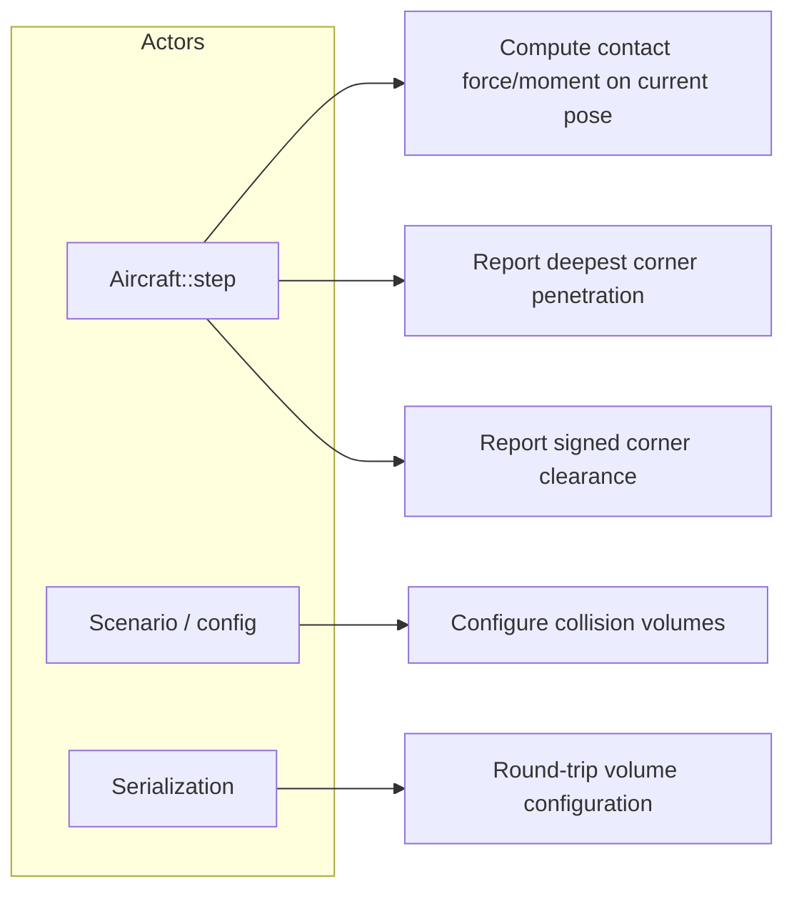
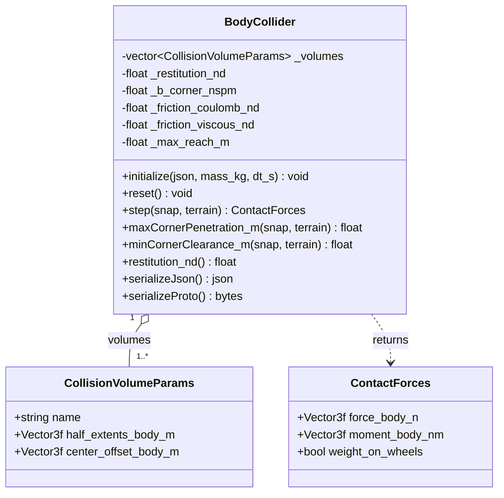
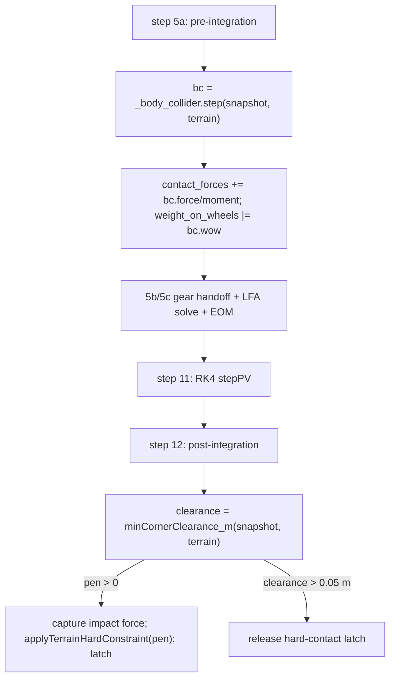

# Body Collider — Design

The body collider is a body-axis oriented-bounding-box (OBB) backstop that keeps the airframe
from penetrating terrain in attitudes and crash cases the landing gear does not cover (inverted,
deep nose-down, wing-low, gear-up). It is owned by `Aircraft` and called inside `Aircraft::step()`
both before integration (a one-step-lagged, dissipative velocity-arrest contact force, summed with the
gear reaction) and after integration (a restitution-consistent non-penetration hard constraint). Its
design target is *protection against ground penetration*, not a compliant suspension — the contact is
an inelastic arrest, not an elastic rebound.

---

## Use Case Decomposition



| ID | Use Case | Primary Actor | Mechanism |
| --- | --- | --- | --- |
| UC-1 | Penalty contact force/moment on a pose | `Aircraft::step()` | `BodyCollider::step(snap, terrain)` |
| UC-2 | Deepest penetration for the hard constraint | `Aircraft::step()` | `maxCornerPenetration_m(snap, terrain)` |
| UC-3 | Signed clearance for latch release | `Aircraft::step()` | `minCornerClearance_m(snap, terrain)` |
| UC-4 | Define per-part collision boxes | Scenario / config | `initialize(config)` |
| UC-5 | Persist configuration | Serialization | `serializeJson` / `serializeProto` (+ deserialize) |

---

## Class Hierarchy



`CollisionVolumeParams` is **geometry only** (the §5a velocity-arrest damping is a single
collider-level quantity derived from airframe mass and step, not a per-volume parameter — OQ-BC-5).
`BodyCollider` holds collider-level scalars (`restitution_nd`, the derived arrest damping, and the
§5d friction coefficients) but no mid-step force/moment state — `reset()` is a no-op and `step()` is
`const`. The §5c rotational-reaction state lives in `Aircraft` (OQ-BC-6 → Alt 2), not in
`BodyCollider`.

---

## Physical Models

§1 describes the collision geometry, §2 the normal contact, §3 the terrain hard-constraint coupling,
and §4 the `Aircraft` integration. §5 details the contact dynamics — the inelastic velocity-arrest
normal force (§5a), the restitution-consistent constraint (§5b), the dedicated rotational reaction
(§5c), and the scrape friction (§5d) — all **implemented**; §2/§3 give the overview and §5 the full
models and stability analysis.

### 1. Collision Geometry — OBB Corner Sampling

Each `CollisionVolumeParams` is a body-axis box with `half_extents_body_m` $\mathbf{h}$ and a
`center_offset_body_m` $\mathbf{c}$ from the CG. Multiple volumes per collider let the fuselage,
wings, and empennage each carry an appropriately sized box, so protection holds in any attitude.

Per step the collider tests the eight corners $\mathbf{p}_k = \mathbf{c} \pm \mathbf{h}$ of every
volume. A corner's geodetic altitude is $z_k = h_\text{ac} - (R_{NB}\,\mathbf{p}_k)_z$ (NED-z is
positive down, altitude positive up); its penetration is $\delta_k = h_\text{terrain} - z_k$, taken
to be in contact only when $\delta_k > 0$.

An **AGL early exit** skips the corner loops entirely when no volume can reach terrain:
$h_\text{ac} - h_\text{terrain} > r_\text{max}$, where $r_\text{max}=\max_v(\lVert\mathbf{c}_v\rVert +
\lVert\mathbf{h}_v\rVert)$ is the bounding-sphere reach of the worst volume over all orientations
(recomputed on `initialize`/`deserialize`).

### 2. Normal Contact — Dissipation-Dominated Velocity-Arrest

For each penetrating corner the collider applies a purely **dissipative** velocity-arrest force along
the upward terrain normal — no spring, hence no static restoring force and no elastic rebound (an
inelastic backstop, not a rubber bounce):

$$F_\text{pen} = \max\!\bigl(0,\; c\,\delta_\text{eff}\,\dot\delta\bigr),
\qquad c = b_\text{corner}/h_z,
\qquad \delta_\text{eff} = \min(\delta,\,2 h_z),
\qquad \dot\delta = \bigl(R_{NB}\,(\mathbf{v}_B + \boldsymbol\omega\times\mathbf{p}_k)\bigr)_z,$$

where $\dot\delta$ is the corner's sink rate (positive down) and $b_\text{corner}$ is the per-corner
arrest damping **derived in `initialize`** from the airframe mass and step (§5a, OQ-BC-5):
$b_\text{corner}=m/(n_\text{corners}\,N_\text{arr}\,dt)$ with a fixed $N_\text{arr}=3$, so the worst-case
aggregate over all corners sits at $1/N_\text{arr}<1$ on every airframe. The penetration is capped at
twice the volume half-depth. The $\max(0,\cdot)$ floor forbids adhesion and does no work on rebound —
the force is produced only while a corner is sinking. The force is rotated to body and accumulated with
its moment about the CG (any penetrating corner sets `weight_on_wheels`):

$$\mathbf{F}_B = R_{BN}\,[0,0,-F_\text{pen}]^\top + \mathbf{F}_t,\qquad
\mathbf{M}_B \mathrel{+}= \mathbf{p}_k\times\mathbf{F}_B,$$

where $\mathbf{F}_t$ is the §5d scrape friction (Coulomb + viscous) at the corner. The full model, the
parameter derivation, and the stability analysis (stable for all reasonable restitution $e\in[0,1)$)
are in §5a; the §5b hard constraint owns static non-penetration and restitution. This replaced an
elastic Kelvin–Voigt penalty spring whose fixed dimensional damping gave airframe-dependent restitution
(0 on a 5 kg UAS to ≈0.9 on a 5500 kg trainer) — the rubber-bounce defect; see §5a "why not a spring".

### 3. Terrain Hard-Constraint Coupling

The velocity-arrest force is a soft backstop; true non-penetration is enforced separately by the
post-integration **terrain hard constraint** (`Aircraft::step()` step 12), which is the **primary**
inelastic mechanism (§5b). After RK4 integration the collider reports `minCornerClearance_m` (signed:
negative means the deepest corner is below terrain). If any corner penetrates, `Aircraft` projects the
pose up by that depth via `KinematicState::applyTerrainHardConstraint(pen, restitution_nd)` — which
applies the restitution-consistent velocity correction $v_\text{normal}\mapsto -e\,v_\text{normal}$
(removing $(1+e)\,v_\text{normal}$; $e=$ `restitution_nd`, default 0 → fully inelastic) — re-runs the
collider on the penetrated pre-correction pose to capture the impact force/moment for monitoring, and
latches `_body_in_hard_contact`. The latch is released only on genuine separation (`clearance > 0.05 m`
hysteresis), so `weight_on_wheels` reporting stays accurate across the velocity-arrest force
momentarily reading zero after a correction.

The collider therefore participates in two mechanisms (§5b, OQ-BC-2): the geometric projection above is
the primary, restitution-consistent inelastic backstop (the single user knob `restitution_nd`, §5a),
and the §2 velocity-arrest force supplies in-contact damping and the contact moment that drives the §5c
rotational reaction.

### 4. Integration with `Aircraft`

See the [Integration](#integration) section below for the call sites and data flow. The collider's
force and moment are summed into the same `ContactForces` accumulator as the landing gear
(`contact_forces.force_body_n += bc.force_body_n`, etc.), then carried into the wind-frame EOM by
the shared contact path described in [aircraft.md](aircraft.md) step 10.

### 5. Contact Dynamics

> **Status: implemented and tested.** All four items are implemented (OQ-BC-1…7 resolved): §5a
> velocity-arrest normal contact, §5b restitution-consistent hard constraint, §5c dedicated
> rotational-reaction $\Delta\theta$ channel (parallel filters in `Aircraft`, behavior-preserving by the
> $H_2$/`LP`/$G(s)$ linearity invariant), and §5d Coulomb + viscous scrape friction. The implementation
> plan and its tests are in [body_collider_dynamics.md](../implementation/body_collider_dynamics.md).

**§5a — Inelastic normal contact: dissipation-dominated velocity-arrest (implemented, OQ-BC-1 →
Alternative 3).** A purely **dissipative** normal force
that opposes the corner sink rate, so penetration is decelerated and arrested with **no stored elastic
energy to return** — coefficient of restitution $e=0$ by construction. Per penetrating corner, with
$\delta\ge0$ the penetration and $\dot\delta$ the sink rate (positive = deeper), the force is
penetration-modulated so it rises continuously from zero at contact (the Hunt–Crossley *damping* term
without its spring), under the no-tension floor that forbids adhesion and does no work on rebound:

$$F = \max\!\bigl(0,\; c\,\delta\,\dot\delta\bigr),$$

with the simpler pure damper $F=\max(0,\,b\dot\delta)$ as the fallback if onset continuity proves
unnecessary. The contact provides **no static restoring force**; static non-penetration is owned by the
§5b hard constraint (OQ-BC-2; an inelastic velocity projection), and the arrest force only reduces the
approach velocity so the constraint's per-step correction stays small. *Why not a spring:* the design
target $e\approx0$ makes an energy-storing spring (Kelvin–Voigt or Hunt–Crossley) the wrong primitive —
driving its restitution to zero is the ill-conditioned regime (Hunt–Crossley's $a\!\leftrightarrow\!e$
map diverges as $e\to0$; over-damped KV leaks a speed-dependent, only-approximate $e$ and keeps a
contact-onset force step). A dissipative arrest encodes $e=0$ directly.

**Parameterization and derivation (decided, OQ-BC-5).** The body collider exposes **exactly one
user-facing contact parameter — a non-dimensional coefficient of restitution $e$** (`restitution_nd`,
default $0$, clamped to $[0,1)$), consumed by the §5b hard constraint. There is **no per-volume and no
per-corner user parameter**: `CollisionVolumeParams` is reduced to geometry (`name`,
`half_extents_body_m`, `center_offset_body_m`). `Aircraft` supplies the airframe mass $m$, the outer
step $dt$, and the inertia tensor to `BodyCollider::initialize` (the architectural correction; the
inertia also serves §5c). The §5a velocity-arrest **damping is derived internally and is independent of
$e$**: with a fixed internal arrest factor $N_\text{arr}\approx3$ (arrest over $\sim N_\text{arr}$
steps), the aggregate damping is $b_\text{total}=m/(N_\text{arr}\,dt)$, which satisfies the discrete
stability bound $b_\text{total}\,dt/m = 1/N_\text{arr} < 1$ **by construction on every airframe and at
every step rate**. The per-corner coefficient distributes $b_\text{total}$ across the corners
penetrating this step (normalizing by the live active-corner count), so the aggregate is
pose-independent — an internal convention, not a knob. The result is tuning-free: the author sets only
$e$ (and may leave it at $0$), and because the derived damping scales with $m$ and $dt$ the dimensional
behavior is identical across airframes.

**Stability of the velocity-arrest contact.** Verified across the four layers it must hold at: the
continuous dynamics, the explicit discrete scheme with the one-step lag, the composition with the
$e=0$ constraint, and the attitude loop. The model is the per-corner normal force $F=\max(0,\,b\dot\delta)$
(pure damper) or $F=\max(0,\,c\,\delta\dot\delta)$ (penetration-modulated), computed at the
pre-integration pose (one-step lag), advanced by RK4, then projected by the §5b constraint.

1. **Continuous-time dynamical stability — unconditional.** In contact under a net downward load
   $F_\text{ext}$, the 1-DOF normal model $m\ddot\delta = F_\text{ext}-b\dot\delta$ is **first order** in
   $v=\dot\delta$: $\dot v = F_\text{ext}/m - (b/m)v$, characteristic root $s=-b/m<0$, single and real.
   With no spring there is **no oscillatory mode**, so the contact is structurally incapable of bouncing
   or limit-cycling (contrast Kelvin–Voigt's complex pair $s=-\zeta\omega_n\pm j\omega_n\sqrt{1-\zeta^2}$,
   $\omega_n=\sqrt{k/m}$, which is what rings). It is strictly dissipative: contact power on the body is
   $-F v = -b v^2\le0$ while sinking, and the no-tension floor gives $F=0$ on rise, so the contact only
   ever removes normal kinetic energy — Lyapunov-stable with $\tfrac12 m v^2$ as the storage function.
   The penetration-modulated form has the same character with rate $-c\delta/m\le0$.

2. **Discrete numerical stability — one easily-met CFL-type bound.** The fast mode is $\lambda=-b/m$
   (or $-c\delta/m$); the lagged force evaluated at $v_n$ is the explicit (forward-Euler) evaluation, so
   the homogeneous update is $v_{n+1}=v_n\bigl(1-\tfrac{b}{m}dt\bigr)+\tfrac{F_\text{ext}}{m}dt$ with
   amplification $\bigl|1-\tfrac{b}{m}dt\bigr|$. Hence $b\,dt/m_\text{eff}<1$ gives monotone decay (the
   **design target**: no overshoot, no spurious one-step rebound); $1<b\,dt/m_\text{eff}<2$ is stable but
   sign-flipping (a numerical micro-bounce that would defeat $e\approx0$); $>2$ is unstable (RK4 extends
   the hard real-axis limit to $\approx2.785$). Parameterize the arrest as $\tau=m_\text{eff}/b=N\,dt$,
   $N\gtrsim2\text{–}3$. This is strictly easier than Kelvin–Voigt, which must satisfy **two** explicit
   limits ($dt<2/\omega_n$ for the spring and the damper bound) *and still bounces*. The one-step lag is
   benign here: lag erodes margin only by adding phase to a **resonant** loop (the gear/attitude limit
   cycle); a first-order non-oscillatory decay has no resonance to excite, and the lag is already counted
   in the forward-Euler bound. The decided derivation sets $b_\text{total}=m/(N_\text{arr}\,dt)$ with
   fixed $N_\text{arr}\approx3$, so $b_\text{total}\,dt/m=1/N_\text{arr}$ sits safely inside this bound
   on every airframe and at every step rate. For the modulated form $c\delta/m$ is bounded because
   $\delta$ is capped ($2h_z$), so the same bound applies at the worst case $c(2h_z)\,dt/m<1$.

3. **Composition with the restitution constraint — contraction for $e\in[0,1)$.** Each step the damper
   contracts the normal velocity by $(1-\tfrac{b}{m}dt)\in(0,1)$ (a contraction under the bound), and the
   §5b projection maps the normal approach velocity $v_\text{normal}\mapsto -e\,v_\text{normal}$ (it
   removes $(1+e)\,v_\text{normal}$). For $e\in[0,1)$ that projection is a **contraction** with factor
   $e$ ($\lVert Pv\rVert = e\lVert v\rVert \le \lVert v\rVert$): at $e=0$ it zeros the velocity (fully
   plastic), and as $e\to1$ it approaches energy-preserving reflection. A contraction composed with a
   contraction is a contraction in normal kinetic energy — **no growth, no launch** for any $e<1$. Both
   the damper (purely dissipative) and the projection (energy $\times e^2$ per contact) only remove
   normal energy, so the airframe cannot be ejected; the worst case at $e=0$ is "stuck to the surface"
   (the desired plastic behavior), and it still departs under aero/gear lift once clearance returns (the
   $0.05\text{ m}$ release hysteresis).

4. **Attitude-coupling stability — the gear failure mode does not recur.** That artifact was a loop
   (stiff spring $\to$ FPA swing $\to$ swept contact point $\to$ spring) closed by an **oscillatory**
   normal force against the zero-inertia attitude. This contact has no oscillatory normal mode to feed
   it; it routes the contact moment through the §5c (OQ-BC-3) bounded second-order low-pass with finite
   DC and no free integrator — the same $H_2$ the gear's describing-function analysis
   ([landing_gear.md §7](landing_gear.md)) established as stable — driven by a non-oscillatory moment
   (force $\propto$ a decaying velocity); and it breaks the contact-point sweep via the §5c $\Delta\theta$
   in $\theta_\text{geom}$. This layer is stable **conditional on** the §5c filter being parameterized as
   in the gear (OQ-BC-3 Alternative 1).

*Edge cases.* (a) The decided derivation makes the **aggregate** damping
$b_\text{total}=m/(N_\text{arr}\,dt)$ pose-independent (live per-corner normalization), so the bound
$b_\text{total}\,dt/m=1/N_\text{arr}<1$ holds at every pose and airframe by construction — no
effective-mass estimate to tune. (b) A deep single-step incursion (high sink rate $\times$ large $dt$)
penetrates a bounded $\approx v_\text{sink}\,dt$ before the lagged, capped force acts; the §5b constraint
guarantees non-penetration — transient penetration, not instability. (c) Both forms send $F\to0$
continuously as $\dot\delta\to0$ (and the modulated form as $\delta\to0$), so the no-tension switch is
$C^0$ with no force jump — this design **removes** a chatter source that Kelvin–Voigt's clipped finite
spring force introduces.

*Robustness across the restitution range $e$.* $e$ is the only authored contact parameter, so the
verification must hold for every reasonable value — and it does, **for all $e\in[0,1)$**. (i)
*Computational.* $e$ enters **only** the §5b algebraic projection $v\mapsto -e\,v$ — no integration, no
$e$-dependent stiffness, hence no CFL condition on $e$; it is numerically stable for any $e\in[0,1]$.
The §5a damper is derived from the fixed $N_\text{arr}$ and is **independent of $e$**, so its bound
$1/N_\text{arr}<1$ is untouched by the restitution choice. (ii) *Dynamical.* The per-contact normal-energy
map has factor $e^2<1$ for $e<1$, so energy is monotonically removed and the response grades smoothly
with $e$ — plastic at $e=0$, progressively springier toward $e\to1$, bounded throughout — with no value
in the range producing growth, chatter, or a step-size penalty. The elastic limit $e=1$
(energy-preserving perfect bounce, marginally stable) lies outside the inelastic-backstop intent and is
excluded by clamping $e$ to $[0,1)$. (iii) *Physical consistency.* $e$ is dimensionless and
frame-independent, so the same $e$ yields the same restitution on every airframe, while the derived
damping scales with $m,dt$ to keep the arrest timescale ($N_\text{arr}$ steps) identical across the
fleet. The whole range $e\in[0,1)$ — design intent near $0$ — therefore gives reasonable,
physically-consistent dynamic and computational behavior, with no tuning required.

*Conclusion.* The velocity-arrest contact is dynamically stable **unconditionally** (real-negative
eigenvalue, no oscillatory mode, strictly dissipative) and numerically stable under the single bound
$b\,dt/m\lesssim1$ — met by construction since $b_\text{total}\,dt/m=1/N_\text{arr}$ — and it composes
stably with the restitution constraint **for all $e\in[0,1)$**, without re-exciting the gear/attitude
loop. It is strictly easier to keep stable than the current Kelvin–Voigt contact. The verification holds
subject to two remaining conditions, each carried as a prerequisite or test: the §5c moment-filter
parameterization, and the §5b constraint owning static position. When §5a is implemented, this analysis
should be promoted to a numerical-analysis document in [`docs/algorithms/`](../algorithms/) per the
`/algo` convention.

**§5b — Penalty / hard-constraint role split (implemented, OQ-BC-2 → Alternative 2).** The
post-integration hard constraint (§3) is the **primary** non-penetration mechanism and is made
*restitution-consistent*: instead of hard-zeroing the corner normal velocity it removes $(1+e)$ of
the normal approach component (i.e. $v_\text{normal}\mapsto -e\,v_\text{normal}$) with the **single
collider-level coefficient of restitution $e$** (`restitution_nd`, default $0$, the only user-facing
contact knob — see the §5a parameterization and OQ-BC-5), bounding penetration every step. The penalty force (§5a) is demoted to supplying in-contact damping and the contact moment for
§5c — it no longer has to be stiff enough to arrest the impact before penetration, so there is no
stiff-spring step-size penalty. The lesson from the gear is that a stiff backstop firing against the
load-factor model's near-zero-inertia, velocity-slaved attitude produces non-physical feedback and
limit cycles, and the constraint's velocity correction is a discrete analogue; the acceptance
requirement (Test Strategy `Aircraft_BodyCollider_NoRelaunch`) is that the restitution-consistent
projection does not excite the kinematic attitude.

**§5c — Gear-style rotational reaction $\Delta\theta$ (implemented, OQ-BC-3/6/7 resolved).** The goal
is a rotational reaction to a body strike (a wing-low
or tail-first contact pitches/rolls the airframe *about* the contact, via the §2a low-pass on $M/I$
with properties P1–P4), with the gear and body-collider contributions **independently attributable**.

*As-built today (the starting point).* The `Aircraft::step` rotation-deviation block
([landing_gear.md §2a](landing_gear.md)) is **ungated** and driven by the **combined** contact force
and moment (`contact_forces.force_body_n` / `.moment_body_nm`), which already include the body
collider's contributions (summed at step 5a). So a gear-up belly or wing strike **already produces a
rotational reaction** — the collider's moment flows through the same $H_2$ filters as the gear's and
decays to zero when unloaded (P1). Functionally this is the *shared* channel (OQ-BC-3 Alternative 2);
what is missing is **attribution** — the two sources are summed before the filter and cannot be
inspected separately.

*Design (Alternative 1 — separated moment **and** force channels).* Keep the gear and collider
contact reactions **separate** for the rotation-deviation channels while still summing them for the EOM.
Both the **moment channels** (the $H_2$ low-pass on $M/I$ per axis) and the pitch **force channel** (the
$G(s)$ on the destanced vertical load) are duplicated per source — gear-driven and collider-driven — and
summed into the attitude exactly as the single combined channels are today. Each pair shares its
parameters: the airframe rotational-mode $\omega_n,\zeta$ for the moment filters, and the same stance
$\tau$ and $G(s)$ coefficients for the force channel.

*Why this is safe (the key invariant).* Every operator in both channels is **linear** in the contact
load — the $H_2$ moment filters, and for the force channel the stance low-pass, the $a_\text{arrest}$
difference, the $\cos\gamma/V$ and $\Phi(V)$ scalings (common aircraft-state factors, not per-source),
and the $G(s)$ realization. Linear operators superpose, so with matched parameters
$$L(\text{gear}) + L(\text{bc}) = L(\text{gear}+\text{bc})$$
for **both** channels — e.g. $H_2(M_\text{gear}/I)+H_2(M_\text{bc}/I)=H_2\!\big((M_\text{gear}+M_\text{bc})/I\big)$
for the moment, and $\operatorname{LP}(f_\text{gear})+\operatorname{LP}(f_\text{bc})=\operatorname{LP}(f_\text{gear}+f_\text{bc})$
for the stance destancing. The sum of the two separated channels is therefore **mathematically
identical** to today's single combined channel — exact modulo float rounding and any filter **clip
saturation** (the filters are `FilterSS2Clip`; if a clip engages, the split can differ, which the
equivalence test below detects directly). The separation only re-buckets the same total into two
inspectable parts.

*$\omega_n,\zeta$ source.* The rotation filter's natural frequency and damping are a property of the
**airframe rotational mode**, not of which force produced the moment, so the collider channel reuses
the gear's parameters: $\omega_n=$ `dtheta_wn_{axis}_ratio`$\times(g/V_\text{stall})$, $\zeta=$
`dtheta_zeta_nd` (config ratios scaled by the flight-path frequency, in `Aircraft::initialize`). The
inertia tensor enters only as the $M/I$ forcing. *(The earlier "$\omega_n,\zeta$ from the inertia
tensor" phrasing was imprecise — inertia alone cannot set a frequency.)* Reusing the gear's parameters
adds **no body-collider config** (consistent with OQ-BC-5) and is exactly what makes the linearity
equivalence hold.

*Decided mechanics (OQ-BC-6/7 → Alternative 2 + Alternative 2).* The collider's rotation filters live
as a **parallel set in `Aircraft`** — `_bc_dtheta_{pitch,roll,yaw}_filter` plus a collider
force-channel $G(s)$/stance state, mirroring the gear's — keeping the attitude machinery in one place
and reusing the proven filter/serialization patterns (OQ-BC-6 → Alt 2). **Both** channels are
attributed: the collider gets its own force channel as well as its own moment channels (OQ-BC-7 →
Alt 2). *(Correction: an earlier draft claimed the force channel "does not separate by linearity"
because of the stance destancing — that was wrong. The stance low-pass is linear and superposes, so the
force-channel separation is behavior-preserving exactly like the moment channels, per the invariant
above.)*

*Regression protection.* (1) **Characterize first** — the existing gear $\Delta\theta$ tests
(`LandingGear_DthetaState_NonzeroAfterContact`, `LandingGear_ForceChannel_DecaysAfterTransient`,
`LandingGear_GearContact_DoesNotAccelerate`, …) capture current behavior and must stay green.
(2) **Equivalence test** — assert the separated-channel sum (moment **and** force) equals the
pre-refactor combined $\Delta\theta$ to float tolerance on a belly-strike snapshot; by the linearity
invariant this holds exactly except where a `FilterSS2Clip` saturates, which this test flags directly.
(3) **Golden trajectory** — a body-collider belly-landing scenario run before and after the refactor,
with attitude and trajectory unchanged within tolerance. Because **both** channels separate linearly,
the entire §5c refactor is **provably non-breaking** in the unclipped regime, and the equivalence test
is the explicit guard for the clip regime. **Implemented** as a parallel `_bc_dtheta_*` filter set in
`Aircraft` (the gear filters now read gear-only force/moment); the existing gear-only and bc-only tests
pass unchanged, confirming the linearity equivalence.

**§5d — Tangential scrape friction (implemented, OQ-BC-4 → Alternative 1 + viscous term).** Penetrating
corners get a tangential force combining regularized Coulomb friction with a velocity-proportional
momentum-transfer (plowing) term:

$$\mathbf{F}_t = -\mu\,F_\text{pen}\,\hat{\mathbf{v}}_{t,\text{reg}} \;-\; c_t\,\mathbf{v}_t,$$

where $\mathbf{v}_t$ is the corner's tangential ground velocity, $\hat{\mathbf{v}}_{t,\text{reg}}$ is
its direction regularized near zero slip to avoid chatter, $\mu$ is the (non-dimensional) Coulomb
coefficient from the surface-friction parameterization shared with the gear, and $c_t$ is a
non-dimensional viscous coefficient (scaled to the airframe so it is mass-independent) emulating the
momentum the airframe loses plowing into terrain — the Coulomb cap alone under-represents that sink.
Both terms act only while a corner penetrates. The smooth-dynamics standard exempts contact/friction
physics from the $C^1$ requirement (see [general.md](../guidelines/general.md#smooth-dynamics)), so
the stick–slip discontinuity is acceptable here. The viscous coefficient is derived as
$k_\text{visc}\cdot b_\text{corner}$ (mass-scaled, so it is tuning-free like the normal arrest), and
both knobs default to 0 (frictionless until configured).

---

## Integration

`Aircraft` owns a `BodyCollider _body_collider` value member, active only when the config contains a
`body_collider` section (`_has_body_collider`). It is called at two points in `Aircraft::step()`:



- **Step 5a (pre-integration, one-step lag).** `step(snapshot, *terrain)` is evaluated on the
  current pose and summed with the landing-gear reaction into `contact_forces`. Computed before the
  `LoadFactorAllocator` solve so the n_z handoff (§2b of the gear contract) sees this step's contact.
- **Step 12 (post-integration hard constraint).** Described in §3. Uses `minCornerClearance_m`
  (signed) for separation detection and `maxCornerPenetration_m` / `applyTerrainHardConstraint` for
  the projection.

The call signature consumed by `Aircraft` is
`ContactForces step(const KinematicStateSnapshot&, const Terrain&) const`. The terrain pointer must
be non-null (`_has_body_collider && _terrain != nullptr`) for either mechanism to run.

---

## Interface

```cpp
// include/collision/BodyCollider.hpp — namespace liteaero::simulation

struct CollisionVolumeParams {        // geometry only (OQ-BC-5)
    std::string     name;
    Eigen::Vector3f half_extents_body_m  = {0.5f, 0.3f, 0.2f};
    Eigen::Vector3f center_offset_body_m = Eigen::Vector3f::Zero();
};

class BodyCollider {
public:
    // mass_kg and dt_s derive the §5a velocity-arrest damping; defaults are a test
    // convenience — Aircraft passes the real airframe mass and outer step.
    void initialize(const nlohmann::json& config, float mass_kg = 1.0f, float dt_s = 0.01f);
    void reset() {}

    ContactForces step(const liteaero::nav::KinematicStateSnapshot& snap,
                       const liteaero::terrain::Terrain& terrain) const;
    ContactForces step(const liteaero::nav::KinematicStateSnapshot& snap) const;  // flat terrain at 0 m

    [[nodiscard]] float maxCornerPenetration_m(
        const liteaero::nav::KinematicStateSnapshot& snap,
        const liteaero::terrain::Terrain& terrain) const;          // clamped >= 0
    [[nodiscard]] float minCornerClearance_m(
        const liteaero::nav::KinematicStateSnapshot& snap,
        const liteaero::terrain::Terrain& terrain) const;          // signed

    [[nodiscard]] float restitution_nd() const;                    // §5b coefficient (consumed by Aircraft)

    [[nodiscard]] nlohmann::json       serializeJson() const;
    void                               deserializeJson(const nlohmann::json& j);
    [[nodiscard]] std::vector<uint8_t> serializeProto() const;
    void                               deserializeProto(const std::vector<uint8_t>& bytes);
};
```

---

## Serialization

### Serialized State

The collider has **no mid-step force/moment state** (`step()` is `const`); the §5c rotation-deviation
filters live in `Aircraft` (OQ-BC-6 → Alt 2), not here. `BodyCollider` serialization round-trips the
volume geometry plus the collider-level contact scalars below — the single user knob `restitution_nd`,
the §5d friction coefficients, and the **derived** arrest damping (serialized so a restore reproduces
behavior without re-supplying mass/`dt`).

| Field | Type | Unit | Description |
| --- | --- | --- | --- |
| `restitution_nd` | float | — | §5b coefficient of restitution, $[0,1)$, default 0 (the only user-facing contact knob) |
| `arrest_damping_corner_nspm` | float | N·s/m | §5a per-corner velocity-arrest damping, derived in `initialize` from mass/`dt` |
| `friction_coulomb_nd` | float | — | §5d Coulomb coefficient $\mu$, default 0 |
| `friction_viscous_nd` | float | — | §5d viscous (plowing) factor on `b_corner`, default 0 |

Per-volume configuration is geometry only: `name`, `half_extents_body_m`, `center_offset_body_m`. The
field count is below the ten-field threshold for a standalone schema document; it is specified inline.

> **Aircraft serialization gaps (found during the §5c round-trip test — fixed, IP-BC-10).** A
> deserialize-then-continue-step test (`Aircraft_BodyCollider_RoundTrip_PreservesSubsystem`) exposed a
> *cluster* of pre-existing `Aircraft` serialization gaps, none body-collider-specific:
> - **`_wa_q_lo_pa`/`_wa_q_hi_pa`** (the OQ-LG-24/26 w_a authority band edges) were not serialized and
>   default to `0`. A degenerate `(0,0)` band makes `w_a = 1` at any `q > 0`, so a restored aircraft
>   applies full load-factor authority at low `q` and α saturates to the box limit — **the actual cause
>   of the continued-step divergence** (not the reporting-only `_body_in_hard_contact`, which was a red
>   herring). Fixed: serialize both edges (JSON + proto).
> - **`_has_landing_gear`/`_has_body_collider`** were read to gate restoring each subsystem block but
>   never set (set only in `initialize`), so a fresh-constructed aircraft **silently dropped both its
>   gear and collider** on deserialize. Fixed: set from block presence (JSON) / `has_*()` (proto).
> - **Proto omitted the subsystems entirely** — `AircraftState` had no `landing_gear`/`body_collider`
>   field (violating the JSON/proto symmetry rule). Fixed: added fields 71/72 and serialize/deserialize.
> - **`_outer_dt_s`** was not serialized (defaulted to `0.02`, coincidentally matching; latent). Fixed:
>   reconstructed as `_cmd_filter_dt_s · _cmd_filter_substeps`.
> - **`_body_in_hard_contact`** now serialized too (correct round-trip of the reported WoW); interim
>   pending the OQ-BC-8 latch-vs-stateless decision.

### Proto Message

```proto
message CollisionVolumeParams {        // geometry only (§5a / OQ-BC-5)
    string   name                 = 1;
    Vector3f half_extents_body_m  = 2;
    Vector3f center_offset_body_m = 3;
}

message BodyColliderParams {
    int32                          schema_version             = 1;
    repeated CollisionVolumeParams volumes                    = 2;
    float                          restitution_nd             = 3;  // §5b
    float                          arrest_damping_corner_nspm = 4;  // §5a derived
    float                          friction_coulomb_nd        = 5;  // §5d mu
    float                          friction_viscous_nd        = 6;  // §5d k_visc
}
```

---

## Computational Resource Estimate

| Operation | Count per outer step |
| --- | --- |
| AGL early-exit test | 1 (skips everything below when clear) |
| Corner penetration tests | $8 \times N_\text{vol}$ rotations + compares |
| Penalty force/moment | $\le 8 \times N_\text{vol}$ (penetrating corners only) |
| `minCornerClearance_m` (step 12) | $8 \times N_\text{vol}$ |

For a typical 3-volume airframe (fuselage, wings, tail) that is $\le 24$ corner evaluations for the
arrest pass (each adds the §5d tangential force) plus 24 for the clearance pass, each a $3\times3$
rotation and a scalar compare. Memory footprint is the volume geometry list, the four collider-level
scalars, and one cached `_max_reach_m`. The §5c rotation-deviation filters (a parallel per-axis
second-order set plus a force-channel 2-state) live in `Aircraft`, costing a handful of multiply-adds
per step. At a nominal outer step all of this is negligible relative to the LFA solve and aero model.

---

## Open Questions

One design question is open (OQ-BC-8); the rest are resolved (resolution notes below).

| ID | Summary | Blocking |
| --- | --- | --- |
| OQ-BC-8 | Weight-on-wheels detection: latched `_body_in_hard_contact` flag vs a stateless geometric (clearance-based) test | WoW-reporting cleanup; a separate `_has_*` deserialize defect is a bug to fix outright (see Serialization) |

### OQ-BC-8 — Weight-on-Wheels Detection: Latched Flag vs Stateless Geometric *(open)*

**Problem.** The §5a velocity-arrest normal force is **zero at static rest** (it opposes only an active
sink rate), so a belly-resting aircraft produces no contact force, and weight-on-wheels (WoW) detected
from the instantaneous force/penetration reads *false* for a settled belly even though the aircraft is
on the ground. To patch this, `Aircraft` carries a latched flag `_body_in_hard_contact` (set when the
post-integration hard constraint fires, released on `> 0.05 m` separation) that forces the reported
`weight_on_wheels` true. Investigation found: **(a)** the latch is **reporting-only** — it modifies the
stored `_contact_forces.weight_on_wheels` (read externally via `contactForces()`), but the control loop
(the §5b apportionment gate and the settle fade) reads the *local* per-step geometric WoW, **not** the
latch. So it is **not** the OQ-LG-22 failure (a latch that fed a synthetic full-weight force into the
apportionment loop and capped go-arounds — that misuse of this same flag was already removed for the
gear). **(b)** It is, however, the same *hidden-latched-state* smell: it adds a hysteresis state with no
functional use beyond reporting, and serialized state that is easy to forget (the gear's OQ-LG-22
lesson: prefer stateless detection over remembered state).

**Update — the control-loop flicker is an active defect, not a cosmetic follow-on.** A post-contact
time-history regression (`BodyColliderOnly_Landing_DoesNotOscillateAfterContact`, a belly landing at
55 m/s) exposed a non-physical **integration-frequency limit cycle**: after first contact the pitch
attitude reverses direction almost every step (**581 reversals over 584 post-contact steps**, 5.8°
peak-to-peak even in the settled window). Bisection by selectively disabling each contribution
localized the driver unambiguously:

- It is **not** the §5c Δθ rotational channel (zeroing the body-collider Δθ contribution changed
  nothing) and **not** a velocity-direction effect (the flight-path angle is steady at ≈ −0.0036 rad).
- The pitch equals $\alpha_\text{body}$, and $\alpha$ tracks `n_z_shaped`, which **slams between 1.0 and
  0.0 every step**. The term forcing it to zero is the OQ-LG-23 axial-acceleration **settle term**,
  whose gate is $\varphi_g = \text{WoW}\cdot s_\text{unload}$. The *control-loop* WoW (the local
  per-step penetration flag, **not** the reporting latch) **chatters every step**: the §5b hard
  constraint projects the penetrating pose back to the surface, so the next step's pre-integration pose
  is clear (WoW false) before gravity re-penetrates it (WoW true). Because the belly landing is
  decelerating hard, the settle increment is clipped to ≈ −1.0 whenever WoW is true, so the gate
  toggling on/off drives commanded lift — and hence $\alpha$ and pitch — fully on/off at the
  integration rate.
- Replacing the control-loop WoW with the **stateless geometric clearance-margin** test
  (`minCornerClearance_m < margin`, Alternative 1) makes the regression **pass outright** (reversals
  and peak-to-peak both within physical settling bounds): a belly resting within the margin reports
  WoW *continuously* true, so the settle gate stops toggling.

The mechanism is the body-collider analog of the gear settle/WoW coupling: the gear strut is a stateful
spring-damper that stays loaded continuously on the ground, so its WoW does not chatter; the body
collider has no persistent contact state and the hard constraint removes the penetration each step, so
a **per-step** WoW necessarily flickers. The resolution therefore must replace the **control-loop**
gate (not merely the reported flag) with a stateless, hysteresis-free geometric WoW.

**Alternatives:**

1. **Stateless geometric WoW (recommended).** Report WoW from geometry every step:
   `weight_on_wheels = (minCornerClearance_m < margin)` — true when any corner is at or below terrain
   within a small margin (the hard constraint holds the deepest corner at clearance $\approx 0$ at rest,
   so this reads true for a settled belly and false airborne). Eliminates `_body_in_hard_contact` and
   its hysteresis/serialization entirely.
   - **Benefits:** correct at static rest; no latched state to serialize or drift; aligns with the
     OQ-LG-22 "no hidden latched state" lesson; removes the flag rather than persisting it.
   - **Drawbacks:** if the same geometric WoW also replaces the **control-loop** gate (currently the
     pre-integration per-step penetration, which *also* flickers for belly-only contact), that is a
     behavior change to characterize; the clearance is computed post-integration, so feeding the control
     loop incurs a one-step lag.
   - **Prerequisites:** decide whether the geometric WoW feeds reporting only or also the control-loop
     gate; a characterization test.

2. **Keep the latch, serialize it.** Persist `_body_in_hard_contact` in JSON + proto.
   - **Benefits:** minimal change.
   - **Drawbacks:** keeps the hidden-state smell; the latch stays reporting-only with no functional
     benefit over the geometric test; does not address the control-loop flicker for belly-only contact.
   - **Prerequisites:** add the bool to the serialized state.

3. **Force-only WoW (drop the latch, no substitute).** Report WoW purely from the instantaneous contact
   force.
   - **Benefits:** simplest; no state.
   - **Drawbacks:** a settled belly reads WoW *false* (no static force) — wrong; regresses reporting.
   - **Prerequisites:** none.

**Recommendation.** Alternative 1 (stateless geometric WoW) for the reported flag; whether it also
replaces the control-loop gate is a follow-on, characterized decision. It removes the latch and its
serialization concern rather than persisting hidden state — the gear lesson applied to its spirit. Note
this is **separate** from the `_has_landing_gear`/`_has_body_collider` deserialize defect (a plain bug,
see the Serialization note), which must be fixed regardless of how OQ-BC-8 resolves.

### OQ-BC-6 — §5c Δθ Filter State Location *(Resolved)*

**Resolution (Alternative 2 — parallel filter set in `Aircraft`).** The body-collider rotation filters
live in `Aircraft` as a parallel set mirroring the gear's — `_bc_dtheta_{pitch,roll,yaw}_filter`
(`FilterSS2Clip` per axis) plus a collider force-channel $G(s)$/stance state — reusing the gear's
$\omega_n,\zeta$ (config ratios $\times g/V_\text{stall}$, `dtheta_zeta_nd`) and serialization patterns,
and driven by the **body-collider** contact moment/force separated from the gear's at step 5a.
**Rationale (user):** keep the delicate attitude integration in one place and reuse the validated gear
machinery; the collider's contribution is still a separate, attributable term. **Consequence:** the
body collider itself stays stateless (its rotational state lives in `Aircraft`), a deliberate departure
from the OQ-BC-3 "self-contained" wording, accepted for the lower refactor risk. Implemented.

### OQ-BC-7 — §5c Force / Descent-Arrest Channel Attribution *(Resolved)*

**Resolution (Alternative 2 — the collider gets its own force channel; behavior-preserving).** Both
rotation channels are attributed per source: the collider gets its own force channel (a second
$G(s)$ + stance filter on the **collider** vertical load) alongside its own moment channels, and the
gear channels are driven by the **gear** load/moment only. **Correction:** the OQ-BC-7 problem statement
originally asserted the force channel "does not separate by linearity" because the stance destancing
couples the sources — **that was wrong.** The stance low-pass is linear and superposes
($\operatorname{LP}(f_\text{gear})+\operatorname{LP}(f_\text{bc})=\operatorname{LP}(f_\text{gear}+f_\text{bc})$),
and the remaining force-channel operators ($a_\text{arrest}$, the $\cos\gamma/V$ and $\Phi(V)$
aircraft-state scalings, and $G(s)$) are linear or common-factor, so the separated force channels sum
**exactly** to the combined one — behavior-preserving like the moment channels, modulo float rounding
and `FilterSS2Clip` saturation (which the §5c equivalence test guards). **Rationale (user):** full
attribution of both channels, now established to carry no behavior penalty. Implemented.

### OQ-BC-5 — §5a Velocity-Arrest Coefficient Parameterization *(Resolved)*

**Resolution (single non-dimensional user knob — coefficient of restitution $e$ alone).** The body
collider exposes **exactly one user-facing contact parameter, a non-dimensional coefficient of
restitution $e$** (`restitution_nd`, default $0$, clamped to $[0,1)$), consumed by the §5b hard
constraint. There is **no per-volume and no per-corner user parameter**; `CollisionVolumeParams` is
reduced to geometry. `Aircraft` supplies the airframe mass, outer step $dt$, and inertia tensor to
`BodyCollider::initialize` (the architectural correction — the inertia also serves §5c), and the §5a
velocity-arrest damping is **derived internally and independently of $e$** from a fixed arrest factor
$N_\text{arr}\approx3$: $b_\text{total}=m/(N_\text{arr}\,dt)$, distributed across the live penetrating
corners. The full design and the parameter derivation are documented in §5a. **Rationale (user):** the
collider is a non-penetration backstop, not a tuned suspension; its one parameter must be
non-dimensional and tuning-free with a wide robust range, and the config-only architecture (no airframe
properties) is an architectural error to fix, not a constraint to design around. **Verification:** the
§5a stability analysis is extended to prove that **all reasonable $e$** give reasonable behavior — for
every $e\in[0,1)$ the contact is dynamically stable (per-contact normal energy $\times e^2$, monotone
decay) and computationally stable ($e$ enters only an algebraic projection, no CFL; the derived damper
is $e$-independent and stable by construction), graded smoothly from plastic ($e=0$) toward the
excluded elastic limit ($e\to1$). **Not yet implemented** (tracked in
[body_collider_dynamics.md](../implementation/body_collider_dynamics.md)).

### OQ-BC-1 — Inelastic Normal-Contact Formulation *(Resolved)*

**Resolution (Alternative 3 — dissipation-dominated velocity-arrest).** The normal contact is a purely
dissipative velocity-arrest force (no spring), giving $e=0$ by construction; the decided design, its
force forms, parameterization, and the full numerical/dynamical stability verification are in §5a.
**Rationale (user):** the design target is a coefficient of restitution of zero or near zero, and a
penalty spring is an energy-storage device whose restitution can only be driven to zero in an
ill-conditioned regime (Hunt–Crossley's $a\!\leftrightarrow\!e$ map diverges as $e\to0$; over-damped
Kelvin–Voigt leaves a speed-dependent, only-approximate $e$ with a contact-onset force step). A
dissipative arrest encodes $e=0$ directly and is consistent with the resolved OQ-BC-2, where restitution
is owned by the $e=0$ hard constraint. **Verification:** numerical and dynamical stability confirmed in
§5a — first-order non-oscillatory decay that is strictly dissipative (cannot bounce or limit-cycle); a
single explicit-scheme bound $b\,dt/m_\text{eff}\lesssim1$; non-expansive composition with the $e=0$
projection; no re-excitation of the gear/attitude loop. **Caveats / prerequisites carried into
implementation:** the stability bound applies to the aggregate corner damping with a conservative
effective mass; the §5c moment filter must be parameterized as in the gear; the §5b constraint must hold
static belly-rest position with no normal spring; and the §5a stability analysis should be promoted to a
`docs/algorithms/` numerical-analysis document. Implemented.

### OQ-BC-2 — Penalty / Hard-Constraint Role Split *(Resolved)*

**Resolution (Alternative 2 — constraint-primary, restitution-consistent).** The post-integration
terrain hard constraint (§3) is the primary non-penetration mechanism and becomes
restitution-consistent: instead of hard-zeroing the corner normal velocity it removes $(1+e)$ of the
normal approach component with a configured restitution $e\approx0$, bounding penetration every step.
The penalty force (§2/§5a) is demoted to supplying in-contact damping and the contact moment that
drives the §5c rotation deviation; it no longer has to be stiff enough to arrest the impact before
penetration. **Rationale (user):** bound penetration every step without a stiff-spring step-size
penalty, and concentrate restitution in one explicit parameter. **Caveat:** the restitution-consistent
projection still acts on the kinematic, near-zero-inertia attitude, so it must be shown not to excite
it — the acceptance test `Aircraft_BodyCollider_NoRelaunch` in the Test Strategy. Implementation
requires extending `applyTerrainHardConstraint` to carry a restitution coefficient, remains gated on
§5a (the normal-force law that supplies the residual damping/moment). Implemented.

### OQ-BC-3 — Gear-Style Rotational Reaction $\Delta\theta$ *(Resolved)*

**Resolution (Alternative 1 — dedicated, *attributed* body-collider $\Delta\theta$ channel).** The
gear and body-collider rotational contributions are separated so each is independently inspectable,
driven by their own contact moment through the §2a low-pass $H_2$ on $M/I$ (properties P1–P4) and
summed into the kinematic attitude. **Rationale (user):** establish the formality of a self-contained,
attributable rotational source rather than the shared sum. **Design status (refined after
implementation review):** the body-collider force/moment **already** flow through the *shared*,
ungated gear $\Delta\theta$ block today, so the rotational reaction already functions (the OQ-BC-3
Alternative 2 form) — Alternative 1 separates **both** the moment **and** force channels for
attribution, which is behavior-preserving by the **linearity** of the $H_2$ moment filters, the stance
low-pass, and the $G(s)$ force channel (all share the same airframe rotational-mode $\omega_n,\zeta$ —
config ratios `dtheta_*_ratio`$\times(g/V_\text{stall})$ and `dtheta_zeta_nd`; the inertia tensor
enters only as the $M/I$ forcing — the earlier "$\omega_n,\zeta$ from the inertia tensor" phrasing was
imprecise). The supporting mechanics are resolved: filters live as a **parallel set in `Aircraft`**
(**OQ-BC-6** → Alt 2) and **both** channels are attributed (**OQ-BC-7** → Alt 2; the earlier claim that
the force channel "does not separate by linearity" was wrong — the stance low-pass superposes). The
full design and the regression-protection strategy are in §5c. This is the labeled nice-to-have; it
depends on §5a/§5b (in place). Implemented.

### OQ-BC-4 — Tangential Scrape Friction *(Resolved)*

**Resolution (Alternative 1, extended with a velocity-proportional momentum-transfer term).**
Penetrating corners get a tangential force combining (a) regularized Coulomb friction
$-\mu\,F_\text{pen}\,\hat{\mathbf{v}}_{t,\text{reg}}$ opposing the corner's tangential ground velocity
$\mathbf{v}_t$ (regularized near zero slip to avoid chatter), **and** (b) a velocity-proportional
viscous term $-c_t\,\mathbf{v}_t$ that emulates the momentum the airframe transfers into the ground as
it plows/scrapes — total $\mathbf{F}_t = -\mu\,F_\text{pen}\,\hat{\mathbf{v}}_{t,\text{reg}} -
c_t\,\mathbf{v}_t$, active only while the corner penetrates. **Rationale (user):** a frictionless
slide is unphysical for an inelastic crash, and a pure Coulomb cap under-represents the momentum lost
plowing into terrain; the viscous term captures that sink, bleeding tangential momentum at a rate set
by $c_t$ rather than capping at the Coulomb friction alone. Both coefficients are non-dimensionalized
— $\mu$ from the surface-friction parameterization shared with the gear, $c_t$ scaled to the airframe
so it is mass-independent. The stick–slip and contact-onset discontinuities are acceptable under the
contact/friction exemption to the smooth-dynamics standard. Implementation depends on §5a
(a stable normal force $F_\text{pen}$ to scale the Coulomb term). Implemented.

---

## Test Strategy

### Unit Tests

| Test | Input | Pass criterion |
| --- | --- | --- |
| `BodyCollider_NoPenetration_ZeroForce` | Pose above terrain by > $r_\text{max}$ | Zero force/moment; `weight_on_wheels == false`; early exit taken |
| `BodyCollider_SingleCornerPenetration_UpwardForce` | One corner below terrain, others above | Net body force has upward NED component; moment about CG nonzero |
| `BodyCollider_DeepEmbed_ForceCapped` | Penetration $\gg 2 h_z$ | Force uses $\delta_\text{eff}=2h_z$, not raw $\delta$ |
| `BodyCollider_RisingCorner_NoSuction` | Penetrating corner with upward velocity | $F_\text{pen} \ge 0$ (floor holds, no downward pull) |
| `BodyCollider_InvertedAttitude_Protected` | Inverted pose, top volume penetrating | Nonzero contact force in the correct direction |
| `BodyColliderTest.{ForcePresentOnlyWhenSinking, NoForce_WhenRising_NoSuction, ForceScalesWithPenetrationAndSinkRate, ArrestDampingScalesWithMass}` *(§5a)* | Penetrating corner, varying sink rate / penetration / mass | $F=\max(0,c\,\delta\dot\delta)$: zero static, $\propto\delta\dot\delta$, no suction on rebound, scales with airframe mass |
| `BodyColliderTest.{NoFriction_ByDefault_NoTangentialForce, ViscousFriction_OpposesSteadyScrape, CoulombFriction_AddsUnderNormalLoad, FrictionRoundTrips}` *(§5d)* | Penetrating corner sliding tangentially | Frictionless by default; viscous plowing decelerates a steady scrape; Coulomb adds under normal load |

### Integration Tests

| Test | Input | Pass criterion |
| --- | --- | --- |
| `Aircraft_BodyCollider_HardConstraintReleasesLatch` | Penetrate then separate by > 0.05 m | `_body_in_hard_contact` clears on genuine separation |
| `KinematicStateTest.TerrainHardConstraint_{RestitutionReflectsDownwardVelocity, ZeroRestitutionFullyArrests}` + `AircraftTest.BodyColliderOnly_{Landing_StaysNearTerrain, GlideToImpact_ArrestsDescentAndReportsForce}` *(§5b)* | Restitution correction; gear-up belly landing | $v_\text{normal}\mapsto -e\,v_\text{normal}$; belly landing arrests without bounce and stays near terrain |
| `AircraftTest.BodyColliderImpact_RotationState_RoundTrips` *(§5c)* | Belly impact, then JSON + proto round-trip | The dedicated collider rotation state (`bc_force_x`, `bc_*_filter`) is non-zero after impact and round-trips exactly |
| §5c regression — the **existing gear-only and bc-only Δθ tests** (`LandingGear_DthetaState_NonzeroAfterContact`, `LandingGear_ForceChannel_DecaysAfterTransient`, the `BodyColliderOnly_*` scenarios, …) *(§5c)* | Single-source contact scenarios | All pass **unchanged** after the per-source split — the linearity-equivalence guarantee in practice (a dedicated combined-vs-separated equivalence test and a belly-landing golden-trajectory test remain optional additions) |

### Scenario Tests

| Test | Input | Pass criterion |
| --- | --- | --- |
| `test_body_collider_landing_no_bounce` (notebook/pytest) | Belly-landing descent profile | No rubber-bounce limit cycle; aircraft settles and stays settled |

### Serialization Tests

| Test | Input | Pass criterion |
| --- | --- | --- |
| `BodyCollider_JsonRoundTrip` | Multi-volume config | `deserializeJson(serializeJson())` reproduces all volumes |
| `BodyCollider_ProtoRoundTrip` | Multi-volume config | `deserializeProto(serializeProto())` reproduces all volumes |

---

## References

| Reference | Relevance |
| --- | --- |
| [landing_gear.md](landing_gear.md) | §2a rotation-deviation pattern (P1–P4) for §5c; non-dimensionalization discipline for §5a; §2b contact-force handoff |
| [aircraft.md](aircraft.md) | Owner; step 5a / step 12 call sites; wind-frame contact path |
| [terrain.md](terrain.md) | Terrain height query consumed by corner penetration tests |
| [general.md §Smooth Dynamics](../guidelines/general.md#smooth-dynamics) | Friction/contact exemption from the $C^1$ standard (§5d) |
| [aircraft_config_v1 schema](../schemas/aircraft_config_v1.md) | `body_collider` configuration block |
