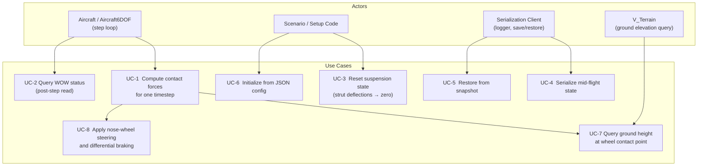
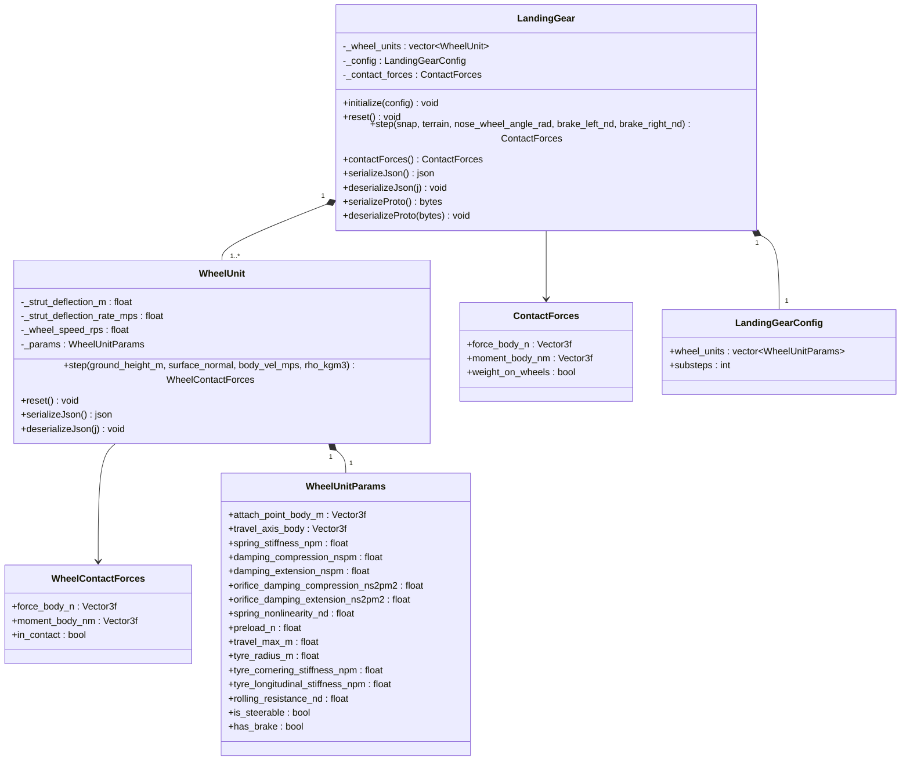
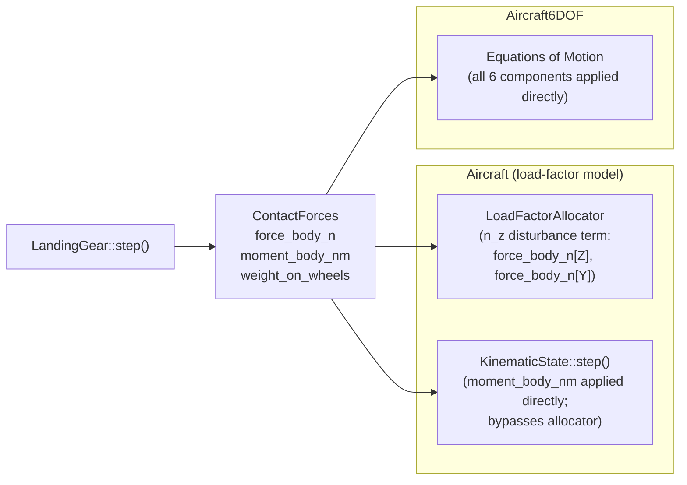

# Landing Gear — Architecture and Interface Design

This document is the design authority for the `LandingGear` subsystem. It covers the
physical models (suspension, tyre contact, wheel friction), the integration contracts with
`Aircraft` and `Aircraft6DOF`, the ground-plane interface, serialization, computational
resource requirements, and the test strategy.

**Design target use case:** developmental verification of autotakeoff and autolanding
functions — ground contact, bounce, WOW establishment, rollout heading control, taxi.

**Validity bound for `Aircraft` (load-factor model):** gear-induced pitch and roll moment
authority exceedance is not modeled. High-speed ground dynamics scenarios that depend on
FBW authority limits require `Aircraft6DOF`.

---

## Use Case Decomposition



| ID | Use Case | Primary Actor | Mechanism |
| --- | --- | --- | --- |
| UC-1 | Compute contact forces for one timestep | `Aircraft::step()` / `Aircraft6DOF::step()` | `LandingGear::step()` |
| UC-2 | Query WOW status after step | Aircraft, guidance, logging | `ContactForces::weight_on_wheels` |
| UC-3 | Reset suspension state | `Aircraft::reset()` | `LandingGear::reset()` |
| UC-4 | Serialize mid-flight snapshot | Logger, pause/resume | `serializeJson()` / `serializeProto()` |
| UC-5 | Restore from snapshot | Pause/resume | `deserializeJson()` / `deserializeProto()` |
| UC-6 | Initialize from JSON config | Scenario, test | `LandingGear::initialize(config)` |
| UC-7 | Query ground height at wheel contact point | Internal to `step()` | `V_Terrain::heightAtPosition_m()` |
| UC-8 | Apply nose-wheel steering and differential braking | Simulation loop | `step()` inputs `nose_wheel_angle_rad`, `brake_left_nd`, `brake_right_nd` |

---

## Class Hierarchy



---

## Integration with Aircraft Models



`LandingGear` is owned by both `Aircraft` and `Aircraft6DOF` as a non-optional member,
initialized from the `"landing_gear"` section of the aircraft JSON config.

### Integration Contract — `Aircraft`

`Aircraft::step()` calls `LandingGear::step()` before the `LoadFactorAllocator` solve.
The contact forces are applied via two parallel mechanisms:

**1. Direct wind-frame acceleration contribution.**
The full body-frame contact force is transformed to the wind frame and added directly
to the wind-frame specific forces:

$$\mathbf{F}_{\text{gear}}^W = R_{WN}\,R_{NB}\,\mathbf{f}_{\text{body}}$$

All three components (x, y, z) contribute to ax, ay, az. When the flight-path angle
$\gamma \neq 0$ — as during a gear bounce — the vertical normal component $F_z$ projects
as $F_z\sin\gamma$ onto wind-x. This cross-axis coupling is the correct physical effect of the
full wind-frame transform and is retained; the on-ground attitude transients it would otherwise
produce are handled by the rotation-deviation state (§2a) and adequate gear damping, not by
removing the coupling.

**2. Gear force & moment integration — rotation-deviation state plus the n_z load handoff (apportionment relaxation + additive axial-acceleration settle term).**

The load-factor model represents body attitude kinematically (pitch = flight-path angle γ +
α, with α set by the LFA), so it has no rotational-inertia state. A long-lever-arm gear
contact force applied against that zero-inertia attitude produces a non-physical feedback (the
gear–attitude feedback artifact). The design below restores the missing rotational inertia where it
matters and routes gear force and moment into the FBW channels.

The load-factor model normally sets the body attitude to FPA + α with zero rotational inertia.
The gear couples in through **two mechanisms, both driven by the gear-derived loads** so that
**both vanish identically when the gear is unloaded** — there is no filter on the flight-path
angle, no always-on dynamic path, and no state switching. In flight the model is exactly
trim-aero.

**(a) Common rotation-deviation state Δθ — the body's inertial response to the gear loads.**
The gear normal force and gear moment drive a single body rotation-deviation $\Delta\theta$ —
the body's inertial pitch/bank response — through a **stable second-order low-pass in the gear
inputs** (a damped spring–mass–damper, $H_2(s)=\omega^2/(s^2+2\zeta\omega s+\omega^2)$ scaled
per channel):

The required behavioral properties of $\Delta\theta$ are (the acceptance properties any realization
must satisfy):

- **P1 — Asymptotic decay to zero when the gear is unloaded.** When the gear force is
  zero, $\Delta\theta$ returns to zero *asymptotically* through the filter's restoring
  term — not instantaneously, and not by state switching. Because $\Delta\theta$ is
  forced by the **gear loads themselves** (not by lagging the FPA), its forcing is
  identically zero off-ground, so it decays with no residual dynamics.
- **P2 — Finite, bounded steady-state under a sustained constant gear load.** A constant
  gear load produces a bounded steady deviation (the static stance / steady derotation) —
  not zero, not unbounded. (The deviation *rate* is zero-DC: a sustained load produces no
  sustained rate, hence no runaway.)
- **P3 — Zero gear-induced change in body angular velocity at the instant of contact.** A
  finite gear force/moment cannot step the body's inertial-frame angular velocity. The
  committed body attitude is $\text{FPA} + \alpha + \Delta\theta$; at contact the gear
  force makes the FPA begin changing at rate $\dot\gamma_{\text{gear}}$, so $\Delta\theta$
  must begin changing at $-\dot\gamma_{\text{gear}}$ for the body's inertial angular
  velocity to be continuous. **The initial rate of $\Delta\theta$ itself is therefore
  *not* zero — it is $-\dot\gamma_{\text{gear}}$.** ($\Delta\theta$ is a deviation measured
  *from the wind frame*; the zero-rate condition applies to the body's inertial rate, not
  to $\Delta\theta$.)
- **P4 — Driven only by gear-derived quantities** — the gear normal force's flight-path
  contribution and the gear moment. No filter acts on the total flight-path angle, and no
  added dynamics may respond to non-gear effects (aerodynamic maneuvers, thrust). This
  guarantees $\Delta\theta$ and its forcing vanish identically off-ground.

$\Delta\theta$ is forced by two gear-derived inputs **with distinct transfers** (these are *not*
both a low-pass):

1. **Force channel** (pitch) — the **destanced gear vertical load**'s flight-path contribution
   (the body's inertial resistance to the gear *arresting the descent*). Realized as the
   high-pass-complement transfer $G(s) = -(s+2\zeta\omega_n)/D$, where $D = s^2+2\zeta\omega_n s+\omega_n^2$
   is the same second-order denominator as $H_2$, acting on the destanced, dynamic-pressure-faded gear
   flight-path rate $u = \dot\gamma_{\text{arrest}}\,\Phi(V)$, with the $C^2$ smootherstep
   dynamic-pressure authority fade $\Phi(V)=\operatorname{smootherstep}(\operatorname{clamp}(V^2/V_{\text{ref}}^2,0,1))$
   — $\to 0$ in true steady roll and at low speed. $G(s)$ is realized in the sim via the library's
   general `tustin_2_tf`+`tf2ss`, with **no free integrator**.
2. **Moment channel** — the **gear moment** $\mathbf{M}^W = R_{WN}R_{NB}\mathbf{M}^B$ as $M^W/I$
   (direct angular forcing) through the **low-pass** $H_2$, $\Delta\theta_{\text{moment}} =
   (1/\omega_n^2)\,H_2(M/I)$ (finite DC = static stance), per axis (pitch from $M_y^W/I_{yy}$,
   bank from $M_x^W/I_{xx}$; the yaw axis $M_z^W/I_{zz}$ drives a lateral specific-force
   perturbation $\Delta a_y$). **Not faded** — gear torque persists at zero airspeed.

The $H_2$ aerodynamic parameters ($\omega_n,\zeta$) are physical rotational-mode characteristics
supplied as constants (the inertia tensor alone is dimensionally insufficient for a frequency); the
aero-mediated parts scale with dynamic pressure, applied here as the explicit $\Phi(V)$ fade on the
force channel.

$\Delta\theta$ is summed into **both** the aero angle of attack and the gear-geometry attitude:

$$\alpha_\text{aero} = \alpha_\text{cmd} + \Delta\theta, \qquad
\theta_\text{geom} = \text{FPA} + \alpha_\text{cmd} + \Delta\theta.$$

**The prompt α/CL response emerges from the EOM — no FPA filter needed.** The gear force
changes the flight-path angle through the ordinary force→velocity integration, while the body
(carrying $\Delta\theta$) does not follow that change instantly (zero initial rotational rate).
So $\alpha = \theta_\text{body} - \text{FPA}$ opens up promptly even though the body's own rate
starts at zero, and CL follows. This is the confirmed mechanism — the FPA moves, the body lags —
but the lag is produced by $\Delta\theta$ responding to the **gear load**, not by filtering the
FPA. When the gear unloads, $\Delta\theta\to 0$ and $\alpha_\text{aero}\to\alpha_\text{cmd}$:
exactly trim-aero, no added dynamics. The same $\Delta\theta$ in $\theta_\text{geom}$ breaks the
gear–attitude feedback sweep — the body does not follow the gear-force-induced FPA swing, so the
contact point is not swept through space at the FPA rate.

**Never integrated into `q_nw`; no stuck bias.** $\Delta\theta$ is a separate state, **never
integrated into the primary attitude quaternion `q_nw`**. Its restoring term (the spring
$k=I\omega^2$) actively returns it to zero, so no residual can become a permanent attitude
bias. (Feeding a *rate* into the pure `q_nw` integrator, which has no restoring term, would
hold any leaked residual — the failure mode that ruled out the earlier "gear moment → body
rate" framing.) `q_nw` carries only the velocity-derived attitude and the FBW-commanded roll.

CL-coupling sign: main-gear contact (aft, nose-down moment) → $\Delta\theta<0$ → lower CL →
derotation/settle; nose-gear contact (forward, nose-up) → higher CL → nose-up/bounce tendency.

**(b) Load handoff — apportionment relaxation plus an axial-acceleration settle/rotation term.**
The wing must not double-supply the load the gear carries, and on the ground it must shed lift to
settle onto the gear (landing) and build lift to rotate off it (takeoff). Two cooperating parts:

$$n_{z,\text{shaped}} = \max\!\Bigl(0,\; w_a(q)\,\underbrace{\bigl(n_{z,\text{cmd}} - H_1(s)\,n_{z,\text{gear}}\bigr)}_{\text{(b-i) apportionment}}
\; + \; \underbrace{\operatorname{clip}\!\bigl(k_s\,\tfrac{\bar a_x}{g}\,\Phi_g(V),\;\pm\Delta_{\max}\bigr)}_{\text{(b-ii) settle/rotation}}\Bigr),
\qquad n_{z,\text{gear}} = \max\!\bigl(0,\,-F_z^B/(m g)\bigr),$$

with $w_a(q)$ the **(b-iii) aero-effectiveness authority weight** defined below.

$$\bar a_x = \mathrm{LP}\!\left[\frac{T - D_\text{aero} - D_\text{wheel}(V) - D_\text{brake}}{m}\right]
\quad(\text{steady modeled longitudinal acceleration, not raw EOM}\ a_x).$$

**(b-i) Apportionment relaxation.** $n_{z,\text{gear}}$ is the **actual**
unilateral ground reaction normalized by weight, smoothed by the load-handoff filter $H_1$; the
wing is asked only for the residual the gear is not already carrying. In steady state the total
delivered load factor is $n_{z,\text{aero}}+n_{z,\text{gear}} = n_{z,\text{cmd}}$, so command
authority is preserved and the gear has no command authority. This part **holds** a settled state
once reached: as the gear loads up, $n_{z,\text{gear}}\to1$ and the wing command $\to0$.

**(b-ii) Additive axial-acceleration term.** On its own, part (b-i) is
**degenerate**: the gear is a spring whose force depends on how much the wing is already
supporting, so every split with $n_{z,\text{aero}}+n_{z,\text{gear}}=n_{z,\text{cmd}}$ is
self-consistent, and the model can rest in the wrong one — the wing floating the aircraft at
$\approx 0.8\,W$ with the gear barely loaded (measured: gear $0.18\,W$, agl held high). The
additive term breaks that degeneracy with a **steady, non-degenerate longitudinal signal** that is
deliberately **not** the raw EOM acceleration: it is the modeled longitudinal-force deficit
$\bar a_x = \mathrm{LP}[(T - D_\text{aero} - D_\text{wheel}(V) - D_\text{brake})/m]$, where $T$ is
thrust, $D_\text{aero}$ aerodynamic drag, and $D_\text{wheel}(V)$ a **steady rolling drag modeled
as a smooth function of ground speed** against a steady normal-load reference (weight), not the
instantaneous oscillatory gear contact force ($D_\text{brake}$ added with the brake model later).
The single gain $k_s>0$ converts this to a load-factor increment; the increment is **low-pass
filtered** and **clipped to $\pm\Delta_{\max}$**; $\Phi_g$ is a ground-engagement fade — a
**stall-referenced speed smoothstep combined with the WoW signal** ($\Phi_g = S_\text{unload}(V)\cdot
\mathrm{WoW}$), distinct from the §2a rotation-influence dynamic-pressure fade, with **separate
landing/takeoff transition speeds** (shared width).

This construction is what keeps the settle loop stable: feeding the **raw** axial acceleration —
which carries the oscillatory bounce/chatter of the gear and tire contact drag — back into the
wing lift would close a loop that can wind up into a limit cycle. Using the **steady modeled
deficit** (smooth in $V$ and $T$, independent of the instantaneous gear force), then **filtering**
and **clipping** the increment, removes that path: the increment cannot track contact oscillations
and cannot exceed a bounded lift change. The low-pass also makes the applied vertical force
**continuous across weight-on-wheels transitions** (no force step at touchdown or liftoff), so the
WoW factor in $\Phi_g$ can be a raw binary.

**(b-iii) Aero-effectiveness authority weight $w_a(q)$.** The gear-relative aero demand (b-i) is
weighted by $w_a(q)\in[0,1]$ — the FBW's authority to command aerodynamic load factor, bounded by what
the wing can physically produce. It is a **smooth ($C^2$) function of dynamic pressure $q$ alone** (no
weight-on-wheels switch or mode state) that rises from $0$ to $1$ across a transition band placed
**below** stall dynamic pressure $q_\text{stall}=\tfrac12\rho_0 V_\text{stall}^2$:

$$w_a(q) = \operatorname{smootherstep}\!\Bigl(\operatorname{clamp}\!\Bigl(\tfrac{q - q_\text{lo}}{q_\text{hi}-q_\text{lo}},\,0,\,1\Bigr)\Bigr),
\quad q_\text{lo}=r_\text{lo}^2\,q_\text{stall},\;\; q_\text{hi}=r_\text{hi}^2\,q_\text{stall},$$

where $\operatorname{smootherstep}(t)=t^3(6t^2-15t+10)$. The transition's **lower** and **upper** band
edges $r_\text{lo}$, $r_\text{hi}$ are required non-dimensional config parameters specified as **speed
ratios** $V/V_\text{stall}$ (`aero_authority_v_lower_ratio`, `aero_authority_v_upper_ratio`) — because
the load-factor hand-off is reasoned about in airspeed — and are converted to the equivalent
dynamic-pressure edges internally, $q_\text{edge}=\tfrac12\rho_0(r\,V_\text{stall})^2=r^2 q_\text{stall}$.
The weight itself remains a smooth function of $q$. Constraint: $0 < r_\text{lo} < r_\text{hi} \le 1$
(the band strictly below stall). Below $r_\text{lo}V_\text{stall}$ the wing is given no command
authority ($w_a=0$); above $r_\text{hi}V_\text{stall}$ it has full authority ($w_a=1$).

*Why this form.* As $q\to0$ the band sits at zero ($w_a\to0$ faster than $q$), so the angle of attack
the weighted demand inverts to, $\alpha \approx w_a\,(n_{z,\text{cmd}}-H_1 n_{z,\text{gear}})\,mg/(q\,S\,C_{L_\alpha})$,
**decays to zero** rather than saturating at the peak-$C_L$ fold angle — the on-ground attitude is not
driven nose-up. Because $w_a<1$ through the band it also turns the unity-gain (b-i) apportionment fixed
point into a contraction, so the aero command collapses to zero on the ground (slope-correct:
$\cos\gamma$ is carried by the gear and cancels in the (b-i) residual, so a sloped runway never commands
$\alpha$ at rest). Because the band's upper edge is below stall $q$, $w_a\equiv1$ across the entire
flight envelope — flight and takeoff rotation are unaffected — and the $C^2$ smootherstep has no
in-envelope corner (smooth-dynamics standard). A weight-on-wheels-scheduled authority — which a real
FBW would likely use for takeoff/landing mode logic — is deliberately avoided here to keep the model a
smooth, state-machine-free function of $q$.

*Band placement.* The edges must be chosen so $w_a$ is already near zero across the *sustained*
low-speed roll-out, not merely in the $q\to0$ limit: since the commanded angle scales as
$\alpha\sim w_a/q$, a band placed too low leaves $w_a$ near 1 at small $q$ and merely **relocates** the
fold-pinning to the band's upper edge. Keep the lower edge above the speeds where the aircraft lingers
near the ground ($r_\text{lo}\gtrsim 0.5$) and the upper edge below stall ($r_\text{hi}\le 1$) so
flight authority is unaffected. Below the lower edge the FBW may still provide rotational (attitude)
damping, but it does not attempt to sustain load factor — that hand-off is exactly what $w_a$ models.
Reference values: $r_\text{lo}\approx0.55$, $r_\text{hi}=0.80$ (speed ratios $V/V_\text{stall}$;
equivalently $q$-edges $0.30$ and $0.64\,q_\text{stall}$).

Behavior of the combined law:

- **Landing settle.** During roll-out $T=0$ and $D_\text{aero}+D_\text{wheel}(V)>0$, so $\bar a_x<0$
  and the additive term sheds wing lift; the gear takes the weight and (b-i) reduces the wing
  command further and **holds** the settled state (wing $\to0$, gear $\to W$). The shedding persists
  for the whole roll-out because the speed-based drag persists; as speed bleeds off,
  dynamic-pressure-limited lift ($L_{\max}=q S C_{L,\max}$) vanishes anyway, so there is no residual
  float at the stop.
- **Takeoff rotation.** During the takeoff roll $T>D$, so $\bar a_x>0$ and the additive term builds
  wing lift as speed builds; the gear unloads, (b-i) hands authority back, and the aircraft rotates
  and lifts off, after which $\Phi_g\to0$.

**Command authority and smoothness.** In flight $\Phi_g\to0$ **and** $n_{z,\text{gear}}\to0$, so
$n_{z,\text{shaped}}=n_{z,\text{cmd}}$ exactly — full FBW authority. On the ground the additive
term is a **phase-appropriate transient** (sheds while decelerating, builds while accelerating)
that vanishes in steady, zero-deficit roll, where (b-i) alone holds the settle. Being a smooth,
filtered, clipped function of a steady force deficit rather than a binary contact switch in the
lift path, the settle and rotation are smooth: no touchdown bounce, no lift snap at liftoff, and
no oscillatory contact drag fed back into the aerodynamics.

**DC-gain summary:**

| Mechanism | Filter | DC gain | Off-ground behavior |
| --- | --- | --- | --- |
| Gear loads → rotation deviation $\Delta\theta$ (→ α/CL + gear geometry) | $H_2$, stable 2nd-order low-pass in the gear inputs | **finite, nonzero** (deflection); **0** in rate | input (gear loads) = 0; state decays to zero via the restoring term — no residual, no switching, never in `q_nw` |
| Gear reaction → n_z apportionment relaxation (b-i, load handoff) | $H_1$, 2nd-order | **1** | input (gear reaction) = 0 → relaxation decays to zero |
| Axial acceleration → additive n_z settle/rotation term (b-ii) | gain $k_s$ on $a_x/g$, ground-faded by $\Phi_g(V)$ | **n/a** (proportional bias, not a filter) | $\Phi_g\to 0$ in flight → term vanishes |

The contact model stays **quasi-static / algebraic** (no strut ODE, no implicit contact
integrator); the only added integrated dynamics are these filters (Tustin / `FilterSS2Clip`),
and the aircraft EOM stays RK4.

*Parameterization:* the **rotation-deviation filter $H_2$** (§2a) is parameterized from physical
rotational characteristics (the inertia tensor, each axis through its own $I_{xx}/I_{yy}/I_{zz}$); the
**apportionment filter $H_1$** (b-i) from FBW load-handoff characteristics, distinct from the FBW
command filter and slower than $H_2$. The additive settle/rotation gain $k_s$ and fade $\Phi_g$ (b-ii)
are configured per §2b-ii. (Every knob is a required non-dimensional config field; see the
parameterization summary below.)

*Parameterization (non-dimensional, no hardcoded defaults).* Every knob in this integration
(§2a/§2b) is a **required, non-dimensional** config field — `Aircraft::initialize()` has no
dimensional default and throws if any is missing — expressed as a ratio against the aircraft's own
physical scale, derived at initialization. This makes the same ratios physically correct across
airframes spanning orders of magnitude in size (a 5 kg UAS and a heavy transport share the ratios
but realize very different dimensional values): a global dimensional default — e.g. the former
`dtheta_vref_mps = 24` (a general-aviation stall speed) silently applied to a UAS that flies at
7–15 m/s, suppressing the authority fade across its whole envelope — is exactly the failure mode
this removes. The three scales are: **flight speed** $V_{stall}=\sqrt{2mg/(\rho_0 S_{ref} C_{L_{max}})}$
(for $V_{ref}$ and the settle transition speeds), **flight-path frequency** $g/V_{stall}$ (for the
$H_2$ rotation-mode and $H_1$ load-handoff natural frequencies — the phugoid/flight-path frequency
scaling), and the **gear contact period** $2\pi/\sqrt{\sum k_{spring}/m}$ (for the two contact
filters — the attitude-reference and settle low-passes — whose job is to reject the gear
bounce/contact limit cycle, a gear-dynamics timescale, *not* a flight timescale). Pure
non-dimensionals (damping ratios, the settle gain/clip, the rolling-resistance coefficient) carry
no scale. The full field table is in the
[aircraft_config_v1 schema — Gear-model coupling parameters](../schemas/aircraft_config_v1.md#gear-model-coupling-parameters).

**3. Direct wind-frame moment — `Aircraft6DOF` only.** In the full `Aircraft6DOF` model the
assembled `moment_body_nm` is applied directly to the rotational EOM with no perturbation
mapping; the rotation-deviation and n_z load-handoff scheme above is specific to the load-factor
`Aircraft`.

### Integration Contract — `Aircraft6DOF`

`Aircraft6DOF::step()` applies all six components of `ContactForces` directly to the
equations of motion with no special-casing.

---

## Physical Models

### 1. Wheel Geometry

Each wheel unit is defined by two body-frame vectors:

- **Attachment point** $\mathbf{p}_i^B$ — strut root in body coordinates (m).
- **Travel axis** $\hat{\mathbf{t}}_i^B$ — unit vector along strut compression direction
  in body coordinates (positive toward the ground in nominal attitude).

The contact point position in body frame is:

$$\mathbf{c}_i^B = \mathbf{p}_i^B + \delta_i\,\hat{\mathbf{t}}_i^B - r_w\,\hat{\mathbf{n}}^B$$

where $\delta_i$ is strut deflection (m, positive = compressed), $r_w$ is tyre radius (m),
and $\hat{\mathbf{n}}^B$ is the terrain surface normal expressed in body frame.

Strut deflection is constrained:

$$\delta_{i,\min} \leq \delta_i \leq \delta_{i,\max}$$

where $\delta_{i,\min} = 0$ (fully extended, no negative deflection — the strut cannot
pull the aircraft toward the ground) and $\delta_{i,\max}$ is the mechanical travel limit.

Ground penetration depth at step $k$ is:

$$h_i = z_{\text{ground}} - z_{c_i}$$

where $z_{\text{ground}}$ is the terrain height at the projected wheel contact point (m,
positive upward), $z_{c_i}$ is the $z$-coordinate of the contact point in the inertial
frame, and $h_i > 0$ indicates contact.

---

### 2. Suspension Dynamics — Oleo-Pneumatic Strut Model

Each strut is modeled as a nonlinear spring with asymmetric orifice damping, matching the
physical behavior of an oleo-pneumatic shock absorber.

#### 2a. Nonlinear Spring

Real pneumatic gas columns stiffen nonlinearly as they approach full compression. The spring
force is:

$$F_{\text{spring},i} = k_i \cdot \delta_i \cdot \left(1 + n_i \left(\frac{\delta_i}{\delta_{i,\max}}\right)^2\right) + F_{\text{preload},i}$$

where:

- $k_i$ — linear spring stiffness (N/m)
- $n_i$ — dimensionless nonlinearity factor (`spring_nonlinearity_nd`); at $n_i = 0$ the
  spring is linear; at $n_i = 2$ the effective stiffness triples at full compression
- $\delta_{i,\max}$ — mechanical travel limit (m)
- $F_{\text{preload},i}$ — static preload force (N)

#### 2b. Asymmetric Orifice Damping

Real oleo-pneumatic struts have a metering pin that partially closes the oil orifice on
compression and opens it on extension. This produces:

- High damping on compression (stroke energy absorbed at touchdown)
- Low damping on extension (quick strut recovery without bouncing the airframe back up)

The damping force combines a viscous (linear) term and an orifice (quadratic) term. The
quadratic term dominates at high closure speeds and is the physically correct model for
hydraulic orifice flow ($\Delta P \propto V^2$):

$$F_{\text{damp},i}(\dot{\delta}_i) = b(\dot{\delta}_i)\,\dot{\delta}_i + c(\dot{\delta}_i)\,|\dot{\delta}_i|\,\dot{\delta}_i$$

where the damping coefficients are selected by sign of $\dot{\delta}_i$:

$$b(\dot{\delta}) = \begin{cases} b_{c,i} & \dot{\delta} \geq 0\;\text{(compression)} \\ b_{e,i} & \dot{\delta} < 0\;\text{(extension)} \end{cases}, \qquad c(\dot{\delta}) = \begin{cases} c_{c,i} & \dot{\delta} \geq 0 \\ c_{e,i} & \dot{\delta} < 0 \end{cases}$$

| Parameter | Config key | Units | Typical ratio $c/e$ |
| --- | --- | --- | --- |
| $b_{c,i}$ | `damping_compression_nspm` | N·s/m | 5:1 |
| $b_{e,i}$ | `damping_extension_nspm` | N·s/m | — |
| $c_{c,i}$ | `orifice_damping_compression_ns2pm2` | N·s²/m² | 5:1 |
| $c_{e,i}$ | `orifice_damping_extension_ns2pm2` | N·s²/m² | — |

#### 2c. Total Strut Force

The total strut force (lower-bounded at zero — the strut cannot pull) is:

$$F_{s_i} = \max\!\bigl(0,\; F_{\text{spring},i} + F_{\text{damp},i}\bigr)$$

The force floor prevents suction when the strut extends rapidly past its natural length.

**Quasi-static strut deflection.** The current implementation uses a quasi-static
(unsprung-mass = 0) approximation: strut deflection $\delta_i$ is set directly to the
terrain penetration depth (clamped to travel limits), and the deflection rate
$\dot{\delta}_i$ is computed as the **analytic projection of the contact-patch velocity
onto the inward surface normal** (not a finite difference):

$$\delta_i = \operatorname{clamp}(h_i,\ 0,\ \delta_{i,\max})$$

$$\dot{\delta}_i = -\,\mathbf{v}_{c_i}\cdot\hat{\mathbf{n}}, \qquad
\mathbf{v}_{c_i} = \mathbf{v}^B + \boldsymbol\omega^B\times\mathbf{c}_i^B$$

where $\hat{\mathbf n}$ is the terrain surface normal in body frame (using the surface
normal rather than the strut travel axis eliminates a phantom $V_N\sin\alpha$ term when the
aircraft is pitched — see `WheelUnit::step`). This avoids integrating a second-order ODE
and eliminates the Euler stability constraint $\Delta t < 2\sqrt{m/k}$.

**What `substeps` actually does.** The `substeps` parameter subdivides the outer step only
for the **wheel-spin (Pacejka longitudinal) ODE** in `WheelUnit::step`. The per-wheel
penetration, contact point, and contact-patch velocity are computed once per outer step in
`LandingGear::step` (from the frozen aircraft state) and held constant across the sub-loop,
so $\delta$, $\dot\delta$, and the normal force $F_z$ are identical on every sub-step.
`substeps` therefore does **not** refine $\delta$, $\dot\delta$, $F_z$, or the contact
geometry, and does not advance the aircraft state; it only refines the wheel-spin transient.
The class default is `substeps = 4`; some fixtures override it (the `LandingGear_FullStop`
fixture sets `substeps = 1`). Raising `substeps` does not mitigate the deep-penetration force
spikes — those are a single-step penetration artifact (see §7, Gear Oscillation Stability), not a
wheel-spin transient that finer substepping would resolve.

**Note:** unsprung mass and tyre spring compliance are second-order effects relevant only
to a full 6DOF equations-of-motion model (`Aircraft6DOF`). The quasi-static strut is
appropriate for the load-factor (`Aircraft`) model and is not an open question for it.

---

### 3. Tyre Contact Forces — Pacejka Magic Formula

Tyre longitudinal force $F_x$ and lateral force $F_y$ are computed using the Pacejka
"magic formula":

$$F(s) = D \sin\!\bigl(C \arctan(B s - E(B s - \arctan(B s)))\bigr)$$

where $s$ is the relevant slip quantity (slip ratio $\kappa$ for longitudinal, slip angle
$\alpha_t$ for lateral), and $B$, $C$, $D$, $E$ are shape parameters.

**Castering (nose) wheel — no side force.** A wheel flagged `is_castering` is modeled as a
free-castering wheel: it carries vertical load and rolls, is quasi-statically trimmed to align with its
ground-relative velocity, and produces **no lateral (side) force** ($F_y \equiv 0$). It generates no
cornering/yaw disturbance, so ground directional control is left entirely to the FBW yaw model (the `n_y`
closed loop) rather than to nosewheel cornering — consistent with the load-factor/trimaero philosophy of
modeling FBW *outcomes*, not effector gains, and effective to zero ground speed. This replaces the earlier
`is_steerable` Pacejka-cornering nose wheel, whose lateral force at a crab slip angle was a large yaw
disturbance on a crosswind touchdown. The main wheels retain their Pacejka $F_y$. (See
[body_collider.md OQ-BC-12 Alt B mech.3 — yaw](body_collider.md).)

#### 3a. Vertical Force

The tyre vertical force is the strut reaction force transmitted through the contact patch:

$$F_{z_i} = F_{s_i}$$

Contact is active only when $h_i > 0$; otherwise $F_{z_i} = 0$.

#### 3b. Longitudinal Slip Ratio

Slip ratio $\kappa$ is defined as:

$$V_\text{ref} = \max\!\bigl(|V_{cx}|,\;|\omega_w\,r_w|\bigr) + \epsilon$$

$$\kappa = \frac{\omega_w\,r_w - V_{cx}}{V_\text{ref}}$$

where:

- $\omega_w$ — wheel angular velocity (rad/s)
- $r_w$ — tyre rolling radius (m)
- $V_{cx}$ — contact-patch longitudinal velocity in the wheel plane (m/s)
- $\epsilon = 0.01$ m/s — regularization to avoid division by zero at standstill

The combined reference speed $V_\text{ref}$ bounds $\kappa$ to $[-1, 1]$ throughout the
contact phase. The naive denominator $|V_{cx}| + \epsilon$ causes $\kappa \to \omega_w r_w / \epsilon$
(thousands) when $V_{cx} \to 0$ while $\omega_w$ is nonzero (e.g., the instant of first
ground contact when the wheel begins spinning up from rest). That large slip ratio
produces a full-friction traction spike that injects energy into the wheel and, through
the aircraft equations of motion, permanently accelerates the aircraft — a non-physical
runaway.

For a locked wheel (braking), $\omega_w = 0$ and $V_\text{ref} = |V_{cx}| + \epsilon$,
so $\kappa = -V_{cx} / (|V_{cx}| + \epsilon) \to -1$ at speed — the expected braking
limit.

#### 3c. Slip Angle

Slip angle $\alpha_t$ is the angle between the wheel heading and the contact-patch velocity
vector projected onto the ground plane:

$$\alpha_t = -\arctan\!\left(\frac{V_{cy}}{|V_{cx}| + \epsilon}\right)$$

where $V_{cy}$ is the lateral component of the contact-patch velocity.

#### 3d. Pacejka Coefficients

The default parameter set is derived from generic bias-ply tyre data (Bakker, Nyborg, Pacejka 1987):

| Parameter | Longitudinal | Lateral | Description |
| --- | --- | --- | --- |
| $B$ | 10.0 | 8.0 | Stiffness factor |
| $C$ | 1.9 | 1.3 | Shape factor |
| $D$ | $\mu F_z$ | $\mu F_z$ | Peak value (friction-limited) |
| $E$ | 0.97 | −1.0 | Curvature factor |

where $\mu$ is the surface friction coefficient (see §5). These coefficients are fixed;
a future design study (OQ-LG-1) may introduce a parameter estimation pipeline from flight
test data.

#### 3e. Combined-Slip Saturation

When both longitudinal and lateral slip are nonzero, the total friction force is limited
by the tyre friction circle:

$$F_{t,i} = \sqrt{F_{x_i}^2 + F_{y_i}^2} \leq \mu F_{z_i}$$

If $F_{t,i} > \mu F_{z_i}$, both components are scaled down proportionally:

$$F_{x_i}' = F_{x_i}\,\frac{\mu F_{z_i}}{F_{t,i}}, \quad F_{y_i}' = F_{y_i}\,\frac{\mu F_{z_i}}{F_{t,i}}$$

---

### 4. Wheel Rotational Dynamics

Wheel angular velocity $\omega_w$ is integrated from the applied brake torque and tyre
longitudinal traction reaction:

$$I_w\,\dot{\omega}_w = -r_w\,F_{x_i} - \tau_{\text{brake},i} - \tau_{\text{roll},i}$$

where:

- $I_w$ — wheel polar moment of inertia (kg·m²). For this model, $I_w$ is approximated
  as $m_w r_w^2 / 2$ using a nominal wheel mass $m_w$ derived from the tyre radius via
  an empirical scaling $m_w \approx 0.3\,r_w$ (kg, with $r_w$ in m).
- $\tau_{\text{brake},i} = C_{\text{brake}}\,b_i\,\omega_w$ — brake torque, where
  $b_i \in [0, 1]$ is the normalized brake demand and $C_{\text{brake}}$ is the maximum
  brake torque (N·m), a config parameter.
- $\tau_{\text{roll},i} = \mu_r\,r_w\,F_{z_i}\,\operatorname{sign}(\omega_w)$ — rolling
  resistance torque, where $\mu_r$ is the rolling resistance coefficient (dimensionless).

The wheel decelerates to a stop in finite time because rolling resistance grows with $F_z$
and does not vanish as $\omega_w \to 0$ (the $\operatorname{sign}$ function is regularized
with a deadband below $|\omega_w| < 0.01$ rad/s to avoid chatter).

#### 4a. Integration Method and Stability

The wheel ODE is integrated by **Tustin (bilinear) discretization** using a predictor-corrector
scheme. At each inner substep:

1. Compute $\dot{\omega}_w^k$ from $F_x(\omega_w^k)$, $\tau_\text{brake}(\omega_w^k)$, and
   $\tau_\text{roll}(\omega_w^k)$.
2. Euler predictor: $\omega^* = \omega_w^k + \dot{\omega}_w^k\,\Delta t_\text{inner}$.
3. Recompute $F_x(\omega^*)$ via the Pacejka formula with friction-circle saturation;
   recompute $\tau_\text{brake}(\omega^*)$ and $\tau_\text{roll}(\omega^*)$.
4. Tustin (trapezoidal) update:
   $$\omega_w^{k+1} = \omega_w^k + \frac{\Delta t_\text{inner}}{2}\bigl(\dot{\omega}_w^k + \dot{\omega}_w^*\bigr)$$

Tustin is unconditionally stable for linear stiffness and second-order accurate in time.
The `substeps` value is a configuration parameter set per aircraft in the JSON config.
For the trim-aero model, it is chosen as a deliberate engineering trade-off between
integration accuracy and computational cost: the 3× Nyquist accuracy bound
gives the minimum substep count for high-fidelity wheel spin dynamics, but those values
are computationally prohibitive for a trim-aero simulation that does not require high
dynamic fidelity in the wheel spin-up transient. The configured value need not satisfy
the Nyquist bound; it should be the smallest value that produces acceptable rollout and
braking behavior for the intended scenario.

#### 4b. Quasi-Static Free-Roll Clamp

The rolling-condition clamp applied under explicit Euler (which snapped $\omega_w$ when
the sign of $\kappa$ changed mid-substep) was removed when the Tustin integrator was
introduced.

A separate, deliberate **quasi-static free-roll clamp** is retained. When no brake torque is
applied, `WheelUnit::step()` sets

$$\omega_w = \max\!\bigl(0,\; V_{cx}/r_w\bigr)$$

exactly, bypassing the Tustin ODE for that substep. This enforces the exact free-rolling
condition ($\kappa = 0$, $F_x = 0$) and ensures only rolling resistance $F_{rr}$
decelerates the aircraft during free ground roll. It is correct defensive programming:
wheel speed cannot physically exceed the contact-patch ground speed or go negative during
free rolling (no brake applied).

$V_{cx}$ is the forward component of the contact-patch velocity in the wheel rolling
direction. It is computed as the projection of $\mathbf{v}^B_\text{CG} +
\boldsymbol{\omega}^B \times \mathbf{c}^B$ onto the wheel-forward axis, where
$\mathbf{c}^B$ is the tyre contact point in body frame (origin at CG). During a turning
rollout the outer and inner wheels therefore receive different $V_{cx}$ values,
correctly reflecting the differential ground speed.

The four canonical tyre events are handled as follows:

| Event | Condition | Action |
| --- | --- | --- |
| First contact | `penetration_m` transitions $\leq 0 \to > 0$ | $\omega_w$ arrives from airborne bearing drag; clamp immediately sets $\omega_w = V_{cx}/r_w$ when no brake is applied |
| Liftoff | `penetration_m` transitions $> 0 \to \leq 0$ | Strut resets to zero; airborne bearing drag ODE takes over |
| Free roll (no brake) | `brake_demand_nd` $< 10^{-4}$ | $\omega_w$ clamped to $V_{cx}/r_w$ exactly; $\kappa = 0$; $F_x = 0$ |
| Lockup | $\omega_w \to 0$ under full braking | Tustin ODE integrates; regularized by rolling-resistance deadband at $\lvert\omega_w\rvert < 0.01$ rad/s |

---

### 5. Surface Friction Parameterization

The surface friction coefficient $\mu$ is queried from the terrain at the wheel contact
point. `V_Terrain` is extended with a `frictionAt(lat_rad, lon_rad)` method that returns
a `SurfaceType` enum:

| `SurfaceType` | $\mu$ (dry) | $\mu$ (wet, multiplier) | Description |
| --- | --- | --- | --- |
| `Pavement` | 0.80 | 0.50 | Paved runway or taxiway |
| `Grass` | 0.40 | 0.30 | Mown grass airfield |
| `Dirt` | 0.50 | 0.25 | Unprepared dirt surface |
| `Gravel` | 0.60 | 0.35 | Gravel or packed aggregate |

Wet multipliers are applied when `AtmosphericState::precipitation > 0`. The friction
coefficient seen by the Pacejka formula is $\mu = \mu_{\text{dry}} \times f_{\text{wet}}$
when precipitation is active, and $\mu = \mu_{\text{dry}}$ otherwise.

**Open question OQ-LG-2:** A richer friction model (e.g., a continuous function of
precipitation intensity or surface contamination depth) has been deferred pending a use case
that requires it. The `SurfaceType` table is sufficient for the autotakeoff/autoland use case.

---

### 6. Ground Plane Interface

`LandingGear::step()` accepts a `const V_Terrain&` reference and calls
`terrain.heightAtPosition_m(lat_rad, lon_rad)` for each wheel contact point to obtain the
ground elevation. The surface normal is approximated by finite differences over a
configurable radius (default 0.5 m):

$$\hat{\mathbf{n}} = \frac{\nabla h \times \mathbf{e}_x}{\|\nabla h \times \mathbf{e}_x\|}$$

where $h$ is the terrain height function and $\mathbf{e}_x$ is the north unit vector.

**Runway geometry extension (proposed — not yet designed):** For runway operations a planar
runway patch inset into `TerrainMesh` is the preferred approach. An analytical runway
definition (with longitudinal slope and crowned lateral profile) is an alternative if a
dedicated runway primitive is added to `V_Terrain`. This choice is deferred to OQ-LG-3.

The `SensorAirData` AGL altitude calculation must use the same terrain height source as the
contact model to avoid discontinuities at touchdown.

---

### 7. Gear Oscillation Stability — Describing Function Analysis

Landing gear systems are susceptible to two distinct oscillatory instabilities driven by
nonlinear contact mechanics: **vertical bounce limit cycles** and **wheel shimmy**. Both
are real in-service phenomena and require formal stability analysis before a gear design
can be declared fit for purpose. The describing function (DF) method is the standard
nonlinear frequency-domain tool: it replaces the nonlinear element with an
amplitude-dependent equivalent gain $N(A)$ and applies the Nyquist criterion via
$N(A)\,G(j\omega) = -1$ to determine whether limit cycles can exist and at what amplitude.

#### 7a. Contact Nonlinearity and Its Describing Function

The fundamental nonlinearity in the gear model is the **one-sided contact spring**: when
the strut is compressed ($\delta > 0$) it produces a restoring force; when the wheel is
airborne ($\delta \leq 0$) the force is zero. For a sinusoidal perturbation
$\hat{\delta} = A\sin(\omega t)$ about the static equilibrium deflection
$\delta_0 = mg / k_\text{total}$, the spring behaves as a biased half-wave rectifier.

Define $\varphi = \arcsin(\delta_0/A) \in [0, \pi/2]$ as the angle at which the aircraft
just lifts off each cycle. The describing function is:

$$N(A) = \begin{cases}
k_\text{total} & A \leq \delta_0 \quad\text{(always in contact, linear regime)} \\[6pt]
\dfrac{k_\text{total}}{\pi}\!\left[
  \dfrac{\pi}{2} + \arcsin\!\!\left(\dfrac{\delta_0}{A}\right)
  + \dfrac{\delta_0}{A}\sqrt{1-\!\left(\dfrac{\delta_0}{A}\right)^{\!2}}\,
\right] & A > \delta_0 \quad\text{(periodic liftoff)}
\end{cases}$$

The describing function is real-valued (no phase shift), monotonically decreasing in $A$,
and continuous at $A = \delta_0$:
- $A \to \delta_0^+$: $N \to k_\text{total}$
- $A \to \infty$: $N \to k_\text{total}/2$ (half-cycle contact per period)

For the test fixture ($m = 1045$ kg, $k = 20\,000$ N/m per wheel, three wheels):

$$k_\text{total} = 60\,000\;\text{N/m}, \qquad
\delta_0 = \frac{mg}{k_\text{total}} = \frac{10\,255}{60\,000} = 0.171\;\text{m}$$

Vertical oscillations with amplitude $A < 0.171$ m remain in the linear regime. The
linear natural frequency is $\omega_n = \sqrt{k_\text{total}/m} = 7.57$ rad/s
($T \approx 0.83$ s).

#### 7b. Vertical Bounce — Limit Cycle Conditions

For vertical motion, the plant is a double integrator (mass only):

$$G_\text{bounce}(j\omega) = -\frac{1}{m\omega^2}$$

The Nyquist limit cycle condition $N(A)\,G_\text{bounce}(j\omega) = -1$ reduces to:

$$N(A) = m\omega^2$$

This gives a family of resonant amplitudes as a function of frequency:
- For $A \leq \delta_0$: $N = k_\text{total} \Rightarrow \omega = \omega_n$.
- For $A > \delta_0$: $N < k_\text{total} \Rightarrow \omega < \omega_n$ — the resonant
  frequency decreases with bounce amplitude. A hard bounce with $A \gg \delta_0$ oscillates
  near $\omega_n / \sqrt{2}$.

**Whether a limit cycle grows or decays** depends entirely on the net energy per cycle.
The asymmetric damping dissipates energy on both strokes:

$$\Delta E_\text{damp}(A, \omega) = \frac{\pi}{2}\,A^2\,\omega\,(b_c + b_e)$$

This is always positive — damping removes energy regardless of the $b_c/b_e$ ratio. Low
$b_e$ (fast rebound, slow decay) does **not** inject energy; it merely prolongs the
oscillation. This DF analysis describes the *physical* gear-spring bounce mode. Note that
the `LandingGear_FullStop` terminal-velocity behavior is **not** this spring
limit cycle: the diagnostic shows it is a numerical artifact (deep single-step penetration
producing a one-step forward impulse), oscillating at the contact sampling rate rather than
the spring natural frequency. The DF spring-mode analysis here remains valid for assessing
genuine multi-cycle bounce behavior at adequate substep resolution.

**Design criterion — extension damping.** The extension stroke must dissipate enough
energy per cycle that the bounce amplitude decays to 50% within 3 natural periods
($t_{50\%} \leq 3T$). Solving $e^{-\zeta_e \omega_n t_{50\%}} = 0.5$ for the
single-wheel approximation:

$$\zeta_e = \frac{b_e}{2\sqrt{k\,m/3}} \geq 0.18$$

At $\zeta_e = 0.099$ (current test fixture), the 50% decay time is $t_{50\%} \approx 6T
\approx 5$ s — the bounce requires roughly twice the target number of cycles to halve
its amplitude, making the system susceptible to limit cycling whenever any energy coupling
is present.

#### 7c. Wheel Shimmy

Wheel shimmy is a **lateral** oscillation of the nose (or main) wheel about its swivel
axis, driven by the lag between heading change and tyre lateral force development. It is
independent of the vertical bounce mode and occurs at much higher frequencies
($f_\text{shimmy} = V / (2\pi\sigma)$, typically 10–40 Hz). Wheel shimmy has caused
structural failure of nose-wheel assemblies in service and is a required design analysis
item for any castoring nose wheel (FAR 25.499, MIL-HDBK-516C).

**Mechanism.** After a lateral disturbance, the tyre develops its restoring lateral force
only after traveling a path length of approximately $\sigma$ — the **relaxation length**
(roughly 0.3–0.5 × tyre radius). This lag creates a phase delay between the geometric
yaw perturbation and the restoring moment. At the critical speed this phase delay reaches
180°, and the moment drives the oscillation rather than suppressing it.

**Governing parameters (nose wheel):**

| Symbol | Quantity | Typical C172-class value |
| --- | --- | --- |
| $l$ | Mechanical caster arm (swivel offset from contact patch) | 0.05–0.10 m |
| $e$ | Pneumatic trail (additional contact-force offset) | 0.02–0.04 m |
| $\sigma$ | Tyre lateral relaxation length | 0.03–0.06 m |
| $C_\alpha$ | Tyre cornering stiffness | 20,000–40,000 N/rad |
| $I_\psi$ | Nose wheel assembly yaw inertia | 0.5–2.0 kg·m² |
| $c_\psi$ | Swivel damper coefficient | 50–200 N·m·s/rad |

**Linearized stability analysis.** Combining the nose wheel yaw equation with the
relaxation-length tyre dynamics gives the third-order characteristic polynomial:

$$\frac{I_\psi \sigma}{V}\,s^3
+ \!\left(I_\psi + \frac{c_\psi \sigma}{V}\right)\!s^2
+ \!\left(c_\psi + \frac{C_\alpha(l+e)\,l}{V}\right)\!s
+ C_\alpha(l+e) = 0$$

By the Routh–Hurwitz criterion, the stability boundary is:

$$\left(I_\psi + \frac{c_\psi \sigma}{V}\right)\!\left(c_\psi + \frac{C_\alpha(l+e)\,l}{V}\right)
= \frac{I_\psi \sigma\,C_\alpha(l+e)}{V}$$

**Key result — no damper ($c_\psi = 0$).** The Routh condition reduces to $l > \sigma$.
A caster arm shorter than the tyre relaxation length will shimmy at all forward speeds
without a damper. For $l \approx \sigma$ — common in light GA designs — a swivel damper
is always required for shimmy margin.

**Describing function for limit cycle amplitude.** Above the stability boundary the
shimmy amplitude is bounded by tyre lateral force saturation at
$F_{y,\text{max}} = \mu_y N_z$. Treating this as a symmetric saturation nonlinearity
with linear slope $C_\alpha$, the DF is:

$$N_\text{shimmy}(A_\psi) = \frac{2C_\alpha}{\pi}\!\left[
  \arcsin\!\left(\frac{F_{y,\text{max}}}{C_\alpha A_\psi}\right)
  + \frac{F_{y,\text{max}}}{C_\alpha A_\psi}
    \sqrt{1-\!\left(\frac{F_{y,\text{max}}}{C_\alpha A_\psi}\right)^{\!2}}
\right]$$

for $C_\alpha A_\psi > F_{y,\text{max}}$ (saturation reached); $N_\text{shimmy} = C_\alpha$
below saturation. Substituting into the closed-loop condition $N_\text{shimmy}(A_\psi)\,
G_\text{shimmy}(j\omega_\text{shimmy}) = -1$ and solving numerically gives the
limit cycle yaw amplitude $A_\psi$.

**Shimmy frequency** is dominated by the tyre lag pole:
$\omega_\text{shimmy} \approx V / \sigma$, so $f_\text{shimmy} = V/(2\pi\sigma)$.
For $V = 20$ m/s and $\sigma = 0.05$ m: $f \approx 64$ Hz.

**Current model limitation.** The `LandingGear` model does not include swivel inertia
$I_\psi$, swivel damper $c_\psi$, tyre relaxation length $\sigma$, or pneumatic trail
$e$. It therefore **cannot simulate shimmy** and provides no shimmy margin assessment.
This is an acceptable gap for the autotakeoff/autolanding verification use case but would
be a blocking deficiency for ground-dynamics certification analysis.

#### 7d. Design Criteria Summary

| Mode | Parameter | Design target | Consequence of violation |
| --- | --- | --- | --- |
| Vertical bounce | $\zeta_e$ (extension damping ratio) | $\geq 0.20$ | Bounce persists $>5$ s; susceptible to limit cycling from any energy coupling |
| Vertical bounce | $\zeta_c$ (compression damping ratio) | $\geq 0.30$ | Insufficient touchdown energy absorption |
| Nose wheel shimmy | Caster geometry | $l > \sigma$ | Shimmy at all speeds without damper |
| Nose wheel shimmy | Swivel damper | $c_\psi > C_\alpha\sigma l\bigl[(V_\text{max}/V_{\text{crit},0})^2 - 1\bigr]$ | Shimmy above $V_\text{crit}$ |
| Nose wheel shimmy | Model fidelity | $\sigma$, $e$, $I_\psi$, $c_\psi$ all parameterized | Cannot assess shimmy margin without full caster model |

---

## Force Assembly

The per-wheel contact forces are rotated from the wheel frame into the body frame and
summed. For each wheel unit $i$ with contact force $\mathbf{f}_i^B$ (already in body frame
after applying the wheel-heading rotation), the total body-frame force and moment are:

$$\mathbf{F}_{\text{gear}}^B = \sum_i \mathbf{f}_i^B$$

$$\mathbf{M}_{\text{gear}}^B = \sum_i \mathbf{c}_i^B \times \mathbf{f}_i^B$$

where $\mathbf{c}_i^B$ is the contact point position in body frame (§1).

The assembled result is returned as `ContactForces`:

```cpp
struct ContactForces {
    Eigen::Vector3f force_body_n   = Eigen::Vector3f::Zero();   // body-frame force (N)
    Eigen::Vector3f moment_body_nm = Eigen::Vector3f::Zero();   // body-frame moment (N·m)
    bool            weight_on_wheels = false;
};
```

`weight_on_wheels` is `true` when any wheel unit reports `in_contact = true`.

---

## Step Interface

```cpp
// include/landing_gear/LandingGear.hpp
namespace liteaero::simulation {

class LandingGear {
public:
    void initialize(const nlohmann::json& config);
    void reset();

    ContactForces step(const KinematicStateSnapshot& snap,
                       const V_Terrain&              terrain,
                       float                         nose_wheel_angle_rad,
                       float                         brake_left_nd,
                       float                         brake_right_nd);

    const ContactForces& contactForces() const;

    [[nodiscard]] nlohmann::json       serializeJson()                           const;
    void                               deserializeJson(const nlohmann::json&        j);
    [[nodiscard]] std::vector<uint8_t> serializeProto()                          const;
    void                               deserializeProto(const std::vector<uint8_t>& bytes);

private:
    LandingGearConfig        _config;
    std::vector<WheelUnit>   _wheel_units;
    ContactForces            _contact_forces;
};

} // namespace liteaero::simulation
```

`KinematicStateSnapshot` supplies position, velocity (NED), and attitude (rotation matrix
$C_{B}^{N}$) needed to project wheel attachment points into the inertial frame and to
compute contact-patch velocities.

---

## Serialization

### Serialized State

Serialized state covers all quantities that change between `reset()` and any mid-flight
`step()` call. Configuration parameters (spring stiffness, geometry, etc.) are not
serialized — they are reloaded from the JSON config on `initialize()`.

Per wheel unit:

| Field | Type | Unit | Description |
| --- | --- | --- | --- |
| `strut_deflection_m` | float | m | Strut compression |
| `strut_deflection_rate_mps` | float | m/s | Strut compression rate |
| `wheel_speed_rps` | float | rad/s | Wheel angular velocity |

Top-level:

| Field | Type | Description |
| --- | --- | --- |
| `schema_version` | int | Always `1` |
| `wheel_units` | array | Per-wheel state objects (ordered to match config) |

### Proto Message

```proto
message WheelUnitState {
    float strut_deflection_m        = 1;
    float strut_deflection_rate_mps = 2;
    float wheel_speed_rps           = 3;
}

message LandingGearState {
    int32                   schema_version = 1;
    repeated WheelUnitState wheel_units    = 2;
}
```

---

## Computational Resource Estimate

The landing gear model executes once per outer simulation step. The dominant cost is the
inner substep loop; terrain queries are outer-only and do not scale with $N_{\text{sub}}$.

Terrain height and the surface normal are evaluated once at the outer step (at the aircraft
CG position) and held constant across all substeps. This is exact for flat terrain and
introduces a negligible slope-tracking lag for smoothly varying terrain at typical aircraft
speeds and outer timesteps.

### Operation Counts (per outer step, tricycle gear — 3 wheel units)

| Operation | Count per substep | Substeps | Total per outer step |
| --- | --- | --- | --- |
| `V_Terrain::heightAtPosition_m()` | — | 1 (outer only) | **1** |
| Per-wheel contact geometry + penetration | 3 | 1 (outer only) | **3** |
| Spring-damper force eval | 3 | $N_{\text{sub}}$ | $3 N_{\text{sub}}$ |
| Pacejka longitudinal formula | 6 | $N_{\text{sub}}$ | $6 N_{\text{sub}}$ |
| Pacejka lateral formula | 6 | $N_{\text{sub}}$ | $6 N_{\text{sub}}$ |
| Friction-circle saturation | 6 | $N_{\text{sub}}$ | $6 N_{\text{sub}}$ |
| Wheel speed integration (Tustin) | 3 | $N_{\text{sub}}$ | $3 N_{\text{sub}}$ |
| Body-frame rotation + moment arm cross product | 3 | 1 (outer only) | **3** |

The Tustin predictor-corrector evaluates Pacejka longitudinal and lateral formulas twice per
substep (once at $\omega_k$, once at $\omega^*$). $N_\text{sub}$ is set per aircraft by the
3× Nyquist rule. All arithmetic is single-precision `float`.

### Memory Footprint (tricycle gear)

| Structure | Fields | Size |
| --- | --- | --- |
| `WheelUnit` state (×3) | 3 floats each | 36 bytes |
| `WheelUnitParams` (×3) | ~16 floats + 2 bools each | ~204 bytes |
| `LandingGearConfig` | substeps (int) | 4 bytes |
| `ContactForces` | 6 floats + 1 bool | 28 bytes |
| **Total** | | **~224 bytes** |

### Timing

At a 50 Hz outer rate (0.02 s step) and $N_{\text{sub}} = 8$, the landing gear inner loop
runs at 400 Hz. The single terrain height query occurs once per outer step; the inner
substep loop (Pacejka + spring-damper + Tustin) dominates wall time during contact. The
total landing gear contribution to a 50 Hz simulation loop is estimated at **< 20 µs** per
step — negligible relative to the allocator Newton solve (which dominates).

A fast-path skip in `LandingGear::step()` bypasses the entire substep loop when all wheels
are airborne (penetration ≤ 0), all wheel speeds are zero, and all strut deflections are
zero. This covers the common cruise and climb segments between taxi events, eliminating
the substep overhead entirely during airborne flight.

The model does **not** require the outer timestep to be reduced below the standard
simulation rate.

---

## Open Questions

| ID | Summary | Blocking |
| --- | --- | --- |
| OQ-LG-1 | Pacejka coefficient sourcing | Not blocking |
| OQ-LG-2 | Richer surface friction model | Not blocking |
| OQ-LG-3 | Runway geometry extension | Blocking for runway operations |
| OQ-LG-4 | Unsprung mass and tyre spring compliance | Not blocking for `Aircraft`; deferred to `Aircraft6DOF` |
| OQ-LG-5 | ~~Integration method for wheel spin ODE~~ **Resolved: Tustin; substep count by 3× Nyquist rule** | — |
| OQ-LG-6 | ~~Airborne wheel spin-down model~~ **Resolved: linear + quadratic bearing drag; spindown-time parametrization** | — |
| OQ-LG-7 | ~~First-contact wheel speed initial condition~~ **Resolved: no special action; Tustin integrator handles spin-up** | — |
| OQ-LG-8 | Terrain facet slope ignored in surface normal | Not blocking for paved runways; blocking for sloped unprepared strips |
| OQ-LG-9 | ~~moment_body_nm not applied in Aircraft~~ **Resolved: derive n_z, ay, and roll-rate perturbations from gear moments, mirroring the existing n_z suppression** | — |
| OQ-LG-10 | ~~Wind-frame contact force decomposition: full transform vs. friction-only in wind-x~~ **Resolved: full transform retained; test parameters must use realistic ζ** | — |
| OQ-LG-11 | ~~Quasi-static free-roll clamp vs. Tustin natural convergence~~ **Resolved: clamp retained; V_cx uses correct contact-point velocity including ω × r** | — |
| OQ-LG-12 | ~~Wind-frame moment-axis mapping for OQ-LG-9 implementation~~ **Resolved: wind-y → n_z_moment (pitch), wind-z → Δay (yaw); OQ-LG-9 text corrected** | — |
| OQ-LG-13 | ~~High-pass filter design for moment perturbation paths~~ **Resolved, then superseded by the OQ-LG-15 gear-F&M integration: the moment→rate high-pass (integrated into `q_nw`) is replaced by a moment→deflection stable low-pass kept as a self-decaying state, not integrated into `q_nw`** | — |
| OQ-LG-14 | ~~Velocity regularization floor for moment perturbations~~ **Resolved: no floor needed; M^W and perturbations both go as V² near standstill** | — |
| OQ-LG-15 | ~~LandingGear_FullStop_SpeedNearZero gear–attitude feedback artifact~~ **Resolved: root cause (zero-inertia velocity-slaved attitude sweeping the long-lever-arm nose wheel) diagnosed; fix is the gear-F&M integration (gear-load-driven rotation-deviation state + lagged n_z relaxation), specified in Integration Contract — `Aircraft` §2. Rotation-deviation $\Delta\theta$ (§2a), the apportionment relaxation (§2b-i, OQ-LG-22), and the additive axial-acceleration settle/rotation term (§2b-ii, OQ-LG-23) all implemented; full-stop settles on the gear and the powered go-around rotates/climbs (scenario tests green)** | — |
| OQ-LG-16 | ~~Gear pitch moment has no path into the `Aircraft` load-factor model~~ **Resolved: subsumed by the OQ-LG-15 gear-F&M integration — gear pitch moment is one input to the body rotation-deviation Δθ (self-decaying deflection: stable 2nd-order low-pass, finite DC, not a rate into `q_nw`) → α → CL → realized Nz; implemented as part of OQ-LG-15** | — |
| OQ-LG-17 | ~~Filter parameterization for the gear-F&M integration~~ **Resolved: H₂ (rotation deviation) from physical rotational characteristics; H₁ (n_z apportionment relaxation, §2b-i) from its OWN FBW load-handoff ωₙ/ζ — distinct from the FBW command filter and slower than H₂. (The additive axial-accel settle term §2b-ii, OQ-LG-23, also revisits the force-channel destancing timescale that was tied to H₁.)** | — |
| OQ-LG-18 | ~~Realization of the Δθ force-channel transfer (accumulator free integrator vs. direct filter)~~ **Resolved: Alternative 1 — realize the agreed transfer as a single proper second-order filter on the rate (no free integrator); preserves P1–P4 exactly** | — |
| OQ-LG-19 | ~~Force-channel input definition: spurious, V→0-unbounded steady Δθ in steady ground roll~~ **Resolved: destanced gear vertical load (Alt A) with a dynamic-pressure authority fade $\Phi(V)$ that emulates aero/FBW authority decay on rollout/takeoff; realized as the C² smootherstep $\Phi(V)=\mathrm{smootherstep}(\mathrm{clamp}(V^2/V_{\text{ref}}^2,0,1))$ shared with OQ-LG-21** | — |
| OQ-LG-20 | ~~Realization of the force-channel transfer $G(s)$~~ **Resolved: realize $G(s)$ in the sim using the library's existing general `tustin_2_tf`+`tf2ss` functions with an inline two-state step; no integrator, no drift, and no problem-specific filter design added to the shared control library** | — |
| OQ-LG-21 | ~~Velocity-derived attitude singular at low horizontal speed (FPA whips the zero-inertia attitude → 20 g gear spikes)~~ **Resolved: C² smootherstep dynamic-pressure factor $\Phi(V)$ blends the attitude reference from instantaneous velocity to a low-pass-filtered (slope-following) velocity at low speed; body rates derived from the committed attitude (consistent, near-zero at quiescence); near-stop hold; supersedes the interim gear-only body-rate override** | — |
| OQ-LG-24 | ~~The aero load-factor command does not decay to zero as aero control effectiveness collapses ($\propto q$): a residual aero command survives the §2b apportionment fixed point, exceeds the vanishing achievable envelope, and the inversion pins commanded $\alpha$ at the fold (≈ stall AoA), tilting the on-ground attitude nose-up and diverging the very-low-speed roll-out~~ **Resolved: the gear-relative (post-apportionment) aero demand is weighted by $w_a(q)$ at the $n_z$ command-processing stage — a $C^2$ smootherstep on dynamic pressure rising $0\to1$ across a band below stall $q$ (center/width as fractions of $q_\text{stall}$), so the commanded $\alpha$ decays to zero as $q\to0$ instead of saturating at the fold; slope-correct ($\cos\gamma$ carried by the gear cancels), no α-output intervention, no switch. Definition in §2b (b-iii); $w_a$ form per OQ-LG-26.** | — |
| OQ-LG-25 | Whether and how to reconcile the flight-physics smoothness-audit findings (SD-LG-9/10/11/12/14/15/17 + `smoothstepEdges`) catalogued in §Smoothness Audit — whether to reconcile and which, the smooth form per site, and whether new regularization scales are per-aircraft config fields or fixed non-dimensional constants. Not yet agreed; gates any SD-1 landing-gear reconciliation | Not blocking current work |
| OQ-LG-26 | ~~The OQ-LG-24 weight $w_a$ has no defined form: it represents the FBW's authority to command aerodynamic load factor (a control-law behavior), not a pure dynamic-pressure effect, and the FBW's intended behavior is undocumented~~ **Resolved: $w_a$ is a smooth ($C^2$) smootherstep on dynamic pressure $q$, rising $0\to1$ across a transition band below stall $q$ (center and width as fractions of $q_\text{stall}$), so the commanded $\alpha$ decays to zero as $q\to0$; deliberately no weight-on-wheels state machine. Definition in §2b (b-iii).** | — |

---

### OQ-LG-1 — Pacejka Coefficient Sourcing

**Question:** Should the Pacejka coefficients ($B$, $C$, $D$, $E$) for longitudinal and
lateral force be fixed at generic bias-ply values (Bakker et al. 1987), or should a
parameter estimation pipeline from flight test data be introduced?

**Current state:** The model uses fixed coefficients from Table 3d (§3d). These are
representative for generic small-aircraft bias-ply tyres but have not been validated
against any specific tyre used on a liteaero aircraft. $D = \mu F_z$ preserves the
friction-circle invariant regardless of $\mu$, so the dominant uncertainty is in the
shape parameters $B$, $C$, $E$ — which control the slope and sharpness of the
force-vs-slip curve.

**Why it matters:** The shape parameters govern the deceleration distance during rollout
and the lateral force build-up during a crab landing. An incorrect $B$ makes the tyre
appear too stiff or too progressive. For autolanding validation the error is partially
masked by the friction-circle saturation, but a wrong rollout distance or heading excursion
budget could produce a misleading pass/fail verdict.

**Alternatives:**

1. **Fixed generic set (current).** Use the Bakker et al. 1987 coefficients for all
   aircraft types. The peak friction term $D = \mu F_z$ is scaled by the surface friction
   coefficient; the shape parameters $B = 10.0$, $C = 1.9$, $E = 0.97$ (longitudinal) and
   $B = 8.0$, $C = 1.3$, $E = -1.0$ (lateral) are fixed.

   **Benefits:** No flight test data required; no pipeline infrastructure; immediately
   usable for development.

   **Drawbacks:** Shape parameters are not validated against any specific liteaero tyre;
   rollout distance and heading excursion pass/fail criteria are order-of-magnitude
   estimates only.

   **Prerequisites:** None.

2. **Lookup table per aircraft type.** Store per-type Pacejka coefficients ($B$, $C$, $E$
   longitudinal and lateral) in the aircraft JSON config alongside spring stiffness and
   geometry. Values are updated manually from test data or manufacturer specifications.

   **Benefits:** Minimal code change; fits naturally into the existing JSON config;
   decouples coefficient choice from simulation code.

   **Drawbacks:** Requires at least manufacturer tyre data or measurement to populate;
   no automated update pipeline from flight test.

   **Prerequisites:** Access to tyre specifications or flight test data sufficient to
   identify $B$, $C$, $E$ for the aircraft's tyre type.

3. **Automated identification from logged rollout data.** A Python-side optimizer fits
   $B$, $C$, $E$ to measured wheel speed and longitudinal deceleration from a set of
   instrumented rollout runs.

   **Benefits:** Produces aircraft-specific coefficients validated against real flight
   data; enables continuous refinement as more data are collected.

   **Drawbacks:** Requires instrumented rollout data (wheel speed sensor, inertial
   deceleration log) — not yet available; adds a data-processing pipeline dependency.

   **Prerequisites:** Wheel speed sensor and inertial deceleration logging capability;
   multiple rollout runs with consistent conditions.

**Recommendation:** Option 2 (per-type config lookup) is the minimum acceptable for
production use. Until per-type data are available, Option 1 (fixed generic set) is used
and any deceleration distance figures in scenario test pass criteria are treated as
order-of-magnitude estimates only. Option 3 is reserved until instrumented flight test
data exist.

---

### OQ-LG-2 — Richer Surface Friction Model

**Question:** Should surface friction $\mu$ be a continuous function of precipitation
intensity (and possibly surface contamination depth), or is the current binary wet/dry
multiplier sufficient?

**Current state:** `V_Terrain::frictionAt()` returns one of four `SurfaceType` values
(§5). The wet multiplier is applied when `precipitation > 0` — a binary step. There is no
model for water depth, rubber contamination, or the transition from dry to fully wet.

**Why it matters:** The friction coefficient on a contaminated runway can vary from 0.80
(dry pavement) to 0.05 (standing water, aquaplaning). The landing distance and crosswind
limit are both sensitive to $\mu$. The binary model produces a discontinuous step in
contact force when precipitation transitions on/off during a simulation run, which is
unphysical and can excite the strut spring.

**Alternatives:**

1. **Binary wet/dry (current).** Apply a fixed wet multiplier from the `SurfaceType` table
   when `AtmosphericState::precipitation > 0`, otherwise use the dry coefficient. The
   transition is a step function with no smoothing.

   **Benefits:** Sufficient for the autotakeoff/autoland development use case where the
   scenario either rains or it does not; no additional model parameters required.

   **Drawbacks:** Produces a discontinuous step in contact force when precipitation
   transitions on/off during a run, which is unphysical and can excite the strut spring.

   **Prerequisites:** None.

2. **Linear interpolation by precipitation intensity.** Use `precipitation_mm_hr` as a
   blending factor between $\mu_\text{dry}$ and $\mu_\text{wet}$, producing a continuous
   $\mu$ that varies with precipitation rate.

   **Benefits:** Eliminates the binary step; physically more representative of the
   wet-surface transition.

   **Drawbacks:** Requires `Atmosphere` to expose a precipitation rate field
   (`precipitation_mm_hr`); the linear relationship between precipitation rate and $\mu$
   is an approximation with no empirical basis in the current model.

   **Prerequisites:** `Atmosphere` must expose `precipitation_mm_hr`; blending bounds
   (at what rate is full $\mu_\text{wet}$ reached?) require empirical data or a design
   decision.

3. **Aquaplaning threshold.** Below the aquaplaning speed ($V_{aq} \approx 9\sqrt{p_t}$
   where $p_t$ is tyre pressure in psi) the full wet multiplier applies; above it $\mu$
   drops sharply toward aquaplaning values (0.05–0.10).

   **Benefits:** Captures the most safety-critical wet-runway phenomenon (aquaplaning);
   physically well-grounded; required for crosswind limit scenarios on wet runways.

   **Drawbacks:** Requires tyre pressure as a config parameter; the aquaplaning speed
   formula assumes a specific tyre geometry; adds a speed-dependent discontinuity in $\mu$.

   **Prerequisites:** Tyre pressure (`tyre_pressure_psi`) added to `WheelUnitParams`;
   a scenario that requires differentiated aquaplaning behavior.

**Recommendation:** Option 1 remains in place until a scenario requires differentiated
friction during a precipitation transition. OQ-LG-2 becomes blocking if an aquaplaning
or wet-runway crosswind limit scenario is added to the test matrix; at that point
Option 3 is preferred.

---

### OQ-LG-3 — Runway Geometry Extension

**Question:** How should a paved runway be represented in `V_Terrain` to support precise
runway operations — as a planar patch inset into `TerrainMesh`, or as a new analytical
runway primitive added to the `V_Terrain` interface?

**Current state:** `TerrainMesh` represents terrain as a triangulated mesh loaded from
a `.las` point cloud (§6). A runway can be approximated by the mesh, but the mesh
resolution and triangulation quality are determined by the LiDAR survey density, not by
the runway geometry. Mesh-based runways exhibit residual height noise ($\sim 0.02$ m RMS
from LiDAR ground-return scatter) that produces spurious contact transitions during
high-speed ground roll.

**Why it matters:** Autolanding requires a clean, noise-free terrain surface in the
flare and rollout zone. Residual height noise at touchdown produces spurious WOW
oscillations and corrupts the AGL estimate used by the flare guidance. An analytical
runway eliminates both problems.

**Alternatives:**

1. **Planar inset patch.** A rectangular flat patch at a defined altitude is spliced into
   `TerrainMesh` during tile generation, overriding the LiDAR-derived triangles inside
   the runway boundary. The `V_Terrain` interface is unchanged.

   **Benefits:** No changes to the `V_Terrain` C++ interface; the runway appears in the
   mesh automatically for all consumers of the terrain; frictionAt() coverage requires
   no extension.

   **Drawbacks:** Requires modifications to the terrain preprocessing pipeline (Python
   tile builder); runway geometry is baked into the mesh and cannot be changed without
   rebuilding tiles; does not support longitudinal slope or lateral crown.

   **Prerequisites:** Runway boundary definition (threshold lat/lon, heading, width,
   length) available to the tile preprocessing pipeline; `terrain_build.md` design
   updated to cover the runway inset workflow.

2. **Analytical runway primitive in `V_Terrain`.** `V_Terrain` gains a `RunwayPrimitive`
   that overrides `heightAtPosition_m()` and `frictionAt()` inside the runway footprint.
   The footprint is defined by threshold coordinates, heading, width, and length. Supports
   longitudinal slope and lateral crown without mesh refinement.

   **Benefits:** Decouples runway geometry from mesh quality; enables precise threshold
   and centerline coordinates from published aeronautical data; no tile rebuild required
   when the runway definition changes; supports slope and crown.

   **Drawbacks:** Adds a new interface extension to `V_Terrain`; the `RunwayPrimitive`
   class requires design, implementation, and integration tests; the boundary between the
   mesh and the primitive may produce a discontinuous normal at the runway edge.

   **Prerequisites:** `V_Terrain` interface design updated (design document); a strategy
   for smoothing the mesh-to-primitive transition at the runway boundary.

3. **Combined: analytical primitive + mesh blend.** The runway primitive provides height
   and friction inside the footprint; the mesh provides everything else; a transition zone
   smoothly blends the two at the overrun boundary.

   **Benefits:** Most physically accurate; clean separation of runway surface from
   surrounding terrain; avoids the boundary discontinuity problem of Option 2.

   **Drawbacks:** Most complex implementation; the blending function requires a design
   decision (width, shape); increases the V_Terrain interface surface area.

   **Prerequisites:** All prerequisites of Option 2, plus a blending strategy design.

**Recommendation:** Option 2 (analytical primitive) is preferred because it decouples
runway geometry from mesh quality and enables precise threshold and centerline coordinates
from published aeronautical data. OQ-LG-3 is **blocking for runway operations** and must
be resolved before implementing any autolanding scenario that uses a real or representative
runway.

---

### OQ-LG-4 — Unsprung Mass and Tyre Spring Compliance

**Question:** Should the wheel and tyre unsprung mass, and the tyre radial spring
compliance, be modeled as separate degrees of freedom, or is the current quasi-static
strut approximation sufficient?

**Current state:** The quasi-static strut approximation (§2c) sets strut deflection
directly to terrain penetration depth, implicitly assuming zero unsprung mass and an
infinitely stiff tyre. The strut force is transmitted instantaneously to the airframe.
This approximation eliminates a second-order ODE and its associated stability constraint.

**Why the approximation matters:** In a full 6DOF equations-of-motion model
(`Aircraft6DOF`) the airframe accelerations are computed from the net force, so the
spring-mass system formed by strut + airframe mass is the primary mode of interest.
Adding unsprung mass $m_u$ and tyre radial spring stiffness $k_t$ introduces a
second, higher-frequency mode at $\omega_n = \sqrt{k_t / m_u}$. At small tyre radii
(0.08 m, typical small UAS) $k_t \sim 50{,}000$ N/m and $m_u \sim 0.1$ kg, giving
$\omega_n \approx 700$ rad/s — well above the 50 Hz outer rate. The quasi-static
approximation therefore remains valid for `Aircraft6DOF` in this frequency range.
For the `Aircraft` load-factor model the strut force enters only as a disturbance to the
allocator; structural strut dynamics are not observable in the allocator outputs, so the
approximation is unconditionally valid for `Aircraft`.

**Alternatives:**

1. **Quasi-static strut (current).** Strut deflection is set directly to terrain
   penetration depth; $\dot{\delta}$ is estimated by finite difference; no unsprung mass
   ODE is integrated.

   **Benefits:** No ODE to integrate; no stability constraint on $\Delta t$; simpler
   code; correct for the `Aircraft` load-factor model at all fidelity targets; valid
   for `Aircraft6DOF` when $\omega_n \gg 1 / (2\Delta t_\text{inner})$.

   **Drawbacks:** Cannot model peak strut load in hard landing structural assessments
   (where $m_u$ and $k_t$ govern the load amplification); contact force has a step
   discontinuity at first contact because the tyre compliance is zero.

   **Prerequisites:** None.

2. **Full unsprung-mass + tyre-spring second-order ODE.** Add $m_u$ and $k_t$ as
   `WheelUnitParams` fields and integrate the two-DOF (strut + tyre) spring-mass system
   at each substep via the Tustin integrator (OQ-LG-5 resolution).

   **Benefits:** Models the tyre compliance correctly; removes the contact-force step
   discontinuity; required for peak strut load assessment in structural scenarios.

   **Drawbacks:** Adds two new config parameters ($m_u$, $k_t$) per wheel that are
   difficult to measure; the Tustin substep count must satisfy the Nyquist criterion for
   $\omega_n \approx 700$ rad/s, requiring $N_\text{sub} \gg 28$ — impractical at the
   50 Hz outer rate without reducing $\Delta t_\text{outer}$.

   **Prerequisites:** OQ-LG-5 Tustin integrator implemented; $m_u$ and $k_t$ values
   sourced from tyre manufacturer data or structural measurements; a hard landing
   structural assessment scenario that requires the additional fidelity.

**Recommendation:** Option 1 (quasi-static strut) is correct and sufficient for all
current use cases: autotakeoff/autoland verification with `Aircraft`, and ground contact
dynamics with `Aircraft6DOF` at the current fidelity target. Option 2 is deferred
indefinitely for `Aircraft` and deferred for `Aircraft6DOF` until a hard landing
structural load assessment scenario is added to the test matrix.

---

### OQ-LG-5 — Integration Method for Wheel Spin ODE *(Resolved)*

**Resolution:** Use Tustin (bilinear) discretization for the wheel angular velocity ODE.
Set the substep count so that the Nyquist frequency of the inner timestep exceeds the
linearized tyre-dynamics pole frequency by at least 3×.

**Chosen alternative:** Tustin discretization (alternative 3 from the open question).
The trapezoidal update

$$\omega_w^{k+1} = \omega_w^k + \frac{\Delta t}{2}\bigl(\dot{\omega}_w^k + \dot{\omega}_w(\omega_w^{k+1})\bigr)$$

is equivalent to applying the Tustin transform $s \leftarrow \frac{2}{\Delta t}\frac{z-1}{z+1}$
to the linearized ODE. It is unconditionally stable for linear stiffness and second-order
accurate in time, and uses the discretization pattern already established for filter design
in this project ([`docs/algorithms/filters.md`](../algorithms/filters.md)).

**Substep count rule:**

The linearized tyre-dynamics pole frequency (rad/s) near the free-rolling condition is:

$$\omega_\text{pole} = \frac{r_w^2\,k_\kappa}{I_w\,V_\text{ref}}, \quad k_\kappa = B C D = B C \mu F_z$$

where $r_w$ is the tyre radius (m), $B$ and $C$ are the Pacejka shape factors (10.0 and
1.9 for the longitudinal direction), $\mu$ is the surface friction coefficient, $F_z$ is
the strut normal force (N), $I_w = 0.15\,r_w^3$ (kg·m²) is the wheel moment of inertia,
and $V_\text{ref} = \max(|V_{cx}|, |\omega_w r_w|) + \epsilon$ (m/s) is the slip
reference speed.

The Nyquist frequency of the inner substep is $f_N = 1/(2\,\Delta t_\text{inner})$ (Hz).
The 3× margin requirement is:

$$f_N \geq 3\,\frac{\omega_\text{pole}}{2\pi}
\quad\Longrightarrow\quad
\Delta t_\text{inner} \leq \frac{\pi\,I_w\,V_\text{ref}}{3\,r_w^2\,k_\kappa}$$

Substituting $I_w = 0.15\,r_w^3$ and $k_\kappa = B C \mu F_z$:

$$N_\text{sub} \geq \frac{3\,\Delta t_\text{outer}\,B C \mu F_z}{\pi \times 0.15\,r_w\,V_\text{ref}}
= \frac{20\,B C \mu F_z\,\Delta t_\text{outer}}{\pi\,r_w\,V_\text{ref}}$$

The pole frequency is worst (largest, most demanding) at maximum $\mu F_z$ and minimum
$V_\text{ref}$. The design operating point for $N_\text{sub}$ selection is **maximum
expected gear load at approach speed**, which is when tyre dynamics are most active.
Below taxi speed the tyre has already reached the free-rolling condition and residual
dynamics are negligible; imposing the criterion at near-zero speed would require
impractical substep counts because $V_\text{ref}$ decreases toward $\epsilon$.

For the reference small-UAS configuration ($r_w = 0.08$ m, $\mu = 0.8$,
$F_z = mg = 49$ N peak at 1g, $V_\text{ref} = 20$ m/s approach, $\Delta t_\text{outer}
= 0.02$ s):

$$N_\text{sub} \geq \frac{20 \times 10 \times 1.9 \times 0.8 \times 49 \times 0.02}{\pi \times 0.08 \times 20} \approx 59 \quad\Rightarrow\quad N_\text{sub} = 60$$

The configured `substeps` value in the aircraft JSON must satisfy this bound for the
specific aircraft's tyre radius, maximum gear load, and approach speed. It is not a
single universal constant.

**Effect on rolling-condition clamp:** The Tustin integrator is unconditionally stable
and does not produce the limit cycle that the rolling-condition clamp (§4b) was designed
to suppress. Once the Tustin integrator is implemented, the rolling-condition clamp is
removed. Until implementation is complete, the clamp remains in place as the current
workaround and §4a and §4b continue to describe the existing explicit-Euler + clamp
behavior.

*Implementation pending explicit instruction.*

---

### OQ-LG-6 — Airborne Wheel Spin-Down Model *(Resolved)*

**Resolution:** Apply a combined Coulomb + viscous (linear) bearing drag torque during the
airborne phase. Both coefficients are derived from two user-specified config parameters.
The Coulomb term ensures the wheel reaches exactly zero angular velocity in finite time
without any tolerance or deadband. No aerodynamic area or drag coefficient parameters are
used.

**Drag model:**

Wheel angular velocity is non-negative ($\omega_w \geq 0$): landing gear wheels only spin
in the forward direction. During each substep in which `penetration_m` $\leq 0$ (wheel
airborne), the wheel ODE is:

$$I_w\,\dot{\omega}_w = -(c_f + c_v\,\omega_w), \quad \omega_w \geq 0$$

where $c_f$ (N·m) is the Coulomb (constant-magnitude) bearing friction torque and
$c_v$ (N·m·s/rad) is the viscous (linear) drag coefficient. Both terms always decelerate
the wheel. The Coulomb term dominates at low spin rates and provides finite-time
convergence to zero; the viscous term models lubrication losses at higher spin rates.

**Closed-form solution:**

Since $\omega_w \geq 0$, the ODE is the first-order linear equation:

$$\dot{\omega}_w = -\frac{c_f + c_v\,\omega_w}{I_w}$$

with solution:

$$\omega_w(t) = \left(\omega_0 + \frac{c_f}{c_v}\right)e^{-(c_v/I_w)\,t} - \frac{c_f}{c_v}$$

The zero crossing (finite settling time) occurs at:

$$t^* = \frac{I_w}{c_v}\ln\!\frac{\omega_0 + c_f/c_v}{c_f/c_v}$$

**Parametrization — single spindown time:**

Both coefficients are derived from two config fields on `WheelUnitParams`:

- `spindown_time_s` ($T_\text{sd}$, s) — the time for the wheel to spin down from
  $\omega_\text{ref}$ to exactly zero (finite settling time, not a deadband threshold).
- `spindown_reference_speed_mps` ($V_\text{ref}$, m/s) — the minimum credible flight
  speed of the aircraft (approximately stall speed). The reference angular velocity is
  $\omega_\text{ref} = V_\text{ref} / r_w$.

The equal-contribution constraint at $\omega_\text{ref}$ is applied ($c_f = c_v\,\omega_\text{ref}$),
so both terms contribute equally at the reference speed. With this substitution the
solution becomes:

$$\omega_w(t) = (\omega_0 + \omega_\text{ref})\,e^{-(c_v/I_w)\,t} - \omega_\text{ref}$$

Applying the settling condition $\omega_w(T_\text{sd}) = 0$ with $\omega_0 = \omega_\text{ref}$:

$$2\omega_\text{ref}\,e^{-(c_v/I_w)T_\text{sd}} = \omega_\text{ref}
\quad\Longrightarrow\quad
c_v = \frac{I_w\ln 2}{T_\text{sd}}, \qquad c_f = \frac{I_w\,\omega_\text{ref}\ln 2}{T_\text{sd}}$$

$T_\text{sd}$ is therefore the exact finite settling time from $\omega_\text{ref}$ to zero.
For a general initial condition $\omega_0 \leq \omega_\text{ref}$, the settling time is:

$$t^* = \frac{T_\text{sd}}{\ln 2}\ln\!\frac{\omega_0 + \omega_\text{ref}}{\omega_\text{ref}} \leq T_\text{sd}$$

**Example:** For the reference small-UAS configuration ($r_w = 0.08$ m,
$I_w \approx 7.7 \times 10^{-5}$ kg·m², $V_\text{ref} = 20$ m/s →
$\omega_\text{ref} = 250$ rad/s, $T_\text{sd} = 5$ s):

$$c_v = \frac{7.7\times10^{-5} \times 0.693}{5} \approx 1.07\times10^{-5}\ \text{N}{\cdot}\text{m}{\cdot}\text{s/rad}$$

$$c_f = 1.07\times10^{-5} \times 250 \approx 2.67\times10^{-3}\ \text{N}{\cdot}\text{m}$$

The wheel starting from 250 rad/s reaches zero in exactly 5 s. A bounce with 0.1 s
airborne time retains $\approx 97\%$ of its liftoff speed.

**Integration:** The bearing drag ODE is non-stiff ($\tau_\text{eff} = I_w/c_v = T_\text{sd}/\ln 2 \approx
7.2$ s $\gg \Delta t_\text{inner}$), so the Tustin integrator from OQ-LG-5 applies with
no substep count constraint. Since $\omega_w \geq 0$ always, the zero crossing is detected
by checking whether the predictor result $\omega^* \leq 0$: if so, the wheel has stopped
and $\omega_w$ is set to exactly zero. No tolerance or deadband is used.

The contact branch enforces $\omega_w \geq 0$ by clamping the Tustin result at zero.
In normal operation the physics prevent the contact dynamics from driving $\omega_w$
negative (traction and braking torques both vanish at $\omega_w = 0$), so the clamp
is a defensive bound rather than a correction.

**Config parameters on `WheelUnitParams`:**

| Field | Type | Units | Description |
| --- | --- | --- | --- |
| `spindown_time_s` | float | s | Finite settling time from $V_\text{ref}/r_w$ to zero |
| `spindown_reference_speed_mps` | float | m/s | Minimum flight speed reference ($V_\text{ref}$) |

---

### OQ-LG-7 — First-Contact Wheel Speed Initial Condition *(Resolved)*

**Resolution:** No special action at first contact. The Tustin integrator running at the
3× Nyquist substep count (OQ-LG-5) integrates $\omega_w$ from the value produced by the
airborne bearing drag model (OQ-LG-6) toward free-rolling naturally, driven by the tyre
Pacejka force. No contact-transition detection, snap logic, or per-wheel event state is
added.

**Rationale:** After a long airborne phase, OQ-LG-6 ensures $\omega_w \approx 0$ at
touchdown. The wheel therefore starts the first contact substep at maximum braking slip
($\kappa_0 \approx -1$) and the Pacejka formula applies full braking traction
$F_x \approx -\mu F_z$. This is physically correct: a non-spinning wheel scrubbing onto
a moving surface genuinely generates maximum braking friction during the spin-up transient.
The Tustin integrator at the substep size set by the 3× Nyquist rule resolves the
spin-up time constant $\tau \approx 0.3$–$0.4$ ms accurately, so the simulated braking
impulse is a faithful representation of the physical event rather than a numerical
artifact.

No code change is required beyond the OQ-LG-5 and OQ-LG-6 implementations. The
first-contact case is handled identically to every other contact substep.

*Implementation: no action required beyond OQ-LG-5 and OQ-LG-6.*

---

### OQ-LG-8 — Terrain Facet Slope Ignored in Surface Normal

Both `LandingGear` and `BodyCollider` assume the terrain surface is locally flat and
horizontal. The surface normal supplied to `WheelUnit::step()` is always the gravitational
vertical (NED: $[0, 0, -1]^T$), rotated into the body frame by the aircraft's attitude
quaternion. Neither model queries the terrain mesh for the actual facet normal at the
contact point. The `BodyCollider` applies its reaction force as NED-up regardless of slope.

This approximation affects four quantities:

- **Strut deflection rate** — $\dot{\delta} = -\mathbf{v}_\text{contact} \cdot
  \hat{n}_\text{surface}$: on a slope the normal has a horizontal component, coupling
  longitudinal velocity into the strut force.
- **Wheel heading projection** — the ground plane is taken as orthogonal to the assumed
  vertical normal; on a slope the projected wheel-forward direction rotates away from the
  actual ground plane.
- **Strut reaction force direction** — $F_z \hat{n}_\text{surface}$ points vertically
  regardless of slope; on a 5% slope this introduces a ~5% error in the normal component
  and a ~5% spurious longitudinal component.
- **Body-collider reaction** — force is assembled as $[0, 0, -F_\text{pen}]^\text{NED}$;
  on a slope this overestimates the vertical component and omits the slope-parallel
  component entirely.

For paved runways (slope ≤ 1%, ≈ 0.57°), the normal-direction error is ≤ 1% and the
cross-coupling into the longitudinal axis is ≤ 1% of the strut force — within engineering
uncertainty. For unprepared strips (slopes up to 5%, ≈ 2.9°), errors reach ~5% in both
quantities and may produce a measurable heading excursion bias during rollout.

**Current implementation decision:** The flat-terrain assumption is retained. It is
correct for paved runway operations and requires no changes to the `Terrain` interface.
The `Terrain` abstract class (`liteaero::terrain::Terrain`) exposes only
`elevation_m(lat, lon)` — a scalar height query. No slope, gradient, or normal API
currently exists in any `Terrain` implementation.

**Alternatives:**

1. **Flat-terrain assumption (current).** The surface normal is always the gravitational
   vertical. No terrain slope query is made and no `Terrain` API changes are required.

   **Benefits:** Zero additional terrain queries; no API changes; correct for paved
   runways; consistent with existing `FlatTerrain` and `TerrainMesh` implementations.

   **Drawbacks:** Surface-normal error proportional to terrain slope; incorrect strut
   force direction and wheel heading on any sloped surface.

   **Prerequisites:** None.

2. **Numerical gradient via finite-difference `elevation_m` calls.** Evaluate terrain
   height at two geodetic offsets bracketing the contact point and estimate the surface
   normal from the cross-product of the resulting displacement vectors. Two additional
   `elevation_m` calls are made once per outer step per contact model (not per substep).

   **Benefits:** No new `Terrain` API; works with any existing implementation; gives
   a physically consistent normal on smoothly sloped terrain without mesh access.

   **Drawbacks:** Two additional `elevation_m` calls per outer step; the finite-difference
   step size introduces a smoothing length that suppresses short-wavelength slope
   variations; numerical gradient is inaccurate near tile edges where the elevation
   function is discontinuous.

   **Prerequisites:** A documented choice of finite-difference step size (trade-off
   between spatial resolution and numerical noise).

3. **Add `normalAtPosition()` to the `Terrain` interface.** Extend the `Terrain`
   abstract class with a method returning the unit surface normal at a geodetic position.
   Implement it in `TerrainMesh` using barycentric interpolation of per-vertex normals
   precomputed from triangle facets during mesh loading. `FlatTerrain` returns
   $[0, 0, -1]^\text{NED}$ trivially.

   **Benefits:** Exact facet normal from the triangle mesh; a single additional API call
   per outer step; no finite-difference step-size tuning required.

   **Drawbacks:** Requires extending the `Terrain` interface and updating all
   implementations; precomputing vertex normals increases mesh load time and adds ~12
   bytes per vertex to memory footprint; normal is only as accurate as the mesh
   resolution.

   **Prerequisites:** `Terrain` interface change; `TerrainMesh` vertex normal
   pre-computation during `deserializeLasTerrain()` / `addCell()`; `FlatTerrain`
   trivial implementation.

**Chosen direction: Alternative 3.** `normalAtPosition()` will be added to the `Terrain`
interface with barycentric interpolation of precomputed per-vertex normals in `TerrainMesh`
and a trivial $[0,0,-1]^\text{NED}$ return in `FlatTerrain`. Alternative 1 (flat-terrain
assumption) is retained as the current implementation pending that work; it is correct
for all planned paved runway operations. Alternative 2 is not pursued.

---

### OQ-LG-9 — `moment_body_nm` Not Applied in `Aircraft` *(Resolved)*

**Resolution:** Derive n_z, ay, and roll-rate perturbations from the gear moment vector,
mirroring the existing n_z suppression from the gear normal force. `moment_body_nm` is
not applied as a body-rate increment (the trim-aero model carries no integrated body-rate
state); instead each wind-frame moment axis is converted to a centripetal-equivalent
specific force or rate at the aircraft's operating speed and injected through the paths
the model already exposes.

**Chosen approach:** Let $\mathbf{M}^W = R_{WN}\,R_{NB}\,\mathbf{M}^B$ be the gear
moment in the wind frame (x forward, y right, z down). The three perturbations are:

**Wind-x (roll):** added to the commanded roll rate fed to `commitAttitude`:
$$\Delta\Omega_{x} = \frac{M^W_x}{I_{xx}}\,\Delta t$$

**Wind-y (pitch axis):** $q_W = \dot\gamma_a$ confirms wind-y is the pitch axis (see
[EOM doc §Wind Frame Angular Velocity](../algorithms/equations_of_motion.md)). Produces
an n_z perturbation injected through the high-pass moment filter before the LFA solve:
$$n_{z,\text{moment}} = \frac{M^W_y}{I_{yy}} \cdot \frac{V}{g}$$

**Wind-z (yaw axis):** $r_W = \dot\chi_a/\cos\gamma_a$ confirms wind-z is the yaw axis.
Produces a lateral specific force added to $a_y$:
$$\Delta a_y = \frac{M^W_z}{I_{zz}} \cdot V$$

$n_{z,\text{moment}}$ and $\Delta a_y$ scale with $V$. The gear forces themselves also
vanish near standstill via the $k_{V\varepsilon}$ deadband, so both perturbations go as
$V^2$ near zero — no velocity floor or gating is needed (OQ-LG-14 resolution).

For scenarios requiring the nose-swing transient or fully coupled yaw/pitch/roll dynamics
(independent heading rotation ahead of path curvature), `Aircraft6DOF` is the correct
model.

**Prerequisites for implementation:** all resolved. Wind-frame axis mapping confirmed
(OQ-LG-12); filter design decided — second-order high-pass using per-axis FBW ωn and ζ
(OQ-LG-13); no velocity floor needed (OQ-LG-14).

*Implementation pending explicit instruction (IP-AGF-4, IP-AGF-5).*

---

### OQ-LG-10 — $F_z\sin\gamma$ Coupling During Gear Bounce *(Resolved)*

**Question:** The current `Aircraft::step()` applies the full body contact force to the
wind-frame EOM via $\mathbf{F}^W = R_{WN}\,R_{NB}\,\mathbf{f}^B$. When the flight-path
angle $\gamma \neq 0$ (as during a gear bounce), the vertical contact normal force $F_z$
projects as $F_z\sin\gamma$ onto wind-x. Is this $F_z\sin\gamma$ coupling physically
correct, or does it indicate a model fidelity problem with the trim-aero wind-frame
integrator during ground contact?

**Why the decomposition question is a red herring.** A physically correct decomposition
of the contact force into surface-normal and surface-tangential components, both then
rotated to the wind frame, gives **identically the same result** as the current full
transform — it is just linearity of the rotation:

$$R_{WN}(\mathbf{F}_\text{friction}^\text{NED} + \mathbf{F}_\text{normal}^\text{NED})
= R_{WN}\,\mathbf{F}_\text{friction}^\text{NED} + R_{WN}\,\mathbf{F}_\text{normal}^\text{NED}$$

The $F_z\sin\gamma$ term appears in any physically consistent rotation of the vertical
normal force into a tilted coordinate frame. Applying the normal force "directly to
wind-z" without rotating it would be an approximation that intentionally drops the
coupling — not a correct decomposition.

**Is $F_z\sin\gamma$ physically correct?** Yes. When the aircraft is ascending at
angle $\gamma$, its velocity vector is tilted upward. The terrain normal force (directed
vertically) genuinely has a component $F_z\sin\gamma$ along that tilted velocity
direction. Simultaneously, gravity contributes $-mg\sin\gamma$ in the same direction.
Their net is $(F_z - mg)\sin\gamma / m$: zero in steady contact, large and positive
(forward) when $F_z \gg mg$ during a bounce compression, large and negative (backward)
when $F_z \approx 0$ during extension. Averaged over a well-damped bounce cycle the net
effect is small; over a poorly damped, sustained bounce the average is non-zero and
depends on the damping asymmetry.

**Why it matters:** With well-damped gear ($\zeta \geq 0.3$), $\gamma$ remains small
and the effect is negligible. With underdamped gear ($\zeta \approx 0.1$ or lower),
the bounce is sustained and the average $(F_z - mg)\sin\gamma / m$ can dominate rolling
resistance, stalling deceleration. Adequate $\zeta$ is achievable through the linear viscous damping coefficients
alone ($b_c$, $b_e$ — §2b);
quadratic orifice damping is not required for this purpose (it is physically motivated
by hydraulic orifice flow and provides stroke-speed-dependent damping, but is not the
only route to a realistic $\zeta$). The scenario test
`Scenario_LandingRollout_StopsInFiniteDistance_NoBrakes` has an implicit dependency on
adequate gear damping that is not currently documented.

**Alternatives:**

1. **Full transform (current — physically correct).** The $F_z\sin\gamma$ coupling is
   real physics and is correctly represented. The scenario test requires gear parameters
   with adequate damping ($\zeta \geq 0.3$); test configurations with missing orifice
   damping (default zero) produce physically valid but practically useless results for
   rolling resistance validation and should be corrected at the test level.

   **Benefits:** Physically consistent; no special-casing; identical to what
   `Aircraft6DOF` would use.

   **Drawbacks:** The scenario test has an undocumented gear-damping dependency.

   **Prerequisites:** Document the minimum damping requirement in the scenario test;
   ensure `LandingGearFullStop` uses physically representative parameters.

2. **Intentional approximation: suppress $F_z\sin\gamma$ coupling.** Apply only the
   NED-horizontal (friction) part of the contact force to the wind-frame EOM via
   $R_{WN}$; apply the NED-vertical (normal) part as a direct NED-z acceleration
   contribution, bypassing the wind-frame rotation. This deliberately drops the
   $F_z\sin\gamma$ wind-x coupling.

   This is a model simplification, not a physically correct decomposition. It is
   equivalent to assuming the aircraft's velocity is always horizontal during ground
   contact — i.e., that bounce-induced $\gamma$ excursions do not exist. The
   approximation error in wind-z is $F_z(1-\cos\gamma)/m$; at $\gamma = 2.5°$ this
   is 0.1% of $F_z/m$ and negligible.

   **Benefits:** Rolling resistance deceleration is insensitive to gear damping ratio;
   no minimum damping requirement for the scenario test.

   **Drawbacks:** Physically incorrect for any scenario where $\gamma \neq 0$ during
   ground contact (bounced landing, sloped runway). Requires bypass of the normal
   NED→wind rotation path, adding special-case code.

   **Prerequisites:** None — one additional line in `Aircraft::step()`.

**Resolution:** Alternative 1 chosen. The full transform is physically correct and is
retained as-is. The deceleration test failure is a symptom of unrealistically low gear
damping in the test configuration, not a force application error. Test configurations
used for rolling resistance validation must use gear parameters with $\zeta_c \geq 0.3$.
Alternative 2 is not pursued; it is an approximation, not a correct decomposition, and
adding a special-case bypass would trade physical correctness for test convenience.

*Implementation pending explicit instruction.*

---

### OQ-LG-11 — Quasi-Static Free-Roll Clamp vs. Tustin Natural Convergence *(Resolved)*

**Question:** Should `WheelUnit::step()` clamp $\omega_w$ to the exact free-rolling
speed $V_{cx}/r_w$ when no brake is applied, or should the Tustin integrator converge
to free-roll naturally through the Pacejka traction force?

**Current state:** The current `WheelUnit::step()` contains:

```cpp
if (!_params.has_brake || brake_demand_nd < 1e-4f)
    _wheel_speed_rps = std::max(0.0f, V_cx / r_w);
```

This forces $\omega_w = V_{cx}/r_w$ exactly at every substep when unbraked, making
$\kappa = 0$ and $F_x = 0$ by construction. The Tustin integrator is bypassed for $\omega_w$
during free roll. Section §4b documents the rolling-condition clamp as "no longer present,"
which is incorrect.

**Why it matters:** The Tustin OQ-LG-5 resolution states that free-roll convergence is
handled naturally ("Tustin integrator converges without clamping"). If the clamp is
present, the Tustin substep count rule for free-roll convergence (OQ-LG-5) is moot for
the unbraked case. The behavior difference is observable: with the clamp, $F_x = 0$
exactly during free roll; without it, $F_x$ converges to zero over a transient governed
by the tyre-dynamics pole frequency and the substep count.

**Why the clamp was added:** In the original explicit-Euler implementation, the wheel ODE
was numerically stiff without the clamp, and the clamp was required to suppress a limit
cycle around $\kappa = 0$. The Tustin integrator was intended to make the clamp
unnecessary. However, the quasi-static clamp was added (re-added) in a later session to
address rolling-resistance deceleration behavior rather than numerical stability — a
different rationale.

**Alternatives:**

1. **Keep the quasi-static free-roll clamp (current).** Document it as a deliberate
   engineering simplification: during free roll, $\kappa = 0$ exactly, $F_x = 0$, and
   only $F_{rr}$ (rolling resistance) decelerates the aircraft. This is the correct
   quasi-static rolling condition and produces physically meaningful results regardless
   of substep count.

   **Benefits:** Simple; independent of substep count; physically correct for steady
   free-roll; eliminates the tyre-dynamics spin-up transient during free roll.

   **Drawbacks:** Contradicts the §4b design intent that Tustin handles free-roll
   naturally; the OQ-LG-5 substep count rule becomes irrelevant for the unbraked case;
   the first-contact spin-up transient (OQ-LG-7) is short-circuited for unbraked
   contact.

   **Prerequisites:** Update §4b to accurately describe the current behavior.

2. **Remove the clamp and rely on Tustin convergence (per OQ-LG-5 resolution).**
   The Tustin integrator naturally drives $\kappa \to 0$ during free roll; the tyre
   Pacejka force acts as the restoring term. The substep count must satisfy the 3×
   Nyquist rule from OQ-LG-5 to resolve the transient accurately.

   **Benefits:** Consistent with the documented design intent; one less special case;
   the spin-up and free-roll transients are physically resolved by the integrator.

   **Drawbacks:** Requires sufficient substep count (OQ-LG-5 rule); a transient $F_x$
   exists during free roll that can affect rollout deceleration if not fully resolved.

   **Prerequisites:** Substep count set per OQ-LG-5 Nyquist rule for the aircraft
   configuration.

**Resolution:** Alternative 1 chosen. The clamp is correct defensive programming — wheel
speed cannot physically exceed the contact-patch ground speed or go negative during
free rolling (no brake applied).

**Contact-point velocity correctness.** The speed fed to the clamp is not the CG speed
but the full contact-patch velocity. `LandingGear::step()` computes:

$$\mathbf{v}_\text{contact}^B = \mathbf{v}_\text{CG}^B + \boldsymbol{\omega}^B \times \mathbf{c}^B$$

where $\mathbf{c}^B = \mathbf{p}_\text{attach}^B - r_w\,\hat{n}^B$ is the tyre contact point
in body frame (origin at CG). $V_{cx}$ is then the forward projection of this vector.
During a turning rollout, inner and outer wheels therefore receive different $V_{cx}$ values
correctly reflecting the differential ground speed due to yaw rate.

**Trim-aero model caveat.** `rates_body_rps` is derived from path curvature and commanded
roll rate only — it does not include gear-induced pitch oscillation. During a straight
gear bounce with no turn or roll, $\boldsymbol{\omega}^B = \mathbf{0}$ and
$\mathbf{v}_\text{contact}^B = \mathbf{v}_\text{CG}^B$. This is consistent with the model:
gear forces do not drive pitch attitude in the trim-aero EOM, so the contact-patch and CG
velocities are correctly identical in that scenario.

Update §4b to describe the clamp as a deliberate quasi-static simplification retained in
`Aircraft`; Alternative 2 is preferred for `Aircraft6DOF`.

*§4b updated (IP-AGF-1 complete).*

---

### OQ-LG-12 — Wind-Frame Moment-Axis Mapping for OQ-LG-9 Implementation *(Resolved)*

**Resolution:** Alternative 1. The OQ-LG-9 resolution text had the y and z axis labels
swapped. The correct assignment, confirmed from
[`equations_of_motion.md §Wind Frame Angular Velocity`](../algorithms/equations_of_motion.md),
is:

- $M^W_x$ → roll → $\Delta\Omega_x$ (unchanged)
- $M^W_y$ → **pitch** → $n_{z,\text{moment}}$ (corrected from OQ-LG-9's wind-z)
- $M^W_z$ → **yaw** → $\Delta a_y$ (corrected from OQ-LG-9's wind-y)

**Rationale from EOM doc:**

The Wind frame has z in the body symmetry plane pointing **down** (lift acts in
$-\hat{z}_W$). From the Path Angle Rates section:

$$q_W = \dot\gamma_a \qquad r_W = \dot\chi_a / \cos\gamma_a$$

$q_W$ (pitch rate, changes flight-path angle $\gamma_a$) is the angular velocity about
the **y** axis; $r_W$ (yaw rate, changes track angle $\chi_a$) is about the **z** axis.
A moment about wind-y therefore drives pitch → lift → $n_z$; a moment about wind-z drives
yaw → lateral acceleration → $a_y$. The OQ-LG-9 text has been corrected accordingly.

*Implemented: OQ-LG-9 resolution text updated.*

---

### OQ-LG-13 — Filter Design for Moment Perturbation Paths *(Resolved — superseded by the OQ-LG-15 gear-F&M integration)*

> **Superseded (2026-06).** This resolution chose a second-order **high-pass on the moment →
> rate** path, with the rate integrated into the attitude (`commitAttitude`). The OQ-LG-15
> gear-F&M integration **replaces** that: the gear moment now drives a **deflection** through a
> stable second-order **low-pass** $H_2$ (finite DC; its *rate* $s\,H_2$ is zero-DC), kept as a
> self-decaying state summed into the consumers and **not** integrated into `q_nw` — which
> avoids the permanent-attitude-bias failure mode of integrating a rate into the pure attitude
> integrator. See [Integration Contract — `Aircraft` §2](#integration-contract--aircraft). The
> original resolution is retained below for history.

**Resolution (superseded):** Second-order high-pass filter; reuse the per-axis FBW command response
filter parameters (ωn, ζ) for the corresponding moment perturbation axis. No new
configuration parameters are introduced.

**Filter type — high-pass.** Force contributions (gear contact force applied directly
to the wind-frame acceleration sum) are unfiltered — they act on the equations of
motion immediately and require no special treatment. Moment contributions model the
emulated action of a fly-by-wire system that resists sustained moment disturbances
while passing transients. A **second-order high-pass filter** — the complement of the
FBW axis low-pass — is correct for all three moment perturbation paths: sustained (DC)
ground moments are rejected; transient (bounce-cycle) moments produce a brief
perturbation that decays.

The second-order high-pass transfer function in terms of the FBW axis parameters is:

$$H_{HP}(s) = \frac{s^2}{s^2 + 2\zeta\omega_n\,s + \omega_n^2}$$

This is the complement of the FBW axis low-pass $H_{LP}(s) = \omega_n^2 / (s^2 +
2\zeta\omega_n s + \omega_n^2)$ already implemented via
`FilterSS2Clip::setLowPassSecondIIR`. The high-pass is implemented using the same
`FilterSS2Clip` class with `setHighPassSecondIIR`.

**Parameter assignment (per-axis FBW filter consistency):**

| Perturbation axis | Filter parameters | Source config keys |
| --- | --- | --- |
| Wind-x → roll rate $\Delta\Omega_x$ | $\omega_n$, $\zeta$ | `roll_rate_wn_rad_s`, `roll_rate_zeta_nd` |
| Wind-y → pitch → $n_{z,\text{moment}}$ | $\omega_n$, $\zeta$ | `nz_wn_rad_s`, `nz_zeta_nd` |
| Wind-z → yaw → $\Delta a_y$ | $\omega_n$, $\zeta$ | `ny_wn_rad_s`, `ny_zeta_nd` |

No new configuration parameters are added. Each moment perturbation high-pass filter
is constructed from the same ωn and ζ as the corresponding FBW command response filter,
ensuring that the gear moment rejection bandwidth is consistent with the FBW command
bandwidth on each axis.

**Note on `kContactFiltTau_s`.** The existing $n_{\text{contact},z}$ suppression uses
$\tau = 0.10$ s hardcoded as `constexpr float kContactFiltTau_s = 0.10f` in
`Aircraft.cpp`. This violates the no-magic-number rule and the design intent that
physics parameters be configuration values. It must be moved to a named configuration
parameter in the aircraft JSON config (e.g., `contact_nz_filter_tau_s`). This is a
prerequisite for IP-AGF-4.

*Resolved. Implementation pending explicit instruction (IP-AGF-4, IP-AGF-5).*

---

### OQ-LG-14 — Velocity Regularization Floor for Moment Perturbations *(Resolved)*

**Resolution:** Alternative 3 — no gating or floor needed.

The perturbation formulas have $V$ in the numerator, not the denominator, so they carry
no singularity. Additionally, the gear forces that produce $\mathbf{M}^W$ themselves
vanish near standstill: rolling resistance is gated by the $k_{V\varepsilon} = 0.01$ m/s
deadband in `WheelUnit::step()`, and Pacejka tyre forces are regularized by the same
floor. Therefore $\mathbf{M}^W \propto V$ near zero, and the perturbations go as $V^2$
near standstill — well-behaved without any additional floor or gating.

*No code action required.*

---

### OQ-LG-15 — LandingGear_FullStop_SpeedNearZero: Gear–Attitude Feedback Artifact *(Resolved)*

**Question:** The `LandingGear_FullStop_SpeedNearZero` scenario test — aircraft at V = 15 m/s
must decelerate to < 0.5 m/s within 90 s via rolling resistance — instead settles into a
slowly-decaying limit cycle near 5 m/s. What is the root cause, and what is the correct fix?

**Test fixture aircraft model.** The fixture uses `makeConfig()`, a synthetic C172-class
aircraft: mass = 1045 kg, S_ref = 16.2 m², AR = 7.47, CL_max = 1.80, V_ne = 82.3 m/s.
These parameters match published Cessna 172S data closely (wing area is exact). The
fixture is not formally declared as a C172; it is a synthetic model calibrated to GA
light-single data.

> **Note on prior analysis (superseded 2026-05-31).** Earlier revisions of this open
> question hypothesized an aerodynamic "energy injection" via $F_\text{wind,x} =
> -F_\text{spring}\sin\alpha_0$ and a gear-spring bounce limit cycle at the spring natural
> frequency (1.21 Hz). The full-resolution diagnostic (`LandingGear_FullStop_OQ_LG15_Diagnostic`)
> has refuted both. The actual mechanism is the numerical artifact summarized below and
> detailed in the linked investigation report. Version control retains the superseded analysis.

**Resolution (2026-06): root cause diagnosed; fix designed.** The fix — the gear-F&M
integration (a gear-load-driven body rotation-deviation state feeding α/CL and the gear
geometry, plus a lagged n_z-command relaxation) — is specified in the main body at
[Integration Contract — `Aircraft` §2](#integration-contract--aircraft). The decided design
is not repeated here. Filter parameterization is resolved
([OQ-LG-17](#oq-lg-17--filter-parameterization-for-the-gear-fm-integration)): the
rotation-deviation filter from the inertia tensor, the n_z-relaxation filter from FBW
$\omega_n,\zeta$, independently. The design is complete; it is **not yet implemented**.
No code change has been made. Rejected approaches (all mask the artifact or scope around it):
`damping_extension_nspm` tuning, brake torque, gating $F_x$, the strut ODE, backward-Euler
contact, and re-scoping the test to the validity bound.

**Root cause (summary).** A zero-inertia, velocity-slaved attitude (load-factor model: pitch =
flight-path angle + α) sweeps the long-lever-arm nose wheel through space at ~9 m/s during the
single-wheel bounce; the quasi-static strut reads that as a deep one-step penetration (34 kN
normal force), and the slip model returns near-peak forward traction (+24 kN F_x) for the
resulting slightly-negative contact-patch velocity. The result is a 17.3 Hz one-step bounce
plus a periodic +22.7 kN forward spike that holds the aircraft at ~5 m/s. The **full diagnostic
investigation** (defect chain, instrumented force breakdown, quantified data, and figures) is
recorded in the standalone report:
[Gear–Attitude Feedback Artifact investigation](../defects/oq_lg15_gear_attitude_feedback_investigation.md).

---

### OQ-LG-16 — Gear Pitch Moment Has No Path Into the `Aircraft` Load-Factor Model *(Resolved)*

> **Resolution (2026-06-02): subsumed by the OQ-LG-15 gear-F&M integration.** The gear pitch
> moment reaches the load-factor model through the OQ-LG-15 **rotation-deviation mechanism**:
> the gear pitch moment is one of the two inputs forcing the body rotation-deviation
> $\Delta\theta$, a **self-decaying deflection** (a stable 2nd-order low-pass with finite DC
> gain — *not* a rate fed into the attitude integrator) → summed into α → CL → realized Nz, and
> also into the gear-geometry attitude. It is **not** integrated into the primary attitude
> quaternion `q_nw`, which is what guarantees the gear-moment deflection returns to zero after
> liftoff with no permanent bias. This refines what was sketched as Alternative 2 below ("a
> pitch-rate perturbation into `commitAttitude`, mirroring the roll path"): the roll-path
> mechanism of integrating a rate into `q_nw` is **rejected** for exactly that bias risk — see
> Integration Contract §2. The n_z-command-suppression-channel scheme (Alternative
> 1) is also **abandoned**. Sequencing still holds: implement the OQ-LG-15 fix first; the gear
> pitch-moment path is part of that same work. The
> disabled `n_z_moment` code in `Aircraft::step()` should be removed/replaced when the fix is
> implemented. The discussion below is retained for rationale.

**Question (resolved — see above):** IP-AGF-5 was specified to feed gear-induced moments into the `Aircraft`
load-factor model through three command-channel perturbations: roll moment → roll-rate
command, yaw moment → lateral-acceleration command, and **pitch moment → n_z command**. The
roll and yaw paths are implemented and active in `Aircraft::step()`. The **pitch (n_z) path
is implemented but disabled** — the perturbation is computed but commented out, and the
filter is stepped with zero input:

```cpp
// const float n_z_moment_raw = M_wind.y() / _inertia.Iyy_kgm2 * _outer_dt_s * V_air / kGravity_mps2;
_nz_moment_filt.step(0.f);   // advance filter state with zero input (disabled path)
// n_z_shaped = std::max(0.f, n_z_shaped - n_z_moment_filt_val);
```

As a result, gear pitch moments produce **no pitch response at all** in the `Aircraft` model.
How should gear-induced pitch be represented, and is the n_z-command-perturbation approach
even viable?

**Why it was disabled.** The pitch perturbation subtracts from `n_z_shaped`:
`n_z_shaped = max(0, n_z_shaped − n_z_moment_filt_val)`. During ground contact the
contact-nz suppression filter (§Integration Contract §2, OQ-LG-13) already drives
`n_z_shaped → 0`. The subtraction then hits the `max(0, …)` floor and is annihilated
regardless of the gear pitch moment's sign or magnitude — the suppression filter and the
moment perturbation fight over the same variable, and suppression wins. The path was disabled
rather than ship a perturbation that is silently zeroed exactly when gear contact (the only
source of the moment) is active.

**Structural problem.** The `Aircraft` load-factor model has no rotational dynamics state and
no vertical-position state independent of the velocity vector: attitude is derived
kinematically (α held by the LFA, pitch follows the flight-path angle). A gear pitch moment
$M_y^B = x_\text{wheel}\cdot(-F_z)$ — e.g. the nose gear at 2 m with a 34 kN normal force
gives ~58 kN·m, $\dot q = M_y/I_{yy} \approx 32$ rad/s² — has no angular-momentum integrator
to act on. The n_z-perturbation scheme is an attempt to *approximate* a pitch moment as an
equivalent load-factor change, bypassing the absent rotational EOM. This is the same
impedance mismatch identified throughout the gear integration effort.

**Alternatives:**

1. **Apply the pitch perturbation to the LFA input before the contact-nz suppression floor.**
   Compute `n_z_moment_filt_val` and add it to the commanded n_z *before* `n_contact_z_filt`
   suppression, so the gear pitch moment can modulate the LFA's α target even while lift is
   otherwise suppressed.
   **Benefit:** keeps the IP-AGF-5 approach; small code change. **Drawback:** reintroduces a
   lift response during ground contact — exactly what the suppression filter exists to
   prevent — and risks re-opening aerodynamic energy paths; interacts with OQ-LG-15.
   **Prerequisite:** OQ-LG-15 resolved (clean contact forces) so the moment driving it is
   physical.

2. **Add an explicit pitch-rate perturbation to `commitAttitude()`, analogous to the roll
   path.** Pass a `delta_pitch_rps` derived from $M_y^W/I_{yy}\cdot\Delta t$ directly into the
   attitude kinematics, bypassing the n_z channel and its suppression floor entirely. This is
   structurally consistent with how the roll moment is already handled
   (`commitAttitude(rollRate_filt + delta_rr_filt, dt)`).
   **Benefit:** does not fight the lift-suppression filter; mirrors the working roll path;
   directly perturbs attitude where the physical effect belongs. **Drawback:** `commitAttitude`
   currently derives pitch from the velocity vector with α fixed — injecting an independent
   pitch rate breaks that kinematic assumption and may require decoupling pitch from the
   flight-path angle, a larger change to the attitude model. **Prerequisite:** OQ-LG-15
   resolved; design decision on whether `Aircraft` pitch may deviate from (flight-path angle
   + α).

3. **Defer gear pitch moments to `Aircraft6DOF`.** Accept that the load-factor model cannot
   represent gear-induced pitch and document it as a validity bound (the design already states
   this for moment-authority exceedance). Remove the dead n_z-moment code from `Aircraft` to
   avoid implying a capability that is not present.
   **Benefit:** honest; removes disabled code; no risk of band-aids on a model that
   structurally cannot carry the effect. **Drawback:** `Aircraft` ground handling remains
   pitch-blind to the gear; nose-wheel-steering and wheelbarrowing dynamics cannot be
   represented in the load-factor model. **Prerequisite:** none.

**Resolution: a refinement of Alternative 2, as part of the OQ-LG-15 gear-F&M integration.**
The rotation-deviation mechanism introduces a body deviation state $\Delta\theta$; the gear
pitch moment is one of its two inputs, and the resulting deflection (a stable 2nd-order
low-pass with finite DC gain) is summed into α → CL → realized Nz and into the gear-geometry
attitude. This removes the structural objection to Alternative 2 ("pitch is rigidly slaved to
FPA + α") — the rotation-deviation state is exactly the inertial deviation that makes an
independent pitch contribution well-defined. It **refines**
Alternative 2's original mechanism, though: the sketch of "a pitch-rate perturbation into
`commitAttitude`, mirroring the roll path" is **rejected**, because integrating a rate into the
persistent attitude (`q_nw`) risks leaving a permanent gear-moment bias after liftoff. The
deflection is instead kept as a self-decaying state summed into consumers, never accumulated
into `q_nw` (see Integration Contract §2). **Alternative 1**
(feeding the moment back through the n_z-command-suppression channel) is **abandoned** — it
re-entangles with the lift-suppression filter and is annihilated by the floor. **Alternative
3** (defer to `Aircraft6DOF`) is not needed: the load-factor model *can* carry the effect via
the self-decaying deflection form (a stable 2nd-order low-pass whose restoring term returns the
gear-moment deflection to zero after liftoff, with no permanent bias). Implementation is folded
into the OQ-LG-15 work, not a separate item.

---

### OQ-LG-17 — Filter Parameterization for the Gear-F&M Integration *(Resolved)*

**Question:** The gear force/moment integration design ([Integration Contract — `Aircraft`
§2](#integration-contract--aircraft)) defines two filters: the **rotation-deviation filter**
$H_2$ (a stable 2nd-order low-pass with finite DC, producing Δθ from two gear-derived inputs —
the gear force's flight-path/load-factor contribution and the gear moment $M/I$), and the
**n_z-relaxation filter** $H_1$ (force → realized n_z, 2nd-order, DC 1). How is each
parameterized, and are they tied together?

**Resolution: the two filters are distinct in use and characteristics and are parameterized
independently, from different sources.**

- **Rotation-deviation filter $H_2$ — parameterized from physical constants (the inertia
  tensor).** This filter *is* the body's physical rotational dynamics, so its parameters come
  from physical rotational properties, not from any control tuning. Each axis is driven through
  its own moment of inertia — bank through $I_{xx}$, pitch through $I_{yy}$, yaw through
  $I_{zz}$ — and the force-input and moment-input channels of a given axis necessarily share
  that axis's inertia (one rigid body, one rotational response per axis). Its natural frequency
  and damping follow from the aircraft's physical rotational stiffness and damping
  characteristics; the inertia tensor is the primary physical input.

- **Nz-relaxation filter $H_1$ — independently parameterized from FBW characteristics (a
  natural frequency and damping ratio).** This filter is the FBW control loop's load-handoff
  response, not a physical rotational mode. It carries its own $\omega_n,\zeta$ representing the
  FBW load-factor response and is **not** tied to the inertia-tensor parameterization of $H_2$.

The two are never co-parameterized with each other: $H_2$ is physics-derived (inertia tensor),
$H_1$ is control-derived (FBW $\omega_n,\zeta$). The specific numeric values, and the precise
mapping from physical rotational stiffness/damping to $H_2$'s $\omega,\zeta$, are set against
the mathematical model in the Integration Contract during implementation.

*Resolved. Implementation pending the OQ-LG-15 fix.*

---

### OQ-LG-18 — Realization of the Δθ Force Channel: Accumulator Free Integrator vs. Equivalent Direct Filter *(Resolved)*

**Status:** Resolved (Alternative 1). The realization is decided; the force-channel *input
definition* it operates on remains open (OQ-LG-19).

**Symbols (used here and in OQ-LG-19).**

- $\Delta\theta$ — the rotation-deviation state (rad): the body's pitch attitude deviation from
  the trim-aero attitude $\text{FPA} + \alpha$. Summed into both the aero angle of attack and
  the gear-geometry attitude.
- $\text{FPA}$, $\gamma$ — flight-path angle (rad), $\gamma = \operatorname{atan2}(-v_D, v_H)$,
  where $v_D$ is the NED-down velocity and $v_H$ the horizontal speed. Positive = climbing.
- $F_z^W$ — the gear normal force resolved onto the wind-frame z (down-positive) axis (N);
  $F_z^W < 0$ for an upward gear reaction.
- $m$ — aircraft mass (kg); $V$ — airspeed (m/s); $I_{yy}$ — pitch moment of inertia (kg·m²);
  $g = 9.80665$ m/s².
- $\dot\gamma_{\text{gear}}$ — the flight-path-angle **rate** produced by the gear normal force:
  $\dot\gamma_{\text{gear}} = -F_z^W/(m V)$. This is the gear-derived force-channel signal. It is
  a *rate*, because a finite force produces a linear acceleration → a velocity change → an FPA
  rate; there is no instantaneous angle from a force.
- $H_2(s) = \omega_n^2/(s^2 + 2\zeta\omega_n s + \omega_n^2)$ — the agreed second-order low-pass
  whose poles are the body's pitch rotational dynamics. Parameterized from the inertia tensor
  (OQ-LG-17); for the FullStop test aircraft $\omega_n = \sqrt{m g / I_{yy}} \approx 2.37$ rad/s,
  $\zeta \approx 0.7$, time constant $\tau = 1/(\zeta\omega_n) \approx 0.6$ s.
- $\gamma_{\text{acc}} = \int \dot\gamma_{\text{gear}}\,dt$ — the accumulated gear-induced FPA.

**Agreed deviation transfer.** The force channel of $\Delta\theta$ is the high-pass complement
of $H_2$ acting on the accumulated gear FPA:

$$\Delta\theta_{\text{force}} = (H_2 - 1)\,\gamma_{\text{acc}}.$$

This form is what delivers the agreed properties P1–P3 (see
[Integration Contract — `Aircraft` §2](#integration-contract--aircraft)): for a step onset of
$\dot\gamma_{\text{gear}}$ it gives $\Delta\theta(0)=0$, initial rate $\dot{\Delta\theta}(0) =
-\dot\gamma_{\text{gear}}$ (P3 — the body's inertial angular velocity does not jump), and it
returns to zero when the gear unloads (P1, since $H_2$ has DC gain 1, so $(H_2-1)\to 0$ on a
settled input). It is driven only by the gear force (P4).

**Problem.** The literal realization of the formula — accumulate the rate into
$\gamma_{\text{acc}}$, run $\gamma_{\text{acc}}$ through $H_2$, and subtract — contains a **free
integrator** ($\gamma_{\text{acc}} = \int\dot\gamma_{\text{gear}}\,dt$ is a $1/s$ pole with no
restoring term). During ground contact the gear force is **one-sided** (the gear can only push
up, never pull down), so $\dot\gamma_{\text{gear}}$ has a nonzero mean and $\gamma_{\text{acc}}$
ramps without bound across repeated contacts. In the FullStop bounce limit cycle (~7 m/s,
~17.3 Hz), $\gamma_{\text{acc}}$ grows to $\approx 50$ rad over 87 s and the realized
$\Delta\theta$ reaches $\approx -1.7$ rad ($-99°$) — a physically impossible body attitude that
breaks the gear geometry. This is an artifact of the **realization** (an unbounded internal
state, plus catastrophic cancellation in $H_2(\gamma_{\text{acc}}) - \gamma_{\text{acc}}$ when
both terms are large), distinct from the separate behavioral question of what $\Delta\theta$
*should* be under one-sided periodic loading (OQ-LG-19).

This question concerns only **how the agreed transfer is realized numerically.** It is raised
because the choice of realization changes which agreed properties P1–P4 are preserved.

**Alternatives.**

1. **Equivalent direct second-order filter on the rate (no free integrator).** Because
   $\gamma_{\text{acc}} = \dot\gamma_{\text{gear}}/s$, the agreed transfer is algebraically
   identical to a single proper second-order filter driven by the **rate** directly:
   $$\Delta\theta_{\text{force}} = (H_2-1)\,\frac{\dot\gamma_{\text{gear}}}{s}
   = \underbrace{-\frac{s + 2\zeta\omega_n}{s^2 + 2\zeta\omega_n s + \omega_n^2}}_{G(s)}\,
   \dot\gamma_{\text{gear}}.$$
   $G(s)$ has **no pole at the origin**, so it is bounded-input/bounded-output stable: a
   bounded $\dot\gamma_{\text{gear}}$ yields a bounded $\Delta\theta$ with no accumulating
   internal state. *Properties:* preserves **all of P1–P4** — it is the *same transfer
   function*, so the step-onset behavior ($\Delta\theta(0)=0$, $\dot{\Delta\theta}(0) =
   -\dot\gamma_{\text{gear}}$), the off-ground decay, and the gear-only forcing are identical.
   *What changes:* only the numerical realization — the unbounded $\gamma_{\text{acc}}$ state
   and the large-number cancellation are eliminated, which removes the rate-integration /
   sculling-type error. *Drawback:* requires realizing $G(s)$'s numerator zero in
   `FilterSS2Clip` (a one-zero/two-pole form) rather than reusing the plain low-pass. *Note:*
   because it reproduces the agreed transfer exactly, it does **not** by itself reduce the
   *steady-state* $\Delta\theta$ under one-sided periodic loading (that is OQ-LG-19); it only
   guarantees that value stays bounded and physical.

2. **Leaky accumulator.** Keep the accumulator but add a decay: $\gamma_{\text{acc}}
   \mathrel{*}= (1 - dt/\tau_{\text{leak}})$ before adding $\dot\gamma_{\text{gear}}\,dt$. The
   leak bounds $|\gamma_{\text{acc}}|$. *Properties:* preserves P3 and P4; **changes P2** — the
   decay alters the transfer function (adds a pole / reduces DC gain), so the steady-state
   deviation under a sustained *constant* load is attenuated by a non-physical factor, and P1's
   decay time is set by $\tau_{\text{leak}}$ rather than by the inertia-derived $H_2$.
   *Drawback:* introduces a free parameter $\tau_{\text{leak}}$ with no derivation from the
   inertia tensor; it deforms the agreed transfer to mask the realization artifact rather than
   removing it.

3. **Status quo (literal accumulator), bounded by external clamp.** Keep the literal
   accumulator and clamp $\gamma_{\text{acc}}$ (or $\Delta\theta$) to a fixed range.
   *Properties:* preserves P1–P4 within the clamp range but **violates them once clamped** (a
   clamped $\Delta\theta$ no longer satisfies the linear transfer, so P2/P3 fail at the clamp).
   *Drawback:* the clamp threshold is arbitrary; behavior at the clamp is discontinuous; this
   masks rather than resolves the artifact.

**Resolution: Alternative 1.** The force channel is realized as the single proper second-order
filter $G(s) = -(s + 2\zeta\omega_n)/(s^2 + 2\zeta\omega_n s + \omega_n^2)$ driven directly by
the force-channel rate, with **no free integrator** (no external $\gamma_{\text{acc}}$
accumulator). This is the *correct realization of the already-agreed transfer function*: it
preserves P1–P4 exactly (the transfer function is unchanged) while eliminating the unbounded
accumulator state and the catastrophic cancellation that caused the $-99°$ drift. Alternatives 2
(leaky accumulator) and 3 (clamp) were rejected because they deform or truncate the agreed
behavior to mask a numerical artifact rather than removing it.

*Caveat — coupling to OQ-LG-19.* This resolution fixes **how** the rate is filtered. It assumes
the force-channel input is the rate $\dot\gamma_{\text{gear}} = -F_z^W/(mV)$. OQ-LG-19 shows that
this input definition is itself wrong in steady ground roll, so the force channel is not correct
until OQ-LG-19 is also resolved. If OQ-LG-19 changes the input to a non-rate quantity, the
equivalent direct realization is re-derived on the same principle (no free integrator); the
principle stands regardless.

---

### OQ-LG-19 — Force-Channel Input Definition: Spurious, V→0-Unbounded Δθ in Steady Ground Roll *(Resolved)*

**Status:** Resolved. **Input = destanced gear vertical load (Alternative A):**
$a_{\text{arrest}} = (F_{\text{gear},D}^N - \mathrm{LP}_{\tau_s}(F_{\text{gear},D}^N))/m$, converted to
the flight-path forcing $\dot\gamma_{\text{arrest}} = -a_{\text{arrest}}\cos\gamma/V$ and weighted
by the **V² dynamic-pressure authority fade** $\Phi(V) = \mathrm{sat}(V^2/V_{\text{ref}}^2)$, which
removes the $1/V$ singularity by emulating the decay of aerodynamic force/moment effectiveness and
FBW pitch authority during rollout (and its build-up on takeoff roll). The fade applies to the
aerodynamically-mediated parts (force channel and the $H_2$ aero restoring, $\propto q$), not to
the direct gear-moment torque. This refines OQ-LG-17 (the $H_2$ aero parameters scale with dynamic
pressure). The realization of the resulting transfer is OQ-LG-20. Symbols are defined in OQ-LG-18;
the full analysis and rejected alternatives are retained below for reference.

**Problem description.**

The force channel was agreed to be driven by the gear-derived flight-path rate
$\dot\gamma_{\text{gear}} = -F_z^W/(mV)$, representing "the body's inertial resistance to the
gear **arresting the descent**" (Integration Contract — `Aircraft` §2a). That intent is correct
for a *transient* descent arrest: when the gear impulsively bends the flight path, the body
should lag. But the input as defined does **not** isolate the descent-arrest transient — it
uses the full gear normal force, including the part that merely **balances gravity** in steady
contact.

In **steady level ground roll**, the gear normal force supports the aircraft weight (aero lift
is negligible at low speed and the n_z relaxation $H_1$ has handed the load to the gear), so
$F_z^W \approx -mg$ and therefore

$$\dot\gamma_{\text{gear}} = \frac{-F_z^W}{mV} \approx \frac{g}{V},$$

a large, nonzero value — even though the flight-path angle is **constant** (the gear force is
balanced by gravity; the actual $\dot\gamma$ is zero). Through the agreed transfer (DC gain to
the rate $G(0) = -2\zeta/\omega_n \approx -0.59$ s for the test aircraft), this drives a
**steady** deviation

$$\Delta\theta_{\text{steady}} \approx -\frac{2\zeta}{\omega_n}\cdot\frac{g}{V}.$$

| Speed $V$ | $\dot\gamma_{\text{gear}} = g/V$ | $\Delta\theta_{\text{steady}}$ |
| --- | --- | --- |
| 15 m/s (touchdown) | 0.65 rad/s | $-0.39$ rad ($-22°$) |
| 5 m/s | 1.96 rad/s | $-1.16$ rad ($-66°$) |
| $\to 0$ | $\to \infty$ | $\to -\infty$ |

A $-22°$ nose-down deviation in a steady level roll is non-physical, and it feeds the
gear-geometry attitude $\theta_{\text{geom}} = \text{FPA} + \alpha + \Delta\theta$: at $-22°$ the
2 m-forward nose wheel is dipped $2\sin(22°)\approx 0.75$ m into the ground — worse than the
original OQ-LG-15 defect, and **unbounded as the aircraft slows to a stop** (which the FullStop
scenario requires). Property **P2** (finite, bounded steady-state) therefore fails as $V\to 0$,
and the steady value is physically unreasonable even at touchdown speed. This is independent of
the realization choice in OQ-LG-18 and independent of gear geometry (it depends only on the
total weight resting on the gear and on $V$).

The root cause is that the input conflates two physically distinct parts of the gear normal
force: (i) the steady **stance load** that balances gravity (should produce *no* flight-path
bending, hence no $\Delta\theta$), and (ii) the **excess/transient load** during a descent
arrest (should produce the body-lag $\Delta\theta$). The agreed input includes both.

**Alternatives.**

1. **Excess-over-stance input.** Drive the channel with only the gear force in excess of the
   quasi-static stance load: $u \propto -(F_z^W - F_{z,\text{stance}}^W)/(mV)$, where
   $F_{z,\text{stance}}^W$ is the gravity-balancing component. *Benefit:* zero in steady roll by
   construction; keeps the "descent-arrest" intent; remains gear-derived (P4). *Drawback:*
   requires identifying $F_{z,\text{stance}}^W$ (e.g. the low-pass of $F_z^W$, or $mg\cos\gamma$);
   still contains $1/V$, so a velocity floor or further reformulation is needed near standstill.

2. **Descent-rate (arrest) input.** Drive the channel from the gear-induced change in descent
   rate rather than from the normal force divided by $V$.

   **Definition of the gear-only $\dot v_D$ contribution.** The gear's contribution to the NED
   descent acceleration is the down-component of the gear contact force over mass:
   $$\dot v_{D,\text{gear}} = \frac{1}{m}\,\hat e_D^{\top}\!\left(R_{NB}\,\mathbf f_{\text{body}}^{\text{gear}}\right)
     = \frac{F_{\text{gear},D}^N}{m},$$
   where $\mathbf f_{\text{body}}^{\text{gear}}$ is the gear contact force in the body frame
   (`contact_forces.force_body_n`), $R_{NB}$ the body→NED rotation, and $\hat e_D$ the NED-down
   unit vector. This quantity is **purely gear-derived**: it is identically zero whenever the
   gear is unloaded ($\mathbf f_{\text{body}}^{\text{gear}}=0$), so it satisfies P4 with **no
   gate**, and it contains **no $1/V$**.

   **But the raw contribution is not the arrest.** In steady level roll the gear supports the
   weight, so $F_{\text{gear},D}^N \approx -mg$ and $\dot v_{D,\text{gear}} \approx -g$ — the
   constant gravity-balancing **support**, not a transient arrest (the *net* descent
   acceleration $\dot v_D^{\text{actual}} = g + \dot v_{D,\text{gear}} + \text{aero}_D/m$ is zero
   there). The descent-**arrest** signal is the deviation of $\dot v_{D,\text{gear}}$ from its
   quasi-static support, obtained by removing its slowly-varying part:
   $$a_{\text{arrest}} = \dot v_{D,\text{gear}} - \mathrm{LP}_{\tau_s}\!\left(\dot v_{D,\text{gear}}\right),$$
   with $\mathrm{LP}_{\tau_s}$ a low-pass tracking the stance support over time $\tau_s$. Then
   $a_{\text{arrest}} = 0$ in steady roll (constant input ⇒ LP equals input), $= 0$ off-ground
   (input zero ⇒ LP zero), and nonzero only during the transient arrest. The body-pitch
   deviation lags the **flight-path rotation** this arrest produces,
   $\dot\gamma_{\text{arrest}} = -a_{\text{arrest}}\cos\gamma / V$, which is then fed to the
   OQ-LG-18 filter $G(s)$.

   **Two corrections this definition forces:**
   - *It does **not** avoid $1/V$.* (My earlier claim was wrong.) The force channel is
     fundamentally about the velocity vector rotating, and $\dot\gamma = -\dot v_D/V$ is a
     $1/V$ effect; only the moment channel is naturally $1/V$-free. What this alternative fixes
     is the **steady-roll spurious term** — the numerator $a_{\text{arrest}}$ is zero in steady
     roll, so $\dot\gamma_{\text{arrest}} = 0$ there *regardless of $V$* — not the $1/V$ itself.
     Near standstill the arrest transient vanishes too, so the ratio stays bounded, but a $V$
     floor is still prudent.
   - *Destanced, it is the same quantity as Alternative 1.* Since
     $a_{\text{arrest}} = \bigl(F_{\text{gear},D}^N - \mathrm{LP}(F_{\text{gear},D}^N)\bigr)/m$,
     the low-pass of the gear force *is* the stance estimate $F_{z,\text{stance}}$. Alternatives
     1 and 2 are therefore the **same signal** expressed as a force (Alt 1) versus a descent
     acceleration (Alt 2); they are not independent options and should be merged.

   **The genuinely distinct $\dot v_D$ form** (if a separate option is wanted) drives the channel
   from the **net** descent acceleration gated by gear load, $a_{\text{arrest}} =
   \dot v_D^{\text{actual}}\,w_{\text{wow}}$, where $w_{\text{wow}}\in[0,1]$ is a smooth
   gear-load weight (→0 off-ground, avoiding hard switching). This needs **no** stance estimate
   ($\dot v_D^{\text{actual}}$ is already zero in steady roll) but trades it for the gate, and
   the gated quantity is "net, gated by gear" rather than strictly "gear-only."

   *Benefit:* zero in steady roll and off-ground by construction; expresses the agreed
   "resistance to arresting the descent" directly from available state. *Drawback:* introduces
   the stance low-pass $\tau_s$ (or the gate $w_{\text{wow}}$) as a parameter; the P3 initial-rate
   condition must be re-derived for the destanced input; retains $1/V$ with a floor near
   standstill.

3. **Bounded load-factor input (no $1/V$).** Replace the path-curvature rate with the bounded
   gear load factor $n_{z,\text{gear}} = -F_z^B/(mg)$ as the channel input. *Benefit:* bounded
   at all speeds including standstill; no $1/V$. *Drawback:* a load factor is not an angle rate,
   so the agreed transfer (and the P3 initial-rate result $\dot{\Delta\theta}(0) =
   -\dot\gamma_{\text{gear}}$) must be re-derived; in steady roll $n_{z,\text{gear}}\approx 1$ is
   nonzero, so this still needs an excess-over-stance form (cf. Alternative 1) to be zero in
   steady roll.

4. **Velocity floor only.** Keep $\dot\gamma_{\text{gear}} = -F_z^W/(mV)$ but floor $V$ at a
   small $V_{\text{eps}}$. *Benefit:* trivial; bounds the $V\to 0$ blow-up. *Drawback:* does
   **not** fix the spurious steady-roll deviation ($-22°$ at 15 m/s is already non-physical and
   well above any floor); insufficient alone.

**Two corrections from the alternatives above:** Alternative 4 is insufficient (the defect
appears at normal touchdown speed, not only near standstill), and **Alternatives 1 and 2 are the
same signal** — the destanced gear-force and the destanced gear-only $\dot v_D$ contribution are
identical, $a_{\text{arrest}} = (F_{\text{gear},D}^N - \mathrm{LP}(F_{\text{gear},D}^N))/m$ — so
they merge into one "destanced gear vertical load" option. After destancing, every option still
makes the force channel zero in steady roll; the remaining discriminator is **how each addresses
the $1/V$ singularity.**

**Addressing the 1/V singularity.** The $1/V$ is **intrinsic, not incidental**: the force channel
produces a body attitude deviation from a gear *force*, and relating a force to an
aerodynamically-held attitude requires dividing by dynamic pressure $q = \tfrac12\rho V^2$ (or,
in the flight-path-rate form, by $V$). It is the mathematical signature of "the angle of attack
needed to make the wing carry a given load grows without bound as $q\to0$." Each option carries
it:

- **(A) Destanced gear vertical load** and **(B) net gated $\dot v_D$:** both convert to the
  flight-path forcing $\dot\gamma_{\text{arrest}} = -a_{\text{arrest}}\cos\gamma/V$ — explicit
  $1/V$.
- **(C) Bounded load-factor input:** $n_{z,\text{gear}}$ itself has no $1/V$, but converting a
  load factor to the equivalent aerodynamic attitude deviation,
  $\Delta\alpha = n_{z,\text{gear}}\,mg/(q\,S\,C_{L\alpha})$, reintroduces a $1/q$. The
  singularity moves but does not disappear.
- **(4) Velocity floor:** caps the blow-up numerically but is not physically motivated and
  distorts the response across the whole low-speed range.

**Physically-motivated resolution.** The deviation is **aerodynamically mediated** — it exists
only insofar as the wing/tail and the FBW can produce and hold an attitude through aerodynamic
forces, whose authority scales with dynamic pressure. During **rollout** that authority decays as
the aircraft slows; during **takeoff roll** it builds as the aircraft accelerates. So the force
channel is weighted by a **dynamic-pressure authority factor**

$$\Phi(V) = \mathrm{sat}\!\left(\frac{q}{q_{\text{ref}}}\right) = \mathrm{sat}\!\left(\frac{V^2}{V_{\text{ref}}^2}\right) \in [0,1],$$

with $q_{\text{ref}} = \tfrac12\rho V_{\text{ref}}^2$ a reference dynamic pressure at which
aerodynamic/FBW authority is full (e.g. near stall/approach speed). The faded force-channel input
is

$$u = \dot\gamma_{\text{arrest}}\,\Phi(V)
   = -\frac{a_{\text{arrest}}\cos\gamma}{V}\cdot\mathrm{sat}\!\left(\frac{V^2}{V_{\text{ref}}^2}\right)
   \;\xrightarrow[V\le V_{\text{ref}}]{}\; -\frac{a_{\text{arrest}}\cos\gamma\;V}{V_{\text{ref}}^2},$$

which is **bounded for all $V$ and decays smoothly to zero as $V\to0$** — the $1/V$ is cancelled
by the $V^2$ of dynamic pressure. This is not a numerical patch: it states that as the aircraft
rolls to a stop the aerodynamically-mediated pitch deviation vanishes and the body simply rides
its gear, exactly as a real FBW relinquishes aerodynamic pitch authority on rollout (and
reacquires it on takeoff roll). It formalizes the dynamic-pressure washout of FBW pitch authority
noted earlier in this program.

The fade applies to the **aerodynamically-mediated** parts of $\Delta\theta$ — the force channel,
and the $H_2$ restoring/damping that represent aerodynamic static stability and pitch damping
(both $\propto q$). It does **not** apply to the direct **gear-moment** torque on the body, which
is inertial/contact-mediated and persists at zero airspeed. Consequently the $H_2$ aerodynamic
parameters ($\omega_n,\zeta$) physically scale with dynamic pressure (the short-period mode
frequency $\propto V$); this **refines OQ-LG-17** rather than contradicting it — the inertia
tensor sets the $1/I$ scaling, dynamic pressure completes the dimensional form. Whether to apply
$\Phi(V)$ as an explicit multiplier on a fixed-parameter $H_2$, or to scale $H_2$'s parameters
with $q$ directly, is an implementation choice with the same physical content.

**Recommendation.** Use **(A) destanced gear vertical load** for the input (Alternatives 1 and 2
are the same signal, merged), combined with the **dynamic-pressure authority fade $\Phi(V)$** for
the $1/V$. Rationale: (A) is purely gear-derived (P4-clean, no gate) and faithful to the agreed
transfer; $\Phi(V)$ resolves the singularity through the actual physics — the decay of
aerodynamic force/moment effectiveness and FBW authority on rollout/takeoff — rather than a
floor, and unifies the low-speed behavior of the force channel with the n_z-relaxation $H_1$ load
handoff. Option (C) is equivalent under the same fade and may be preferred if load-factor framing
is wanted for consistency with $H_1$; option (B) is viable but adds a gate. Remaining work to
close this OQ: confirm (A)+$\Phi(V)$; choose $V_{\text{ref}}$ (tie it to stall/approach dynamic
pressure); decide whether $\Phi$ is an explicit multiplier or $q$-scaled $H_2$ parameters; and
re-derive the P3 initial-rate condition with the fade present.

*Note — the earlier framing of this question (required $\Delta\theta$ behavior under one-sided
periodic bounce loading) was withdrawn: that bounce is a symptom of the broken attitude, not an
external input the model must tolerate. A correctly-defined, bounded force channel is intended
to prevent the attitude from tracking the FPA and so prevent the bounce from developing; whether
it does is a verification step after this OQ and OQ-LG-18 are implemented, not a separate design
question.*

---

### OQ-LG-20 — Realization of the Force-Channel Transfer $G(s)$ With the Available Filter Toolkit *(Resolved)*

**Status:** Resolved. Realize $G(s) = -(s+2\zeta\omega_n)/D$ in the **sim** (`Aircraft`) using the
library's existing **general** realization functions
([`tustin_2_tf`](../liteaero-flight/include/liteaero/control/filter_realizations.hpp) +
[`tf2ss`](../liteaero-flight/include/liteaero/control/filter_realizations.hpp), which already back
every `FilterSS2` design): build the discrete state-space once
(`num_s = [0, -1, -2\zeta\omega_n]`, `den_s = [1, 2\zeta\omega_n, \omega_n^2]`) and run the
standard two-state update inline. This gives the exact transfer with **no free integrator** (so
none of the numerical drift that disqualifies Alternative 1) **and adds no problem-specific filter
design to the shared control library** — the problem-specific transfer lives in the sim, where it
belongs, while the general realization math is reused from the control library. Alternative 1
(destanced bounded-accumulator) is rejected: a free integrator (pole at $z=1$) accumulates
floating-point round-off/bias drift over long runs regardless of the input being zero-DC. The
originally-suggested "new `FilterSS2` design method" form of Alternative 2 is **not** adopted —
a relative-degree-1 design is too problem-specific to belong in the shared flight control library.
The full analysis is retained below for reference.

**Problem description.**

OQ-LG-18 resolved that the force channel is realized as the proper second-order transfer
$$G(s) = -\frac{s + 2\zeta\omega_n}{s^2 + 2\zeta\omega_n s + \omega_n^2}$$
driven by the (destanced, $\Phi(V)$-faded) gear flight-path rate — chosen specifically to avoid
the unbounded **free integrator** of the literal accumulator. But the project's second-order
filter class `FilterSS2` / `FilterSS2Clip` provides only these continuous-time designs (numerator
over $D = s^2 + 2\zeta\omega_n s + \omega_n^2$):

- `low_pass_second`: $(\tau_z\omega_n^2 s + \omega_n^2)/D$ — this is $H_2$ (with optional zero);
- `high_pass_second` with `c_zero`: $(s^2 + c_{\text{zero}}\,2\zeta\omega_n s)/D$ — with
  $c_{\text{zero}}=1$ this is exactly $1 - H_2 = s(s+2\zeta\omega_n)/D$;
- `deriv` (first order), `notch_second`.

**None realizes a degree-1 numerator over a degree-2 denominator**, which is the form of
$G(s) = -(s+2\zeta\omega_n)/D$. So $G(s)$ cannot be instantiated directly with the existing
toolkit.

The picture is changed by OQ-LG-19: the resolved force-channel input (destanced gear vertical
load) is **zero-DC** — the destancing removes the steady gravity-balancing component that made the
raw input one-sided. The unbounded accumulator drift that motivated OQ-LG-18's no-integrator
choice is therefore **no longer present**, so a bounded-accumulator realization is now numerically
safe. The realization decision must be re-made in that light.

**Alternatives.**

1. **Destanced bounded-accumulator + $(1-H_2)$.** Maintain $\gamma_{\text{acc}} = \int u\,dt$ of
   the destanced, faded rate $u$, and compute $\Delta\theta_{\text{force}} = -(1-H_2)(\gamma_{\text{acc}})$
   using the existing `high_pass_second` design with $c_{\text{zero}}=1$. Algebraically identical
   to $G(s)\,\dot\gamma$. *Benefit:* reuses an existing filter design. *Drawback — disqualifying:*
   the accumulator is a **free integrator** (a discrete pole at $z=1$, no restoring term), so it
   accumulates **numerical** round-off and bias drift over long runs *independently* of whether
   the input is zero-DC in exact arithmetic. Destancing removes the *physical* DC, not the
   floating-point integration error; and defining the desired dynamics only at the *output* does
   not bound the *internal* state. Over a long taxi/rollout this internal state can wander and
   eventually corrupt the output. Bounding it would require an artificial leak (which re-deforms
   the transfer, cf. OQ-LG-18 Alt 2). Not acceptable.

2. **Realize $G(s)$ directly via the existing Tustin 2nd-order machinery.** The project already
   has general realization functions —
   [`tustin_2_tf`](../liteaero-flight/include/liteaero/control/filter_realizations.hpp) (Tustin
   transform of an arbitrary 2nd-order continuous TF given by its coefficient vectors) and
   [`tf2ss`](../liteaero-flight/include/liteaero/control/filter_realizations.hpp) (TF→state-space)
   — and *every* existing `FilterSS2` design (`low_pass_second`, `high_pass_second`, `notch_second`,
   …) is just a thin wrapper that fills `num_s`/`den_s` and calls them. $G(s)=-(s+2\zeta\omega_n)/D$
   is **relative-degree 1**, i.e. `num_s = [0, -1, -2\zeta\omega_n]`, `den_s = [1, 2\zeta\omega_n,
   \omega_n^2]` — the same numerator structure already exercised by `low_pass_second` (with zero).
   So $G(s)$ realizes with the *existing* machinery and the standard two-state `FilterSS2` form:
   **no integrator, no drift.** The only addition is a thin public wrapper design method (e.g.
   `lead_second`, or a general `biquad_second(num_s, den_s)`) — coefficient setup plus a call to
   the functions that already back the other designs; serialization (the two-state $x$) and the
   `FilterSS2Clip` clipping are unchanged. *Benefit:* exact, drift-free; reuses tested realization
   code; gives a reusable relative-degree-1 primitive. *Drawback:* a small, additive change to the
   shared `FilterSS2`/`FilterSS2Clip` interface (one design method + its unit test).

3. **Hand-rolled state space in `Aircraft`.** Discretize $G(s)$ (Tustin) and carry the two-state
   realization inline in `Aircraft`, bypassing `FilterSS2`. *Benefit:* exact $G(s)$; no
   shared-library change. *Drawback:* duplicates the Tustin/`tf2ss` math that already exists in
   the control library, against the project's filter-reuse pattern; separate serialization. Strictly
   worse than Alternative 2 now that the realization functions are confirmed general.

**Recommendation.** Realize $G(s)$ in the sim (Alternative 3's *location*) using the control
library's existing general `tustin_2_tf` + `tf2ss` functions (Alternative 2's *reuse* of the
existing machinery). This keeps the **problem-specific** transfer out of the shared flight control
library — a relative-degree-1 / lead design is too specific to belong there — while reusing the
library's general realization math (no duplication of the Tustin/`tf2ss` algorithms) and giving
the exact transfer with no free integrator. Alternative 1 is rejected (free integrator drifts
numerically regardless of destancing). Adding a *general* biquad primitive to the library was
considered and set aside: it is not needed for this single use, and the sim-side realization keeps
the control-library surface unchanged.

---

### OQ-LG-21 — Velocity-Derived Attitude Singularity at Low Horizontal Speed *(Resolved)*

**Status:** Resolved — Alternative 1 (filtered-velocity blend via the C² smootherstep $\Phi(V)$,
body rates from the committed attitude, near-stop hold). Implementation in `KinematicState`
attitude propagation; the OQ-LG-19 fade is upgraded to the same C² factor and the interim gear-only
body-rate override is removed. Design detail below.

**Problem description.**

The load-factor `Aircraft` derives its body attitude kinematically from the velocity vector:
body pitch $\theta = \gamma + \alpha$, where the flight-path angle is

$$\gamma = \operatorname{atan2}(-v_D,\; v_H), \qquad v_H = \sqrt{v_N^2 + v_E^2}.$$

This is well-behaved in flight but **singular in sensitivity as $v_H \to 0$**: the derivative
$\partial\gamma/\partial v_D = -v_H/(v_H^2+v_D^2)$ blows up when $v_H$ is small and $v_D$ is near
zero, and more practically, when the aircraft has nearly stopped ($v_H \approx 1$ m/s) a small
vertical wobble from a gear bounce ($v_D \approx \pm 2$ m/s) gives $\gamma = \operatorname{atan2}(2,1)
\approx 63°$. Because the attitude has **no rotational inertia** (it is slaved to the velocity
vector), it commits these swings directly: measured at the end of the FullStop rollout, the
committed pitch jumps **+15.7° → −16.4° → +58.9° → +79.8° → +49.1° on successive 0.02 s steps**
(≈50 Hz, finite-difference body rate up to **93 rad/s**). That whipping attitude feeds the landing
gear an impossible contact-patch closing rate through $\omega\times r$ (δ̇ ≈ 13.5 m/s at an actual
descent rate of ≈2 m/s), producing **20 g normal-force spikes** even though the gear model itself
is sound (a clean 2 m/s touchdown gives 2.1 g — see the touchdown isolation test). It also makes
the published kinematic body rate spike (the $(v\times a)/|V|^2$ path-curvature term) to ~1900 rad/s.

This is distinct from the OQ-LG-19 fade (which scaled the **Δθ force-channel input**); the present
singularity is in the **velocity → attitude kinematics** and is not addressed by that fade.

Physically, at taxi/rollout speeds the velocity-vector flight-path angle is meaningless — the
attitude is set by the gear on the ground, not by the (vertical-wobble-dominated) velocity
direction. The *ability of vertical velocity/acceleration to tilt the body attitude must therefore
decay below flight speed*, vanishing smoothly as $v_H \to 0$, while remaining negligible at any
viable flight speed.

**Proposed design.** Three coupled elements: (a) a C² dynamic-pressure authority factor $\Phi(V)$;
(b) a **filtered-velocity attitude reference** that $\Phi$ blends toward at low speed (so the
attitude is slope-correct, not zeroed to the horizon); (c) **body rates computed consistently with
the committed attitude** (so a quiescent vehicle reports near-zero rates).

**(a) Dynamic-pressure authority factor (C²).** Same motivation as the OQ-LG-19 force-channel fade
(flight authority decays with dynamic pressure). Built on normalized dynamic pressure
$\hat q = \operatorname{clamp}\!\big((V/V_{\text{ref}})^2,\,0,\,1\big)$:

$$\Phi(V) = \mathrm{smootherstep}(\hat q) = \hat q^{3}\,(6\hat q^{2} - 15\hat q + 10).$$

- **Negligible at flight speed:** $V \ge V_{\text{ref}} \Rightarrow \hat q=1,\ \Phi\equiv1$ — zero
  effect in the flight envelope; the attitude tracks the instantaneous velocity exactly as today.
- **Rapid sub-flight-speed decay:** near $V=0$, $\Phi \sim 10\,(V/V_{\text{ref}})^6$ — the
  instantaneous vertical-velocity influence on attitude falls off as $V^6$ (≈100–200× by a few m/s).
- **C² across the envelope:** smootherstep has zero 1st and 2nd derivative at $\hat q=0,1$ and
  $\hat q(V)$ has zero slope at $V=0$; the clamp joins the constants $0$ and $1$ with matching value,
  slope, and curvature. $\Phi \in C^2$ everywhere in $V$, no division → no singularity.

$V_{\text{ref}}$ is tied to stall/approach dynamic pressure (consistent with OQ-LG-19; $\approx 24$
m/s for the test aircraft).

**(b) Slope-aware filtered-velocity reference.** Zeroing the flight-path angle at low speed (relaxing
to the horizon) would be **wrong on a sloped runway** — a parked or rolling aircraft on a slope sits
at the slope attitude, not level. Instead, maintain a **low-pass-filtered NED velocity**
$\mathbf v_{\text{filt}}$ (cutoff below the gear-bounce band, above the slope/approach trend), and
derive the attitude from a **blended reference velocity**:

$$\mathbf v_{\text{ref}} = \Phi(V)\,\mathbf v + \big(1-\Phi(V)\big)\,\mathbf v_{\text{filt}},
\qquad \gamma_{\text{att}} = \operatorname{atan2}(-v_{\text{ref},D},\, v_{\text{ref},H}),
\qquad \theta_{\text{att}} = \alpha + \gamma_{\text{att}}\;(+\,\Delta\theta).$$

At flight speed ($\Phi=1$): $\mathbf v_{\text{ref}}=\mathbf v$ — instantaneous, responsive, unchanged.
At low speed ($\Phi\to0$): $\mathbf v_{\text{ref}}=\mathbf v_{\text{filt}}$ — the slow, wobble-free
velocity, which **on a slope points down-slope**, so $\gamma_{\text{att}}\to$ the slope angle and the
attitude correctly follows the runway. The high-frequency gear-bounce wobble is rejected by the
filter, so the attitude stops whipping, while the genuine slope is retained. $\mathbf v_{\text{filt}}$
is a first-order low-pass with time constant $\tau_v$ chosen to reject the bounce band (~few Hz) yet
track the slope/approach trend ($\tau_v \sim 0.5$–$1$ s; may relate to the H₁ load-handoff timescale,
TBD at implementation).

**(c) Body rates consistent with the attitude.** The published body angular rate **and** the rate
supplied to the gear are computed as the genuine rate of change of the **committed (blended)
attitude** — not the raw $(v\times a)/|V|^2$ path curvature. Because $\mathbf v_{\text{ref}}$ is
smooth (filtered at low speed), the attitude and its derivative are smooth: a quiescent vehicle
rolling to a stop reports **near-zero body rates, consistent with its (slope-aligned, non-wobbling)
attitude** — satisfying the requirement that outputs not show spurious high rates at quiescence. This
**supersedes the interim gear-only body-rate override** (the finite-difference rate fed only to the
gear): once the attitude and its rate are smooth and consistent, the *same* rate serves both the
output and the gear, and the separate override is removed.

**Near-stop behavior.** As the vehicle stops, $|\mathbf v_{\text{ref}}|\to0$ and the atan2 flight-path
angle becomes ill-defined. Because $\mathbf v_{\text{ref}}=\mathbf v_{\text{filt}}$ there (slowly
varying), the attitude rate $\to0$ and the attitude **smoothly freezes at its last slope-aligned
value**; guard the atan2 by holding the attitude (zero rate) when $|\mathbf v_{\text{ref}}|$ is below
a small $\varepsilon$. No discontinuity — the rate is already $\to0$ approaching the hold. (The held
value is the slope captured while there was motion; the terrain slope is therefore tracked without a
direct terrain query.)

**Alternatives.**

1. **Filtered-velocity blend via $\Phi(V)$, attitude+rates from $\mathbf v_{\text{ref}}$**
   (recommended): the design above. Slope-correct, smooth (C²), bounded, consistent rates, no
   singularity (near-stop hold).
2. **Scale the FPA toward the horizon by $\Phi$** ($\gamma_{\text{att}}=\Phi\,\operatorname{atan2}(-v_D,v_H)$).
   *Rejected:* relaxes to a **level** attitude at low speed — wrong on a sloped runway (should follow
   the slope). Also leaves the rate-consistency requirement unaddressed.
3. **Reference the terrain slope directly at low speed** (blend the FPA toward the gear-contact
   terrain slope). *Viable but* couples the kinematic attitude to terrain queries it does not
   currently hold; the filtered-velocity reference achieves the same slope-following from velocity
   alone while there is motion, with the near-stop hold covering full stop — so the terrain query is
   unnecessary.
4. **Scale $v_D$ inside atan2, or floor $v_H$.** *Rejected:* $\operatorname{atan2}(y,v_H)\to\pm90°$
   for any $y\ne0$ as $v_H\to0$ (scaling the numerator doesn't remove it); a floor is not smooth
   (C⁰) and is not dynamic-pressure-motivated.

**Recommendation.** Alternative 1 — the C² smootherstep $\Phi(\hat q)$, the filtered-velocity blend
$\mathbf v_{\text{ref}}$, body rates derived from the committed attitude, and the near-stop hold.
This satisfies every requirement: negligible in the flight envelope; rapid sub-flight-speed decay;
C² across the envelope; no singularity; **correct on sloped runways**; and **output body rates
consistent with the attitude** (near-zero at quiescence). **Consistency note:** upgrade the OQ-LG-19
force-channel fade from $\operatorname{sat}(V^2/V_{\text{ref}}^2)$ (only C⁰) to this same C²
smootherstep so both authority fades share one factor. **Supersession note:** the interim gear-only
body-rate correction is removed once (c) is in place.

### OQ-LG-22 — Ground-Support Representation in the n_z Relaxation During an Active Terrain Hard Constraint *(Resolved)*

> **Scope note.** This resolves how the **apportionment relaxation** (part b-i of the §2b load
> handoff) reads the ground reaction. That relaxation is **retained**; the separate floating-
> equilibrium defect is fixed by the *additive* axial-acceleration term (part b-ii, OQ-LG-23),
> which is layered on top of this relaxation, not a replacement for it.

**Resolution (Alternative 4 — gear strut reaction only; the hard constraint does not feed the n_z
relaxation).** The n_z relaxation derives $n_{z,\text{gear}}$ from the **actual ground reaction force**
$\max(0, -F_z^B/(mg))$ in all cases. The body-collider terrain hard constraint reverts to a pure
deep-penetration safety net (a post-integration position/velocity projection): it does **not**
substitute a synthetic load factor into the relaxation, and the `_body_in_hard_contact` flag is no
longer an input to the load handoff.

**Rationale.** A measurement of the integration order settled this. The terrain hard constraint
(`KinematicState::applyTerrainHardConstraint`) only adds the penetration to altitude and clamps a
descending vertical velocity to zero — it touches **no forces**, and in particular it does **not** zero
the gear strut reaction. The gear strut force is computed in the gear step and applied to the EOM
during integration; the hard constraint runs afterward as a separate kinematic correction *on top of*
it. Consequently:

- `force_body_n.z()` already includes the gear strut reaction whenever the gear is carrying load, so
  $\max(0, -F_z^B/(mg))$ is the correct, continuously-tracking value for a gear-equipped aircraft. The
  earlier synthetic "full weight" substitution would **override and discard** that real strut reaction
  (a double-count / mis-credit), and was only ever correct for a gear-*less* airframe.
- The "$F_z^B \approx 0$ while the hard constraint is engaged" condition that motivated the synthetic
  value refers to the **body-collider penalty spring** relaxing to zero once the constraint has zeroed
  the body's penetration — not the strut. In a normal gear landing the gear holds the fuselage clear of
  the terrain, so the body never penetrates and the hard constraint should not fire at all.

**Caveat (accepted limitation).** A gear-less / belly-landing airframe has no strut reaction, and its
body-collider penalty force relaxes to ~0 once the hard constraint holds it at the surface, so it
receives no relaxation support during a sustained hard-constraint event and could over-command lift.
This is accepted for the load-factor `Aircraft` model, whose intended use is gear-equipped GA/UAS. If
gear-less load-handoff fidelity is later required, revisit with a measured-equivalent constraint force
(the former Alternative 3) so every support path is a real force.

**Related correction (implemented).** The `_body_in_hard_contact` flag previously latched true
after first contact — its old clear condition was unreachable (`maxCornerPenetration_m()` is
clamped to $[0,\infty)$ while the clear test needed a negative clearance) — which forced
`weight_on_wheels = true` in flight. This is **fixed in the code** (committed): `BodyCollider`
gained a signed `minCornerClearance_m()`, and step 11 clears the flag once the lowest body corner
separates from the terrain (clearance above a small margin). Verified: at the resting state the
flag reads cleared (`hardContact=0`, clearance $\approx +0.086$ m). This correction stands
independent of the §2b load-handoff replacement.

### OQ-LG-23 — Parameterization and Integration of the Axial-Acceleration Settle/Rotation Term *(Resolved)*

**Resolution.** All structural choices are decided as recorded below and realized in the §2b
formula: **(1)** a single symmetric gain $k_s$; **(2)** ground fade $\Phi_g = S_\text{unload}(V)\cdot
\mathrm{WoW}$ — a stall-referenced speed smoothstep *distinct* from the §2a rotation-influence fade,
with **separate landing/takeoff transition speeds and a shared width**, the WoW factor a raw binary
(the low-pass keeps the applied force continuous across WoW changes); **(3)** the eligible signal is
the **steady modeled deficit** $\bar a_x = \mathrm{LP}[(T-D_\text{aero}-D_\text{wheel}(V)-
D_\text{brake})/m]$ (not the raw acceleration), low-passed and **clipped to $\pm\Delta_{\max}$**, with
$D_\text{wheel}(V)$ a smooth function of ground speed against a steady (weight) normal-load reference;
**(4)** the §2a force channel and (b-ii) **both contribute and their lift contributions simply sum —
no state-switching, mode logic, or hand-off is added**, each term's own continuous fade resolving the
touchdown overlap. The remaining numeric values ($k_s$, the $S_\text{unload}$ transition speeds and
shared width, the $D_\text{wheel}(V)$ model, the low-pass $\tau$, $\Delta_{\max}$) are
**implementation-tuning**, set and confirmed against the two scenario tests (full-stop "sits on the
gear" and powered go-around "rotates to climb FPA"), which must run against a freshly built binary.
The decision record and rationale for each facet follow.

**Problem.** The §2b load handoff is the **apportionment relaxation** (part b-i, OQ-LG-22,
$-H_1 n_{z,\text{gear}}$, retained) **plus an additive axial-acceleration settle/rotation term**
(part b-ii, this question):
$n_{z,\text{shaped}} = \max(0,\; n_{z,\text{cmd}} - H_1 n_{z,\text{gear}} + \operatorname{clip}(k_s\,(\bar a_x/g)\,\Phi_g(V),\,\pm\Delta_{\max}))$.
The relaxation alone is degenerate (it can rest in a floating equilibrium); the additive term
breaks that degeneracy and drives smooth settle and rotation. This question settles how the
additive term is constructed and parameterized. Terms: $g=9.80665~\text{m/s}^2$; $V$ is ground
speed; "settle feedback loop" refers to the path lift $\to$ gear normal load $\to$ rolling/brake
drag $\to$ longitudinal acceleration $\to$ lift.

**Decisions (all facets selected).** Each facet below is tagged **[SELECTED]**; only numeric values
remain, as implementation-tuning.
- **[SELECTED] Single gain** $k_s$ on the longitudinal-acceleration → vertical-load-factor increment
  path (symmetric across decelerate/accelerate). *(facet 1, Alt 1)*
- **[SELECTED] Only steady values are eligible** to feed the cross-axis path. The concern is that
  oscillatory, bouncing gear/tire contact-drag forces fed back into the aero lift would close a loop
  that amplifies into a limit cycle. So the signal is **not** the raw EOM acceleration; it is a
  modeled **thrust−drag deficit**, and the wheel contribution is a **steady rolling drag as a
  function of forward ground speed** (with braking added later) **substituted for the raw wheel
  forces**: $\bar a_x = \mathrm{LP}[(T - D_\text{aero} - D_\text{wheel}(V) - D_\text{brake})/m]$,
  with $D_\text{wheel}(V)$ against a steady normal-load reference (weight), not the instantaneous
  gear force. The cross-axis path is **low-pass filtered** and the increment **clipped** to
  $\pm\Delta_{\max}$. *(facet 3, Alt iii)*
- **[SELECTED] Ground fade** $\Phi_g$ is a **combination of a speed smoothstep and the WoW signal**
  ($\Phi_g = S_\text{unload}(V)\cdot \mathrm{WoW}$). The speed smoothstep is **distinct from** the
  OQ-LG-19/21 dynamic-pressure fade used for rotation-influence/attitude modeling: this one emulates
  the **FBW landing-unload / takeoff-rotation** behavior, so it is a **more tightly acting function
  near (and slightly above) the stall speed** rather than the broad authority fade. The smoothstep
  uses **separate transition speeds for landing and takeoff** ($V_\text{land}\neq V_\text{takeoff}$,
  a phase-dependent/hysteretic center) with a **shared transition width**. *(facet 2, Alt C.)*
  **[OPEN sub-items]** the numeric transition-speed values and the shared width.
- **[SELECTED] Keep both the §2a force channel and (b-ii)**, their lift contributions **simply
  summing — no state switching, mode logic, or hand-off added**. The force channel keeps its full
  role (attitude/geometry *and* its $\alpha/C_L$ touchdown response); each term's own continuous fade
  resolves the touchdown overlap. *(facet 4, Alt 1.)* **[OPEN sub-item]** verify the summed touchdown
  lift in the full-stop test; if unsatisfactory, address by tuning (never by switching).

Only **numeric values** remain (implementation-tuning, not open design questions): gain magnitude;
the landing and takeoff transition speeds and the shared transition width of $S_\text{unload}$; the
$D_\text{wheel}(V)$ model; the low-pass $\tau$; $\Delta_{\max}$; plus the facet-4 touchdown
double-count check, confirmed in the scenario test. The facet decision records and rationale follow.

**(1) Gain $k_s$ and landing/takeoff symmetry. [SELECTED: Alt 1]** A single gain must give both a
firm settle on a *low-deceleration* roll-out (no brakes: rolling resistance alone) and a
*non-violent* rotation on a powered takeoff.
  - **✓ SELECTED — Alt 1 — single symmetric gain.** *Benefit:* one parameter; symmetric. *Open:* the
    magnitude, tuned against the scenario tests.
  - *Alt 2 — separate decel and accel gains* (selected on sign). *Benefit:* tunes settle and rotation
    independently. *Drawback:* a $C^0$ kink at zero unless blended; two parameters.
  - *Alt 3 — saturating/nonlinear gain.* *Benefit:* bounds the rotation bias while keeping high
    small-signal gain for settle. *Drawback:* extra shape parameter. *(Largely subsumed by the
    explicit clip in the direction above.)*

**(2) Ground fade $\Phi_g$. [SELECTED: Alt C structure; sub-params OPEN]** The term must be active
on the ground in the landing-unload / takeoff-rotation speed regime and zero in flight.
  - *Alt A — reuse the OQ-LG-19/21 C² dynamic-pressure smootherstep $\Phi(V)$.* **✗ Rejected:** that
    fade models aero/attitude authority decay (a broad curve, $V_\text{ref}$ at stall); the FBW
    unload/rotation behavior is a different function — more tightly acting near and slightly above
    stall — so it must not reuse the rotation-influence fade.
  - *Alt B — WoW / contact gate alone.* **✗ Insufficient alone:** keyed to contact but not to the
    speed regime where unload/rotation occurs.
  - **✓ SELECTED — Alt C — combination $S_\text{unload}(V)\cdot\mathrm{WoW}$, with phase-dependent
    transition speeds.** A purpose-built speed smoothstep $S_\text{unload}$, tightly acting near and
    slightly above stall, multiplied by the WoW signal so the term is off both in flight (by either
    factor) and outside the unload/rotation speed band. **[SELECTED]** the smoothstep has **separate
    transition-speed parameters for landing and takeoff** ($V_\text{land}\neq V_\text{takeoff}$ — a
    phase-dependent, hysteretic center) with a **shared transition width**. The **WoW factor may be
    the raw (binary) signal**: the low-pass on the cross-axis increment (facet 3) ensures the applied
    vertical force is **continuous across WoW state changes**, so the WoW gate needs no separate
    smoothing. *Open:* the numeric values of the two transition speeds and the shared width.

**(3) Eligible signal, filtering, and clipping. [SELECTED: Alt iii]** The cross-axis signal must
exclude oscillatory contact-drag so the lift loop cannot limit-cycle.
  - *Alt i — raw EOM body-axial acceleration.* **✗ Rejected:** carries gear/tire contact-drag
    oscillations straight into the lift loop.
  - *Alt ii — low-pass on raw $a_x$.* **✗ Insufficient alone:** attenuates but does not remove the
    contact-oscillation content, and adds lag.
  - **✓ SELECTED — Alt iii — steady modeled deficit $T - D_\text{aero} - D_\text{wheel}(V) -
    D_\text{brake}$, low-passed and clipped.** *Benefit:* smooth in $V$ and $T$, independent of the
    instantaneous gear force, so no contact-oscillation feedback; the clip bounds the lift change.
    The low-pass serves a **second purpose** — it makes the applied vertical force **continuous
    across WoW state changes** (no force step at touchdown or liftoff), which is why the WoW gate
    (facet 2) can be a raw binary. *Open:* the steady $D_\text{wheel}(V)$ model, the low-pass $\tau$,
    and $\Delta_{\max}$.

**(4) Reconciliation with the §2a force channel. [SELECTED: keep both]**

*Background (so this stands alone).* §2a defines a gear-driven body rotation-deviation
$\Delta\theta$. One of its two drivers is the **force channel**, whose input is the **gear vertical
load arresting the descent**: at touchdown the gear normal force begins changing the flight-path
angle at rate $\dot\gamma_\text{arrest}$, and the force-channel transfer $G(s)$ turns that into a
pitch deviation $\Delta\theta$. That $\Delta\theta$ is then added in **two** places:
  - $\theta_\text{geom} = \mathrm{FPA} + \alpha_\text{cmd} + \Delta\theta$ — the **attitude /
    gear-geometry** effect: the body does not instantly follow the gear-induced flight-path swing, so
    the wheel contact point is not swept through space. This is the OQ-LG-15 fix and is unique to the
    force channel.
  - $\alpha_\text{aero} = \alpha_\text{cmd} + \Delta\theta$ — the **aerodynamic** effect:
    $\Delta\theta$ opens up the angle of attack, which **changes $C_L$ and therefore the wing lift**.

So the §2a force channel **already modulates vertical lift** at touchdown (gear vertical load
$\to\Delta\theta\to\alpha\to C_L$). The new part (b-ii) **also** modulates vertical lift on the
ground (axial-deficit settle/rotation term). **Two mechanisms now act on the same physical quantity
— the wing's lift during touchdown/settle — from two different signals** (gear vertical load vs
axial deceleration). The force-channel lift effect is *transient* ($G(s)$ is a high-pass complement
and carries the OQ-LG-19 $\Phi(V)$ fade, so it $\to 0$ in steady roll); (b-ii) is *sustained* through
the decelerating roll-out — so the overlap is concentrated at the touchdown moment.

*The question.* How are the lift-vs-attitude roles partitioned between the two mechanisms so they do
not double-count or fight during the touchdown transient?

*Alternatives.*
  1. **✓ SELECTED — Keep both; their lift contributions simply sum, with no state switching.** The
     §2a force channel retains its full role (both $\theta_\text{geom}$ and the
     $\alpha_\text{aero}/C_L$ coupling) and (b-ii) is layered on; the two lift contributions are
     **added** with no mode logic, arbitration, or hand-off between them. No coordination machinery
     is needed because each term already carries its **own continuous fade**: the force-channel lift
     effect is a brief touchdown transient that fades to zero in steady roll (its $G(s)$ high-pass
     complement and the OQ-LG-19 $\Phi(V)$ fade), while (b-ii) is the sustained settle gated by
     $\Phi_g$ — so the overlap self-resolves at the touchdown instant without any switch. *Benefit:*
     keeps the force channel's prompt touchdown $C_L$ response and its anti-sweep attitude role
     unchanged; no added state or branching. *(The earlier "option 3 — rely on timescale separation"
     was the same naive sum as this and is merged here.)*
  2. **✗ Not selected — Narrow the force channel to its attitude role only** — keep $\Delta\theta$ in
     $\theta_\text{geom}$ (gear geometry, anti-sweep) but **remove its $\alpha_\text{aero}/C_L$
     coupling**, so (b-ii) is the single lift modulator. *Would give* one clear owner per effect and
     no double-count, *but* loses the force channel's prompt touchdown $C_L$ response — the user
     elected to keep that, so this is rejected.

*Decision.* Keep both (Alt 1): the force channel and (b-ii) both modulate lift and their
contributions **simply sum — no state-switching, mode logic, or hand-off is added to the model**.
The summed touchdown behavior is confirmed by the full-stop scenario test; if the touchdown lift is
unsatisfactory it is addressed by **tuning the gains and the existing continuous fades**, never by
introducing switching.

**Status.** Resolved. The structural design is fixed (above); the numeric values are set during
implementation and confirmed by the two scenario tests (full-stop "sits on the gear" and powered
go-around "rotates to climb FPA"), which must run against a freshly built binary.

### OQ-LG-24 — Aerodynamic Load-Factor Allocation Is Not Limited by Available Control Authority at Low $q$

**Problem.** During a realistic *flown* landing roll-out (small_uas_ksba, idle, decelerating to a
stop), the on-ground body pitch diverges nose-up below ~0.25× stall (~1.7 m/s): the nose strut
unloads, the nose lifts off, the pitch then diverges, and the strut-contact integration becomes
unstable (gear force ~600 N, vertical velocity −26 m/s, pitch excursions ±80°). This is **not a gear
tip-over** — the geometry is statically pitch-stable (CG 0.05 m forward of the mains; the nose carries
17% of the weight at rest). The realistic roll-out-to-stop exposed it; the earlier 2.7×-stall
constant-descent scenario did not dwell at such low speed.

**The physical principle this should obey.** A physically-faithful FBW allocates to the aerodynamic
channel only the load factor that channel can actually produce, and **aerodynamic control authority
collapses with dynamic pressure**: the achievable aero load factor at idle is the fold value
$N_z(\alpha^\star) = q\,S\,C_{L_\text{max}}/(m g) \to 0$ as $q \to 0$
([load_factor_allocation.md §Achievable Load-Factor Envelope](../algorithms/load_factor_allocation.md)).
So as the aircraft decelerates, the load factor allocated to aero should wash out to zero on its own,
the gear should carry the weight, the inversion should never be asked for a load factor it cannot
deliver, and the commanded angle of attack should stay small — **no nose-up tilt, and with no switch
of any kind**. The realized *lift* does behave this way (the achievable envelope, §2b "no residual
float at the stop"). The puzzle this question records is why the commanded *angle of attack* does not
wash out with it.

**Why a vanishing lift still produces a large α (the gap).** On the ground the body pitch attitude is
built as $\theta = \gamma + \alpha_\text{body}$ with
$\alpha_\text{body} = \alpha_\text{cmd} + \Delta\theta_\text{pitch}$, so the commanded angle of attack
enters the attitude directly. The chain that leaves a residual is:

1. **A small aero load-factor command survives the apportionment.** The §2b-i apportionment asks the
   wing for $n_{z,\text{cmd}} - H_1 n_{z,\text{gear}}$. The wing's tiny lift unloads the gear by that
   amount, so the gear reads just below $W$, so the apportionment keeps asking the wing for that
   deficit — a fixed point at a small nonzero aero command (≈ 0.03 g). This apportionment is keyed to
   the **gear load**, not to the **available aero authority**, so it does not vanish as $q \to 0$.
2. **The inversion is ill-conditioned, so a small command implies a large α.** In the attached region
   $\alpha_\text{cmd} \approx n_z\,m g/(q\,S\,C_{L_\alpha}) \propto n_z/q$
   ([load_factor_allocation.md §Numerical Properties](../algorithms/load_factor_allocation.md)).
3. **The fold pins α at the stall AoA.** Once the residual command exceeds the (collapsing) achievable
   envelope $N_z(\alpha^\star)$, **no real root exists**, and the inversion clamps $\alpha$ at the fold
   $\alpha^\star$ — the lift-curve peak (≈ stall AoA) for idle thrust, a large, **$q$-independent**
   angle. So the realized lift is the vanishing maximum-achievable value (correctly washed out), but
   the reported $\alpha$ is pinned near stall AoA. Measured: $\alpha_\text{cmd}$ climbs **0 → +6° as V
   falls 8 → 1.8 m/s**, tilting the body nose-up.

So the lift *is* limited by control authority, exactly as the principle requires; the gap is that the
**allocation does not limit the aero load-factor command by that same authority** — it leaves a small
residual command that, exceeding the collapsing envelope, pins $\alpha$ at the fold and corrupts the
attitude.

**Role of the Δθ moment channel (restoring, not the cause).** The moment channel (§2a, OQ-LG-19/20)
produces a pitch deviation from the gear pitch moment $M_y$. As the body pitches nose-up the nose
unloads, $M_y$ grows nose-down, and $\Delta\theta_\text{moment}$ grows nose-down — measured
**−1.8° → −6.0°**, i.e. it *opposes* the nose-up — exactly the restoring response expected from the
statically pitch-stable geometry. Its restoring authority is **bounded** (by the gear geometry and
the finite nose-strut travel), whereas the fold-pinned $\alpha_\text{cmd}$ keeps climbing as $q$
falls. So $\alpha_\text{body} = \alpha_\text{cmd} + \Delta\theta_\text{moment}$ is only partially
offset and drifts nose-up; once the nose strut reaches full extension the restoring authority is
exhausted, the net pitch diverges, and the stiff strut contact then integrates unstably at the
timestep. The earlier framing of this question as "two competing $1/q$ feedback loops" was incorrect:
the moment channel is stabilizing and must be left alone.

**Why a static cap is not enough, and where the fix belongs.** A first instinct is to cap the demanded
aero load factor at the achievable envelope $N_z(\alpha^\star)$. A static saturation cap does **not**
work: the achievable maximum is, by definition, reached *at the fold* $\alpha^\star$ (≈ stall AoA), so
whenever aero authority is the binding constraint the inversion still solves $\alpha = \alpha^\star$ — a
cap bounds the *lift* but not the *angle*. The remedy is **not** to touch the angle-of-attack output,
and **not** to clamp the demand, but to apply a dynamic-pressure-derived **effectiveness weight to the
aerodynamic load-factor command at the command-processing stage** (the §2b apportionment), which (as
shown next) collapses the residual aero command — and therefore the commanded $\alpha$ — to zero,
independently of runway slope.

**Why a multiplicative effectiveness weight on the apportionment residual collapses the residual to
zero.** At the on-ground steady state the §2b-i apportionment residual is a **unity-gain
self-sustaining loop**: the apportionment asks the wing for $n_{z,\text{cmd}} - H_1 n_{z,\text{gear}}$,
the gear reaction is the weight the wing is *not* carrying, $n_{z,\text{gear}} = c - n_{z,\text{aero}}$
where $c$ is the runway-normal weight fraction the airframe must support, and $n_{z,\text{cmd}} = c$.
The slope term cancels:
$$n_{z,\text{shaped}} = n_{z,\text{cmd}} - H_1 n_{z,\text{gear}} = c - (c - n_{z,\text{aero}}) = n_{z,\text{aero}} \approx n_{z,\text{shaped}},$$
so **any** small aero command is self-consistent (the degenerate fixed point, §2b-ii). Inserting a
dynamic-pressure effectiveness weight $w_a \in [0,1)$ at this stage,
$n_{z,\text{shaped}} = w_a\,(n_{z,\text{cmd}} - H_1 n_{z,\text{gear}})$, makes the loop a contraction:
$n_{z,\text{shaped}} = w_a\,n_{z,\text{shaped}} \Rightarrow n_{z,\text{shaped}}(1-w_a)=0
\Rightarrow n_{z,\text{shaped}} \to 0$ whenever $w_a<1$. The aero command decays to zero, the inversion
is no longer driven to the fold, $\alpha \to 0$, and the gear carries the full runway-normal load.

**Why this is correct on a sloped runway.** Because the apportionment residual is formed against the
**actual gear reaction**, the runway-normal weight fraction $c=\cos\gamma$ is carried by the gear and
**cancels** out of the aero command — the residual is purely the wing's own self-lift, with no
$\cos\gamma$ dependence. So the effectiveness weight collapses it to zero on any slope, and a sloped
runway with $\cos\gamma \neq 1$ does **not** cause the wing to be commanded angle of attack at
negligible speed. This is the reason the weight must act on the **post-apportionment aero demand** (the
gear-relative residual), never on the raw $n_{z,\text{cmd}}$ (which still contains $\cos\gamma$).

**Smoothness requirement — no corner inside the flight envelope (reuse the §2a smootherstep).** A hard
saturating ramp $\operatorname{sat}(q/q_\text{ref})$ is only $C^0$: it has a **slope discontinuity at
$q=q_\text{ref}$** (i.e. at $V=V_\text{ref}$). If $V_\text{ref}$ is placed anywhere in the flight
envelope (e.g. at the stall speed), the aircraft crosses that corner during normal flight and the kink
injects a derivative discontinuity into the commanded load factor — and hence a step into the
analytically-propagated $\dot n_z \to \dot\alpha$ the inversion returns
([load_factor_allocation.md §Analytical Rate Derivatives](../algorithms/load_factor_allocation.md)) —
a spurious transient that violates the project-wide
[no-slope-discontinuity modeling standard](../guidelines/general.md#smooth-dynamics--no-slope-discontinuities)
(no corner in any dynamic-path signal at a speed $>0$). This is exactly the defect the §2a authority
fade already avoids: OQ-LG-19/21 resolved $\Phi(V)$ to the **$C^2$ smootherstep**
$\Phi(V) = \operatorname{smootherstep}(\hat q) = \hat q^{3}(6\hat q^{2}-15\hat q+10)$,
$\hat q = \operatorname{clamp}(V^2/V_\text{ref}^2, 0, 1)$, which has $\Phi\equiv1$ **exactly** for
$V \ge V_\text{ref}$ and **zero slope and curvature at the knot** — so even with $V_\text{ref}$ placed
at the stall speed there is no corner anywhere in the flight envelope, and full authority ($w_a=1$,
not $1-\varepsilon$) is preserved across it. The OQ-LG-24 effectiveness weight should therefore reuse
this same smootherstep form, $w_a = \operatorname{smootherstep}(\operatorname{clamp}(q/q_\text{ref},
0, 1))$ with $q_\text{ref}$ on the stall-referenced $V_\text{stall}$ scale, rather than a hard
$\operatorname{sat}$. (With $V_\text{ref}=V_\text{stall}$ this gives $w_a\equiv1$ through the whole
flight envelope and $w_a\approx0$ by $\sim0.25\,V_\text{stall}$, where the collapse is wanted.)
*Cleanup note:* a few §2a passages still write the fade as $\operatorname{sat}(V^2/V_\text{ref}^2)$
(e.g. the §2a force-channel description and DC-gain table) — stale relative to the OQ-LG-19/21
smootherstep resolution; those should be reconciled to the smootherstep form.

**Resolution — Alternative 1 adopted (the *mechanism*: a weight on the gear-relative demand).** At the
§2b command-processing stage the aerodynamic load-factor demand is scaled by a weight $w_a \in [0,1]$
applied to the **gear-relative** (post-apportionment) residual, with the existing $\max(0,\cdot)$
apportionment floor unchanged:

$$n_{z,\text{shaped}} = \max\!\big(0,\; w_a\,(n_{z,\text{cmd}} - H_1 n_{z,\text{gear}}) + \text{(b-ii settle)}\big),
\qquad w_a \to 1 \text{ in flight},\quad w_a < 1 \text{ near rest}.$$

**Settled** is the mechanism — weighting the gear-relative residual by a sub-unity factor near rest.
Any admissible $w_a$ must satisfy:

- **The commanded $\alpha$ decays to zero, not merely the lift.** A sub-unity weight turns the
  unity-gain apportionment fixed point into a contraction ($n_{z,\text{shaped}}(1-w_a)=0$), so the
  aero command — and therefore the commanded $\alpha$ — collapses to zero and the inversion is never
  driven to the fold; the gear carries the full runway-normal load.
- **Slope-correct.** Acting on the gear-relative residual, the runway-normal weight fraction
  $\cos\gamma$ is carried by the gear and cancels, so $\cos\gamma \neq 1$ never commands $\alpha$ at
  negligible speed. (Hence the weight acts on the post-apportionment residual, never the raw
  $n_{z,\text{cmd}}$.)
- **Smooth.** $w_a$ is $C^1$ with no in-envelope corner, so the analytically-propagated
  $\dot n_z \to \dot\alpha$ stays continuous (the
  [smooth-dynamics standard](../guidelines/general.md#smooth-dynamics--no-slope-discontinuities)).
- **No α-output intervention and no switch.** The angle-of-attack output is untouched; no
  weight-on-wheels or ground-speed switch. The Δθ moment channel is unchanged (correct restoring gear
  response).

*Rejected (for the mechanism).* Scaling the **raw** $n_{z,\text{cmd}}$ before the apportionment (not
slope-correct); and rerouting the inversion **fold** toward small $\alpha$ (intervenes on the α output,
changes the documented fold behavior in
[load_factor_allocation.md](../algorithms/load_factor_allocation.md)).

**The definition of $w_a$ (settled — OQ-LG-26).** $w_a$ represents the **FBW's authority to command
aerodynamic load factor** — a control-law behavior, not a pure dynamic-pressure effect. It is defined
as a **smooth ($C^2$) function of dynamic pressure $q$** — a `smootherstep` rising $0\to1$ across a
transition band placed below stall $q$, with the band center and width parameterized as fractions of
$q_\text{stall}$ — chosen so the commanded $\alpha$ **decays to zero as $q\to0$** rather than saturating
at the peak-$C_L$ fold angle. The full definition is the model content in §2b, part (b-iii); the
selection rationale (including why a smooth $q$-function was chosen over a weight-on-wheels state
machine) is recorded under OQ-LG-26.

**Status:** Resolved — the mechanism here plus the $w_a$ definition in §2b (b-iii). Implementation
tracked by IP-LGD-26/27/28 (the interim single-$V_\text{ref}$ form is replaced by the §2b
band-center/width parameterization).

### OQ-LG-25 — Whether and how to reconcile the flight-physics smoothness-audit findings

**Problem.** The agreed [smooth-dynamics standard](../guidelines/general.md#smooth-dynamics--no-slope-discontinuities)
requires flight-physics models to be $C^1$ with no in-envelope corner. The §Smoothness Audit below
catalogs the flight-physics-coupling sites in the gear→aircraft path that currently use a hard
$\operatorname{sat}$/$\operatorname{clamp}$/$\min$/$\max$ (SD-LG-9, 10, 11, 12, 14, 15, 17) plus one
$C^1$-but-not-$C^2$ consistency item (`smoothstepEdges`). **Reconciling these is a design decision that
has not been agreed.** Three things are undecided: (a) whether to reconcile, and which findings; (b)
the specific smooth form per site (the standard names *candidate* forms, but the choice is not
settled); and (c) — the substantive sub-decision — how any new regularization scale is parameterized.
Until decided, none of these is authorized implementation work, and none appears on an implementation
plan.

The parameterization sub-decision: several candidate forms introduce a scale that exists **only** to
round a corner ($V_\text{floor}$ for SD-LG-9, the $\bar a_x$ blend width for SD-LG-10, a soft-min
tolerance for SD-LG-14, a command-saturation knee width for SD-LG-17). The §2 non-dimensional policy
mandates required per-aircraft config fields for *physical* gear knobs; whether a pure
numerical-smoothness scale is likewise a per-aircraft config field, or a fixed non-dimensional
constant, is not settled.

**Alternatives.**

1. **Reconcile all in-scope findings; regularization scales as required per-aircraft non-dimensional
   config fields.**
   - *Benefits:* full standard compliance; uniform with the existing §2 parameterization; per-aircraft
     tunable across airframes spanning orders of magnitude.
   - *Drawbacks:* adds several config fields that are *numerical*, not physical, parameters, which
     every aircraft config must then carry; larger change surface; smoothing may require re-tuning the
     settle / force-channel behavior.
   - *Prerequisite:* define each scale on the $V_\text{stall}$ / $g$ scales.
2. **Reconcile all in-scope findings; regularization scales as fixed non-dimensional constants** (named
   constants in code, not per-aircraft config).
   - *Benefits:* full compliance with minimal config churn; treats numerical epsilons as what they are.
   - *Drawbacks:* departs from the §2 "everything in the aircraft config" stance for these scales; one
     global constant may not suit every airframe.
   - *Prerequisite:* justify that each constant is airframe-independent in non-dimensional form.
3. **Reconcile a prioritized subset** — e.g. only the finding(s) demonstrably active in the realistic
   low-speed roll-out (SD-LG-9, the `V_safe` floor) — deferring the rest.
   - *Benefits:* smallest change targeting the highest-impact corner; least risk of disturbing
     validated behavior.
   - *Drawbacks:* leaves known flight-physics corners standing; partial compliance.
   - *Prerequisite:* confirm which findings actually perturb a validated scenario.
4. **Defer all reconciliation;** keep the §Smoothness Audit as a standing catalog and revisit when a
   corner is observed to cause a problem.
   - *Benefits:* no regression risk now; observed need drives the work.
   - *Drawbacks:* known violations of the agreed standard persist.
   - *Prerequisite:* none.

**Recommendation.** Deferred to the user — this records the decision rather than presuming it. The
parameterization sub-decision (config field vs. constant) should be settled together with whichever
alternative is chosen, since it sets the precedent for the rest of the SD-1 audit.

**Status:** Open — awaiting decision. Gates any SD-1 landing-gear flight-physics smoothing
reconciliation; not blocking the OQ-LG-24 implementation or any currently-planned work.

### OQ-LG-26 — FBW load-factor command authority (definition of the OQ-LG-24 weight)

**Resolution.** The OQ-LG-24 weight $w_a$ — the FBW's authority to command aerodynamic load factor — is
defined as a **smooth ($C^2$) smootherstep function of dynamic pressure $q$ alone**, rising $0\to1$
across a transition band placed below stall dynamic pressure, with the band **center** and **width**
parameterized as fractions of $q_\text{stall}$. The complete design — formula, parameters, and
properties — is the model content in **§2b, part (b-iii)**; it is not duplicated here.

**Rationale.** The factor keys on $q$ so that the angle of attack the weighted demand inverts to
**decays to zero as $q\to0$** (the band sits at zero below it), rather than the $\propto q$
plant-effectiveness form which would leave $\alpha$ saturating at the peak-$C_L$ fold angle. A smooth
$q$-function was chosen over a weight-on-wheels-scheduled authority to avoid a WoW-triggered state
machine — even though a real FBW would almost certainly use WoW-informed mode logic for takeoff and
landing — keeping the model a smooth, state-machine-free function of $q$. The band lies below stall $q$
so authority is full ($w_a\equiv1$) across the flight envelope. (This is a refined Alternative 3 — a
dedicated authority schedule — with scheduling variable $q$ and a deliberately step-shaped profile
distinct from the plant $\propto q$ effectiveness.)

**Status:** Resolved. Design content in §2b (b-iii); implementation tracked by IP-LGD-26/27/28.

## Smoothness Audit — Slope-Discontinuity Findings

This section records the landing-gear slice of the project-wide smooth-dynamics audit (roadmap
**SD-1**), which checks **flight-physics** models against the
[no-slope-discontinuity standard](../guidelines/general.md#smooth-dynamics--no-slope-discontinuities):
no slope-discontinuity ("corner") in any flight-physics dynamic-path signal at an interior operating
point (in-envelope airspeed $> 0$). Per that standard's scope, **frictional and contact physics — tire
forces, brakes, suspension/strut mechanics, and gear–ground contact — are exempt** (discontinuous by
nature). The in-scope findings here are therefore in the **gear→aircraft coupling path** in
`src/Aircraft.cpp` (§2a/§2b), which shapes aerodynamic lift and the load-factor command as functions
of aircraft flight state. The tire/suspension/contact constructs in `WheelUnit.cpp`,
`LandingGear.cpp`, and `SurfaceFrictionUniform.cpp` are listed separately as **exempt**, for the
record. **These findings are an undecided catalog, not authorized work.** Whether and how to reconcile
them — and how to parameterize any new regularization scale — is the design decision tracked in
**[OQ-LG-25](#oq-lg-25--whether-and-how-to-reconcile-the-flight-physics-smoothness-audit-findings)**;
until it is resolved, none of these is on any implementation plan and none may be implemented. The
"candidate smooth form" column gives the form suggested by the standard, not an agreed choice.

### Compliant flight-physics patterns (the target forms)

- **`phiAuthority`** (`Aircraft.cpp`) — the $C^2$ smootherstep on $\operatorname{clamp}((V/V_\text{ref})^2,0,1)$ used for the §2a authority fade $\Phi(V)$ and the attitude blend. The house standard.
- **`sigma = V / sqrt(V*V + 0.25)`** (`Aircraft.cpp`, §2b-ii modeled wheel-drag sign) — a smooth regularized $\operatorname{sign}(V)$ on a flight-state signal; the model for any flight-physics sign regularization.

### Flight-physics-coupling findings (in scope — undecided, see OQ-LG-25)

| ID | Site (file · construct) | Corner is hit when | Severity | Candidate smooth form (pending OQ-LG-25) |
| --- | --- | --- | --- | --- |
| SD-LG-9 | `Aircraft.cpp` · velocity floor `std::max(V_inertial, 1.0)` (force channel `V_safe`) | $V=1$ m/s — squarely in the roll-out; feeds $\dot\gamma_\text{arrest}$ and the yaw→accel term | **High** | `sqrt(V*V + V_floor*V_floor)` |
| SD-LG-10 | `Aircraft.cpp` · settle transition-speed switch `(axbar>=0 ? v_takeoff : v_land)` | $\bar a_x$ crosses 0 (decel↔accel) — `v_trans`, hence `s_unload`, jumps | **Med** | blend the two transition speeds with a smooth weight in $\bar a_x$ |
| SD-LG-11 | `Aircraft.cpp` · settle clip `std::clamp(settle_incr, ±clip)` | the settle increment saturates | **Med** | `clip*tanh(x/clip)` |
| SD-LG-12 | `Aircraft.cpp` · apportionment floor `std::max(0, n_z_shaped - nz_relax + settle)` | the aero share would go negative (also the OQ-LG-24 floor $\operatorname{floor}_{+}$) | **Med** | softplus floor |
| SD-LG-14 | `Aircraft.cpp` · aero-lift clamp `std::max(F.z_n, -(n_z_shaped*m*g))` | aero lift is reduced to the LFA target on the ground | **Med** | smooth min/blend |
| SD-LG-15 | `Aircraft.cpp` · drag floor `std::max(0, -F.x_n)` (feeds next-step settle $\bar a_x$) | net longitudinal force crosses 0 | **Low-Med** | softplus, or accept (steady, low gain) |
| SD-LG-17 | `Aircraft.cpp` · command clamp `std::clamp(cmd.n_z, g_min, g_max)` (and `n_y`) | the load-factor command reaches the structural envelope | **Med** | smooth saturation knee (tanh / smootherstep) |

### Consistency item (compliant, but not $C^2$)

- **`smoothstepEdges`** (`Aircraft.cpp`, the $S_\text{unload}$ ground fade) is the $C^1$ cubic
  smoothstep $t^2(3-2t)$. It **satisfies** the standard (no slope discontinuity) but its second
  derivative (acceleration) is discontinuous at the knots. Recommend upgrading it to the same
  fifth-order smootherstep as `phiAuthority` so all flight-physics fades share one $C^2$ factor.

### Exempt — frictional, contact, and suspension physics

Per the [smooth-dynamics standard's scope exemption](../guidelines/general.md#smooth-dynamics--no-slope-discontinuities),
the following are discontinuous by nature and are **not** treated as violations. They are recorded for
completeness; regularizing any of them is an optional numerical choice, not a requirement. (IDs are
retained for stable cross-reference.)

- **SD-LG-1** — `WheelUnit.cpp` rolling resistance: Coulomb sign reversal as the **contact-patch**
  longitudinal velocity $V_{cx}$ (body velocity at the contact point, incl. $\omega\times r$ — *not*
  the CG speed) crosses zero. Friction physics.
- **SD-LG-2** — friction-circle clamp `if (F_total>F_limit) scale=F_limit/F_total`. Friction limit.
- **SD-LG-3** — asymmetric strut damping switch `compress = (delta_dot>=0)`. Suspension mechanics.
- **SD-LG-4** — strut-force floor `std::max(0, F_spring+F_damp)` (strut cannot pull). Contact mechanics.
- **SD-LG-5** — strut travel clamp `std::clamp(penetration,0,travel_max)` (bottoming stop). Mechanical limit.
- **SD-LG-6** — brake-engagement mode switch on `brake_demand`. Brake/friction.
- **SD-LG-7** — slip reference `std::max(\|V_cx\|, omega*r)+kVeps`. Tire-slip kinematics.
- **SD-LG-8** — wheel-speed floor `std::max(0, ...)` ($\omega$ cannot reverse). Tire kinematics.
- **SD-LG-13** — relaxation input floor `std::max(0, -F_z/(m g))`: reads the one-sided **gear contact
  reaction** (a contact force, $\ge 0$ by contact physics) before the H₁ apportionment. The
  discontinuity is inherent to the contact reaction; exempt. (The downstream H₁ relaxation is itself a
  smooth filter.)
- **SD-LG-16** — settle gate `(weight_on_wheels?1:0)*s_unload`: the weight-on-wheels term is a
  **contact-engagement** state. OQ-LG-23 keeps the *applied* force continuous across the WoW change via
  the downstream low-pass; the binary itself is a contact event and is exempt.
- **Strut preload engagement** — $F_z$ steps from 0 to `preload_n` at $\delta = 0^+$ (contact onset);
  the penetration switch, the `pen = max(0,-clearance)` floor, and the AGL fast-paths in
  `LandingGear.cpp` are likewise contact-onset / reach guards. All contact physics.

### Out of scope for this slice (other subsystem)

The `LoadFactorAllocator` fold clamp at $\alpha^\star$ and the box clamp
$[\alpha_\text{min},\alpha_\text{max}]$ are aerodynamic flight physics, not gear; they are central to
[OQ-LG-24](#oq-lg-24--aerodynamic-load-factor-allocation-is-not-limited-by-available-control-authority-at-low-q)
and will be covered by the aerodynamics / load-factor-allocator slice of SD-1.

## Test Strategy

All tests follow TDD: a failing test is written before the corresponding production code.
Tests are organized into four categories: unit (isolated model math), integration
(multi-component with `Aircraft`), scenario (physics scenario pass/fail criteria), and
serialization (JSON + proto round-trip).

---

### Unit Tests — `LandingGear_test.cpp`

#### Suspension

| Test | Input | Pass criterion |
| --- | --- | --- |
| `StrutForce_UnderPreload_Positive` | Deflection = 0, preload = 500 N | $F_s = 500$ N |
| `StrutForce_Compressed_Linear` | $\delta = 0.05$ m, $k = 10{,}000$ N/m, preload = 0 | $F_s = 500$ N |
| `StrutForce_FloorAtZero` | $\delta < 0$ (strut extended past limit) | $F_s = 0$ |
| `StrutDeflection_ClampedAtTravelMax` | Drive $\delta$ past `travel_max_m` | $\delta = \delta_{\max}$, rate ← 0 |

#### Pacejka Tyre Formula

| Test | Input | Pass criterion |
| --- | --- | --- |
| `Pacejka_ZeroSlip_ZeroForce` | $\kappa = 0$, $\alpha_t = 0$ | $F_x = F_y = 0$ |
| `Pacejka_LongitudinalPeak_AtHighSlip` | $\kappa = 1$, $F_z = 1{,}000$ N | $F_x \approx \mu F_z$ (within 5%) |
| `Pacejka_LateralPeak_AtHighSlipAngle` | $\alpha_t = 15°$, $F_z = 1{,}000$ N | $F_y \approx \mu F_z$ (within 5%) |
| `FrictionCircle_Combined_Saturates` | $\lvert\kappa\rvert = 1$, $\lvert\alpha_t\rvert = 20°$ | $\sqrt{F_x^2 + F_y^2} \leq \mu F_z$ |

#### Slip Computations

| Test | Input | Pass criterion |
| --- | --- | --- |
| `SlipRatio_LockedWheel` | $\omega_w = 0$, $V_{cx} = 20$ m/s | $\kappa = -1.0$ |
| `SlipRatio_FreeRolling` | $\omega_w = V_{cx}/r_w$ | $\lvert\kappa\rvert < 0.01$ |
| `SlipAngle_PureSlide` | $V_{cy} = 5$ m/s, $V_{cx} = 0$ | $\lvert\alpha_t\rvert = 90° \pm 1°$ |

#### Wheel Speed Integration

| Test | Input | Pass criterion |
| --- | --- | --- |
| `WheelSpeed_DecaysToZero_RollingResistance` | Release free-rolling wheel, no traction input | $\omega_w \to 0$ in finite steps |
| `WheelSpeed_Brake_FullLock` | $b = 1.0$, high $C_{\text{brake}}$ | $\omega_w = 0$ within 1 s simulated time |

#### Unit Tests — Force Assembly

| Test | Input | Pass criterion |
| --- | --- | --- |
| `ContactForces_StaticSingleWheel_VerticalOnly` | Level surface, zero velocity, one wheel | $F_z = F_s$; $F_x = F_y = 0$; moment = $\mathbf{c} \times \mathbf{f}$ |
| `ContactForces_WOW_FalseWhenAirborne` | All wheels above ground | `weight_on_wheels = false` |
| `ContactForces_WOW_TrueOnAnyContact` | One wheel contacts, two do not | `weight_on_wheels = true` |

---

### Integration Tests — `LandingGear_Aircraft_test.cpp`

These tests drive `Aircraft` through a pre-computed trajectory and verify that `LandingGear`
produces physically consistent outputs when integrated via the `Aircraft::step()` disturbance
path.

| Test | Scenario | Pass criterion |
| --- | --- | --- |
| `Aircraft_LandingContact_WOW_Established` | Descending at 3 m/s vertical, gear-down state; FlatTerrain at $z = 0$ | `weight_on_wheels` transitions false → true within the first 3 steps after $z_{\text{aircraft}} < r_w$ |
| `Aircraft_StaticOnGround_NoSink` | Aircraft placed at gear contact height, zero velocity, no thrust | After 100 steps, $\lvert z_{\text{drift}}\rvert < 0.01$ m — suspension holds the aircraft up |
| `Aircraft_LandingGear_Disturbance_AppliedToAllocator` | Single main gear contacts; nose gear airborne | Vertical force component nonzero in allocator input; roll moment nonzero in kinematic update |

---

### Scenario Tests

#### Landing Roll-Out — Deceleration

**Test:** `Scenario_LandingRollout_StopsInFiniteDistance`

Setup: Aircraft placed on FlatTerrain at zero altitude, initial $V_x = 50$ m/s, zero thrust,
full brakes ($b = 1.0$), no wind. Integrate for 60 s simulated time.

Pass criteria:

- Ground speed reaches $< 0.5$ m/s within 2,000 m ground roll.
- No wheel unit reports negative strut deflection at any step.
- `weight_on_wheels` remains `true` for the entire run.

**Test:** `Scenario_LandingRollout_StopsInFiniteDistance_NoBrakes`

Same as above with $b = 0$. Pass criterion: ground speed reaches $< 0.5$ m/s within 5,000 m
(rolling resistance only).

---

#### Landing with a Crab

A crab landing occurs when the aircraft crosses the runway threshold with a nonzero sideslip
angle $\beta$ (the crab angle) to maintain track against crosswind, then straightens on
contact. The tyre lateral forces at touchdown must develop fast enough to align the wheel
heading with the runway center line without exceeding the friction limit.

**Test:** `Scenario_CrabLanding_NoSkid`

Setup:

- `FlatTerrain` at $z = 0$.
- Initial state: $V_x = 50$ m/s (runway axis), $V_y = 8$ m/s (crosswind — 9° crab), $V_z = -1.5$ m/s (descent).
- Crab angle at touchdown: $\beta_0 = \arctan(8/50) \approx 9.1°$.
- No nose-wheel steering input; $b = 0.4$ (light braking, symmetric).
- Constant wind: 8 m/s from 090°, runway heading 360°.

Pass criteria:

- WOW establishes within the first 5 steps.
- Lateral ground speed $\lvert V_y \rvert$ reduces from 8 m/s to $< 1$ m/s within 500 m ground roll.
- Peak combined tyre force $\leq 1.05\,\mu F_z$ (friction circle not exceeded by more than 5%).
- Aircraft heading excursion $< 15°$ from runway center line throughout rollout.

**Test:** `Scenario_CrabLanding_HighCrosswind_FrictionLimited`

Same geometry but $V_y = 15$ m/s (17° crab, beyond typical crosswind limit). Verifies
that the friction circle saturation clamps lateral forces and the aircraft departs the
runway edge rather than exhibiting unphysical heading recovery.

---

#### Takeoff Roll

**Test:** `Scenario_TakeoffRoll_LiftoffOccurs`

Setup:

- `FlatTerrain`, zero wind.
- Initial state: all wheels on ground, $V_x = 0$, full forward thrust.
- Takeoff sequence: hold heading via nose-wheel steering until rotation speed, then
  pull to rotation pitch attitude; no guidance law — open-loop pitch command.

Pass criteria:

- Ground roll distance to rotation $V_R = 40$ m/s $< 800$ m.
- WOW transitions true → false (liftoff) within 20 s simulated time.
- No negative strut deflection at any step during the ground roll.
- Heading deviation from runway axis $< 5°$ throughout ground roll (nose-wheel authority).

**Test:** `Scenario_TakeoffRoll_NoseWheelSteering_HeadingControl`

Setup: ground roll with a small initial heading offset of 2°; nose-wheel steering applies
a restoring angle of 3° for 5 s then releases.

Pass criterion: heading offset corrects to $< 0.5°$ within 200 m.

---

#### Powered Go-Around — FBW Command Authority on the Ground

Regression guard for the command-authority requirement of
[Integration Contract — `Aircraft` §2b](#integration-contract--aircraft) and the defect recorded
there (a latched hard-contact flag pinning the n_z relaxation to full weight, which suppressed the
go-around — see OQ-LG-22). This replaces the deleted `BodyColliderOnly_TouchAndGo_BecomesAirborne`
test, and must be driven through the real config→propulsion path (a config with an engine — not a
thrust stub) so it also guards against an unpowered configuration silently failing to climb.

**Test:** `Scenario_TouchAndGo_RotatesToClimbFPA`

Setup:

- `FlatTerrain`, zero wind, a config that carries a real propulsion model (e.g. the prop engine
  in `small_uas_ksba.json`) and landing gear.
- Fly the approach to touchdown, then a **properly sequenced** go-around — throttle and rotation are
  *separate, ordered* events, never a simultaneous input:
  1. **Settle** — wait until weight-on-wheels is held *continuously* (settled, not still bouncing).
  2. **Throttle** — apply full throttle and hold $n_z = 1$ (no rotation yet). The throttle **latches
     on** — it stays applied through liftoff (it must not be tied to continuous weight-on-wheels).
  3. **Accelerate** — let airspeed build under power.
  4. **Rotate** — only once airspeed reaches the rotation speed $V_R$ (e.g. $1.15\,V_\text{stall}$),
     command the rotation with a **closed-loop normal-load-factor command that pulls for a target
     climb flight-path angle**, $n_z = 1 + k\,(\gamma_{\text{target}} - \gamma)$ (clamped to the
     airframe $g$ limits), not a fixed open-loop $n_z$. The rotation is **gated on airspeed, never on
     elapsed time** — rotating below stall speed would provoke a power-on stall at rotation. (A fixed
     $n_z$ can also pass on a technicality — AGL creeping up a few meters — so the FPA-target loop
     asserts the aircraft actually rotates and holds a commanded climb gradient.)

Pass criteria:

- The nose-up command is issued **only at or above $V_R$** (airspeed-gated, not time-gated).
- WOW transitions true → false (genuine lift-off) within a bounded time after the rotation command.
- The aircraft reaches and holds the target climb FPA $\gamma_{\text{target}}$ (within tolerance);
  equivalently, sustained climb rate $-v_D > 0$ once established.
- The realized normal load factor follows the command during rotation (it is **not** clamped to
  $\approx 1$ g while the wing is capable of more) — the direct assertion that the gear/relaxation
  is not suppressing the FBW command.
- Throughout the touchdown and go-around the attitude stays bounded (no tumble): $|\theta|$ never
  exceeds a steep-but-plausible limit. This is the trajectory-sanity check that endpoint-only
  assertions missed (a looping trajectory passed the old test).

---

#### Full-Stop Settle — Sits on the Gear

Regression guard for the §2b load handoff: a normal landing must **settle onto the gear**, not
float on the wing. This is the scenario the gear-force relaxation failed (wing held $\approx
0.8\,W$, gear $\approx 0.18\,W$, the aircraft floating with the fuselage near the ground). Uses a
gear- and body-collider-equipped config (e.g. `small_uas_ksba.json`) so the body collider is
exercised. **Must be measured against a freshly built binary** (a stale extension masked this).

**Test:** `Scenario_FullStopLanding_SettlesOnGear`

Setup: `FlatTerrain`, zero wind, no thrust; approach, touch down, roll to a stop ($n_z=1$).

Pass criteria:

- Once stopped (and through the low-speed roll-out), the **gear carries essentially the full
  weight**: $\sum -F_z^{B}\!/(m g) \approx 1$ (within tolerance), not a small fraction.
- The aircraft sits at its **gear-determined ground attitude** (pitch within a small band of the
  static stance), not a nose-down zero-lift attitude.
- **No sustained float**: post-touchdown CG AGL settles to the gear's static height and does not
  hold high on aerodynamic lift; vertical velocity settles to zero without a divergent bounce.
- The body collider does **not** become the primary support during the roll-out (its corners stay
  clear of the terrain once the gear is carrying the weight).

---

#### Bounce and Rebound

**Test:** `Scenario_HardLanding_BounceAndSettle`

Setup: descent rate at touchdown $V_z = -4$ m/s (hard landing). Monitor strut deflection,
aircraft altitude, and WOW over 5 s.

Pass criteria:

- WOW transitions false → true → false → true (one bounce).
- Peak strut deflection $< \delta_{\max}$ (no bottoming out).
- Aircraft altitude oscillation damps to $< 0.05$ m amplitude within 3 s.

---

#### Uneven Terrain

**Test:** `Scenario_TaxiOverBump_NoLiftoff`

Setup: `TerrainMesh` with a Gaussian bump of height 0.15 m and radius 2 m placed on the
taxi path. Aircraft taxiing at 5 m/s ground speed.

Pass criteria:

- Strut deflection on the bump-traversing wheel increases by $\geq 0.05$ m as it rolls over.
- WOW remains `true` throughout.
- No implausible discontinuity in `ContactForces` between steps (i.e., $\lvert\Delta F_z\rvert < 5 k V_z \Delta t$).

---

### Serialization Tests

| Test | Method | Pass criterion |
| --- | --- | --- |
| `SerializeJson_RoundTrip_MatchesState` | Serialize after 50 steps; deserialize to new instance; run 10 more steps | Output forces identical to reference stream |
| `SerializeProto_RoundTrip_MatchesState` | Same as above, proto path | Output forces identical |
| `DeserializeJson_SchemaVersionMismatch_Throws` | Version field ≠ 1 | `std::invalid_argument` |
| `DeserializeJson_WheelCountMismatch_Throws` | Serialized 3 wheels, config has 2 | `std::invalid_argument` |

---

## Visualization Notebooks

All notebooks live under `python/notebooks/landing_gear/` and use the
`python/tools/log_reader.py` interface to load `.csv` logger output from batch simulation
runs. Matplotlib is used for 2D plots; Matplotlib with 3D axes or a lightweight glTF
viewer is used for terrain animations.

---

### `landing_gear_contact_forces.ipynb`

**Purpose:** Time-series analysis of landing contact, bounce, and rollout dynamics.

**Scenario:** Hard landing at $V_z = -3$ m/s onto flat terrain, followed by rollout to stop.

**Plots:**

1. **Strut deflection vs. time** — one subplot per wheel unit; overlay $\delta_{\max}$ as
   a red dashed line.
2. **Contact force components vs. time** — $F_z$, $F_x$, $F_y$ per wheel; stacked
   subplots.
3. **Friction utilization vs. time** — $\sqrt{F_x^2 + F_y^2}\,/\,(\mu F_z)$ per wheel;
   horizontal red line at 1.0 (friction limit).
4. **Wheel speed vs. time** — $\omega_w$ per wheel; overlay $V_{cx}/r_w$ (free-rolling
   reference) as dashed line.
5. **Aircraft altitude and WOW flag vs. time** — dual-axis: altitude (m) left, WOW (0/1)
   right. Annotate the touchdown and bounce events.

---

### `crab_landing_dynamics.ipynb`

**Purpose:** Visualize crosswind crab-landing dynamics — lateral velocity decay, heading
excursion, friction circle loading.

**Scenario:** 9° crab ($V_y = 8$ m/s), runway heading 000°, 8 m/s crosswind.

**Plots:**

1. **Ground track** — top-down view: aircraft X-Y trajectory over the runway centerline
   (drawn as a dashed line). Color the track by friction utilization.
2. **Heading and crab angle vs. ground distance** — aircraft heading minus runway heading;
   annotate WOW event.
3. **Lateral velocity vs. ground distance** — $V_y$ from touchdown to stop.
4. **Per-wheel friction utilization vs. ground distance** — one line per wheel; annotate
   when the friction circle saturates.
5. **Combined tyre force vector animation** — 2D top-down arrow animation at 10× slow-mo
   showing the tyre force vector at each main gear as the crab angle unwinds. Exported as
   a `.gif` for documentation embedding.

---

### `takeoff_roll.ipynb`

**Purpose:** Validate autotakeoff roll — ground distance, rotation, liftoff.

**Scenario:** Full-thrust takeoff, open-loop rotation at $V_R$.

**Plots:**

1. **Ground speed and airspeed vs. time** — annotate $V_R$ and liftoff.
2. **Nose-wheel normal force vs. time** — goes to zero at rotation; annotate rotation event.
3. **Heading deviation vs. ground distance** — verify runway tracking.
4. **Strut deflection — all wheels vs. time** — nose strut deflects during nose-up rotation.
5. **WOW flag timeline** — bar chart showing which wheels are in contact at each time step,
   from brakes-release to climb-out.

---

### `touchdown_animation.py` — Standalone Touchdown Animation

**Location:** [`python/scripts/touchdown_animation.py`](../../python/scripts/touchdown_animation.py)

**Dependencies.** The script calls the C++ `LandingGear` class through Python bindings
(pybind11). Gear contact forces are computed by `LandingGear::step()` — the physics are
not reimplemented in Python. A lightweight Python-side aerodynamics model provides lift,
drag, and pitch moment until a C++ aerodynamics class with bindings exists.

---

#### Simulation Model

The script drives a 3-DOF planar scenario (surge $x$, heave $z$, pitch $\theta$) using
explicit Euler at $\Delta t = 0.002$ s. The full trajectory is pre-computed before the
animation loop starts; the animation only reads pre-computed arrays.

**Equations of motion** (integrated by the script):

$$m\ddot{x} = F_{x,\text{aero}} + F_{x,\text{gear}}$$

$$m\ddot{z} = F_{z,\text{aero}} + F_{z,\text{gear}} - mg$$

$$I_{yy}\ddot{\theta} = M_{\text{aero}} + M_{\text{gear}}$$

**Gear forces.** At each step the script constructs a `KinematicStateSnapshot` from the
current $(x, z, \theta, \dot{x}, \dot{z}, q)$ and passes it to `LandingGear::step()`.
The C++ class returns per-unit contact forces and moments; the script sums them into
$F_{x,\text{gear}}$, $F_{z,\text{gear}}$, and $M_{\text{gear}}$. See
§[Physical Models](#physical-models) for the contact model equations that the C++ class
implements.

**Aerodynamics** (Python-side, to be replaced when a C++ aerodynamics class with bindings
exists). Linear lift curve, parabolic drag polar, quasi-static pitch moment with pitch-rate
damping:

$$C_L = C_{L_\alpha}\alpha, \quad C_D = C_{D_0} + \frac{C_L^2}{\pi e AR}, \quad
C_m = C_{m_0} + C_{m_\alpha}\alpha + \hat{C}_{m_q}\frac{q\bar{c}}{2V}$$

Coefficients are not hardcoded. The script reads an `AeroPerformance` JSON file produced
by `AeroCoeffEstimator` for the aircraft geometry under test, extracting $C_{L_\alpha}$,
$C_{D_0}$, Oswald $e$, $AR$, $C_{m_0}$, $C_{m_\alpha}$, $\hat{C}_{m_q}$, $\bar{c}$, and
$S_\text{ref}$.

**Scenario parameters:**

| Parameter | Value |
| --- | --- |
| Mass | 2 000 kg |
| $I_{yy}$ | 6 000 kg·m² |
| $S_{\text{ref}}$ | 20 m² |
| Approach speed | 55 m/s |
| Glide slope | 3° |
| Trim pitch $\theta_0$ | 9.1° nose-up |
| Initial CG height | 10 m |
| Main gear touchdown | $t \approx 2.8$ s, peak $F_z \approx 30$ kN |
| Animation duration | 14 s |

---

#### Layout

```
┌─────────────────────────────────────────────────────┐
│  Main side-view panel  (70 % of figure height)      │
│  Fixed camera window: x ∈ [−10, 120] m              │
│                        z ∈ [−1.5, 12] m             │
└─────────────────────────────────────────────────────┘
┌──────────────────────┐  ┌──────────────────────────┐
│  Contact forces (N)  │  │  Strut compression (m)   │
│  vs. time  (22 %)    │  │  vs. time  (22 %)        │
└──────────────────────┘  └──────────────────────────┘
```

The camera is fixed; the aircraft enters from the left and moves right. Runway centre-line
markings and the 3° glide-slope indicator line are static scene elements.

---

#### Visual Encoding

| Physical quantity | Visual element | Encoding |
| --- | --- | --- |
| Aircraft position + pitch | Four `Polygon` patches (fuselage, wing, HT, VT) | Rotated and translated from body frame each frame |
| CG location | Yellow dot `Line2D` | World-frame position |
| Strut extension $L_0 - h_i$ | `Line2D` from attachment to wheel centre | Length encodes remaining extension |
| Wheel position | `Circle` patch | Centre tracks compressed wheel centre |
| Contact point (active) | Coloured dot at $z = 0$ | Appears only when $h > 0$ |
| Normal contact force $F_{z,i}$ | `FancyArrowPatch` at contact point, pointing up | Arrow length $= F_{z,i} / 55\,000$ m/N; hidden when $F_{z,i} < 200$ N |
| Lift $L$ | `FancyArrowPatch` at CG, perpendicular to velocity | Arrow length $= L / 60\,000$ m/N |
| Weight $W = mg$ | `FancyArrowPatch` at CG, pointing down | Arrow length $= W / 60\,000$ m/N |
| Contact force vs. time | `Line2D` traces on lower-left subplot | Main gear orange, nose gear blue; ghost trace shows full future trajectory |
| Strut compression vs. time | `Line2D` traces on lower-right subplot | Same color convention |
| Current time | Vertical cursor `axvline` on both subplots | Moves with animation frame |

Arrow scale factors (55 000 N/m for contact, 60 000 N/m for lift/weight) are chosen so
that the peak contact force at touchdown ($\approx 30$ kN) produces an arrow $\approx 0.55$ m
tall — readable at the scene scale without obscuring the aircraft body.

---

#### Coordinate Mapping

Aircraft body-frame points are transformed to world frame each animation step:

$$\mathbf{p}^W = \mathbf{p}^W_{\text{CG}} + R(\theta)\,\mathbf{p}^B$$

where $R(\theta) = \begin{bmatrix}\cos\theta & -\sin\theta \\ \sin\theta & \cos\theta\end{bmatrix}$
and $\mathbf{p}^B$ is the point in body frame (x forward, z up). Matplotlib data coordinates
equal world frame coordinates (1 data unit = 1 m); no further projection is applied.

---

#### Data Flow

```
Pre-computation (runs once at import time)
  ↓
  for i in 0..N:
      state[i] → build KinematicStateSnapshot
                              ↓
                         LandingGear::step()  (C++ via pybind11)
                              ↓
                         gear_states[i]   (per-wheel: attach_w, wheel_c, h, Fz)
                         scalar arrays    (_Fz_m, _Fz_n, _h_m, _h_n)
                         aero_info[i]     (L, D, alpha, lift_dir — Python-side)
                              ↓
                         _integrate() → state[i+1]

Animation loop (FuncAnimation, 30 fps)
  ↓
  _update(frame):
      i = _FRAMES[frame]           ← stride index into pre-computed arrays
      read state scalars[i]
      read gear_states[i]          → update Polygon, Line2D, Circle, FancyArrowPatch
      read aero_info[i]            → update lift / weight arrows
      read scalar arrays[:i+1]    → update live time-series traces
```

The animation update function is a pure reader of pre-computed data — no physics is
evaluated per frame. `blit=False` is used because the time-series cursor (`axvline`)
requires a full axes redraw when its x-position changes.

---

### `terrain_contact_animation.ipynb`

**Purpose:** Animate landing gear contact over uneven terrain in 3D to verify that wheel
contact points track the surface correctly.

**Scenario:** Aircraft taxiing at 5 m/s over a `TerrainMesh` patch with procedurally
generated Gaussian bumps (3 bumps, heights 0.1–0.2 m, radii 1–3 m).

**Approach:**

The notebook loads the `TerrainMesh` glTF export and the logged `KinematicStateSnapshot`
and per-wheel `ContactForces` time series. It computes wheel contact point positions at
each step from the kinematic state and the wheel geometry, then renders them as animated
spheres over the terrain surface using `matplotlib` 3D axes with `FuncAnimation`.

**Panels:**

1. **3D animation panel** — terrain mesh rendered as a shaded triangulated surface;
   aircraft body frame axes overlaid; three wheel contact-point spheres colored by
   `in_contact` (green = contact, red = airborne). Animation plays at 5× real time.
   Camera follows the aircraft.
2. **Side panel — strut deflection vs. time** — live-updating trace alongside the
   animation; vertical line at current animation frame.
3. **Side panel — terrain height under each wheel vs. X position** — shows the terrain
   profile each wheel traverses.

**Export:** `terrain_contact_animation.gif` (or `.mp4` if `ffmpeg` is available) written
to `python/notebooks/landing_gear/output/`.

---

## References

| Reference | Relevance |
| --- | --- |
| Bakker, E., Nyborg, L., Pacejka, H.B. (1987). *Tyre Modelling for Use in Vehicle Dynamics Studies*. SAE Technical Paper 870421. | Pacejka magic formula coefficients and derivation |
| Pacejka, H.B. (2012). *Tyre and Vehicle Dynamics*, 3rd ed. Butterworth-Heinemann. | Combined slip, friction ellipse, tyre modelling |
| Roskam, J. (1995). *Airplane Flight Dynamics and Automatic Flight Controls*, Part I. DARcorporation. | Ground roll equations, WOW modeling conventions |
| MIL-HDBK-1797A (1997). *Flying Qualities of Piloted Vehicles*. | Ground handling requirements, maximum crosswind, rollout |
| [`docs/architecture/aircraft.md`](aircraft.md) | `Aircraft` step loop, `LoadFactorAllocator` disturbance interface |
| [`docs/architecture/terrain.md`](terrain.md) | `V_Terrain` interface, `TerrainMesh`, height query API |
| [`docs/architecture/system/future/decisions.md`](../architecture/system/future/decisions.md) | §LandingGear integration model and fidelity target |
| [`docs/architecture/system/future/element_registry.md`](../architecture/system/future/element_registry.md) | `LandingGear` and `ContactForces` element entries |
| [`docs/roadmap/aircraft.md`](../roadmap/aircraft.md) | Items 1 (design) and 8 (implementation) |
