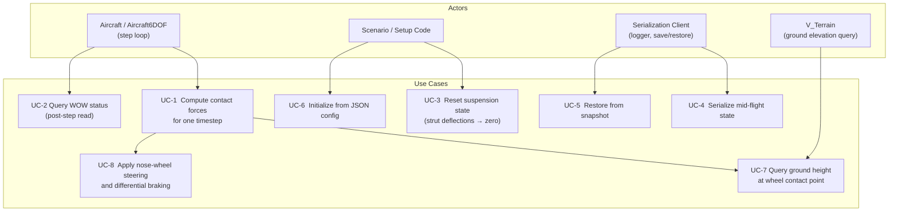
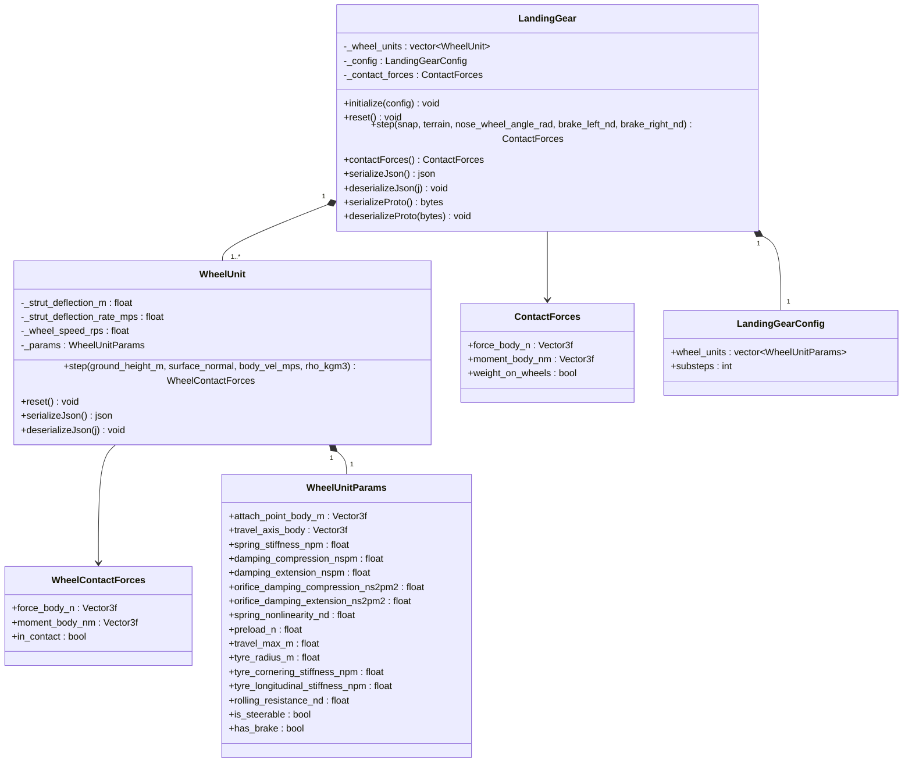
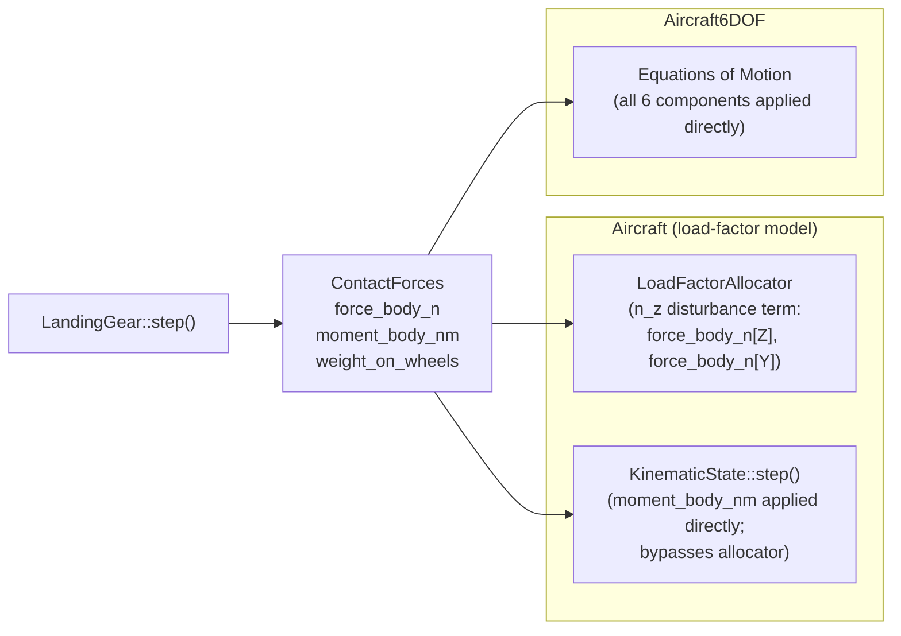

# Landing Gear — Architecture and Interface Design

This document is the design authority for the `LandingGear` subsystem. It covers the
physical models (suspension, tyre contact, wheel friction), the integration contracts with
`Aircraft` and `Aircraft6DOF`, the ground-plane interface, serialization, computational
resource requirements, and the test strategy.

**Design target use case:** developmental verification of autotakeoff and autolanding
functions — ground contact, bounce, WOW establishment, rollout heading control, taxi.

**Validity bound for `Aircraft` (load-factor model):** gear-induced pitch and roll moment
authority exceedance is not modeled. High-speed ground dynamics scenarios that depend on
FBW authority limits require `Aircraft6DOF`.

---

## Use Case Decomposition



| ID | Use Case | Primary Actor | Mechanism |
| --- | --- | --- | --- |
| UC-1 | Compute contact forces for one timestep | `Aircraft::step()` / `Aircraft6DOF::step()` | `LandingGear::step()` |
| UC-2 | Query WOW status after step | Aircraft, guidance, logging | `ContactForces::weight_on_wheels` |
| UC-3 | Reset suspension state | `Aircraft::reset()` | `LandingGear::reset()` |
| UC-4 | Serialize mid-flight snapshot | Logger, pause/resume | `serializeJson()` / `serializeProto()` |
| UC-5 | Restore from snapshot | Pause/resume | `deserializeJson()` / `deserializeProto()` |
| UC-6 | Initialize from JSON config | Scenario, test | `LandingGear::initialize(config)` |
| UC-7 | Query ground height at wheel contact point | Internal to `step()` | `V_Terrain::heightAtPosition_m()` |
| UC-8 | Apply nose-wheel steering and differential braking | Simulation loop | `step()` inputs `nose_wheel_angle_rad`, `brake_left_nd`, `brake_right_nd` |

---

## Class Hierarchy



---

## Integration with Aircraft Models



`LandingGear` is owned by both `Aircraft` and `Aircraft6DOF` as a non-optional member,
initialized from the `"landing_gear"` section of the aircraft JSON config.

### Integration Contract — `Aircraft`

`Aircraft::step()` calls `LandingGear::step()` before the `LoadFactorAllocator` solve.
The contact forces are applied via two parallel mechanisms:

**1. Direct wind-frame acceleration contribution.**
The full body-frame contact force is transformed to the wind frame and added directly
to the wind-frame specific forces:

$$\mathbf{F}_{\text{gear}}^W = R_{WN}\,R_{NB}\,\mathbf{f}_{\text{body}}$$

All three components (x, y, z) contribute to ax, ay, az. When the flight-path angle
$\gamma \neq 0$ — as during a gear bounce — the vertical normal component $F_z$ projects
as $F_z\sin\gamma$ onto wind-x. Whether this cross-axis coupling is a correct physical
effect or a model fidelity limitation of the wind-frame integrator is an open question
(OQ-LG-10).

**2. Gear force & moment integration — rotation-deviation state plus lagged n_z relaxation.**

> **Status: designed (2026-06), not yet implemented.** This is the authoritative design for
> how gear forces and moments couple into the load-factor model. It supersedes the
> currently-coded two-speed hold-time n_z suppression and the unimplemented
> moment-perturbation scheme (see "Current implementation" note at the end of this section).
> The root-cause analysis that motivated it is recorded as OQ-LG-15 (resolved).

The load-factor model represents body attitude kinematically (pitch = flight-path angle γ +
α, with α set by the LFA), so it has no rotational-inertia state. A long-lever-arm gear
contact force applied against that zero-inertia attitude produces a non-physical feedback
(OQ-LG-15). The design below restores the missing rotational inertia where it matters and
routes gear force and moment into the FBW channels.

The load-factor model normally sets the body attitude to FPA + α with zero rotational inertia.
The gear couples in through **two mechanisms, both driven by the gear-derived loads** so that
**both vanish identically when the gear is unloaded** — there is no filter on the flight-path
angle, no always-on dynamic path, and no state switching. In flight the model is exactly
trim-aero.

**(a) Common rotation-deviation state Δθ — the body's inertial response to the gear loads.**
The gear normal force and gear moment drive a single body rotation-deviation $\Delta\theta$ —
the body's inertial pitch/bank response — through a **stable second-order low-pass in the gear
inputs** (a damped spring–mass–damper, $H_2(s)=\omega^2/(s^2+2\zeta\omega s+\omega^2)$ scaled
per channel):

- **Zero initial rotational rate** (zero-initial-slope response): the body cannot slew instantly.
- **Finite, nonzero DC gain**: a sustained gear load produces a bounded steady deviation (the
  static stance / steady derotation) — not zero. (The deviation *rate* $s\,H_2$ is zero-DC: a
  sustained load produces no sustained rate, i.e. no runaway.)
- **Decays to zero on zero input**: the restoring term returns $\Delta\theta$ to zero whenever
  the gear loads cease. Because $\Delta\theta$ is forced by the **gear loads themselves** —
  *not* by lagging the FPA — it is identically zero off-ground, with no residual dynamics and
  no switching.

$\Delta\theta$ is forced by two gear-derived inputs:

1. the **gear normal force's flight-path contribution** (the load factor / path curvature it
   imparts) — the body's inertial resistance to the gear arresting the descent; and
2. the **gear moment** $\mathbf{M}^W = R_{WN}R_{NB}\mathbf{M}^B$, as $M^W/I$ (direct angular
   forcing), per axis (pitch from $M_y^W/I_{yy}$, bank from $M_x^W/I_{xx}$; the yaw axis
   $M_z^W/I_{zz}$ drives a lateral specific-force perturbation $\Delta a_y$).

$\Delta\theta$ is summed into **both** the aero angle of attack and the gear-geometry attitude:

$$\alpha_\text{aero} = \alpha_\text{cmd} + \Delta\theta, \qquad
\theta_\text{geom} = \text{FPA} + \alpha_\text{cmd} + \Delta\theta.$$

**The prompt α/CL response emerges from the EOM — no FPA filter needed.** The gear force
changes the flight-path angle through the ordinary force→velocity integration, while the body
(carrying $\Delta\theta$) does not follow that change instantly (zero initial rotational rate).
So $\alpha = \theta_\text{body} - \text{FPA}$ opens up promptly even though the body's own rate
starts at zero, and CL follows. This is the confirmed mechanism — the FPA moves, the body lags —
but the lag is produced by $\Delta\theta$ responding to the **gear load**, not by filtering the
FPA. When the gear unloads, $\Delta\theta\to 0$ and $\alpha_\text{aero}\to\alpha_\text{cmd}$:
exactly trim-aero, no added dynamics. The same $\Delta\theta$ in $\theta_\text{geom}$ breaks the
OQ-LG-15 sweep — the body does not follow the gear-force-induced FPA swing, so the contact
point is not swept through space at the FPA rate.

**Never integrated into `q_nw`; no stuck bias.** $\Delta\theta$ is a separate state, **never
integrated into the primary attitude quaternion `q_nw`**. Its restoring term (the spring
$k=I\omega^2$) actively returns it to zero, so no residual can become a permanent attitude
bias. (Feeding a *rate* into the pure `q_nw` integrator, which has no restoring term, would
hold any leaked residual — the failure mode that ruled out the earlier "gear moment → body
rate" framing.) `q_nw` carries only the velocity-derived attitude and the FBW-commanded roll.

CL-coupling sign: main-gear contact (aft, nose-down moment) → $\Delta\theta<0$ → lower CL →
derotation/settle; nose-gear contact (forward, nose-up) → higher CL → nose-up/bounce tendency.

**(b) Lagged n_z-command relaxation — the load handoff.** The gear normal force provides part
of the commanded load factor, so the wing must not double-supply it. The FBW senses the
gear-provided acceleration and **relaxes the commanded n_z through its filter** (a lagged
response, $H_1$, DC gain 1); $\alpha_\text{cmd}$ falls accordingly and the aero α/CL correct as
the filter settles:

$$n_{z,\text{shaped}} = \max\!\bigl(0,\; n_{z,\text{cmd}} - H_1(s)\,n_{z,\text{gear}}\bigr),
\qquad n_{z,\text{gear}} = \frac{-F_z^B}{m\,g}.$$

The input is the gear normal-force load factor (zero off-ground via the strut force floor), so
the relaxation also vanishes when the gear unloads; gating is on the **input**, never the
output (output-gating would inject a discontinuous lift jump at liftoff). No explicit
dynamic-pressure washout is applied: lift authority fades emergently through
$L_{\max}=q\,S\,C_{L,\max}$.

**DC-gain summary:**

| Mechanism | Filter | DC gain | Off-ground behavior |
| --- | --- | --- | --- |
| Gear loads → rotation deviation $\Delta\theta$ (→ α/CL + gear geometry) | $H_2$, stable 2nd-order low-pass in the gear inputs | **finite, nonzero** (deflection); **0** in rate | input (gear loads) = 0; state decays to zero via the restoring term — no residual, no switching, never in `q_nw` |
| Gear force → n_z-command relaxation (load handoff) | $H_1$, 2nd-order | **1** | input (gear load factor) = 0; relaxation decays to zero |

The contact model stays **quasi-static / algebraic** (no strut ODE, no implicit contact
integrator); the only added integrated dynamics are these filters (Tustin / `FilterSS2Clip`),
and the aircraft EOM stays RK4.

*Parameterization (OQ-LG-17, resolved):* the two filters are parameterized independently from
different sources. The **rotation-deviation filter $H_2$** is parameterized from **physical
constants — the inertia tensor** (each axis through its own moment of inertia $I_{xx}/I_{yy}/I_{zz}$;
the force and moment channels of an axis share that axis's inertia), with natural frequency and
damping following from the aircraft's physical rotational characteristics. The
**n_z-relaxation filter $H_1$** is parameterized independently from **FBW characteristics
($\omega_n,\zeta$)**. They are never co-parameterized with each other. Numeric values are set at
implementation.

*Current implementation (to be replaced when the above is built):* the code presently uses a
two-speed hold-time n_z suppression filter (`contact_nz_filter_tau_s`, state `_wow0_elapsed_s`,
proto field 33) and has the roll/yaw moment perturbations active with the pitch (n_z) moment
path disabled. These are the artifacts diagnosed in OQ-LG-15 and are superseded by the design
above.

**3. Direct wind-frame moment — `Aircraft6DOF` only.** In the full `Aircraft6DOF` model the
assembled `moment_body_nm` is applied directly to the rotational EOM with no perturbation
mapping; the rotation-deviation and n_z-relaxation scheme above is specific to the load-factor
`Aircraft`.

### Integration Contract — `Aircraft6DOF`

`Aircraft6DOF::step()` applies all six components of `ContactForces` directly to the
equations of motion with no special-casing.

---

## Physical Models

### 1. Wheel Geometry

Each wheel unit is defined by two body-frame vectors:

- **Attachment point** $\mathbf{p}_i^B$ — strut root in body coordinates (m).
- **Travel axis** $\hat{\mathbf{t}}_i^B$ — unit vector along strut compression direction
  in body coordinates (positive toward the ground in nominal attitude).

The contact point position in body frame is:

$$\mathbf{c}_i^B = \mathbf{p}_i^B + \delta_i\,\hat{\mathbf{t}}_i^B - r_w\,\hat{\mathbf{n}}^B$$

where $\delta_i$ is strut deflection (m, positive = compressed), $r_w$ is tyre radius (m),
and $\hat{\mathbf{n}}^B$ is the terrain surface normal expressed in body frame.

Strut deflection is constrained:

$$\delta_{i,\min} \leq \delta_i \leq \delta_{i,\max}$$

where $\delta_{i,\min} = 0$ (fully extended, no negative deflection — the strut cannot
pull the aircraft toward the ground) and $\delta_{i,\max}$ is the mechanical travel limit.

Ground penetration depth at step $k$ is:

$$h_i = z_{\text{ground}} - z_{c_i}$$

where $z_{\text{ground}}$ is the terrain height at the projected wheel contact point (m,
positive upward), $z_{c_i}$ is the $z$-coordinate of the contact point in the inertial
frame, and $h_i > 0$ indicates contact.

---

### 2. Suspension Dynamics — Oleo-Pneumatic Strut Model

Each strut is modeled as a nonlinear spring with asymmetric orifice damping, matching the
physical behavior of an oleo-pneumatic shock absorber.

#### 2a. Nonlinear Spring

Real pneumatic gas columns stiffen nonlinearly as they approach full compression. The spring
force is:

$$F_{\text{spring},i} = k_i \cdot \delta_i \cdot \left(1 + n_i \left(\frac{\delta_i}{\delta_{i,\max}}\right)^2\right) + F_{\text{preload},i}$$

where:

- $k_i$ — linear spring stiffness (N/m)
- $n_i$ — dimensionless nonlinearity factor (`spring_nonlinearity_nd`); at $n_i = 0$ the
  spring is linear; at $n_i = 2$ the effective stiffness triples at full compression
- $\delta_{i,\max}$ — mechanical travel limit (m)
- $F_{\text{preload},i}$ — static preload force (N)

#### 2b. Asymmetric Orifice Damping

Real oleo-pneumatic struts have a metering pin that partially closes the oil orifice on
compression and opens it on extension. This produces:

- High damping on compression (stroke energy absorbed at touchdown)
- Low damping on extension (quick strut recovery without bouncing the airframe back up)

The damping force combines a viscous (linear) term and an orifice (quadratic) term. The
quadratic term dominates at high closure speeds and is the physically correct model for
hydraulic orifice flow ($\Delta P \propto V^2$):

$$F_{\text{damp},i}(\dot{\delta}_i) = b(\dot{\delta}_i)\,\dot{\delta}_i + c(\dot{\delta}_i)\,|\dot{\delta}_i|\,\dot{\delta}_i$$

where the damping coefficients are selected by sign of $\dot{\delta}_i$:

$$b(\dot{\delta}) = \begin{cases} b_{c,i} & \dot{\delta} \geq 0\;\text{(compression)} \\ b_{e,i} & \dot{\delta} < 0\;\text{(extension)} \end{cases}, \qquad c(\dot{\delta}) = \begin{cases} c_{c,i} & \dot{\delta} \geq 0 \\ c_{e,i} & \dot{\delta} < 0 \end{cases}$$

| Parameter | Config key | Units | Typical ratio $c/e$ |
| --- | --- | --- | --- |
| $b_{c,i}$ | `damping_compression_nspm` | N·s/m | 5:1 |
| $b_{e,i}$ | `damping_extension_nspm` | N·s/m | — |
| $c_{c,i}$ | `orifice_damping_compression_ns2pm2` | N·s²/m² | 5:1 |
| $c_{e,i}$ | `orifice_damping_extension_ns2pm2` | N·s²/m² | — |

#### 2c. Total Strut Force

The total strut force (lower-bounded at zero — the strut cannot pull) is:

$$F_{s_i} = \max\!\bigl(0,\; F_{\text{spring},i} + F_{\text{damp},i}\bigr)$$

The force floor prevents suction when the strut extends rapidly past its natural length.

**Quasi-static strut deflection.** The current implementation uses a quasi-static
(unsprung-mass = 0) approximation: strut deflection $\delta_i$ is set directly to the
terrain penetration depth (clamped to travel limits), and the deflection rate
$\dot{\delta}_i$ is computed as the **analytic projection of the contact-patch velocity
onto the inward surface normal** (not a finite difference):

$$\delta_i = \operatorname{clamp}(h_i,\ 0,\ \delta_{i,\max})$$

$$\dot{\delta}_i = -\,\mathbf{v}_{c_i}\cdot\hat{\mathbf{n}}, \qquad
\mathbf{v}_{c_i} = \mathbf{v}^B + \boldsymbol\omega^B\times\mathbf{c}_i^B$$

where $\hat{\mathbf n}$ is the terrain surface normal in body frame (using the surface
normal rather than the strut travel axis eliminates a phantom $V_N\sin\alpha$ term when the
aircraft is pitched — see `WheelUnit::step`). This avoids integrating a second-order ODE
and eliminates the Euler stability constraint $\Delta t < 2\sqrt{m/k}$.

**What `substeps` actually does.** The `substeps` parameter subdivides the outer step only
for the **wheel-spin (Pacejka longitudinal) ODE** in `WheelUnit::step`. The per-wheel
penetration, contact point, and contact-patch velocity are computed once per outer step in
`LandingGear::step` (from the frozen aircraft state) and held constant across the sub-loop,
so $\delta$, $\dot\delta$, and the normal force $F_z$ are identical on every sub-step.
`substeps` therefore does **not** refine $\delta$, $\dot\delta$, $F_z$, or the contact
geometry, and does not advance the aircraft state; it only refines the wheel-spin transient.
The class default is `substeps = 4`; some fixtures override it (the `LandingGear_FullStop`
fixture sets `substeps = 1`). See OQ-LG-15 for why raising `substeps` does not mitigate the
deep-penetration force spikes.

**Note:** unsprung mass and tyre spring compliance are second-order effects relevant only
to a full 6DOF equations-of-motion model (`Aircraft6DOF`). The quasi-static strut is
appropriate for the load-factor (`Aircraft`) model and is not an open question for it.

---

### 3. Tyre Contact Forces — Pacejka Magic Formula

Tyre longitudinal force $F_x$ and lateral force $F_y$ are computed using the Pacejka
"magic formula":

$$F(s) = D \sin\!\bigl(C \arctan(B s - E(B s - \arctan(B s)))\bigr)$$

where $s$ is the relevant slip quantity (slip ratio $\kappa$ for longitudinal, slip angle
$\alpha_t$ for lateral), and $B$, $C$, $D$, $E$ are shape parameters.

#### 3a. Vertical Force

The tyre vertical force is the strut reaction force transmitted through the contact patch:

$$F_{z_i} = F_{s_i}$$

Contact is active only when $h_i > 0$; otherwise $F_{z_i} = 0$.

#### 3b. Longitudinal Slip Ratio

Slip ratio $\kappa$ is defined as:

$$V_\text{ref} = \max\!\bigl(|V_{cx}|,\;|\omega_w\,r_w|\bigr) + \epsilon$$

$$\kappa = \frac{\omega_w\,r_w - V_{cx}}{V_\text{ref}}$$

where:

- $\omega_w$ — wheel angular velocity (rad/s)
- $r_w$ — tyre rolling radius (m)
- $V_{cx}$ — contact-patch longitudinal velocity in the wheel plane (m/s)
- $\epsilon = 0.01$ m/s — regularization to avoid division by zero at standstill

The combined reference speed $V_\text{ref}$ bounds $\kappa$ to $[-1, 1]$ throughout the
contact phase. The naive denominator $|V_{cx}| + \epsilon$ causes $\kappa \to \omega_w r_w / \epsilon$
(thousands) when $V_{cx} \to 0$ while $\omega_w$ is nonzero (e.g., the instant of first
ground contact when the wheel begins spinning up from rest). That large slip ratio
produces a full-friction traction spike that injects energy into the wheel and, through
the aircraft equations of motion, permanently accelerates the aircraft — a non-physical
runaway.

For a locked wheel (braking), $\omega_w = 0$ and $V_\text{ref} = |V_{cx}| + \epsilon$,
so $\kappa = -V_{cx} / (|V_{cx}| + \epsilon) \to -1$ at speed — the expected braking
limit.

#### 3c. Slip Angle

Slip angle $\alpha_t$ is the angle between the wheel heading and the contact-patch velocity
vector projected onto the ground plane:

$$\alpha_t = -\arctan\!\left(\frac{V_{cy}}{|V_{cx}| + \epsilon}\right)$$

where $V_{cy}$ is the lateral component of the contact-patch velocity.

#### 3d. Pacejka Coefficients

The default parameter set is derived from generic bias-ply tyre data (Bakker, Nyborg, Pacejka 1987):

| Parameter | Longitudinal | Lateral | Description |
| --- | --- | --- | --- |
| $B$ | 10.0 | 8.0 | Stiffness factor |
| $C$ | 1.9 | 1.3 | Shape factor |
| $D$ | $\mu F_z$ | $\mu F_z$ | Peak value (friction-limited) |
| $E$ | 0.97 | −1.0 | Curvature factor |

where $\mu$ is the surface friction coefficient (see §5). These coefficients are fixed;
a future design study (OQ-LG-1) may introduce a parameter estimation pipeline from flight
test data.

#### 3e. Combined-Slip Saturation

When both longitudinal and lateral slip are nonzero, the total friction force is limited
by the tyre friction circle:

$$F_{t,i} = \sqrt{F_{x_i}^2 + F_{y_i}^2} \leq \mu F_{z_i}$$

If $F_{t,i} > \mu F_{z_i}$, both components are scaled down proportionally:

$$F_{x_i}' = F_{x_i}\,\frac{\mu F_{z_i}}{F_{t,i}}, \quad F_{y_i}' = F_{y_i}\,\frac{\mu F_{z_i}}{F_{t,i}}$$

---

### 4. Wheel Rotational Dynamics

Wheel angular velocity $\omega_w$ is integrated from the applied brake torque and tyre
longitudinal traction reaction:

$$I_w\,\dot{\omega}_w = -r_w\,F_{x_i} - \tau_{\text{brake},i} - \tau_{\text{roll},i}$$

where:

- $I_w$ — wheel polar moment of inertia (kg·m²). For this model, $I_w$ is approximated
  as $m_w r_w^2 / 2$ using a nominal wheel mass $m_w$ derived from the tyre radius via
  an empirical scaling $m_w \approx 0.3\,r_w$ (kg, with $r_w$ in m).
- $\tau_{\text{brake},i} = C_{\text{brake}}\,b_i\,\omega_w$ — brake torque, where
  $b_i \in [0, 1]$ is the normalized brake demand and $C_{\text{brake}}$ is the maximum
  brake torque (N·m), a config parameter.
- $\tau_{\text{roll},i} = \mu_r\,r_w\,F_{z_i}\,\operatorname{sign}(\omega_w)$ — rolling
  resistance torque, where $\mu_r$ is the rolling resistance coefficient (dimensionless).

The wheel decelerates to a stop in finite time because rolling resistance grows with $F_z$
and does not vanish as $\omega_w \to 0$ (the $\operatorname{sign}$ function is regularized
with a deadband below $|\omega_w| < 0.01$ rad/s to avoid chatter).

#### 4a. Integration Method and Stability

The wheel ODE is integrated by **Tustin (bilinear) discretization** using a predictor-corrector
scheme (OQ-LG-5). At each inner substep:

1. Compute $\dot{\omega}_w^k$ from $F_x(\omega_w^k)$, $\tau_\text{brake}(\omega_w^k)$, and
   $\tau_\text{roll}(\omega_w^k)$.
2. Euler predictor: $\omega^* = \omega_w^k + \dot{\omega}_w^k\,\Delta t_\text{inner}$.
3. Recompute $F_x(\omega^*)$ via the Pacejka formula with friction-circle saturation;
   recompute $\tau_\text{brake}(\omega^*)$ and $\tau_\text{roll}(\omega^*)$.
4. Tustin (trapezoidal) update:
   $$\omega_w^{k+1} = \omega_w^k + \frac{\Delta t_\text{inner}}{2}\bigl(\dot{\omega}_w^k + \dot{\omega}_w^*\bigr)$$

Tustin is unconditionally stable for linear stiffness and second-order accurate in time.
The `substeps` value is a configuration parameter set per aircraft in the JSON config.
For the trim-aero model, it is chosen as a deliberate engineering trade-off between
integration accuracy and computational cost: the 3× Nyquist accuracy bound from OQ-LG-5
gives the minimum substep count for high-fidelity wheel spin dynamics, but those values
are computationally prohibitive for a trim-aero simulation that does not require high
dynamic fidelity in the wheel spin-up transient. The configured value need not satisfy
the Nyquist bound; it should be the smallest value that produces acceptable rollout and
braking behavior for the intended scenario.

#### 4b. Quasi-Static Free-Roll Clamp

The rolling-condition clamp applied under explicit Euler (which snapped $\omega_w$ when
the sign of $\kappa$ changed mid-substep) was removed when the Tustin integrator was
introduced (OQ-LG-5).

A separate, deliberate **quasi-static free-roll clamp** is retained (OQ-LG-11
resolution). When no brake torque is applied, `WheelUnit::step()` sets

$$\omega_w = \max\!\bigl(0,\; V_{cx}/r_w\bigr)$$

exactly, bypassing the Tustin ODE for that substep. This enforces the exact free-rolling
condition ($\kappa = 0$, $F_x = 0$) and ensures only rolling resistance $F_{rr}$
decelerates the aircraft during free ground roll. It is correct defensive programming:
wheel speed cannot physically exceed the contact-patch ground speed or go negative during
free rolling (no brake applied).

$V_{cx}$ is the forward component of the contact-patch velocity in the wheel rolling
direction. It is computed as the projection of $\mathbf{v}^B_\text{CG} +
\boldsymbol{\omega}^B \times \mathbf{c}^B$ onto the wheel-forward axis, where
$\mathbf{c}^B$ is the tyre contact point in body frame (origin at CG). During a turning
rollout the outer and inner wheels therefore receive different $V_{cx}$ values,
correctly reflecting the differential ground speed.

The four canonical tyre events are handled as follows:

| Event | Condition | Action |
| --- | --- | --- |
| First contact | `penetration_m` transitions $\leq 0 \to > 0$ | $\omega_w$ arrives from airborne bearing drag (OQ-LG-6); clamp immediately sets $\omega_w = V_{cx}/r_w$ when no brake is applied |
| Liftoff | `penetration_m` transitions $> 0 \to \leq 0$ | Strut resets to zero; airborne bearing drag ODE takes over |
| Free roll (no brake) | `brake_demand_nd` $< 10^{-4}$ | $\omega_w$ clamped to $V_{cx}/r_w$ exactly; $\kappa = 0$; $F_x = 0$ |
| Lockup | $\omega_w \to 0$ under full braking | Tustin ODE integrates; regularized by rolling-resistance deadband at $\lvert\omega_w\rvert < 0.01$ rad/s |

---

### 5. Surface Friction Parameterization

The surface friction coefficient $\mu$ is queried from the terrain at the wheel contact
point. `V_Terrain` is extended with a `frictionAt(lat_rad, lon_rad)` method that returns
a `SurfaceType` enum:

| `SurfaceType` | $\mu$ (dry) | $\mu$ (wet, multiplier) | Description |
| --- | --- | --- | --- |
| `Pavement` | 0.80 | 0.50 | Paved runway or taxiway |
| `Grass` | 0.40 | 0.30 | Mown grass airfield |
| `Dirt` | 0.50 | 0.25 | Unprepared dirt surface |
| `Gravel` | 0.60 | 0.35 | Gravel or packed aggregate |

Wet multipliers are applied when `AtmosphericState::precipitation > 0`. The friction
coefficient seen by the Pacejka formula is $\mu = \mu_{\text{dry}} \times f_{\text{wet}}$
when precipitation is active, and $\mu = \mu_{\text{dry}}$ otherwise.

**Open question OQ-LG-2:** A richer friction model (e.g., a continuous function of
precipitation intensity or surface contamination depth) has been deferred pending a use case
that requires it. The `SurfaceType` table is sufficient for the autotakeoff/autoland use case.

---

### 6. Ground Plane Interface

`LandingGear::step()` accepts a `const V_Terrain&` reference and calls
`terrain.heightAtPosition_m(lat_rad, lon_rad)` for each wheel contact point to obtain the
ground elevation. The surface normal is approximated by finite differences over a
configurable radius (default 0.5 m):

$$\hat{\mathbf{n}} = \frac{\nabla h \times \mathbf{e}_x}{\|\nabla h \times \mathbf{e}_x\|}$$

where $h$ is the terrain height function and $\mathbf{e}_x$ is the north unit vector.

**Runway geometry extension (proposed — not yet designed):** For runway operations a planar
runway patch inset into `TerrainMesh` is the preferred approach. An analytical runway
definition (with longitudinal slope and crowned lateral profile) is an alternative if a
dedicated runway primitive is added to `V_Terrain`. This choice is deferred to OQ-LG-3.

The `SensorAirData` AGL altitude calculation must use the same terrain height source as the
contact model to avoid discontinuities at touchdown.

---

### 7. Gear Oscillation Stability — Describing Function Analysis

Landing gear systems are susceptible to two distinct oscillatory instabilities driven by
nonlinear contact mechanics: **vertical bounce limit cycles** and **wheel shimmy**. Both
are real in-service phenomena and require formal stability analysis before a gear design
can be declared fit for purpose. The describing function (DF) method is the standard
nonlinear frequency-domain tool: it replaces the nonlinear element with an
amplitude-dependent equivalent gain $N(A)$ and applies the Nyquist criterion via
$N(A)\,G(j\omega) = -1$ to determine whether limit cycles can exist and at what amplitude.

#### 7a. Contact Nonlinearity and Its Describing Function

The fundamental nonlinearity in the gear model is the **one-sided contact spring**: when
the strut is compressed ($\delta > 0$) it produces a restoring force; when the wheel is
airborne ($\delta \leq 0$) the force is zero. For a sinusoidal perturbation
$\hat{\delta} = A\sin(\omega t)$ about the static equilibrium deflection
$\delta_0 = mg / k_\text{total}$, the spring behaves as a biased half-wave rectifier.

Define $\varphi = \arcsin(\delta_0/A) \in [0, \pi/2]$ as the angle at which the aircraft
just lifts off each cycle. The describing function is:

$$N(A) = \begin{cases}
k_\text{total} & A \leq \delta_0 \quad\text{(always in contact, linear regime)} \\[6pt]
\dfrac{k_\text{total}}{\pi}\!\left[
  \dfrac{\pi}{2} + \arcsin\!\!\left(\dfrac{\delta_0}{A}\right)
  + \dfrac{\delta_0}{A}\sqrt{1-\!\left(\dfrac{\delta_0}{A}\right)^{\!2}}\,
\right] & A > \delta_0 \quad\text{(periodic liftoff)}
\end{cases}$$

The describing function is real-valued (no phase shift), monotonically decreasing in $A$,
and continuous at $A = \delta_0$:
- $A \to \delta_0^+$: $N \to k_\text{total}$
- $A \to \infty$: $N \to k_\text{total}/2$ (half-cycle contact per period)

For the test fixture ($m = 1045$ kg, $k = 20\,000$ N/m per wheel, three wheels):

$$k_\text{total} = 60\,000\;\text{N/m}, \qquad
\delta_0 = \frac{mg}{k_\text{total}} = \frac{10\,255}{60\,000} = 0.171\;\text{m}$$

Vertical oscillations with amplitude $A < 0.171$ m remain in the linear regime. The
linear natural frequency is $\omega_n = \sqrt{k_\text{total}/m} = 7.57$ rad/s
($T \approx 0.83$ s).

#### 7b. Vertical Bounce — Limit Cycle Conditions

For vertical motion, the plant is a double integrator (mass only):

$$G_\text{bounce}(j\omega) = -\frac{1}{m\omega^2}$$

The Nyquist limit cycle condition $N(A)\,G_\text{bounce}(j\omega) = -1$ reduces to:

$$N(A) = m\omega^2$$

This gives a family of resonant amplitudes as a function of frequency:
- For $A \leq \delta_0$: $N = k_\text{total} \Rightarrow \omega = \omega_n$.
- For $A > \delta_0$: $N < k_\text{total} \Rightarrow \omega < \omega_n$ — the resonant
  frequency decreases with bounce amplitude. A hard bounce with $A \gg \delta_0$ oscillates
  near $\omega_n / \sqrt{2}$.

**Whether a limit cycle grows or decays** depends entirely on the net energy per cycle.
The asymmetric damping dissipates energy on both strokes:

$$\Delta E_\text{damp}(A, \omega) = \frac{\pi}{2}\,A^2\,\omega\,(b_c + b_e)$$

This is always positive — damping removes energy regardless of the $b_c/b_e$ ratio. Low
$b_e$ (fast rebound, slow decay) does **not** inject energy; it merely prolongs the
oscillation. This DF analysis describes the *physical* gear-spring bounce mode. Note that
the `LandingGear_FullStop` terminal-velocity behavior (OQ-LG-15) is **not** this spring
limit cycle: the diagnostic shows it is a numerical artifact (deep single-step penetration
producing a one-step forward impulse), oscillating at the contact sampling rate rather than
the spring natural frequency. The DF spring-mode analysis here remains valid for assessing
genuine multi-cycle bounce behavior at adequate substep resolution.

**Design criterion — extension damping.** The extension stroke must dissipate enough
energy per cycle that the bounce amplitude decays to 50% within 3 natural periods
($t_{50\%} \leq 3T$). Solving $e^{-\zeta_e \omega_n t_{50\%}} = 0.5$ for the
single-wheel approximation:

$$\zeta_e = \frac{b_e}{2\sqrt{k\,m/3}} \geq 0.18$$

At $\zeta_e = 0.099$ (current test fixture), the 50% decay time is $t_{50\%} \approx 6T
\approx 5$ s — the bounce requires roughly twice the target number of cycles to halve
its amplitude, making the system susceptible to limit cycling whenever any energy coupling
is present.

#### 7c. Wheel Shimmy

Wheel shimmy is a **lateral** oscillation of the nose (or main) wheel about its swivel
axis, driven by the lag between heading change and tyre lateral force development. It is
independent of the vertical bounce mode and occurs at much higher frequencies
($f_\text{shimmy} = V / (2\pi\sigma)$, typically 10–40 Hz). Wheel shimmy has caused
structural failure of nose-wheel assemblies in service and is a required design analysis
item for any castoring nose wheel (FAR 25.499, MIL-HDBK-516C).

**Mechanism.** After a lateral disturbance, the tyre develops its restoring lateral force
only after traveling a path length of approximately $\sigma$ — the **relaxation length**
(roughly 0.3–0.5 × tyre radius). This lag creates a phase delay between the geometric
yaw perturbation and the restoring moment. At the critical speed this phase delay reaches
180°, and the moment drives the oscillation rather than suppressing it.

**Governing parameters (nose wheel):**

| Symbol | Quantity | Typical C172-class value |
| --- | --- | --- |
| $l$ | Mechanical caster arm (swivel offset from contact patch) | 0.05–0.10 m |
| $e$ | Pneumatic trail (additional contact-force offset) | 0.02–0.04 m |
| $\sigma$ | Tyre lateral relaxation length | 0.03–0.06 m |
| $C_\alpha$ | Tyre cornering stiffness | 20,000–40,000 N/rad |
| $I_\psi$ | Nose wheel assembly yaw inertia | 0.5–2.0 kg·m² |
| $c_\psi$ | Swivel damper coefficient | 50–200 N·m·s/rad |

**Linearized stability analysis.** Combining the nose wheel yaw equation with the
relaxation-length tyre dynamics gives the third-order characteristic polynomial:

$$\frac{I_\psi \sigma}{V}\,s^3
+ \!\left(I_\psi + \frac{c_\psi \sigma}{V}\right)\!s^2
+ \!\left(c_\psi + \frac{C_\alpha(l+e)\,l}{V}\right)\!s
+ C_\alpha(l+e) = 0$$

By the Routh–Hurwitz criterion, the stability boundary is:

$$\left(I_\psi + \frac{c_\psi \sigma}{V}\right)\!\left(c_\psi + \frac{C_\alpha(l+e)\,l}{V}\right)
= \frac{I_\psi \sigma\,C_\alpha(l+e)}{V}$$

**Key result — no damper ($c_\psi = 0$).** The Routh condition reduces to $l > \sigma$.
A caster arm shorter than the tyre relaxation length will shimmy at all forward speeds
without a damper. For $l \approx \sigma$ — common in light GA designs — a swivel damper
is always required for shimmy margin.

**Describing function for limit cycle amplitude.** Above the stability boundary the
shimmy amplitude is bounded by tyre lateral force saturation at
$F_{y,\text{max}} = \mu_y N_z$. Treating this as a symmetric saturation nonlinearity
with linear slope $C_\alpha$, the DF is:

$$N_\text{shimmy}(A_\psi) = \frac{2C_\alpha}{\pi}\!\left[
  \arcsin\!\left(\frac{F_{y,\text{max}}}{C_\alpha A_\psi}\right)
  + \frac{F_{y,\text{max}}}{C_\alpha A_\psi}
    \sqrt{1-\!\left(\frac{F_{y,\text{max}}}{C_\alpha A_\psi}\right)^{\!2}}
\right]$$

for $C_\alpha A_\psi > F_{y,\text{max}}$ (saturation reached); $N_\text{shimmy} = C_\alpha$
below saturation. Substituting into the closed-loop condition $N_\text{shimmy}(A_\psi)\,
G_\text{shimmy}(j\omega_\text{shimmy}) = -1$ and solving numerically gives the
limit cycle yaw amplitude $A_\psi$.

**Shimmy frequency** is dominated by the tyre lag pole:
$\omega_\text{shimmy} \approx V / \sigma$, so $f_\text{shimmy} = V/(2\pi\sigma)$.
For $V = 20$ m/s and $\sigma = 0.05$ m: $f \approx 64$ Hz.

**Current model limitation.** The `LandingGear` model does not include swivel inertia
$I_\psi$, swivel damper $c_\psi$, tyre relaxation length $\sigma$, or pneumatic trail
$e$. It therefore **cannot simulate shimmy** and provides no shimmy margin assessment.
This is an acceptable gap for the autotakeoff/autolanding verification use case but would
be a blocking deficiency for ground-dynamics certification analysis.

#### 7d. Design Criteria Summary

| Mode | Parameter | Design target | Consequence of violation |
| --- | --- | --- | --- |
| Vertical bounce | $\zeta_e$ (extension damping ratio) | $\geq 0.20$ | Bounce persists $>5$ s; susceptible to limit cycling from any energy coupling |
| Vertical bounce | $\zeta_c$ (compression damping ratio) | $\geq 0.30$ | Insufficient touchdown energy absorption |
| Nose wheel shimmy | Caster geometry | $l > \sigma$ | Shimmy at all speeds without damper |
| Nose wheel shimmy | Swivel damper | $c_\psi > C_\alpha\sigma l\bigl[(V_\text{max}/V_{\text{crit},0})^2 - 1\bigr]$ | Shimmy above $V_\text{crit}$ |
| Nose wheel shimmy | Model fidelity | $\sigma$, $e$, $I_\psi$, $c_\psi$ all parameterized | Cannot assess shimmy margin without full caster model |

---

## Force Assembly

The per-wheel contact forces are rotated from the wheel frame into the body frame and
summed. For each wheel unit $i$ with contact force $\mathbf{f}_i^B$ (already in body frame
after applying the wheel-heading rotation), the total body-frame force and moment are:

$$\mathbf{F}_{\text{gear}}^B = \sum_i \mathbf{f}_i^B$$

$$\mathbf{M}_{\text{gear}}^B = \sum_i \mathbf{c}_i^B \times \mathbf{f}_i^B$$

where $\mathbf{c}_i^B$ is the contact point position in body frame (§1).

The assembled result is returned as `ContactForces`:

```cpp
struct ContactForces {
    Eigen::Vector3f force_body_n   = Eigen::Vector3f::Zero();   // body-frame force (N)
    Eigen::Vector3f moment_body_nm = Eigen::Vector3f::Zero();   // body-frame moment (N·m)
    bool            weight_on_wheels = false;
};
```

`weight_on_wheels` is `true` when any wheel unit reports `in_contact = true`.

---

## Step Interface

```cpp
// include/landing_gear/LandingGear.hpp
namespace liteaero::simulation {

class LandingGear {
public:
    void initialize(const nlohmann::json& config);
    void reset();

    ContactForces step(const KinematicStateSnapshot& snap,
                       const V_Terrain&              terrain,
                       float                         nose_wheel_angle_rad,
                       float                         brake_left_nd,
                       float                         brake_right_nd);

    const ContactForces& contactForces() const;

    [[nodiscard]] nlohmann::json       serializeJson()                           const;
    void                               deserializeJson(const nlohmann::json&        j);
    [[nodiscard]] std::vector<uint8_t> serializeProto()                          const;
    void                               deserializeProto(const std::vector<uint8_t>& bytes);

private:
    LandingGearConfig        _config;
    std::vector<WheelUnit>   _wheel_units;
    ContactForces            _contact_forces;
};

} // namespace liteaero::simulation
```

`KinematicStateSnapshot` supplies position, velocity (NED), and attitude (rotation matrix
$C_{B}^{N}$) needed to project wheel attachment points into the inertial frame and to
compute contact-patch velocities.

---

## Serialization

### Serialized State

Serialized state covers all quantities that change between `reset()` and any mid-flight
`step()` call. Configuration parameters (spring stiffness, geometry, etc.) are not
serialized — they are reloaded from the JSON config on `initialize()`.

Per wheel unit:

| Field | Type | Unit | Description |
| --- | --- | --- | --- |
| `strut_deflection_m` | float | m | Strut compression |
| `strut_deflection_rate_mps` | float | m/s | Strut compression rate |
| `wheel_speed_rps` | float | rad/s | Wheel angular velocity |

Top-level:

| Field | Type | Description |
| --- | --- | --- |
| `schema_version` | int | Always `1` |
| `wheel_units` | array | Per-wheel state objects (ordered to match config) |

### Proto Message

```proto
message WheelUnitState {
    float strut_deflection_m        = 1;
    float strut_deflection_rate_mps = 2;
    float wheel_speed_rps           = 3;
}

message LandingGearState {
    int32                   schema_version = 1;
    repeated WheelUnitState wheel_units    = 2;
}
```

---

## Computational Resource Estimate

The landing gear model executes once per outer simulation step. The dominant cost is the
inner substep loop; terrain queries are outer-only and do not scale with $N_{\text{sub}}$.

Terrain height and the surface normal are evaluated once at the outer step (at the aircraft
CG position) and held constant across all substeps. This is exact for flat terrain and
introduces a negligible slope-tracking lag for smoothly varying terrain at typical aircraft
speeds and outer timesteps.

### Operation Counts (per outer step, tricycle gear — 3 wheel units)

| Operation | Count per substep | Substeps | Total per outer step |
| --- | --- | --- | --- |
| `V_Terrain::heightAtPosition_m()` | — | 1 (outer only) | **1** |
| Per-wheel contact geometry + penetration | 3 | 1 (outer only) | **3** |
| Spring-damper force eval | 3 | $N_{\text{sub}}$ | $3 N_{\text{sub}}$ |
| Pacejka longitudinal formula | 6 | $N_{\text{sub}}$ | $6 N_{\text{sub}}$ |
| Pacejka lateral formula | 6 | $N_{\text{sub}}$ | $6 N_{\text{sub}}$ |
| Friction-circle saturation | 6 | $N_{\text{sub}}$ | $6 N_{\text{sub}}$ |
| Wheel speed integration (Tustin) | 3 | $N_{\text{sub}}$ | $3 N_{\text{sub}}$ |
| Body-frame rotation + moment arm cross product | 3 | 1 (outer only) | **3** |

The Tustin predictor-corrector evaluates Pacejka longitudinal and lateral formulas twice per
substep (once at $\omega_k$, once at $\omega^*$). $N_\text{sub}$ is set per aircraft by the
3× Nyquist rule (OQ-LG-5 resolution). All arithmetic is single-precision `float`.

### Memory Footprint (tricycle gear)

| Structure | Fields | Size |
| --- | --- | --- |
| `WheelUnit` state (×3) | 3 floats each | 36 bytes |
| `WheelUnitParams` (×3) | ~16 floats + 2 bools each | ~204 bytes |
| `LandingGearConfig` | substeps (int) | 4 bytes |
| `ContactForces` | 6 floats + 1 bool | 28 bytes |
| **Total** | | **~224 bytes** |

### Timing

At a 50 Hz outer rate (0.02 s step) and $N_{\text{sub}} = 8$, the landing gear inner loop
runs at 400 Hz. The single terrain height query occurs once per outer step; the inner
substep loop (Pacejka + spring-damper + Tustin) dominates wall time during contact. The
total landing gear contribution to a 50 Hz simulation loop is estimated at **< 20 µs** per
step — negligible relative to the allocator Newton solve (which dominates).

A fast-path skip in `LandingGear::step()` bypasses the entire substep loop when all wheels
are airborne (penetration ≤ 0), all wheel speeds are zero, and all strut deflections are
zero. This covers the common cruise and climb segments between taxi events, eliminating
the substep overhead entirely during airborne flight.

The model does **not** require the outer timestep to be reduced below the standard
simulation rate.

---

## Open Questions

| ID | Summary | Blocking |
| --- | --- | --- |
| OQ-LG-1 | Pacejka coefficient sourcing | Not blocking |
| OQ-LG-2 | Richer surface friction model | Not blocking |
| OQ-LG-3 | Runway geometry extension | Blocking for runway operations |
| OQ-LG-4 | Unsprung mass and tyre spring compliance | Not blocking for `Aircraft`; deferred to `Aircraft6DOF` |
| OQ-LG-5 | ~~Integration method for wheel spin ODE~~ **Resolved: Tustin; substep count by 3× Nyquist rule** | — |
| OQ-LG-6 | ~~Airborne wheel spin-down model~~ **Resolved: linear + quadratic bearing drag; spindown-time parametrization** | — |
| OQ-LG-7 | ~~First-contact wheel speed initial condition~~ **Resolved: no special action; Tustin integrator handles spin-up** | — |
| OQ-LG-8 | Terrain facet slope ignored in surface normal | Not blocking for paved runways; blocking for sloped unprepared strips |
| OQ-LG-9 | ~~moment_body_nm not applied in Aircraft~~ **Resolved: derive n_z, ay, and roll-rate perturbations from gear moments, mirroring the existing n_z suppression** | — |
| OQ-LG-10 | ~~Wind-frame contact force decomposition: full transform vs. friction-only in wind-x~~ **Resolved: full transform retained; test parameters must use realistic ζ** | — |
| OQ-LG-11 | ~~Quasi-static free-roll clamp vs. Tustin natural convergence~~ **Resolved: clamp retained; V_cx uses correct contact-point velocity including ω × r** | — |
| OQ-LG-12 | ~~Wind-frame moment-axis mapping for OQ-LG-9 implementation~~ **Resolved: wind-y → n_z_moment (pitch), wind-z → Δay (yaw); OQ-LG-9 text corrected** | — |
| OQ-LG-13 | ~~High-pass filter design for moment perturbation paths~~ **Resolved, then superseded by the OQ-LG-15 gear-F&M integration: the moment→rate high-pass (integrated into `q_nw`) is replaced by a moment→deflection stable low-pass kept as a self-decaying state, not integrated into `q_nw`** | — |
| OQ-LG-14 | ~~Velocity regularization floor for moment perturbations~~ **Resolved: no floor needed; M^W and perturbations both go as V² near standstill** | — |
| OQ-LG-15 | ~~LandingGear_FullStop_SpeedNearZero gear–attitude feedback artifact~~ **Resolved: root cause (zero-inertia velocity-slaved attitude sweeping the long-lever-arm nose wheel) diagnosed; fix is the gear-F&M integration (gear-load-driven rotation-deviation state + lagged n_z relaxation), specified in Integration Contract — `Aircraft` §2 (parameterization resolved, OQ-LG-17). Design complete; not yet implemented** | — |
| OQ-LG-16 | ~~Gear pitch moment has no path into the `Aircraft` load-factor model~~ **Resolved: subsumed by the OQ-LG-15 gear-F&M integration — gear pitch moment is one input to the body rotation-deviation Δθ (self-decaying deflection: stable 2nd-order low-pass, finite DC, not a rate into `q_nw`) → α → CL → realized Nz; implemented as part of OQ-LG-15** | — |
| OQ-LG-17 | ~~Filter parameterization for the gear-F&M integration~~ **Resolved: the two filters are independent — the rotation-deviation filter H₂ is parameterized from physical constants (the inertia tensor, per axis); the n_z-relaxation filter H₁ independently from FBW characteristics (natural frequency, damping ratio)** | — |
| OQ-LG-18 | Δθ pitch force-channel accumulator diverges in the FullStop limit cycle — blocking implementation of the rotation-deviation pitch path | Blocking IP-AGF-6 Δθ pitch channel |

---

### OQ-LG-1 — Pacejka Coefficient Sourcing

**Question:** Should the Pacejka coefficients ($B$, $C$, $D$, $E$) for longitudinal and
lateral force be fixed at generic bias-ply values (Bakker et al. 1987), or should a
parameter estimation pipeline from flight test data be introduced?

**Current state:** The model uses fixed coefficients from Table 3d (§3d). These are
representative for generic small-aircraft bias-ply tyres but have not been validated
against any specific tyre used on a liteaero aircraft. $D = \mu F_z$ preserves the
friction-circle invariant regardless of $\mu$, so the dominant uncertainty is in the
shape parameters $B$, $C$, $E$ — which control the slope and sharpness of the
force-vs-slip curve.

**Why it matters:** The shape parameters govern the deceleration distance during rollout
and the lateral force build-up during a crab landing. An incorrect $B$ makes the tyre
appear too stiff or too progressive. For autolanding validation the error is partially
masked by the friction-circle saturation, but a wrong rollout distance or heading excursion
budget could produce a misleading pass/fail verdict.

**Alternatives:**

1. **Fixed generic set (current).** Use the Bakker et al. 1987 coefficients for all
   aircraft types. The peak friction term $D = \mu F_z$ is scaled by the surface friction
   coefficient; the shape parameters $B = 10.0$, $C = 1.9$, $E = 0.97$ (longitudinal) and
   $B = 8.0$, $C = 1.3$, $E = -1.0$ (lateral) are fixed.

   **Benefits:** No flight test data required; no pipeline infrastructure; immediately
   usable for development.

   **Drawbacks:** Shape parameters are not validated against any specific liteaero tyre;
   rollout distance and heading excursion pass/fail criteria are order-of-magnitude
   estimates only.

   **Prerequisites:** None.

2. **Lookup table per aircraft type.** Store per-type Pacejka coefficients ($B$, $C$, $E$
   longitudinal and lateral) in the aircraft JSON config alongside spring stiffness and
   geometry. Values are updated manually from test data or manufacturer specifications.

   **Benefits:** Minimal code change; fits naturally into the existing JSON config;
   decouples coefficient choice from simulation code.

   **Drawbacks:** Requires at least manufacturer tyre data or measurement to populate;
   no automated update pipeline from flight test.

   **Prerequisites:** Access to tyre specifications or flight test data sufficient to
   identify $B$, $C$, $E$ for the aircraft's tyre type.

3. **Automated identification from logged rollout data.** A Python-side optimizer fits
   $B$, $C$, $E$ to measured wheel speed and longitudinal deceleration from a set of
   instrumented rollout runs.

   **Benefits:** Produces aircraft-specific coefficients validated against real flight
   data; enables continuous refinement as more data are collected.

   **Drawbacks:** Requires instrumented rollout data (wheel speed sensor, inertial
   deceleration log) — not yet available; adds a data-processing pipeline dependency.

   **Prerequisites:** Wheel speed sensor and inertial deceleration logging capability;
   multiple rollout runs with consistent conditions.

**Recommendation:** Option 2 (per-type config lookup) is the minimum acceptable for
production use. Until per-type data are available, Option 1 (fixed generic set) is used
and any deceleration distance figures in scenario test pass criteria are treated as
order-of-magnitude estimates only. Option 3 is reserved until instrumented flight test
data exist.

---

### OQ-LG-2 — Richer Surface Friction Model

**Question:** Should surface friction $\mu$ be a continuous function of precipitation
intensity (and possibly surface contamination depth), or is the current binary wet/dry
multiplier sufficient?

**Current state:** `V_Terrain::frictionAt()` returns one of four `SurfaceType` values
(§5). The wet multiplier is applied when `precipitation > 0` — a binary step. There is no
model for water depth, rubber contamination, or the transition from dry to fully wet.

**Why it matters:** The friction coefficient on a contaminated runway can vary from 0.80
(dry pavement) to 0.05 (standing water, aquaplaning). The landing distance and crosswind
limit are both sensitive to $\mu$. The binary model produces a discontinuous step in
contact force when precipitation transitions on/off during a simulation run, which is
unphysical and can excite the strut spring.

**Alternatives:**

1. **Binary wet/dry (current).** Apply a fixed wet multiplier from the `SurfaceType` table
   when `AtmosphericState::precipitation > 0`, otherwise use the dry coefficient. The
   transition is a step function with no smoothing.

   **Benefits:** Sufficient for the autotakeoff/autoland development use case where the
   scenario either rains or it does not; no additional model parameters required.

   **Drawbacks:** Produces a discontinuous step in contact force when precipitation
   transitions on/off during a run, which is unphysical and can excite the strut spring.

   **Prerequisites:** None.

2. **Linear interpolation by precipitation intensity.** Use `precipitation_mm_hr` as a
   blending factor between $\mu_\text{dry}$ and $\mu_\text{wet}$, producing a continuous
   $\mu$ that varies with precipitation rate.

   **Benefits:** Eliminates the binary step; physically more representative of the
   wet-surface transition.

   **Drawbacks:** Requires `Atmosphere` to expose a precipitation rate field
   (`precipitation_mm_hr`); the linear relationship between precipitation rate and $\mu$
   is an approximation with no empirical basis in the current model.

   **Prerequisites:** `Atmosphere` must expose `precipitation_mm_hr`; blending bounds
   (at what rate is full $\mu_\text{wet}$ reached?) require empirical data or a design
   decision.

3. **Aquaplaning threshold.** Below the aquaplaning speed ($V_{aq} \approx 9\sqrt{p_t}$
   where $p_t$ is tyre pressure in psi) the full wet multiplier applies; above it $\mu$
   drops sharply toward aquaplaning values (0.05–0.10).

   **Benefits:** Captures the most safety-critical wet-runway phenomenon (aquaplaning);
   physically well-grounded; required for crosswind limit scenarios on wet runways.

   **Drawbacks:** Requires tyre pressure as a config parameter; the aquaplaning speed
   formula assumes a specific tyre geometry; adds a speed-dependent discontinuity in $\mu$.

   **Prerequisites:** Tyre pressure (`tyre_pressure_psi`) added to `WheelUnitParams`;
   a scenario that requires differentiated aquaplaning behavior.

**Recommendation:** Option 1 remains in place until a scenario requires differentiated
friction during a precipitation transition. OQ-LG-2 becomes blocking if an aquaplaning
or wet-runway crosswind limit scenario is added to the test matrix; at that point
Option 3 is preferred.

---

### OQ-LG-3 — Runway Geometry Extension

**Question:** How should a paved runway be represented in `V_Terrain` to support precise
runway operations — as a planar patch inset into `TerrainMesh`, or as a new analytical
runway primitive added to the `V_Terrain` interface?

**Current state:** `TerrainMesh` represents terrain as a triangulated mesh loaded from
a `.las` point cloud (§6). A runway can be approximated by the mesh, but the mesh
resolution and triangulation quality are determined by the LiDAR survey density, not by
the runway geometry. Mesh-based runways exhibit residual height noise ($\sim 0.02$ m RMS
from LiDAR ground-return scatter) that produces spurious contact transitions during
high-speed ground roll.

**Why it matters:** Autolanding requires a clean, noise-free terrain surface in the
flare and rollout zone. Residual height noise at touchdown produces spurious WOW
oscillations and corrupts the AGL estimate used by the flare guidance. An analytical
runway eliminates both problems.

**Alternatives:**

1. **Planar inset patch.** A rectangular flat patch at a defined altitude is spliced into
   `TerrainMesh` during tile generation, overriding the LiDAR-derived triangles inside
   the runway boundary. The `V_Terrain` interface is unchanged.

   **Benefits:** No changes to the `V_Terrain` C++ interface; the runway appears in the
   mesh automatically for all consumers of the terrain; frictionAt() coverage requires
   no extension.

   **Drawbacks:** Requires modifications to the terrain preprocessing pipeline (Python
   tile builder); runway geometry is baked into the mesh and cannot be changed without
   rebuilding tiles; does not support longitudinal slope or lateral crown.

   **Prerequisites:** Runway boundary definition (threshold lat/lon, heading, width,
   length) available to the tile preprocessing pipeline; `terrain_build.md` design
   updated to cover the runway inset workflow.

2. **Analytical runway primitive in `V_Terrain`.** `V_Terrain` gains a `RunwayPrimitive`
   that overrides `heightAtPosition_m()` and `frictionAt()` inside the runway footprint.
   The footprint is defined by threshold coordinates, heading, width, and length. Supports
   longitudinal slope and lateral crown without mesh refinement.

   **Benefits:** Decouples runway geometry from mesh quality; enables precise threshold
   and centerline coordinates from published aeronautical data; no tile rebuild required
   when the runway definition changes; supports slope and crown.

   **Drawbacks:** Adds a new interface extension to `V_Terrain`; the `RunwayPrimitive`
   class requires design, implementation, and integration tests; the boundary between the
   mesh and the primitive may produce a discontinuous normal at the runway edge.

   **Prerequisites:** `V_Terrain` interface design updated (design document); a strategy
   for smoothing the mesh-to-primitive transition at the runway boundary.

3. **Combined: analytical primitive + mesh blend.** The runway primitive provides height
   and friction inside the footprint; the mesh provides everything else; a transition zone
   smoothly blends the two at the overrun boundary.

   **Benefits:** Most physically accurate; clean separation of runway surface from
   surrounding terrain; avoids the boundary discontinuity problem of Option 2.

   **Drawbacks:** Most complex implementation; the blending function requires a design
   decision (width, shape); increases the V_Terrain interface surface area.

   **Prerequisites:** All prerequisites of Option 2, plus a blending strategy design.

**Recommendation:** Option 2 (analytical primitive) is preferred because it decouples
runway geometry from mesh quality and enables precise threshold and centerline coordinates
from published aeronautical data. OQ-LG-3 is **blocking for runway operations** and must
be resolved before implementing any autolanding scenario that uses a real or representative
runway.

---

### OQ-LG-4 — Unsprung Mass and Tyre Spring Compliance

**Question:** Should the wheel and tyre unsprung mass, and the tyre radial spring
compliance, be modeled as separate degrees of freedom, or is the current quasi-static
strut approximation sufficient?

**Current state:** The quasi-static strut approximation (§2c) sets strut deflection
directly to terrain penetration depth, implicitly assuming zero unsprung mass and an
infinitely stiff tyre. The strut force is transmitted instantaneously to the airframe.
This approximation eliminates a second-order ODE and its associated stability constraint.

**Why the approximation matters:** In a full 6DOF equations-of-motion model
(`Aircraft6DOF`) the airframe accelerations are computed from the net force, so the
spring-mass system formed by strut + airframe mass is the primary mode of interest.
Adding unsprung mass $m_u$ and tyre radial spring stiffness $k_t$ introduces a
second, higher-frequency mode at $\omega_n = \sqrt{k_t / m_u}$. At small tyre radii
(0.08 m, typical small UAS) $k_t \sim 50{,}000$ N/m and $m_u \sim 0.1$ kg, giving
$\omega_n \approx 700$ rad/s — well above the 50 Hz outer rate. The quasi-static
approximation therefore remains valid for `Aircraft6DOF` in this frequency range.
For the `Aircraft` load-factor model the strut force enters only as a disturbance to the
allocator; structural strut dynamics are not observable in the allocator outputs, so the
approximation is unconditionally valid for `Aircraft`.

**Alternatives:**

1. **Quasi-static strut (current).** Strut deflection is set directly to terrain
   penetration depth; $\dot{\delta}$ is estimated by finite difference; no unsprung mass
   ODE is integrated.

   **Benefits:** No ODE to integrate; no stability constraint on $\Delta t$; simpler
   code; correct for the `Aircraft` load-factor model at all fidelity targets; valid
   for `Aircraft6DOF` when $\omega_n \gg 1 / (2\Delta t_\text{inner})$.

   **Drawbacks:** Cannot model peak strut load in hard landing structural assessments
   (where $m_u$ and $k_t$ govern the load amplification); contact force has a step
   discontinuity at first contact because the tyre compliance is zero.

   **Prerequisites:** None.

2. **Full unsprung-mass + tyre-spring second-order ODE.** Add $m_u$ and $k_t$ as
   `WheelUnitParams` fields and integrate the two-DOF (strut + tyre) spring-mass system
   at each substep via the Tustin integrator (OQ-LG-5 resolution).

   **Benefits:** Models the tyre compliance correctly; removes the contact-force step
   discontinuity; required for peak strut load assessment in structural scenarios.

   **Drawbacks:** Adds two new config parameters ($m_u$, $k_t$) per wheel that are
   difficult to measure; the Tustin substep count must satisfy the Nyquist criterion for
   $\omega_n \approx 700$ rad/s, requiring $N_\text{sub} \gg 28$ — impractical at the
   50 Hz outer rate without reducing $\Delta t_\text{outer}$.

   **Prerequisites:** OQ-LG-5 Tustin integrator implemented; $m_u$ and $k_t$ values
   sourced from tyre manufacturer data or structural measurements; a hard landing
   structural assessment scenario that requires the additional fidelity.

**Recommendation:** Option 1 (quasi-static strut) is correct and sufficient for all
current use cases: autotakeoff/autoland verification with `Aircraft`, and ground contact
dynamics with `Aircraft6DOF` at the current fidelity target. Option 2 is deferred
indefinitely for `Aircraft` and deferred for `Aircraft6DOF` until a hard landing
structural load assessment scenario is added to the test matrix.

---

### OQ-LG-5 — Integration Method for Wheel Spin ODE *(Resolved)*

**Resolution:** Use Tustin (bilinear) discretization for the wheel angular velocity ODE.
Set the substep count so that the Nyquist frequency of the inner timestep exceeds the
linearized tyre-dynamics pole frequency by at least 3×.

**Chosen alternative:** Tustin discretization (alternative 3 from the open question).
The trapezoidal update

$$\omega_w^{k+1} = \omega_w^k + \frac{\Delta t}{2}\bigl(\dot{\omega}_w^k + \dot{\omega}_w(\omega_w^{k+1})\bigr)$$

is equivalent to applying the Tustin transform $s \leftarrow \frac{2}{\Delta t}\frac{z-1}{z+1}$
to the linearized ODE. It is unconditionally stable for linear stiffness and second-order
accurate in time, and uses the discretization pattern already established for filter design
in this project ([`docs/algorithms/filters.md`](../algorithms/filters.md)).

**Substep count rule:**

The linearized tyre-dynamics pole frequency (rad/s) near the free-rolling condition is:

$$\omega_\text{pole} = \frac{r_w^2\,k_\kappa}{I_w\,V_\text{ref}}, \quad k_\kappa = B C D = B C \mu F_z$$

where $r_w$ is the tyre radius (m), $B$ and $C$ are the Pacejka shape factors (10.0 and
1.9 for the longitudinal direction), $\mu$ is the surface friction coefficient, $F_z$ is
the strut normal force (N), $I_w = 0.15\,r_w^3$ (kg·m²) is the wheel moment of inertia,
and $V_\text{ref} = \max(|V_{cx}|, |\omega_w r_w|) + \epsilon$ (m/s) is the slip
reference speed.

The Nyquist frequency of the inner substep is $f_N = 1/(2\,\Delta t_\text{inner})$ (Hz).
The 3× margin requirement is:

$$f_N \geq 3\,\frac{\omega_\text{pole}}{2\pi}
\quad\Longrightarrow\quad
\Delta t_\text{inner} \leq \frac{\pi\,I_w\,V_\text{ref}}{3\,r_w^2\,k_\kappa}$$

Substituting $I_w = 0.15\,r_w^3$ and $k_\kappa = B C \mu F_z$:

$$N_\text{sub} \geq \frac{3\,\Delta t_\text{outer}\,B C \mu F_z}{\pi \times 0.15\,r_w\,V_\text{ref}}
= \frac{20\,B C \mu F_z\,\Delta t_\text{outer}}{\pi\,r_w\,V_\text{ref}}$$

The pole frequency is worst (largest, most demanding) at maximum $\mu F_z$ and minimum
$V_\text{ref}$. The design operating point for $N_\text{sub}$ selection is **maximum
expected gear load at approach speed**, which is when tyre dynamics are most active.
Below taxi speed the tyre has already reached the free-rolling condition and residual
dynamics are negligible; imposing the criterion at near-zero speed would require
impractical substep counts because $V_\text{ref}$ decreases toward $\epsilon$.

For the reference small-UAS configuration ($r_w = 0.08$ m, $\mu = 0.8$,
$F_z = mg = 49$ N peak at 1g, $V_\text{ref} = 20$ m/s approach, $\Delta t_\text{outer}
= 0.02$ s):

$$N_\text{sub} \geq \frac{20 \times 10 \times 1.9 \times 0.8 \times 49 \times 0.02}{\pi \times 0.08 \times 20} \approx 59 \quad\Rightarrow\quad N_\text{sub} = 60$$

The configured `substeps` value in the aircraft JSON must satisfy this bound for the
specific aircraft's tyre radius, maximum gear load, and approach speed. It is not a
single universal constant.

**Effect on rolling-condition clamp:** The Tustin integrator is unconditionally stable
and does not produce the limit cycle that the rolling-condition clamp (§4b) was designed
to suppress. Once the Tustin integrator is implemented, the rolling-condition clamp is
removed. Until implementation is complete, the clamp remains in place as the current
workaround and §4a and §4b continue to describe the existing explicit-Euler + clamp
behavior.

*Implementation pending explicit instruction.*

---

### OQ-LG-6 — Airborne Wheel Spin-Down Model *(Resolved)*

**Resolution:** Apply a combined Coulomb + viscous (linear) bearing drag torque during the
airborne phase. Both coefficients are derived from two user-specified config parameters.
The Coulomb term ensures the wheel reaches exactly zero angular velocity in finite time
without any tolerance or deadband. No aerodynamic area or drag coefficient parameters are
used.

**Drag model:**

Wheel angular velocity is non-negative ($\omega_w \geq 0$): landing gear wheels only spin
in the forward direction. During each substep in which `penetration_m` $\leq 0$ (wheel
airborne), the wheel ODE is:

$$I_w\,\dot{\omega}_w = -(c_f + c_v\,\omega_w), \quad \omega_w \geq 0$$

where $c_f$ (N·m) is the Coulomb (constant-magnitude) bearing friction torque and
$c_v$ (N·m·s/rad) is the viscous (linear) drag coefficient. Both terms always decelerate
the wheel. The Coulomb term dominates at low spin rates and provides finite-time
convergence to zero; the viscous term models lubrication losses at higher spin rates.

**Closed-form solution:**

Since $\omega_w \geq 0$, the ODE is the first-order linear equation:

$$\dot{\omega}_w = -\frac{c_f + c_v\,\omega_w}{I_w}$$

with solution:

$$\omega_w(t) = \left(\omega_0 + \frac{c_f}{c_v}\right)e^{-(c_v/I_w)\,t} - \frac{c_f}{c_v}$$

The zero crossing (finite settling time) occurs at:

$$t^* = \frac{I_w}{c_v}\ln\!\frac{\omega_0 + c_f/c_v}{c_f/c_v}$$

**Parametrization — single spindown time:**

Both coefficients are derived from two config fields on `WheelUnitParams`:

- `spindown_time_s` ($T_\text{sd}$, s) — the time for the wheel to spin down from
  $\omega_\text{ref}$ to exactly zero (finite settling time, not a deadband threshold).
- `spindown_reference_speed_mps` ($V_\text{ref}$, m/s) — the minimum credible flight
  speed of the aircraft (approximately stall speed). The reference angular velocity is
  $\omega_\text{ref} = V_\text{ref} / r_w$.

The equal-contribution constraint at $\omega_\text{ref}$ is applied ($c_f = c_v\,\omega_\text{ref}$),
so both terms contribute equally at the reference speed. With this substitution the
solution becomes:

$$\omega_w(t) = (\omega_0 + \omega_\text{ref})\,e^{-(c_v/I_w)\,t} - \omega_\text{ref}$$

Applying the settling condition $\omega_w(T_\text{sd}) = 0$ with $\omega_0 = \omega_\text{ref}$:

$$2\omega_\text{ref}\,e^{-(c_v/I_w)T_\text{sd}} = \omega_\text{ref}
\quad\Longrightarrow\quad
c_v = \frac{I_w\ln 2}{T_\text{sd}}, \qquad c_f = \frac{I_w\,\omega_\text{ref}\ln 2}{T_\text{sd}}$$

$T_\text{sd}$ is therefore the exact finite settling time from $\omega_\text{ref}$ to zero.
For a general initial condition $\omega_0 \leq \omega_\text{ref}$, the settling time is:

$$t^* = \frac{T_\text{sd}}{\ln 2}\ln\!\frac{\omega_0 + \omega_\text{ref}}{\omega_\text{ref}} \leq T_\text{sd}$$

**Example:** For the reference small-UAS configuration ($r_w = 0.08$ m,
$I_w \approx 7.7 \times 10^{-5}$ kg·m², $V_\text{ref} = 20$ m/s →
$\omega_\text{ref} = 250$ rad/s, $T_\text{sd} = 5$ s):

$$c_v = \frac{7.7\times10^{-5} \times 0.693}{5} \approx 1.07\times10^{-5}\ \text{N}{\cdot}\text{m}{\cdot}\text{s/rad}$$

$$c_f = 1.07\times10^{-5} \times 250 \approx 2.67\times10^{-3}\ \text{N}{\cdot}\text{m}$$

The wheel starting from 250 rad/s reaches zero in exactly 5 s. A bounce with 0.1 s
airborne time retains $\approx 97\%$ of its liftoff speed.

**Integration:** The bearing drag ODE is non-stiff ($\tau_\text{eff} = I_w/c_v = T_\text{sd}/\ln 2 \approx
7.2$ s $\gg \Delta t_\text{inner}$), so the Tustin integrator from OQ-LG-5 applies with
no substep count constraint. Since $\omega_w \geq 0$ always, the zero crossing is detected
by checking whether the predictor result $\omega^* \leq 0$: if so, the wheel has stopped
and $\omega_w$ is set to exactly zero. No tolerance or deadband is used.

The contact branch enforces $\omega_w \geq 0$ by clamping the Tustin result at zero.
In normal operation the physics prevent the contact dynamics from driving $\omega_w$
negative (traction and braking torques both vanish at $\omega_w = 0$), so the clamp
is a defensive bound rather than a correction.

**Config parameters on `WheelUnitParams`:**

| Field | Type | Units | Description |
| --- | --- | --- | --- |
| `spindown_time_s` | float | s | Finite settling time from $V_\text{ref}/r_w$ to zero |
| `spindown_reference_speed_mps` | float | m/s | Minimum flight speed reference ($V_\text{ref}$) |

---

### OQ-LG-7 — First-Contact Wheel Speed Initial Condition *(Resolved)*

**Resolution:** No special action at first contact. The Tustin integrator running at the
3× Nyquist substep count (OQ-LG-5) integrates $\omega_w$ from the value produced by the
airborne bearing drag model (OQ-LG-6) toward free-rolling naturally, driven by the tyre
Pacejka force. No contact-transition detection, snap logic, or per-wheel event state is
added.

**Rationale:** After a long airborne phase, OQ-LG-6 ensures $\omega_w \approx 0$ at
touchdown. The wheel therefore starts the first contact substep at maximum braking slip
($\kappa_0 \approx -1$) and the Pacejka formula applies full braking traction
$F_x \approx -\mu F_z$. This is physically correct: a non-spinning wheel scrubbing onto
a moving surface genuinely generates maximum braking friction during the spin-up transient.
The Tustin integrator at the substep size set by the 3× Nyquist rule resolves the
spin-up time constant $\tau \approx 0.3$–$0.4$ ms accurately, so the simulated braking
impulse is a faithful representation of the physical event rather than a numerical
artifact.

No code change is required beyond the OQ-LG-5 and OQ-LG-6 implementations. The
first-contact case is handled identically to every other contact substep.

*Implementation: no action required beyond OQ-LG-5 and OQ-LG-6.*

---

### OQ-LG-8 — Terrain Facet Slope Ignored in Surface Normal

Both `LandingGear` and `BodyCollider` assume the terrain surface is locally flat and
horizontal. The surface normal supplied to `WheelUnit::step()` is always the gravitational
vertical (NED: $[0, 0, -1]^T$), rotated into the body frame by the aircraft's attitude
quaternion. Neither model queries the terrain mesh for the actual facet normal at the
contact point. The `BodyCollider` applies its reaction force as NED-up regardless of slope.

This approximation affects four quantities:

- **Strut deflection rate** — $\dot{\delta} = -\mathbf{v}_\text{contact} \cdot
  \hat{n}_\text{surface}$: on a slope the normal has a horizontal component, coupling
  longitudinal velocity into the strut force.
- **Wheel heading projection** — the ground plane is taken as orthogonal to the assumed
  vertical normal; on a slope the projected wheel-forward direction rotates away from the
  actual ground plane.
- **Strut reaction force direction** — $F_z \hat{n}_\text{surface}$ points vertically
  regardless of slope; on a 5% slope this introduces a ~5% error in the normal component
  and a ~5% spurious longitudinal component.
- **Body-collider reaction** — force is assembled as $[0, 0, -F_\text{pen}]^\text{NED}$;
  on a slope this overestimates the vertical component and omits the slope-parallel
  component entirely.

For paved runways (slope ≤ 1%, ≈ 0.57°), the normal-direction error is ≤ 1% and the
cross-coupling into the longitudinal axis is ≤ 1% of the strut force — within engineering
uncertainty. For unprepared strips (slopes up to 5%, ≈ 2.9°), errors reach ~5% in both
quantities and may produce a measurable heading excursion bias during rollout.

**Current implementation decision:** The flat-terrain assumption is retained. It is
correct for paved runway operations and requires no changes to the `Terrain` interface.
The `Terrain` abstract class (`liteaero::terrain::Terrain`) exposes only
`elevation_m(lat, lon)` — a scalar height query. No slope, gradient, or normal API
currently exists in any `Terrain` implementation.

**Alternatives:**

1. **Flat-terrain assumption (current).** The surface normal is always the gravitational
   vertical. No terrain slope query is made and no `Terrain` API changes are required.

   **Benefits:** Zero additional terrain queries; no API changes; correct for paved
   runways; consistent with existing `FlatTerrain` and `TerrainMesh` implementations.

   **Drawbacks:** Surface-normal error proportional to terrain slope; incorrect strut
   force direction and wheel heading on any sloped surface.

   **Prerequisites:** None.

2. **Numerical gradient via finite-difference `elevation_m` calls.** Evaluate terrain
   height at two geodetic offsets bracketing the contact point and estimate the surface
   normal from the cross-product of the resulting displacement vectors. Two additional
   `elevation_m` calls are made once per outer step per contact model (not per substep).

   **Benefits:** No new `Terrain` API; works with any existing implementation; gives
   a physically consistent normal on smoothly sloped terrain without mesh access.

   **Drawbacks:** Two additional `elevation_m` calls per outer step; the finite-difference
   step size introduces a smoothing length that suppresses short-wavelength slope
   variations; numerical gradient is inaccurate near tile edges where the elevation
   function is discontinuous.

   **Prerequisites:** A documented choice of finite-difference step size (trade-off
   between spatial resolution and numerical noise).

3. **Add `normalAtPosition()` to the `Terrain` interface.** Extend the `Terrain`
   abstract class with a method returning the unit surface normal at a geodetic position.
   Implement it in `TerrainMesh` using barycentric interpolation of per-vertex normals
   precomputed from triangle facets during mesh loading. `FlatTerrain` returns
   $[0, 0, -1]^\text{NED}$ trivially.

   **Benefits:** Exact facet normal from the triangle mesh; a single additional API call
   per outer step; no finite-difference step-size tuning required.

   **Drawbacks:** Requires extending the `Terrain` interface and updating all
   implementations; precomputing vertex normals increases mesh load time and adds ~12
   bytes per vertex to memory footprint; normal is only as accurate as the mesh
   resolution.

   **Prerequisites:** `Terrain` interface change; `TerrainMesh` vertex normal
   pre-computation during `deserializeLasTerrain()` / `addCell()`; `FlatTerrain`
   trivial implementation.

**Chosen direction: Alternative 3.** `normalAtPosition()` will be added to the `Terrain`
interface with barycentric interpolation of precomputed per-vertex normals in `TerrainMesh`
and a trivial $[0,0,-1]^\text{NED}$ return in `FlatTerrain`. Alternative 1 (flat-terrain
assumption) is retained as the current implementation pending that work; it is correct
for all planned paved runway operations. Alternative 2 is not pursued.

---

### OQ-LG-9 — `moment_body_nm` Not Applied in `Aircraft` *(Resolved)*

**Resolution:** Derive n_z, ay, and roll-rate perturbations from the gear moment vector,
mirroring the existing n_z suppression from the gear normal force. `moment_body_nm` is
not applied as a body-rate increment (the trim-aero model carries no integrated body-rate
state); instead each wind-frame moment axis is converted to a centripetal-equivalent
specific force or rate at the aircraft's operating speed and injected through the paths
the model already exposes.

**Chosen approach:** Let $\mathbf{M}^W = R_{WN}\,R_{NB}\,\mathbf{M}^B$ be the gear
moment in the wind frame (x forward, y right, z down). The three perturbations are:

**Wind-x (roll):** added to the commanded roll rate fed to `commitAttitude`:
$$\Delta\Omega_{x} = \frac{M^W_x}{I_{xx}}\,\Delta t$$

**Wind-y (pitch axis):** $q_W = \dot\gamma_a$ confirms wind-y is the pitch axis (see
[EOM doc §Wind Frame Angular Velocity](../algorithms/equations_of_motion.md)). Produces
an n_z perturbation injected through the high-pass moment filter before the LFA solve:
$$n_{z,\text{moment}} = \frac{M^W_y}{I_{yy}} \cdot \frac{V}{g}$$

**Wind-z (yaw axis):** $r_W = \dot\chi_a/\cos\gamma_a$ confirms wind-z is the yaw axis.
Produces a lateral specific force added to $a_y$:
$$\Delta a_y = \frac{M^W_z}{I_{zz}} \cdot V$$

$n_{z,\text{moment}}$ and $\Delta a_y$ scale with $V$. The gear forces themselves also
vanish near standstill via the $k_{V\varepsilon}$ deadband, so both perturbations go as
$V^2$ near zero — no velocity floor or gating is needed (OQ-LG-14 resolution).

For scenarios requiring the nose-swing transient or fully coupled yaw/pitch/roll dynamics
(independent heading rotation ahead of path curvature), `Aircraft6DOF` is the correct
model.

**Prerequisites for implementation:** all resolved. Wind-frame axis mapping confirmed
(OQ-LG-12); filter design decided — second-order high-pass using per-axis FBW ωn and ζ
(OQ-LG-13); no velocity floor needed (OQ-LG-14).

*Implementation pending explicit instruction (IP-AGF-4, IP-AGF-5).*

---

### OQ-LG-10 — $F_z\sin\gamma$ Coupling During Gear Bounce *(Resolved)*

**Question:** The current `Aircraft::step()` applies the full body contact force to the
wind-frame EOM via $\mathbf{F}^W = R_{WN}\,R_{NB}\,\mathbf{f}^B$. When the flight-path
angle $\gamma \neq 0$ (as during a gear bounce), the vertical contact normal force $F_z$
projects as $F_z\sin\gamma$ onto wind-x. Is this $F_z\sin\gamma$ coupling physically
correct, or does it indicate a model fidelity problem with the trim-aero wind-frame
integrator during ground contact?

**Why the decomposition question is a red herring.** A physically correct decomposition
of the contact force into surface-normal and surface-tangential components, both then
rotated to the wind frame, gives **identically the same result** as the current full
transform — it is just linearity of the rotation:

$$R_{WN}(\mathbf{F}_\text{friction}^\text{NED} + \mathbf{F}_\text{normal}^\text{NED})
= R_{WN}\,\mathbf{F}_\text{friction}^\text{NED} + R_{WN}\,\mathbf{F}_\text{normal}^\text{NED}$$

The $F_z\sin\gamma$ term appears in any physically consistent rotation of the vertical
normal force into a tilted coordinate frame. Applying the normal force "directly to
wind-z" without rotating it would be an approximation that intentionally drops the
coupling — not a correct decomposition.

**Is $F_z\sin\gamma$ physically correct?** Yes. When the aircraft is ascending at
angle $\gamma$, its velocity vector is tilted upward. The terrain normal force (directed
vertically) genuinely has a component $F_z\sin\gamma$ along that tilted velocity
direction. Simultaneously, gravity contributes $-mg\sin\gamma$ in the same direction.
Their net is $(F_z - mg)\sin\gamma / m$: zero in steady contact, large and positive
(forward) when $F_z \gg mg$ during a bounce compression, large and negative (backward)
when $F_z \approx 0$ during extension. Averaged over a well-damped bounce cycle the net
effect is small; over a poorly damped, sustained bounce the average is non-zero and
depends on the damping asymmetry.

**Why it matters:** With well-damped gear ($\zeta \geq 0.3$), $\gamma$ remains small
and the effect is negligible. With underdamped gear ($\zeta \approx 0.1$ or lower),
the bounce is sustained and the average $(F_z - mg)\sin\gamma / m$ can dominate rolling
resistance, stalling deceleration. Adequate $\zeta$ is achievable through the linear viscous damping coefficients
alone ($b_c$, $b_e$ — §2b);
quadratic orifice damping is not required for this purpose (it is physically motivated
by hydraulic orifice flow and provides stroke-speed-dependent damping, but is not the
only route to a realistic $\zeta$). The scenario test
`Scenario_LandingRollout_StopsInFiniteDistance_NoBrakes` has an implicit dependency on
adequate gear damping that is not currently documented.

**Alternatives:**

1. **Full transform (current — physically correct).** The $F_z\sin\gamma$ coupling is
   real physics and is correctly represented. The scenario test requires gear parameters
   with adequate damping ($\zeta \geq 0.3$); test configurations with missing orifice
   damping (default zero) produce physically valid but practically useless results for
   rolling resistance validation and should be corrected at the test level.

   **Benefits:** Physically consistent; no special-casing; identical to what
   `Aircraft6DOF` would use.

   **Drawbacks:** The scenario test has an undocumented gear-damping dependency.

   **Prerequisites:** Document the minimum damping requirement in the scenario test;
   ensure `LandingGearFullStop` uses physically representative parameters.

2. **Intentional approximation: suppress $F_z\sin\gamma$ coupling.** Apply only the
   NED-horizontal (friction) part of the contact force to the wind-frame EOM via
   $R_{WN}$; apply the NED-vertical (normal) part as a direct NED-z acceleration
   contribution, bypassing the wind-frame rotation. This deliberately drops the
   $F_z\sin\gamma$ wind-x coupling.

   This is a model simplification, not a physically correct decomposition. It is
   equivalent to assuming the aircraft's velocity is always horizontal during ground
   contact — i.e., that bounce-induced $\gamma$ excursions do not exist. The
   approximation error in wind-z is $F_z(1-\cos\gamma)/m$; at $\gamma = 2.5°$ this
   is 0.1% of $F_z/m$ and negligible.

   **Benefits:** Rolling resistance deceleration is insensitive to gear damping ratio;
   no minimum damping requirement for the scenario test.

   **Drawbacks:** Physically incorrect for any scenario where $\gamma \neq 0$ during
   ground contact (bounced landing, sloped runway). Requires bypass of the normal
   NED→wind rotation path, adding special-case code.

   **Prerequisites:** None — one additional line in `Aircraft::step()`.

**Resolution:** Alternative 1 chosen. The full transform is physically correct and is
retained as-is. The deceleration test failure is a symptom of unrealistically low gear
damping in the test configuration, not a force application error. Test configurations
used for rolling resistance validation must use gear parameters with $\zeta_c \geq 0.3$.
Alternative 2 is not pursued; it is an approximation, not a correct decomposition, and
adding a special-case bypass would trade physical correctness for test convenience.

*Implementation pending explicit instruction.*

---

### OQ-LG-11 — Quasi-Static Free-Roll Clamp vs. Tustin Natural Convergence *(Resolved)*

**Question:** Should `WheelUnit::step()` clamp $\omega_w$ to the exact free-rolling
speed $V_{cx}/r_w$ when no brake is applied, or should the Tustin integrator converge
to free-roll naturally through the Pacejka traction force?

**Current state:** The current `WheelUnit::step()` contains:

```cpp
if (!_params.has_brake || brake_demand_nd < 1e-4f)
    _wheel_speed_rps = std::max(0.0f, V_cx / r_w);
```

This forces $\omega_w = V_{cx}/r_w$ exactly at every substep when unbraked, making
$\kappa = 0$ and $F_x = 0$ by construction. The Tustin integrator is bypassed for $\omega_w$
during free roll. Section §4b documents the rolling-condition clamp as "no longer present,"
which is incorrect.

**Why it matters:** The Tustin OQ-LG-5 resolution states that free-roll convergence is
handled naturally ("Tustin integrator converges without clamping"). If the clamp is
present, the Tustin substep count rule for free-roll convergence (OQ-LG-5) is moot for
the unbraked case. The behavior difference is observable: with the clamp, $F_x = 0$
exactly during free roll; without it, $F_x$ converges to zero over a transient governed
by the tyre-dynamics pole frequency and the substep count.

**Why the clamp was added:** In the original explicit-Euler implementation, the wheel ODE
was numerically stiff without the clamp, and the clamp was required to suppress a limit
cycle around $\kappa = 0$. The Tustin integrator was intended to make the clamp
unnecessary. However, the quasi-static clamp was added (re-added) in a later session to
address rolling-resistance deceleration behavior rather than numerical stability — a
different rationale.

**Alternatives:**

1. **Keep the quasi-static free-roll clamp (current).** Document it as a deliberate
   engineering simplification: during free roll, $\kappa = 0$ exactly, $F_x = 0$, and
   only $F_{rr}$ (rolling resistance) decelerates the aircraft. This is the correct
   quasi-static rolling condition and produces physically meaningful results regardless
   of substep count.

   **Benefits:** Simple; independent of substep count; physically correct for steady
   free-roll; eliminates the tyre-dynamics spin-up transient during free roll.

   **Drawbacks:** Contradicts the §4b design intent that Tustin handles free-roll
   naturally; the OQ-LG-5 substep count rule becomes irrelevant for the unbraked case;
   the first-contact spin-up transient (OQ-LG-7) is short-circuited for unbraked
   contact.

   **Prerequisites:** Update §4b to accurately describe the current behavior.

2. **Remove the clamp and rely on Tustin convergence (per OQ-LG-5 resolution).**
   The Tustin integrator naturally drives $\kappa \to 0$ during free roll; the tyre
   Pacejka force acts as the restoring term. The substep count must satisfy the 3×
   Nyquist rule from OQ-LG-5 to resolve the transient accurately.

   **Benefits:** Consistent with the documented design intent; one less special case;
   the spin-up and free-roll transients are physically resolved by the integrator.

   **Drawbacks:** Requires sufficient substep count (OQ-LG-5 rule); a transient $F_x$
   exists during free roll that can affect rollout deceleration if not fully resolved.

   **Prerequisites:** Substep count set per OQ-LG-5 Nyquist rule for the aircraft
   configuration.

**Resolution:** Alternative 1 chosen. The clamp is correct defensive programming — wheel
speed cannot physically exceed the contact-patch ground speed or go negative during
free rolling (no brake applied).

**Contact-point velocity correctness.** The speed fed to the clamp is not the CG speed
but the full contact-patch velocity. `LandingGear::step()` computes:

$$\mathbf{v}_\text{contact}^B = \mathbf{v}_\text{CG}^B + \boldsymbol{\omega}^B \times \mathbf{c}^B$$

where $\mathbf{c}^B = \mathbf{p}_\text{attach}^B - r_w\,\hat{n}^B$ is the tyre contact point
in body frame (origin at CG). $V_{cx}$ is then the forward projection of this vector.
During a turning rollout, inner and outer wheels therefore receive different $V_{cx}$ values
correctly reflecting the differential ground speed due to yaw rate.

**Trim-aero model caveat.** `rates_body_rps` is derived from path curvature and commanded
roll rate only — it does not include gear-induced pitch oscillation. During a straight
gear bounce with no turn or roll, $\boldsymbol{\omega}^B = \mathbf{0}$ and
$\mathbf{v}_\text{contact}^B = \mathbf{v}_\text{CG}^B$. This is consistent with the model:
gear forces do not drive pitch attitude in the trim-aero EOM, so the contact-patch and CG
velocities are correctly identical in that scenario.

Update §4b to describe the clamp as a deliberate quasi-static simplification retained in
`Aircraft`; Alternative 2 is preferred for `Aircraft6DOF`.

*§4b updated (IP-AGF-1 complete).*

---

### OQ-LG-12 — Wind-Frame Moment-Axis Mapping for OQ-LG-9 Implementation *(Resolved)*

**Resolution:** Alternative 1. The OQ-LG-9 resolution text had the y and z axis labels
swapped. The correct assignment, confirmed from
[`equations_of_motion.md §Wind Frame Angular Velocity`](../algorithms/equations_of_motion.md),
is:

- $M^W_x$ → roll → $\Delta\Omega_x$ (unchanged)
- $M^W_y$ → **pitch** → $n_{z,\text{moment}}$ (corrected from OQ-LG-9's wind-z)
- $M^W_z$ → **yaw** → $\Delta a_y$ (corrected from OQ-LG-9's wind-y)

**Rationale from EOM doc:**

The Wind frame has z in the body symmetry plane pointing **down** (lift acts in
$-\hat{z}_W$). From the Path Angle Rates section:

$$q_W = \dot\gamma_a \qquad r_W = \dot\chi_a / \cos\gamma_a$$

$q_W$ (pitch rate, changes flight-path angle $\gamma_a$) is the angular velocity about
the **y** axis; $r_W$ (yaw rate, changes track angle $\chi_a$) is about the **z** axis.
A moment about wind-y therefore drives pitch → lift → $n_z$; a moment about wind-z drives
yaw → lateral acceleration → $a_y$. The OQ-LG-9 text has been corrected accordingly.

*Implemented: OQ-LG-9 resolution text updated.*

---

### OQ-LG-13 — Filter Design for Moment Perturbation Paths *(Resolved — superseded by the OQ-LG-15 gear-F&M integration)*

> **Superseded (2026-06).** This resolution chose a second-order **high-pass on the moment →
> rate** path, with the rate integrated into the attitude (`commitAttitude`). The OQ-LG-15
> gear-F&M integration **replaces** that: the gear moment now drives a **deflection** through a
> stable second-order **low-pass** $H_2$ (finite DC; its *rate* $s\,H_2$ is zero-DC), kept as a
> self-decaying state summed into the consumers and **not** integrated into `q_nw` — which
> avoids the permanent-attitude-bias failure mode of integrating a rate into the pure attitude
> integrator. See [Integration Contract — `Aircraft` §2](#integration-contract--aircraft). The
> original resolution is retained below for history.

**Resolution (superseded):** Second-order high-pass filter; reuse the per-axis FBW command response
filter parameters (ωn, ζ) for the corresponding moment perturbation axis. No new
configuration parameters are introduced.

**Filter type — high-pass.** Force contributions (gear contact force applied directly
to the wind-frame acceleration sum) are unfiltered — they act on the equations of
motion immediately and require no special treatment. Moment contributions model the
emulated action of a fly-by-wire system that resists sustained moment disturbances
while passing transients. A **second-order high-pass filter** — the complement of the
FBW axis low-pass — is correct for all three moment perturbation paths: sustained (DC)
ground moments are rejected; transient (bounce-cycle) moments produce a brief
perturbation that decays.

The second-order high-pass transfer function in terms of the FBW axis parameters is:

$$H_{HP}(s) = \frac{s^2}{s^2 + 2\zeta\omega_n\,s + \omega_n^2}$$

This is the complement of the FBW axis low-pass $H_{LP}(s) = \omega_n^2 / (s^2 +
2\zeta\omega_n s + \omega_n^2)$ already implemented via
`FilterSS2Clip::setLowPassSecondIIR`. The high-pass is implemented using the same
`FilterSS2Clip` class with `setHighPassSecondIIR`.

**Parameter assignment (per-axis FBW filter consistency):**

| Perturbation axis | Filter parameters | Source config keys |
| --- | --- | --- |
| Wind-x → roll rate $\Delta\Omega_x$ | $\omega_n$, $\zeta$ | `roll_rate_wn_rad_s`, `roll_rate_zeta_nd` |
| Wind-y → pitch → $n_{z,\text{moment}}$ | $\omega_n$, $\zeta$ | `nz_wn_rad_s`, `nz_zeta_nd` |
| Wind-z → yaw → $\Delta a_y$ | $\omega_n$, $\zeta$ | `ny_wn_rad_s`, `ny_zeta_nd` |

No new configuration parameters are added. Each moment perturbation high-pass filter
is constructed from the same ωn and ζ as the corresponding FBW command response filter,
ensuring that the gear moment rejection bandwidth is consistent with the FBW command
bandwidth on each axis.

**Note on `kContactFiltTau_s`.** The existing $n_{\text{contact},z}$ suppression uses
$\tau = 0.10$ s hardcoded as `constexpr float kContactFiltTau_s = 0.10f` in
`Aircraft.cpp`. This violates the no-magic-number rule and the design intent that
physics parameters be configuration values. It must be moved to a named configuration
parameter in the aircraft JSON config (e.g., `contact_nz_filter_tau_s`). This is a
prerequisite for IP-AGF-4.

*Resolved. Implementation pending explicit instruction (IP-AGF-4, IP-AGF-5).*

---

### OQ-LG-14 — Velocity Regularization Floor for Moment Perturbations *(Resolved)*

**Resolution:** Alternative 3 — no gating or floor needed.

The perturbation formulas have $V$ in the numerator, not the denominator, so they carry
no singularity. Additionally, the gear forces that produce $\mathbf{M}^W$ themselves
vanish near standstill: rolling resistance is gated by the $k_{V\varepsilon} = 0.01$ m/s
deadband in `WheelUnit::step()`, and Pacejka tyre forces are regularized by the same
floor. Therefore $\mathbf{M}^W \propto V$ near zero, and the perturbations go as $V^2$
near standstill — well-behaved without any additional floor or gating.

*No code action required.*

---

### OQ-LG-15 — LandingGear_FullStop_SpeedNearZero: Gear–Attitude Feedback Artifact *(Resolved)*

**Question:** The `LandingGear_FullStop_SpeedNearZero` scenario test — aircraft at V = 15 m/s
must decelerate to < 0.5 m/s within 90 s via rolling resistance — instead settles into a
slowly-decaying limit cycle near 5 m/s. What is the root cause, and what is the correct fix?

**Test fixture aircraft model.** The fixture uses `makeConfig()`, a synthetic C172-class
aircraft: mass = 1045 kg, S_ref = 16.2 m², AR = 7.47, CL_max = 1.80, V_ne = 82.3 m/s.
These parameters match published Cessna 172S data closely (wing area is exact). The
fixture is not formally declared as a C172; it is a synthetic model calibrated to GA
light-single data.

> **Note on prior analysis (superseded 2026-05-31).** Earlier revisions of this open
> question hypothesized an aerodynamic "energy injection" via $F_\text{wind,x} =
> -F_\text{spring}\sin\alpha_0$ and a gear-spring bounce limit cycle at the spring natural
> frequency (1.21 Hz). The full-resolution diagnostic (`LandingGear_FullStop_OQ_LG15_Diagnostic`)
> has refuted both. The actual mechanism is the numerical artifact summarized below and
> detailed in the linked investigation report. Version control retains the superseded analysis.

**Resolution (2026-06): root cause diagnosed; fix designed.** The fix — the gear-F&M
integration (a gear-load-driven body rotation-deviation state feeding α/CL and the gear
geometry, plus a lagged n_z-command relaxation) — is specified in the main body at
[Integration Contract — `Aircraft` §2](#integration-contract--aircraft). The decided design
is not repeated here. Filter parameterization is resolved
([OQ-LG-17](#oq-lg-17--filter-parameterization-for-the-gear-fm-integration)): the
rotation-deviation filter from the inertia tensor, the n_z-relaxation filter from FBW
$\omega_n,\zeta$, independently. The design is complete; it is **not yet implemented**.
No code change has been made. Rejected approaches (all mask the artifact or scope around it):
`damping_extension_nspm` tuning, brake torque, gating $F_x$, the strut ODE, backward-Euler
contact, and re-scoping the test to the validity bound.

**Root cause (summary).** A zero-inertia, velocity-slaved attitude (load-factor model: pitch =
flight-path angle + α) sweeps the long-lever-arm nose wheel through space at ~9 m/s during the
single-wheel bounce; the quasi-static strut reads that as a deep one-step penetration (34 kN
normal force), and the slip model returns near-peak forward traction (+24 kN F_x) for the
resulting slightly-negative contact-patch velocity. The result is a 17.3 Hz one-step bounce
plus a periodic +22.7 kN forward spike that holds the aircraft at ~5 m/s. The **full diagnostic
investigation** (defect chain, instrumented force breakdown, quantified data, and figures) is
recorded in the standalone report:
[Gear–Attitude Feedback Artifact investigation](../defects/oq_lg15_gear_attitude_feedback_investigation.md).

---

### OQ-LG-16 — Gear Pitch Moment Has No Path Into the `Aircraft` Load-Factor Model *(Resolved)*

> **Resolution (2026-06-02): subsumed by the OQ-LG-15 gear-F&M integration.** The gear pitch
> moment reaches the load-factor model through the OQ-LG-15 **rotation-deviation mechanism**:
> the gear pitch moment is one of the two inputs forcing the body rotation-deviation
> $\Delta\theta$, a **self-decaying deflection** (a stable 2nd-order low-pass with finite DC
> gain — *not* a rate fed into the attitude integrator) → summed into α → CL → realized Nz, and
> also into the gear-geometry attitude. It is **not** integrated into the primary attitude
> quaternion `q_nw`, which is what guarantees the gear-moment deflection returns to zero after
> liftoff with no permanent bias. This refines what was sketched as Alternative 2 below ("a
> pitch-rate perturbation into `commitAttitude`, mirroring the roll path"): the roll-path
> mechanism of integrating a rate into `q_nw` is **rejected** for exactly that bias risk — see
> Integration Contract §2. The n_z-command-suppression-channel scheme (Alternative
> 1) is also **abandoned**. Sequencing still holds: implement the OQ-LG-15 fix first; the gear
> pitch-moment path is part of that same work. The
> disabled `n_z_moment` code in `Aircraft::step()` should be removed/replaced when the fix is
> implemented. The discussion below is retained for rationale.

**Question (resolved — see above):** IP-AGF-5 was specified to feed gear-induced moments into the `Aircraft`
load-factor model through three command-channel perturbations: roll moment → roll-rate
command, yaw moment → lateral-acceleration command, and **pitch moment → n_z command**. The
roll and yaw paths are implemented and active in `Aircraft::step()`. The **pitch (n_z) path
is implemented but disabled** — the perturbation is computed but commented out, and the
filter is stepped with zero input:

```cpp
// const float n_z_moment_raw = M_wind.y() / _inertia.Iyy_kgm2 * _outer_dt_s * V_air / kGravity_mps2;
_nz_moment_filt.step(0.f);   // advance filter state with zero input (disabled path)
// n_z_shaped = std::max(0.f, n_z_shaped - n_z_moment_filt_val);
```

As a result, gear pitch moments produce **no pitch response at all** in the `Aircraft` model.
How should gear-induced pitch be represented, and is the n_z-command-perturbation approach
even viable?

**Why it was disabled.** The pitch perturbation subtracts from `n_z_shaped`:
`n_z_shaped = max(0, n_z_shaped − n_z_moment_filt_val)`. During ground contact the
contact-nz suppression filter (§Integration Contract §2, OQ-LG-13) already drives
`n_z_shaped → 0`. The subtraction then hits the `max(0, …)` floor and is annihilated
regardless of the gear pitch moment's sign or magnitude — the suppression filter and the
moment perturbation fight over the same variable, and suppression wins. The path was disabled
rather than ship a perturbation that is silently zeroed exactly when gear contact (the only
source of the moment) is active.

**Structural problem.** The `Aircraft` load-factor model has no rotational dynamics state and
no vertical-position state independent of the velocity vector: attitude is derived
kinematically (α held by the LFA, pitch follows the flight-path angle). A gear pitch moment
$M_y^B = x_\text{wheel}\cdot(-F_z)$ — e.g. the nose gear at 2 m with a 34 kN normal force
gives ~58 kN·m, $\dot q = M_y/I_{yy} \approx 32$ rad/s² — has no angular-momentum integrator
to act on. The n_z-perturbation scheme is an attempt to *approximate* a pitch moment as an
equivalent load-factor change, bypassing the absent rotational EOM. This is the same
impedance mismatch identified throughout the gear integration effort.

**Alternatives:**

1. **Apply the pitch perturbation to the LFA input before the contact-nz suppression floor.**
   Compute `n_z_moment_filt_val` and add it to the commanded n_z *before* `n_contact_z_filt`
   suppression, so the gear pitch moment can modulate the LFA's α target even while lift is
   otherwise suppressed.
   **Benefit:** keeps the IP-AGF-5 approach; small code change. **Drawback:** reintroduces a
   lift response during ground contact — exactly what the suppression filter exists to
   prevent — and risks re-opening aerodynamic energy paths; interacts with OQ-LG-15.
   **Prerequisite:** OQ-LG-15 resolved (clean contact forces) so the moment driving it is
   physical.

2. **Add an explicit pitch-rate perturbation to `commitAttitude()`, analogous to the roll
   path.** Pass a `delta_pitch_rps` derived from $M_y^W/I_{yy}\cdot\Delta t$ directly into the
   attitude kinematics, bypassing the n_z channel and its suppression floor entirely. This is
   structurally consistent with how the roll moment is already handled
   (`commitAttitude(rollRate_filt + delta_rr_filt, dt)`).
   **Benefit:** does not fight the lift-suppression filter; mirrors the working roll path;
   directly perturbs attitude where the physical effect belongs. **Drawback:** `commitAttitude`
   currently derives pitch from the velocity vector with α fixed — injecting an independent
   pitch rate breaks that kinematic assumption and may require decoupling pitch from the
   flight-path angle, a larger change to the attitude model. **Prerequisite:** OQ-LG-15
   resolved; design decision on whether `Aircraft` pitch may deviate from (flight-path angle
   + α).

3. **Defer gear pitch moments to `Aircraft6DOF`.** Accept that the load-factor model cannot
   represent gear-induced pitch and document it as a validity bound (the design already states
   this for moment-authority exceedance). Remove the dead n_z-moment code from `Aircraft` to
   avoid implying a capability that is not present.
   **Benefit:** honest; removes disabled code; no risk of band-aids on a model that
   structurally cannot carry the effect. **Drawback:** `Aircraft` ground handling remains
   pitch-blind to the gear; nose-wheel-steering and wheelbarrowing dynamics cannot be
   represented in the load-factor model. **Prerequisite:** none.

**Resolution: a refinement of Alternative 2, as part of the OQ-LG-15 gear-F&M integration.**
The rotation-deviation mechanism introduces a body deviation state $\Delta\theta$; the gear
pitch moment is one of its two inputs, and the resulting deflection (a stable 2nd-order
low-pass with finite DC gain) is summed into α → CL → realized Nz and into the gear-geometry
attitude. This removes the structural objection to Alternative 2 ("pitch is rigidly slaved to
FPA + α") — the rotation-deviation state is exactly the inertial deviation that makes an
independent pitch contribution well-defined. It **refines**
Alternative 2's original mechanism, though: the sketch of "a pitch-rate perturbation into
`commitAttitude`, mirroring the roll path" is **rejected**, because integrating a rate into the
persistent attitude (`q_nw`) risks leaving a permanent gear-moment bias after liftoff. The
deflection is instead kept as a self-decaying state summed into consumers, never accumulated
into `q_nw` (see Integration Contract §2). **Alternative 1**
(feeding the moment back through the n_z-command-suppression channel) is **abandoned** — it
re-entangles with the lift-suppression filter and is annihilated by the floor. **Alternative
3** (defer to `Aircraft6DOF`) is not needed: the load-factor model *can* carry the effect via
the self-decaying deflection form (a stable 2nd-order low-pass whose restoring term returns the
gear-moment deflection to zero after liftoff, with no permanent bias). Implementation is folded
into the OQ-LG-15 work, not a separate item.

---

### OQ-LG-17 — Filter Parameterization for the Gear-F&M Integration *(Resolved)*

**Question:** The gear force/moment integration design ([Integration Contract — `Aircraft`
§2](#integration-contract--aircraft)) defines two filters: the **rotation-deviation filter**
$H_2$ (a stable 2nd-order low-pass with finite DC, producing Δθ from two gear-derived inputs —
the gear force's flight-path/load-factor contribution and the gear moment $M/I$), and the
**n_z-relaxation filter** $H_1$ (force → realized n_z, 2nd-order, DC 1). How is each
parameterized, and are they tied together?

**Resolution: the two filters are distinct in use and characteristics and are parameterized
independently, from different sources.**

- **Rotation-deviation filter $H_2$ — parameterized from physical constants (the inertia
  tensor).** This filter *is* the body's physical rotational dynamics, so its parameters come
  from physical rotational properties, not from any control tuning. Each axis is driven through
  its own moment of inertia — bank through $I_{xx}$, pitch through $I_{yy}$, yaw through
  $I_{zz}$ — and the force-input and moment-input channels of a given axis necessarily share
  that axis's inertia (one rigid body, one rotational response per axis). Its natural frequency
  and damping follow from the aircraft's physical rotational stiffness and damping
  characteristics; the inertia tensor is the primary physical input.

- **Nz-relaxation filter $H_1$ — independently parameterized from FBW characteristics (a
  natural frequency and damping ratio).** This filter is the FBW control loop's load-handoff
  response, not a physical rotational mode. It carries its own $\omega_n,\zeta$ representing the
  FBW load-factor response and is **not** tied to the inertia-tensor parameterization of $H_2$.

The two are never co-parameterized with each other: $H_2$ is physics-derived (inertia tensor),
$H_1$ is control-derived (FBW $\omega_n,\zeta$). The specific numeric values, and the precise
mapping from physical rotational stiffness/damping to $H_2$'s $\omega,\zeta$, are set against
the mathematical model in the Integration Contract during implementation.

*Resolved. Implementation pending the OQ-LG-15 fix.*

---

### OQ-LG-18 — Δθ Pitch Force-Channel Accumulator Diverges in the FullStop Limit Cycle

**Status:** Open. Blocking implementation of the rotation-deviation pitch channel (IP-AGF-6).

**Problem description.**

The gear-F&M integration design ([Integration Contract — `Aircraft` §2](#integration-contract--aircraft)) specifies the pitch force-channel as:

$$\Delta\theta_{\text{force}} = -(1 - H_2) \cdot \int \dot\gamma_{\text{gear}}\, dt$$

where $\dot\gamma_{\text{gear}} = -F_{\text{gear},\,\text{wind-z}} / (m V)$ is the flight-path rate from the gear upward force ($F_{\text{gear},\,\text{wind-z}} < 0$ for upward), $H_2(s) = \omega_n^2/(s^2 + 2\zeta\omega_n s + \omega_n^2)$ is the inertia-derived 2nd-order low-pass (pitch axis: $\omega_n = \sqrt{m g / I_{yy}} \approx 2.37$ rad/s for the test aircraft, $\tau \approx 0.42$ s), and the integrated total $\gamma_{\text{acc}} = \int \dot\gamma_{\text{gear}}\, dt$ accumulates all gear-derived FPA changes. The deviation is $\Delta\theta = H_2(\gamma_{\text{acc}}) - \gamma_{\text{acc}}$: negative when the body lags a rising $\gamma_{\text{acc}}$, decaying to zero when the gear force is removed and $H_2$ converges to $\gamma_{\text{acc}}$ (DC gain = 1).

In a single landing event or brief ground roll this works correctly: $\gamma_{\text{acc}}$ accumulates a bounded amount, $H_2$ tracks it with the expected lag, and $\Delta\theta$ decays to zero on lift-off.

In the **FullStop limit cycle** (~7 m/s, ~17.3 Hz bounce), however, the accumulator diverges:

- Each contact step applies $\dot\gamma_{\text{gear}} \approx 1$–$4$ rad/s (gear force 8–30 kN at $V \approx 7$ m/s).
- The bounce is at 17.3 Hz; the typical airborne phase between contacts is $\approx 0.029$ s.
- The $H_2$ filter time constant is $\tau = 1/(\zeta\omega_n) \approx 0.42$ s.
- In each 0.029 s airborne phase, $H_2$ recovers only $1 - e^{-0.029/0.42} \approx 7\%$ of the accumulated lag.
- Over 87 s with $\approx 1\,500$ bounces, $\gamma_{\text{acc}}$ grows to $\approx 50$ rad; the lag $\Delta\theta$ diverges to $-1.7$ rad ($-99°$).

The resulting body attitude is physically impossible (near-vertical nose-down), breaking the gear geometry and worsening the limit cycle rather than correcting it. The divergence is a property of the limit cycle itself — not of the implementation of the formula — so it cannot be corrected by tuning $\omega_n$, $\zeta$, or dt.

**Not affected:** single-landing approach and rollout at speeds above ~10 m/s, where the bounce frequency is absent or moderate and the filter recovers adequately between contacts.

**Alternatives.**

1. **Leaky accumulator.** Replace $\gamma_{\text{acc}} \mathrel{+}= \dot\gamma_{\text{gear}} \cdot dt$ with a first-order leaky integral: $\gamma_{\text{acc}} \mathrel{*}= (1 - dt/\tau_{\text{leak}})$, then $\mathrel{+}= \dot\gamma_{\text{gear}} \cdot dt$. The leak time constant $\tau_{\text{leak}}$ bounds the steady-state accumulator to $|\gamma_{\text{acc}}| \lesssim |\dot\gamma_{\text{gear}}| \cdot \tau_{\text{leak}}$.  *Benefit:* minimal change to the formulation; preserves the "decays to zero when gear off" property.  *Drawback:* introduces a free parameter $\tau_{\text{leak}}$ with no physical derivation from the inertia tensor; adds DC error for sustained constant gear loads; the formula is no longer equivalent to $-(1-H_2)\cdot\int\dot\gamma$.

2. **Instantaneous bounded input to $H_2$.** Replace the accumulator entirely: drive $H_2$ with the gear upward specific force $f_z = -F_{\text{gear},\,\text{wind-z}}/(m)$ (units m/s²), scaled to a physically bounded angle: $u = f_z / (\omega_n^2 \cdot L_{\text{ref}})$ where $L_{\text{ref}}$ is a reference length (e.g. CG-to-nose-gear distance). $\Delta\theta = H_2(u)$ — filter output directly. *Benefit:* no accumulator, no drift; bounded for physical gear loads; decays to zero when gear off (since $u \to 0$). *Drawback:* departs from the agreed $-(1-H_2)\cdot\int\dot\gamma$ derivation; introduces $L_{\text{ref}}$ as a parameter not present in the design; the steady-state value of $\Delta\theta$ depends on $L_{\text{ref}}$ rather than on the inertia tensor alone.

3. **Higher $H_2$ natural frequency.** Increase $\omega_n$ so the filter recovers fully between bounces. For full recovery in 0.029 s, $\omega_n \gtrsim 4/0.029 \approx 138$ rad/s ($\approx 22$ Hz). *Benefit:* preserves the accumulator formulation exactly. *Drawback:* at $\omega_n \approx 138$ rad/s, $H_2$ is effectively a pass-through (no meaningful inertial lag); the deviation $\Delta\theta \approx 0$ at all times, giving no geometric correction; the Nyquist constraint ($\omega_n \cdot dt < \pi$) limits $\omega_n < 157$ rad/s for $dt = 0.02$ s; the physical motivation for this frequency (inertia tensor) no longer applies at these values.

4. **FPA-domain smoothing.** Low-pass filter the flight-path angle $\gamma$ directly and use the smoothed–minus–instantaneous difference: $\Delta\theta = H_2(\gamma) - \gamma$. This avoids accumulation because $\gamma$ is always bounded. *Benefit:* bounded input; no new parameters; decays to zero when $\gamma$ is stable. *Drawback:* the input changes meaning from "gear-derived FPA rate" to "total FPA"; corrections appear for any rapid FPA change (e.g., during intentional maneuvers), not only gear-induced ones; the design's requirement that $\Delta\theta = 0$ when gear force = 0 is no longer satisfied — $\Delta\theta$ could be non-zero during rapid aero maneuvers with no gear contact.

**Recommendation.**

Alternative 1 (leaky accumulator) is the most conservative change to the agreed formulation and preserves the original formula's behavior in the normal single-landing case. The lack of physical derivation for $\tau_{\text{leak}}$ is a concern, but it can be bounded as: to recover fully within one bounce period $T_b = 1/(17.3) \approx 0.058$ s, set $\tau_{\text{leak}} \lesssim T_b / 4 \approx 0.015$ s. This is small enough to prevent accumulation at the bounce frequency while being large enough ($\gg dt = 0.02$ s) to preserve the intended lag for quasi-static gear loading. A user decision is needed on whether the leaky integral is an acceptable deviation from the derivation, and if so, what value of $\tau_{\text{leak}}$ (whether fixed, configurable, or derived from the gear natural frequency) is appropriate.

## Test Strategy

All tests follow TDD: a failing test is written before the corresponding production code.
Tests are organized into four categories: unit (isolated model math), integration
(multi-component with `Aircraft`), scenario (physics scenario pass/fail criteria), and
serialization (JSON + proto round-trip).

---

### Unit Tests — `LandingGear_test.cpp`

#### Suspension

| Test | Input | Pass criterion |
| --- | --- | --- |
| `StrutForce_UnderPreload_Positive` | Deflection = 0, preload = 500 N | $F_s = 500$ N |
| `StrutForce_Compressed_Linear` | $\delta = 0.05$ m, $k = 10{,}000$ N/m, preload = 0 | $F_s = 500$ N |
| `StrutForce_FloorAtZero` | $\delta < 0$ (strut extended past limit) | $F_s = 0$ |
| `StrutDeflection_ClampedAtTravelMax` | Drive $\delta$ past `travel_max_m` | $\delta = \delta_{\max}$, rate ← 0 |

#### Pacejka Tyre Formula

| Test | Input | Pass criterion |
| --- | --- | --- |
| `Pacejka_ZeroSlip_ZeroForce` | $\kappa = 0$, $\alpha_t = 0$ | $F_x = F_y = 0$ |
| `Pacejka_LongitudinalPeak_AtHighSlip` | $\kappa = 1$, $F_z = 1{,}000$ N | $F_x \approx \mu F_z$ (within 5%) |
| `Pacejka_LateralPeak_AtHighSlipAngle` | $\alpha_t = 15°$, $F_z = 1{,}000$ N | $F_y \approx \mu F_z$ (within 5%) |
| `FrictionCircle_Combined_Saturates` | $\lvert\kappa\rvert = 1$, $\lvert\alpha_t\rvert = 20°$ | $\sqrt{F_x^2 + F_y^2} \leq \mu F_z$ |

#### Slip Computations

| Test | Input | Pass criterion |
| --- | --- | --- |
| `SlipRatio_LockedWheel` | $\omega_w = 0$, $V_{cx} = 20$ m/s | $\kappa = -1.0$ |
| `SlipRatio_FreeRolling` | $\omega_w = V_{cx}/r_w$ | $\lvert\kappa\rvert < 0.01$ |
| `SlipAngle_PureSlide` | $V_{cy} = 5$ m/s, $V_{cx} = 0$ | $\lvert\alpha_t\rvert = 90° \pm 1°$ |

#### Wheel Speed Integration

| Test | Input | Pass criterion |
| --- | --- | --- |
| `WheelSpeed_DecaysToZero_RollingResistance` | Release free-rolling wheel, no traction input | $\omega_w \to 0$ in finite steps |
| `WheelSpeed_Brake_FullLock` | $b = 1.0$, high $C_{\text{brake}}$ | $\omega_w = 0$ within 1 s simulated time |

#### Unit Tests — Force Assembly

| Test | Input | Pass criterion |
| --- | --- | --- |
| `ContactForces_StaticSingleWheel_VerticalOnly` | Level surface, zero velocity, one wheel | $F_z = F_s$; $F_x = F_y = 0$; moment = $\mathbf{c} \times \mathbf{f}$ |
| `ContactForces_WOW_FalseWhenAirborne` | All wheels above ground | `weight_on_wheels = false` |
| `ContactForces_WOW_TrueOnAnyContact` | One wheel contacts, two do not | `weight_on_wheels = true` |

---

### Integration Tests — `LandingGear_Aircraft_test.cpp`

These tests drive `Aircraft` through a pre-computed trajectory and verify that `LandingGear`
produces physically consistent outputs when integrated via the `Aircraft::step()` disturbance
path.

| Test | Scenario | Pass criterion |
| --- | --- | --- |
| `Aircraft_LandingContact_WOW_Established` | Descending at 3 m/s vertical, gear-down state; FlatTerrain at $z = 0$ | `weight_on_wheels` transitions false → true within the first 3 steps after $z_{\text{aircraft}} < r_w$ |
| `Aircraft_StaticOnGround_NoSink` | Aircraft placed at gear contact height, zero velocity, no thrust | After 100 steps, $\lvert z_{\text{drift}}\rvert < 0.01$ m — suspension holds the aircraft up |
| `Aircraft_LandingGear_Disturbance_AppliedToAllocator` | Single main gear contacts; nose gear airborne | Vertical force component nonzero in allocator input; roll moment nonzero in kinematic update |

---

### Scenario Tests

#### Landing Roll-Out — Deceleration

**Test:** `Scenario_LandingRollout_StopsInFiniteDistance`

Setup: Aircraft placed on FlatTerrain at zero altitude, initial $V_x = 50$ m/s, zero thrust,
full brakes ($b = 1.0$), no wind. Integrate for 60 s simulated time.

Pass criteria:

- Ground speed reaches $< 0.5$ m/s within 2,000 m ground roll.
- No wheel unit reports negative strut deflection at any step.
- `weight_on_wheels` remains `true` for the entire run.

**Test:** `Scenario_LandingRollout_StopsInFiniteDistance_NoBrakes`

Same as above with $b = 0$. Pass criterion: ground speed reaches $< 0.5$ m/s within 5,000 m
(rolling resistance only).

---

#### Landing with a Crab

A crab landing occurs when the aircraft crosses the runway threshold with a nonzero sideslip
angle $\beta$ (the crab angle) to maintain track against crosswind, then straightens on
contact. The tyre lateral forces at touchdown must develop fast enough to align the wheel
heading with the runway center line without exceeding the friction limit.

**Test:** `Scenario_CrabLanding_NoSkid`

Setup:

- `FlatTerrain` at $z = 0$.
- Initial state: $V_x = 50$ m/s (runway axis), $V_y = 8$ m/s (crosswind — 9° crab), $V_z = -1.5$ m/s (descent).
- Crab angle at touchdown: $\beta_0 = \arctan(8/50) \approx 9.1°$.
- No nose-wheel steering input; $b = 0.4$ (light braking, symmetric).
- Constant wind: 8 m/s from 090°, runway heading 360°.

Pass criteria:

- WOW establishes within the first 5 steps.
- Lateral ground speed $\lvert V_y \rvert$ reduces from 8 m/s to $< 1$ m/s within 500 m ground roll.
- Peak combined tyre force $\leq 1.05\,\mu F_z$ (friction circle not exceeded by more than 5%).
- Aircraft heading excursion $< 15°$ from runway center line throughout rollout.

**Test:** `Scenario_CrabLanding_HighCrosswind_FrictionLimited`

Same geometry but $V_y = 15$ m/s (17° crab, beyond typical crosswind limit). Verifies
that the friction circle saturation clamps lateral forces and the aircraft departs the
runway edge rather than exhibiting unphysical heading recovery.

---

#### Takeoff Roll

**Test:** `Scenario_TakeoffRoll_LiftoffOccurs`

Setup:

- `FlatTerrain`, zero wind.
- Initial state: all wheels on ground, $V_x = 0$, full forward thrust.
- Takeoff sequence: hold heading via nose-wheel steering until rotation speed, then
  pull to rotation pitch attitude; no guidance law — open-loop pitch command.

Pass criteria:

- Ground roll distance to rotation $V_R = 40$ m/s $< 800$ m.
- WOW transitions true → false (liftoff) within 20 s simulated time.
- No negative strut deflection at any step during the ground roll.
- Heading deviation from runway axis $< 5°$ throughout ground roll (nose-wheel authority).

**Test:** `Scenario_TakeoffRoll_NoseWheelSteering_HeadingControl`

Setup: ground roll with a small initial heading offset of 2°; nose-wheel steering applies
a restoring angle of 3° for 5 s then releases.

Pass criterion: heading offset corrects to $< 0.5°$ within 200 m.

---

#### Bounce and Rebound

**Test:** `Scenario_HardLanding_BounceAndSettle`

Setup: descent rate at touchdown $V_z = -4$ m/s (hard landing). Monitor strut deflection,
aircraft altitude, and WOW over 5 s.

Pass criteria:

- WOW transitions false → true → false → true (one bounce).
- Peak strut deflection $< \delta_{\max}$ (no bottoming out).
- Aircraft altitude oscillation damps to $< 0.05$ m amplitude within 3 s.

---

#### Uneven Terrain

**Test:** `Scenario_TaxiOverBump_NoLiftoff`

Setup: `TerrainMesh` with a Gaussian bump of height 0.15 m and radius 2 m placed on the
taxi path. Aircraft taxiing at 5 m/s ground speed.

Pass criteria:

- Strut deflection on the bump-traversing wheel increases by $\geq 0.05$ m as it rolls over.
- WOW remains `true` throughout.
- No implausible discontinuity in `ContactForces` between steps (i.e., $\lvert\Delta F_z\rvert < 5 k V_z \Delta t$).

---

### Serialization Tests

| Test | Method | Pass criterion |
| --- | --- | --- |
| `SerializeJson_RoundTrip_MatchesState` | Serialize after 50 steps; deserialize to new instance; run 10 more steps | Output forces identical to reference stream |
| `SerializeProto_RoundTrip_MatchesState` | Same as above, proto path | Output forces identical |
| `DeserializeJson_SchemaVersionMismatch_Throws` | Version field ≠ 1 | `std::invalid_argument` |
| `DeserializeJson_WheelCountMismatch_Throws` | Serialized 3 wheels, config has 2 | `std::invalid_argument` |

---

## Visualization Notebooks

All notebooks live under `python/notebooks/landing_gear/` and use the
`python/tools/log_reader.py` interface to load `.csv` logger output from batch simulation
runs. Matplotlib is used for 2D plots; Matplotlib with 3D axes or a lightweight glTF
viewer is used for terrain animations.

---

### `landing_gear_contact_forces.ipynb`

**Purpose:** Time-series analysis of landing contact, bounce, and rollout dynamics.

**Scenario:** Hard landing at $V_z = -3$ m/s onto flat terrain, followed by rollout to stop.

**Plots:**

1. **Strut deflection vs. time** — one subplot per wheel unit; overlay $\delta_{\max}$ as
   a red dashed line.
2. **Contact force components vs. time** — $F_z$, $F_x$, $F_y$ per wheel; stacked
   subplots.
3. **Friction utilization vs. time** — $\sqrt{F_x^2 + F_y^2}\,/\,(\mu F_z)$ per wheel;
   horizontal red line at 1.0 (friction limit).
4. **Wheel speed vs. time** — $\omega_w$ per wheel; overlay $V_{cx}/r_w$ (free-rolling
   reference) as dashed line.
5. **Aircraft altitude and WOW flag vs. time** — dual-axis: altitude (m) left, WOW (0/1)
   right. Annotate the touchdown and bounce events.

---

### `crab_landing_dynamics.ipynb`

**Purpose:** Visualize crosswind crab-landing dynamics — lateral velocity decay, heading
excursion, friction circle loading.

**Scenario:** 9° crab ($V_y = 8$ m/s), runway heading 000°, 8 m/s crosswind.

**Plots:**

1. **Ground track** — top-down view: aircraft X-Y trajectory over the runway centerline
   (drawn as a dashed line). Color the track by friction utilization.
2. **Heading and crab angle vs. ground distance** — aircraft heading minus runway heading;
   annotate WOW event.
3. **Lateral velocity vs. ground distance** — $V_y$ from touchdown to stop.
4. **Per-wheel friction utilization vs. ground distance** — one line per wheel; annotate
   when the friction circle saturates.
5. **Combined tyre force vector animation** — 2D top-down arrow animation at 10× slow-mo
   showing the tyre force vector at each main gear as the crab angle unwinds. Exported as
   a `.gif` for documentation embedding.

---

### `takeoff_roll.ipynb`

**Purpose:** Validate autotakeoff roll — ground distance, rotation, liftoff.

**Scenario:** Full-thrust takeoff, open-loop rotation at $V_R$.

**Plots:**

1. **Ground speed and airspeed vs. time** — annotate $V_R$ and liftoff.
2. **Nose-wheel normal force vs. time** — goes to zero at rotation; annotate rotation event.
3. **Heading deviation vs. ground distance** — verify runway tracking.
4. **Strut deflection — all wheels vs. time** — nose strut deflects during nose-up rotation.
5. **WOW flag timeline** — bar chart showing which wheels are in contact at each time step,
   from brakes-release to climb-out.

---

### `touchdown_animation.py` — Standalone Touchdown Animation

**Location:** [`python/scripts/touchdown_animation.py`](../../python/scripts/touchdown_animation.py)

**Dependencies.** The script calls the C++ `LandingGear` class through Python bindings
(pybind11). Gear contact forces are computed by `LandingGear::step()` — the physics are
not reimplemented in Python. A lightweight Python-side aerodynamics model provides lift,
drag, and pitch moment until a C++ aerodynamics class with bindings exists.

---

#### Simulation Model

The script drives a 3-DOF planar scenario (surge $x$, heave $z$, pitch $\theta$) using
explicit Euler at $\Delta t = 0.002$ s. The full trajectory is pre-computed before the
animation loop starts; the animation only reads pre-computed arrays.

**Equations of motion** (integrated by the script):

$$m\ddot{x} = F_{x,\text{aero}} + F_{x,\text{gear}}$$

$$m\ddot{z} = F_{z,\text{aero}} + F_{z,\text{gear}} - mg$$

$$I_{yy}\ddot{\theta} = M_{\text{aero}} + M_{\text{gear}}$$

**Gear forces.** At each step the script constructs a `KinematicStateSnapshot` from the
current $(x, z, \theta, \dot{x}, \dot{z}, q)$ and passes it to `LandingGear::step()`.
The C++ class returns per-unit contact forces and moments; the script sums them into
$F_{x,\text{gear}}$, $F_{z,\text{gear}}$, and $M_{\text{gear}}$. See
§[Physical Models](#physical-models) for the contact model equations that the C++ class
implements.

**Aerodynamics** (Python-side, to be replaced when a C++ aerodynamics class with bindings
exists). Linear lift curve, parabolic drag polar, quasi-static pitch moment with pitch-rate
damping:

$$C_L = C_{L_\alpha}\alpha, \quad C_D = C_{D_0} + \frac{C_L^2}{\pi e AR}, \quad
C_m = C_{m_0} + C_{m_\alpha}\alpha + \hat{C}_{m_q}\frac{q\bar{c}}{2V}$$

Coefficients are not hardcoded. The script reads an `AeroPerformance` JSON file produced
by `AeroCoeffEstimator` for the aircraft geometry under test, extracting $C_{L_\alpha}$,
$C_{D_0}$, Oswald $e$, $AR$, $C_{m_0}$, $C_{m_\alpha}$, $\hat{C}_{m_q}$, $\bar{c}$, and
$S_\text{ref}$.

**Scenario parameters:**

| Parameter | Value |
| --- | --- |
| Mass | 2 000 kg |
| $I_{yy}$ | 6 000 kg·m² |
| $S_{\text{ref}}$ | 20 m² |
| Approach speed | 55 m/s |
| Glide slope | 3° |
| Trim pitch $\theta_0$ | 9.1° nose-up |
| Initial CG height | 10 m |
| Main gear touchdown | $t \approx 2.8$ s, peak $F_z \approx 30$ kN |
| Animation duration | 14 s |

---

#### Layout

```
┌─────────────────────────────────────────────────────┐
│  Main side-view panel  (70 % of figure height)      │
│  Fixed camera window: x ∈ [−10, 120] m              │
│                        z ∈ [−1.5, 12] m             │
└─────────────────────────────────────────────────────┘
┌──────────────────────┐  ┌──────────────────────────┐
│  Contact forces (N)  │  │  Strut compression (m)   │
│  vs. time  (22 %)    │  │  vs. time  (22 %)        │
└──────────────────────┘  └──────────────────────────┘
```

The camera is fixed; the aircraft enters from the left and moves right. Runway centre-line
markings and the 3° glide-slope indicator line are static scene elements.

---

#### Visual Encoding

| Physical quantity | Visual element | Encoding |
| --- | --- | --- |
| Aircraft position + pitch | Four `Polygon` patches (fuselage, wing, HT, VT) | Rotated and translated from body frame each frame |
| CG location | Yellow dot `Line2D` | World-frame position |
| Strut extension $L_0 - h_i$ | `Line2D` from attachment to wheel centre | Length encodes remaining extension |
| Wheel position | `Circle` patch | Centre tracks compressed wheel centre |
| Contact point (active) | Coloured dot at $z = 0$ | Appears only when $h > 0$ |
| Normal contact force $F_{z,i}$ | `FancyArrowPatch` at contact point, pointing up | Arrow length $= F_{z,i} / 55\,000$ m/N; hidden when $F_{z,i} < 200$ N |
| Lift $L$ | `FancyArrowPatch` at CG, perpendicular to velocity | Arrow length $= L / 60\,000$ m/N |
| Weight $W = mg$ | `FancyArrowPatch` at CG, pointing down | Arrow length $= W / 60\,000$ m/N |
| Contact force vs. time | `Line2D` traces on lower-left subplot | Main gear orange, nose gear blue; ghost trace shows full future trajectory |
| Strut compression vs. time | `Line2D` traces on lower-right subplot | Same color convention |
| Current time | Vertical cursor `axvline` on both subplots | Moves with animation frame |

Arrow scale factors (55 000 N/m for contact, 60 000 N/m for lift/weight) are chosen so
that the peak contact force at touchdown ($\approx 30$ kN) produces an arrow $\approx 0.55$ m
tall — readable at the scene scale without obscuring the aircraft body.

---

#### Coordinate Mapping

Aircraft body-frame points are transformed to world frame each animation step:

$$\mathbf{p}^W = \mathbf{p}^W_{\text{CG}} + R(\theta)\,\mathbf{p}^B$$

where $R(\theta) = \begin{bmatrix}\cos\theta & -\sin\theta \\ \sin\theta & \cos\theta\end{bmatrix}$
and $\mathbf{p}^B$ is the point in body frame (x forward, z up). Matplotlib data coordinates
equal world frame coordinates (1 data unit = 1 m); no further projection is applied.

---

#### Data Flow

```
Pre-computation (runs once at import time)
  ↓
  for i in 0..N:
      state[i] → build KinematicStateSnapshot
                              ↓
                         LandingGear::step()  (C++ via pybind11)
                              ↓
                         gear_states[i]   (per-wheel: attach_w, wheel_c, h, Fz)
                         scalar arrays    (_Fz_m, _Fz_n, _h_m, _h_n)
                         aero_info[i]     (L, D, alpha, lift_dir — Python-side)
                              ↓
                         _integrate() → state[i+1]

Animation loop (FuncAnimation, 30 fps)
  ↓
  _update(frame):
      i = _FRAMES[frame]           ← stride index into pre-computed arrays
      read state scalars[i]
      read gear_states[i]          → update Polygon, Line2D, Circle, FancyArrowPatch
      read aero_info[i]            → update lift / weight arrows
      read scalar arrays[:i+1]    → update live time-series traces
```

The animation update function is a pure reader of pre-computed data — no physics is
evaluated per frame. `blit=False` is used because the time-series cursor (`axvline`)
requires a full axes redraw when its x-position changes.

---

### `terrain_contact_animation.ipynb`

**Purpose:** Animate landing gear contact over uneven terrain in 3D to verify that wheel
contact points track the surface correctly.

**Scenario:** Aircraft taxiing at 5 m/s over a `TerrainMesh` patch with procedurally
generated Gaussian bumps (3 bumps, heights 0.1–0.2 m, radii 1–3 m).

**Approach:**

The notebook loads the `TerrainMesh` glTF export and the logged `KinematicStateSnapshot`
and per-wheel `ContactForces` time series. It computes wheel contact point positions at
each step from the kinematic state and the wheel geometry, then renders them as animated
spheres over the terrain surface using `matplotlib` 3D axes with `FuncAnimation`.

**Panels:**

1. **3D animation panel** — terrain mesh rendered as a shaded triangulated surface;
   aircraft body frame axes overlaid; three wheel contact-point spheres colored by
   `in_contact` (green = contact, red = airborne). Animation plays at 5× real time.
   Camera follows the aircraft.
2. **Side panel — strut deflection vs. time** — live-updating trace alongside the
   animation; vertical line at current animation frame.
3. **Side panel — terrain height under each wheel vs. X position** — shows the terrain
   profile each wheel traverses.

**Export:** `terrain_contact_animation.gif` (or `.mp4` if `ffmpeg` is available) written
to `python/notebooks/landing_gear/output/`.

---

## References

| Reference | Relevance |
| --- | --- |
| Bakker, E., Nyborg, L., Pacejka, H.B. (1987). *Tyre Modelling for Use in Vehicle Dynamics Studies*. SAE Technical Paper 870421. | Pacejka magic formula coefficients and derivation |
| Pacejka, H.B. (2012). *Tyre and Vehicle Dynamics*, 3rd ed. Butterworth-Heinemann. | Combined slip, friction ellipse, tyre modelling |
| Roskam, J. (1995). *Airplane Flight Dynamics and Automatic Flight Controls*, Part I. DARcorporation. | Ground roll equations, WOW modeling conventions |
| MIL-HDBK-1797A (1997). *Flying Qualities of Piloted Vehicles*. | Ground handling requirements, maximum crosswind, rollout |
| [`docs/architecture/aircraft.md`](aircraft.md) | `Aircraft` step loop, `LoadFactorAllocator` disturbance interface |
| [`docs/architecture/terrain.md`](terrain.md) | `V_Terrain` interface, `TerrainMesh`, height query API |
| [`docs/architecture/system/future/decisions.md`](../architecture/system/future/decisions.md) | §LandingGear integration model and fidelity target |
| [`docs/architecture/system/future/element_registry.md`](../architecture/system/future/element_registry.md) | `LandingGear` and `ContactForces` element entries |
| [`docs/roadmap/aircraft.md`](../roadmap/aircraft.md) | Items 1 (design) and 8 (implementation) |
