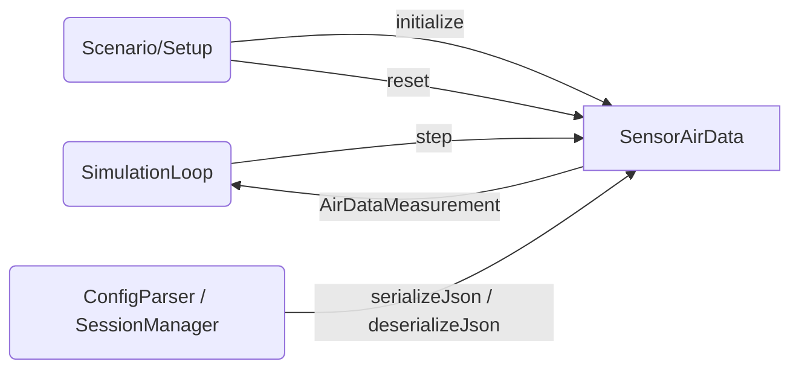

# Air Data System — Architecture and Interface Design

This document is the design authority for `SensorAirData` within the `liteaerosim::sensor`
namespace. It specifies the pitot-static air data computer class, all data structures, the
serialization contract, proto message definitions, and the full set of required tests that
drive TDD implementation.

`SensorAirData` derives from `liteaerosim::DynamicElement`. The lifecycle contract, NVI
pattern, and base class requirements are defined in
[`docs/architecture/dynamic_element.md`](dynamic_element.md). Sensor-specific conventions
(serialization, RNG, naming, test requirements) are in
[`docs/architecture/sensor.md`](sensor.md).

---

## Scope

`SensorAirData` models the pitot-static air data computer at the physical transducer level.
It contains two internal virtual transducers (differential pressure and absolute pressure),
each with additive Gaussian noise and a first-order Tustin-discretized lag. It derives IAS,
CAS, EAS, TAS, Mach, barometric altitude, and OAT from the noisy, lagged transducer
readings.

The static pressure channel additionally models the fuselage crossflow pressure error using
the 2D potential flow distribution around an infinite circular cylinder. Two static ports
symmetric about the body XZ plane are connected by a pneumatic crosslink; the transducer
reads their arithmetic average. This cancels the antisymmetric β component of the port
error and partially mitigates it depending on port location. See
[`docs/algorithms/air_data.md`](../../algorithms/air_data.md) for the full derivation.

`SensorAirData` lives in the Domain Layer. It has no I/O, no unit conversions, and no
display logic.

---

## Use Case Decomposition

| ID | Use Case | Primary Actor | Description |
| --- | --- | --- | --- |
| UC-AD1 | Advance one timestep | SimulationLoop | Calls `SensorAirData::step(airspeed_body_mps, atm)` each simulation tick. Receives `AirDataMeasurement`. |
| UC-AD2 | Initialize from JSON config | Scenario / Setup | Calls `DynamicElement::initialize(config)` with a JSON object containing `AirDataConfig` fields. Sets time constant, noise parameters, and RNG seed. |
| UC-AD3 | Reset between scenario runs | Scenario / Setup | Calls `DynamicElement::reset()` to zero all filter states and re-seed the RNG, returning the sensor to its initial condition without re-reading config. |
| UC-AD4 | Serialize / deserialize transducer filter state | ConfigParser / SessionManager | Calls `serializeJson()` / `deserializeJson()` (or proto equivalents) to checkpoint and warm-start the sensor mid-flight without disruption to the output stream. |



---

## Data Structures

### `AirDataMeasurement`

Output struct returned by `SensorAirData::step()`. All quantities are derived from the noisy, lagged transducer readings.

```cpp
// include/sensor/SensorAirData.hpp
namespace liteaerosim::sensor {

struct AirDataMeasurement {
    float ias_mps;         // indicated airspeed: raw pitot-static indication, sea-level ISA density (m/s)
    float cas_mps;         // calibrated airspeed: IAS corrected for compressibility at sea-level ISA (m/s)
    float eas_mps;         // equivalent airspeed: airspeed that gives same dyn. pressure at sea-level ISA (m/s)
    float tas_mps;         // true airspeed: magnitude of wind-relative velocity vector at flight altitude (m/s)
    float mach_nd;         // Mach number: V_TAS / speed of sound at flight altitude (non-dimensional)
    float baro_altitude_m; // indicated barometric altitude: ISA-inverse of measured static pressure
                           // referenced to the current Kollsman setting P_Koll (m)
    float oat_k;           // outside air temperature: static ambient temperature with noise (K)
};

} // namespace liteaerosim::sensor
```

Field physical meanings:

| Field | Physical Meaning |
| --- | --- |
| `ias_mps` | Raw pitot-static airspeed computed via incompressible Bernoulli at sea-level ISA density $\rho_0$. Subject to compressibility error at $M > 0.3$. |
| `cas_mps` | IAS corrected for compressibility using sea-level ISA isentropic formula. Equals TAS at sea-level ISA. |
| `eas_mps` | Airspeed that would produce the same dynamic pressure $\tfrac{1}{2}\rho V^2$ at $\rho_0$ as the actual flight condition. Used in aerodynamic force calculations. |
| `tas_mps` | True wind-relative speed at flight density. Derived from ADC Mach times local speed of sound. |
| `mach_nd` | Pitot-static Mach number derived from $q_c^{meas}$ and $P_s^{meas}$ alone, without reference to an atmospheric model. |
| `baro_altitude_m` | Indicated barometric altitude: the ISA altitude at which the ISA pressure equals $P_s^{meas} / (P_{Koll}/P_0)$, i.e., the altitude using the current Kollsman setting as the sea-level pressure reference. Equals MSL altitude when $P_{Koll} = P_{sfc}$ (correctly set QNH), ignoring temperature deviations. |
| `oat_k` | Static (ambient) temperature reading with additive Gaussian noise. No lag, no TAT recovery factor correction. |

---

### `AirDataConfig`

Configuration struct. Supplied as a JSON object to `initialize()`. All fields default to zero (ideal, noiseless, lagless sensor).

```cpp
// include/sensor/SensorAirData.hpp
namespace liteaerosim::sensor {

struct AirDataConfig {
    float    differential_pressure_noise_pa  = 0.f;      // 1-sigma noise on qc transducer (Pa)
    float    static_pressure_noise_pa        = 0.f;      // 1-sigma noise on Ps transducer (Pa)
    float    differential_pressure_lag_tau_s = 0.f;      // 1st-order lag time constant, qc channel (s)
    float    static_pressure_lag_tau_s       = 0.f;      // 1st-order lag time constant, Ps channel (s)
    float    static_pressure_bias_pa         = 0.f;      // constant residual static port offset (Pa)
    float    static_port_angle_rad           = 0.f;      // port angle from fuselage waterline, positive up (rad)
                                                         // used in fuselage crossflow pressure error model
    float    oat_noise_k                     = 0.f;      // 1-sigma noise on OAT reading (K)
    float    initial_kollsman_pa             = 101325.f; // initial altimeter Kollsman (QNH) setting (Pa);
                                                         // default = ISA standard (reads standard pressure altitude)
    uint32_t seed                            = 0;        // RNG seed; 0 = non-deterministic (std::random_device)
    int      schema_version                  = 1;
};

} // namespace liteaerosim::sensor
```

When `seed == 0`, the implementation uses `std::random_device` to seed the `std::mt19937` engine, producing a non-deterministic sequence. Any nonzero seed produces a fully deterministic, reproducible sequence.

---

## `SensorAirData` Class

### Internal Transducer Model

`SensorAirData` contains three internal measurement channels. Each channel represents a physical transducer or readout at the signal level, not the aerodynamic level.

**Differential pressure channel** — models the pitot minus static port pressure transducer:

$$q_c^{true} \xrightarrow{+\,n_{qc}} q_c^{noisy} \xrightarrow{\text{Tustin lag}} q_c^{meas}$$

**Static pressure channel** — models the static port absolute pressure transducer, including the fuselage crossflow pressure error, a constant position error bias, and additive noise:

$$P_s^{true} \xrightarrow{+\,\Delta P_{geo}(\alpha,\beta)+\epsilon_{bias}+n_{Ps}} P_s^{noisy} \xrightarrow{\text{Tustin lag}} P_s^{meas}$$

$\Delta P_{geo}(\alpha,\beta)$ is the geometric pressure error from the two-port crosslinked fuselage model. The two ports are placed symmetrically about the body XZ plane at $\pm\phi_{port}$ from the fuselage waterline. The transducer reads their arithmetic average, which cancels the antisymmetric $\beta$ component and partially mitigates the symmetric $\alpha$ component. See [`docs/algorithms/air_data.md`](../../algorithms/air_data.md) for the derivation.

**OAT channel** — models the outside air temperature probe:

$$T_s \xrightarrow{+\,n_{OAT}} T_{OAT}^{meas}$$

No lag is applied to the OAT channel. Temperature changes on timescales much longer than the simulation timestep, and probe lag is negligible for the flight regimes of interest.

All three channels are computed every call to `step()`. The derived air data quantities (IAS, CAS, EAS, TAS, Mach, baro altitude, OAT) are computed from $q_c^{meas}$ and $P_s^{meas}$ using the algorithms in `docs/algorithms/air_data.md`.

---

### Step Interface

```cpp
AirDataMeasurement step(Eigen::Vector3f airspeed_body_mps,
                        const AtmosphericState& atm);
```

`airspeed_body_mps` is the wind-relative (airspeed) velocity vector expressed in the body frame. Its Euclidean norm equals the true airspeed $V_{TAS}$. All three components are used: the magnitude gives $q_c^{true}$, and the $v$ and $w$ components give $\sin\beta$ and $\sin\alpha$ respectively for the fuselage crossflow pressure error model.

`atm` supplies the ambient conditions at the aircraft's current position: static pressure, temperature, density, and speed of sound. These are obtained from the `Atmosphere` subsystem and passed in by the SimulationLoop; `SensorAirData` does not query the atmosphere directly.

The returned `AirDataMeasurement` contains all derived quantities computed from the noisy, lagged transducer outputs.

---

### Class Interface

```cpp
// include/sensor/SensorAirData.hpp
namespace liteaerosim::sensor {

class SensorAirData : public liteaerosim::DynamicElement {
public:
    explicit SensorAirData(const nlohmann::json& config);

    AirDataMeasurement step(Eigen::Vector3f airspeed_body_mps,
                            const AtmosphericState& atm);

    // Runtime Kollsman (QNH) update. Called by INS aiding (GPS or AGL altitude) when
    // an external geometric altitude source provides a corrected surface pressure estimate.
    // Takes effect immediately on the next call to step(). Serialized in JSON/proto state.
    void setKollsman(float pa);
    float kollsman_pa() const;

    void serializeProto(liteaerosim::AirDataStateProto& proto) const;
    void deserializeProto(const liteaerosim::AirDataStateProto& proto);

protected:
    void onInitialize(const nlohmann::json& config) override;
    void onReset() override;
    nlohmann::json onSerializeJson() const override;
    void onDeserializeJson(const nlohmann::json& state) override;

private:
    struct RngState;                // pimpl — hides mt19937 + normal_distribution internals
    AirDataConfig config_;
    float kollsman_pa_;             // current altimeter setting (QNH); initialized from config_.initial_kollsman_pa
    float qc_lag_state_;            // lag filter output at previous step, qc channel
    float qc_lag_prev_input_;       // noisy input to lag filter at previous step, qc channel
    float ps_lag_state_;            // lag filter output at previous step, Ps channel
    float ps_lag_prev_input_;       // noisy input to lag filter at previous step, Ps channel
    std::unique_ptr<RngState> rng_;
};

} // namespace liteaerosim::sensor
```

The `RngState` pimpl pattern follows the same convention as `Turbulence`: the destructor must be defined in the `.cpp` translation unit (not defaulted in the header) because `std::unique_ptr<RngState>` requires a complete type at the point of destruction.

---

## Serialization Contract

### JSON State Fields

`serializeJson()` produces a JSON object with the following fields. `deserializeJson()` restores all of them. After deserialization, the next call to `step()` produces output identical to what the original instance would have produced — the sensor warm-starts without discontinuity.

| JSON key | C++ member | Description |
| --- | --- | --- |
| `"schema_version"` | — | Integer; must equal 1. `deserializeJson()` throws `std::runtime_error` on mismatch. |
| `"qc_lag_state"` | `qc_lag_state_` | Last lag filter output for the differential pressure channel. |
| `"qc_lag_prev_input"` | `qc_lag_prev_input_` | Last noisy input to the qc lag filter. |
| `"ps_lag_state"` | `ps_lag_state_` | Last lag filter output for the static pressure channel. |
| `"ps_lag_prev_input"` | `ps_lag_prev_input_` | Last noisy input to the Ps lag filter. |
| `"rng_advance"` | `rng_.advance_count` | Number of variates drawn since the seed was set. Used to fast-forward a freshly seeded engine to the same state. |
| `"kollsman_pa"` | `kollsman_pa_` | Current Kollsman (QNH) setting at the time of serialization. Restored on deserialization so that the indicated altitude is continuous across a checkpoint. |

The RNG is serialized as a seed + advance count. On deserialization, the engine is re-seeded with the stored seed and then advanced by `rng_advance` draws. This is portable across platforms and proto-friendly (no raw engine bytes). The implementation must use a separate counting wrapper around the `mt19937` engine to track the advance count.

Schema version: **1**.

### Proto State

`serializeProto()` / `deserializeProto()` use `AirDataStateProto`. See the Proto Messages section for field definitions. Schema version check is performed in `deserializeProto()`; a mismatch throws `std::runtime_error`.

---

## Proto Messages

```proto
// proto/liteaerosim.proto

message AirDataConfig {
    int32  schema_version                  = 1;
    float  differential_pressure_noise_pa  = 2;
    float  static_pressure_noise_pa        = 3;
    float  differential_pressure_lag_tau_s = 4;
    float  static_pressure_lag_tau_s       = 5;
    float  static_pressure_bias_pa         = 6;
    float  oat_noise_k                     = 7;
    uint32 seed                            = 8;
    float  static_port_angle_rad           = 9;
    float  initial_kollsman_pa             = 10;
}

message AirDataStateProto {
    int32  schema_version    = 1;
    float  qc_lag_state      = 2;
    float  qc_lag_prev_input = 3;
    float  ps_lag_state      = 4;
    float  ps_lag_prev_input = 5;
    uint64 rng_advance       = 6;  // number of variate draws past the seed
    float  kollsman_pa       = 7;  // current altimeter setting (QNH) at checkpoint time
}
```

---

## Computational Cost

### Memory Footprint

| Component | Size |
| --- | --- |
| `AirDataConfig` | ~80 bytes |
| Filter states (qc + Ps Tustin, 2 × `std::array<float,2>`) | 16 bytes |
| `AirDataMeasurement` output struct | ~48 bytes |
| `RngState` pimpl (`std::mt19937` engine) | ~2.5 KB |
| **Total active state (excl. RNG)** | ~150 bytes |

### Operations per `step()` Call

| Sub-task | Approximate FLOPs |
| --- | --- |
| Fuselage crossflow model (atan2 + 2×cos + multiply) | ~25 |
| Pitot-static chain (sqrt + pow for impact pressure, IAS→CAS→EAS→TAS→Mach) | ~35 |
| Barometric altitude inversion (pow, Kollsman-corrected) | ~15 |
| OAT computation | ~5 |
| Two first-order Tustin filter steps (qc lag + Ps lag) | ~8 |
| 3 Gaussian noise draws (qc, Ps, OAT) | dominant (~5–15 ns each) |
| **Total non-noise FLOPs** | **~90** |

### Dominant Cost and Scaling

Gaussian noise generation dominates wall-clock time. Each `std::normal_distribution<float>`
draw via `std::mt19937` costs approximately 5–15 ns on a modern x86 core; three draws per
step cost ~15–45 ns. At a 100 Hz simulation rate (10 ms step budget) this is under 0.01%
of available single-core budget.

Every step executes the same code path regardless of input values — no data-dependent
branching or scaling.

---

## Test Requirements

All tests reside in `test/SensorAirData_test.cpp`, test class `SensorAirDataTest`. All tests use zero-noise, zero-lag config unless the test specifically exercises noise or lag. ISA conditions are provided via a correctly constructed `AtmosphericState`.

| ID | Test Name | Description |
| --- | --- | --- |
| T1 | `SeaLevelISA_ZeroNoise_ZeroLag_TAS20_AllAirspeedsEqual` | At sea-level ISA, zero noise, zero lag, TAS = 20 m/s: IAS, CAS, EAS, TAS all within 0.1 m/s of 20 m/s. |
| T2 | `Altitude3000m_ZeroNoise_ZeroLag_AllAirspeedsLessThanTAS` | At 3000 m ISA, zero noise, zero lag, TAS = 40 m/s: IAS < TAS, CAS < TAS, EAS < TAS. |
| T3 | `BaroAltitude_ISA_3000m_WithinTenMeters` | `baro_altitude_m` matches geometric altitude within 10 m at ISA conditions, 3000 m. |
| T4 | `BaroAltitude_WarmDay_ReadsHighRelativeToGeometric` | On an ISA+20 K day at 3000 m geometric, `baro_altitude_m` differs from geometric altitude in the direction consistent with the warm-day altimeter error (altimeter reads low on a warm day — geometric altitude > baro altitude). |
| T5 | `DifferentialPressureNoise_IASStddev_MatchesPropagation` | With $\sigma_{qc} > 0$, zero lag, TAS = 30 m/s, N = 1000 steps: sample standard deviation of `ias_mps` is within 20% of the analytically expected value $\sigma_{V_{IAS}} = \sigma_{qc} / (\rho_0 V_{IAS})$. |
| T6 | `StaticPressureNoise_BaroAltStddev_MatchesPropagation` | With $\sigma_{Ps} > 0$, zero lag, N = 1000 steps: sample standard deviation of `baro_altitude_m` is within 20% of the analytically expected value. |
| T7 | `Lag_ReducesVariance` | With nonzero lag $\tau > 0$ and nonzero noise: sample variance of lagged output over N = 1000 steps is less than sample variance computed without lag (same seed). |
| T8 | `ZeroNoise_ZeroLag_Deterministic_MatchesNoiselessDerived` | Zero noise, zero lag: output is deterministic; `ias_mps`, `tas_mps`, `mach_nd`, `baro_altitude_m`, `oat_k` match values computed directly from the noiseless physics formulas within floating-point tolerance. |
| T9 | `Reset_ZeroesFilterState` | After `reset()`, first `step()` output equals the zero-lag noiseless value within floating-point tolerance — confirms lag states are initialized to steady-state (not zero). |
| T10 | `IdenticalSeeds_IdenticalOutputs` | Two `SensorAirData` instances with the same nonzero seed, same config, same input sequence: every field of `AirDataMeasurement` is bitwise-identical across instances for N = 100 steps. |
| T11 | `JsonRoundTrip_PreservesFilterState` | Serialize after N = 50 steps; deserialize into a new instance; verify the next `step()` output is identical between original and restored instances for all fields. |
| T12 | `ProtoRoundTrip_PreservesFilterState` | Same as T11 using `serializeProto()` / `deserializeProto()`. |
| T13 | `SchemaVersionMismatch_Throws` | `deserializeJson()` with `schema_version != 1` throws `std::runtime_error`. |
| T14 | `FuselagePressureError_KnownAlpha_MatchesFormula` | Zero noise, zero lag, zero β, nonzero `static_port_angle_rad`. At known α, the `baro_altitude_m` offset from the ideal (zero-error) value matches the formula $\Delta P_{geo} / (\rho_0 g_0)$ within 0.1%. |
| T15 | `CrosslinkedPorts_BetaCancelled_AtThirtyDegrees` | With `static_port_angle_rad = π/6` (30°), zero α, nonzero β: `baro_altitude_m` is within 1 m of the zero-error value regardless of β magnitude (up to 15°), confirming β cancellation at the 30° port location. |
| T16 | `Kollsman_CorrectQNH_CancelsNonStandardPressure` | AtmosphericState with non-standard surface pressure ($\Delta P_{sfc} = +500\,\text{Pa}$), `initial_kollsman_pa = 101825 Pa` (correctly set): `baro_altitude_m` at 3000 m geometric altitude matches the ISA baro altitude at 3000 m within 10 m. |
| T17 | `Kollsman_StaleQNH_ProducesExpectedError` | AtmosphericState with $\Delta P_{sfc} = +500\,\text{Pa}$, `initial_kollsman_pa = 101325 Pa` (stale, ISA standard): `baro_altitude_m` underreads by approximately $8.23 \times 5 = 41\,\text{m}$ (within 2 m). |
| T18 | `SetKollsman_UpdatesNextStep` | After N = 10 steps with stale Kollsman, call `setKollsman(101825.f)`; the next `step()` output has `baro_altitude_m` shifted by approximately +41 m relative to the previous reading (within 2 m). |
| T19 | `JsonRoundTrip_PreservesKollsman` | After calling `setKollsman()` and running N = 10 steps, serialize; deserialize into a new instance; `kollsman_pa()` returns the same value and `baro_altitude_m` output is identical to what the original instance would have produced. |
