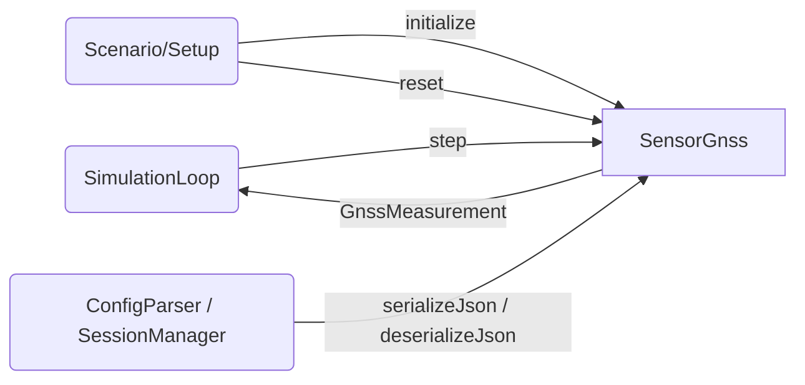

# GNSS Sensor — Architecture and Interface Design

This document is the design authority for `SensorGnss` within the `liteaerosim::sensor`
namespace. It specifies the GNSS receiver sensor class, all data structures, the
serialization contract, proto message definitions, and the full set of required tests that
drive TDD implementation.

`SensorGnss` derives from `liteaerosim::DynamicElement`. The lifecycle contract, NVI
pattern, and base class requirements are defined in
[`docs/architecture/dynamic_element.md`](dynamic_element.md). Sensor-specific conventions
(serialization, RNG, naming, test requirements) are in
[`docs/architecture/sensor.md`](sensor.md).

---

## Scope

`SensorGnss` models a GNSS receiver at the measurement output level. Its output struct
`GnssMeasurement` mirrors the fields reported by a standard NMEA 0183 receiver (GGA, RMC,
VTG, and GSA sentences). It produces noisy position, NED velocity, speed and course over
ground, MSL altitude, and DOP values from the true kinematic state.

Independent Gaussian noise is applied to horizontal position (isotropic in North/East),
vertical position (altitude), and each NED velocity component at the configured GNSS update
rate. Speed over ground and course over ground are derived from the noisy NED velocity and
carry no independent noise. MSL altitude is derived from WGS84 altitude using a fixed
geoid separation supplied in config.

`SensorGnss` operates at a lower rate than the simulation loop. On steps that fall between
GNSS updates, the sensor returns the most recent measurement unchanged. On steps that cross
a GNSS update boundary, the sensor draws new noise samples and recomputes the output. The
simulation timestep `dt_s` and the GNSS update rate `update_rate_hz` are both configuration
parameters.

No multipath, ionospheric delay, or signal-outage modeling is included. The fix type is
always `Fix3D`. Satellite count and DOP values are fixed config parameters that appear
verbatim in the output.

`SensorGnss` lives in the Domain Layer. It has no I/O, no unit conversions, and no display
logic.

---

## Use Case Decomposition

| ID | Use Case | Primary Actor | Description |
| --- | --- | --- | --- |
| UC-GNSS1 | Advance one timestep | SimulationLoop | Calls `SensorGnss::step(true_position_llh, true_velocity_ned_mps)` each simulation tick. Returns `GnssMeasurement`. |
| UC-GNSS2 | Initialize from JSON config | Scenario / Setup | Calls `DynamicElement::initialize(config)` with a JSON object containing `GnssConfig` fields. Sets noise parameters, update rate, and RNG seed. |
| UC-GNSS3 | Reset between scenario runs | Scenario / Setup | Calls `DynamicElement::reset()` to zero the update accumulator, re-seed the RNG, and clear the stored measurement. |
| UC-GNSS4 | Serialize / deserialize receiver state | ConfigParser / SessionManager | Calls `serializeJson()` / `deserializeJson()` (or proto equivalents) to checkpoint and warm-start the sensor, preserving the stored measurement and the accumulated time since the last GNSS update. |



---

## Data Structures

### `GnssFixType`

```cpp
// include/sensor/SensorGnss.hpp
namespace liteaerosim::sensor {

enum class GnssFixType : int32_t {
    NoFix = 0,
    Fix2D = 1,
    Fix3D = 2,
};

} // namespace liteaerosim::sensor
```

The current model always outputs `Fix3D`. The enum is included in the interface for
extensibility.

---

### `GnssMeasurement`

Output struct returned by `SensorGnss::step()`. Fields correspond to the NMEA 0183
sentences GGA (position, altitude, DOP, fix), RMC/VTG (SOG, COG), and GSA (PDOP, HDOP,
VDOP).

```cpp
// include/sensor/SensorGnss.hpp
namespace liteaerosim::sensor {

struct GnssMeasurement {
    // --- Position (GGA) ---
    double          latitude_rad;           // WGS84 geodetic latitude with noise (rad)
    double          longitude_rad;          // WGS84 geodetic longitude with noise (rad)
    float           altitude_wgs84_m;       // WGS84 ellipsoidal altitude with noise (m)
    float           altitude_msl_m;         // MSL (orthometric) altitude = altitude_wgs84_m − geoid_separation_m (m)
    float           geoid_separation_m;     // geoid undulation N; WGS84 = MSL + N (m); from config, not computed

    // --- Velocity (RMC / VTG) ---
    Eigen::Vector3f velocity_ned_mps;       // NED velocity with noise: (north, east, down) (m/s)
    float           speed_over_ground_mps;  // horizontal speed magnitude √(Vn²+Ve²) (m/s)
    float           course_over_ground_rad; // true bearing of motion = atan2(Ve, Vn) ∈ [0, 2π) (rad); 0 when SOG < 0.1 m/s

    // --- Quality / Status (GGA / GSA) ---
    float           pdop_nd;                // position dilution of precision (non-dimensional); from config
    float           hdop_nd;                // horizontal dilution of precision (non-dimensional); from config
    float           vdop_nd;                // vertical dilution of precision (non-dimensional); from config
    uint32_t        satellites_tracked;     // number of satellites tracked; from config
    GnssFixType     fix_type;               // GNSS fix quality indicator

    // --- Timing ---
    double          timestamp_s;            // simulation time of the GNSS update that produced this measurement (s)
};

} // namespace liteaerosim::sensor
```

`latitude_rad`, `longitude_rad`, and `timestamp_s` use `double`. Single-precision
floating point cannot resolve meter-level position changes at large absolute coordinates
(1×10⁻⁷ rad ≈ 11 m at the equator; single precision has ~7 significant digits).
`timestamp_s` uses `double` because long simulation runs accumulate enough seconds to
lose millisecond precision in single precision (2²⁴ × 1 s ≈ 4.6 h).

Field physical meanings:

| Field | NMEA sentence | Physical Meaning |
| --- | --- | --- |
| `latitude_rad` | GGA, RMC | WGS84 geodetic latitude with Gaussian noise in the North direction, converted to radians via the WGS84 meridional radius $R_N$. |
| `longitude_rad` | GGA, RMC | WGS84 geodetic longitude with Gaussian noise in the East direction, converted to radians via the prime vertical radius $R_E \cos\phi$. |
| `altitude_wgs84_m` | — | WGS84 ellipsoidal altitude with independent Gaussian noise. Not reported directly in NMEA; retained as the simulation-native altitude. |
| `altitude_msl_m` | GGA | MSL (orthometric) altitude = `altitude_wgs84_m − geoid_separation_m`. The noise on this field equals the noise on `altitude_wgs84_m`. |
| `geoid_separation_m` | GGA | Fixed geoid undulation from config; passed through verbatim. |
| `velocity_ned_mps` | — | NED velocity with independent Gaussian noise on each component. |
| `speed_over_ground_mps` | RMC, VTG | Horizontal speed $\sqrt{V_N^2 + V_E^2}$ derived from noisy `velocity_ned_mps`. |
| `course_over_ground_rad` | RMC, VTG | True bearing of motion $\text{atan2}(V_E, V_N)$ mapped to $[0, 2\pi)$, derived from noisy `velocity_ned_mps`. Set to 0 when `speed_over_ground_mps < 0.1 m/s`. |
| `pdop_nd` | GSA | Fixed PDOP from config; not computed from satellite geometry. |
| `hdop_nd` | GSA | Fixed HDOP from config; not computed from satellite geometry. |
| `vdop_nd` | GSA | Fixed VDOP from config; not computed from satellite geometry. |
| `satellites_tracked` | GGA | Fixed satellite count from config; not simulated. |
| `fix_type` | GGA | Always `GnssFixType::Fix3D` in the current model. |
| `timestamp_s` | GGA, RMC | Simulation time at the GNSS update boundary that produced this measurement. Held constant between updates. |

---

### `GnssConfig`

Configuration struct. Supplied as a JSON object to `initialize()`. All noise fields
default to zero (ideal, noiseless sensor). Default update rate is 10 Hz. Default
simulation timestep is 0.01 s.

```cpp
// include/sensor/SensorGnss.hpp
namespace liteaerosim::sensor {

struct GnssConfig {
    float    horizontal_position_noise_m = 0.f;   // 1-sigma noise in North and East (m); isotropic
    float    vertical_position_noise_m   = 0.f;   // 1-sigma noise on WGS84 altitude (m)
    float    velocity_noise_mps          = 0.f;   // 1-sigma noise on each NED velocity component (m/s)
    float    update_rate_hz              = 10.f;  // GNSS output rate (Hz); must be ≤ 1/dt_s
    float    dt_s                        = 0.01f; // simulation timestep (s)
    float    geoid_separation_m          = 0.f;   // WGS84 ellipsoidal height − MSL height (m); constant for operating area
    float    pdop_nd                     = 2.0f;  // fixed PDOP reported in output (non-dimensional)
    float    hdop_nd                     = 1.5f;  // fixed HDOP reported in output (non-dimensional)
    float    vdop_nd                     = 1.5f;  // fixed VDOP reported in output (non-dimensional)
    uint32_t satellites_tracked          = 12;    // fixed satellite count reported in output
    uint32_t seed                        = 0;     // RNG seed; 0 = non-deterministic (std::random_device)
    int      schema_version              = 1;
};

} // namespace liteaerosim::sensor
```

When `seed == 0`, the implementation uses `std::random_device` to seed the `std::mt19937`
engine, producing a non-deterministic sequence. The actual seed used is stored at
initialization time so that `serializeJson()` can reproduce the sequence. Any nonzero seed
produces a fully deterministic, reproducible sequence.

---

## `SensorGnss` Class

### Noise and Update Rate Model

`SensorGnss` produces one new measurement per GNSS update interval. The update interval is
$T_{GNSS} = 1 / \mathit{update\_rate\_hz}$. An internal accumulator tracks the time elapsed
since the last GNSS update. On each call to `step()`, the accumulator advances by `dt_s`.
When the accumulator reaches or exceeds $T_{GNSS}$, the sensor draws new noise samples,
applies them to the true input, stores the result as the current measurement, and resets
the accumulator by subtracting $T_{GNSS}$ (preserving fractional time, not discarding it).
On steps that do not trigger an update, the stored measurement is returned unchanged.

**Position noise** is applied in the local tangent plane at the true position, then
converted to WGS84 angular coordinates using the WGS84 principal radii of curvature:

$$\phi^{meas} = \phi^{true} + \frac{n_N}{R_N(\phi^{true})}$$

$$\lambda^{meas} = \lambda^{true} + \frac{n_E}{R_E(\phi^{true})\cos\phi^{true}}$$

$$h^{meas} = h^{true} + n_U$$

where $n_N, n_E \sim \mathcal{N}(0,\,\sigma_h^2)$ are independent horizontal draws and
$n_U \sim \mathcal{N}(0,\,\sigma_v^2)$ is the vertical draw. The WGS84 radii are:

$$R_N = \frac{a(1-e^2)}{(1 - e^2\sin^2\phi)^{3/2}}$$

$$R_E = \frac{a}{\sqrt{1 - e^2\sin^2\phi}}$$

with $a = 6\,378\,137$ m and $e^2 = 6.6943799901 \times 10^{-3}$.

**Velocity noise** is applied directly to each NED component:

$$\mathbf{V}_{NED}^{meas} = \mathbf{V}_{NED}^{true} + \mathbf{n}_V, \quad n_{V_N},\, n_{V_E},\, n_{V_D} \sim \mathcal{N}(0,\,\sigma_V^2)$$

**Derived fields** are computed from the noisy outputs after noise application and carry no
independent noise:

$$\text{SOG} = \sqrt{V_N^{meas\,2} + V_E^{meas\,2}}$$

$$\text{COG} = \begin{cases} \text{atan2}(V_E^{meas},\, V_N^{meas}) \bmod 2\pi & \text{SOG} \geq 0.1\,\text{m/s} \\ 0 & \text{otherwise} \end{cases}$$

$$h_{MSL}^{meas} = h_{WGS84}^{meas} - N_{geoid}$$

where $N_{geoid}$ is `geoid_separation_m` from config (constant for the operating area).

> **Note:** Six independent draws are made per GNSS update in the order $n_N$, $n_E$,
> $n_U$, $n_{V_N}$, $n_{V_E}$, $n_{V_D}$. The advance count increments by 6 per
> GNSS update, regardless of simulation rate.

---

### Step Interface

```cpp
GnssMeasurement step(double                 time_s,
                     const Eigen::Vector3d& true_position_llh,
                     const Eigen::Vector3f& true_velocity_ned_mps);
```

`time_s` is the current simulation time in seconds. It is stored in
`GnssMeasurement::timestamp_s` at each GNSS update boundary and held constant between
updates.

`true_position_llh` is the true WGS84 position as (latitude\_rad, longitude\_rad,
altitude\_wgs84\_m). `double` is required for the position vector because geodetic
coordinates require double precision.

`true_velocity_ned_mps` is the true NED velocity vector (north, east, down) in m/s.

The returned `GnssMeasurement` is the current stored measurement, which may or may not have
been updated on this call depending on the accumulated update timer.

---

### Class Interface

```cpp
// include/sensor/SensorGnss.hpp
namespace liteaerosim::sensor {

class SensorGnss : public liteaerosim::DynamicElement {
public:
    explicit SensorGnss(const nlohmann::json& config);

    GnssMeasurement step(double                 time_s,
                         const Eigen::Vector3d& true_position_llh,
                         const Eigen::Vector3f& true_velocity_ned_mps);

    void serializeProto(liteaerosim::GnssStateProto& proto) const;
    void deserializeProto(const liteaerosim::GnssStateProto& proto);

protected:
    void onInitialize(const nlohmann::json& config) override;
    void onReset() override;
    nlohmann::json onSerializeJson() const override;
    void onDeserializeJson(const nlohmann::json& state) override;

private:
    struct RngState;                      // pimpl — hides mt19937 + normal_distribution internals
    GnssConfig      config_;
    float           time_since_update_s_; // accumulated sim time since last GNSS update
    GnssMeasurement last_measurement_;    // most recent GNSS measurement; returned between updates
    std::unique_ptr<RngState> rng_;
};

} // namespace liteaerosim::sensor
```

The `RngState` pimpl pattern follows the same convention as `SensorAirData` and
`Turbulence`: the destructor must be defined in the `.cpp` translation unit (not defaulted
in the header) because `std::unique_ptr<RngState>` requires a complete type at the point
of destruction.

On `reset()`, `time_since_update_s_` is zeroed and `last_measurement_` is cleared to an
all-zero state. The RNG is re-seeded.

---

## Serialization Contract

### JSON State Fields

`serializeJson()` produces a JSON object with the following fields. `deserializeJson()`
restores all of them. After deserialization, the next call to `step()` produces output
identical to what the original instance would have produced.

| JSON key | C++ member | Description |
| --- | --- | --- |
| `"schema_version"` | — | Integer; must equal 1. `deserializeJson()` throws `std::runtime_error` on mismatch. |
| `"time_since_update_s"` | `time_since_update_s_` | Accumulated simulation time since the last GNSS output update. |
| `"last_timestamp_s"` | `last_measurement_.timestamp_s` | Simulation time of the last GNSS update (double). |
| `"last_latitude_rad"` | `last_measurement_.latitude_rad` | Last output latitude (double). |
| `"last_longitude_rad"` | `last_measurement_.longitude_rad` | Last output longitude (double). |
| `"last_altitude_wgs84_m"` | `last_measurement_.altitude_wgs84_m` | Last output WGS84 altitude. |
| `"last_altitude_msl_m"` | `last_measurement_.altitude_msl_m` | Last output MSL altitude. |
| `"last_velocity_ned_mps"` | `last_measurement_.velocity_ned_mps` | Last output NED velocity; stored as a 3-element JSON array. |
| `"last_speed_over_ground_mps"` | `last_measurement_.speed_over_ground_mps` | Last output SOG. |
| `"last_course_over_ground_rad"` | `last_measurement_.course_over_ground_rad` | Last output COG. |
| `"rng_advance"` | `rng_.advance_count` | Number of variates drawn since the seed was set. Used to fast-forward a freshly seeded engine to the same state. |

The RNG is serialized as a seed + advance count per the sensor subsystem convention
(see [`docs/architecture/sensor.md`](sensor.md) § RNG Serialization Convention).
On deserialization, the engine is re-seeded with the stored seed and advanced by
`rng_advance` draws. The stored seed is included in the serialized state (not shown
separately — carried in config, which is not re-serialized; the seed actually used must be
saved in `RngState` when `std::random_device` is used so that it is available to
`serializeJson()`).

Schema version: **1**.

### Proto State

`serializeProto()` / `deserializeProto()` use `GnssStateProto`. See the Proto Messages
section. Schema version check is performed in `deserializeProto()`; a mismatch throws
`std::runtime_error`.

---

## Proto Messages

```proto
// proto/liteaerosim.proto

message GnssConfig {
    int32  schema_version              = 1;
    float  horizontal_position_noise_m = 2;
    float  vertical_position_noise_m   = 3;
    float  velocity_noise_mps          = 4;
    float  update_rate_hz              = 5;
    float  dt_s                        = 6;
    float  geoid_separation_m          = 7;
    float  pdop_nd                     = 8;
    float  hdop_nd                     = 9;
    float  vdop_nd                     = 10;
    uint32 satellites_tracked          = 11;
    uint32 seed                        = 12;
}

message GnssStateProto {
    int32  schema_version              = 1;
    float  time_since_update_s         = 2;
    double last_timestamp_s            = 3;
    double last_latitude_rad           = 4;
    double last_longitude_rad          = 5;
    float  last_altitude_wgs84_m       = 6;
    float  last_altitude_msl_m         = 7;
    float  last_vel_north_mps          = 8;
    float  last_vel_east_mps           = 9;
    float  last_vel_down_mps           = 10;
    float  last_speed_over_ground_mps  = 11;
    float  last_course_over_ground_rad = 12;
    uint64 rng_advance                 = 13;  // number of variate draws past the seed
}
```

---

## Computational Cost

### Memory Footprint

| Component | Size |
| --- | --- |
| `GnssConfig` | ~56 bytes |
| `GnssMeasurement` (last stored output) | ~80 bytes |
| `time_since_update_s_` | 4 bytes |
| `RngState` pimpl (`std::mt19937` engine) | ~2.5 KB |
| **Total active state (excl. RNG)** | ~140 bytes |

### Operations per `step()` Call

The step cost depends on whether the call crosses a GNSS update boundary.

**Between updates (most steps):**

| Sub-task | Approximate FLOPs |
| --- | --- |
| Accumulate `time_since_update_s_` | 1 |
| Return stored `GnssMeasurement` (copy) | trivial |
| **Total** | **~1** |

**At a GNSS update boundary (every 1/`update_rate_hz` seconds):**

| Sub-task | Approximate FLOPs |
| --- | --- |
| WGS84 radii $R_N$, $R_E$ (sin², sqrt) | ~20 |
| Position noise conversion (2 divides) | ~2 |
| MSL altitude derivation (1 subtract) | ~1 |
| SOG/COG derivation (sqrt + atan2) | ~15 |
| Timestamp store | trivial |
| 6 Gaussian noise draws ($n_N$, $n_E$, $n_U$, $n_{VN}$, $n_{VE}$, $n_{VD}$) | dominant |
| **Total non-noise FLOPs at update** | **~40** |

**Amortized per simulation step** at `dt_s = 0.01 s`, `update_rate_hz = 10 Hz`
(update every 10 steps): ~4 FLOPs + 0.6 draws per step.

### Dominant Cost and Scaling

Between GNSS updates the sensor is essentially free. The update-boundary cost is dominated
by 6 noise draws (~30–90 ns). At a 100 Hz simulation rate (10 ms step budget) the
amortized cost is under 0.01% of available single-core budget. No data-dependent or
input-size scaling.

---

## Test Requirements

All tests reside in `test/SensorGnss_test.cpp`, test class `SensorGnssTest`. All tests use
zero-noise config unless the test specifically exercises noise. The WGS84 ellipsoid
constants from `WGS84_Datum` are used to construct expected values.

| ID | Test Name | Description |
| --- | --- | --- |
| T1 | `ZeroNoise_OutputMatchesTrueInput` | Zero noise: `latitude_rad`, `longitude_rad`, `altitude_wgs84_m`, and `velocity_ned_mps` match the true input to floating-point tolerance on every GNSS update step. |
| T2 | `HorizontalNoise_SampleStddev_MatchesConfig` | With $\sigma_h > 0$, N = 1000 GNSS updates: sample standard deviation of North position error in meters ($(\phi^{meas} - \phi^{true}) \cdot R_N$) is within 20% of $\sigma_h$. Same for East. |
| T3 | `VerticalNoise_SampleStddev_MatchesConfig` | With $\sigma_v > 0$, N = 1000 updates: sample std of `altitude_wgs84_m` error is within 20% of $\sigma_v$. `altitude_msl_m` error has identical statistics. |
| T4 | `VelocityNoise_SampleStddev_MatchesConfig` | With $\sigma_V > 0$, N = 1000 updates: sample std of each NED velocity component error is within 20% of $\sigma_V$. |
| T5 | `UpdateRate_OutputHoldsBetweenGnssUpdates` | `dt_s = 0.005 s`, `update_rate_hz = 10 Hz` (update every 20 steps): consecutive `step()` calls within a GNSS update interval return identical `latitude_rad` and `timestamp_s`; output changes exactly at the update boundary. |
| T6 | `FixType_AlwaysFix3D` | `fix_type == GnssFixType::Fix3D` on every step after initialization. |
| T7 | `DopFields_MatchConfig` | `pdop_nd`, `hdop_nd`, and `vdop_nd` output fields equal the corresponding config values at every step. |
| T8 | `SatellitesTracked_MatchesConfig` | `satellites_tracked` output field equals `config.satellites_tracked` at every step. |
| T9 | `AltitudeMsl_EqualsWgs84MinusGeoidSeparation` | With `geoid_separation_m = 35.f` and zero noise: `altitude_msl_m == altitude_wgs84_m - 35.f` within `float` precision at every update. |
| T10 | `SpeedOverGround_MatchesHorizontalSpeed` | Zero noise, true velocity `{3, 4, −1}` m/s: `speed_over_ground_mps == 5.0 m/s` within 0.001 m/s; `course_over_ground_rad == atan2(4, 3)` within 1×10⁻⁵ rad. |
| T11 | `CourseOverGround_ZeroWhenSpeedBelowThreshold` | Zero noise, true velocity `{0.05, 0.05, 0}` m/s (SOG ≈ 0.07 m/s < 0.1 m/s): `course_over_ground_rad == 0`. |
| T12 | `Timestamp_UpdatesAtGnssBoundary` | `dt_s = 0.01 s`, `update_rate_hz = 5 Hz`: `timestamp_s` advances by exactly 0.2 s between consecutive GNSS updates. |
| T13 | `Reset_ReturnsToInitialCondition` | After N = 50 steps, `reset()` followed by the same input sequence produces output identical to a freshly initialized instance for all `GnssMeasurement` fields. |
| T14 | `IdenticalSeeds_IdenticalOutputs` | Two `SensorGnss` instances with the same nonzero seed, same config, same input sequence: every field of `GnssMeasurement` is bitwise-identical for N = 100 steps. |
| T15 | `JsonRoundTrip_PreservesLastMeasurementAndUpdateTimer` | Serialize after N = 50 steps; deserialize into a new instance; the next `step()` output is identical between the original and restored instances for all fields. |
| T16 | `ProtoRoundTrip_PreservesLastMeasurementAndUpdateTimer` | Same as T15 using `serializeProto()` / `deserializeProto()`. |
| T17 | `SchemaVersionMismatch_Throws` | `deserializeJson()` with `schema_version != 1` throws `std::runtime_error`. |
