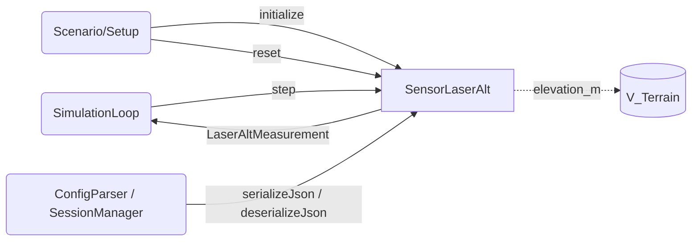

# Laser Altimeter — Architecture and Interface Design

This document is the design authority for `SensorLaserAlt` within the `liteaerosim::sensor`
namespace. It specifies the laser altimeter sensor class, all data structures, the
serialization contract, proto message definitions, and the full set of required tests that
drive TDD implementation.

`SensorLaserAlt` derives from `liteaerosim::DynamicElement`. The lifecycle contract, NVI
pattern, and base class requirements are defined in
[`docs/architecture/dynamic_element.md`](dynamic_element.md). Sensor-specific conventions
(serialization, RNG, naming, test requirements) are in
[`docs/architecture/sensor.md`](sensor.md).

---

## Scope

`SensorLaserAlt` models a single-beam laser altimeter at the measurement output level. It
emits a laser pulse along a configurable beam axis (expressed as a unit vector in the body
frame, defaulting to nadir) and computes the slant range to the terrain surface using a
ray–triangle intersection against the terrain geometry via `V_Terrain::rayIntersect()`.
Gaussian noise is added to the slant range at each sensor update. The output is declared
invalid when the true range falls outside the configured minimum or maximum detectable
range, or when the beam does not intersect the terrain (beam pointing upward, level, or no
geometry within range).

`SensorLaserAlt` operates at a configurable update rate, which may be lower than the
simulation loop rate. Between updates the sensor holds its last output.

No beam-divergence spreading, surface-reflectivity modeling, atmospheric attenuation, or
multi-echo processing is included. Sensor attitude bias (boresight misalignment) is not
modeled; pointing error is expected to be included in the range noise budget.

`SensorLaserAlt` lives in the Domain Layer. It has no I/O, no unit conversions, and no
display logic.

---

## Use Case Decomposition

| ID | Use Case | Primary Actor | Description |
| --- | --- | --- | --- |
| UC-LA1 | Advance one timestep | SimulationLoop | Calls `SensorLaserAlt::step(true_position_llh, q_body_to_ned, terrain)` each simulation tick. Returns `LaserAltMeasurement`. |
| UC-LA2 | Initialize from JSON config | Scenario / Setup | Calls `DynamicElement::initialize(config)` with a JSON object containing `LaserAltConfig` fields. Sets noise parameters, range limits, beam direction, update rate, and RNG seed. |
| UC-LA3 | Reset between scenario runs | Scenario / Setup | Calls `DynamicElement::reset()` to zero the update accumulator, re-seed the RNG, and clear the stored measurement. |
| UC-LA4 | Serialize / deserialize sensor state | ConfigParser / SessionManager | Calls `serializeJson()` / `deserializeJson()` (or proto equivalents) to checkpoint and warm-start the sensor, preserving the stored measurement and the accumulated time since the last update. |



---

## Data Structures

### `LaserAltMeasurement`

Output struct returned by `SensorLaserAlt::step()`.

```cpp
// include/sensor/SensorLaserAlt.hpp
namespace liteaerosim::sensor {

struct LaserAltMeasurement {
    float range_m;        // slant range from aircraft to terrain along the beam axis, with noise (m)
    float altitude_agl_m; // vertical height above terrain at the beam–ground intersection: range_m * beam_D_ned (m)
    bool  is_valid;       // false if true range is outside [min_range_m, max_range_m] or beam does not intersect terrain
};

} // namespace liteaerosim::sensor
```

`range_m` and `altitude_agl_m` are undefined when `is_valid == false`. Callers must check
`is_valid` before using the range fields.

`altitude_agl_m` equals `range_m` for a nadir-pointing beam. For a tilted beam it equals
`range_m` times the cosine of the beam's off-nadir angle ($= \mathbf{\hat{b}}_{NED} \cdot
\hat{z}_{down}$, i.e., the downward NED component of the beam unit vector).

| Field | Physical Meaning |
| --- | --- |
| `range_m` | Slant distance from aircraft to the beam–terrain intersection point, with additive Gaussian noise. Measured along the beam axis. |
| `altitude_agl_m` | Vertical distance from the aircraft to the terrain surface at the intersection point: $\mathit{range\_m} \cdot b_{D}^{NED}$ where $b_{D}^{NED}$ is the downward NED component of the beam unit vector. |
| `is_valid` | `true` when the true (noiseless) range is within $[\mathit{min\_range\_m},\, \mathit{max\_range\_m}]$ and the beam intersects the terrain. Noise is still applied to the range when `is_valid` is `true`. |

---

### `LaserAltConfig`

Configuration struct. Supplied as a JSON object to `initialize()`. All noise fields
default to zero (ideal, noiseless sensor). The default beam direction is nadir
(`{0, 0, 1}` in the body frame, where body Z points down in the standard aerospace
convention).

```cpp
// include/sensor/SensorLaserAlt.hpp
namespace liteaerosim::sensor {

struct LaserAltConfig {
    float           range_noise_m          = 0.f;              // 1-sigma range noise (m)
    float           min_range_m            = 0.3f;             // minimum detectable slant range (m)
    float           max_range_m            = 120.f;            // maximum detectable slant range (m)
    Eigen::Vector3f beam_direction_body    = {0.f, 0.f, 1.f}; // beam unit vector in body frame; {0,0,1} = nadir
    float           update_rate_hz         = 20.f;             // sensor output rate (Hz); must be ≤ 1/dt_s
    float           dt_s                   = 0.01f;            // simulation timestep (s)
    uint32_t        seed                   = 0;                // RNG seed; 0 = non-deterministic (std::random_device)
    int             schema_version         = 1;
};

} // namespace liteaerosim::sensor
```

`beam_direction_body` must be a unit vector. The implementation does not normalize it;
passing a non-unit vector produces incorrect range outputs. In JSON it is stored as a
3-element array `[bx, by, bz]`.

When `seed == 0`, the implementation uses `std::random_device` to seed the `std::mt19937`
engine. The actual seed used is saved at initialization so that `serializeJson()` can
reproduce the sequence.

---

## `SensorLaserAlt` Class

### Range Computation Model

On each sensor update the following steps are performed:

**1. Transform beam to NED frame.**

$$\mathbf{\hat{b}}^{NED} = R_{body \to NED} \cdot \mathbf{\hat{b}}^{body}$$

where $R_{body \to NED}$ is the rotation matrix corresponding to `q_body_to_ned`.

**2. Ray–triangle intersection via `V_Terrain::rayIntersect()`.**

The sensor calls:

```cpp
std::optional<float> t = terrain.rayIntersect(lat, lon, alt, b_ned, config_.max_range_m);
```

If `std::nullopt` is returned (beam pointing upward, level, or no terrain within range),
the measurement is declared invalid immediately. Otherwise $t$ is the true slant range in
meters.

**3. Apply validity check.**

The measurement is valid if $t \in [\mathit{min\_range\_m},\, \mathit{max\_range\_m}]$.
Invalid measurements set `is_valid = false`; `range_m` and `altitude_agl_m` are set to
zero.

**4. Add noise and compute output fields.**

$$\mathit{range\_m} = t + n_r, \quad n_r \sim \mathcal{N}(0,\, \sigma_r^2)$$

$$\mathit{altitude\_agl\_m} = \mathit{range\_m} \cdot b_D^{NED}$$

One noise draw is made per sensor update; the advance count increments by 1 per update.

---

### Update Rate Logic

The sensor accumulates simulation time in `time_since_update_s_`. On each call to
`step()`, the accumulator advances by `dt_s`. When it reaches or exceeds
$T = 1 / \mathit{update\_rate\_hz}$, the sensor computes a new measurement and resets the
accumulator by subtracting $T$ (preserving fractional time). Between updates the stored
measurement is returned unchanged.

---

### Step Interface

```cpp
LaserAltMeasurement step(const Eigen::Vector3d&                      true_position_llh,
                         const Eigen::Quaternionf&                   q_body_to_ned,
                         const liteaerosim::environment::V_Terrain&  terrain);
```

`true_position_llh` is the true WGS84 position as (latitude\_rad, longitude\_rad,
altitude\_wgs84\_m). `double` is used to match the precision of `V_Terrain::elevation_m()`.

`q_body_to_ned` is the unit quaternion rotating vectors from the body frame to the NED
frame. It is used only to transform the beam direction; it is not stored.

`terrain` is a reference to the terrain model. The sensor calls only
`V_Terrain::rayIntersect(lat, lon, alt, direction_ned)`. See the Required `V_Terrain` Extension section below for the interface
specification that must be added to `V_Terrain` and implemented by `FlatTerrain` and
`TerrainMesh`.

---

### Required `V_Terrain` Extension

`SensorLaserAlt` requires a ray intersection method that does not yet exist on `V_Terrain`.
The following pure virtual method must be added to `V_Terrain` and implemented by all
concrete terrain classes:

```cpp
// include/environment/Terrain.hpp
[[nodiscard]] virtual std::optional<float>
rayIntersect(double                 origin_lat_rad,
             double                 origin_lon_rad,
             float                  origin_alt_m,
             const Eigen::Vector3f& direction_ned) const = 0;
```

Returns the slant range in meters to the nearest terrain surface intersection along
`direction_ned`, or `std::nullopt` if the ray does not intersect the terrain (beam not
pointing downward, aircraft below the terrain surface, or no geometry within range).
`direction_ned` must be a unit vector; the result is undefined otherwise.

**`FlatTerrain::rayIntersect()` — algebraic ray-plane intersection:**

```cpp
if (direction_ned.z() <= 0.f) return std::nullopt;
float range = (origin_alt_m - elevation_m_) / direction_ned.z();
return range > 0.f ? std::optional<float>{range} : std::nullopt;
```

**`TerrainMesh::rayIntersect()` — Möller–Trumbore ray-triangle intersection:**

1. If `direction_ned.z() <= 0`: return `std::nullopt` (no downward component).
2. Call `querySphere(origin_lat, origin_lon, origin_alt, max_search_radius_m, L0_Finest)`
   to retrieve candidate tiles. The search radius is the caller's `max_range_m` config
   parameter, passed via a parameter or a reasonable upper bound.
3. For each candidate tile, call `toNED(tile, origin_lat, origin_lon, origin_alt)` to
   obtain triangle vertices as NED displacements from the ray origin. The ray origin in
   this local frame is $(0, 0, 0)$ and the ray direction is `direction_ned`.
4. Apply the Möller–Trumbore algorithm to each triangle. Accumulate the minimum positive
   intersection distance $t > 0$.
5. Return the minimum $t$, or `std::nullopt` if no triangle was intersected.

The `max_search_radius_m` parameter must be provided to `rayIntersect()` or bounded
conservatively. Since `SensorLaserAlt` calls this method and knows `max_range_m`, the
method signature is extended to carry it:

```cpp
[[nodiscard]] virtual std::optional<float>
rayIntersect(double                 origin_lat_rad,
             double                 origin_lon_rad,
             float                  origin_alt_m,
             const Eigen::Vector3f& direction_ned,
             float                  max_range_m) const = 0;
```

`FlatTerrain` ignores `max_range_m` (the flat plane is always reachable within any
positive range). `TerrainMesh` uses it as the `querySphere` search radius.

---

### Class Interface

```cpp
// include/sensor/SensorLaserAlt.hpp
namespace liteaerosim::sensor {

class SensorLaserAlt : public liteaerosim::DynamicElement {
public:
    explicit SensorLaserAlt(const nlohmann::json& config);

    LaserAltMeasurement step(const Eigen::Vector3d&                     true_position_llh,
                             const Eigen::Quaternionf&                  q_body_to_ned,
                             const liteaerosim::environment::V_Terrain& terrain);

    void serializeProto(liteaerosim::LaserAltStateProto& proto) const;
    void deserializeProto(const liteaerosim::LaserAltStateProto& proto);

protected:
    void onInitialize(const nlohmann::json& config) override;
    void onReset() override;
    nlohmann::json onSerializeJson() const override;
    void onDeserializeJson(const nlohmann::json& state) override;

private:
    struct RngState;                        // pimpl — hides mt19937 + normal_distribution internals
    LaserAltConfig       config_;
    float                time_since_update_s_;  // accumulated sim time since last sensor update
    LaserAltMeasurement  last_measurement_;     // most recent measurement; returned between updates
    std::unique_ptr<RngState> rng_;
};

} // namespace liteaerosim::sensor
```

The `RngState` pimpl follows the same convention as `SensorAirData`, `SensorGnss`, and
`Turbulence`. The destructor is defined in the `.cpp` translation unit.

On `reset()`, `time_since_update_s_` is zeroed and `last_measurement_` is set to
`{0.f, 0.f, false}`. The RNG is re-seeded with the config seed.

---

## Serialization Contract

### JSON State Fields

| JSON key | C++ member | Description |
| --- | --- | --- |
| `"schema_version"` | — | Integer; must equal 1. `deserializeJson()` throws `std::runtime_error` on mismatch. |
| `"time_since_update_s"` | `time_since_update_s_` | Accumulated simulation time since the last sensor output update. |
| `"last_range_m"` | `last_measurement_.range_m` | Last output slant range. |
| `"last_altitude_agl_m"` | `last_measurement_.altitude_agl_m` | Last output AGL altitude. |
| `"last_is_valid"` | `last_measurement_.is_valid` | Validity flag of the last output. |
| `"rng_advance"` | `rng_.advance_count` | Number of variates drawn since the seed was set. |

Schema version: **1**.

### Proto State

`serializeProto()` / `deserializeProto()` use `LaserAltStateProto`. Schema version check
is performed in `deserializeProto()`; a mismatch throws `std::runtime_error`.

---

## Proto Messages

```proto
// proto/liteaerosim.proto

message LaserAltConfig {
    int32  schema_version   = 1;
    float  range_noise_m    = 2;
    float  min_range_m      = 3;
    float  max_range_m      = 4;
    float  beam_body_x      = 5;
    float  beam_body_y      = 6;
    float  beam_body_z      = 7;
    float  update_rate_hz   = 8;
    float  dt_s             = 9;
    uint32 seed             = 10;
}

message LaserAltStateProto {
    int32  schema_version      = 1;
    float  time_since_update_s = 2;
    float  last_range_m        = 3;
    float  last_altitude_agl_m = 4;
    bool   last_is_valid       = 5;
    uint64 rng_advance         = 6;   // number of variate draws past the seed
}
```

---

## Computational Cost

### Memory Footprint

| Component | Size |
| --- | --- |
| `LaserAltConfig` | ~40 bytes |
| `RngState` pimpl (`std::mt19937` engine) | ~2.5 KB |
| **Total active state (excl. RNG)** | ~50 bytes |

### Operations per `step()` Call

Cost is dominated by the terrain query and depends heavily on the `V_Terrain`
implementation in use.

**Body-to-NED beam transform (common to all terrain types):**

| Sub-task | Approximate FLOPs |
| --- | --- |
| Quaternion rotation of beam direction to NED | ~28 |
| Beam validity / masking check | ~3 |

**`FlatTerrain::rayIntersect()` (algebraic ray-plane):**

| Sub-task | Approximate FLOPs |
| --- | --- |
| Ray-plane intersection (1 divide + 2 multiply-add) | ~5 |
| Range validity + noise draw | ~3 + 1 draw |
| **Total (FlatTerrain)** | **~36 FLOPs + 1 draw** |

**`TerrainMesh::rayIntersect()` (querySphere + Möller–Trumbore):**

| Sub-task | Cost |
| --- | --- |
| `querySphere(origin, max_range_m)` AABB candidate gather | O(T) where T = triangles within sphere |
| Per-candidate Möller–Trumbore ray-triangle test | ~20 FLOPs × $N_{cand}$ |
| Minimum-range selection | $N_{cand}$ comparisons |
| Noise draw (if valid hit) | 1 draw |
| **Total (TerrainMesh)** | **~36 + 20 × $N_{cand}$ FLOPs + 1 draw** |

Typical $N_{cand}$ values at `max_range_m = 300 m`:

| Terrain LOD | Typical $N_{cand}$ | Approximate FLOPs |
| --- | --- | --- |
| L0 (dense, ≤300 m) | 200–2 000 | 4 000–40 000 |
| L1 (medium, ≤900 m) | 50–500 | 1 000–10 000 |
| L2+ (coarse) | 10–100 | 200–2 000 |

### Dominant Cost and Scaling

`SensorLaserAlt` is the **only sensor with unbounded, input-dependent per-step cost**.
The terrain query scales with mesh density within `max_range_m`. For time-critical
simulations:

- Reduce `max_range_m` to the minimum operationally required range.
- Use a coarser terrain LOD where beam accuracy permits.
- `FlatTerrain` is always O(1) and should be preferred in performance-sensitive unit tests.

At 100 Hz with a L1 terrain mesh, typical cost is ~10 000 FLOPs ≈ 10–20 μs, well within
the 10 ms step budget.

---

## Test Requirements

All tests reside in `test/SensorLaserAlt_test.cpp`, test class `SensorLaserAltTest`. All
tests use zero-noise config and a `FlatTerrain` instance unless the test specifically
exercises noise or terrain geometry.

| ID | Test Name | Description |
| --- | --- | --- |
| T1 | `NadirBeam_ZeroNoise_FlatTerrain_RangeEqualsAGL` | Nadir beam, zero noise, flat terrain at 0 m, aircraft at 50 m AGL: `range_m` and `altitude_agl_m` are within 0.001 m of 50 m; `is_valid == true`. |
| T2 | `NadirBeam_ZeroNoise_FlatTerrain_ElevatedGround_CorrectRange` | Flat terrain at 300 m, aircraft at 350 m WGS84: `range_m` within 0.001 m of 50 m. |
| T3 | `TiltedBeam_ZeroNoise_FlatTerrain_RangeGreaterThanAGL` | Beam tilted 30° off nadir ($b_D^{NED} = \cos 30°$) over flat terrain at 0 m, aircraft at 50 m AGL: `range_m` within 0.1% of $50 / \cos 30°$; `altitude_agl_m` within 0.001 m of 50 m. Validates that `FlatTerrain::rayIntersect()` handles off-nadir rays correctly. |
| T4 | `RangeNoise_SampleStddev_MatchesConfig` | With $\sigma_r > 0$, nadir beam, N = 1000 sensor updates: sample standard deviation of `range_m` error is within 20% of $\sigma_r$. |
| T5 | `BelowMinRange_IsInvalid` | Aircraft at 0.1 m above flat terrain (below `min_range_m = 0.3 m`): `is_valid == false`. |
| T6 | `AboveMaxRange_IsInvalid` | Aircraft at 200 m AGL (above `max_range_m = 120 m`): `is_valid == false`. |
| T7 | `BeamPointingUp_IsInvalid` | Beam direction set to `{0, 0, -1}` (anti-nadir, pointing up): `is_valid == false` regardless of altitude. |
| T8 | `UpdateRate_OutputHoldsBetweenUpdates` | `dt_s = 0.005 s`, `update_rate_hz = 10 Hz` (update every 20 steps): consecutive `step()` calls within one update interval return identical `range_m`; output changes exactly at the update boundary. |
| T9 | `Reset_ReturnsToInitialCondition` | After N = 50 steps, `reset()` followed by the same input sequence produces output identical to a freshly initialized instance for all `LaserAltMeasurement` fields. |
| T10 | `IdenticalSeeds_IdenticalOutputs` | Two `SensorLaserAlt` instances with the same nonzero seed, same config, same inputs: every field of `LaserAltMeasurement` is bitwise-identical for N = 100 steps. |
| T11 | `JsonRoundTrip_PreservesLastMeasurementAndUpdateTimer` | Serialize after N = 50 steps; deserialize into a new instance; the next `step()` output is identical for all fields. |
| T12 | `ProtoRoundTrip_PreservesLastMeasurementAndUpdateTimer` | Same as T11 using `serializeProto()` / `deserializeProto()`. |
| T13 | `SchemaVersionMismatch_Throws` | `deserializeJson()` with `schema_version != 1` throws `std::runtime_error`. |
