# Terrain — Architecture and Interface Design

This document is the design authority for the `V_Terrain`, `FlatTerrain`, and `TerrainMesh`
classes. Together these classes provide ground elevation, multi-resolution mesh
representation, coordinate transformation, and spatial query services to the Domain Layer.
They live in the Domain Layer and have no I/O.

---

## Scope

| Class | Responsibility |
| ------- | ---------------- |
| `V_Terrain` | Abstract base defining the elevation query interface |
| `FlatTerrain` | Trivial constant-elevation implementation for unit tests and flat-earth scenarios |
| `TerrainVertex` | Geodetic vertex (lat, lon, height above WGS84 ellipsoid) |
| `TerrainFacet` | Triangular face with vertex indices and packed RGB color |
| `TerrainTile` | A triangulated mesh at one LOD level covering one geographic cell |
| `TerrainCell` | All LOD levels for one geographic cell |
| `TerrainMesh` | Top-level container: quadtree of cells, LOD selection, coordinate transforms, spatial queries |
| `TerrainSimplifier` | Mesh decimation: produces coarser LOD tiles — **Python ingestion pipeline only** (see §Mesh Simplification) |
| `MeshQualityVerifier` | Computes mesh quality metrics and checks acceptance criteria |

`V_Terrain` and `FlatTerrain` are stateless. `TerrainMesh` is stateful (owns mesh data)
and supports `serializeJson()`/`deserializeJson()` and `serializeProto()`/`deserializeProto()`.
`TerrainSimplifier` and `MeshQualityVerifier` are stateless utility classes.

---

## Use Case Decomposition

```mermaid
flowchart TD
    subgraph Actors
        SL["Simulation Loop"]
        SC["Scenario / Setup"]
        SEN["Sensor Model"]
        VIZ["Visualizer\n(Interface Layer)"]
        PY["Python Ingestion\nTooling"]
        GE["Game Engine\n(Renderer)"]
    end

    subgraph UC
        UC1["UC-T1  Query ground elevation\nat geodetic position"]
        UC2["UC-T2  Query height above ground"]
        UC3["UC-T3  Select LOD tiles within\nspherical neighborhood"]
        UC4["UC-T4  Select LOD tiles within\nlocal AABB"]
        UC5["UC-T5  Transform tile vertices\nto ECEF"]
        UC6["UC-T6  Transform tile vertices\nto NED (aircraft frame)"]
        UC7["UC-T7  Line-of-sight query\nbetween two geodetic points"]
        UC8["UC-T8  Load / serialize terrain\nmesh data"]
        UC9["UC-T9  Simplify tile to\ncoarser LOD"]
        UC10["UC-T10 Verify mesh quality\nof a tile"]
        UC11["UC-T11 Export terrain tiles\nto glTF / GLB"]
        UC12["UC-T12 Stream live simulation\nframe to renderer"]
    end

    SL  --> UC1 & UC2
    SEN --> UC3 & UC5 & UC6 & UC7
    VIZ --> UC3 & UC4 & UC5 & UC6
    SC  --> UC8
    PY  --> UC9 & UC10 & UC8 & UC11
    GE  --> UC11 & UC12
```



| ID | Use Case | Mechanism |
| ---- | ---------- | ----------- |
| UC-T1 | Query ground elevation at geodetic position | `V_Terrain::elevation_m(lat, lon)` |
| UC-T2 | Query height above ground | `V_Terrain::heightAboveGround_m(alt, lat, lon)` |
| UC-T3 | Select LOD tiles within spherical neighborhood | `TerrainMesh::querySphere(center, radius, max_lod)` |
| UC-T4 | Select LOD tiles within local AABB (metric, vehicle-centered) | `TerrainMesh::queryLocalAABB(center, aabb, max_lod)` |
| UC-T5 | Transform tile vertices to ECEF | `TerrainMesh::toECEF(tile)` |
| UC-T6 | Transform tile vertices to NED | `TerrainMesh::toNED(tile, ref_lat, ref_lon, ref_alt)` |
| UC-T7 | Line-of-sight query | `TerrainMesh::lineOfSight(p1, p2)` |
| UC-T8 | Load / serialize mesh data | `TerrainMesh::serializeJson()` / `deserializeJson()` |
| UC-T9 | Simplify tile to coarser LOD | `TerrainSimplifier::simplify(tile, max_vertical_error_m)` |
| UC-T10 | Verify mesh quality | `MeshQualityVerifier::verify(tile)` |
| UC-T11 | Export terrain tiles to glTF / GLB for game engine rendering | `TerrainMesh::exportGltf(path, max_lod, world_origin)` |
| UC-T12 | Stream live simulation frame to renderer | `SimulationFrame` value object (Interface Layer transport) |

---

## Coordinate System Conventions

### WGS84 Reference

All geographic positions are referenced to the **WGS84 ellipsoid**:

$$a = 6{,}378{,}137.0 \ \text{m}, \quad f = 1/298.257223563, \quad e^2 = 2f - f^2$$

> **Note:** Height above WGS84 ellipsoid ($h$) differs from orthometric height above mean
> sea level (MSL) by the geoid undulation $N$: $h = H_\text{MSL} + N$.  Source data that
> provides orthometric heights (e.g. SRTM, NASADEM) must be converted using the EGM2008
> geoid model before storage.  Source data that already provides ellipsoidal heights
> (e.g. Copernicus DEM GLO-10/30) requires no conversion.

### Local Grid Vertex Encoding

Vertices are **not** stored as absolute geodetic coordinates.  Each `TerrainTile` stores a
single **tile centroid** as a geodetic point at double precision, and each vertex stores
its displacement from that centroid in a **local grid frame** at single precision (meters).
The local grid is aligned to the local tangent plane at the centroid: East, North, Up (ENU):

| Field | Frame direction | Unit | Precision |
| ----- | --------------- | ---- | --------- |
| `east_m` | +East from centroid | m | float32 |
| `north_m` | +North from centroid | m | float32 |
| `up_m` | +Up from centroid (positive = higher elevation) | m | float32 |

**Rationale.**  Absolute geodetic coordinates would require double precision at fine LOD
levels because lat/lon values in radians are $O(1)$ while geodetic differences are
$O(10^{-5})$ — the lower 17 significant digits carry the geometry.  Local grid offsets
from a nearby centroid are bounded by half the cell side (≤ 50 km), so float32 is
sufficient: at 50 km, float32 has ~3 mm precision — well within the 10 m L0 vertex spacing.

This encoding also eliminates geodetic singularities — antimeridian discontinuity and
polar convergence — because offsets in a local tangent-plane grid carry no such
discontinuity.  The centroid absorbs the absolute geodetic position in double precision;
the vertex mesh floats cleanly around it in metric coordinates.

The local grid frame is also consistent with the `LocalAABB` query interface (see §Subset
Queries) and with glTF vertex buffers, both of which naturally work in metric offsets.

The tile centroid is stored in `TerrainTile` as a `GeodeticPoint` (see §Data Model).
It is computed during ingestion as the geographic center of the tile's bounding box.

### External Query Interface

All spatial query methods accept geodetic or local-grid inputs.  The primary simulation
interface is `queryLocalAABB`, which takes a vehicle position and metric half-extents
(see §Subset Queries).  `querySphere` and `selectLodBySlantRange` also take geodetic
scalars.  Callers need no knowledge of the internal local-grid encoding.

---

## Level-of-Detail (LOD) System

> **⚠ Superseded design — resolved by [OQ-T-2](#oq-t-2--reconcile-the-nested-slant-range-lod-model-with-the-per-lod-screen-space-error-footprints).**
> The fixed target-spacing table, nested-cell sizing, and the slant-range selection rule and
> hysteresis below describe an original design in which the terrain owned LOD-selection policy.
> That is **no longer the design**: the terrain subsystem owns no LOD-selection error model or
> threshold table. It stores per-LOD tiles — each LOD tiled at its own screen-space-error-derived
> footprint by `build_terrain.py` + `lod_policy.py`, footprints
> `[286, 668, 1909, 6682, 19092, 66822, 222739] m` (see
> [terrain_lod_rendering.md](terrain_lod_rendering.md), OQ-LS-22 Alt 3) — and answers a
> **finest-available** query; any coarser selection is the **consumer's** responsibility, using
> the consumer's own error model. The target-spacing / slant-range-band tables, the slant-range
> rule, its hysteresis, and `selectLodBySlantRange` / `LodSelector` are retained below only as
> historical context and are **not authoritative**. Do not write new code against them.

### LOD Levels and Target Spacings

Seven discrete LOD levels span the required resolution range of 10 m to 10 km:

| Level | Name | Target vertex spacing | Slant range band | Typical use |
| ------- | ------ | ----------------------- | ------------------- | ------------- |
| L0 | `FinestDetail` | 10 m | < 300 m | Ground collision, close-range sensor |
| L1 | `VeryHighDetail` | 30 m | 300 m – 1 km | Short-range radar altimeter, terrain following |
| L2 | `HighDetail` | 100 m | 1 km – 3 km | Medium-range sensor, terrain avoidance |
| L3 | `MediumDetail` | 300 m | 3 km – 10 km | LOS analysis, waypoint planning |
| L4 | `LowDetail` | 1,000 m | 10 km – 30 km | Long-range sensor footprint, route display |
| L5 | `VeryLowDetail` | 3,000 m | 30 km – 100 km | Wide-area awareness display |
| L6 | `CoarsestDetail` | 10,000 m | > 100 km | Horizon rendering, global orientation |

### Slant-Range Selection Rule

Given observer position $\mathbf{p}_\text{obs}$ and the center $\mathbf{p}_\text{cell}$ of
a geographic cell (both in ECEF), the slant range is:

$$r = \|\mathbf{p}_\text{obs} - \mathbf{p}_\text{cell}\|$$

The selected LOD level index $\ell$ is:

$$\ell = \min\!\left(6,\ \left\lfloor \log_3\!\left(\frac{r}{r_0}\right) \right\rfloor\right), \quad r_0 = 300 \ \text{m}$$

This places the boundary between consecutive LOD levels at approximately 3× the lower
boundary, ensuring roughly 30 vertices span any line of sight at every level.

> **Provisional basis — not derived from rendered resolution.** The value $r_0 = 300$ m and the
> "≈30 vertices per line of sight" rationale are a geometric rule of thumb; they are **not** tied
> to output resolution, field of view, or a rendered-error tolerance, so the specific boundary
> distances have no principled basis for deciding when a level looks adequate on screen. For the
> **live-viewer rendering** LOD, these thresholds are superseded by a screen-space-error policy
> — see [terrain_lod_rendering.md](terrain_lod_rendering.md) and the algorithm derivations in
> [screen_space_lod_selection.md](../algorithms/screen_space_lod_selection.md) and
> [lod_culling_geometry.md](../algorithms/lod_culling_geometry.md). Under a $1$-pixel tolerance
> at $1080$p and the viewer's $90^\circ$ FOV, the principled boundaries are ≈5× larger than the
> table below. The **simulator-internal** LOD used for collision and sensor queries (the use
> case this rule was written for) still needs its own threshold basis derived from a *physical*
> (metres-of-surface-deviation) tolerance rather than this convention — an open follow-up.

### LOD Hysteresis Band

To prevent rapid LOD switching ("flickering") when the observer slant range hovers near a
boundary, a **symmetric dead band** surrounds each nominal transition threshold.  LOD
changes only when the slant range crosses a hysteresis threshold, not the nominal boundary:

$$r > r_b \cdot (1 + \delta) \Rightarrow \text{switch to coarser level}$$
$$r < r_b \cdot (1 - \delta) \Rightarrow \text{switch to finer level}$$

where $r_b = r_0 \cdot 3^k$ is the nominal boundary between levels $k$ and $k+1$, and
$\delta = 0.15$ is the default hysteresis fraction (15%).

| Boundary | Nominal $r_b$ (m) | Switch-to-coarser (m) | Switch-to-finer (m) |
| -------- | ----------------- | --------------------- | ------------------- |
| L0 → L1 | 300 | 345 | 255 |
| L1 → L2 | 900 | 1,035 | 765 |
| L2 → L3 | 2,700 | 3,105 | 2,295 |
| L3 → L4 | 8,100 | 9,315 | 6,885 |
| L4 → L5 | 24,300 | 27,945 | 20,655 |
| L5 → L6 | 72,900 | 83,835 | 61,965 |

Hysteresis state (the per-cell committed LOD) is maintained in a dedicated **`LodSelector`**
class rather than inside `TerrainMesh`, so that `TerrainMesh` query methods remain
`const`-correct and stateless:

```cpp
// include/environment/LodSelector.hpp
namespace liteaerosim::environment {

struct LodSelectorConfig {
    float hysteresis_fraction_nd = 0.15f;  // δ — dead-band half-width fraction
    float r0_m                   = 300.f;  // slant-range at the L0/L1 boundary
};

class LodSelector {
public:
    explicit LodSelector(LodSelectorConfig config = {});

    // Selects LOD for each cell in mesh, applying per-cell hysteresis.
    // Returns one TileRef per cell that has at least one available LOD level.
    [[nodiscard]] std::vector<TileRef>
        select(const TerrainMesh& mesh,
               double             observer_lat_rad,
               double             observer_lon_rad,
               double             observer_alt_m);

    // Reset all committed LOD state.  Call after a scenario reset or a large
    // observer teleport to avoid hysteresis carry-over across discontinuous jumps.
    void reset();

private:
    LodSelectorConfig                        config_;
    // Key: reinterpret_cast<uint64_t>(cell ptr) — stable for the mesh lifetime.
    std::unordered_map<uint64_t, TerrainLod> committed_lod_;
};

} // namespace liteaerosim::environment
```

On the first call after construction or `reset()`, `select()` performs a cold selection
using the nominal slant-range formula (no hysteresis).  On subsequent calls it transitions
a cell's committed LOD only when its slant range crosses a hysteresis threshold.

`TerrainMesh::selectLodBySlantRange()` is retained as a stateless alternative for callers
(sensor models, one-shot queries) that do not need hysteresis continuity.

### Geographic Cell Size

Terrain data covers a **regional area** (typical extent ≤ 100 km).  Cell dimensions are
defined in metric units and scale with LOD so that fine-resolution tiles contain
approximately 10,000 vertices.  At the coarser LOD levels (L4–L6) one cell covers the
entire region.

| Level | Vertex spacing | Cell side | Approx. vertices per tile | Coverage |
| ----- | -------------- | --------- | ------------------------- | -------- |
| L0 | 10 m | ~1 km | ~10,000 | Many cells tile the region |
| L1 | 30 m | ~3 km | ~10,000 | Many cells tile the region |
| L2 | 100 m | ~10 km | ~10,000 | Several cells tile the region |
| L3 | 300 m | ~30 km | ~10,000 | A few cells tile the region |
| L4 | 1,000 m | ~100 km | ~10,000 | One cell covers the region |
| L5 | 3,000 m | ~100 km | ~1,100 | One cell covers the region |
| L6 | 10,000 m | ~100 km | ~100 | One cell covers the region |

The cell extent in radians used by the internal spatial index (see §Internal Spatial Index)
is computed from the cell side by dividing by the Earth's mean radius (6,371,000 m).
At L4–L6 the cell side is clamped to the actual terrain region extent, which varies per
mission.

> **⚠ Known defect — the cell sides above no longer match the build.** The internal spatial
> index uses these metric cell sides (`[1000, 3000, 10000, 30000, 100000, 100000, 100000] m`)
> as its bucketing grid, but the build now emits per-LOD footprints of
> `[286, 668, 1909, 6682, 19092, 66822, 222739] m`. Every footprint at L0–L5 is *smaller*
> than its bucket, so many distinct tiles hash to one key and overwrite each other on load;
> L6's footprint is *larger* than its bucket, mis-keying the other way. See the Issue note in
> §Internal Spatial Index for the failure mechanism and [OQ-T-1](#oq-t-1--physics-terrain-index-and-cell-model-under-per-lod-footprint-tiling)
> for the resolution.

### Tile Boundary Continuity

Adjacent tiles at the same LOD level must share identical vertex positions along their
common boundary.  This is enforced during ingestion by snapping boundary vertices to the
shared edge positions of the coarser-level neighbor.  Gaps or T-junctions between adjacent
tiles are a mesh quality failure (see §Mesh Quality Verification).

---

## Data Model

### `GeodeticPoint`

```cpp
// include/environment/GeodeticPoint.hpp
namespace liteaerosim::environment {

struct GeodeticPoint {
    double latitude_rad;    // WGS84 geodetic latitude (rad)
    double longitude_rad;   // WGS84 geodetic longitude (rad)
    float  height_wgs84_m;  // WGS84 ellipsoidal height (m)
};

} // namespace liteaerosim::environment
```

Used for tile centroids and query reference points.  Double precision lat/lon avoids
geodetic quantization error at any Earth location.

### `TerrainVertex`

```cpp
// include/environment/TerrainVertex.hpp
namespace liteaerosim::environment {

struct TerrainVertex {
    float east_m;   // east displacement from tile centroid in local ENU frame (m)
    float north_m;  // north displacement from tile centroid in local ENU frame (m)
    float up_m;     // vertical displacement from tile centroid, positive up (m)
};

} // namespace liteaerosim::environment
```

Vertices are stored as ENU offsets from the tile centroid (see §Cell-Centric Vertex
Encoding).  Float32 provides ~3 mm precision at 50 km range — sufficient for 10 m LOD.

### `TerrainFacet`

```cpp
// include/environment/TerrainFacet.hpp
namespace liteaerosim::environment {

struct FacetColor {
    uint8_t r = 0;
    uint8_t g = 0;
    uint8_t b = 0;
};

struct TerrainFacet {
    uint32_t  v[3];     // indices into the tile's vertex array (CCW winding, upward normal)
    FacetColor color;   // packed R8G8B8 representative color (see §Facet Color Model)
};

} // namespace liteaerosim::environment
```

Face winding is **counter-clockwise** when viewed from outside the ellipsoid (i.e. the
outward-pointing face normal is in the same half-space as the surface normal of the
ellipsoid at the face centroid).

### `GeodeticAABB`

```cpp
// include/environment/GeodeticAABB.hpp
namespace liteaerosim::environment {

struct GeodeticAABB {
    double lat_min_rad;
    double lat_max_rad;
    double lon_min_rad;
    double lon_max_rad;
    float  height_min_m;
    float  height_max_m;
};

} // namespace liteaerosim::environment
```

AABB bounds are inclusive.  The height range covers the full elevation excursion of the
vertices within the tile, expanded by 1 m on each side to account for interpolation.

`GeodeticAABB` is retained for serialization and ingestion use cases where geodetic
extents are the natural input (e.g. bounding a downloaded elevation tile).  For
simulation-loop queries use `LocalAABB` (see below).

### `LocalAABB`

Axis-aligned bounding box expressed in the local horizontal tangent plane centered at a
geodetic reference point (typically the vehicle position).  Extents are in meters aligned
to geographic North and East; height bounds are absolute WGS84 ellipsoidal heights.

```cpp
// include/environment/LocalAABB.hpp
namespace liteaerosim::environment {

// Primary query interface for simulation-loop terrain queries.
// Specifies a square (or rectangular) footprint in the local North-East plane,
// bounded vertically by absolute WGS84 heights.
struct LocalAABB {
    float half_extent_north_m;  // ±north extent from reference center (m)
    float half_extent_east_m;   // ±east extent from reference center (m)
    float height_min_m;         // WGS84 ellipsoidal height lower bound (m)
    float height_max_m;         // WGS84 ellipsoidal height upper bound (m)
};

} // namespace liteaerosim::environment
```

Because extents are metric and centered on the vehicle, this interface is free of geodetic
singularities: a 10 km × 10 km box is exactly 10 km × 10 km regardless of latitude.
The internal implementation converts each tile centroid to a local-grid offset from the
query center and checks whether the tile's metric extent overlaps the `LocalAABB`.

### `TerrainTile`

A `TerrainTile` is an immutable triangulated mesh at one LOD level covering one geographic
cell.

```cpp
// include/environment/TerrainTile.hpp
namespace liteaerosim::environment {

enum class TerrainLod : int {
    L0_Finest        = 0,
    L1_VeryHighDetail = 1,
    L2_HighDetail    = 2,
    L3_MediumDetail  = 3,
    L4_LowDetail     = 4,
    L5_VeryLowDetail = 5,
    L6_Coarsest      = 6,
};

class TerrainTile {
public:
    TerrainTile(TerrainLod                 lod,
                GeodeticPoint              centroid,
                GeodeticAABB               bounds,
                std::vector<TerrainVertex> vertices,
                std::vector<TerrainFacet>  facets);

    TerrainLod                          lod()      const;
    const GeodeticPoint&                centroid() const;
    const GeodeticAABB&                 bounds()   const;
    const std::vector<TerrainVertex>&   vertices() const;
    const std::vector<TerrainFacet>&    facets()   const;

    // Returns the geodetic position of face centroid i (reconstructed from ENU offsets).
    GeodeticPoint facetCentroid(std::size_t facet_index) const;

    // Returns the ECEF outward unit normal of face i.
    std::array<double, 3> facetNormal(std::size_t facet_index) const;

    nlohmann::json        serializeJson()                               const;
    static TerrainTile    deserializeJson(const nlohmann::json&         j);
    std::vector<uint8_t>  serializeProto()                             const;
    static TerrainTile    deserializeProto(const std::vector<uint8_t>&  bytes);

private:
    TerrainLod                 lod_;
    GeodeticPoint              centroid_;
    GeodeticAABB               bounds_;
    std::vector<TerrainVertex> vertices_;
    std::vector<TerrainFacet>  facets_;
};

} // namespace liteaerosim::environment
```

### `TerrainCell`

A `TerrainCell` groups all available LOD levels for one geographic cell.  A cell may have
only a subset of LOD levels populated (e.g. only L0–L3 for a high-resolution area).

```cpp
// include/environment/TerrainCell.hpp
namespace liteaerosim::environment {

class TerrainCell {
public:
    void           addTile(TerrainTile tile);
    bool           hasLod(TerrainLod lod) const;
    const TerrainTile& tile(TerrainLod lod) const;   // throws if not present
    TerrainLod     finestAvailableLod()  const;
    TerrainLod     coarsestAvailableLod() const;

    // Cell geographic bounds (union of all tile bounds — identical for same-cell tiles)
    const GeodeticAABB& bounds() const;

private:
    std::array<std::optional<TerrainTile>, 7> tiles_;  // indexed by TerrainLod
};

} // namespace liteaerosim::environment
```

---

## Mesh Simplification

### Algorithm

Mesh simplification uses **quadric error metric (QEM) decimation** (Garland & Heckbert
1997) adapted for geodetic terrain meshes.

The core operation is iterative **half-edge collapse**: at each step, the edge with the
lowest quadric error is collapsed by merging its two vertices into one optimal placement.
For terrain meshes the quadric error is augmented with a **vertical error term** so that
the maximum absolute vertical deviation from the original surface bounds the error at each
vertex.

The stopping criterion for each simplification pass is:

$$\epsilon_\text{vertical} \le d_\text{max}$$

where $d_\text{max}$ is a caller-supplied maximum vertical deviation (m).  Recommended
values per target LOD transition:

| Transition | $d_\text{max}$ |
| ------------ | ---------------- |
| L0 → L1 | 3 m |
| L1 → L2 | 10 m |
| L2 → L3 | 30 m |
| L3 → L4 | 100 m |
| L4 → L5 | 300 m |
| L5 → L6 | 1,000 m |

### Terrain-Specific Constraints

1. **Boundary vertex locking**: vertices on the tile boundary must not be moved or
   removed.  This preserves continuity with adjacent tiles.
2. **Ridge/valley preservation**: edges whose dihedral angle exceeds a threshold
   (default 60°) are flagged as *crease edges* and their endpoints are locked against
   collapse.
3. **Minimum angle floor**: no collapse is performed if it would produce a triangle with
   an interior angle below 5°.

### Python Implementation

Simplification runs **offline in the Python ingestion pipeline only**.  There is no C++
`TerrainSimplifier` class.  The Python implementation is the authoritative version
because it lives in the user's data-preparation workflow.

**Library stack** (`python/tools/terrain/simplify.py`):

| Library | License | Role |
| ------- | ------- | ---- |
| **pyfqmr** | MIT | QEM half-edge collapse with `preserve_border=True` (boundary locking) |
| **trimesh** | MIT | Mesh I/O, per-face color transfer, GLB export |
| **numpy** | BSD-3 | Vertex/index array manipulation |

**Simplification parameters** (configurable per LOD transition):

| Parameter | Default | Description |
| --------- | ------- | ----------- |
| `max_vertical_error_m` | see table below | QEM stopping criterion |
| `preserve_border` | `True` | Lock all tile-boundary vertices (pyfqmr flag) |
| `target_count` | derived | Target face count = source × (spacing ratio)² |

**Recommended `max_vertical_error_m` per transition:**

| Transition | `max_vertical_error_m` |
| ---------- | ---------------------- |
| L0 → L1 | 3 m |
| L1 → L2 | 10 m |
| L2 → L3 | 30 m |
| L3 → L4 | 100 m |
| L4 → L5 | 300 m |
| L5 → L6 | 1,000 m |

The terrain-specific constraints (boundary vertex locking, crease edge preservation,
minimum angle floor) are enforced by the combination of pyfqmr's `preserve_border` flag
and a post-simplification quality check via `MeshQualityVerifier` (see §Mesh Quality
Verification).  Tiles that fail quality thresholds are rejected before being written to
`.las_terrain`.

---

## Mesh Quality Verification

### Quality Metrics

```cpp
// include/environment/MeshQualityVerifier.hpp
namespace liteaerosim::environment {

struct MeshQualityReport {
    // Angle quality
    float   min_interior_angle_deg;     // smallest interior angle across all facets
    float   max_interior_angle_deg;     // largest interior angle across all facets
    float   mean_interior_angle_deg;    // mean interior angle (ideal: 60°)

    // Edge length quality
    float   min_edge_length_m;          // in ECEF distance
    float   max_edge_length_m;
    float   max_aspect_ratio;           // longest / shortest edge within one facet

    // Topology quality
    uint32_t degenerate_facet_count;    // area ≤ 0
    uint32_t non_manifold_edge_count;   // edges shared by ≠ 2 facets (except boundary)
    uint32_t duplicate_vertex_count;    // vertex positions within 1 mm of another

    // Boundary quality
    uint32_t open_boundary_edge_count;  // edges shared by exactly 1 facet
    bool     boundary_gap_detected;     // any boundary vertex lacks a matching neighbor
                                        // in an adjacent tile (checked post-merge)

    // LOD consistency
    float   target_spacing_m;          // expected vertex spacing for this LOD level
    float   spacing_uniformity_ratio;  // max_edge / min_edge across whole tile (ideal: 1)
};

// Acceptance thresholds (static, derived from the LOD level of the tile)
struct MeshQualityThresholds {
    float   min_angle_deg       = 10.f;   // any angle below this is a failure
    float   max_angle_deg       = 160.f;  // any angle above this is a failure
    float   max_aspect_ratio    = 15.f;   // per-facet failure
    float   max_spacing_ratio   = 5.f;    // global failure (LOD consistency)
    uint32_t max_degenerate     = 0;
    uint32_t max_non_manifold   = 0;
    uint32_t max_duplicate      = 0;
};

class MeshQualityVerifier {
public:
    [[nodiscard]] static MeshQualityReport verify(const TerrainTile& tile);

    // Returns true if report meets all thresholds.
    [[nodiscard]] static bool passes(const MeshQualityReport& report,
                                     const MeshQualityThresholds& thresholds = {});
};

} // namespace liteaerosim::environment
```

Interior angles and edge lengths are computed in ECEF (3D Euclidean space), not on the
geodetic surface, to correctly account for terrain curvature at large tile extents.

---

## Facet Color Model

### Storage

Each `TerrainFacet` stores one **R8G8B8 representative color** (`FacetColor`).  The color
represents the mean surface reflectance of the land cover within the facet's area, sampled
from satellite imagery.  No per-vertex color, UV coordinates, or texture atlas are used.

For display purposes, the renderer applies **Lambertian shading** to the per-facet color
using the facet's outward normal:

$$C_\text{display} = C_\text{facet} \cdot \max(0, \hat{n} \cdot \hat{L})$$

where $\hat{L}$ is the unit sun direction in ECEF and $\hat{n}$ is the facet's ECEF outward
unit normal.  Shading is an Interface Layer concern and is not implemented in the Domain
Layer classes.

### Color Assignment from Source Imagery

During ingestion (Python pipeline), each facet centroid is projected into the source
imagery raster.  The pixel value at the centroid, or a bilinear average of the 3 vertex
sample points, is used as the facet color.  For multispectral sources the RGB mapping is:

| Source | R band | G band | B band |
| -------- | -------- | -------- | -------- |
| Sentinel-2 L2A | B04 (665 nm) | B03 (560 nm) | B02 (490 nm) |
| Landsat-8/9 | Band 4 (655 nm) | Band 3 (562 nm) | Band 2 (482 nm) |
| MODIS Terra | Band 1 (645 nm) | Band 4 (555 nm) | Band 3 (469 nm) |

Pixel values are linearly scaled from the source 16-bit integer range to 8-bit (0–255)
using the surface reflectance scale factor provided in each product's metadata.

A facet with no imagery coverage (cloud masking, missing data) receives the default color
`FacetColor{128, 128, 128}` (neutral grey).

---

## Coordinate Transformations

### Geodetic to ECEF

For a vertex at geodetic coordinates $(\varphi, \lambda, h)$:

$$N(\varphi) = \frac{a}{\sqrt{1 - e^2 \sin^2\varphi}}$$

$$\begin{bmatrix} X \\ Y \\ Z \end{bmatrix} =
\begin{bmatrix}
    (N(\varphi) + h)\cos\varphi\cos\lambda \\
    (N(\varphi) + h)\cos\varphi\sin\lambda \\
    (N(\varphi)(1-e^2) + h)\sin\varphi
\end{bmatrix}$$

ECEF coordinates are in meters; the origin is the WGS84 ellipsoid center.

### ECEF to NED

Given a reference point $(\varphi_0, \lambda_0, h_0)$ converted to ECEF $\mathbf{P}_0$,
the NED displacement of an arbitrary ECEF point $\mathbf{P}$ is:

$$\begin{bmatrix} N \\ E \\ D \end{bmatrix} = \mathbf{R}_\text{NED}(\varphi_0, \lambda_0)\,(\mathbf{P} - \mathbf{P}_0)$$

where the rotation matrix is:

$$\mathbf{R}_\text{NED} =
\begin{bmatrix}
    -\sin\varphi_0\cos\lambda_0 & -\sin\varphi_0\sin\lambda_0 &  \cos\varphi_0 \\
    -\sin\lambda_0              &  \cos\lambda_0               &  0             \\
    -\cos\varphi_0\cos\lambda_0 & -\cos\varphi_0\sin\lambda_0 & -\sin\varphi_0
\end{bmatrix}$$

The NED origin is at $\mathbf{P}_0$ (the aircraft reference position).  Positive N is
geographic north, positive E is geographic east, positive D is downward (toward Earth
center).

### Batch Transform Interface

```cpp
// Returns one ECEF position per vertex in tile.vertices().
std::vector<std::array<double, 3>>
    TerrainMesh::toECEF(const TerrainTile& tile) const;

// Returns one NED displacement per vertex in tile.vertices(),
// relative to the supplied reference geodetic position.
std::vector<std::array<float, 3>>
    TerrainMesh::toNED(const TerrainTile& tile,
                       double ref_lat_rad,
                       double ref_lon_rad,
                       double ref_alt_m) const;
```

The NED result is `float` (single precision) because NED displacements are relative
and bounded by tile size, where single precision (±1.7×10⁸ m with ~1 cm precision at
100 km) is adequate.  The ECEF result is `double` because global ECEF coordinates require
the full range of the WGS84 ellipsoid.

---

## Subset Queries

```cpp
struct TileRef {
    const TerrainCell* cell;
    TerrainLod         lod;
};
```

`max_lod` sets the coarsest resolution returned.  To retrieve only fine tiles, pass
`TerrainLod::L0_Finest`; to retrieve coarse overview tiles, pass `TerrainLod::L6_Coarsest`.
When multiple LOD levels of a cell satisfy the query, only the one closest to `max_lod`
(i.e. the coarsest acceptable level available) is returned per cell.

### Local AABB (Primary Simulation Interface)

Returns all tiles whose spatial extent intersects the `LocalAABB` centered at the supplied
geodetic reference point.  This is the **primary interface for simulation-loop queries**
because extents are specified in metric units aligned to the vehicle's local horizontal
plane, free of geodetic singularities.

```cpp
std::vector<TileRef>
    TerrainMesh::queryLocalAABB(double          center_lat_rad,
                                double          center_lon_rad,
                                float           center_height_m,
                                const LocalAABB& aabb,
                                TerrainLod       max_lod) const;
```

Implementation: the query center is converted to ECEF.  Each candidate cell centroid is
projected into the local North-East tangent plane at the query center; the cell's metric
extent (half the cell side in each direction) is then compared against `aabb`.  Cells
whose North and East intervals both overlap the `LocalAABB` half-extents are returned.
The height bounds are checked against the tile's `GeodeticAABB.height_min_m` /
`height_max_m`.

### Geodetic AABB (Ingestion and Data Management)

Returns all tiles whose `GeodeticAABB` intersects the supplied geodetic rectangle.
Intended for ingestion pipelines and data management, not for real-time simulation.

```cpp
std::vector<TileRef>
    TerrainMesh::queryGeodeticAABB(const GeodeticAABB& aabb, TerrainLod max_lod) const;
```

### Spherical Neighborhood

Returns all tiles whose AABB overlaps a geodetic sphere of radius `radius_m` centered at
the given point.  The sphere overlap test first converts the center to ECEF, then tests
AABB–sphere intersection in ECEF space.

```cpp
std::vector<TileRef>
    TerrainMesh::querySphere(double center_lat_rad,
                             double center_lon_rad,
                             float  center_height_m,
                             float  radius_m,
                             TerrainLod max_lod) const;
```

The spherical query is the primary interface for sensor models (radar altimeter, terrain
profile sensor, LOS analysis) where the relevant terrain lies within a slant-range sphere
around the aircraft.

### LOD Selection for Display

For visualization use cases that need automatic per-cell LOD selection by slant range from
the observer:

```cpp
// Returns one TileRef per cell in the TerrainMesh, with LOD selected
// per the slant-range rule (§Level-of-Detail System).
std::vector<TileRef>
    TerrainMesh::selectLodBySlantRange(double observer_lat_rad,
                                       double observer_lon_rad,
                                       double observer_alt_m) const;
```

---

## Line-of-Sight Query

Line-of-sight (LOS) between two geodetic points $P_1$ and $P_2$ is determined by
ray–triangle intersection in ECEF space.  The query:

1. Converts $P_1$ and $P_2$ to ECEF.
2. Identifies candidate tiles using `querySphere` with center at the segment midpoint and
   radius equal to half the segment length plus a margin equal to the maximum terrain
   height in the region.
3. For each candidate tile, tests the ECEF ray segment $[P_1, P_2]$ against all
   triangles using the Möller–Trumbore algorithm.
4. Returns `true` (line of sight clear) if no intersection is found.

```cpp
bool TerrainMesh::lineOfSight(double lat1_rad, double lon1_rad, float h1_m,
                               double lat2_rad, double lon2_rad, float h2_m) const;
```

The query uses the finest available LOD tile that covers each candidate cell.  This
maximizes accuracy at the cost of performance; callers performing many LOS queries should
pre-select appropriate tiles using `querySphere` and pass them directly.

---

## `V_Terrain` and `TerrainMesh` Full Interfaces

```cpp
// include/environment/Terrain.hpp
namespace liteaerosim::environment {

class V_Terrain {
public:
    // Returns ground elevation (m, ellipsoidal height above WGS84) at the geodetic point.
    [[nodiscard]] virtual float elevation_m(double latitude_rad,
                                            double longitude_rad) const = 0;

    // Returns height above ground (m) given aircraft ellipsoidal altitude.
    // Returns 0 (not negative) when the aircraft is at or below terrain elevation.
    [[nodiscard]] float heightAboveGround_m(float  altitude_m,
                                            double latitude_rad,
                                            double longitude_rad) const;

    virtual ~V_Terrain() = default;
};

} // namespace liteaerosim::environment
```

```cpp
// include/environment/Terrain.hpp (continued)
class FlatTerrain : public V_Terrain {
public:
    explicit FlatTerrain(float elevation_m = 0.f);
    [[nodiscard]] float elevation_m(double latitude_rad,
                                    double longitude_rad) const override;
private:
    float elevation_m_;
};
```

```cpp
// include/environment/TerrainMesh.hpp  (abbreviated — full interface above)
namespace liteaerosim::environment {

class TerrainMesh : public V_Terrain {
public:
    // V_Terrain — barycentric interpolation using the finest available LOD tile.
    [[nodiscard]] float elevation_m(double latitude_rad,
                                    double longitude_rad) const override;

    // Cell management
    void                addCell(TerrainCell cell);
    const TerrainCell*  cellAt(double lat_rad, double lon_rad) const;  // nullptr if absent

    // Coordinate transforms
    [[nodiscard]] std::vector<std::array<double, 3>>
        toECEF(const TerrainTile& tile) const;

    [[nodiscard]] std::vector<std::array<float, 3>>
        toNED(const TerrainTile& tile,
              double ref_lat_rad, double ref_lon_rad, double ref_alt_m) const;

    // Spatial queries
    // Primary simulation interface — metric extents in local tangent plane.
    [[nodiscard]] std::vector<TileRef>
        queryLocalAABB(double           center_lat_rad,
                       double           center_lon_rad,
                       float            center_height_m,
                       const LocalAABB& aabb,
                       TerrainLod       max_lod) const;

    // Ingestion / data-management interface — geodetic rectangle.
    [[nodiscard]] std::vector<TileRef>
        queryGeodeticAABB(const GeodeticAABB& aabb, TerrainLod max_lod) const;

    [[nodiscard]] std::vector<TileRef>
        querySphere(double center_lat_rad, double center_lon_rad,
                    float  center_height_m, float radius_m,
                    TerrainLod max_lod) const;

    [[nodiscard]] std::vector<TileRef>
        selectLodBySlantRange(double observer_lat_rad,
                              double observer_lon_rad,
                              double observer_alt_m) const;

    // LOS
    [[nodiscard]] bool lineOfSight(double lat1_rad, double lon1_rad, float h1_m,
                                   double lat2_rad, double lon2_rad, float h2_m) const;

    // Game engine export — writes a GLB file (see §Game Engine Integration).
    // world_origin defaults to the centroid of the first cell added if nullptr.
    void exportGltf(const std::filesystem::path& output_path,
                    TerrainLod                   max_lod,
                    const GeodeticPoint*         world_origin = nullptr) const;

    // Serialization — all three formats embed full tile geometry (vertices + facets).
    nlohmann::json        serializeJson()                               const;
    void                  deserializeJson(const nlohmann::json&         j);
    std::vector<uint8_t>  serializeProto()                             const;
    void                  deserializeProto(const std::vector<uint8_t>&  bytes);

    // .las_terrain binary format (see §`.las_terrain` File Format).
    [[nodiscard]] std::vector<uint8_t> serializeLasTerrain()                          const;
    void                               deserializeLasTerrain(const std::vector<uint8_t>& data);

private:
    // Cells keyed by encoded (lat_idx, lon_idx, lod) — used for O(1) dedup in addCell().
    // Query methods (cellAt, queryAABB, querySphere) iterate all entries — see §Internal Spatial Index.
    std::unordered_map<uint64_t, TerrainCell> cells_;
};

} // namespace liteaerosim::environment
```

---

## Data Sources and Ingestion Pipeline

All data ingestion and mesh generation is performed **offline** by a Python tooling
pipeline under `python/tools/terrain/`.  The C++ `TerrainMesh` class only loads
pre-processed data; it does not directly access any external data source.

### Elevation Data Sources

| Source | Resolution | Height type | License | Access |
| -------- | ----------- | ------------- | --------- | -------- |
| **Copernicus DEM GLO-10** | 10 m (1/3600°) | Ellipsoidal (WGS84) | CC-BY 4.0 | Copernicus Data Space Ecosystem |
| **Copernicus DEM GLO-30** | 30 m (1/1200°) | Ellipsoidal (WGS84) | CC-BY 4.0 | Copernicus Data Space Ecosystem |
| **NASADEM** | 30 m | Orthometric (EGM96) | Public domain | NASA EarthData |
| **SRTM GL1** | 30 m | Orthometric (EGM96) | Public domain | USGS EarthExplorer |

**Recommended primary source:** Copernicus DEM GLO-10 — highest resolution, ellipsoidal
heights (no geoid conversion required), permissive license covering all use cases.

For sources providing orthometric heights, geoid undulation is obtained from
**EGM2008** (2.5 arc-min resolution, public domain, available from NGA) and added:
$h_\text{WGS84} = H_\text{MSL} + N_\text{EGM2008}$.

### Imagery Data Sources (for Facet Colors)

| Source | Resolution | Bands used | License | Access |
| -------- | ----------- | ------------ | --------- | -------- |
| **Sentinel-2 L2A** | 10 m | B04/B03/B02 | Free / Copernicus | Copernicus Data Space |
| **Landsat-8/9 C2L2** | 30 m | 4/3/2 | Public domain | USGS EarthExplorer |
| **MODIS Terra MCD43A4** | 500 m | Band 1/4/3 | Public domain | NASA EarthData |

**Recommended per LOD level:** Sentinel-2 for L0–L2, Landsat-9 for L3–L4, MODIS for L5–L6.

### Python Ingestion Pipeline

```
python/tools/terrain/
├── download.py         — authenticated download from Copernicus / EarthData APIs
├── mosaic.py           — merge and reproject GeoTIFF tiles to a common CRS
├── geoid_correct.py    — EGM96/EGM2008 correction: orthometric → WGS84 ellipsoidal
├── triangulate.py      — build L0 TIN from elevation raster (Delaunay + boundary lock)
├── colorize.py         — sample imagery raster at facet centroids → FacetColor
├── simplify.py         — pyfqmr QEM (preserve_border=True) to generate L1–L6 from L0
├── verify.py           — Python reimplementation of MeshQualityVerifier; fail on breach
├── export.py           — serialize tiles to .las_terrain binary format
└── export_gltf.py      — trimesh-based GLB export (Python-only; no pybind11 required)
```

**No pybind11 bindings are used.**  All Python tools work with the `TerrainTileData`
dataclass (defined in `las_terrain.py`) and write outputs that the C++ simulation reads
directly via `TerrainMesh::deserializeLasTerrain()`.

#### Shared Data Type — `TerrainTileData`

Defined in `las_terrain.py` and imported by all other tools.

```python
from __future__ import annotations
import numpy as np
from dataclasses import dataclass

@dataclass
class TerrainTileData:
    lod:                  int        # 0–6 (TerrainLod enum value)
    centroid_lat_rad:     float
    centroid_lon_rad:     float
    centroid_height_m:    float
    lat_min_rad:          float
    lat_max_rad:          float
    lon_min_rad:          float
    lon_max_rad:          float
    height_min_m:         float
    height_max_m:         float
    vertices: np.ndarray             # (N, 3) float32 — ENU (east, north, up) offsets in meters
    indices:  np.ndarray             # (F, 3) uint32  — vertex indices, CCW winding
    colors:   np.ndarray             # (F, 3) uint8   — R8G8B8 representative color per facet
```

All ENU coordinates are float32 offsets from the tile centroid.  Centroid position and
geodetic bounds are float64.  This mirrors the C++ `TerrainVertex` / `TerrainFacet`
layout and maps directly to the `.las_terrain` binary format.

---

#### `las_terrain.py` — `.las_terrain` I/O

Pure-Python reader and writer for the `.las_terrain` binary format.  No pybind11 or C++
interop needed — the format is fully specified as struct-packed data (see §`.las_terrain`
File Format below).

```python
from pathlib import Path
from las_terrain import TerrainTileData, read_las_terrain, write_las_terrain

def write_las_terrain(path: Path, tiles: list[TerrainTileData]) -> None:
    """Write one or more tiles to a .las_terrain binary file."""

def read_las_terrain(path: Path) -> list[TerrainTileData]:
    """Read all tiles from a .las_terrain binary file.
    Raises ValueError on magic/version mismatch."""
```

**Error handling:**

- `write_las_terrain`: raises `ValueError` if `tiles` is empty; `IOError` on write failure.
- `read_las_terrain`: raises `ValueError` if magic bytes ≠ `LAST` or `format_version` ≠ 1.

---

#### `download.py` — DEM and Imagery Download

Downloads raw GeoTIFF tiles from Copernicus Data Space and NASA EarthData.  All network
I/O is isolated here; all other tools consume local files only.

```python
from pathlib import Path

BBox = tuple[float, float, float, float]  # (lon_min, lat_min, lon_max, lat_max) degrees

def download_dem(
    bbox_deg:   BBox,
    output_dir: Path,
    source:     str = "copernicus_dem_glo10",  # or "copernicus_dem_glo30", "nasadem", "srtm"
) -> list[Path]:
    """Download DEM tiles covering bbox_deg.  Returns paths of downloaded GeoTIFFs.
    Copernicus sources use OAuth2 client credentials via $COPERNICUS_CLIENT_ID /
    $COPERNICUS_CLIENT_SECRET environment variables.
    NASA EarthData sources use an .netrc token via earthaccess.login()."""

def download_imagery(
    bbox_deg:   BBox,
    output_dir: Path,
    source:     str = "sentinel2",  # or "landsat9", "modis"
    lod:        int = 0,
) -> list[Path]:
    """Download cloud-free imagery tiles covering bbox_deg at the resolution
    recommended for lod (see §Imagery Data Sources).
    Sentinel-2 uses Copernicus authentication.  Landsat/MODIS use earthaccess."""
```

**Authentication:**  Credentials are read from environment variables, never hard-coded.

| Source | Credential | Variable |
| ------ | ---------- | -------- |
| Copernicus Data Space | OAuth2 client credentials | `COPERNICUS_CLIENT_ID`, `COPERNICUS_CLIENT_SECRET` |
| NASA EarthData | `.netrc` token | managed by `earthaccess.login()` |

**Caching:**  Downloaded tiles are cached in `output_dir`.  If a file already exists with
the expected name, the download is skipped.  This allows resuming interrupted downloads.

**Error handling:**  `DownloadError` (subclass of `IOError`) raised on HTTP errors,
authentication failure, or missing coverage.  Returns an empty list (rather than raising)
if no tiles exist for the requested area.

---

#### `mosaic.py` — DEM Mosaic and Reprojection

Merges multiple GeoTIFF tiles into one seamless raster and reprojects to WGS84 geographic
coordinates (EPSG:4326) at a specified resolution.

```python
from pathlib import Path

def mosaic_dem(
    input_paths:             list[Path],
    output_path:             Path,
    target_epsg:             int   = 4326,
    target_resolution_deg:   float | None = None,   # None → keep native resolution
    resampling:              str   = "bilinear",
) -> None:
    """Merge and reproject input GeoTIFFs into a single output GeoTIFF.
    Uses rasterio.merge.merge() + rasterio.warp.reproject().
    Nodata values are propagated from source tiles."""

def mosaic_imagery(
    input_paths:           list[Path],
    output_path:           Path,
    target_epsg:           int   = 4326,
    target_resolution_deg: float | None = None,
    resampling:            str   = "nearest",
) -> None:
    """Same as mosaic_dem() but preserves all RGB/multispectral bands."""
```

**Algorithm:**

1. Open all input GeoTIFFs with rasterio.
2. Determine union bounding box and minimum native resolution.
3. If `target_resolution_deg` is `None`, use the native resolution of the finest source.
4. Call `rasterio.merge.merge()` to blend overlapping regions (first-source-wins).
5. Reproject to `target_epsg` with `rasterio.warp.reproject()` using the specified resampling
   kernel (`bilinear` for continuous elevation data; `nearest` for categorical imagery).
6. Write output as a single-band (DEM) or three-band (imagery) Cloud-Optimised GeoTIFF.

---

#### `geoid_correct.py` — Orthometric → WGS84 Height Conversion

Converts DEM raster heights from orthometric (mean sea level) to WGS84 ellipsoidal heights
by applying the EGM96 or EGM2008 geoid undulation.  Copernicus DEM is already ellipsoidal
and does **not** need this step.

```python
from pathlib import Path

def apply_geoid_correction(
    dem_path:    Path,
    output_path: Path,
    geoid:       str = "egm2008",  # or "egm96"
) -> None:
    """Add geoid undulation to every pixel of a DEM raster.
    Uses pyproj.Transformer to look up undulation values from the PROJ datum grid.
    Requires the proj-data package (installed by pyproj) to be present.
    Output is a new GeoTIFF with WGS84 ellipsoidal heights."""

def geoid_undulation(
    lat_deg: float,
    lon_deg: float,
    geoid:   str = "egm2008",
) -> float:
    """Return the geoid undulation N (meters) at a single point.
    h_WGS84 = H_MSL + N.
    Uses pyproj CRS EPSG:9518 (WGS84 + EGM2008) → EPSG:4979 (WGS84 3D)."""
```

**Implementation:**  Uses `pyproj.Transformer` to convert between the compound CRS
(geographic + vertical datum) and WGS84 3D.  The PROJ datum shift grids are downloaded
automatically by `pyproj` / PROJ on first use (requires internet access; cached afterward).

```python
from pyproj import CRS, Transformer

_GEOID_CRS = {
    "egm2008": CRS.from_epsg(9518),  # WGS 84 / EGM2008 height
    "egm96":   CRS.from_epsg(9707),  # WGS 84 / EGM96 height
}
_WGS84_3D = CRS.from_epsg(4979)     # WGS 84 (3D)

def geoid_undulation(lat_deg: float, lon_deg: float, geoid: str = "egm2008") -> float:
    t = Transformer.from_crs(_GEOID_CRS[geoid], _WGS84_3D, always_xy=True)
    _, _, h_ellipsoidal = t.transform(lon_deg, lat_deg, 0.0)
    return float(h_ellipsoidal)  # = N at H_MSL = 0
```

**Raster processing:**  `apply_geoid_correction()` uses `rasterio` to read the input
raster in blocks, applies `geoid_undulation()` per pixel using `numpy` vectorisation
(via `scipy.interpolate.RegularGridInterpolator` over a pre-sampled undulation grid for
efficiency), and writes the corrected raster.

---

#### `triangulate.py` — L0 TIN from DEM Raster

Builds the L0 tile by sampling a DEM raster on a regular grid and triangulating with
Delaunay.  Boundary points shared with adjacent tiles are injected before triangulation
to guarantee crack-free joins.

```python
from pathlib import Path
import numpy as np
from las_terrain import TerrainTileData

def triangulate(
    dem_path:          Path,
    bbox_deg:          tuple[float, float, float, float],  # (lon_min, lat_min, lon_max, lat_max)
    lod:               int               = 0,
    boundary_points:   np.ndarray | None = None,           # (K, 2) float64 lon/lat of locked boundary verts
) -> TerrainTileData:
    """Build an L0 TIN from dem_path over bbox_deg.

    Algorithm:
    1. Sample DEM at a grid spacing that gives the target LOD vertex density
       (~1 vertex per 10 m at L0, ~1 per 30 m at L1, etc.).
    2. Inject boundary_points into the point set (if provided) without modification.
    3. Run scipy.spatial.Delaunay on the (lon, lat) 2D projection.
    4. Convert all points from geodetic (double) to ENU float32 offsets from the
       tile centroid (= geographic center of bbox_deg).
    5. Assign default color {128, 128, 128} to all facets.
    6. Return TerrainTileData.

    Raises:
        ValueError: if dem_path does not cover bbox_deg.
        ValueError: if the triangulation produces fewer than 2 facets.
    """

def lod_grid_spacing_deg(lod: int) -> float:
    """Return the approximate grid sampling interval in degrees for the given LOD."""
```

**Grid spacing per LOD:**

| LOD | Approx. vertex spacing | Grid interval |
| --- | ---------------------- | ------------- |
| 0 | 10 m | ~0.000090° |
| 1 | 30 m | ~0.000270° |
| 2 | 100 m | ~0.000900° |
| 3 | 300 m | ~0.002700° |
| 4 | 1,000 m | ~0.009000° |
| 5 | 3,000 m | ~0.027000° |
| 6 | 10,000 m | ~0.090000° |

**ENU conversion:**  Each point $(lon_i, lat_i, h_i)$ is converted to an ECEF position,
then projected into the tile centroid's local ENU frame using the standard rotation matrix.
The ENU result is cast to float32 and stored in `vertices`.

---

#### `colorize.py` — Per-Facet Color from Imagery

Assigns per-facet RGB colors to a `TerrainTileData` by sampling a source imagery raster.
See §Facet Color Model for the full algorithm description and band-mapping table.

```python
from pathlib import Path
from las_terrain import TerrainTileData

SCALE_FACTORS: dict[str, float] = {
    "sentinel2":   1.0 / 10000.0,   # Sentinel-2 L2A surface reflectance scale
    "landsat9":    1.0 / 55000.0,   # Landsat C2L2 surface reflectance scale
    "modis":       1.0 / 32767.0,   # MODIS MCD43A4 BRDF-adjusted reflectance scale
}

BAND_ORDER: dict[str, tuple[int, int, int]] = {
    "sentinel2":  (4, 3, 2),   # B04, B03, B02 (1-indexed in rasterio)
    "landsat9":   (4, 3, 2),   # Band 4, 3, 2
    "modis":      (1, 4, 3),   # Band 1, 4, 3
}

def colorize(
    tile:          TerrainTileData,
    imagery_path:  Path,
    source:        str = "sentinel2",
) -> TerrainTileData:
    """Return a new TerrainTileData with colors populated from imagery_path.

    For each facet:
    1. Compute the facet centroid in geodetic coordinates from the tile centroid
       and the three vertex ENU offsets.
    2. Sample imagery_path at the centroid (lon, lat) using rasterio.DatasetReader.sample().
    3. Extract the R, G, B bands per BAND_ORDER[source].
    4. Scale from raw integer to 8-bit: clamp(raw * SCALE_FACTORS[source] * 255, 0, 255).
    5. If the sampled pixel is nodata, use the default grey {128, 128, 128}.

    Returns a copy of tile with colors updated in-place on the colors array.
    """
```

**Coordinate conversion for sampling:**  Vertex ENU offsets are converted back to geodetic
using the inverse ENU→ECEF→geodetic transform before calling `rasterio.sample()`.  The
centroid is the mean of the three vertex geodetic positions.

---

#### `simplify.py` — LOD Simplification

Produces a coarser LOD tile from a finer one using QEM decimation.  See §Mesh Simplification
for the full algorithm description and `max_vertical_error_m` table.

```python
from las_terrain import TerrainTileData

class MeshQualityError(ValueError):
    """Raised when a simplified tile fails quality thresholds."""

# Default max_vertical_error_m per LOD transition (from §Mesh Simplification).
DEFAULT_MAX_ERROR_M: dict[tuple[int, int], float] = {
    (0, 1): 3.0,   (1, 2): 10.0,  (2, 3): 30.0,
    (3, 4): 100.0, (4, 5): 300.0, (5, 6): 1000.0,
}

def simplify(
    tile:                  TerrainTileData,
    target_lod:            int,
    max_vertical_error_m:  float | None = None,
) -> TerrainTileData:
    """Decimate tile to target_lod using pyfqmr QEM.

    Steps:
    1. Convert ENU float32 vertices to world-space float64 (ECEF) for accurate QEM.
    2. Call pyfqmr.Simplify with preserve_border=True.
       target_count = source_face_count × (spacing_ratio)²
       where spacing_ratio = lod_spacing[source] / lod_spacing[target].
    3. Terminate when max_vertical_error_m is reached (pyfqmr stopping criterion).
    4. Transfer per-face colors from the source tile to the simplified mesh:
       for each simplified facet centroid, find the nearest source facet centroid
       using scipy.spatial.cKDTree and copy its color.
    5. Convert simplified vertices back to ENU float32 offsets from the new centroid.
    6. Call verify.check() on the result; raise MeshQualityError if it fails.
    7. Return the new TerrainTileData at target_lod.

    Raises:
        ValueError: if target_lod <= tile.lod (cannot simplify to finer LOD).
        MeshQualityError: if the simplified tile fails quality thresholds.
    """
```

---

#### `verify.py` — Python Quality Verification

Python reimplementation of `MeshQualityVerifier`.  Angles and edge lengths are computed
in ECEF space (matching the C++ implementation).  No pybind11 required.

```python
from dataclasses import dataclass
from las_terrain import TerrainTileData

@dataclass
class MeshQualityReport:
    min_interior_angle_deg: float   = 180.0
    max_interior_angle_deg: float   = 0.0
    mean_interior_angle_deg: float  = 60.0
    min_edge_length_m:       float  = float("inf")
    max_edge_length_m:       float  = 0.0
    max_aspect_ratio:        float  = 0.0
    degenerate_facet_count:  int    = 0
    non_manifold_edge_count: int    = 0
    open_boundary_edge_count: int   = 0

class MeshQualityError(ValueError):
    """Raised by check() when a tile fails quality thresholds."""

def verify(tile: TerrainTileData) -> MeshQualityReport:
    """Compute quality metrics for tile.
    Angles and ECEF edge lengths are computed using numpy vectorised operations.
    Edge valence is counted via collections.Counter on sorted (i, j) edge pairs."""

def check(
    tile:              TerrainTileData,
    min_angle_deg:     float = 10.0,
    max_aspect_ratio:  float = 15.0,
) -> None:
    """Run verify() and raise MeshQualityError if any threshold is exceeded.
    Used as a guard in simplify() and after triangulate()."""
```

**Algorithm:**  Uses numpy for all inner loops.

1. For each facet, compute ECEF positions of all 3 vertices.
2. Compute the 3 edge vectors; compute interior angles via `arccos(dot(e_a, e_b))`.
3. Compute facet area via `0.5 * |cross(e1, e2)|`; flag as degenerate if area < 1e-6 m².
4. Compute aspect ratio as `max_edge² / (2 · area)` (consistent with C++ implementation).
5. Count edge valence using `collections.Counter` keyed on `(min(i,j), max(i,j))`; edges
   appearing once are open-boundary; edges appearing > 2 times are non-manifold.

---

#### `export.py` — `.las_terrain` Serialization

Thin wrapper around `las_terrain.write_las_terrain()`.  Provides a CLI-friendly entry
point that serializes all tiles for a given LOD level to a single file.

```python
from pathlib import Path
from las_terrain import TerrainTileData, write_las_terrain

def export_las_terrain(
    tiles:       list[TerrainTileData],
    output_path: Path,
) -> None:
    """Write tiles to a .las_terrain file.  Equivalent to calling write_las_terrain()
    directly; provided for pipeline uniformity.

    Raises:
        ValueError: if tiles is empty.
        IOError:    on write failure.
    """
```

---

#### `export_gltf.py` — GLB Export (trimesh-based)

Exports tiles to a binary GLB file using **trimesh**.  This is a pure-Python
implementation; it does not call `TerrainMesh::exportGltf()` and requires no pybind11
bindings.  The axis convention matches the C++ export exactly: X=East, Y=Up, Z=−North.

```python
from pathlib import Path
from las_terrain import TerrainTileData

def export_gltf(
    tiles:        list[TerrainTileData],
    output_path:  Path,
    world_origin: tuple[float, float, float] | None = None,  # (lat_rad, lon_rad, height_m)
) -> None:
    """Export tiles to a binary GLB file.

    Per-facet COLOR_0: requires vertex duplication (3 unique vertices per triangle).
    Vertex positions are ENU offsets from the tile centroid, transformed to glTF space:
        glTF X = ENU East,  glTF Y = ENU Up,  glTF Z = −ENU North.

    Node translations are ENU offsets of the tile centroid from world_origin
    (or the first tile centroid if world_origin is None).

    Root-level scene extras (embedded in the GLB JSON chunk):
        {"liteaerosim_terrain": true, "schema_version": 1,
         "world_origin_lat_rad": ..., "world_origin_lon_rad": ...,
         "world_origin_height_m": ..., "lod": ...}

    Implementation:
    1. For each tile, build a trimesh.Trimesh with duplicated vertices (3 per facet)
       and per-vertex colors set from the facet color repeated 3 times.
    2. Apply glTF axis permutation: swap Y and Z, negate new Z.
    3. Set the node translation to the tile centroid ENU offset from world_origin.
    4. Merge all tile meshes into a single trimesh.scene.Scene.
    5. Set scene.metadata["extras"] with liteaerosim_terrain fields.
    6. Call trimesh.exchange.gltf.export_glb(scene) to produce bytes.
    7. Write bytes to output_path.

    Raises:
        ValueError: if tiles is empty.
        IOError:    on write failure.
    """
```

#### `.las_terrain` File Format

Each file contains one or more serialized `TerrainTile` objects.  The format is:

```
[4 bytes]    magic = 0x4C415354  ("LAST")
[4 bytes]    format_version = 1   (uint32)
[4 bytes]    tile_count           (uint32)
[7*4 bytes]  lod_footprints_m     (7 × float32 — nominal per-LOD tile footprint (m), L0..L6, i.e.
                                    the build's target grid pitch; realized tiles are ≤ this after
                                    grid rounding / edge clipping.  The index derives its grid side
                                    from the tile bounds and cross-checks it against this record —
                                    see §Internal Spatial Index and OQ-T-1 / OQ-T-3)
For each tile:
    [4 bytes]   metadata_length (uint32)
    [N bytes]   metadata JSON   (UTF-8, no BOM)
    [4 bytes]   vertex_count    (uint32)
    [V*12 bytes] vertices       (float east_m, float north_m, float up_m = 12 bytes each)
    [4 bytes]   facet_count     (uint32)
    [F*15 bytes] facets         (3×uint32 indices + 3×uint8 RGB = 15 bytes each)
```

The file-level `lod_footprints_m` array is the single source of truth that keeps the C++
`TerrainMesh` spatial index consistent with the tiling that produced the file (OQ-T-1
Alternative 2). `write_las_terrain` writes it from the build's per-LOD footprints
(`lod_policy.lod_footprints_m()`); `read_las_terrain` and `deserializeLasTerrain()` read it and
use it as the per-LOD `cellExtent`. `format_version` stays 1 per the initial-development policy;
files written before this field existed must be regenerated.

The metadata JSON for each tile contains:

```json
{
    "schema_version": 1,
    "lod": 0,
    "centroid_lat_rad":  0.0,
    "centroid_lon_rad":  0.0,
    "centroid_height_m": 0.0,
    "lat_min_rad":  0.0,
    "lat_max_rad":  0.0,
    "lon_min_rad":  0.0,
    "lon_max_rad":  0.0,
    "height_min_m": 0.0,
    "height_max_m": 0.0
}
```

---

## Game Engine Integration

The terrain mesh, flight trajectories, and live simulation state are rendered in
**Godot 4** (MIT license, open source, zero subscription or royalty cost).  Godot 4 is
the selected renderer because it is completely free for any use, imports glTF 2.0 / GLB
natively, supports a Vulkan-based renderer, and exposes a C++ integration API
(GDExtension) for live simulation data injection.  No proprietary engine (Unreal Engine,
Unity, or similar) is used or required.

This section defines the data contracts between the Domain Layer and the renderer.
Transport mechanisms (UDP, shared memory, GDExtension plugin API) are Interface Layer
concerns and are not specified here.

### World Origin

A single **world origin** geodetic point anchors the game engine scene.  All tile centroids
and trajectory positions are expressed as metric ENU offsets from this point (see
§Local Grid Vertex Encoding).  The world origin is stored in the exported GLB as a
root-node annotation and in the trajectory file header.

Typical choice: the geographic center of the loaded terrain region.

### Coordinate Frame Mapping

The terrain's local grid is ENU (East = +X, North = +Y, Up = +Z).  Godot 4 uses a
right-handed Y-up convention (X=right, Y=up, Z=backward), which is identical to the
glTF 2.0 canonical frame.  The mapping is:

$$\text{Godot/glTF}(X,\ Y,\ Z) = \text{ENU}(+\text{East},\ +\text{Up},\ -\text{North})$$

| Frame | East | Up | South (−North) | Notes |
| ----- | ---- | -- | -------------- | ----- |
| ENU (terrain local grid) | +X | +Z | −Y | Domain Layer storage |
| glTF 2.0 canonical | +X | +Y | +Z | GLB export format |
| Godot 4 | +X | +Y | +Z | Same as glTF — **no rotation needed** |

Because Godot 4 and glTF 2.0 share the same axis convention, the GLB exported by
`exportGltf()` can be imported into Godot without any root-node rotation.  The only
transform needed per tile is the translation from the world origin to the tile centroid,
which is already encoded in the GLB node.

### Terrain Export (glTF 2.0 / GLB)

`TerrainMesh::exportGltf()` produces a binary GLB file for consumption by the game engine:

- **One glTF mesh per tile**, each as a single `TRIANGLES` primitive.
- **Vertex attributes**: `POSITION` (vec3 float32, ENU offset from tile centroid),
  `COLOR_0` (vec4 uint8 normalized, RGB from `FacetColor` + A = 255).
- **Per-facet color**: requires vertex duplication — 3 unique vertices per triangle —
  so the exported vertex count equals 3 × facet count.
- **Node transform**: each tile node carries a `translation` equal to the tile centroid's
  ENU offset from the world origin, so all meshes share a common world-space origin.
- **LOD levels**: each LOD is exported as a separate GLB file
  (`terrain_L0.glb`, `terrain_L1.glb`, …).  The game engine selects the appropriate
  file based on slant range; `LodSelector` logic is replicated in the engine plugin.
- **Extras**: the GLB root node `extras` object carries:
  ```json
  {
      "liteaerosim_terrain": true,
      "schema_version": 1,
      "world_origin_lat_rad":  0.0,
      "world_origin_lon_rad":  0.0,
      "world_origin_height_m": 0.0,
      "lod": 0
  }
  ```

### Flight Trajectory Format

Pre-recorded trajectories are stored as a binary file of sequential protobuf frames:

```proto
message TrajectoryFrame {
    double timestamp_s    = 1;
    double latitude_rad   = 2;
    double longitude_rad  = 3;
    float  height_wgs84_m = 4;
    float  q_w            = 5;  // body-to-NED attitude quaternion
    float  q_x            = 6;
    float  q_y            = 7;
    float  q_z            = 8;
}

message TrajectoryFile {
    int32  schema_version       = 1;
    double world_origin_lat_rad = 2;
    double world_origin_lon_rad = 3;
    float  world_origin_h_m     = 4;
    repeated TrajectoryFrame frames = 5;
}
```

The game engine converts each frame's geodetic position to an ENU offset from the world
origin and drives the vehicle model transform.

### Live Simulation Streaming

At each simulation step, the application layer populates a `SimulationFrame` value object
and passes it to an `ISimulationBroadcaster` interface (Interface Layer).  The Domain
Layer has no dependency on any transport mechanism.

```cpp
// include/SimulationFrame.hpp  (Domain Layer value object — no I/O)
namespace liteaerosim {

struct SimulationFrame {
    double timestamp_s;           // simulation time (s)
    double latitude_rad;          // vehicle geodetic latitude, WGS84 (rad)
    double longitude_rad;         // vehicle geodetic longitude, WGS84 (rad)
    float  height_wgs84_m;        // vehicle ellipsoidal altitude (m)
    float  q_w, q_x, q_y, q_z;  // body-to-NED attitude quaternion
    float  velocity_north_mps;
    float  velocity_east_mps;
    float  velocity_down_mps;
};

} // namespace liteaerosim
```

The Interface Layer implementation broadcasts `SimulationFrame` at the simulation step
rate (typically 100–400 Hz) via UDP to a fixed local port.  The game engine plugin
receives the datagram, converts to ENU offset from the world origin, and updates the
vehicle actor transform each render frame.

---

## Serialization

`TerrainMesh` supports three serialization modes, all of which embed full tile geometry
(vertices + facets):

| Mode | Method | Use case |
| ------ | -------- | ---------- |
| JSON | `serializeJson()` / `deserializeJson()` | Human-readable diagnostics and small test scenarios |
| Protobuf | `serializeProto()` / `deserializeProto()` | High-performance warm-start; compact binary |
| `.las_terrain` binary | `serializeLasTerrain()` / `deserializeLasTerrain()` | Primary simulation storage format (see §`.las_terrain` File Format) |

Three proto messages are added to `proto/liteaerosim.proto`:

```proto
// Full tile geometry — used by TerrainTile::serializeProto() and embedded in TerrainMeshProto.
message TerrainTileProto {
    int32          schema_version    = 1;
    int32          lod               = 2;
    double         centroid_lat_rad  = 3;
    double         centroid_lon_rad  = 4;
    float          centroid_height_m = 5;
    double         lat_min_rad       = 6;
    double         lat_max_rad       = 7;
    double         lon_min_rad       = 8;
    double         lon_max_rad       = 9;
    float          height_min_m      = 10;
    float          height_max_m      = 11;
    repeated float vertices          = 12;  // packed: east0,north0,up0, east1,...
    repeated uint32 indices          = 13;  // 3 per facet
    repeated uint32 colors           = 14;  // packed R8G8B8 per facet
}

// Full mesh — used by TerrainMesh::serializeProto().
message TerrainMeshProto {
    int32                     schema_version = 1;
    repeated TerrainTileProto tiles          = 2;
}

// Lightweight reference state — stores path and LOD range without embedding geometry.
// Useful for session snapshots that reference pre-loaded .las_terrain files on disk.
message TerrainMeshState {
    int32  schema_version   = 1;
    string las_terrain_path = 2;
    int32  lod_min          = 3;
    int32  lod_max          = 4;
}
```

---

## Internal Spatial Index

`TerrainMesh` stores cells in a `std::unordered_map<uint64_t, TerrainCell>` keyed by a
64-bit integer derived from the tile centroid's quantized lat/lon position:

```
bits 63–48: latitude index  = floor((centroid_lat_rad  + π/2) / cell_extent_lat_rad)
bits 47–32: longitude index = floor((centroid_lon_rad  + π)   / cell_extent_lon_rad)
bits 31–16: LOD level (0–6)
bits 15–0:  reserved
```

`cell_extent_lat_rad` is derived from the metric cell side by dividing by Earth's mean
radius (6,371,000 m).  `cell_extent_lon_rad` uses the same value (consistent at the
centroid latitude for regional extents).

The hash key is used only in `addCell()` for O(1) deduplication — inserting the same
cell twice is a no-op.

**`cellAt()`** iterates every cell in `cells_` and checks whether the query point falls
inside the cell's `GeodeticAABB` bounds.  This is O(N) where N is the total cell count.
For regional terrain (≤ 100 km extent) N ≤ ~11,500 (dominated by L0 with ~10,000 cells),
making brute-force iteration acceptable.

`queryAABB()` and `querySphere()` follow the same O(N) pattern, collecting all cells
whose bounds overlap the query region.

### Issue — index bucketing collapses fine tiles under per-LOD footprint tiling

**Observed (reproduced at KSBA).** With the aircraft visually ~50 ft above the runway, the
AGL readout reads zero while the reported altitude is ~60–70 ft: the physics ground surface
sits ~15 m above the surface the viewer draws. `Aircraft::agl_m()`, the landing-gear contact
test, and the body-collider all read `TerrainMesh::elevation_m()`, so all three inherit the
error; the live viewer does not use this index (it draws every tile from the chunk
descriptor) and is correct.

**Mechanism.** `cellKey()` quantizes each tile's centroid onto a per-LOD grid whose side is a
compiled-in constant, `kCellSideM = [1000, 3000, 10000, 30000, 100000, 100000, 100000] m`.
The build now emits per-LOD footprints of `[286, 668, 1909, 6682, 19092, 66822, 222739] m`.
At L0, roughly `(1000 / 286)^2` ≈ 12 distinct 286 m tiles fall in one 1000 m bucket; because
`TerrainCell` holds one optional tile per LOD slot and `addTile()` overwrites unconditionally,
only the last of those ~12 survives the load — the other ~11 are silently dropped. The same
one-survivor-per-bucket collapse occurs at L1–L5. `deserializeLasTerrain()` therefore reads all
tiles but the in-memory index retains only a sparse (~8 % at L0) scattering. When
`elevation_m()` queries a point not covered by a surviving fine tile, `cellAt()` falls back to
a surviving coarser tile whose kilometre-spanning triangle floats above the true surface on any
slope — the ~15 m error.

**Scope.** This is a load-time indexing defect; the tile geometry on disk is complete and correct
(all tiles present). The chosen fix ([OQ-T-1](#oq-t-1--physics-terrain-index-and-cell-model-under-per-lod-footprint-tiling)
Alternative 2) reads the per-LOD footprints from a new `.las_terrain` header field, so the file
must be regenerated once to add that field — the fast pre-texture-render write step of
`build_terrain.py` — but no tile geometry is recomputed.

---

## Design Constraints and Open Questions

| Topic | Constraint / Decision | Open Question |
| ----- | --------------------- | ------------- |
| Grid regularity | Vertices may be placed at arbitrary geodetic positions (TIN, not regular grid) | — |
| Precision | Tile centroid stored as `double` geodetic; vertex offsets stored as `float` ENU (m).  At 50 km range float32 has ~3 mm precision — adequate for 10 m LOD | — |
| Antimeridian | Cell-centric ENU encoding eliminates antimeridian discontinuity in vertex storage.  Regional scope (≤ 100 km) means no cell spans ±180° | — |
| Polar regions | Not a typical use case.  `queryLocalAABB` uses metric extents in the local tangent plane, which are well-defined at any latitude including poles.  No special handling needed. | — |
| Thread safety | `TerrainMesh` query methods are `const` and safe for concurrent read.  `addCell()` is intended for the **single-threaded scenario load phase** before simulation starts.  `std::unordered_map` rehashing invalidates all iterators simultaneously; a concurrent query during a write is a data race.  If concurrent loading is ever needed, wrap `cells_` in a `std::shared_mutex` (write-lock for `addCell()`, shared read-lock for all queries).  `addCell()` does not support update or removal — each cell key is written once. | — |
| Maximum tile count | Regional scope (≤ 100 km): at L0 (~1 km cells) a 100 km region holds at most ~10,000 L0 cells; total across all LOD levels ≤ ~11,500.  All cells are pre-loaded before simulation starts.  No streaming needed. | — |
| LOD hysteresis | Implemented via `LodSelector` with default δ = 0.15 (see §LOD Hysteresis Band).  `TerrainMesh::selectLodBySlantRange()` remains available for stateless one-shot use. | — |
| Collision accuracy | `lineOfSight()` resolution bounded by 10 m L0 vertex spacing.  Sub-10 m precision is not required. | — |
| File format | `.las_terrain` is the primary simulation storage format (compact, C++ native).  **glTF 2.0 / GLB** is the standard rendering format: game engines load GLB natively with no custom reader.  Both formats are produced by the Python ingestion pipeline.  The local-grid float32 vertex encoding is directly compatible with glTF vertex buffers.  Per-facet color is baked to per-vertex `COLOR_0` during GLB export (vertex duplication: 3 per triangle). | — |

---

## Open Questions

_No questions are currently open._ All three questions below are resolved; their full problem
statements and alternatives are retained below for traceability.

### OQ-T-3 — (Implementation planning) Per-LOD footprint source for the non-`.las_terrain` construction paths

**Resolved — Alternative 4 (store the footprints and enforce agreement with the tile geometry on load).**
The per-LOD footprint array is stored in every serialized format — the `.las_terrain` header (as
OQ-T-1 decided) plus new JSON and proto fields — and the `TerrainMesh` spatial index derives each
LOD's grid side from the **tile bounds** at index-build time (the mechanism works identically for
every construction path, including `addCell`). On any load that carries both tiles and a stored
array, the bounds-derived footprint is cross-checked against the record. The recorded value is the
build's **nominal** per-LOD grid pitch; because the build rounds the region into an integer number
of cells (cell size = region / ceil(region / footprint)) and clips edge tiles, the realized tiles
are always **≤** the nominal — for a small region a coarse LOD's tiles can be far smaller than its
nominal footprint, which is expected. The check therefore flags only the impossible/corrupt
direction — realized tiles materially **larger** than the record — as a hard load-time error. Where
no array is stored (an `addCell`-built mesh with no explicit
setter call) the derived value is used directly, so the `addCell` path needs no mandatory setter
and the existing `TerrainMesh_test.cpp` cases are unaffected. This keeps the OQ-T-1 `.las_terrain`
header field as decided, makes footprint drift a loud load-time failure rather than silent
corruption, and additionally catches geometry that does not tile on the expected grid. The stored
field is therefore an explicit, validated record; the derived-from-geometry value is the operative
source. Cost: both the stored field (three formats) and the geometry derivation are implemented,
the latter also serving as the validator. Implementation is tracked in
[terrain_physics_index.md](../implementation/terrain_physics_index.md).

**Problem (retained).**
The resolution of OQ-T-1 (Alternative 2) makes the C++ `TerrainMesh` spatial index derive its
per-LOD grid side from a per-LOD footprint array carried in the `.las_terrain` file header,
replacing the removed compiled-in `kCellSideM` constant. But a `TerrainMesh` can also be
populated **without** a `.las_terrain` file: through `addCell()` — used directly by the unit
tests in `TerrainMesh_test.cpp`, which build meshes and then call `elevation_m()`,
`queryLocalAABB()`, and `querySphere()` — and through `deserializeJson()` / `deserializeProto()`.
None of these paths carries the `.las_terrain` header, so once `kCellSideM` is removed they have
no footprint source and the index (which keys every tile through `cellKey`, and therefore needs a
per-LOD grid side) cannot function. This is an implementation-decomposition question — how the
non-`.las_terrain` construction paths obtain the footprints — and it lies on the critical path of
the OQ-T-1 fix: the C++ index change cannot be implemented without breaking existing tests until
it is answered. It does not reopen the OQ-T-1 design decision, but its resolution may make the
`.las_terrain` header field of that decision redundant (see Alternative 1).

**Alternatives.**

1. **Derive per-LOD footprints from the loaded tiles' own bounds.** At index-build time compute
   each LOD's grid side from the geodetic extent of a tile at that LOD; all tiles at one LOD share
   a footprint on the build grid, so any one tile fixes it. Applies identically to every
   construction path and needs no stored field in any format.
   - *Benefits:* one mechanism for all paths; self-describing; no per-format duplication. The
     footprint is computed from the tile geometry it describes, so it can never disagree with that
     geometry — the drift that caused the original defect is structurally impossible, not merely
     avoided. Consistent with the data-driven intent of OQ-T-1.
   - *Drawbacks:* insertion must know a LOD's footprint at the moment its first tile is keyed,
     requiring a two-pass load or deferred keying; makes the OQ-T-1 `.las_terrain` header field
     redundant, so adopting it means revisiting OQ-T-1 to drop that field rather than carry an
     unused one.
   - *Prerequisites:* restructure `deserializeLasTerrain()` / `addCell()` insertion so the per-LOD
     grid side is known at keying time.

2. **Mirror the footprint array into every format, plus a setter for `addCell`.** Add the array
   to JSON (`serializeJson` / `deserializeJson`) and proto (`TerrainMeshProto`), and add
   `TerrainMesh::setLodFootprints(...)` (or a constructor parameter) that `addCell` callers and
   tests set before querying.
   - *Benefits:* keeps the OQ-T-1 `.las_terrain` header exactly as decided; each format is
     self-contained.
   - *Drawbacks:* the footprint array becomes independent state carried in four places — the
     `.las_terrain` header, a JSON field, a proto field, and an `addCell` setter — with nothing
     enforcing that the stored value agrees with the tile geometry stored beside it. This
     re-creates the exact failure mode being fixed: the original defect was a footprint value
     (`kCellSideM`) held separately from the build and allowed to drift out of sync; this
     alternative moves that same drift risk from one compiled-in constant to four
     serialized/settable copies rather than eliminating it. It also duplicates read/write code and
     a round-trip test per format, and forces every `addCell`-based test to set the array or fail.
   - *Prerequisites:* extend the JSON and proto schemas; add the setter; update all `addCell`
     test call sites.

3. **Compiled-in default footprints as a fallback.** Retain a default footprint table used only
   when no footprints are supplied (`addCell` / JSON / proto without the field), overridden by the
   `.las_terrain` header when present.
   - *Benefits:* smallest change to existing tests (they keep working against the default);
     `.las_terrain` remains authoritative for the simulation.
   - *Drawbacks:* reintroduces exactly the compiled-in constant whose drift caused the original
     defect, now as a silent fallback — the highest risk of recurrence.
   - *Prerequisites:* none beyond the plan items.

4. **Store the footprints and enforce agreement with the tile geometry on load.** Carry the array
   as in Alternative 2, but on every load that has both tiles and a stored array, derive each LOD's
   footprint from the tile bounds (the mechanism of Alternative 1) and require the stored value to
   match within tolerance, failing loudly on mismatch. Where there is no stored array (`addCell`
   with no setter call), use the derived value.
   - *Benefits:* keeps an explicit, self-documenting record of the build's intended footprint —
     and keeps the OQ-T-1 `.las_terrain` header field exactly as decided — while making drift a
     hard load-time error instead of silent corruption. The same derive-and-compare check also
     catches geometry that does not tile on the expected grid, a build defect Alternative 1 would
     silently accept. Fixes the `addCell` gap through the derived fallback.
   - *Drawbacks:* the most code of any option — it needs both the stored field in each format (as
     Alternative 2) and the geometry derivation (as Alternative 1), the latter now serving as a
     validator. In the common case the stored value is redundant with the geometry; it earns its
     place only as an explicit record and a cross-check.
   - *Prerequisites:* the format/field work of Alternative 2 plus the derivation of Alternative 1.

**Recommendation.**
The choice reduces to Alternative 1 versus Alternative 4; Alternatives 2 and 3 are dominated.
Alternative 4 strictly supersedes Alternative 2 — it adds the load-time enforcement Alternative 2
lacks — so there is no reason to store the footprints without also validating them against the
geometry. Alternative 3 is not recommended: it silently reintroduces the drift-prone constant.

Alternative 1 (derive, do not store) is the smallest change and makes drift structurally
impossible, but it renders the OQ-T-1 `.las_terrain` header field redundant, so choosing it means
revisiting OQ-T-1 to drop that field. Alternative 4 (store and enforce) keeps the OQ-T-1 header
field as decided, fixes the `addCell` gap via the derived fallback, and turns any drift or
unexpected tiling into a loud load-time failure — at the cost of being the most code, since it
implements both the stored field and the derivation-as-validator. Choose Alternative 1 to minimize
surface and accept that the files do not record their own footprints; choose Alternative 4 to keep
an explicit, validated record of build intent and leave OQ-T-1 untouched. Both are sound; the
decision is whether that explicit, fail-fast record is worth the extra code.

### OQ-T-1 — Physics terrain index and cell model under per-LOD footprint tiling

**Resolved — Alternative 2 (data-driven index from the `.las_terrain` header).**
The per-LOD footprint array the tiler uses is written into the `.las_terrain` file header (see
§`.las_terrain` File Format), replacing the compiled-in `kCellSideM` constant, which is removed.
The index is then always consistent with the tiling that produced the file it loads, eliminating
the constant-drift class that caused the §Internal Spatial Index defect. **Refined by OQ-T-3
(Alternative 4):** the operative per-LOD grid side is derived from the tile bounds, and the stored
header value is validated against that derivation on load, so the header is an explicit,
cross-checked record rather than the sole source — this is what lets the `addCell` / JSON / proto
construction paths work without their own header. `schema_version` stays 1 (initial-development
policy); the Python writer/reader (`las_terrain.py`) and the C++ (de)serialize path are updated
together. Note the ground-height fix itself needs **no** dataset regeneration — deriving from the
tile bounds works on the existing file; regeneration is only needed to populate the new stored
record and exercise its validation (the write is the fast pre-texture-render step of
`build_terrain.py`). Implementation is tracked in the terrain implementation plan.

**Problem (retained).**
The C++ `TerrainMesh` indexes terrain tiles in a hash map keyed by the tile centroid quantized
onto a per-LOD grid. The grid side per level is a compiled-in constant array,
`kCellSideM = [1000, 3000, 10000, 30000, 100000, 100000, 100000] m`, and the `TerrainCell`
container aggregates all seven LOD levels of one co-located ground patch into a single cell —
both assume a **nested** LOD hierarchy in which level `ℓ` and level `ℓ+1` cover the same area at
coarser resolution. The offline build no longer produces that hierarchy: it tiles each LOD on
its own independent grid at a **per-LOD footprint**
`f = [286, 668, 1909, 6682, 19092, 66822, 222739] m`, derived from a screen-space-error policy
(`lod_policy.py`; adopted in [terrain_lod_rendering.md](terrain_lod_rendering.md) as OQ-LS-22
Alt 3). Because every L0–L5 footprint is smaller than its hard-coded bucket, many distinct
tiles quantize to the same key and overwrite one another when the file is loaded (`addTile()`
overwrites the per-LOD slot unconditionally), so only about one tile per bucket survives — the
in-memory index keeps a sparse scattering while the on-disk file holds every tile. The
consequence is that `elevation_m()` returns a coarse-tile interpolation wherever no surviving
fine tile covers the query point; measured impact is a ~15 m vertical error at the KSBA runway,
with AGL reading zero while the aircraft is ~50 ft above the drawn surface. This corrupts every
ground-contact consumer (UC-T1 elevation, UC-T2 height-above-ground, landing-gear contact, and
the body collider). The viewer is unaffected — it does not use this index. The mechanism is
detailed in the Issue note under §Internal Spatial Index. This question decides how the physics
index should be made consistent with the build's tiling.

**Alternatives.**

1. **Sync the hard-coded cell sides.** Replace the `kCellSideM` values with the per-LOD
   footprints so each grid side equals that LOD's footprint, restoring an injective
   tile-to-key mapping.
   - *Benefits:* one-line change; every tile is retained; no file-format change; no re-tile;
     immediately unblocks the body-collider work.
   - *Drawbacks:* the footprints are authored in Python (`lod_policy.py`); a hard-coded C++
     copy re-drifts the moment the policy's `gamma` or transition-error schedule changes —
     which is exactly the drift that produced the current defect. Leaves the nested-LOD
     `TerrainCell` aggregation vestigial, since per-LOD grids no longer co-locate levels.
   - *Prerequisites:* none.

2. **Data-driven index from the `.las_terrain` header.** Write the per-LOD footprint array
   (already known to the tiler) into the `.las_terrain` file header, and have
   `deserializeLasTerrain()` build its index grid from those values instead of the compiled-in
   constant.
   - *Benefits:* removes the entire drift class — the index always matches the tiling that
     produced the file it is reading; single source of truth (the build); robust to future
     policy changes.
   - *Drawbacks:* adds a header field to the `.las_terrain` format and its two readers
     (C++ `deserializeLasTerrain`, Python `las_terrain.py`); marginally more load logic.
   - *Prerequisites:* extend the format (§`.las_terrain` File Format) with a per-LOD footprint
     array; update `write_las_terrain` / `read_las_terrain` and the C++ (de)serialize path.
     Per the initial-development policy, `schema_version` stays 1 and all call sites are updated.

3. **Tile-unique keying; retire the nested cell.** Key each tile by a globally unique
   identifier (e.g. its per-LOD build grid indices, or a monotonic tile id) and store tiles
   directly, one per map entry, instead of aggregating LODs into `TerrainCell`.
   - *Benefits:* correct under any footprint scheme, present or future; removes the nested-LOD
     assumption that per-LOD tiling already violates; simplest invariant — every tile is
     retained by construction.
   - *Drawbacks:* largest change — touches `TerrainCell`, the key scheme, and every query
     method (`cellAt`, `queryLocalAABB`, `querySphere`, `selectLodBySlantRange`) that currently
     relies on per-cell LOD aggregation; care needed that finest-LOD-at-a-point selection still
     works from a flat tile store.
   - *Prerequisites:* redesign the index and cell container; revisit all spatial-query methods;
     overlaps with OQ-T-2.

**Recommendation.**
Alternative 2. It removes the root cause — a compiled-in constant drifting away from the build —
at modest cost, keeps a single source of truth, and avoids the broad query-method redesign of
Alternative 3. Alternative 1 is an acceptable *stopgap* to unblock the deferred body-collider
work if that is urgent, but it must not be the final state because it re-creates the drift that
caused this defect. Alternative 3 is the cleanest long-term model; if the nested-LOD
`TerrainCell` is retired under OQ-T-2, fold Alternative 3 into that effort rather than doing it
twice.

### OQ-T-2 — Reconcile the nested slant-range LOD model with the per-LOD screen-space-error footprints

**Resolved — terrain owns no LOD-selection policy; selection is consumer-defined.**
None of the three enumerated alternatives was adopted. The terrain subsystem is defined **not**
to own any LOD-selection error model or threshold table. Each consumer of terrain data has its
own definition of the world-space-to-consumer-space error transformation and its own thresholds;
neither the visualizer's screen-space-error values nor any fixed slant-range table is correct for
an arbitrary consumer, and future consumers cannot be predicted. The terrain subsystem therefore
provides only (a) multi-resolution per-LOD tile storage and (b) a finest-available elevation/tile
query at a point; any coarser selection is the consumer's responsibility, computed with the
consumer's own model. The single current consumer is the above-ground-level (AGL) query used by
the landing gear, the body collider, and the AGL display in the visualizer; that consumer uses
the finest available LOD, which the finest-available query already returns. This is a property of
the AGL consumer alone and says nothing about any future consumer — a forward-looking scanning
LIDAR model, for example, would define its own world-space-to-sensor-space error transformation
and thresholds and select LODs accordingly, which is exactly why the terrain subsystem does not
bake in a selection policy. Consequently the fixed target-spacing table, the slant-range selection rule and
its hysteresis dead-band, `TerrainMesh::selectLodBySlantRange()`, and the `LodSelector` helper are
removed from the terrain subsystem's scope as authoritative policy (retained in §Level-of-Detail
System only as historical context, behind the superseded-design banner). The viewer's
screen-space-error policy remains solely the viewer's own concern (see
[terrain_lod_rendering.md](terrain_lod_rendering.md)). The nested-LOD `TerrainCell` container is
retained only as per-cell storage grouping, not as a selection mechanism. Fully deleting the
superseded slant-range prose and the `selectLodBySlantRange` / `LodSelector` code is a follow-up
cleanup work item, not part of the OQ-T-1 fix.

**Problem (retained).**
§Level-of-Detail System and §Geographic Cell Size describe a LOD model with fixed target vertex
spacings (10 m to 10 km), nested cells (one `TerrainCell` holds L0–L6 of one co-located patch),
and a slant-range selection rule (boundary `r0 = 300 m`, growing by 3× per level). The build
pipeline no longer follows this: it tiles each LOD independently at a per-LOD footprint derived
from a screen-space-error policy (OQ-LS-22 Alt 3; see
[terrain_lod_rendering.md](terrain_lod_rendering.md) and
[screen_space_lod_selection.md](../algorithms/screen_space_lod_selection.md)), with footprints
`[286, 668, 1909, 6682, 19092, 66822, 222739] m` and SSE-derived spacing. The two descriptions
now disagree about what a tile at level `ℓ` covers and how levels relate spatially. For
ground-contact queries only the finest tile at a point matters, so once OQ-T-1 is resolved the
disagreement does not by itself corrupt elevation; but the doc's LOD section, cell-size table,
and slant-range rule describe a superseded design, and the sensor-facing queries (`querySphere`,
`queryLocalAABB`, `selectLodBySlantRange`) still assume the nested model. No sensor model that
consumes these queries exists yet.

**Alternatives.**

1. **Adopt the SSE per-LOD footprint model as the single terrain LOD authority.** Rewrite
   §LOD System and §Geographic Cell Size against the `lod_policy` footprints and bands; retire
   the fixed target-spacing tables and the slant-range rule, re-expressing sensor LOD selection
   in terms of the SSE bands.
   - *Benefits:* one coherent LOD model across build, physics, and viewer; deletes the obsolete
     tables that already caused a stale-constant defect.
   - *Drawbacks:* the sensor query methods' LOD semantics must be reworked; a screen-space
     tolerance is a rendering concept and may be a poor basis for a *physical* sensor query.
   - *Prerequisites:* decide whether sensor LOD selection uses the SSE bands or its own
     physical (metres-of-surface-deviation) tolerance — a follow-up already flagged in
     §Slant-Range Selection Rule.

2. **Keep two explicit LOD notions with a defined boundary.** Document that the tiling/footprint
   model is SSE-based (build + physics index + viewer) while sensor-query LOD selection retains
   a physical slant-range basis, and specify the mapping between "footprint level" and
   "sensor LOD level".
   - *Benefits:* preserves a physically-motivated sensor LOD basis independent of screen
     resolution; smaller documentation change.
   - *Drawbacks:* two coexisting meanings of "LOD `ℓ`"; ongoing risk of the confusion that
     produced OQ-T-1.
   - *Prerequisites:* define the physical tolerance for sensor LOD (the open follow-up in
     §Slant-Range Selection Rule).

3. **Defer.** Leave the LOD section as-is behind the superseded-model banner until a sensor
   model that needs LOD selection actually exists.
   - *Benefits:* no effort now; avoids designing sensor LOD before there is a consumer to
     constrain it.
   - *Drawbacks:* the document keeps describing a superseded model; higher chance of another
     stale-constant defect against the obsolete tables.
   - *Prerequisites:* none.

**Recommendation.**
Alternative 1, sequenced after OQ-T-1 and after a sensor consumer exists to pin down the physical
tolerance. A final choice depends on information that does not yet exist — the sensor-side
metres-of-deviation tolerance — so it should wait for the first sensor model that needs LOD
selection. Until then the affected sections carry the superseded-model banner (added in this
update) so that no new code is written against the obsolete slant-range tables.
