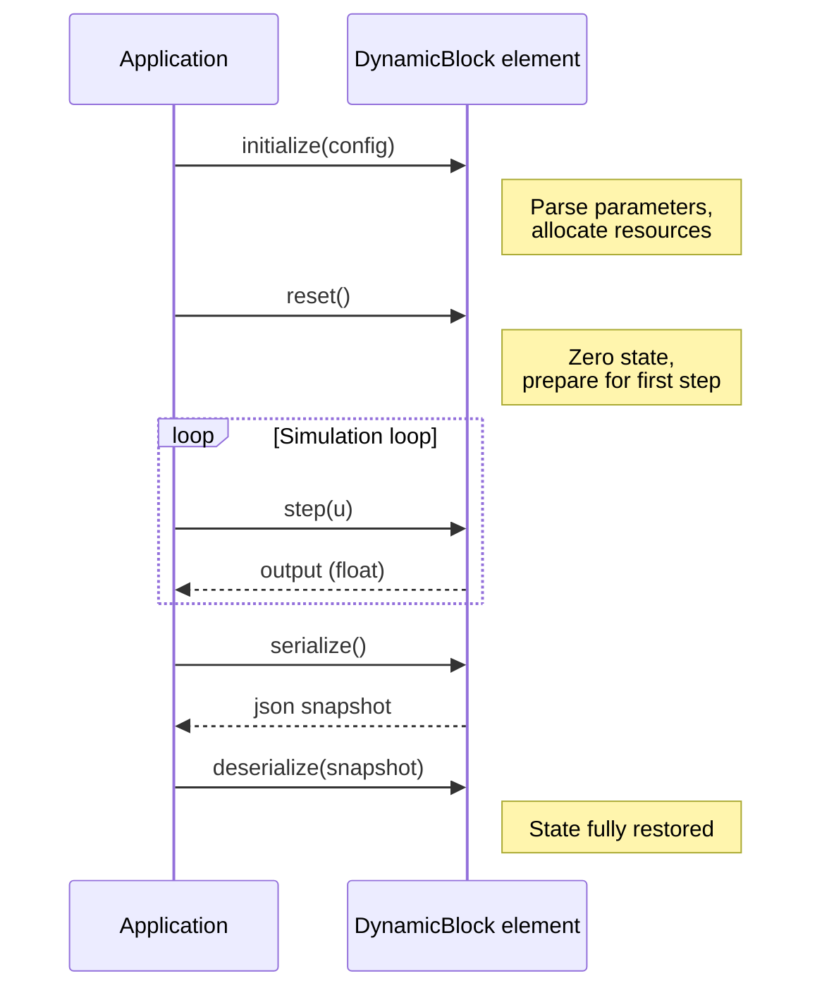
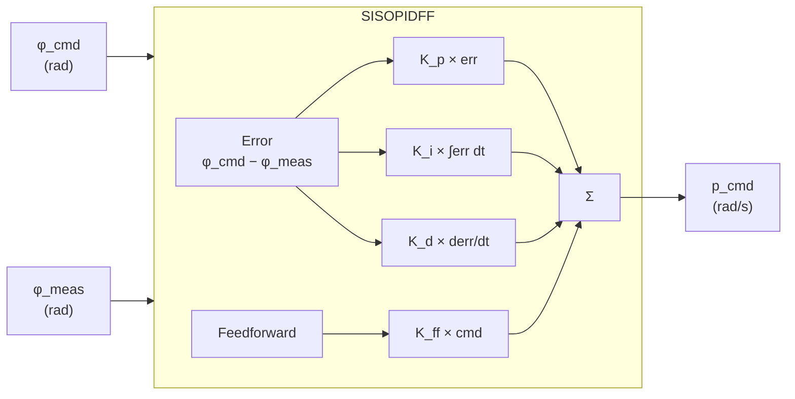

# Usage Examples — SISO Dynamic Elements

All examples use SI units throughout. Unit conversion, if required, happens at the call site in the interface layer — never inside the element itself.

---

## Lifecycle Pattern

Every `DynamicBlock` element follows the same four-phase lifecycle.



---

## Second-Order Low-Pass Filter

### Configuration

The filter is configured with a natural frequency $\omega_n$ in rad/s and damping ratio $\zeta$.

| Parameter | SI Unit | Typical Value |
|---|---|---|
| `design` | — | `"low_pass_second"`, `"low_pass_first"`, … |
| `dt_s` | s | 0.01 (100 Hz) |
| `wn_rad_s` | rad/s | $2\pi \cdot f_c$ |
| `zeta` | — (dimensionless) | 0.7071 (Butterworth) |
| `tau_zero_s` | s | 0.0 (no zero) |

### Code

```cpp
#include "control/FilterSS2.hpp"
#include <nlohmann/json.hpp>

using namespace liteaerosim::control;

// --- Initialize ---
nlohmann::json config = {
    {"design",     "low_pass_second"},
    {"dt_s",       0.01},
    {"wn_rad_s",   12.566},   // 2*pi*2 Hz cutoff
    {"zeta",       0.7071},   // Butterworth (maximally flat)
    {"tau_zero_s", 0.0}
};

FilterSS2 lpf;
lpf.initialize(config);
lpf.reset();

// --- Step ---
for (auto& sample : signal_samples) {
    float filtered = lpf.step(sample);
    // use filtered output ...
}

// --- Save state ---
nlohmann::json snapshot = lpf.serialize();

// --- Restore state ---
FilterSS2 restored;
restored.initialize(config);
restored.deserialize(snapshot);
```

### Frequency Response

For a 2nd-order Butterworth low-pass filter with $\omega_n = 2\pi \cdot 2\,\text{Hz}$:

$$
H(s) = \frac{\omega_n^2}{s^2 + \sqrt{2}\,\omega_n s + \omega_n^2}
$$

DC gain: $H(0) = 1.0$ (unity). Magnitude at $\omega_n$: $-3\,\text{dB}$.

---

## Integrator

The integrator accumulates its input over time. An optional `Limit` member can clamp the integrated value.

### Configuration

| Parameter | SI Unit | Notes |
|---|---|---|
| `dt_s` | s | Fixed timestep; used to scale accumulated value |
| `method` | — | `"bilinear"`, `"forward_euler"`, `"backward_euler"` |
| `lower_limit` | (same as output) | Optional; omit to disable |
| `upper_limit` | (same as output) | Optional; omit to disable |

### Code

```cpp
#include "control/Integrator.hpp"

using namespace liteaerosim::control;

nlohmann::json config = {
    {"dt_s",        0.01},
    {"method",      "bilinear"},
    {"lower_limit", -0.5236},   // -30 deg in rad
    {"upper_limit",  0.5236}    //  30 deg in rad
};

Integrator integrator;
integrator.initialize(config);
integrator.reset();

float error = target_rad - measured_rad;
float accumulated = integrator.step(error);
```

---

## PID Control Loop — ControlRoll

`ControlRoll` wraps a `SISOPIDFF` and accepts a roll command and the vehicle's `KinematicState` as inputs.

### Signal Flow



### Configuration

```json
{
    "kp": 2.5,
    "ki": 0.4,
    "kd": 0.1,
    "kff": 0.0,
    "output_lower_limit_rad_s": -1.0472,
    "output_upper_limit_rad_s":  1.0472,
    "integrator_lower_limit_rad_s": -0.5236,
    "integrator_upper_limit_rad_s":  0.5236
}
```

### Code

```cpp
#include "control/ControlRoll.hpp"
#include "KinematicState.hpp"

using namespace liteaerosim::control;

ControlRoll roll_ctrl;
roll_ctrl.initialize(config);
roll_ctrl.reset();

// Inside the simulation loop:
float roll_cmd_rad    = 0.3491f;   // 20 deg
float roll_rate_cmd_rad_s = roll_ctrl.step(roll_cmd_rad, kinematic_state, dt_s);
```

---

## Serialization — Save and Restore Scenario State

Serialization allows a complete simulation state to be paused and resumed, or replayed deterministically.

```cpp
// --- Pause: collect state from all elements ---
nlohmann::json scenario_state = {
    {"schema_version", 1},
    {"lpf",         lpf.serialize()},
    {"integrator",  integrator.serialize()},
    {"roll_ctrl",   roll_ctrl.serialize()}
};

// Write to file (interface layer — this is the I/O boundary)
std::ofstream file("scenario_state.json");
file << scenario_state.dump(2);

// --- Resume: restore all element states ---
std::ifstream file_in("scenario_state.json");
nlohmann::json loaded;
file_in >> loaded;

lpf.deserialize(loaded.at("lpf"));
integrator.deserialize(loaded.at("integrator"));
roll_ctrl.deserialize(loaded.at("roll_ctrl"));
```

---

## Attaching a Logger

```cpp
#include "logger/CsvLogger.hpp"   // concrete implementation

using namespace liteaerosim::control;

CsvLogger logger("flight_log.csv");

lpf.attachLogger(&logger);
integrator.attachLogger(&logger);

// From this point, every step() call writes to the CSV automatically.
// Each element's onLog() implementation defines its channel names.
for (auto& sample : signal_samples) {
    lpf.step(sample);
    integrator.step(lpf.out());
}

// Detach when done
lpf.attachLogger(nullptr);
integrator.attachLogger(nullptr);
```

---

## Unit Conversion — Interface Layer Only

Unit conversion is never done inside a `DynamicBlock`. It happens only when data enters or leaves the domain layer.

```cpp
// Interface layer — config file parsing
#include "units/conversion.hpp"

using namespace liteaerosim::units;

nlohmann::json raw_config = load_json("roll_ctrl_config.json");

// Config file uses degrees and Hz for human readability.
// Convert to SI before passing to initialize().
nlohmann::json si_config = {
    {"kp",                             raw_config["kp"]},
    {"ki",                             raw_config["ki"]},
    {"kd",                             raw_config["kd"]},
    {"output_lower_limit_rad_s",       deg_to_rad(raw_config["output_lower_limit_deg_s"])},
    {"output_upper_limit_rad_s",       deg_to_rad(raw_config["output_upper_limit_deg_s"])},
    {"wn_rad_s",                       hz_to_rad_s(raw_config["cutoff_hz"])}
};

roll_ctrl.initialize(si_config);
```

---

## Extensibility — Implementing a New DynamicBlock

Adding a new SISO element requires implementing the six `on*()` hooks and `schemaVersion()`. The base class handles the rest.

```cpp
// include/control/MyCustomFilter.hpp
#pragma once
#include "DynamicBlock.hpp"

namespace liteaerosim::control {

class MyCustomFilter : public liteaerosim::DynamicBlock {
public:
    MyCustomFilter() = default;

protected:
    void onInitialize(const nlohmann::json& config) override {
        tau_s_ = config.at("tau_s").get<float>();
        dt_s_  = config.at("dt_s").get<float>();
        alpha_ = dt_s_ / (tau_s_ + dt_s_);
    }

    void onReset() override {
        state_ = 0.0f;
    }

    float onStep(float u) override {
        state_ += alpha_ * (u - state_);
        return state_;
    }

    nlohmann::json onSerialize() const override {
        return {
            {"tau_s",   tau_s_},
            {"dt_s",    dt_s_},
            {"state",   state_}
        };
    }

    void onDeserialize(const nlohmann::json& j) override {
        tau_s_  = j.at("tau_s").get<float>();
        dt_s_   = j.at("dt_s").get<float>();
        state_  = j.at("state").get<float>();
        alpha_  = dt_s_ / (tau_s_ + dt_s_);
    }

    void onLog(liteaerosim::ILogger& logger) const override {
        logger.log("MyCustomFilter.in",    in_);
        logger.log("MyCustomFilter.out",   out_);
        logger.log("MyCustomFilter.state", state_);
    }

    int schemaVersion() const override { return 1; }
    const char* typeName() const override { return "MyCustomFilter"; }

private:
    float tau_s_  = 1.0f;
    float dt_s_   = 0.01f;
    float alpha_  = 0.0f;
    float state_  = 0.0f;
};

} // namespace liteaerosim::control
```

### Corresponding Test (TDD — write this first)

```cpp
// test/control/MyCustomFilter_test.cpp
#include <gtest/gtest.h>
#include "control/MyCustomFilter.hpp"

using namespace liteaerosim::control;

class MyCustomFilterTest : public ::testing::Test {
protected:
    void SetUp() override {
        filter_.initialize({{"tau_s", 1.0}, {"dt_s", 0.01}});
        filter_.reset();
    }
    MyCustomFilter filter_;
};

TEST_F(MyCustomFilterTest, Step_ZeroInput_OutputIsZero) {
    EXPECT_NEAR(filter_.step(0.0f), 0.0f, 1e-9f);
}

TEST_F(MyCustomFilterTest, Step_ConstantInput_ConvergesToInput) {
    for (int k = 0; k < 2000; k++) filter_.step(1.0f);
    EXPECT_NEAR(filter_.out(), 1.0f, 1e-3f);
}

TEST_F(MyCustomFilterTest, Serialize_Deserialize_RoundTrip) {
    for (int k = 0; k < 20; k++) filter_.step(1.0f);
    const auto snapshot = filter_.serialize();
    MyCustomFilter restored;
    restored.initialize({{"tau_s", 1.0}, {"dt_s", 0.01}});
    restored.deserialize(snapshot);
    EXPECT_EQ(filter_.serialize(), restored.serialize());
}

TEST_F(MyCustomFilterTest, Deserialize_BadSchemaVersion_Throws) {
    auto bad = filter_.serialize();
    bad["schema_version"] = 999;
    EXPECT_THROW(filter_.deserialize(bad), std::runtime_error);
}
```
