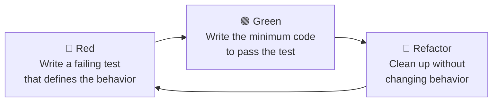
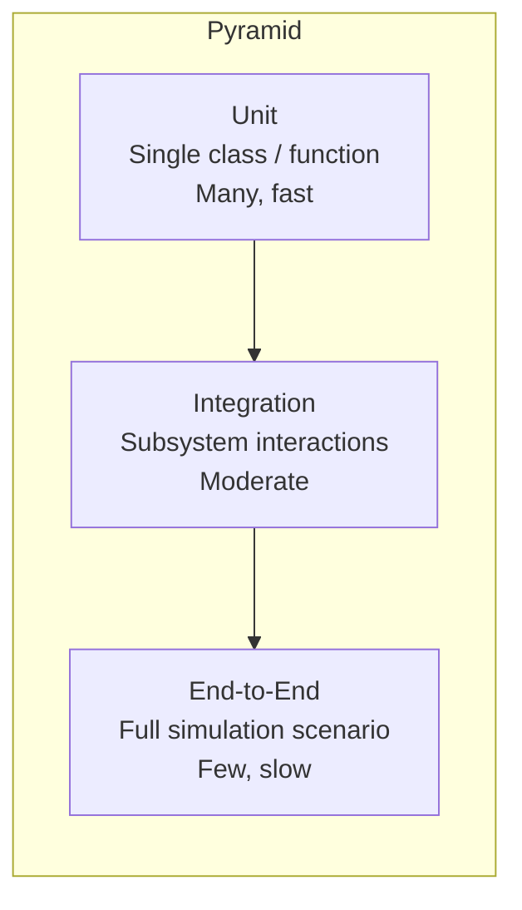

# Testing Strategy

## Philosophy

All production code in LiteAeroSim is written using **Test-Driven Development (TDD)**. Tests are not written after the fact — they define the expected behavior before a line of production code exists.



## Test Pyramid



The majority of tests are **unit tests**. Integration and end-to-end tests are added only when unit tests cannot adequately cover the behavior.

## C++ Test Structure

### Framework

- **Google Test** (`gtest`) for assertions and test registration
- **Google Mock** (`gmock`) for mock objects and dependency injection
- Test binary: `liteaerosim_test` (built from `test/*_test.cpp`)
- Runner: `ctest` via CMake

### File Naming

| Source file | Test file |
| --- | --- |
| `src/control/FilterSS2.cpp` | `test/FilterSS2_test.cpp` |
| `src/navigation/WGS84.cpp` | `test/navigation/WGS84_test.cpp` |

### Test Naming Convention

```text
TEST(ClassNameTest, MethodName_Condition_ExpectedOutcome)
```

Examples:

- `TEST(FilterSS2Test, StepOutput_ZeroInput_ReturnsZero)`
- `TEST(FilterSS2Test, Serialize_Deserialize_RoundTrip)`
- `TEST(FilterSS2Test, Deserialize_UnknownSchemaVersion_Throws)`

### Standard Test Fixture

```cpp
class FilterSS2Test : public ::testing::Test {
protected:
    void SetUp() override {
        filter_.initialize(default_config_);
    }

    FilterSS2 filter_;
    nlohmann::json default_config_ = {
        {"design",     "low_pass_second"},
        {"dt_s",       0.01},
        {"wn_rad_s",   6.2832},
        {"zeta",       0.7071},
        {"tau_zero_s", 0.0}
    };
};
```

## Required Tests per Class

Every `DynamicBlock` subclass must have tests covering each of the following categories.

### 1. Construction and Initialization

```cpp
TEST_F(FilterSS2Test, DefaultConstruct_OutputIsZero) { ... }
TEST_F(FilterSS2Test, Initialize_ValidConfig_NoThrow) { ... }
TEST_F(FilterSS2Test, Initialize_InvalidConfig_Throws) { ... }
```

### 2. Steady-State Behaviour

Verify the DC gain. For a unity-gain low-pass filter driven by a constant input for sufficient time, the output must converge to the input:

$$
\lim_{k \to \infty} y_k = u \cdot G_{DC}
$$

```cpp
TEST_F(FilterSS2Test, StepResponse_ConstantInput_ConvergesToDCGain) {
    filter_.initialize(config_with_unity_dc_gain);
    for (int k = 0; k < 1000; k++) {
        filter_.step(1.0f);
    }
    EXPECT_NEAR(filter_.out(), 1.0f, 1e-4f);
}
```

### 3. Reset

```cpp
TEST_F(FilterSS2Test, Reset_AfterStepping_OutputReturnsToInitial) {
    for (int k = 0; k < 50; k++) filter_.step(1.0f);
    filter_.reset();
    EXPECT_NEAR(filter_.out(), 0.0f, 1e-9f);
}
```

### 4. Serialization Round-Trip

This test is **mandatory** for every `DynamicBlock` subclass.

```cpp
TEST_F(FilterSS2Test, Serialize_Deserialize_RoundTrip) {
    // Drive to a non-trivial state
    for (int k = 0; k < 20; k++) filter_.step(1.0f);

    const nlohmann::json snapshot = filter_.serialize();

    FilterSS2 restored;
    restored.initialize(default_config_);
    restored.deserialize(snapshot);

    EXPECT_EQ(filter_.serialize(), restored.serialize());
}
```

### 5. Schema Version Rejection

```cpp
TEST_F(FilterSS2Test, Deserialize_UnknownSchemaVersion_ThrowsRuntimeError) {
    nlohmann::json bad = filter_.serialize();
    bad["schema_version"] = 9999;
    EXPECT_THROW(filter_.deserialize(bad), std::runtime_error);
}
```

### 6. Floating-Point Comparisons

Always use `EXPECT_NEAR` with an explicit tolerance. Never use `EXPECT_EQ` for floats.

```cpp
// Good
EXPECT_NEAR(filter_.out(), expected, 1e-6f);

// Bad — do not do this
EXPECT_EQ(filter_.out(), expected);
```

Choose the tolerance based on the physics:

- Exact algebraic results: `1e-9f`
- Discretization / iteration convergence: `1e-4f` to `1e-6f`
- Long-horizon integration: `1e-3f` or wider with justification

## Python Test Structure

### Framework — Python

- **pytest** for test discovery and assertion
- **pytest-cov** for coverage
- Test files: `test/test_*.py`

### Running Tests

```bash
pytest --cov=las --cov-report=term-missing
```

### Required Tests per Class — Python

Same categories as C++: initialization, steady-state, reset, serialization round-trip, schema version rejection.

```python
def test_serialize_deserialize_round_trip(controller: RollController) -> None:
    for _ in range(20):
        controller.step(0.1)
    snapshot = controller.serialize()

    restored = RollController()
    restored.initialize(default_config)
    restored.deserialize(snapshot)

    assert controller.serialize() == restored.serialize()


def test_deserialize_rejects_unknown_schema_version(controller: RollController) -> None:
    bad = controller.serialize()
    bad["schema_version"] = 9999
    with pytest.raises(ValueError, match="schema version"):
        controller.deserialize(bad)
```

## Known Failures

The following tests are **pre-existing failures** unrelated to current development. They are tracked here until addressed.

| Test | Root Cause | Fix Required In |
| --- | --- | --- |
| `TableAxisTest.Read00` | `readJSON` calls `json::parse` without exception handling; throws on empty stream | `include/control/TableAxis.hpp` |
| `RectilinearTableTest.Read00` | `readFile("foo.json")` on non-existent file throws uncaught `json::parse_error` | `RectilinearTable` implementation |
| `GainTest.Read00` | Same `json::parse` exception pattern | `Gain` implementation |
| `FilterTFTest.FirstOrderLP00` | `tustin_n_tf` is unimplemented (TODO stub returning identity) | `src/control/filter_realizations.cpp` |
| `FilterTFTest.SecondOrderLP00` | Same root cause as above | `src/control/filter_realizations.cpp` |

## Coverage Requirements

| Layer | Minimum Coverage |
| --- | --- |
| Domain Layer (physics, control, guidance) | 90% line coverage |
| Infrastructure (math, serialization) | 95% line coverage |
| Interface Layer (config parsing, display) | 70% line coverage |

Coverage is measured per CI run. New code that reduces coverage below threshold blocks merge.
